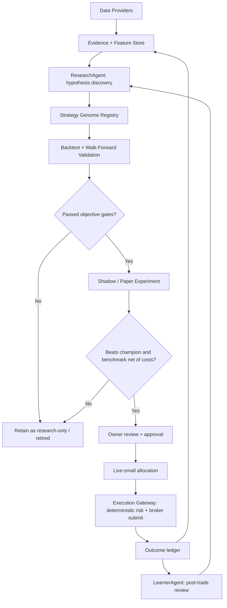

# 07/08 Strategic Agentic Trading Review — Kairos / FinanceOS

Reviewer: ChatGPT / Codex  
Date: 2026-07-08  
Scope: Strategic product, architecture, learning-loop, agent-coordination, and profit-readiness review. This file is intentionally separate from `07_08_FULL_APP_REVIEW.md`, which contains mechanical security/correctness fixes Claude can start implementing first.

## Executive verdict

Kairos is no longer a toy app. The system has many pieces of a serious personal agentic trading platform: evidence-ledgered research, paper trading, strategy versions, validation experiments, decision journals, live execution gateways, Robinhood/Kite broker paths, RAG memory, portfolio gates, kill switches, and multi-agent workflows.

But it is not yet a self-evolving profit machine. It is closer to a governed research and execution platform with early learning features.

The biggest strategic issue is that the app can look agentic before it is truly adaptive. Today it can research, score, paper trade, log outcomes, and propose weight changes. That is useful. But “self-evolving and makes me profit” requires stronger evidence loops:

- robust walk-forward validation before promotion;
- real experiment design, not just score/weight nudging;
- benchmark-relative performance tracking net of slippage and costs;
- regime-conditioned behavior;
- reliable data-provider coverage;
- strict autonomy levels before live automation;
- and proof that changes improve future out-of-sample results, not just past fit.

The right target is not “LLM trades autonomously.” The right target is “LLM discovers hypotheses and explains decisions; deterministic engines validate, size, gate, execute, and audit them.” That is how this becomes safer and more profitable.

## Bottom-line answer to Vaibhav’s real question

### Does the app self-evolve today?

Partially.

It has the beginnings of self-evolution:

- LearnerAgent reads outcomes.
- Strategy versions exist.
- Challenger/champion concepts exist.
- Validation engine exists.
- Shadow strategy records exist.
- RAG memories exist.
- ResearchAgent can consume champion weights and similar prior trades.

But the evolution is still narrow. The current learning loop mostly adjusts strategy weights and records memories. A world-class trading agent must evolve more than five or ten weights. It must evolve:

- universe selection;
- feature set;
- signal thresholds;
- entry rules;
- exit rules;
- holding horizon;
- sizing rules;
- market/regime-specific variants;
- source reliability priors;
- and abstention behavior.

### Does it learn in a way that can make money?

Not proven yet.

The app is building the right evidence infrastructure, but it still needs a stronger proof layer. A system is not “learning” because it updates weights. It is learning only if the updates improve future out-of-sample results after transaction costs, slippage, liquidity constraints, and benchmark comparison.

### Can it eventually trade autonomously?

Yes, but only through an autonomy ladder.

The app should absolutely be designed so it can eventually place live trades on your behalf after it proves consistent performance. But the current safety rule should be:

> No autonomous live trading until the system has demonstrated repeatable positive expectancy in paper/shadow/live-small modes and the exact autonomy envelope has been owner-approved.

That is not anti-agentic. That is how you avoid letting a stochastic model accidentally become an unbounded money-moving system.

### Is it currently the best agentic algo trading platform?

No.

It has a strong foundation for a personal trading OS, but it is not yet best-in-class. The main gap is not UI volume or number of agents. The gap is scientific discipline: reliable data, controlled experiments, benchmarked performance, walk-forward validation, and promotion rules that cannot be bypassed casually.

## What is genuinely strong

| Area | Current strength | Why it matters |
|---|---|---|
| Evidence-first direction | Decision observations, labels, quality gates, append-only event concepts | Prevents the system from silently inventing evidence |
| Broker gateway hardening | Live broker routes increasingly enforce owner gate, caps, fresh quotes, kill switches, and duplicate protection | Correct place to centralize live-money safety |
| Paper/live separation | Paper trading, shadow strategies, and live approval paths are separated | Essential for learning without risking capital |
| Strategy lifecycle foundation | Champion/challenger, strategy versions, validation experiments | Correct direction for evolution |
| RAG memory | Prior closed trades and documents can inform future decisions | Useful if treated as context, not proof |
| India + US intent | Separate Kite and Robinhood pathways exist | Good ambition, but needs stronger market-specific validation |
| Owner control | Human approval is increasingly built into live paths | Correct for current maturity level |

## What is still weak or misleading

| Weakness | Why it matters | Required correction |
|---|---|---|
| Learning loop is too narrow | Weight changes alone are not true strategy evolution | Add a broader learnable genome: thresholds, exits, horizons, universe filters, sizing, abstention |
| LLM may appear smarter than the evidence | LLM explanations can sound confident even when data is thin | UI must separate evidence, inference, and speculation |
| Validation can still be bypassed | A bad strategy can be promoted if manual/force paths are too permissive | Make unvalidated promotion impossible for live eligibility |
| Performance is not yet benchmark-scientific | “Profit” without SPY/NIFTY comparison can be luck or market beta | Add net-of-cost alpha dashboard by strategy, regime, market, and horizon |
| Data providers are fragile | Free APIs have rate limits, missing fundamentals, stale quotes, and inconsistent India coverage | Add provider health, freshness, source confidence, and paid-minimum plan |
| Too many agents can hide weak ownership | Many agents do not equal cohesive intelligence | Define ownership boundaries and contracts between agents |
| Paper fills can overstate quality | Paper execution often ignores liquidity, spreads, slippage, partial fills | Add realistic fill simulator before trusting paper profits |
| India and US are different games | Same logic across markets can mis-score due to liquidity, settlement, currency, taxes, and data quality | Market-specific feature applicability and validation cohorts |

## Strategic blocker list

Ranked by whether the issue can cause false confidence, money loss, or fake learning.

| Rank | Severity | Area | Problem | Fix |
|---|---|---|---|---|
| S0 | Critical | Security/correctness | Several API/security and migration issues are already documented in `07_08_FULL_APP_REVIEW.md` | Fix those first before expanding autonomy |
| S1 | Critical | Autonomy model | No explicit autonomy ladder defines when the agent may move from advisory to paper to live-small to autonomous-live | Add `autonomy_level` states and hard enforcement in broker gateway |
| S2 | Critical | Learning science | LearnerAgent evolution is still too close to weight nudging | Introduce optimizer-owned walk-forward validation and richer strategy genomes |
| S3 | High | Strategy promotion | Challenger promotion can be manually forced too easily compared with the seriousness of live trading | Require validation experiment pass before live eligibility; manual override may only keep advisory/paper eligibility |
| S4 | High | Performance proof | No single source of truth proves alpha net of costs versus benchmarks | Build strategy performance scoreboard: SPY/QQQ/IWM for US, NIFTY/SENSEX or relevant sector ETF/index for India |
| S5 | High | Data quality | Free-provider failures can degrade research silently or bias selection | Add provider freshness/confidence per feature and abstain when critical evidence is missing |
| S6 | High | Paper realism | Paper trading can create fake confidence if fills assume perfect execution | Add bid/ask spread, slippage, liquidity, partial-fill, and next-bar execution simulation |
| S7 | Medium | Agent cohesion | Many agents exist, but responsibilities overlap and some are advisory without strong downstream contracts | Add agent contract docs and route-level invariants |
| S8 | Medium | Market regimes | MacroSentinel is advisory and strategies are not clearly regime-conditioned | Track performance by regime; allow regime-specific strategy variants only after evidence |
| S9 | Medium | Explainability | Decision journal explains what happened, but not always what would falsify the thesis | Add invalidation conditions to every trade proposal |
| S10 | Medium | Tax/dividend reality | Ex-dividend/tax concerns are recognized but not fully part of scoring/sizing/exit logic | Add tax/dividend calendar service as advisory evidence; never let it dominate without total-return math |

## Agent-by-agent strategic assessment

| Agent / subsystem | Current role | Strategic assessment | Required next step |
|---|---|---|---|
| ResearchAgent | Screens/researches candidates and writes signals | Strong foundation, but must avoid “parameter soup.” More indicators do not mean better decisions. It needs feature applicability, source confidence, and ablation-tested features. | Split features into required/core/contextual. Track which features actually add predictive value by market and horizon. |
| AnalystAgent / signal scoring | Converts evidence into recommendations | Useful, but score confidence must not be confused with expected return. | Add calibrated probability/expected-return estimates and confidence intervals. |
| PaperTrader | Converts signals into simulated positions | Valuable, but paper success can be fake if execution is unrealistic. | Add slippage, spread, liquidity, partial-fill, stale quote rules, and benchmark comparison. |
| PositionMonitor | Handles stop/target/trailing exits | Necessary, but exits should be learned and validated, not hardcoded forever. | Treat exit rules as part of strategy genome; validate trailing/stop/target combinations. |
| LearnerAgent | Reviews outcomes and proposes changes | Directionally right but not yet world-class. Correlation/weight nudging is too weak as primary credit assignment. | LLM should propose hypotheses/features; optimizer should tune parameters using walk-forward validation. |
| Validation Engine | Tests challenger vs champion | Correct subsystem to have. Strategic concern is whether it is mandatory everywhere it matters. | Make validation pass mandatory for live eligibility. No `force_unvalidated` for live. |
| Strategy Registry | Holds champion/challenger states | Good architecture. | Expand lifecycle with explicit `research_only`, `paper_candidate`, `shadow_live`, `live_small`, `live_scaled`, `retired`. |
| Trader / Execution Gateway | Live broker choke point | Correct safety architecture. This is where all money movement must remain deterministic. | Add autonomy-level enforcement and keep LLMs out of order payload construction. |
| Robinhood MCP adapter | US live broker integration | Correct idea: deterministic callTool path, not LLM-generated orders. | Finish OAuth/token path only from verified Robinhood metadata; never guess endpoints. |
| Kite/Zerodha adapter | India live broker integration | Correct target for India, but must have market/currency-specific caps and quote freshness. | Keep parity with US gateway and test currency/cap behavior. |
| MacroSentinel | Market regime advisory | Useful but not yet strategy-controlling. | Track strategy performance by macro regime before allowing regime-conditioned behavior. |
| ThemeScout | Finds market themes | Useful discovery agent, but can create hype-driven watchlist drift. | Require theme evidence decay, source attribution, and performance tracking by theme. |
| DeepSeek/Groq/LLM router | Alternative model routes | Good for cost and redundancy, but model diversity is not trading intelligence by itself. | Evaluate models by decision quality, not just availability or cheaper tokens. |
| Mentor/Coach | Explains decisions to user | Good product feature. | Must clearly label evidence vs inference vs speculation. |
| RAG / memory | Retrieves past trades and documents | Useful context. Dangerous if treated as proof. | Use RAG as hypothesis/context only; validation engine decides promotion. |

## What “self-evolving” should mean in this app

Self-evolving should not mean the LLM freely changes production settings or places trades. It should mean:

1. The system observes outcomes.
2. It identifies which decision features helped or hurt.
3. It proposes new hypotheses or variants.
4. It tests them in shadow/paper.
5. It validates them out-of-sample.
6. It promotes only if they beat the current champion and benchmark.
7. It explains to you what changed, why, and what evidence supports it.
8. It rolls back automatically if degradation appears.

That is real evolution.

The LLM’s best role:

- discover candidate features;
- summarize filings/news/social/macro context;
- propose strategy variants;
- explain decisions;
- identify failure modes;
- generate research questions.

The deterministic/statistical engine’s best role:

- fetch prices/fundamentals;
- compute indicators;
- run backtests/walk-forward tests;
- size positions;
- enforce risk;
- execute orders;
- audit outcomes;
- decide whether a strategy passed objective gates.

## What the best quant/agent systems do differently

Best systems do not just “ask an LLM what to buy.” They build a research factory:

| Best-practice capability | Current Kairos status | Gap |
|---|---|---|
| Clean point-in-time data | Partial | Needs stronger vintage/freshness/source-confidence tracking |
| Feature store | Partial | Needs versioned features with applicability by asset class/market |
| Experiment registry | Partial | Strategy versions and validation experiments exist, but promotion governance must be stricter |
| Walk-forward validation | Partial | Engine exists; must become mandatory for promotion |
| Benchmark-relative alpha | Weak/partial | Need net-of-cost alpha and drawdown versus benchmarks |
| Slippage/liquidity model | Weak | Paper trading needs realistic execution |
| Regime-conditioned evaluation | Weak | Track by macro/vol/rate/liquidity regimes before using regime switches |
| Risk engine separate from alpha engine | Improving | Keep broker gateway deterministic and non-LLM |
| Human-readable audit trail | Strong direction | Improve falsification and evidence/inference labeling |
| Safe autonomy ladder | Missing | Must be explicit before autonomous trading |

## Recommended target architecture

Core rule: the LLM participates in discovery and explanation. It does not directly mutate money limits, bypass validation, construct live order payloads, or approve its own promotion.

## Autonomy ladder required before live autonomous trading

This app should support autonomous trading eventually. It should not jump there directly.

| Level | Name | What agent can do | Human role | Required evidence |
|---|---|---|---|---|
| L0 | Research-only | Research, score, explain | Review only | None |
| L1 | Paper auto | Place paper trades | Review results | Safe paper execution |
| L2 | Shadow live | Make live recommendations and shadow hypothetical fills | Approves no trades | 30-90 days positive paper/shadow expectancy |
| L3 | Live manual | Draft live orders | Click approval per trade | Strategy beats benchmark net of costs |
| L4 | Live-small autonomous | Auto-place within tiny capped budget | Pre-approves strategy envelope | Validated champion, drawdown limits, kill switch, daily budget |
| L5 | Scaled autonomous | Larger allocation within hard caps | Periodic review and emergency controls | Long out-of-sample record across regimes |

The current app appears between L1 and L3 depending on path. It should not be treated as L4/L5 yet.

## Profit-readiness scorecard

| Dimension | Current status | Readiness |
|---|---|---|
| Can research stocks | Yes | Medium |
| Can avoid fake/no-data decisions | Partially | Medium |
| Can paper trade | Yes | Medium |
| Can simulate realistic fills | Limited | Low |
| Can learn from outcomes | Partially | Low/Medium |
| Can validate challengers | Partially | Medium if mandatory; low if bypassed |
| Can prove benchmark alpha | Not yet enough | Low |
| Can safely place live orders | Improving | Medium after mechanical fixes |
| Can autonomously trade live | Not yet | Low |
| Can reliably make profit | Not proven | Unknown |

Important: no architecture can guarantee profit. The right question is whether Kairos can build positive expectancy and prove it before risking capital. Today it has the scaffolding. It does not yet have the proof.

## US and India pipeline assessment

### US pipeline

US coverage is stronger because Robinhood/Massive/Alpha Vantage/FMP/EODHD-style sources are more directly aligned with US equities and ETFs.

Primary gaps:

- provider rate limits and fallback consistency;
- live account resolution must stay exact;
- benchmark comparison must be US-specific;
- tax/dividend logic should be total-return aware;
- paper fills must model US spreads/liquidity.

### India pipeline

India support is strategically valuable but more fragile.

Primary gaps:

- INR/USD cap separation must remain strict;
- Kite live path must have parity with US risk controls;
- NSE/BSE data quality and symbol mapping must be explicit;
- India-specific liquidity/spread/slippage assumptions are required;
- benchmark comparison must use NIFTY/SENSEX/sector indices, not US proxies;
- tax/STT/charges can materially change short-term strategy profitability.

Do not assume a US-tested strategy works in India. Validate separately.

## Data and parameter strategy

The app should not keep adding every possible indicator. Too many weak parameters increase overfitting and reduce trust.

Recommended structure:

| Feature class | Use | Rule |
|---|---|---|
| Core price/volume/trend | Required for most equities | Must be fresh and non-LLM-sourced |
| Fundamentals | Required for swing trades beyond pure momentum | Must be source-attributed and dated |
| Sentiment/news | Contextual | Never dominate unless historically validated |
| Insider/institutional/smart money | Contextual | Useful but must be lag-aware |
| Macro/regime | Portfolio/context gate | Do not overfit explicit bull/bear switches yet |
| Tax/dividend | Advisory/total-return modifier | Must include price drop and tax impact, not just ex-dividend capture |
| RAG memories | Context | Cannot substitute for statistical evidence |

Parameters should evolve only if validation shows they improve future results. A parameter that sounds smart but has no out-of-sample lift should be removed or downweighted.

## Tax and ex-dividend logic

The user specifically wants the system to know ex-dividend dates and tax implications.

This should be added, but carefully:

- Ex-dividend capture is not free money; prices usually adjust.
- Taxes can make short-term dividend capture unattractive.
- India and US tax treatments differ materially.
- The model should use total return, not dividend yield alone.
- The system should flag opportunities, not blindly chase ex-dividend events.

Recommended implementation:

1. Add a dividend/tax evidence dimension with source, ex-date, payable date, dividend amount, estimated tax/withholding, and expected price adjustment.
2. Display it in the decision journal as a modifier.
3. Let validation determine whether dividend-aware entries improve outcomes.
4. Keep it advisory until enough evidence exists.

## What Claude should fix/build after the mechanical P0/P1 file

Do not start here until `07_08_FULL_APP_REVIEW.md` P0 issues are fixed.

### Strategic Build 1 — Autonomy ladder

Add an explicit `autonomy_level` setting and enforce it in every money path:

- L0 research-only;
- L1 paper auto;
- L2 shadow live;
- L3 live manual approval;
- L4 live-small autonomous;
- L5 scaled autonomous.

Live autonomous levels must require:

- owner opt-in;
- strategy allowlist;
- max daily budget;
- max per-order cap;
- kill switches;
- validation pass;
- benchmark alpha proof;
- and audit logging.

### Strategic Build 2 — Learning genome

Expand strategy versions beyond weights:

- feature weights;
- thresholds;
- required evidence dimensions;
- entry rules;
- exit rules;
- holding horizon;
- sizing rule;
- universe filters;
- abstention rules;
- market applicability;
- regime applicability.

Do not let the LLM directly mutate the active genome. It may propose a challenger. Validation promotes.

### Strategic Build 3 — Mandatory validation

Make validation required for promotion to live eligibility:

- no `force_unvalidated` for live;
- owner override can allow research/paper only;
- validation must compare against champion and benchmark;
- require minimum sample size and market-specific cohorts.

### Strategic Build 4 — Performance truth dashboard

Build a single strategy truth dashboard:

- realized/unrealized P&L;
- net of estimated costs/slippage;
- alpha versus benchmark;
- max drawdown;
- Sharpe/Sortino if sample size permits;
- hit rate;
- average win/loss;
- expectancy;
- calibration;
- by market;
- by strategy;
- by regime;
- by data-confidence bucket;
- by source-provider health bucket.

This is the dashboard that tells whether the agent is actually getting better.

### Strategic Build 5 — Realistic paper execution

Improve paper trading:

- no same-tick perfect fills unless explicitly modeled;
- use bid/ask or spread estimate;
- apply slippage;
- reject illiquid names;
- model partial fills;
- use next-bar/next-open assumptions depending on signal time;
- record expected versus realized execution quality.

### Strategic Build 6 — Data provider confidence layer

Every decision should know:

- which provider supplied each feature;
- when it was last updated;
- whether it was cached;
- whether the provider was degraded;
- whether the feature is applicable to US equity, US ETF, India equity, ADR, etc.;
- whether missing data forced abstention or fallback.

This prevents fake confidence from incomplete data.

## Things not to do

- Do not let an LLM construct live order payloads.
- Do not let an LLM approve its own strategy promotion.
- Do not let an LLM change money caps directly.
- Do not optimize on all historical trades without walk-forward validation.
- Do not count paper profits as proof until execution realism is improved.
- Do not mix US and India results into one undifferentiated performance score.
- Do not add more indicators unless they are source-attributed and later validated.
- Do not chase ex-dividend trades without total-return and tax math.

These are not anti-agentic constraints. They are what make autonomy survivable.

## Definition of “good enough to allow autonomous live trading”

Kairos should not be allowed to trade live autonomously until all of these are true:

1. Mechanical P0/P1 safety issues are fixed.
2. Strategy has at least one validated champion version.
3. Champion beats benchmark net of estimated costs in walk-forward validation.
4. Champion has paper/shadow results consistent with validation.
5. Drawdown stays within owner-approved limits.
6. Slippage/liquidity model is active.
7. Daily and per-order budgets are enforced atomically.
8. Kill switches are tested.
9. Broker account resolution is proven.
10. Owner explicitly opts into an autonomy level and budget.

Until then, the system should remain live-manual or paper-auto.

## Final assessment

Kairos has the right ambition and many correct building blocks. The main risk is mistaking complexity for intelligence. More agents, more indicators, and more LLM calls will not automatically make it better.

The path to a serious agentic trading OS is:

1. fix safety and correctness;
2. make paper/live performance truthful;
3. make learning scientifically valid;
4. expand the strategy genome;
5. enforce a strict autonomy ladder;
6. scale live autonomy only after measured evidence.

If Claude fixes the mechanical issues in `07_08_FULL_APP_REVIEW.md` and then implements the strategic items in this document, the app can become a credible personal quant research and execution system. It is not yet a proven profit-generating autonomous trader.

## Review limitations

- This review is based on static repository inspection and prior targeted code review in this session.
- I did not perform a fresh full browser/runtime click-through for this strategic file.
- I did not verify live broker behavior against real Robinhood/Kite production accounts.
- Supabase public-schema access was previously confirmed, but direct migration-schema verification through `psql` was not available in this environment.
- Profitability cannot be certified from architecture alone; it must be proven with forward paper/shadow/live-small results.
