# Kairos — C4 Architecture Documentation

> **Audience guide:**
> - Executives / product: §1 System Context only
> - Architects / engineers: §1 + §2 + §3
> - Senior engineers building agents: all sections
> - DevOps / infra: §4 Deployment

Last updated: 2026-07-09

---

## Table of Contents

1. [Level 1 — System Context](#1-level-1--system-context)
2. [Level 2 — Container Diagram](#2-level-2--container-diagram)
3. [Level 3 — Component Diagrams](#3-level-3--component-diagrams)
   - 3.1 Research Pipeline
   - 3.2 Paper Trading Subsystem
   - 3.3 Learning & Evolution Loop
   - 3.4 Money-Safety Gateway
   - 3.5 System Health Funnel
4. [Level 4 — Dynamic / Code-Level Flows](#4-level-4--dynamic--code-level-flows)
   - 4.1 A stock scored end-to-end
   - 4.2 Robinhood OAuth PKCE S256 flow
   - 4.3 Zerodha Kite daily login + GTT placement
   - 4.4 LearnerAgent tool-use loop
   - 4.5 RAG trade memory: write and read
   - 4.6 Live order through 9-gate safety funnel
5. [Deployment Diagram](#5-deployment-diagram)
6. [Architecture Decision Summary](#6-architecture-decision-summary)

---

## 1. Level 1 — System Context

Kairos is a **personal AI-powered trading OS** for one owner. It connects to market data providers,
two brokers, a vector AI service, an LLM platform, and an email service. Every interaction with
real money requires the owner to click "yes."

```mermaid
C4Context
  title Kairos — System Context

  Person(owner, "Owner", "The sole user. Approves live trades, promotes strategies, monitors health.")

  System(kairos, "Kairos", "AI-powered trading OS. Researches stocks, manages paper + live portfolios, learns from outcomes.")

  System_Ext(anthropic, "Anthropic / Claude", "LLM platform. Powers research thesis, coaching notes, learner brain.")
  System_Ext(groq, "Groq", "Fast LLM inference. Generates research thesis in <1s.")
  System_Ext(deepseek, "DeepSeek", "Reasoning LLM. Powers Challenger strategy proposals.")
  System_Ext(supabase, "Supabase (PostgreSQL + pgvector)", "All persistent state: portfolios, signals, strategies, trade memory.")
  System_Ext(vercel, "Vercel", "Hosts the Next.js app. Runs two cloud crons.")
  System_Ext(robinhood, "Robinhood", "US broker. Read-only monitoring account + agentic order account.")
  System_Ext(kite, "Zerodha Kite", "India broker. NSE/BSE real portfolio + order placement.")
  System_Ext(alphavantage, "Alpha Vantage", "US market data: price, technicals, fundamentals, macro, insider, news.")
  System_Ext(massive, "Massive Market Data", "US candles, screener, options flow.")
  System_Ext(fmp, "FinancialDatasets (FMP)", "US stock screener: momentum + value bucket candidates.")
  System_Ext(yahoo, "Yahoo Finance", "India .NS price, candles, fundamentals (free).")
  System_Ext(nse, "NSE Public JSON", "Full India equity universe, SEBI insider trades, option chain.")
  System_Ext(voyage, "Voyage AI", "voyage-3.5 embeddings + rerank-2. Powers trade memory RAG.")
  System_Ext(langfuse, "Langfuse", "LLM trace + generation observability.")
  System_Ext(resend, "Resend", "Transactional email. Morning + evening briefings.")

  Rel(owner, kairos, "Views dashboard, approves live orders, promotes strategies", "HTTPS browser")
  Rel(kairos, anthropic, "Coaching notes, learner brain, health triage", "HTTPS / Anthropic SDK")
  Rel(kairos, groq, "Research thesis generation (fast, 512 tokens)", "HTTPS / Groq SDK")
  Rel(kairos, deepseek, "Challenger proposals, parallel screener", "HTTPS / DeepSeek API")
  Rel(kairos, supabase, "All reads and writes — signals, trades, strategies, memory", "HTTPS / Supabase SDK")
  Rel(kairos, vercel, "Deployed on; receives cron triggers", "Vercel platform")
  Rel(kairos, robinhood, "Read positions (monitoring), place orders (agentic account)", "Robinhood MCP / JSON-RPC")
  Rel(kairos, kite, "Read India holdings, place NSE orders, place GTT brackets", "Kite Connect v3 / HTTPS")
  Rel(kairos, alphavantage, "Price, RSI, EMA, OVERVIEW, NEWS_SENTIMENT, insider, macro", "HTTPS / REST")
  Rel(kairos, massive, "US candles, screener, options flow", "HTTPS / REST")
  Rel(kairos, fmp, "screen_stocks: momentum + value bucket", "HTTPS / REST")
  Rel(kairos, yahoo, "India .NS price + quoteSummary fundamentals", "HTTPS / REST (no auth)")
  Rel(kairos, nse, "EQUITY_L.csv, insider trades, option chain (cookie handshake)", "HTTPS / REST")
  Rel(kairos, voyage, "Embed closed trade setups; rerank retrieved memories", "HTTPS / Voyage SDK")
  Rel(kairos, langfuse, "Trace every LLM call: model, tokens, cost, tool calls", "HTTPS / Langfuse SDK")
  Rel(kairos, resend, "Send morning + evening briefing emails", "HTTPS / Resend API")
```

### Context narrative

| Actor | Role in the system |
|---|---|
| **Owner** | The only human. Views the dashboard, approves every live order, clicks "Promote" to change the live strategy. |
| **Kairos** | Runs on Vercel. 12 AI agents scheduled via Vercel crons (2) and Windows Task Scheduler (14). All agents communicate through Supabase tables — no direct agent-to-agent HTTP calls. |
| **Supabase** | The single source of truth. All state — signals, paper trades, live orders, strategies, RAG memory, system health — lives here. |
| **Anthropic / Groq / DeepSeek** | LLM providers. Scoring is always deterministic (no LLM). LLMs write thesis text, coaching notes, and propose strategy changes. |
| **Robinhood / Kite** | Brokers. Real money never moves without the owner clicking send. |

---

## 2. Level 2 — Container Diagram

```mermaid
C4Container
  title Kairos — Container Diagram

  Person(owner, "Owner", "Sole user")

  Container_Boundary(kairos_app, "Kairos (Next.js 15 on Vercel)") {

    Container(dashboard, "Dashboard UI", "Next.js App Router, React, TypeScript", "All /dashboard/* pages: research, portfolio, learning, agents, admin. Inline styles + T color tokens — no Tailwind.")

    Container(api_routes, "API Routes", "Next.js API Routes, TypeScript", "All /api/* handlers. Auth-gated with requireOwner() or verifyCronSecret(). Force-dynamic.")

    Container(agent_engine, "Agent Engine", "TypeScript, Anthropic SDK, Groq, DeepSeek", "12 agents: MacroSentinel, ResearchAgent, DeepSeekAgent, PaperTrader, PositionMonitor, LearnerAgent, ThemeScout, MentorAgent, HealthTriage, TraderAgent, ValidationEngine, BriefingAgent.")

    Container(llm_router, "LLM Router", "TypeScript — lib/llm-router.ts", "Routes callLLM() to correct provider by tier alias: fast→Groq, reasoning→DeepSeek, claude-fast→Haiku, claude-smart→Sonnet, claude-opus→Opus. Logs every call to llm_call_log.")

    Container(money_gateway, "Money-Safety Gateway", "TypeScript — lib/autonomy.ts + lib/broker-resolver.ts", "9-gate sequential check before every live order: owner auth, autonomy ladder, trading enabled, kill switches, data quality, per-order cap, daily cap, concentration, price drift.")

    Container(robinhood_mcp, "Robinhood MCP Client", "TypeScript — lib/robinhood-mcp-client.ts", "JSON-RPC bridge to Robinhood agentic account. Handles OAuth PKCE S256 token lifecycle + CAS refresh.")

    Container(kite_client, "Kite Connect Client", "TypeScript — lib/kite-client.ts", "REST bridge to Zerodha Kite. Daily token from vault. Places CNC orders + GTT bracket pairs.")

    Container(rag_engine, "RAG Trade Memory", "TypeScript — lib/rag.ts + Voyage AI", "Embeds closed trade setups with voyage-3.5. Retrieves + reranks similar past setups before each score. Writes to trade_memories pgvector table.")

    Container(vault, "API Key Vault", "TypeScript — lib/vault.ts + Supabase table", "Runtime-editable API keys (not in .env). Stores KITE_ACCESS_TOKEN, Robinhood OAuth tokens, AV key, etc.")

    Container(system_health, "System Health", "TypeScript — lib/system-health.ts", "reportIssue / resolveIssue helpers. Dedup by issue_key. All reporters write to agent_alerts table.")

    Container(scheduler_vercel, "Vercel Crons", "vercel.json", "2 cloud crons: P1-gate (Sundays 02:00 UTC) + DB cleanup (1st of month 03:00 UTC).")

    Container(scheduler_local, "Windows Task Scheduler", "PowerShell scripts/run-agents.ps1", "14 local tasks: research, paper-trade, position-monitor, learner, macro-sentinel, theme-scout, briefings, stale-check, India variants. PC must be on.")
  }

  ContainerDb(supabase_db, "Supabase (PostgreSQL + pgvector)", "Supabase hosted", "35+ tables: signals, paper_trades, paper_positions, strategy_versions, trade_memories (vector), agent_alerts, llm_call_log, api_key_vault, etc.")

  System_Ext(anthropic_llm, "Anthropic Claude", "claude-haiku-4-5 / claude-sonnet-4-6 / claude-opus-4-8")
  System_Ext(groq_llm, "Groq", "llama-3.3-70b-versatile")
  System_Ext(deepseek_llm, "DeepSeek", "deepseek-reasoner / deepseek-chat")
  System_Ext(voyage_ai, "Voyage AI", "voyage-3.5 + rerank-2")
  System_Ext(rh_broker, "Robinhood", "Agentic + read-only accounts")
  System_Ext(kite_broker, "Zerodha Kite Connect v3", "India NSE/BSE")
  System_Ext(market_data, "Market Data APIs", "Alpha Vantage, Massive, FMP, Yahoo, NSE")
  System_Ext(resend_email, "Resend", "Transactional email")
  System_Ext(langfuse_obs, "Langfuse", "LLM observability")

  Rel(owner, dashboard, "Views, approves orders, promotes strategies", "HTTPS browser")
  Rel(dashboard, api_routes, "Fetches data, submits actions", "fetch / JSON")
  Rel(api_routes, agent_engine, "Invokes agents on cron or manual trigger", "TypeScript imports")
  Rel(agent_engine, llm_router, "All LLM calls routed through", "callLLM() / runAgentLoop()")
  Rel(llm_router, anthropic_llm, "Coaching, learner, triage", "HTTPS")
  Rel(llm_router, groq_llm, "Research thesis (fast)", "HTTPS")
  Rel(llm_router, deepseek_llm, "Challenger proposals, parallel screener", "HTTPS")
  Rel(llm_router, langfuse_obs, "Traces every generation", "HTTPS")
  Rel(agent_engine, supabase_db, "Read signals, write trades, update strategies", "Supabase SDK")
  Rel(api_routes, supabase_db, "Auth session, CRUD, admin ops", "Supabase SDK")
  Rel(api_routes, money_gateway, "Every live order passes through", "TypeScript call")
  Rel(money_gateway, robinhood_mcp, "US live order placement (after all gates pass)", "JSON-RPC")
  Rel(money_gateway, kite_client, "India live order placement", "REST")
  Rel(robinhood_mcp, rh_broker, "review_equity_order → place_equity_order", "OAuth / JSON-RPC")
  Rel(kite_client, kite_broker, "CNC order + GTT bracket", "REST / HTTPS")
  Rel(agent_engine, rag_engine, "Read: retrieve similar past setups. Write: index closed trade", "TypeScript call")
  Rel(rag_engine, voyage_ai, "Embed + rerank", "HTTPS")
  Rel(rag_engine, supabase_db, "trade_memories pgvector table", "Supabase SDK")
  Rel(agent_engine, market_data, "Price, technicals, fundamentals, screener, macro", "HTTPS")
  Rel(agent_engine, system_health, "reportIssue / resolveIssue on any failure", "TypeScript call")
  Rel(system_health, supabase_db, "agent_alerts table (partial unique index on issue_key)", "Supabase SDK")
  Rel(vault, supabase_db, "api_key_vault table (runtime-editable keys)", "Supabase SDK")
  Rel(scheduler_vercel, api_routes, "POST /api/agents/* with x-cron-secret header", "HTTPS")
  Rel(scheduler_local, api_routes, "POST /api/agents/* via PowerShell script", "HTTPS")
  Rel(api_routes, resend_email, "Briefing emails (morning + evening)", "HTTPS")
```

### Container narrative

| Container | Technology | Key responsibility |
|---|---|---|
| **Dashboard UI** | Next.js 15 App Router, RSC + client | Everything the owner sees and clicks. No trading logic here — all state in Supabase, all actions via API routes. |
| **API Routes** | Next.js API routes, `force-dynamic` | Auth-gated entry points for all agent triggers, order submissions, and admin ops. `requireOwner()` or `verifyCronSecret()` on every route. |
| **Agent Engine** | TypeScript, multi-LLM | 12 agents. All read/write Supabase tables — never call each other directly. Scoring is deterministic; LLMs write text only. |
| **LLM Router** | `lib/llm-router.ts` | Single choke point for all LLM traffic. Tier aliases, cost logging, Langfuse traces, graceful fallback on deprecated models. |
| **Money-Safety Gateway** | `lib/autonomy.ts` | 9 sequential gates before any live order byte leaves the system. `AUTONOMOUS_LIVE_ENABLED = false` is a compile-time constant. |
| **Robinhood MCP Client** | `lib/robinhood-mcp-client.ts` | PKCE S256 OAuth + CAS token refresh. Allowlist enforces only the agentic account can place orders. |
| **Kite Connect Client** | `lib/kite-client.ts` | Daily token refresh (expires 6 AM IST). GTT two-leg bracket placed immediately after every BUY. |
| **RAG Trade Memory** | `lib/rag.ts`, pgvector | Embeds closed trades on close, retrieves similar setups before scoring. Off when `VOYAGE_API_KEY` absent. |
| **Vault** | `lib/vault.ts` | Runtime-editable keys in Supabase — not in .env. Kite token, Robinhood OAuth, AV key, etc. |
| **System Health** | `lib/system-health.ts` | `issue_key` dedup prevents duplicate alerts. All reporters use same helpers. Dashboard card + briefing band. |

---

## 3. Level 3 — Component Diagrams

### 3.1 Research Pipeline

The research pipeline scores every candidate stock across 5 deterministic dimensions, then calls
Groq for a one-paragraph thesis. No LLM touches the scores.

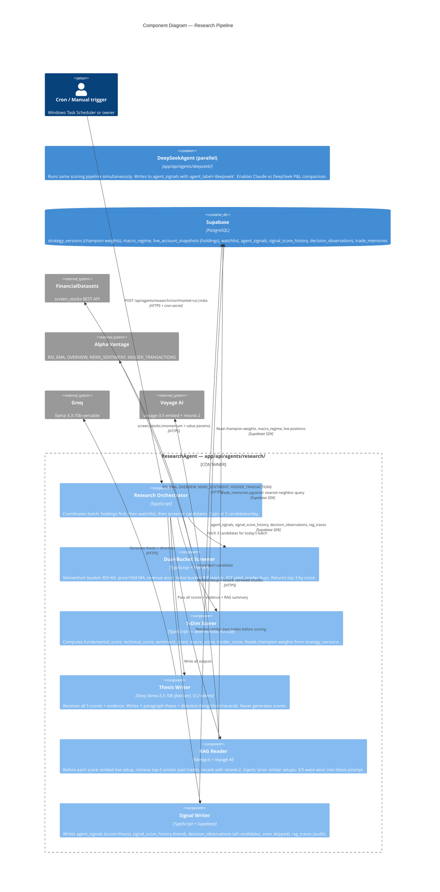

---

### 3.2 Paper Trading Subsystem

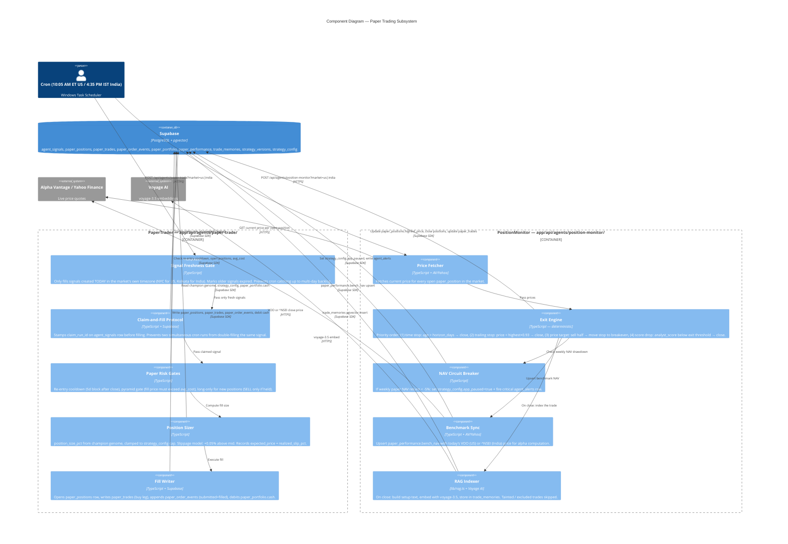

---

### 3.3 Learning & Evolution Loop

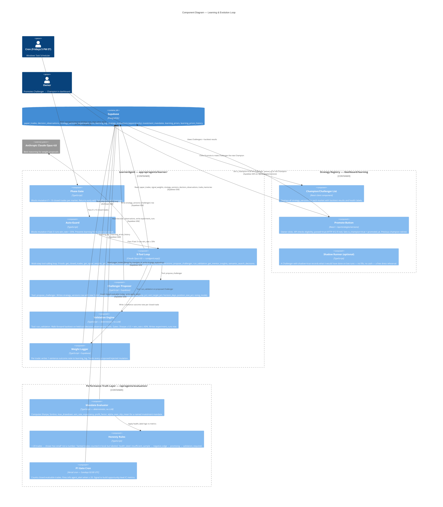

---

### 3.4 Money-Safety Gateway

Every live order in Kairos passes through 9 sequential gates. Failure at any gate returns an error
and no order is sent. This component is the most security-critical in the system.

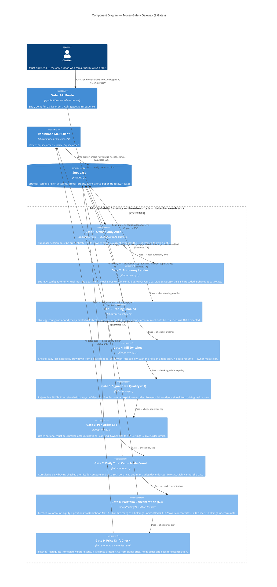

---

### 3.5 System Health Funnel

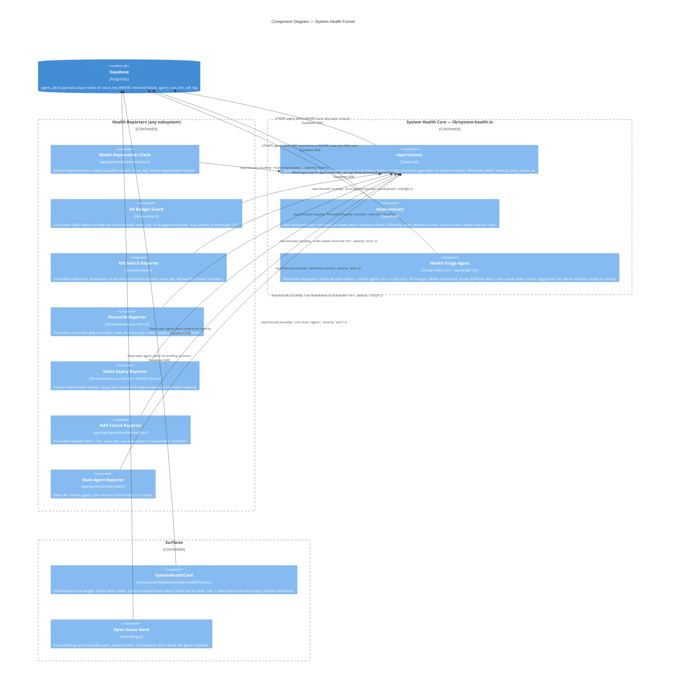

---

## 4. Level 4 — Dynamic / Code-Level Flows

### 4.1 A Stock Scored End-to-End

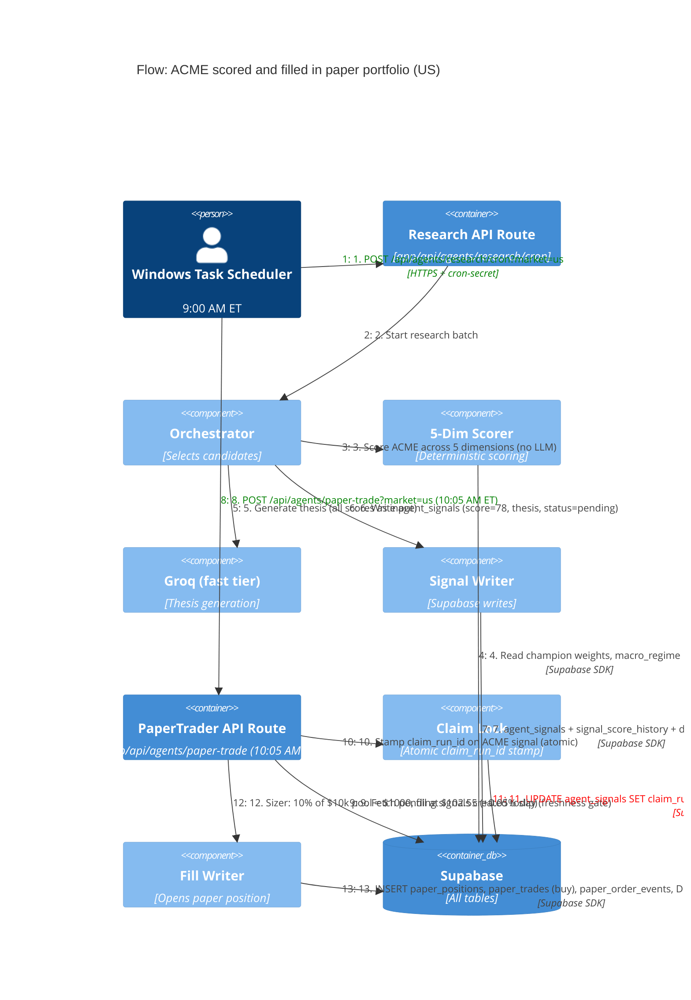

---

### 4.2 Robinhood OAuth PKCE S256 Flow

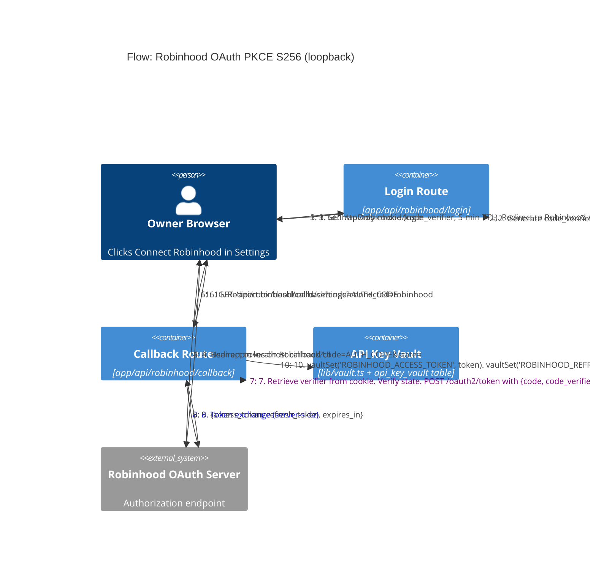

---

### 4.3 Zerodha Kite GTT Bracket After India BUY

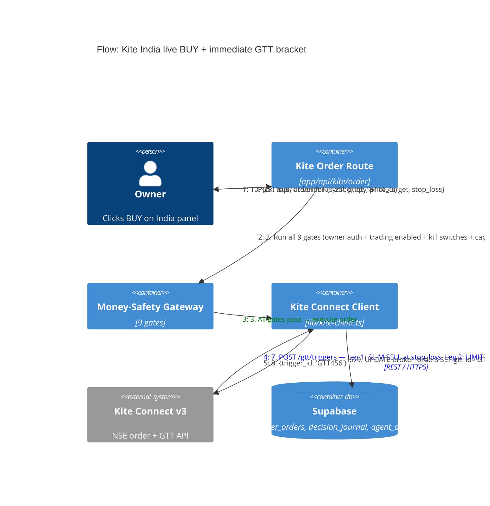

---

### 4.4 LearnerAgent Tool-Use Loop (Fridays)

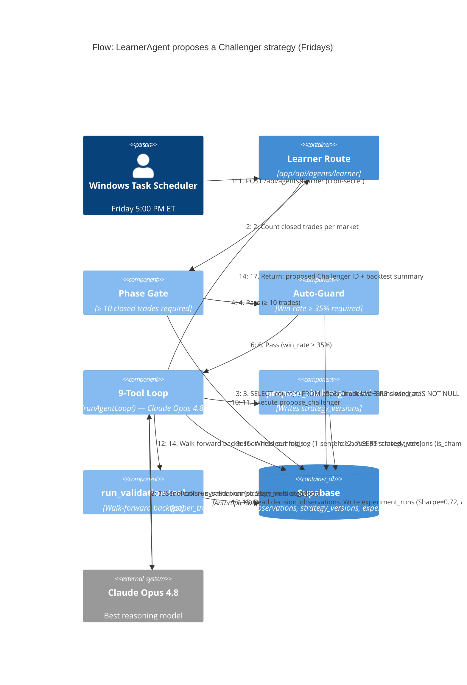

---

### 4.5 RAG Trade Memory: Write and Read

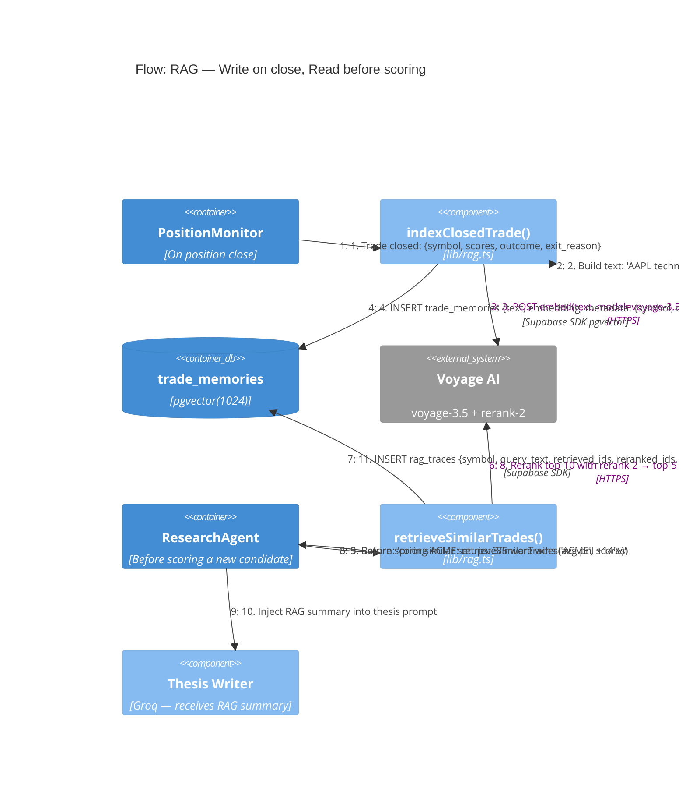

---

### 4.6 Live Order Through 9-Gate Safety Funnel

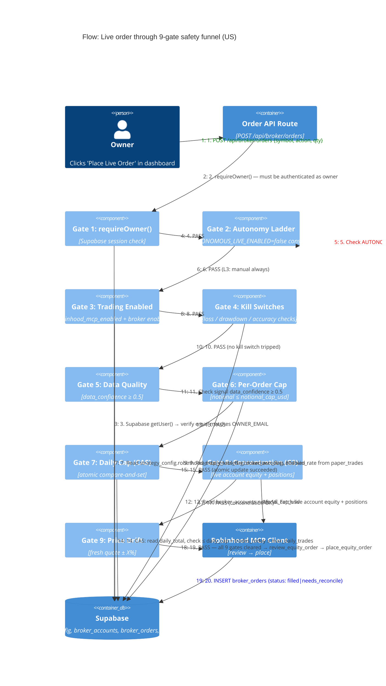

---

## 5. Deployment Diagram

```mermaid
C4Deployment
  title Kairos — Deployment Diagram

  Deployment_Node(owner_browser, "Owner's Browser", "Chrome / Safari") {
    Container(nextjs_client, "Next.js Client Bundle", "React, TypeScript", "Dashboard UI. RSC hydration on first load. Client components for charts, forms, interactive panels.")
  }

  Deployment_Node(vercel_cloud, "Vercel (Edge + Serverless)", "us-east-1 region") {
    Deployment_Node(vercel_app, "Next.js Serverless Functions", "Node.js 20 runtime") {
      Container(nextjs_server, "Next.js App Router", "Next.js 15, TypeScript", "RSC rendering, API route handlers, middleware (auth redirect). force-dynamic on all agent routes.")
    }
    Deployment_Node(vercel_crons, "Vercel Cron Jobs", "vercel.json — 2 crons") {
      Container(cron_p1, "P1 Gate Cron", "Sundays 02:00 UTC", "POST /api/agents/evaluation/p1-gate/cron — count closed trades")
      Container(cron_cleanup, "DB Cleanup Cron", "1st of month 03:00 UTC", "POST /api/agents/db-cleanup — prune 15 safe tables")
    }
  }

  Deployment_Node(owner_pc, "Owner's Windows PC", "Must be on for market hours") {
    Deployment_Node(task_scheduler, "Windows Task Scheduler", "14 scheduled tasks") {
      Container(ps_script, "run-agents.ps1", "PowerShell", "Calls each agent endpoint via HTTPS with CRON_SECRET header. Runs on market-hour schedule (see §7 SYSTEM_OVERVIEW).")
    }
  }

  Deployment_Node(supabase_cloud, "Supabase (AWS us-east-1)", "Managed PostgreSQL") {
    ContainerDb(postgres, "PostgreSQL 15", "Supabase hosted", "35+ tables. RLS policies. Migrations in supabase/migrations/.")
    ContainerDb(pgvector, "pgvector extension", "IVFFlat index", "trade_memories table. 1024-dim cosine similarity.")
    Container(supabase_auth, "Supabase Auth", "GoTrue", "Email/password auth. JWT sessions. Owner email gate on all API routes.")
  }

  Deployment_Node(llm_providers, "LLM Providers (cloud)") {
    Deployment_Node(anthropic_cloud, "Anthropic Cloud") {
      System_Ext(claude_deploy, "Claude API", "Haiku 4.5 / Sonnet 4.6 / Opus 4.8")
    }
    Deployment_Node(groq_cloud, "Groq Cloud") {
      System_Ext(groq_deploy, "Groq API", "llama-3.3-70b-versatile")
    }
    Deployment_Node(deepseek_cloud, "DeepSeek Cloud") {
      System_Ext(deepseek_deploy, "DeepSeek API", "deepseek-reasoner / deepseek-chat")
    }
  }

  Deployment_Node(data_providers, "External Data APIs (cloud)") {
    System_Ext(av_deploy, "Alpha Vantage", "25 calls/day free tier")
    System_Ext(massive_deploy, "Massive Market Data", "Candles, screener, options")
    System_Ext(yahoo_deploy, "Yahoo Finance", "Free, no auth — India .NS")
    System_Ext(nse_deploy, "NSE Public JSON", "Cookie handshake required")
    System_Ext(voyage_deploy, "Voyage AI", "voyage-3.5 + rerank-2")
  }

  Deployment_Node(brokers, "Broker APIs (cloud)") {
    System_Ext(rh_deploy, "Robinhood API", "OAuth PKCE S256 token in api_key_vault")
    System_Ext(kite_deploy, "Zerodha Kite Connect v3", "Daily token — expires 6 AM IST")
  }

  Rel(owner_browser, vercel_cloud, "HTTPS — dashboard pages + API calls", "TLS 1.3")
  Rel(owner_pc, vercel_cloud, "HTTPS — agent cron triggers via PowerShell", "TLS 1.3 + x-cron-secret header")
  Rel(vercel_app, supabase_cloud, "Supabase SDK — all DB reads/writes", "HTTPS + service role key (server) or anon key (client)")
  Rel(vercel_app, anthropic_cloud, "Anthropic SDK", "HTTPS + ANTHROPIC_API_KEY")
  Rel(vercel_app, groq_cloud, "Groq SDK", "HTTPS + GROQ_API_KEY (in vault)")
  Rel(vercel_app, deepseek_cloud, "OpenAI-compatible SDK", "HTTPS + DEEPSEEK_API_KEY")
  Rel(vercel_app, data_providers, "REST calls — price, technicals, screener, macro", "HTTPS")
  Rel(vercel_app, brokers, "Order placement + position read", "HTTPS — tokens in api_key_vault")
  Rel(vercel_crons, vercel_app, "HTTP POST (internal Vercel routing)", "x-cron-secret header")
```

---

## 6. Architecture Decision Summary

Key locked decisions (any proposed change must go through `PROJECT_DECISIONS.md`):

| Decision | What was decided | Why |
|---|---|---|
| **Zero agent-to-agent HTTP** | All agents communicate through Supabase tables only | Prevents hidden coupling, race conditions, and cascading failures. Tables are debuggable; direct calls are not. |
| **Deterministic scoring** | LLMs never generate scores; scoring is pure TypeScript math | Reproducibility. Two runs on the same data must produce the same score. LLM variance destroys this. |
| **Paper first** | Every strategy runs on pretend money before real money | Empirical evidence required before risking real capital. |
| **Human gate on live orders** | `AUTONOMOUS_LIVE_ENABLED = false` is a hardcoded constant | No autonomous live trading no matter what config says. This is a compile-time safety property, not a runtime flag. |
| **Claim-and-fill protocol** | `claim_run_id` atomic stamp before filling any signal | Prevents double-fills when two cron instances run simultaneously (e.g., Vercel cold-start + local overlap). |
| **Champion/Challenger governance** | Promotion requires `eligibility_passed=true` from Validation Engine | Evidence before belief. Prevents promoting a strategy that has not beaten the gates on held-out data. |
| **Dual-market, never-mixed pools** | US pool in USD, India pool in INR, no cross-market operations | Prevents currency mixing from creating meaningless P&L numbers. Introduced in migration 057. |
| **Robinhood account allowlist** | Only the agentic account can place orders; the read-only account is blocked | One compromised token cannot drain the wrong account. |
| **Partial unique index on issue_key** | `agent_alerts (issue_key) WHERE resolved = false` | At most one open alert per condition. `reportIssue()` is safe to call on every run without creating alert spam. |
| **Append-only ledgers** | `paper_trades`, `paper_order_events`, `broker_orders`, `decision_observations`, `strategy_evaluations` have DB triggers blocking UPDATE/DELETE | Financial audit trail is immutable. DB cleanup cron explicitly skips all of these. |
| **No Tailwind** | Inline styles + `T` color token objects only | Prevents utility class drift, forces a single consistent palette, makes dark/light theming explicit. |
| **Tier alias LLM routing** | `fast`, `reasoning`, `claude-fast`, `claude-smart`, `claude-opus` in `lib/llm-router.ts` | Model IDs change; tier aliases let us upgrade all agents at once by changing one file. |
| **GTT-first India exits** | GTT bracket placed immediately after every Kite BUY | Stops and targets are active even when Kairos is fully offline (Kite executes server-side). |

---

*C4 documentation written using the C4 model (Simon Brown). Diagrams use Mermaid C4 syntax (mermaid v10+).*
*Maintained per CLAUDE.md rule — update this file whenever an agent flow, container, or deployment changes.*
*Last updated: 2026-07-09*
