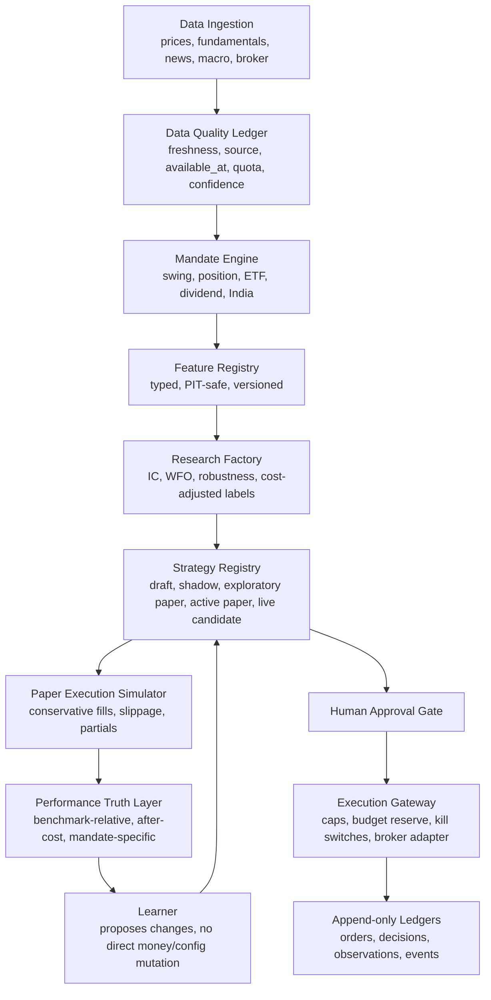

# Codex Architecture Review Result — 2026-07-09

Reviewer: Codex / ChatGPT  
Audience: Claude Code / builder agent  
Scope: Kairos / FinanceOS full-system architecture, logic, effectiveness, safety, data, learning loop, and agentic-trading direction.  
Method: Static repo review + final architecture prompt + selective inspection of core files/docs. This is not a live-browser QA report and not a Supabase production-data audit.

## Executive verdict

Kairos is much stronger as a personal trading-control system than as a proven self-evolving alpha engine.

The safety architecture has improved materially: live orders are owner-gated, deterministic broker adapters are favored over LLM order construction, daily budget reservation exists, risk gates are increasingly fail-closed, paper/live paths are separated, and EdgeScout correctly refused to promote weak price/volume factors when broad IC evidence collapsed to ~0.

The core weakness is not UI or agent count. The core weakness is that the current system still does not have a sufficiently rigorous, point-in-time, cost-adjusted research/evaluation foundation to prove that any strategy has edge before it can learn from it. Without that foundation, more agents, more parameters, or more LLM reasoning will mostly create convincing narratives around noisy signals.

Overall architecture score today: 6.0 / 10.

- Safety and auditability: above average for a personal retail trading system.
- Alpha discovery and learning rigor: not yet world-class.
- Operational maturity: improving, but still young and July-heavy.
- Best next move: do not add more autonomous trading first. Build a clean mandate-aware, point-in-time, cost-adjusted evaluation layer and let the agents earn autonomy by passing it.

## Architecture scorecard

| Dimension | Score | Assessment | Main fix |
|---|---:|---|---|
| Signal generation quality | 4.0 / 10 | ResearchAgent has structure and multiple dimensions, but scoring is still mostly composite heuristics plus LLM interpretation. EdgeScout’s first broad test found no reliable price/volume edge. | Treat current scores as hypotheses. Require point-in-time IC, walk-forward, cost-adjusted hit-rate, and benchmark-relative evidence before promotion. |
| Learning loop rigor | 5.0 / 10 | The system now has journals, labels, shadow concepts, and lifecycle language, but live learning is still constrained by tiny paper/live samples and weak credit assignment. | Separate feature discovery from numeric optimization. Use walk-forward/Bayesian or constrained optimizer for weights; use LLMs for hypothesis generation and explanation only. |
| Execution realism | 4.5 / 10 | Live path is safer than before, but paper execution is still a simplified simulator. Slippage, partial fills, queue position, spread, stale quotes, and tax consequences are not first-class. | Add execution model tiers: conservative paper fill, quote-staleness guard, spread/slippage assumptions, partial-fill state, and after-tax expected return for taxable strategies. |
| Risk management | 6.5 / 10 | Kill switches, caps, long-only rules, owner gate, budget reservation, G1/G3 gates, and broker-specific checks are directionally right. | Continue closing parity gaps across US/India/paper/live and add cumulative exposure accounting by mandate, market, currency, and broker account. |
| Operational robustness | 6.0 / 10 | Claims, watchdogs, idempotency, and cron protections have improved. Hotspots show rapid churn in core trading/agent files. | Move long-running jobs toward durable job records/queues with retries, leases, and visible state transitions. |
| Data pipeline | 4.0 / 10 | Free/cheap sources are useful but fragmented. Alpha Vantage/Massive/etc. constraints, survivorship bias, and point-in-time fundamentals remain limiting. | Build a data-quality ledger: source, as-of, available-at, freshness, quota state, and confidence per dimension. Do not score missing/degraded data as neutral. |
| Agent coordination | 6.0 / 10 | Agent responsibilities are more explicit than before, and LLMs are no longer supposed to directly supply prices or orders. Still, many agents can create complexity without stronger contracts. | Define each agent as a state-machine participant with typed inputs/outputs, abstention reasons, and promotion gates. |
| Security / live-money safety | 7.5 / 10 | Owner-gated live routes, disabled autonomous live flag, deterministic broker adapter direction, and append-only ledgers are correct. | Keep LLMs out of money-limit/config/order/code mutation. Add periodic authz tests and route inventory to prove no cron or public route can submit live orders. |

## Single biggest blocker

The biggest blocker to becoming a world-class self-improving trading platform is the absence of a reliable performance truth layer.

Current agents can research, explain, score, paper trade, and journal. But the system still cannot consistently answer the most important question:

> “Did this specific decision rule create repeatable, cost-adjusted, benchmark-relative edge under point-in-time data, in the mandate it claims to serve?”

Until that is answered, autonomous trading would automate uncertainty, not intelligence.

## Highest-leverage improvement

Build a mandate-aware, point-in-time, cost-adjusted evaluation layer before expanding autonomy.

This layer should become the judge for all agents. It should not be an LLM. It should be deterministic/statistical and append-only.

Minimum required concepts:

1. Mandate: swing, position, long-term investor, income/dividend, India swing, US ETF, etc.
2. Universe snapshot: what symbols were actually tradable/eligible at that historical time.
3. Feature snapshot: what data was actually available at decision time.
4. Decision snapshot: what the agent knew, selected, skipped, and why.
5. Execution model: spread, slippage, fill assumptions, fees/taxes where relevant.
6. Label: forward return over the mandate’s horizon, benchmark-relative, net of estimated costs.
7. Promotion gate: walk-forward evidence, not recent paper P&L alone.

If Claude fixes only one architectural layer next, it should be this.

## Critical weaknesses and concrete fixes

| Rank | Severity | Area | Problem | Concrete fix |
|---:|---|---|---|---|
| 1 | P0 | Learning / alpha proof | The system does not yet prove alpha before learning from outcomes. Paper/live samples are too small and selected by the current policy, which creates selection bias. | Add a deterministic `performance_truth` / `strategy_evaluations` layer that computes walk-forward, benchmark-relative, cost-adjusted labels across a broad historical universe. Learning updates must consume this, not raw paper P&L alone. |
| 2 | P0 | Investor mandate gap | The app does not cleanly distinguish day trader, swing trader, position trader, long-term investor, ETF allocator, or dividend/income strategy. A single score cannot serve all horizons. | Add `investment_mandates` and attach `mandate_id` to signals, strategy versions, paper trades, validation runs, and live proposals. Default mandate should remain swing trading until intraday infrastructure exists. |
| 3 | P0 | Data integrity | Historical universe and fundamentals are not guaranteed point-in-time. Using today’s liquid symbols against history creates survivorship bias. | Add `universe_snapshots` / `symbol_membership` with `as_of`, `available_at`, source, and eligibility reason. Fundamental fields must include `period_end`, `filing_date`, and `available_at`. |
| 4 | P1 | ResearchAgent scoring | ResearchAgent still looks like a weighted composite of soft dimensions. That can rank stocks but does not estimate expected return or uncertainty. | Convert output from “score only” to `{ expected_return_range, confidence_interval, evidence_quality, top_positive_drivers, top_negative_drivers, abstention_reason }`. Scores should be derived from calibrated evidence, not prompt persuasion. |
| 5 | P1 | LLM role | LLMs are useful for hypothesis generation and explanation, but should not optimize numeric weights or mutate trading policy. | Keep LLMs as proposer/explainer. Use deterministic validators, walk-forward testing, constrained optimization, and human approval for weight/config/money changes. |
| 6 | P1 | EdgeScout promotion | P0/P1 EdgeScout correctly found weak/no broad IC for first price/volume factors. The risk is continuing into P2/P3 without respecting that evidence. | Do not promote any price/volume edge until it clears predeclared IC/IR/decay/net-of-cost gates. Expand feature set only with PIT-safe data and explicit priors. |
| 7 | P1 | Paper/live realism | Paper trading may give false confidence if fills are optimistic or exits are simplified. | Add conservative paper execution model: bid/ask spread, slippage, stale quote rejection, partial fills, market-hours checks, and “would not fill” outcomes. |
| 8 | P1 | Tax/dividend handling | Ex-dividend and tax logic are discussed but not first-class in strategy mandates. Dividend capture can be tax-inefficient and often loses edge after price adjustment/spread/tax. | Add mandate-level `tax_sensitivity`, `income_preference`, `dividend_policy`, and after-tax expected-return adjustment. Ex-dividend should be an input, not an automatic buy reason. |
| 9 | P2 | Agent complexity | The number of agents can create the illusion of intelligence if contracts are weak. | For each agent, define typed input/output contract, allowed tools, abstention conditions, evidence requirements, and downstream consumer. Add a route inventory proving no agent can bypass gates. |
| 10 | P2 | Ops maturity | Core files have high churn: `lib/research-agent.ts`, `app/api/agents/paper-trade/route.ts`, `app/api/agents/learner/route.ts`, `app/api/broker/orders/route.ts`. | Add regression tests around these hotspots and smoke tests for all money-path routes. Require migration-applied checks for schema-coupled deploys. |

## Investor-type gap: required design

This is a real missing layer. “What stock should I buy?” is incomplete unless the system knows the mandate.

Recommended schema:

```sql
create table investment_mandates (
  id uuid primary key default gen_random_uuid(),
  owner_id uuid not null,
  name text not null,
  market text not null check (market in ('us', 'india', 'global')),
  horizon text not null check (horizon in ('intraday', 'swing_2_20d', 'position_1_6m', 'long_term_1y_plus', 'income_dividend')),
  benchmark_symbol text not null,
  min_holding_days int,
  max_holding_days int,
  turnover_budget_monthly numeric,
  max_position_pct numeric not null,
  max_order_notional_usd numeric,
  max_order_notional_inr numeric,
  tax_sensitivity text not null default 'medium',
  income_preference text not null default 'none',
  allowed_asset_types text[] not null default array['equity','etf'],
  allowed_signal_families text[] not null default array[]::text[],
  execution_model text not null default 'conservative_close_to_close',
  live_enabled boolean not null default false,
  created_at timestamptz not null default now(),
  updated_at timestamptz not null default now()
);
```

Recommended wiring:

- `agent_signals.mandate_id`
- `paper_trades.mandate_id`
- `trade_proposals.mandate_id`
- `strategy_versions.mandate_id`
- `strategy_evaluations.mandate_id`
- `edge_ic_history.mandate_id`

Recommended default mandates:

| Mandate | Should Kairos support now? | Reason |
|---|---|---|
| Swing 2–20 trading days | Yes | Matches current user intent and daily/weekly data. |
| Position 1–6 months | Yes, advisory/paper first | Works with daily data and lower turnover. |
| Long-term ETF allocator | Yes, but separate from trading agent | Needs allocation/rebalancing logic, not stock-picking logic. |
| Dividend/income | Advisory first | Requires tax/ex-dividend/qualified-dividend logic and careful benchmark comparison. |
| Intraday/day trading | No, not yet | Requires reliable intraday data, real-time execution modeling, latency/spread handling, and stricter broker controls. |

## Better target architecture

The current architecture is directionally good but should be reframed around a “research factory + governed execution” model:



Important changes from the current mental model:

- Agents do not “become smart” by talking more. They become useful by producing hypotheses that survive the Performance Truth Layer.
- The LLM should not be the optimizer. It should be the research assistant, critic, explainer, and feature proposer.
- Every strategy must declare its mandate before it can be judged.
- Live autonomy is a privilege granted by gates, not a mode toggle.

## Comparison to market platforms

| Platform | Where Kairos is better | Where Kairos is behind | Closeable gap? |
|---|---|---|---|
| QuantConnect / Lean | Personal dashboard, Robinhood/Kite direction, explanation/journal layer. | Backtest realism, data depth, survivorship controls, execution modeling, research tooling. | Partially. Do not try to out-Lean Lean; borrow the validation discipline. |
| Composer | More transparent research and custom multi-agent architecture. | Strategy authoring UX, packaged automation, polished user journey. | Yes for personal use. |
| Alpaca custom bots | Better decision journal and multi-agent governance. | Execution API maturity and broker-native sandbox simplicity. | Yes, if broker adapter stays deterministic. |
| Danelfin | More personal and actionable if connected to portfolio. | Danelfin has broader packaged AI scoring and coverage. | Partially; Kairos needs evidence quality, not just more scores. |
| Numerai | Personal execution and explainability. | Numerai’s validation culture and tournament/crowd alpha are far ahead. | Hard. Learn from its out-of-sample discipline. |
| Streak / Smallcase / India tooling | More ambitious cross-market intelligence. | India broker/data/product maturity and compliance polish. | Yes for a personal tool, harder as a public product. |
| LangGraph / AutoGen DIY agents | More productized and safety-gated. | Less standard framework/eval harness. | Yes, if contracts/tests are tightened. |

## What is genuinely strong

1. The system is no longer just “LLM picks stocks.” It has moved toward deterministic data sources, risk gates, evidence logs, and agent separation.
2. The live-money safety posture is materially better than most hobby trading bots: owner gate, caps, budget reservation, kill switches, account allowlists, and append-only ledgers are the right instincts.
3. EdgeScout refusing to promote weak factors is a good sign. A bad trading system would force a strategy anyway.
4. US + India support is valuable, but only if currency, market-hours, broker, tax, and data-quality boundaries remain explicit.
5. Layered decision journal and daily briefing are strategically useful. They make the system teach the user, not just trade.
6. The autonomy ladder is the right concept, as long as L4/L5 require statistical proof and remain disabled until earned.

## What Claude should fix next

### P0 — Build Performance Truth Layer

Create a feature architecture for a deterministic, mandate-aware evaluation layer.

Required outputs:

- `features/performance-truth/FEATURE_ARCHITECTURE.md`
- migration plan for `investment_mandates`, `strategy_evaluations`, and any join columns
- route/job plan for evaluation runs
- UI read-only scorecard plan
- explicit rule: no live trading impact in P0

Acceptance criteria:

- Can evaluate a strategy by mandate.
- Uses point-in-time feature availability where available.
- Computes benchmark-relative forward returns.
- Accounts for estimated spread/slippage/fees.
- Produces abstention when data is insufficient.
- Does not mutate strategy weights or money limits.

### P1 — Attach all signals/trades to mandates

Every signal and paper/live proposal must say what kind of trader/investor it is serving.

Acceptance criteria:

- Existing swing flow maps to default Swing 2–20d mandate.
- Long-term ETF/investor logic does not reuse swing labels.
- Dividend/ex-dividend logic is advisory until after-tax logic exists.
- Intraday/day-trading mandate remains disabled unless intraday data/execution model exists.

### P1 — ResearchAgent score contract redesign

Change agent output from a single confidence-like score to a calibrated evidence object.

Suggested output shape:

```ts
type ResearchDecision = {
  symbol: string;
  mandateId: string;
  recommendation: 'buy_candidate' | 'watch' | 'avoid' | 'abstain';
  expectedReturnBps?: { low: number; mid: number; high: number };
  benchmark: string;
  horizonDays: number;
  evidenceQuality: 'high' | 'medium' | 'low' | 'insufficient';
  dataConfidence: number;
  positiveDrivers: string[];
  negativeDrivers: string[];
  missingEvidence: string[];
  invalidationTriggers: string[];
  abstentionReason?: string;
};
```

### P2 — Conservative paper execution model

Paper trading should become deliberately harder than live expectations.

Required:

- stale quote rejection
- spread/slippage assumption
- partial fill event model
- “would not fill” outcome
- market-hours awareness per market
- separate paper books by mandate and market

### P2 — Agent contract inventory

Claude should produce a table of every agent:

- endpoint
- schedule
- inputs
- outputs
- allowed tools
- forbidden tools
- can write money/config/code/orders? expected answer should be no except deterministic execution gateway after owner approval
- abstention cases
- downstream consumers

This should be generated from code and kept in docs.

## Specific cautions for autonomous trading

Autonomous trading is a valid long-term goal, but not a near-term default.

The correct path is:

1. L3: manual approval for every live order.
2. L3.5: pre-approved tiny notional for one proven mandate, with daily budget and instant kill switch.
3. L4: bounded autonomous paper-to-live only for strategies that pass walk-forward, shadow, and live-paper gates.
4. L5: broader autonomy only after months of stable evidence and full route-inventory proof.

Autonomy must be strategy-specific and mandate-specific. The app should never have a single global “agent can trade live now” flag that applies to everything.

Variable sizing is fine, but only inside hard human-approved ceilings:

- per-order cap
- daily gross buy budget
- max name exposure
- max sector exposure
- max market exposure
- max drawdown / kill switch
- liquidity/spread constraints
- mandate-specific sizing policy

The LLM can recommend a size. It should not be the final authority that changes money limits or bypasses caps.

## Why “no LLM-controlled money/config/order/code changes” is still correct

This rule does not mean the system can never become autonomous.

It means the autonomy controller must be deterministic, audited, and bounded. LLMs are probabilistic text systems. They can misunderstand state, hallucinate tool semantics, or optimize for persuasive explanations. For real money, the safe architecture is:

- LLM proposes.
- deterministic policy validates.
- deterministic gateway executes.
- append-only ledger records.
- human approves the autonomy envelope.

The same applies to code/config changes. An LLM can draft a config change, but applying it should go through review, migration, tests, and an explicit approval path.

## Why append-only ledgers must not be mutated

Append-only does not mean “never correct mistakes.”

It means corrections are recorded as new events instead of rewriting history. This is essential for trading because the system must be able to reconstruct:

- what it knew at decision time
- what data was missing
- what the agent recommended
- what the user approved
- what broker response happened
- what later correction/reconciliation occurred

If old rows can be edited or deleted, the learning loop can train on rewritten history and produce false confidence.

## Recommended Claude Code prompt

Claude should use this review as input, but should not immediately implement broad code changes. First, Claude should write a scoped architecture document.

```text
Read CODEX_ARCHITECTURE_REVIEW_RESULT.md.

Your task is NOT to build everything. Your task is to create a precise, buildable architecture for the P0 Performance Truth Layer.

Create:
- features/performance-truth/FEATURE_ARCHITECTURE.md

Scope:
- mandate-aware evaluation
- point-in-time data availability where available
- benchmark-relative forward labels
- cost/slippage assumptions
- read-only scorecard
- no live trading impact
- no autonomous live trading changes
- no LLM-controlled money/config/order/code mutation
- append-only ledgers only

Include:
- exact tables/migrations to add
- exact existing files to read/use
- exact API routes/jobs to add
- exact UI page/card to add
- acceptance tests
- what NOT to do

Before writing any code, stop after the architecture doc and ask Vaibhav for approval.
```

## Final answer to “is this the best agentic algo trading platform out there?”

No. Not yet.

It is a serious personal trading OS foundation with unusually strong safety and audit ambitions. It is not yet a best-in-class alpha engine. The gap is not ambition; the gap is statistically defensible edge discovery, point-in-time data, realistic execution simulation, mandate-specific evaluation, and enough out-of-sample evidence.

The good news: the direction is fixable. The system has the right bones if Claude now focuses less on adding agents and more on making the evaluation layer brutally honest.
