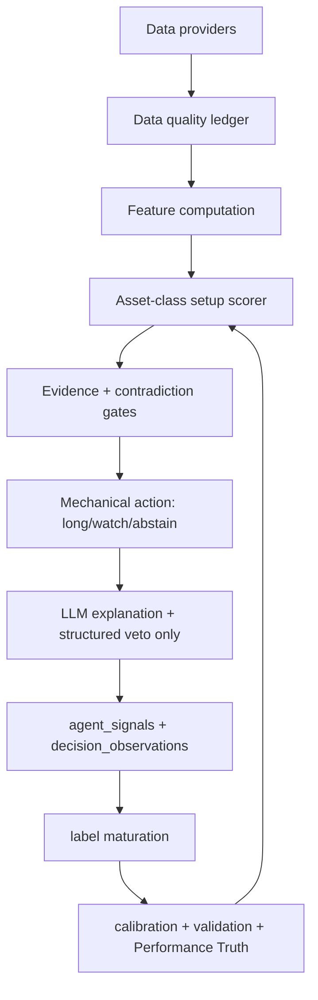

# Codex Review Result — Signal Scoring Methodology

Date: 2026-07-10  
Reviewer: Codex / ChatGPT  
Scope: US + India scoring methodology, symbol ranking, direction architecture, ETF handling, LLM role, low-cost data inputs.  
Primary prompt: `CODEX_SCORING_METHODOLOGY_REVIEW_PROMPT.md`

## Executive verdict

The current scoring system is useful as an explainable first-pass heuristic, but it is not a strong enough primary model for a self-improving swing-trading platform.

The major weakness is not that it has “too few indicators.” The major weakness is that it compresses unlike evidence into five hand-built 0–100 buckets, linearly blends them, then lets an LLM decide direction. That produces attractive-looking scores that are not calibrated to expected return, not sector/asset-class relative, not regime-sensitive enough, and not aligned with the paper-trading entry rule.

The right target is not “add 30 more technical indicators.” The right target is:

1. asset-class-specific scoring pipelines,
2. point-in-time features normalized cross-sectionally and sector-relative,
3. setup archetypes instead of one universal score,
4. calibrated probability / expected-return outputs,
5. mechanical direction from gates, with the LLM used only for explanation or structured veto,
6. validation by forward labels and walk-forward performance, not by prompt confidence.

Current score: 5.5 / 10 as a research UI heuristic.  
Current score: 3.5 / 10 as a production alpha-ranking model.

## Important repo corrections vs the prompt

The prompt accurately describes many weaknesses, but a few implementation details have changed:

| Prompt claim | Current repo reality | Review implication |
|---|---|---|
| Technical score only RSI + EMA | `lib/data/technicals.ts` now includes RSI, EMA20/50, volume vs 20-day average, and 20-day trend. | Still weak, but not quite as bare as prompt states. Needs relative strength/volatility/breakout quality more than more textbook indicators. |
| Macro failure locks macro out all week | `lib/data/scores.ts` now falls back to the last known non-unknown macro row. | Fragility reduced, but macro is still global/US-centric and not symbol/sector-specific. |
| Missing dims are neutral 55/50 in final score | `lib/scoring/weighted-score.ts` excludes unavailable dimensions and renormalizes when at least 2 dims are present. | Better than old system, but renormalization creates unstable effective weights and still needs confidence penalties. |
| Performance Truth Layer is only proposed | WORK_LOG says P0 is built with migrations 133–135. | Scoring redesign should plug into `investment_mandates`, `strategy_evaluations`, `decision_observations`, and label maturation rather than create parallel truth tables. |
| LLM does not generate scores | Main `ResearchAgent` uses deterministic scores, but `lib/deepseek-agent.ts` appears to generate `analyst_score` via LLM and writes `agent_signals`. `PaperTrader` selects pending long signals by score without filtering `agent_label`. | This is a real architectural inconsistency. If DeepSeek signals enter paper trading, they bypass deterministic scoring discipline. |

## P0 findings

| # | Severity | Area | Problem | Fix |
|---:|---|---|---|---|
| 1 | BLOCKER | DeepSeekAgent / PaperTrader | `lib/deepseek-agent.ts` writes LLM-generated `analyst_score` and direction. `app/api/agents/paper-trade/route.ts` selects pending long signals by `analyst_score` and does not appear to exclude `agent_label='deepseek'`. This means paper fills can come from LLM-generated scores, violating the deterministic-score architecture. | Either make DeepSeek advisory-only (`status='advisory'` never `pending`) or force DeepSeek through the same deterministic `computeScores()` + `computeWeightedAnalystScore()` contract. PaperTrader should require `score_source='deterministic_v1'` or equivalent. |
| 2 | HIGH | Direction architecture | A high score can become `neutral` because LLM direction is separate from the quantitative gate. That makes the score non-actionable and confuses learning labels. | Direction should be mechanical: new positions are `long` when score/setup/evidence gates pass; otherwise `neutral/abstain`. LLM can only add a structured veto with a machine-readable reason, not free-form discretion. |
| 3 | HIGH | Universal linear blend | One five-dimension linear score is not the right primary model for 2–20 day swing trades. It mixes valuation, momentum, sentiment, macro, and insider evidence even when the setup archetype should require different interactions. | Replace global blend with setup archetypes: `quality_momentum`, `value_inflection`, `post_earnings_drift`, `etf_trend`, `india_momentum`. Each archetype has required gates and calibrated outputs. |
| 4 | HIGH | Missing data / renormalization | Renormalizing across included dims avoids fake-neutral missing data, but it can turn a thin 2-dim setup into a high-confidence score. | Add `evidence_confidence` as a hard gate and multiplier. Separate `inapplicable`, `missing`, `stale`, and `failed_provider`. Score can rank only when required dimensions for that archetype are present. |
| 5 | HIGH | ETF/equity mixing | ETFs can rank beside individual stocks even though fundamentals/insider logic is structurally inapplicable. | Split ETF scoring into its own pipeline and mandate bucket. ETFs should be scored on trend, relative strength, breadth/proxy constituents, liquidity/spread, volatility, macro/sector regime, and benchmark fit. |
| 6 | HIGH | India macro | US-centric MacroSentinel is applied to India. That is not enough for Indian equities. | Add India MacroSentinel: NIFTY trend/breadth, Nifty sector relative strength, INR/USD, RBI repo/liquidity, FII/DII flows, India VIX, crude oil, US yields as external factor, and Nifty Bank. |
| 7 | MEDIUM | Insider dimension | Insider signal has low coverage and long horizon. It is not a reliable 2–20 day swing feature for most symbols. | Demote insider from base weight to sparse event overlay. Use it as catalyst/confirmation, not a default dimension. Replace coverage with earnings revision, price/volume confirmation, relative strength, and liquidity factors. |
| 8 | MEDIUM | Sentiment quality | StockTwits sentiment is noisy, reflexive, and gameable. It should not carry 20–25% weight. | Use sentiment only as a small event/confirmation feature unless there is news surprise, analyst revision, earnings event, or abnormal attention with price/volume confirmation. |
| 9 | MEDIUM | Fundamental score | Raw P/E thresholds are not sector-relative and are not swing-horizon friendly. Growth tech, utilities, cyclicals, banks, and ETFs cannot share one P/E scale. | Convert fundamentals to sector-relative ranks: value, quality, growth, balance-sheet risk. For swing trades, fundamentals should filter/confirm, not dominate short-horizon entries. |
| 10 | MEDIUM | Contradictions | Current linear sum allows contradictory evidence to average out into a tradable score. | Add setup-specific vetoes and contradiction penalties: e.g. no `quality_momentum` if trend is broken; no `value_inflection` without technical stabilization; no sentiment-led long without price/volume confirmation. |

## Answer 1 — Is a five-dimension linear weighted score right?

No. It is acceptable as a transparent v0 dashboard score, but not as the primary alpha-ranking model.

Problems:

- dimensions are not normalized to comparable distributions,
- weights are hand-picked,
- interactions matter more than simple sums,
- missing data changes effective weights,
- the score is not calibrated to probability of win or expected return,
- it mixes equities, ETFs, ADRs, and India equities into one rubric.

Best-practice alternative under current constraints:

### Layer 1 — deterministic feature library

Compute features as raw values and normalized ranks, not just five bucket scores:

- 20d / 60d / 120d momentum
- 20d momentum minus benchmark/sector momentum
- distance to 52-week high
- breakout above 20d/50d high
- volume surge vs 20d average
- ATR-normalized trend strength
- realized volatility percentile
- drawdown from recent high
- sector-relative value and quality ranks
- earnings/revision/event flags when available
- data freshness and source quality flags

### Layer 2 — setup archetypes

Each candidate belongs to one or more setup families:

| Setup | Intended use | Required gates |
|---|---|---|
| `quality_momentum` | Strong stock continuing trend | positive 20/60d relative strength, above 50d average, volume confirmation, acceptable valuation/quality |
| `value_inflection` | Cheap/quality stock starting reversal | sector-relative value, improving trend, drawdown stabilization, catalyst |
| `post_earnings_drift` | Earnings/revision continuation | recent earnings beat/revision/news catalyst, abnormal volume, no immediate mean-reversion warning |
| `etf_trend` | ETF/index/sector rotation | ETF trend, relative strength vs benchmark, liquidity, volatility regime |
| `india_momentum` | NSE swing setup | Nifty/sector relative strength, Upstox candle trend, delivery/volume/OI when available |

### Layer 3 — calibrated output

Final output should not be “analyst_score = 91.” It should be:

```ts
type ScoredSetup = {
  symbol: string;
  market: "us" | "india";
  mandateId: string;
  assetType: "equity" | "etf" | "adr";
  setupType: "quality_momentum" | "value_inflection" | "post_earnings_drift" | "etf_trend" | "india_momentum";
  rankScore: number;              // 0-100 cross-sectional rank within comparable universe
  pWin: number | null;             // calibrated from observation_labels when enough data
  expectedReturnBps: number | null;
  expectedDrawdownBps: number | null;
  evidenceConfidence: number;      // 0-1
  contradictionScore: number;      // 0-1
  action: "long_candidate" | "watch" | "abstain";
  abstainReason?: string;
};
```

Until enough labeled observations exist, use rule-based priors and show `pWin: null`.

## Answer 2 — Should ETFs and equities use separate pipelines?

Yes. ETFs must be separate.

ETF scoring should not pretend missing company fundamentals are neutral evidence. ETF logic should answer a different question:

> “Is this basket/sector/index in a tradable 2–20 day trend with acceptable volatility, liquidity, and macro fit?”

ETF factors:

- trend: 20d/60d return, above 20/50/200d moving averages,
- relative strength: ETF vs VOO/SPY or NIFTY 50; sector ETF vs market ETF,
- volatility: ATR percentile, realized vol regime,
- breadth/proxy: if constituents are unavailable, use sector/index proxies,
- liquidity: average dollar volume, spread proxy,
- drawdown: distance from 20d/52w high,
- macro/sector regime: rates, dollar, oil, financial conditions where relevant.

ETF output should be `etf_trend_score`, not `fundamental_score=55`.

## Answer 3 — Should direction be mechanical or LLM discretionary?

Direction should be mechanical.

Recommended architecture:

1. Deterministic scorer produces `action_candidate`.
2. Evidence gate checks required data, freshness, contradiction, liquidity, and mandate.
3. If gates pass: `direction = long` for new positions.
4. If gates fail: `direction = neutral` with structured `abstainReason`.
5. LLM writes thesis and may issue a structured veto only if it cites a specific risk category.

Example:

```ts
if (isHeld && exitGateTriggered) direction = "short"; // exit only
else if (score >= threshold && evidenceConfidence >= 0.70 && contradictionScore <= 0.35) direction = "long";
else direction = "neutral";
```

LLM veto should be stored as:

```ts
llm_veto: {
  vetoed: boolean;
  category?: "earnings_imminent" | "data_conflict" | "event_risk" | "liquidity" | "valuation_extreme";
  citedEvidence?: string[];
}
```

Do not let the LLM silently convert a 96 score into neutral. That breaks learning.

## Answer 4 — Should macro be global or sector/symbol-specific?

Macro should be a slow overlay, not a universal dimension with the same score for every symbol.

Recommended:

- Market regime: US and India separately.
- Sector macro sensitivity: rates-sensitive, oil-sensitive, dollar-sensitive, defensive, high-beta growth, banks, exporters/importers.
- Symbol beta/volatility: macro should scale exposure more for high-beta cyclicals than for defensive stocks.
- Cadence: daily lightweight market-regime update from market prices; weekly macro fundamentals update.

US macro inputs:

- SPY/QQQ/IWM trend,
- VIX level and term proxy where available,
- 10Y yield and 10Y-2Y,
- HYG/LQD or credit-spread proxy,
- dollar index proxy,
- sector breadth/relative strength.

India macro inputs:

- NIFTY 50 trend and breadth,
- Nifty sector indices relative strength,
- India VIX,
- INR/USD,
- RBI repo/liquidity events,
- FII/DII flows,
- Brent crude / oil proxy,
- Nifty Bank trend.

Macro should usually adjust size/threshold, not directly add +15 points to all symbols.

## Answer 5 — Is insider worth including?

Yes, but not as a default 10–15% weighted daily dimension.

Insider buying is economically meaningful, but:

- it has sparse coverage,
- it is usually longer horizon than 2–20 days,
- it is not applicable to ETFs/India/many ADRs,
- most “no activity” rows are not bearish evidence.

Use insider as:

- event overlay,
- catalyst tag,
- confidence booster for `value_inflection`,
- longer-horizon investor mandate input.

Do not renormalize away its absence into more technical/sentiment weight without a confidence haircut.

## Answer 6 — Additional factors ranked by expected usefulness

Under free/cheap constraints, prioritize these:

| Rank | Factor | Why it matters | Data source |
|---:|---|---|---|
| 1 | Relative strength vs market/sector | Strongest practical swing filter; avoids buying weak stocks in weak groups. | Existing candles + benchmark/sector proxies |
| 2 | Volatility-adjusted momentum | Momentum with lower noise; prevents chasing high-vol spikes. | Existing OHLCV |
| 3 | Volume-confirmed breakout | Separates real participation from low-volume drift. | Existing OHLCV |
| 4 | Distance to 52-week high / breakout state | Proven momentum/continuation family; simple and robust. | Existing OHLCV |
| 5 | Earnings/revision drift | Strong medium-term anomaly; useful for 2–20 day continuation. | Finnhub/FMP/earnings calendar |
| 6 | Sector-relative value/quality | Better fundamental confirmation than raw P/E. | FMP/Yahoo/FinancialDatasets |
| 7 | Short-term reversal after extreme move | Useful only as separate archetype; not mixed with trend. | Existing OHLCV |
| 8 | Liquidity/spread/volume stability | Prevents bad fills and small-cap traps. | Existing OHLCV/quotes |
| 9 | Event-risk calendar | Avoids entries immediately before earnings/FOMC/CPI where edge changes. | Earnings/FRED/calendar |
| 10 | Options OI/put-call where available | Useful confirmation, but do not make core due free-data fragility. | Yahoo/Kite/Upstox if available |

## Answer 7 — Better sentiment signal

Do not replace StockTwits with another social feed as a core factor. Better sentiment for swing trading is “information surprise confirmed by price/volume.”

Practical low-cost sentiment stack:

1. News event classifier: earnings, guidance, product, regulatory, litigation, M&A.
2. Analyst revisions / recommendation trend where available.
3. Abnormal news volume vs normal baseline.
4. Price/volume confirmation after the news.
5. Retail sentiment only as contrarian/attention flag, not bullish score.

StockTwits can remain as:

- attention spike,
- retail crowding warning,
- narrative explanation input.

Suggested weight: max 5–10% unless validated by IC.

## Answer 8 — Minimum technical set

Minimum predictive technical set for 2–20 day swings:

- 20d and 60d returns,
- return vs benchmark/sector over same windows,
- ATR-normalized momentum,
- price vs 20/50/200d moving averages,
- distance to 52-week high,
- volume surge vs 20d average,
- volatility percentile,
- drawdown from 20d/60d high,
- short-term reversal flag after 1–3 day extreme.

Avoid adding every indicator. MACD/Bollinger/RSI variants often duplicate the same information. The app needs a compact set of orthogonal features.

## Answer 9 — Contradictory sub-signals

Yes, add contradiction logic. Do not let averaging hide conflict.

Recommended:

```ts
contradictionScore =
  0.35 * trendConflict +
  0.25 * fundamentalConflict +
  0.20 * sentimentCrowding +
  0.20 * macroConflict
```

Examples:

- strong sentiment but weak trend = crowding risk,
- cheap stock but falling trend = value trap,
- high momentum but collapsing volume = weak breakout,
- good stock but sector/market relative weakness = lower rank,
- ETF uptrend but benchmark/sector breadth weak = fragile trend.

Use contradiction as a gate:

- `<= 0.25`: clean,
- `0.25–0.45`: watch / smaller paper size,
- `> 0.45`: abstain unless held exit logic applies.

## Answer 10 — Missing data

Do not use neutral 55/50 as if it is evidence.

Use this taxonomy:

| State | Meaning | Score handling |
|---|---|---|
| `ok` | real, fresh data exists | included |
| `inapplicable` | ETF has no company fundamentals; India has no SEC Form 4 | excluded without penalty |
| `missing` | provider returned no usable data | excluded with confidence penalty |
| `stale` | data too old | excluded or heavily penalized |
| `provider_failed` | quota/API failure | abstain if load-bearing |
| `degraded` | partial fields only | included with lower confidence |

For each setup archetype, define required fields. If a required field is missing, abstain. If an optional field is missing, continue with confidence haircut.

## Answer 11 — India scoring with limited data

Current India scoring is not enough. With only Yahoo fundamentals and Upstox/Yahoo candles, the best possible practical pipeline is price/volume + sector-relative + market-regime first, fundamentals second.

India swing factors:

- NIFTY 50 relative strength,
- Nifty sector index relative strength,
- 20d/60d momentum,
- volume surge and delivery/volume proxy if available,
- distance to 52-week high,
- volatility-adjusted momentum,
- liquidity filters,
- earnings/result event proximity,
- FII/DII flow regime,
- INR/USD and crude sensitivity by sector.

Yahoo fundamentals should be treated as sparse confirmation, not core ranking.

Recommended India archetypes:

- `india_quality_momentum`
- `india_sector_rotation`
- `india_breakout_volume`
- `india_value_inflection` only when fundamentals are present enough

## Answer 12 — India-specific replacements

Replace US-centric insider/social signals with:

- FII/DII daily flows,
- Nifty sectoral index relative strength,
- India VIX,
- delivery percentage / deliverable quantity if obtainable,
- NSE bulk/block deals,
- promoter/insider exchange filings if reliable adapter exists,
- F&O open interest and put/call changes for liquid F&O names,
- corporate action/result calendar,
- RBI policy and liquidity events,
- INR/USD and crude oil sensitivity.

Do not scrape unstable NSE pages directly into trading gates without adapter tests and caching.

## Answer 13 — India MacroSentinel

US MacroSentinel is not appropriate as the only macro input for Indian equities.

India MacroSentinel should track:

- NIFTY 50 trend and breadth,
- Nifty Bank,
- Nifty sector relative strength,
- India VIX,
- USD/INR,
- FII/DII net flows,
- RBI repo/rate/liquidity stance,
- Brent crude,
- US 10Y / dollar as external pressure,
- inflation/CPI and PMI where available.

Macro output should be:

```ts
{
  market: "india",
  riskRegime: "green" | "yellow" | "orange" | "red",
  trendRegime: "up" | "sideways" | "down",
  volatilityBucket: "low" | "mid" | "high",
  sectorTilts: Record<string, number>,
  sizeScaler: number
}
```

## Answer 14 — Should LLM get more or less responsibility?

Less responsibility for direction and numbers. More responsibility for explanation, source synthesis, and identifying missing evidence.

LLM should:

- explain why a deterministic setup passed,
- list risks/catalysts,
- detect obvious qualitative event risks,
- summarize earnings/news,
- propose new candidate features for EdgeScout.

LLM should not:

- generate `analyst_score`,
- override rank score silently,
- decide direction freely,
- mutate weights,
- create order size,
- promote strategies.

The DeepSeekAgent path should be changed first because it appears to violate this separation.

## Answer 15 — Right two-phase architecture

Current: deterministic scores → LLM thesis/direction.

Better:



## Recommended target scoring model

### Core scoring formula

For each comparable universe and mandate:

```ts
setupRaw =
  w1 * z(relativeMomentum20) +
  w2 * z(relativeMomentum60) +
  w3 * z(volumeConfirmedBreakout) +
  w4 * z(volAdjustedTrend) +
  w5 * z(qualityRank) +
  w6 * z(valueRank) +
  w7 * z(eventRevisionScore)

rankScore = percentileRank(setupRaw within same market + assetType + sectorGroup)

finalScore = rankScore
  * evidenceConfidence
  * (1 - contradictionPenalty)
  * regimeScaler
```

Then calibrate:

```ts
pWin = logistic(setup features) // only after n >= 60 labeled observations
expectedReturnBps = mean forward benchmark-neutral return by rank bucket
```

Use the existing `model_artifacts`, `validation_experiments`, `strategy_evaluations`, and `observation_labels` paths instead of adding a separate ML system.

### Direction gate

```ts
longCandidate =
  rankScore >= 80 &&
  evidenceConfidence >= 0.70 &&
  contradictionPenalty <= 0.35 &&
  liquidityOk &&
  eventRiskOk &&
  setupTypeAllowedByMandate
```

PaperTrader should only buy `longCandidate`, not arbitrary LLM “long.”

## Data source recommendations

Current official/free-tier checks:

- Alpha Vantage free tier is 25 requests/day; use only fallback/cache-critical paths. Source: [Alpha Vantage premium/support](https://www.alphavantage.co/premium/), [Alpha Vantage support](https://www.alphavantage.co/support/).
- FMP free plan lists 250 calls/day and core data. Source: [FMP pricing](https://site.financialmodelingprep.com/pricing-plans).
- Finnhub free tier/rate-limit docs show plan-based limits and a global per-second cap; pricing page lists free market data/fundamental allowances. Source: [Finnhub limits](https://finnhub.io/docs/api/rate-limit), [Finnhub pricing](https://finnhub.io/pricing).
- Upstox states APIs are free; rate-limit page lists standard limits. Source: [Upstox trading API](https://upstox.com/trading-api/), [Upstox rate limiting](https://upstox.com/developer/api-documentation/rate-limiting/).

Recommended low-cost stack:

| Need | Primary | Fallback | Notes |
|---|---|---|---|
| US candles/quotes | Massive/Polygon already configured | EODHD/Twelve/AV/Yahoo | Cache heavily; use adjusted daily candles for scoring. |
| US fundamentals | FMP | FinancialDatasets / AV | Compute sector-relative value/quality ranks. |
| US earnings/revisions | Finnhub / FMP | AV earnings/calendar | Higher value than StockTwits for swing trades. |
| US insider | SEC EDGAR | AV insider | Event overlay only. |
| US sentiment/news | Finnhub news + event classifier | GDELT / AV news | Do not treat raw sentiment as 20% alpha. |
| India candles/quotes | Upstox | Yahoo | Enough for price/volume/relative strength. |
| India macro/flows | NSE/NSDL/RBI-adapter if stable | manual/cached public data | Must be adapter-tested before scoring. |
| India fundamentals | Yahoo/Upstox if available | none | Sparse; use as confirmation. |

## Claude build plan

### P0 — Safety/correctness fix

1. Make `DeepSeekAgent` advisory-only or deterministic-score-only.
2. Add `score_source` / `scoring_version` to `agent_signals`.
3. PaperTrader must only consume approved deterministic score sources.
4. Direction becomes mechanical for new positions.

### P1 — Scoring architecture doc

Create `features/scoring-methodology/FEATURE_ARCHITECTURE.md` with:

- asset-class split: equity vs ETF vs India,
- setup archetypes,
- feature definitions,
- evidence/confidence gate,
- contradiction penalty,
- direction gate,
- LLM role contract,
- migration plan if adding columns.

### P2 — Implement compact feature set

Add:

- relative strength vs benchmark,
- relative strength vs sector where available,
- volatility-adjusted momentum,
- 52-week high distance,
- volume-confirmed breakout,
- liquidity filter.

### P3 — Calibrate and validate

Wire setup scores into:

- `decision_observations`,
- `observation_labels`,
- `model_artifacts`,
- `validation_experiments`,
- `strategy_evaluations`.

Do not promote until enough labels exist.

## Prompt for Claude Code

```text
Read CODEX_SCORING_METHODOLOGY_REVIEW_RESULT.md.

Your task is NOT to implement yet. First update or create:

features/scoring-methodology/FEATURE_ARCHITECTURE.md

The architecture must address:
1. DeepSeekAgent currently generates analyst_score via LLM and may feed PaperTrader. Fix architecture so only deterministic approved score_source rows are tradable.
2. Direction must be mechanical from deterministic score/evidence gates; LLM can only explain or structured-veto.
3. Split equity, ETF, and India scoring pipelines.
4. Replace one five-dimension linear score with setup archetypes:
   - quality_momentum
   - value_inflection
   - post_earnings_drift
   - etf_trend
   - india_momentum / india_sector_rotation
5. Define exact features for P1:
   - relative momentum vs benchmark
   - sector-relative strength where available
   - volatility-adjusted momentum
   - 52-week high distance
   - volume-confirmed breakout
   - liquidity/spread guard
   - sector-relative value/quality ranks
6. Define evidence confidence and contradiction penalty.
7. Define data-source plan using existing low-cost providers.
8. Define how outputs plug into decision_observations, observation_labels, model_artifacts, validation_experiments, and strategy_evaluations.
9. No live trading impact. No LLM-generated scores. No autonomous config/money/order/code changes.

Stop after architecture doc and ask Vaibhav for approval before code.
```

## Final recommendation

Do not keep tuning the five weights as the main path. That will overfit a weak representation.

The best upgrade is to convert scoring from “five blended opinions” into “mandate-specific setup detection + calibrated forward-label validation.” That is the architecture used by serious systematic research in simplified form, and it fits this app’s constraints without adding a Python ML stack or expensive data vendor.
