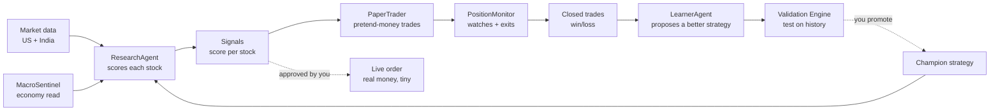
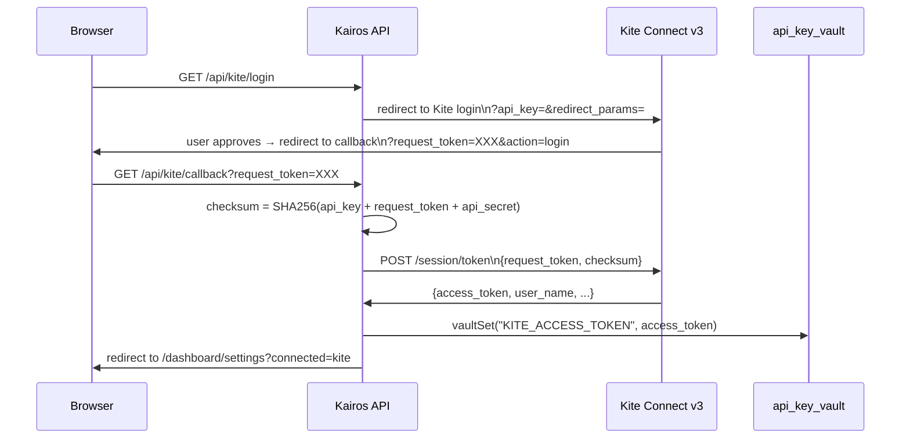
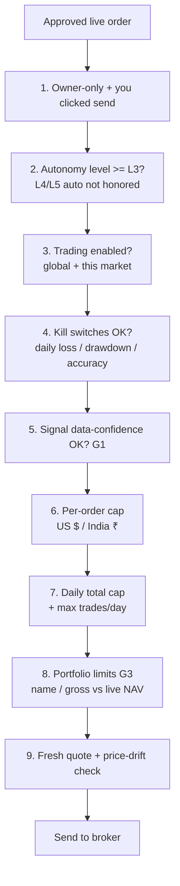
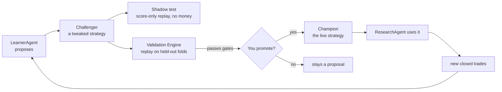
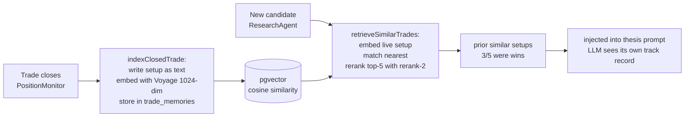
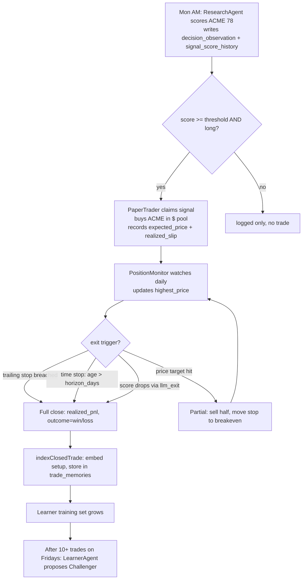
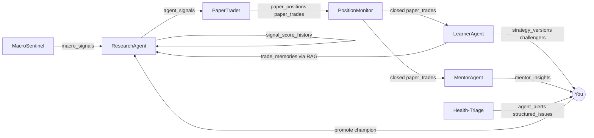

# Kairos — System Overview (read this first)

**Audience:** anyone — engineer, non-engineer, future collaborator. Plain language, Mermaid
diagrams, worked examples. This is the single authoritative start-to-end guide to the whole
app. Deeper implementation detail lives in `ARCHITECTURE.md`, `AGENTS.md`, per-feature
`features/*/FEATURE_ARCHITECTURE.md`, and the live diagram at `/dashboard/agents`.

> **Keep this current.** Any change to a feature, agent, pipeline, learning/evolution loop,
> or money/risk control must update this file in the same commit (see `CLAUDE.md`). A change
> that ships without updating this doc is incomplete.

---

## 1. What is Kairos? (the core idea)

Kairos is an **automated investing research assistant** that behaves like a small, careful
hedge-fund team living inside one web app. It doesn't just pick stocks — it **runs a loop**:

> **Research → Decide → Trade (on paper first) → Watch → Learn → Improve → repeat.**

The important word is *loop*. Most stock tools give you a score and stop. Kairos scores a
stock, acts on it in a **paper (pretend-money) portfolio**, watches how that trade actually
turns out, and then **feeds the outcome back** to make the next decision smarter. Real money
is optional, always small, and **never moves without you clicking "yes".**

### Three core principles (apply everywhere)

1. **Paper first, real money last.** Every strategy proves itself on pretend money before
   a cent of real money is at stake.
2. **AI proposes, human disposes.** Agents can *suggest* a new strategy or trade, but a
   person must approve anything that touches real money or changes the live strategy.
3. **Evidence before belief.** A proposed improvement must beat the current one on
   held-out historical data before it is allowed to take effect.

### What makes this different from a scanner

| Ordinary scanner | Kairos |
|---|---|
| Gives you a score today | Scores + remembers its past accuracy |
| You decide every trade | Pretend-money paper book tests decisions first |
| No feedback loop | Closed loop: outcomes teach future scoring |
| Single model | Multi-LLM routing; Claude vs DeepSeek P&L compared |
| US-only | US + India (INR ₹ pool separate from USD $) |
| No safety layers | 9+ independent money-safety gates |

---

## 2. The big picture



Read it as a wheel: data comes in on the left, becomes decisions, becomes trades, becomes
outcomes, and the outcomes teach a better **Champion strategy** that feeds back into
ResearchAgent. That feedback arrow is the whole point.

---

## 3. Feature map

| Feature area | What it does |
|---|---|
| Screening & research | Scans US + India universes, scores candidates across 5 dimensions, tracks score trend |
| Paper trading | Simulated portfolios per market ($US, ₹India) — realistic fills, stops, targets |
| Live trading | Real orders via Robinhood (US) + Zerodha Kite (India), human-gated |
| Evolution loop | Turns closed outcomes into Challenger strategies; human promotes to Champion |
| RAG trade memory | Semantic recall of past setups at scoring time |
| Performance Truth | Mandate-aware Sharpe/Sortino/alpha/drawdown evaluation ledger |
| Coaching & briefings | MentorAgent coaching notes + daily email briefings |
| System Health | Funnel of open issues → dashboard card + brief section |
| Multi-LLM routing | Claude / DeepSeek / Groq / Gemini; per-agent assignments; paper P&L per model |
| India parity | Full NSE scoring, ₹ paper pool, Kite execution, NSE insider+options feeds |
| Admin & DB cleanup | User management; monthly DB pruning cron |

---

## 4. Tech stack (every layer)

### 4.1 Frontend + framework

| Layer | Technology | Notes |
|---|---|---|
| Framework | **Next.js 15** (App Router) | All pages under `app/`; both RSC and client components |
| Language | **TypeScript** (strict) | Centralized types at `@/types` |
| Styling | **Inline styles + T tokens** | No Tailwind, no CSS modules. Each file declares `const T = { bg, surface, card, border, text, ... }`. Never add external class utilities. |
| Charts | **Recharts** | Used for paper P&L, score history, correlation charts |
| Diagrams | **Mermaid v10** | v11 webpack-broken; agent flowcharts rendered by `components/dashboard/MermaidChart.tsx` |
| TradingView | **Advanced Chart widget** | Sector ETF charts on Markets page; symbol detail page |
| Fonts | JetBrains Mono (monospace for numbers/code) | Loaded as system font fallback |

### 4.2 Backend + data

| Layer | Technology | Notes |
|---|---|---|
| Database | **Supabase (PostgreSQL)** | All tables, RLS policies, migrations in `supabase/migrations/` |
| Auth | **Supabase Auth** | Email/password; `OWNER_EMAIL` gate on all sensitive API routes |
| Storage | Supabase (not used for large files) | — |
| Vector store | **Supabase pgvector** | `trade_memories` table; 1024-dim Voyage embeddings; cosine similarity |
| Server functions | **Next.js API routes** | All under `app/api/`; `force-dynamic` where needed |
| Cron (cloud) | **Vercel Crons** | Two crons in `vercel.json`; hit deployed URL |
| Cron (local) | **Windows Task Scheduler** | 8 tasks via `scripts/run-agents.ps1`; PC must be on |
| Observability | **Langfuse** | Traces `callLLM` (single-shot) + `runAgentLoop` (multi-step tool calls) |

### 4.3 AI / LLM

| Model alias | Concrete model | Primary use |
|---|---|---|
| `fast` | Groq `llama-3.3-70b-versatile` | Research thesis + direction (512 tokens, sub-second) |
| `reasoning` | DeepSeek `deepseek-reasoner` | LearnerAgent challenger proposals |
| `claude-fast` | Claude Haiku 4.5 | Triage agent, briefing editor's note |
| `claude-smart` | Claude Sonnet 4.6 | Mentor coaching notes, complex analysis |
| `claude-opus` | Claude Opus 4.8 | LearnerAgent brain (upgraded 2026-07-03) |
| DeepSeek agent | `deepseek-chat` | Parallel screener run for P&L comparison |

LLM routing lives in `lib/llm-router.ts`. Tier aliases avoid hardcoded model names per
agent — a deprecated model triggers a System Health alert and auto-resolves when reassigned.
`SAME_TIER_FALLBACK` ensures a single unavailable model degrades gracefully rather than
breaking the whole agent.

### 4.4 External brokers

| Broker | Market | Auth | Role |
|---|---|---|---|
| Robinhood | US | OAuth PKCE S256 loopback; token in `api_key_vault` | Read-only account (monitoring) + agentic account (orders only) |
| Zerodha Kite | India | Daily re-login; SHA256 checksum exchange; `KITE_ACCESS_TOKEN` in vault | Real NSE/BSE portfolio read + order placement |

### 4.5 External data providers

| Provider | What it provides | Auth |
|---|---|---|
| Alpha Vantage (AV) | Technicals (RSI, EMA, MA), OVERVIEW fundamentals, NEWS_SENTIMENT, INSIDER_TRANSACTIONS, 8 macro indicators | `ALPHA_VANTAGE_API_KEY` in vault |
| Massive Market Data | US candles, stock screener, options, quotes | `MASSIVE_API_KEY` in vault |
| FinancialDatasets (FMP) | `screen_stocks` screener for US momentum/value buckets | `FMP_API_KEY` in vault |
| Jina AI | `jina-embeddings-v3` embeddings (1024-dim, free) + `jina-reranker-v2-base-multilingual` reranker (free, 1M tokens/month, no CC) | `JINA_API_KEY` in `.env.local` |
| Langfuse | LLM trace/generation observability | `LANGFUSE_PUBLIC_KEY`, `LANGFUSE_SECRET_KEY`, `LANGFUSE_HOST` |
| Resend | Transactional email (briefings) | `RESEND_API_KEY` |
| Stripe | Subscription billing (Pro/Elite tiers) | `STRIPE_SECRET_KEY`, `STRIPE_WEBHOOK_SECRET`, `NEXT_PUBLIC_STRIPE_PUBLISHABLE_KEY` |
| Yahoo Finance | India `.NS` price+candles (free, no auth) + fundamentals (cookie+crumb) | None |
| NSE public JSON | Full equity list (`EQUITY_L.csv`), insider trades (`corporates-pit`), option chain | Cookie handshake via `lib/nse-data.ts` |
| House Stock Watcher | Congressional stock trade disclosures | None (public S3) |
| SEC EDGAR | Form 4 CIK lookup + XML → `evidence_records` | None (public) |
| StockTwits | Social sentiment for US tickers | (check vault) |
| WandB | Experiment tracking (optional) | `WANDB_API_KEY` in `.env.local` |
| Robinhood MCP | JSON-RPC tool bridge for Robinhood agentic account | OAuth token in vault |

---

## 5. Environment variables (complete list)

All secrets in `.env.local` (gitignored) + Vercel environment variables for production.
The `api_key_vault` Supabase table holds runtime-editable keys (Alpha Vantage, Kite, etc.) —
see `lib/vault.ts`.

### 5.1 Required at startup (app won't boot without these)

```
NEXT_PUBLIC_SUPABASE_URL=         # Supabase project URL
NEXT_PUBLIC_SUPABASE_ANON_KEY=    # Supabase anon key (public, safe)
SUPABASE_SERVICE_ROLE_KEY=        # Supabase service role (private — never expose to client)
ANTHROPIC_API_KEY=                # Claude API
CRON_SECRET=                      # Shared secret for Vercel cron + Task Scheduler auth
```

### 5.2 Optional — features degrade gracefully without them

```
# Stripe (billing)
STRIPE_SECRET_KEY=
STRIPE_WEBHOOK_SECRET=
NEXT_PUBLIC_STRIPE_PUBLISHABLE_KEY=

# Email
RESEND_API_KEY=
BRIEFING_TO=                      # Email address that receives briefings (test mode: any address)

# LLM observability
LANGFUSE_PUBLIC_KEY=
LANGFUSE_SECRET_KEY=
LANGFUSE_HOST=                    # e.g. https://cloud.langfuse.com

# Vector / RAG (off if absent — no-ops silently)
JINA_API_KEY=          # free at jina.ai (no CC), 1M tokens/month

# Experiment tracking
WANDB_API_KEY=

# Robinhood MCP (OAuth token stored in vault at runtime)
ROBINHOOD_CLIENT_ID=              # From MCP dynamic registration
ROBINHOOD_CLIENT_SECRET=          # From MCP dynamic registration
```

### 5.3 Runtime-editable (stored in `api_key_vault` table, editable via `/dashboard/admin/vault`)

```
ALPHA_VANTAGE_API_KEY             display_name: "Alpha Vantage"
MASSIVE_API_KEY                   display_name: "Massive Market Data"
FMP_API_KEY                       display_name: "FinancialDatasets"
KITE_ACCESS_TOKEN                 display_name: "Kite Access Token" (daily refresh)
ROBINHOOD_ACCESS_TOKEN            display_name: "Robinhood OAuth Token"
ROBINHOOD_REFRESH_TOKEN           display_name: "Robinhood Refresh Token"
STOCKTWITS_TOKEN                  display_name: "StockTwits"
```

> **Warning about encoding:** A UTF-8 BOM in `.env.local` causes the entire app to 500 at
> boot. If the app won't start after editing env, check the file encoding (must be UTF-8
> without BOM).

---

## 6. Coding conventions (apply always)

Codified in `PRD.md` §2. All agents must follow; never add Tailwind or CSS modules.

### 6.1 Styling

- **`T` token object** declared at the top of every file that renders UI:
  ```ts
  const T = {
    bg: "#0D0F14", surface: "#13151C", card: "#1A1D27", border: "#252836",
    text: "#ECEDEF", textSub: "#9B9EA8", muted: "#6B7280",
    accent: "#6366F1", green: "#34D399", red: "#F87171", yellow: "#FBBF24",
  };
  ```
- All styles are **inline** (`style={{ ... }}`). No Tailwind utility classes.
- Color must come from `T.*` — never hard-coded hex outside the T object.
- **Mobile-first** by default: every page/component responsive at 375px+.

### 6.2 Database access

- **Server components / API routes:** `createClient()` from `@/lib/supabase/server` (cookie-based auth)
- **Service role (crons, admin ops):** `createServiceClient()` from `@/lib/supabase/service`
- **Client components:** `createClient()` from `@/lib/supabase/client`
- Never import service-role client in client components.

### 6.3 API route conventions

- All routes in `app/api/`. Each file exports named HTTP handlers (`GET`, `POST`, `PATCH`, `DELETE`).
- `export const dynamic = "force-dynamic"` on all routes that read runtime state.
- Auth gate: `requireOwner()` from `@/lib/auth/require-owner` on owner-only routes.
- Cron auth: `verifyCronSecret(req)` from `@/lib/auth/cron` (timing-safe comparison).
- Return `NextResponse.json({ error })` with correct HTTP status on errors.

### 6.4 Agent conventions

- All agents write to shared Supabase tables. **Zero direct agent-to-agent HTTP calls.**
- Every agent run logs to `agent_runs` (start/end/status).
- LLM calls go through `callLLM()` in `lib/llm-router.ts` (Langfuse tracing + cost logging).
- Multi-step tool loops use `runAgentLoop()` (also Langfuse-traced).
- Scores are deterministic (no LLM); thesis/direction text comes from `fast` (Groq).

### 6.5 Auth gates

- `/dashboard/**` and `/admin/**` pages: gated by Supabase middleware (redirects to login).
- `/api/**` routes: each route calls `requireOwner()` itself — middleware does NOT cover API routes.
- Cron routes: accept `x-cron-secret` header (bypasses owner session check) OR require owner session.

---

## 7. Cron schedule (full)

### 7.1 Vercel crons (cloud, hit deployed URL)

Defined in `vercel.json`. Fire against the Vercel deployment URL.

| Endpoint | Schedule (UTC) | What it does |
|---|---|---|
| `/api/agents/evaluation/p1-gate/cron` | Sundays 02:00 UTC | Count closed evaluable trades per market; fire System Health info alert when ≥ 20 |
| `/api/agents/db-cleanup` | 1st of month 03:00 UTC | Prune 15 safe tables (llm_call_log >90d, agent_runs >60d, etc.); never touches ledgers |

### 7.2 Windows Task Scheduler (local machine, ET)

All triggered by `scripts/run-agents.ps1 -Agent <name>`. PC must be on.

| Task name | Schedule (ET) | Endpoint | Notes |
|---|---|---|---|
| `brief-morning` | Weekdays 8:00 AM | `/api/briefing/generate` | Morning email before market open |
| `research` | Weekdays 9:00 AM | `/api/agents/research/cron?market=us` | US signal generation (3 candidates/day) |
| `paper-trade-us` | Weekdays 10:05 AM | `/api/agents/paper-trade?market=us` | US paper fills (standalone, freshness-gated) |
| `trader` | Weekdays 9:45 AM | `/api/agents/trader` | TraderAgent proposals; `approval_required=true` |
| `scan-india-refresh` | Weekdays 5:30 AM | `/api/scan/india/refresh` | Cache full NSE equity list in oldest-first slices |
| `research-india` | Weekdays 6:15 AM | `/api/agents/research/cron?market=india` | India signal generation post-NSE-close |
| `paper-trade-india` | Weekdays 4:35 PM IST (≈6:05 AM ET) | `/api/agents/paper-trade?market=india` | India paper fills |
| `position-monitor` | Weekdays 4:15 PM | `/api/agents/position-monitor?market=us` | US stop/target/time-stop/partial-profit checks |
| `position-monitor-india` | Weekdays 6:35 AM | `/api/agents/position-monitor?market=india` | India position exits |
| `brief-evening` | Weekdays 4:30 PM | `/api/briefing/generate` | Evening email recap |
| `nav-snapshot` | Weekdays 5:00 PM | `/api/agents/performance` | Daily NAV + alpha snapshot |
| `learner` | Fridays 5:00 PM | `/api/agents/learner` | Weekly weight learning; route skips non-Fridays |
| `macro-sentinel` | Mondays 8:00 AM | `/api/agents/macro-sentinel` | Weekly macro regime computation |
| `theme-scout` | Sundays 8:00 PM | `/api/agents/theme-scout` | Weekly watchlist theme additions |
| `stale-check` | Every 4h | `/api/alerts/stale-check` | Alert if agent runs are stale |
| `live-snapshot` | Weekdays (manual / Task Scheduler) | `scripts/sync_robin.py` | Python script — pulls Robinhood positions into `live_account_snapshots` |

---

## 8. Database schema (all tables)

Supabase project: `kairos`. Migrations in `supabase/migrations/`. Applied via Supabase MCP
`apply_migration` or the Supabase SQL editor. Always verify with `list_migrations` before
shipping schema-coupled code.

### 8.1 Core user & auth

#### `profiles`
One row per user. Extended from `auth.users`.

| Column | Type | Notes |
|---|---|---|
| `id` | uuid PK | References `auth.users.id` |
| `email` | text | |
| `full_name` | text | |
| `role` | text | `user` \| `admin` \| `superadmin` |
| `subscription_tier` | text | `free` \| `pro` \| `elite` |
| `xp` | int | Experience points |
| `analysis_count` | int | Total AI analysis runs |
| `market_focus` | text | Comma-separated: `us`, `india` (others removed 2026-07-05) |
| `created_at` | timestamptz | |

#### `api_key_vault`
Runtime-editable API keys (not in code or env files).

| Column | Type | Notes |
|---|---|---|
| `id` | uuid PK | |
| `provider` | text | UNIQUE; e.g. `alpha_vantage`, `kite`, `robinhood_oauth` |
| `display_name` | text NOT NULL | Human-readable name for UI |
| `key_value` | text | Encrypted at rest by Supabase |
| `updated_at` | timestamptz | |
| `expires_at` | timestamptz | Optional; shown as "expiring soon" in vault UI |

### 8.2 Strategy & configuration

#### `strategy_config`
Single-row table: the live risk profile + trading parameters.

| Column | Type | Default | Notes |
|---|---|---|---|
| `id` | uuid PK | | |
| `risk_profile` | text | `Balanced` | `Conservative` \| `Balanced` \| `Aggressive` |
| `score_threshold` | numeric | 60 | Minimum `analyst_score` to open a paper position |
| `position_size_pct` | numeric | 10 | % of pool NAV per trade (hard cap for genome) |
| `stop_loss_pct` | numeric | 7 | Default stop-loss % below entry |
| `target_pct` | numeric | 20 | Default price target % above entry |
| `autonomy_level` | text | `L3_live_manual` | Master gate for live order autonomy |
| `robinhood_mcp_enabled` | bool | false | Live US order path via Robinhood MCP |
| `kite_enabled` | bool | false | Live India order path via Kite |
| `app_paused` | bool | false | NAV circuit breaker auto-sets true; manual reset |

#### `agent_config`
Per-agent configuration rows.

| Column | Type | Notes |
|---|---|---|
| `agent_name` | text PK | e.g. `research`, `learner`, `macro-sentinel` |
| `enabled` | bool | |
| `schedule` | text | Human-readable schedule note |
| `model` | text | LLM model assignment (tier alias preferred) |
| `params` | jsonb | Agent-specific parameters |
| `updated_at` | timestamptz | |

#### `strategy_versions`
Champion/Challenger governance table.

| Column | Type | Notes |
|---|---|---|
| `id` | uuid PK | |
| `market` | text | `us` \| `india` |
| `is_champion` | bool | True for the one active champion per market |
| `weights_snapshot` | jsonb | 5-dim weights: `{fundamental, technical, sentiment, macro, insider}` |
| `genome` | jsonb | `{entry_threshold, exit_stop_pct, exit_target_pct, horizon_days, position_size_pct, sizing_mode}` |
| `proposed_by` | text | `learner` \| `user` |
| `backtest_result` | jsonb | Sharpe, Sortino, win_rate, max_dd from Validation Engine |
| `promoted_at` | timestamptz | Null until promoted |
| `retired_at` | timestamptz | |
| `created_at` | timestamptz | |

#### `investment_mandates`
Named strategy contexts for attribution and evaluation.

| Column | Type | Notes |
|---|---|---|
| `id` | uuid PK | |
| `name` | text | e.g. `Swing US 2-20d` |
| `market` | text | `us` \| `india` |
| `benchmark_ticker` | text | `VOO` (US), `^NSEI` (India) |
| `horizon_days_min` | int | |
| `horizon_days_max` | int | |
| `is_default` | bool | Used when no mandate explicitly specified |
| `created_at` | timestamptz | |

#### `learner_config`
LearnerAgent dimension-level controls.

| Column | Type | Notes |
|---|---|---|
| `id` | uuid PK | |
| `dimension` | text | `fundamental` \| `technical` \| `sentiment` \| `macro` \| `insider` |
| `learn_from` | bool | Whether to include this dimension in learning |
| `allow_mutation` | bool | Whether LearnerAgent can propose weight changes for this dimension |
| `updated_at` | timestamptz | |

#### `learning_priors`
Current signal weight priors used by ResearchAgent.

| Column | Type | Notes |
|---|---|---|
| `id` | uuid PK | |
| `dimension` | text | |
| `weight` | numeric | 0–1 |
| `updated_at` | timestamptz | |

#### `learning_priors_history`
Immutable audit log of every prior weight change.

| Column | Type | Notes |
|---|---|---|
| `id` | uuid PK | |
| `dimension` | text | |
| `old_weight` | numeric | |
| `new_weight` | numeric | |
| `reason` | text | |
| `changed_by` | text | `learner` \| `user` \| `factory_reset` |
| `created_at` | timestamptz | Pruned >365d by DB cleanup |

#### `experiment_runs`
Backtest / Validation Engine run records.

| Column | Type | Notes |
|---|---|---|
| `id` | uuid PK | |
| `strategy_version_id` | uuid | FK → `strategy_versions` |
| `market` | text | |
| `sharpe` | numeric | |
| `sortino` | numeric | |
| `win_rate` | numeric | |
| `max_drawdown` | numeric | |
| `alpha` | numeric | vs benchmark |
| `trade_count` | int | |
| `eligibility_passed` | bool | Sharpe ≥ 0.5 and win_rate ≥ 40% |
| `created_at` | timestamptz | |

#### `strategy_evaluations`
Append-only mandate-aware evaluation snapshots (Performance Truth Layer).

| Column | Type | Notes |
|---|---|---|
| `id` | uuid PK | |
| `mandate_id` | uuid | FK → `investment_mandates` |
| `market` | text | |
| `trade_count` | int | |
| `tainted_count` | int | Trades with low data_confidence |
| `sharpe` | numeric | |
| `sortino` | numeric | |
| `max_drawdown` | numeric | |
| `win_rate` | numeric | |
| `expectancy` | numeric | |
| `profit_factor` | numeric | |
| `alpha` | numeric | |
| `exec_slip_mean` | numeric | Mean realized slip vs 0.05% modeled |
| `health_label` | text | `insufficient_sample` \| `negative_or_zero_edge` \| `promising_but_unvalidated` \| `validation_required` |
| `dataset_hash` | text | Dedup reruns on same trade set |
| `created_at` | timestamptz | Append-only. Trigger blocks UPDATE/DELETE. |

### 8.3 Research + signals

#### `agent_signals`
One row per symbol per research run. The "today's score" table.

| Column | Type | Notes |
|---|---|---|
| `id` | uuid PK | |
| `symbol` | text | Ticker |
| `agent_label` | text | `claude` \| `deepseek` |
| `market` | text | `us` \| `india` |
| `asset_class` | text | `equity` \| `etf` \| `india` \| `metals_basket` |
| `analyst_score` | numeric | 0–100 composite |
| `fundamental_score` | numeric | |
| `technical_score` | numeric | |
| `sentiment_score` | numeric | |
| `macro_score` | numeric | |
| `insider_score` | numeric | |
| `recommendation` | text | `BUY` \| `SELL` \| `HOLD` \| `WATCH` |
| `direction` | text | `long` \| `short` \| `neutral` |
| `signal_breakdown` | jsonb | Per-dimension evidence detail |
| `thesis` | text | Groq-generated one-paragraph thesis |
| `data_confidence` | numeric | 0–1; below 0.5 → tainted |
| `discovery_source` | text | How symbol entered the batch |
| `mandate_id` | uuid | FK → `investment_mandates` |
| `status` | text | `pending` \| `filled` \| `expired` \| `claimed` |
| `claim_run_id` | uuid | FK → `agent_runs`; prevents double-fill |
| `created_at` | timestamptz | |

#### `signal_score_history`
Append-only per-symbol score history. Never mutated after insert.

| Column | Type | Notes |
|---|---|---|
| `id` | uuid PK | |
| `symbol` | text | |
| `market` | text | |
| `analyst_score` | numeric | |
| `fundamental` | numeric | |
| `technical` | numeric | |
| `sentiment` | numeric | |
| `macro` | numeric | |
| `insider` | numeric | |
| `direction` | text | |
| `source` | text | `claude` \| `deepseek` |
| `created_at` | timestamptz | Index: `(symbol, created_at DESC)`. Pruned >180d by DB cleanup. |

#### `decision_observations`
Immutable ledger of EVERY scored candidate (even ones not traded). The learning fuel.

| Column | Type | Notes |
|---|---|---|
| `id` | uuid PK | |
| `symbol` | text | |
| `market` | text | |
| `mandate_id` | uuid | |
| `analyst_score` | numeric | |
| `data_confidence` | numeric | |
| `discovery_source` | text | |
| `raw_data` | jsonb | Full scoring inputs; `_using_champion_weights: bool` |
| `action_taken` | text | `filled` \| `skipped` \| `expired` |
| `created_at` | timestamptz | Append-only. Never deleted. |

#### `research_packets`
Full research context per run (for debug + audit).

| Column | Type | Notes |
|---|---|---|
| `id` | uuid PK | |
| `symbol` | text | |
| `raw_data` | jsonb | Full scoring inputs + scores |
| `created_at` | timestamptz | |

#### `watchlist`
Tracked symbols.

| Column | Type | Notes |
|---|---|---|
| `id` | uuid PK | |
| `symbol` | text | UNIQUE |
| `market` | text | |
| `asset_class` | text | |
| `added_by` | text | `user` \| `theme-scout` \| `system` |
| `theme_tag` | text | e.g. `ai_infrastructure` |
| `created_at` | timestamptz | |

#### `edge_signals`
Factor/edge lab signal rows.

| Column | Type | Notes |
|---|---|---|
| `id` | uuid PK | |
| `factor_key` | text | e.g. `momentum_12_1`, `quality_roe` |
| `symbol` | text | |
| `market` | text | |
| `value` | numeric | Raw factor value |
| `z_score` | numeric | Cross-sectional z-score |
| `created_at` | timestamptz | Pruned >180d by DB cleanup |

#### `edge_ic_history`
Information Coefficient (IC) history per factor.

| Column | Type | Notes |
|---|---|---|
| `id` | uuid PK | |
| `factor_key` | text | |
| `market` | text | |
| `ic` | numeric | Rank correlation: predicted score vs 1-month return |
| `n` | int | Number of names in the cohort |
| `period_end` | date | |
| `created_at` | timestamptz | Pruned >365d by DB cleanup |

#### `macro_regime`
Current macro risk regime.

| Column | Type | Notes |
|---|---|---|
| `id` | uuid PK | |
| `regime` | text | `GREEN` \| `YELLOW` \| `ORANGE` \| `RED` |
| `danger_score` | numeric | 0–100 |
| `computed_at` | timestamptz | Most recent row is the live regime |

#### `macro_signals`
Per-indicator breakdown for the current regime.

| Column | Type | Notes |
|---|---|---|
| `id` | uuid PK | |
| `regime_id` | uuid | FK → `macro_regime` |
| `indicator` | text | `yield_curve` \| `sahm_rule` \| `real_gdp` \| `nonfarm_payroll` \| `cpi` \| `retail_sales` \| `fed_funds` \| `durables` |
| `raw_value` | numeric | |
| `contribution` | numeric | Weighted contribution to danger_score |
| `direction` | text | `positive` \| `negative` \| `neutral` |
| `computed_at` | timestamptz | Pruned >90d by DB cleanup |

#### `india_screen_cache`
Full NSE universe cache (avoids re-scoring 5000 names each run).

| Column | Type | Notes |
|---|---|---|
| `id` | uuid PK | |
| `symbol` | text | `.NS` ticker |
| `analyst_score` | numeric | |
| `scores_json` | jsonb | 5-dim breakdown |
| `updated_at` | timestamptz | Pruned >7d by DB cleanup |

### 8.4 Paper portfolio

#### `paper_portfolio`
NAV state per market (cash + positions = NAV).

| Column | Type | Notes |
|---|---|---|
| `id` | uuid PK | |
| `market` | text | `us` \| `india` |
| `cash` | numeric | Starting: US $10,000, India ₹1,000,000 |
| `nav` | numeric | cash + sum of open position values |
| `peak_nav` | numeric | All-time high NAV (for drawdown circuit breaker) |
| `updated_at` | timestamptz | |

#### `paper_positions`
Open pretend-money positions (deleted on close).

| Column | Type | Notes |
|---|---|---|
| `id` | uuid PK | |
| `symbol` | text | |
| `market` | text | |
| `qty` | numeric | Shares held |
| `avg_cost` | numeric | Fill price |
| `expected_price` | numeric | Pre-slippage decision price |
| `realized_slip_pct` | numeric | `fill/expected - 1`; execution quality signal |
| `fill_status` | text | `full` \| `partial` \| `failed` |
| `price_target` | numeric | Exit at this price |
| `stop_loss` | numeric | Hard stop (trailing or original) |
| `highest_price` | numeric | For trailing stop computation |
| `exit_reason` | text | `stop` \| `target` \| `llm_exit` \| `time_stop` \| `partial_profit` |
| `mandate_id` | uuid | |
| `opened_at` | timestamptz | Age used for time stop |

#### `paper_trades`
Closed paper trade ledger (append-only in practice; never hard-deleted).

| Column | Type | Notes |
|---|---|---|
| `id` | uuid PK | |
| `symbol` | text | |
| `market` | text | |
| `action` | text | `buy` \| `sell` |
| `qty` | numeric | |
| `price` | numeric | Fill price |
| `expected_price` | numeric | Decision price |
| `realized_slip_pct` | numeric | |
| `fill_status` | text | |
| `exit_price` | numeric | Closing price (on sell) |
| `realized_pnl` | numeric | |
| `pnl_pct` | numeric | |
| `outcome` | text | `win` \| `loss` \| `break_even` |
| `exit_reason` | text | |
| `data_confidence` | numeric | From the signal that opened the trade |
| `tainted` | bool | Low data_confidence; excluded from learner training |
| `excluded_from_learning` | bool | Manually flagged |
| `mandate_id` | uuid | |
| `market_regime` | text | `GREEN` \| `YELLOW` \| `ORANGE` \| `RED` at time of trade |
| `agent_label` | text | `claude` \| `deepseek` (P&L comparison) |
| `opened_at` | timestamptz | |
| `closed_at` | timestamptz | |

#### `paper_order_events`
Immutable append-only event log for every paper order state change.

| Column | Type | Notes |
|---|---|---|
| `id` | uuid PK | |
| `paper_trade_id` | uuid | FK → `paper_trades` |
| `event_type` | text | `submitted` \| `filled` \| `partially_filled` \| `cancelled` \| `error` |
| `price` | numeric | |
| `qty` | numeric | |
| `detail` | jsonb | |
| `created_at` | timestamptz | Trigger blocks UPDATE/DELETE. |

#### `paper_performance`
Daily NAV snapshots per market.

| Column | Type | Notes |
|---|---|---|
| `id` | uuid PK | |
| `date` | date | |
| `market` | text | |
| `nav` | numeric | |
| `bench_nav` | numeric | Benchmark (VOO/^NSEI) NAV on this date |
| `return_pct` | numeric | |
| `alpha` | numeric | `return_pct - bench_return_pct` |
| UNIQUE | `(date, market)` | One row per day per market |

### 8.5 Live trading

#### `broker_accounts`
Known broker account references (no passwords or credentials stored here).

| Column | Type | Notes |
|---|---|---|
| `id` | text PK | Internal label, e.g. `rh-trading`, `rh-agentic` |
| `broker` | text | `robinhood` \| `kite` |
| `account_role` | text | `trading-read-only` \| `agentic-orders-only` |
| `market` | text | |
| `enabled` | bool | |
| `live_account_source` | bool | Whether this is the source for `live_account_snapshots` |
| `notional_cap_usd` | numeric | Hard per-order cap |

#### `live_account_snapshots`
One row per account (upserted, not history). Live Robinhood positions.

| Column | Type | Notes |
|---|---|---|
| `account_id` | text PK | Robinhood account ID (not human-readable role label) |
| `equity` | numeric | |
| `buying_power` | numeric | |
| `positions_json` | jsonb | Array of `{symbol, qty, avg_cost, current_price}` |
| `captured_at` | timestamptz | |

#### `broker_orders`
Immutable live order ledger. Never deleted.

| Column | Type | Notes |
|---|---|---|
| `id` | uuid PK | |
| `broker` | text | |
| `market` | text | |
| `symbol` | text | |
| `action` | text | `buy` \| `sell` |
| `qty` | numeric | |
| `order_id` | text | Broker-assigned order ID |
| `status` | text | `pending` \| `filled` \| `needs_reconcile` \| `failed` |
| `needs_reconcile` | bool | True when broker order ID is missing (order may have filled without confirmation) |
| `submitted_at` | timestamptz | |
| `filled_at` | timestamptz | |

#### `trade_proposals`
TraderAgent proposals awaiting owner approval. Auto-expire 30 minutes.

| Column | Type | Notes |
|---|---|---|
| `id` | uuid PK | |
| `symbol` | text | |
| `action` | text | |
| `qty` | numeric | |
| `limit_price` | numeric | |
| `rationale` | text | |
| `status` | text | `pending` \| `approved` \| `rejected` \| `expired` |
| `expires_at` | timestamptz | `created_at + 30m` |
| `created_at` | timestamptz | |

#### `decision_journal`
Audit log of every trade decision (live or paper).

| Column | Type | Notes |
|---|---|---|
| `id` | uuid PK | |
| `symbol` | text | |
| `market` | text | |
| `action` | text | |
| `rationale` | text | |
| `approved_by` | text | `owner` \| `auto` (auto not used; kept for schema compat) |
| `created_at` | timestamptz | |

### 8.6 Learning

#### `learning_log`
LearnerAgent mutation audit log (not the same as trade outcomes).

| Column | Type | Notes |
|---|---|---|
| `id` | uuid PK | |
| `event_type` | text | `weight_change` \| `champion_promoted` \| `mutation_blocked` |
| `market` | text | |
| `detail` | jsonb | |
| `created_at` | timestamptz | |

#### `signal_weights_history`
History of every signal weight change (rollback source).

| Column | Type | Notes |
|---|---|---|
| `id` | uuid PK | |
| `dimension` | text | |
| `old_weight` | numeric | |
| `new_weight` | numeric | |
| `changed_by` | text | |
| `created_at` | timestamptz | |

#### `trade_memories`
pgvector store for RAG trade memory.

| Column | Type | Notes |
|---|---|---|
| `id` | uuid PK | |
| `paper_trade_id` | uuid | FK → `paper_trades` |
| `text` | text | Setup description: symbol, scores, outcome |
| `embedding` | vector(1024) | Voyage `voyage-3.5` embedding |
| `metadata` | jsonb | Symbol, market, outcome, exit_reason, mandate_id |
| `created_at` | timestamptz | |

### 8.7 Evidence & enrichment

#### `evidence_records`
Immutable evidence ledger. `payload_hash` deduplicates re-imports.

| Column | Type | Notes |
|---|---|---|
| `id` | uuid PK | |
| `symbol` | text | |
| `source` | text | `edgar_form4` \| `av_insider` \| `av_earnings` \| etc. |
| `payload` | jsonb | Raw evidence data |
| `payload_hash` | text | UNIQUE; SHA-256 of payload |
| `created_at` | timestamptz | Append-only. |

#### `corporate_actions`
Stock splits + dividends from Alpha Vantage.

| Column | Type | Notes |
|---|---|---|
| `id` | uuid PK | |
| `symbol` | text | |
| `action_type` | text | `split` \| `dividend` |
| `ex_date` | date | |
| `detail` | jsonb | |
| `created_at` | timestamptz | |

#### `trade_decisions`
Historical Robinhood trade CSV imports + enrichment.

| Column | Type | Notes |
|---|---|---|
| `id` | uuid PK | |
| `symbol` | text | |
| `action` | text | `buy` \| `sell` |
| `qty` | numeric | |
| `exec_price` | numeric | |
| `exec_date` | date | |
| `price_1d_after` | numeric | AV DAILY price lookup |
| `price_1w_after` | numeric | |
| `price_1m_after` | numeric | |
| `price_3m_after` | numeric | |
| `outcome_score` | numeric | `(price_1m_after - exec_price) / exec_price * 100` |
| `macro_market_regime` | text | Hardcoded epoch table |
| `enrichment_status` | text | `pending` \| `enriched` \| `no_data` |
| UNIQUE | `(symbol, action, exec_date, exec_price, qty)` | Cross-source dedup |

#### `uploaded_trade_files`
Tracks CSV upload dedup (SHA-256 hash of file content).

| Column | Type | Notes |
|---|---|---|
| `id` | uuid PK | |
| `filename` | text | |
| `file_hash` | text | UNIQUE |
| `trade_count` | int | |
| `duplicate_count` | int | |
| `date_range_start` | date | |
| `date_range_end` | date | |
| `broker` | text | |
| `created_at` | timestamptz | |

### 8.8 Observability & ops

#### `agent_runs`
One row per agent invocation.

| Column | Type | Notes |
|---|---|---|
| `id` | uuid PK | |
| `agent_name` | text | |
| `market` | text | |
| `status` | text | `running` \| `completed` \| `error` |
| `started_at` | timestamptz | |
| `ended_at` | timestamptz | |
| `summary` | text | |
| `error` | text | |
| `created_at` | timestamptz | Pruned >60d by DB cleanup |

#### `agent_alerts`
Open-issues funnel (System Health).

| Column | Type | Notes |
|---|---|---|
| `id` | uuid PK | |
| `issue_key` | text | Stable dedup key, e.g. `model-deprecated:deepseek-reasoner` |
| `severity` | text | `info` \| `warn` \| `error` \| `critical` |
| `category` | text | `model` \| `broker` \| `budget` \| `data` \| `ops` |
| `title` | text | |
| `detail` | text | |
| `structured_issues` | jsonb | Machine-readable: `{issue_key, root_cause, blast_radius, suggested_fix}` |
| `resolved` | bool | |
| `resolved_at` | timestamptz | |
| `auto_expire_at` | timestamptz | Self-expiring for budget alerts |
| `created_at` | timestamptz | |
| UNIQUE | `(issue_key) WHERE resolved = false` | At most one open row per issue |

#### `llm_call_log`
Every LLM call: model, tokens, cost.

| Column | Type | Notes |
|---|---|---|
| `id` | uuid PK | |
| `agent_name` | text | |
| `model` | text | |
| `input_tokens` | int | |
| `output_tokens` | int | |
| `cost_usd` | numeric | |
| `created_at` | timestamptz | Pruned >90d by DB cleanup |

#### `rag_traces`
Every vector retrieval — what memory influenced a decision.

| Column | Type | Notes |
|---|---|---|
| `id` | uuid PK | |
| `symbol` | text | Symbol being scored |
| `query_text` | text | |
| `retrieved_ids` | jsonb | Array of `trade_memories.id` |
| `reranked_ids` | jsonb | Post-rerank IDs |
| `summary` | text | "3/5 prior setups were wins" note passed to LLM |
| `created_at` | timestamptz | Pruned >90d by DB cleanup |

#### `briefings`
Daily briefing records (in-app + email).

| Column | Type | Notes |
|---|---|---|
| `id` | uuid PK | |
| `type` | text | `morning` \| `evening` |
| `content` | text | Full HTML/markdown content |
| `sent_at` | timestamptz | |
| `created_at` | timestamptz | Pruned >90d by DB cleanup |

#### `newsletters`
Full email send history (inserted on successful Resend call).

| Column | Type | Notes |
|---|---|---|
| `id` | uuid PK | |
| `subject` | text | |
| `html_body` | text | |
| `resend_message_id` | text | |
| `nav_snapshot` | numeric | |
| `signals_count` | int | |
| `positions_count` | int | |
| `sent_at` | timestamptz | Pruned >90d by DB cleanup |

### 8.9 Mentor + coaching

#### `mentor_insights`
MentorAgent's coaching notes.

| Column | Type | Notes |
|---|---|---|
| `id` | uuid PK | |
| `insight_type` | text | `pattern` \| `lesson` \| `warning` |
| `content` | text | Plain-English coaching |
| `market` | text | |
| `symbols_mentioned` | text[] | |
| `created_at` | timestamptz | |

### 8.10 India-specific

#### `kite_portfolio_cache`
NSE/BSE holdings snapshot from Kite API.

| Column | Type | Notes |
|---|---|---|
| `id` | uuid PK | |
| `holdings` | jsonb | Raw Kite portfolio response |
| `captured_at` | timestamptz | |

### 8.11 Append-only ledgers (NEVER DELETE)

These tables must never be hard-deleted by any agent or cron:

- `paper_trades` — financial ledger
- `paper_order_events` — event sourcing log
- `decision_observations` — learning fuel
- `broker_orders` — live trade audit trail
- `strategy_evaluations` — evaluation history

---

## 9. API route map (all routes)

Routes in `app/api/`. All server-side. `force-dynamic` unless noted.

### 9.1 Agent routes

| Route | Method | Auth | Purpose |
|---|---|---|---|
| `/api/agents/research/cron` | POST | cron-secret | Weekday research run; skips weekends/holidays |
| `/api/agents/research` | POST | owner | On-demand research run |
| `/api/agents/paper-trade` | POST | cron-secret \| owner | Paper fills for fresh signals in `?market=` |
| `/api/agents/trader` | POST | owner | TraderAgent proposals; `approval_required=true` |
| `/api/agents/position-monitor` | POST | cron-secret \| owner | Trailing stop + target + time-stop + partial-profit |
| `/api/agents/learner` | POST | cron-secret \| owner | LearnerAgent DeepSeek tool-use loop; Fridays only |
| `/api/agents/learner-brain` | POST | owner | Full learner brain invocation |
| `/api/agents/learner-controls` | GET/PATCH | owner | Per-dimension learn_from / allow_mutation controls |
| `/api/agents/macro-sentinel` | POST | cron-secret \| owner | 8-indicator macro danger score + regime |
| `/api/agents/theme-scout` | POST | cron-secret \| owner | AV news sentiment → watchlist theme additions |
| `/api/agents/deepseek` | POST | cron-secret \| owner | Parallel screener run for P&L comparison |
| `/api/agents/mentor` | POST | cron-secret \| owner | MentorAgent coaching notes |
| `/api/agents/triage` | POST | cron-secret \| owner | Health-Triage read-only diagnosis |
| `/api/agents/backtest` | POST | owner | JS backtest engine vs `price_cache`; eligibility gates |
| `/api/agents/performance` | POST | cron-secret \| owner | Daily NAV + alpha snapshot |
| `/api/agents/corporate-actions` | GET/POST | owner | AV SPLITS + DIVIDENDS sync |
| `/api/agents/evaluation/mandates` | GET/POST | owner | List + create investment mandates |
| `/api/agents/evaluation/results` | GET | owner | Evaluation history for a mandate |
| `/api/agents/evaluation/run` | POST | owner | Run deterministic evaluation for a mandate |
| `/api/agents/evaluation/p1-gate/cron` | POST | cron-secret | Weekly gate check; fires System Health alert at ≥20 trades |
| `/api/agents/db-cleanup` | GET/POST | owner \| cron-secret | GET: dry-run preview; POST: execute pruning |

### 9.2 Market data routes

| Route | Method | Auth | Purpose |
|---|---|---|---|
| `/api/markets/synthesis` | GET | owner | 8-indicator macro synthesis (cached daily) |
| `/api/markets/insider-trades` | GET | owner | AV INSIDER_TRANSACTIONS + congressional trades |
| `/api/markets/edgar-insiders` | GET | owner | SEC EDGAR Form 4 → evidence_records |
| `/api/markets/breadth` | GET | owner | Market breadth: advance/decline, new highs/lows |
| `/api/markets/smart-money` | GET | owner | Options flow + insider signals |
| `/api/scan/india/refresh` | POST | cron-secret | Nightly NSE universe cache |

### 9.3 Portfolio + live account routes

| Route | Method | Auth | Purpose |
|---|---|---|---|
| `/api/live-account/snapshot` | GET/POST | owner | Read or upsert Robinhood account snapshot |
| `/api/live-portfolio` | GET | owner | Merge positions from all `live_account_snapshots` |
| `/api/live-portfolio/performance` | GET | owner | AV daily series for held symbols |
| `/api/live-portfolio/import-csv` | POST | owner | SHA-256 dedup CSV import → trade_decisions |
| `/api/live-portfolio/files` | GET/DELETE | owner | List + delete CSV files |
| `/api/live-portfolio/decisions` | GET | owner | Paginated trade_decisions with filters |
| `/api/live-portfolio/enrich` | POST | owner | Enrich pending trade_decisions with AV price data |

### 9.4 Orders + broker

| Route | Method | Auth | Purpose |
|---|---|---|---|
| `/api/broker/orders` | POST | owner | Live order entry point — US Robinhood |
| `/api/broker/orders/sync` | POST | owner | Reconcile Robinhood order status |
| `/api/kite/login` | GET | owner | Kite Connect v3 login redirect |
| `/api/kite/callback` | GET | owner | Kite token exchange; store access_token in vault |
| `/api/kite/status` | GET | owner | Kite connection status check |
| `/api/kite/portfolio` | GET | owner | Kite real holdings |
| `/api/kite/order` | POST | owner | Kite BUY/SELL (human-initiated only; writes decision_journal) |
| `/api/robinhood/login` | GET | owner | Robinhood OAuth PKCE S256 login |
| `/api/robinhood/callback` | GET | owner | Robinhood token exchange |

### 9.5 Strategy + journal

| Route | Method | Auth | Purpose |
|---|---|---|---|
| `/api/strategies/versions` | GET/POST | owner | Champion/Challenger list; promote/retire/reject |
| `/api/journal` | GET/POST | owner | Decision journal CRUD |
| `/api/settings/risk-profile` | GET/PATCH | owner | Risk profile + threshold/sizing |
| `/api/settings/market-focus` | GET/PATCH | owner | `market_focus` preference |

### 9.6 Charts

| Route | Method | Auth | Purpose |
|---|---|---|---|
| `/api/charts/score-history` | GET | owner | `?symbol=X` → score history + 5-dim breakdown |
| `/api/charts/sector-returns` | GET | owner | Sector ETF returns |

### 9.7 Briefing + newsletter

| Route | Method | Auth | Purpose |
|---|---|---|---|
| `/api/briefing/generate` | POST | cron-secret \| owner | Generate + send daily briefing email |
| `/api/briefing/history` | GET | owner | List past briefings |

### 9.8 Admin

| Route | Method | Auth | Purpose |
|---|---|---|---|
| `/api/admin` | GET/PATCH | owner | User list + role/tier updates |
| `/api/admin/vault` | GET/POST/DELETE | owner | API key vault CRUD |
| `/api/admin/llm-costs` | GET | owner | 30d burn rate, projected daily, per-model breakdown |
| `/api/alerts` | GET/POST/PATCH | owner | System Health alerts CRUD |
| `/api/alerts/stale-check` | POST | cron-secret | Alert if agent runs are stale |
| `/api/models/check` | POST | cron-secret \| owner | Model deprecation check → agent_alerts |

---

## 10. External data sources (full detail)

### 10.1 Alpha Vantage (US, primary)

| Function | Used for | Endpoint |
|---|---|---|
| `GLOBAL_QUOTE` | Current price, change, volume | `query?function=GLOBAL_QUOTE&symbol=X` |
| `TIME_SERIES_DAILY_ADJUSTED` | Historical prices for enrichment, IC | `function=TIME_SERIES_DAILY_ADJUSTED` |
| `RSI`, `EMA`, `SMA` | Technical indicators (14/20/50 periods) | `function=RSI&time_period=14&...` |
| `OVERVIEW` | Fundamentals: P/E, EPS, ROE, margins, sector | `function=OVERVIEW&symbol=X` |
| `NEWS_SENTIMENT` | Sentiment scores per ticker | `function=NEWS_SENTIMENT&tickers=X` |
| `INSIDER_TRANSACTIONS` | Corporate insider buy/sell data | `function=INSIDER_TRANSACTIONS&symbol=X` |
| `EARNINGS` | Quarterly EPS history + revisions | `function=EARNINGS&symbol=X` |
| `TREASURY_YIELD` | 10Y and 2Y yields → yield curve | `function=TREASURY_YIELD&maturity=10year` |
| `UNEMPLOYMENT`, `REAL_GDP`, `NONFARM_PAYROLL`, `CPI`, `RETAIL_SALES`, `FEDERAL_FUNDS_RATE`, `DURABLES` | MacroSentinel 8-indicator inputs | Each has own `function=` |

**Budget:** AV free tier = 25 calls/day, 5 calls/min. Heavy fetches (candles, enrichment) go
through `lib/av-cache.ts` (day-cache) and a daily budget guard. Exhaustion triggers a System
Health warning.

### 10.2 Massive Market Data (US)

Primary for US candles and screener fundamentals. Endpoint: `api.massive.com`.

| Usage | Notes |
|---|---|
| Screener (`screen_stocks`) | Momentum + value dual-bucket candidates |
| Candles (OHLCV) | For technicals, backtest replays |
| Options flow | Smart Money page |

**Known limit:** Free tier hard-caps every aggregates response at ~500 bars (no pagination
beyond). For long period charts (1Y+), Massive returns the same ~500 recent bars regardless.
The app therefore uses TradingView embeds for multi-year sector charts.

### 10.3 FinancialDatasets (FMP)

Used exclusively by ResearchAgent screener for US momentum + value bucket candidates.
`screen_stocks` with filter sets per bucket.

### 10.4 Yahoo Finance (India, free)

| Endpoint | What it returns | Auth |
|---|---|---|
| Chart endpoint | Price + OHLCV candles for `.NS` symbols | None (unauthenticated) |
| `quoteSummary` | P/E, ROE, margins → mapped to AV OVERVIEW shape | Cookie + crumb handshake |

`lib/india-data.ts` handles both paths. Falls back gracefully if Yahoo rate-limits.

### 10.5 NSE public JSON (India, free)

`lib/nse-data.ts` — cookie-handshake adapter for NSE's free public JSON endpoints.

| Endpoint | What it returns |
|---|---|
| `EQUITY_L.csv` | Full NSE equity universe (~5,000 names) |
| `corporates-pit` | SEBI insider trades |
| `option-chain-indices` / `option-chain-equities` | Option chain: PCR, OI, IV |

**Caveat:** NSE may geo-block non-India IPs. Every caller falls back to Yahoo / NIFTY-100
with an honest note rather than returning a 500.

### 10.6 Zerodha Kite Connect v3

| Endpoint | What it provides |
|---|---|
| `GET /user/profile` | Verify token validity |
| `GET /portfolio/holdings` | Real NSE/BSE positions |
| `GET /user/margins` | Cash margin (for G3 concentration check) |
| `POST /orders/regular` | CNC delivery order placement |
| `POST /gtt/triggers` | GTT two-leg bracket (stop-loss + take-profit) |
| `DELETE /gtt/triggers/{id}` | Cancel GTT when position closed |

**Token lifecycle:** Kite access tokens expire at 6 AM IST the next day (SEBI rule). A
fresh one-click re-login via `/api/kite/login` → `/api/kite/callback` is required each
trading morning. Token stored in `api_key_vault` as `KITE_ACCESS_TOKEN`. Stale = reconnect
mode across all India panels.

### 10.7 Robinhood MCP

See §12.1 for full OAuth flow detail. The MCP exposes JSON-RPC tools:
`review_equity_order` → `place_equity_order` → `get_equity_positions` (snapshots).

### 10.8 House Stock Watcher + SEC EDGAR

| Source | What it provides | Auth |
|---|---|---|
| House Stock Watcher (S3) | Congressional stock trade disclosures | None |
| SEC EDGAR Form 4 | Corporate insider CIK lookup + XML parsing → `evidence_records` | None |

### 10.9 Jina AI

`jina-embeddings-v3` model for 1024-dim embeddings of closed trade setups. `jina-reranker-v2-base-multilingual` for post-retrieval reranking. Free tier (1M tokens/month, no CC). **Off when `JINA_API_KEY` is absent** — the whole RAG path silently no-ops.

---

## 11. The agents (full internal detail)

### 11.1 MacroSentinel — the economist

**File:** `app/api/agents/macro-sentinel/route.ts`
**Schedule:** Mondays 8:00 AM ET (Windows Task Scheduler)
**LLM:** None — fully deterministic

**What it reads:**
- 8 Alpha Vantage macro endpoints (Treasury yield 10Y + 2Y, unemployment, real GDP, nonfarm
  payrolls, CPI, retail sales, federal funds rate, durable goods orders)

**What it computes:**

```
danger_score = Σ (indicator_value × weight × direction_sign)
```

Each indicator has a hardcoded `direction_sign` (+1 bad, -1 good) and weight summing to 1.0.
Score mapped to regime:

| danger_score | regime |
|---|---|
| 0–24 | GREEN |
| 25–49 | YELLOW |
| 50–74 | ORANGE |
| ≥75 | RED |

**What it writes:**
- One `macro_regime` row (current regime + score)
- One `macro_signals` row per indicator (raw_value + contribution + direction)

**Advisory-only design choice:** MacroSentinel never auto-throttles agents or halts trading.
The user sees the regime first and decides whether to act. This prevents surprising auto-
behavior on first run.

**Used by:** ResearchAgent reads the most recent `macro_regime` row for the macro sub-score.
Dashboard shows a colored banner when regime != GREEN.

---

### 11.2 ResearchAgent — the analyst (the brain)

**File:** `app/api/agents/research/route.ts`, `lib/research-agent.ts`
**Schedule:** Weekdays 9:00 AM ET (US), Weekdays 6:15 AM ET post-NSE-close (India)
**LLM:** Groq `llama-3.3-70b-versatile` for thesis text only

**What it reads:**
1. **Existing holdings** from `live_account_snapshots` (ALL accounts, no filter) — SELL signals
   can apply to any held symbol
2. **Watchlist** from `watchlist` table
3. **Screener candidates** from FinancialDatasets `screen_stocks` (US) or NSE universe cache
   (India) — two buckets:
   - *Momentum*: RSI > 60, price > 50-day MA, revenue acceleration, positive earnings revision
   - *Value*: P/E < sector median, high FCF yield, insider buying, recent analyst upgrades
4. **Score trend** from `signal_score_history` (last 5 rows per symbol → score trajectory note)
5. **Champion weights** from `strategy_versions WHERE is_champion = true AND market = ?`
6. **Macro regime** from most recent `macro_regime` row
7. **RAG memory** via `retrieveSimilarTrades()` (if Voyage key present)

**Scoring — 5 dimensions (fully deterministic, no LLM):**

| Dimension | Source | What it measures |
|---|---|---|
| `fundamental_score` | AV OVERVIEW (US) / Yahoo quoteSummary (India) | P/E vs sector, EPS growth, ROE, margins, revenue trend |
| `technical_score` | AV RSI + EMA + SMA (US) / Yahoo candles (India) | RSI(14), price vs EMA20/50, momentum |
| `sentiment_score` | AV NEWS_SENTIMENT + StockTwits (US) / neutral (India) | Weighted news bullishness; India uses neutral baseline |
| `macro_score` | `macro_regime.danger_score` + `macro_signals` | Macro backdrop from MacroSentinel |
| `insider_score` | AV INSIDER_TRANSACTIONS (US) / NSE insider (India) | 90-day buy/sell ratio; congressional trades |

**Weighted composite:**
```
analyst_score = Σ (dimension_score × champion_weight[dimension])
```
Falls back to risk-profile static weights → `learning_priors` → signal_weights if no champion.

**LLM role (Groq, 512 tokens):**
- Receives all dimension scores + evidence
- Writes one-paragraph thesis + direction (`long` / `short` / `neutral`)
- **Never generates scores** — scores are deterministic before LLM is called

**What it writes:**
- `agent_signals` row per symbol (score + thesis + recommendation)
- `signal_score_history` row (append-only score history)
- `decision_observations` row (even for skipped/expired candidates)
- `rag_traces` row (if RAG ran)

**Screener target:** 3 candidates/day (not 5). With $10k NAV and 10% sizing, max 10
positions. Daily churn of 5+ creates overtrading.

---

### 11.3 DeepSeekAgent — the comparison analyst

**File:** `app/api/agents/deepseek/route.ts`
**Schedule:** Weekdays 9:00 AM ET (parallel with ResearchAgent)
**LLM:** DeepSeek `deepseek-chat`

Runs the **same scoring pipeline** as ResearchAgent but uses DeepSeek for the thesis. Writes
to `agent_signals` with `agent_label = 'deepseek'`. Enables per-model P&L comparison — you
can track whether Claude or DeepSeek signals produce better paper-trade outcomes.

---

### 11.4 PaperTrader — the pretend-money trader

**File:** `app/api/agents/paper-trade/route.ts`
**Schedule:** US 10:05 AM ET, India 4:35 PM IST (standalone crons, independent of research)
**LLM:** None

**What it reads:**
- `agent_signals` WHERE `status = 'pending'` AND `created_at` is today (market timezone) AND
  `market = ?`
- `paper_portfolio` for pool cash
- `paper_positions` for existing open positions

**Signal freshness gate:** Only fills signals created **today in the market's own timezone**
(New York for US, Kolkata for India). Older signals are marked `expired`. Prevents a cron
catching up to a multi-day backlog from opening stale trades.

**Claim-and-fill protocol (prevents double-fills):**
1. Claims a signal by stamping `claim_run_id` on the `agent_signals` row
2. Opens paper position only if it still owns the claim
3. Old chained research→paper path kept as backstop; claim makes it safe to run simultaneously

**Position sizing:**
- `position_size_pct` from champion genome (clamped to `strategy_config.position_size_pct`)
- Slippage model: 0.05% above mid
- Records `expected_price` and `realized_slip_pct` on every fill

**Risk gates (2026-07-09):**
- **Re-entry cooldown:** 5-calendar-day block after a position in a symbol closes
- **Pyramid gate:** New BUY only if fill price > existing avg_cost (no averaging down)
- **Long-only for new positions:** SELL signals only apply to symbols already held

**What it writes:**
- `paper_positions` row (new open position)
- `paper_trades` row (buy leg)
- `paper_order_events` row (submitted + filled events)
- Updates `paper_portfolio.cash` and `paper_portfolio.nav`

---

### 11.5 PositionMonitor — the risk watcher

**File:** `app/api/agents/position-monitor/route.ts`
**Schedule:** US 4:15 PM ET, India 6:35 AM ET
**LLM:** None (exits are rule-based)

**What it does on each run:**
1. Fetch current prices for all open `paper_positions` in the market
2. Update `highest_price` if today's price is a new high
3. Run exit checks (in priority order):
   - **Time stop:** age > `champion_genome.horizon_days` (default 10) → close
   - **Trailing stop:** `stop_loss = max(original_stop, highest_price × 0.93)` → close if breached
   - **Price target:** at target price → **partial profit-taking** (sell half, move stop to
     breakeven on remainder; full close only when qty < 2)
   - **Score drop exit:** fresh analyst_score < exit threshold → `exit_reason = 'llm_exit'`
     (LearnerAgent flags this; PositionMonitor executes it)
4. **NAV drawdown circuit breaker:** if weekly NAV return < -5%, set
   `strategy_config.app_paused = true` and fire a critical System Health alert
5. **Benchmark sync:** upsert `paper_performance.bench_nav` with today's VOO (US) / ^NSEI
   (India) price

**On close:**
- Delete the `paper_positions` row
- Mark the `paper_trades` buy row closed (exit_price, realized_pnl, pnl_pct, outcome, exit_reason)
- Credit cash back to `paper_portfolio`
- Call `indexClosedTrade()` for RAG (if Voyage key present)
- Append to `paper_order_events`

---

### 11.6 LearnerAgent — the strategy improver

**File:** `app/api/agents/learner/route.ts` (entry); `app/api/agents/learner-brain/route.ts`
**Schedule:** Fridays 5:00 PM ET
**LLM:** Claude Opus 4.8 (upgraded 2026-07-03)

**Phase gate:** Mutation blocked until 10+ closed trades per market exist.

**Tool-use loop (9 tools):**
1. `get_closed_trades` — recent paper_trades with outcomes
2. `get_signal_weights` — current champion weights
3. `get_strategy_versions` — all challengers + their backtest results
4. `get_decision_observations` — scored decisions (including skipped)
5. `query_trade_decisions` — real historical enriched Robinhood trades by regime/action
6. `propose_challenger` — write a new `strategy_versions` row with new weights + genome
7. `run_validation` — trigger Validation Engine on the proposed challenger
8. `get_mentor_insights` — recent coaching notes
9. `semantic_search_decisions` — pgvector RAG over trade memories (if Voyage key present)

**What it proposes:**
A **Challenger** `strategy_versions` row containing:
- 5 dimension weights (must sum to 1.0)
- Genome: `{entry_threshold, exit_stop_pct, exit_target_pct, horizon_days, position_size_pct, sizing_mode}`
- Possibly: a Feature Registry entry (a new formula idea — never runs as code)

**Auto-guard:** Blocks mutation if last 3 runs have win_rate < 35%.

**Closed-loop closure (2026-07-05):** When user promotes a Challenger to Champion, the
promoted `weights_snapshot` is read by ResearchAgent on its next run. The loop is closed:
Learner learns → user promotes → ResearchAgent uses new weights.

**Per-trade notes:** 1-sentence outcome summary per closed trade is written to `learning_log`.

---

### 11.7 ThemeScout — the watchlist manager

**File:** `app/api/agents/theme-scout/route.ts`
**Schedule:** Sundays 8:00 PM ET
**LLM:** Claude (claude-smart tier)

Reads Alpha Vantage NEWS_SENTIMENT by sector. Identifies emerging themes (e.g. `ai_infrastructure`,
`clean_energy`). Adds relevant symbols to `watchlist` tagged by theme. Prevents the watchlist
from going stale and introduces thematic discovery alongside the screener buckets.

---

### 11.8 MentorAgent — the coach

**File:** `app/api/agents/mentor/route.ts`
**Schedule:** After position-monitor + learner runs
**LLM:** Claude Sonnet 4.6 (claude-smart)

Reads closed paper_trades + learner_insights + macro context. Writes plain-English **coaching
insights** to `mentor_insights`. Three types: `pattern` (what worked), `lesson` (what to
change), `warning` (risk concentrations). Advisory only — never touches money, weights, or
positions.

---

### 11.9 Health-Triage — the SRE

**File:** `app/api/agents/triage/route.ts`
**Schedule:** Every 6h + on-demand from dashboard
**LLM:** Claude Haiku 4.5 (claude-fast)

**Read-only** — can never change config, money limits, weights, orders, or code.

Reads:
- All open `agent_alerts`
- Recent `agent_runs` for stale/error status
- `llm_call_log` for budget burn rate
- AV daily budget remaining
- `live_account_snapshots` freshness

Writes:
- `structured_issues` field on existing alerts (machine-readable `issue_key`, `root_cause`,
  `blast_radius`, `suggested_fix`)
- Creates new alerts for newly discovered issues
- Suggests fixes in plain English

**Dashboard display:** `SystemHealthCard` on dashboard home. Green when clean. Severity-ranked.
Deep-link fix hints. "Open Issues" band in every daily briefing email.

**Safe Tier-1 actions (user clicks required):**
- Retry a failed cron agent
- Resolve an info/warn alert
- Critical/error alerts require manual investigation, never auto-resolved

---

### 11.10 TraderAgent — the live order proposer

**File:** `app/api/agents/trader/route.ts`
**Schedule:** Weekdays 9:45 AM ET (after research settles)
**LLM:** None (proposals are proposal generation from signal data)

Reads `agent_signals` with score ≥ threshold. Creates `trade_proposals` rows with
`status = 'pending'` and `expires_at = now() + 30m`. Owner reviews and approves or rejects
via the dashboard. If approved, passes through the full money-safety ladder (§13) before
sending to the broker.

**`approval_required = true` always.** There is no code path that sends a live order without
`requireOwner()` passing and the user clicking send.

---

### 11.11 Validation Engine

**File:** `lib/validators/backtest.ts`, `app/api/agents/backtest/route.ts`

**Deterministic, no LLM.** Replays a Challenger vs Champion on walk-forward held-out slices
of the `decision_observations` ledger.

Eligibility gates (same for both US and India):
- **Sharpe ≥ 0.5**
- **Win rate ≥ 40%**

Computes: Sharpe, Sortino, max drawdown, win rate, expectancy, alpha vs benchmark. If gates
pass, sets `eligibility_passed = true` on the `experiment_runs` row. Promotion is blocked
(HTTP 412) unless `eligibility_passed = true`. Prevents the user from promoting a strategy
that hasn't proven itself.

---

### 11.12 Performance Truth Layer

**File:** `lib/evaluation/run-evaluation.ts`, `/api/agents/evaluation/*`

Mandate-aware, deterministic (no LLM), honesty-first evaluation panel on `/dashboard/learning`.

**Investment mandates** (`investment_mandates`): Named strategy contexts. Default: "Swing US
2-20d" / "Swing India 2-20d". Every `agent_signals`, `paper_trades`, and
`decision_observations` row gets a `mandate_id` stamped on it.

**Evaluation metrics computed:**
- Sharpe, Sortino, max drawdown
- Win rate, expectancy, profit factor
- Alpha vs benchmark
- Cost-adjusted return (vs raw)
- Execution slip: mean realized vs 0.05% modeled

**Honesty rules:**
- Fewer than 20 trades / 10 labeled predictions → shows "too small" instead of a number
- Tainted trades (low data_confidence) are **counted** here (book still moved, P&L must not
  hide them) — labeled as tainted but included in the book
- `health_label` summarizes the overall picture: `insufficient_sample` → `negative_or_zero_edge`
  → `promising_but_unvalidated` → `validation_required`

**P1 gate:** Weekly Vercel cron counts closed evaluable trades per market. Fires a System
Health info alert when ≥ 20 accumulate. This is the signal to build opportunity-level IC
metrics (`decision_observations × observation_labels`). P0 is book-truth only; `opp_*`
columns are null until P1.

**Security note:** `eligible_for_live_review` on a mandate is advisory only — never read by
any broker gateway or order placement code.

---

## 12. Authentication flows (broker)

### 12.1 Robinhood OAuth PKCE S256

Robinhood agentic account OAuth uses the "loopback" flow — the only method that works for
non-web-server clients.

```mermaid
sequenceDiagram
  participant UI as Browser
  participant App as Kairos API
  participant RH as Robinhood OAuth
  participant Vault as api_key_vault

  UI->>App: GET /api/robinhood/login
  App->>App: generate code_verifier (64 random bytes)\ncode_challenge = base64url(SHA256(verifier))
  App->>App: store verifier in httpOnly cookie (5-min TTL)
  App->>RH: redirect to /oauth2/auth\n?client_id=&code_challenge=&code_challenge_method=S256
  RH->>UI: user approves → redirect to localhost callback\n?code=AUTH_CODE&state=
  UI->>App: GET /api/robinhood/callback?code=AUTH_CODE
  App->>App: retrieve verifier from cookie; verify state
  App->>RH: POST /oauth2/token\n{code, code_verifier, grant_type=authorization_code}
  RH->>App: {access_token, refresh_token, expires_in}
  App->>Vault: vaultSet("ROBINHOOD_ACCESS_TOKEN", token)\nvaultSet("ROBINHOOD_REFRESH_TOKEN", refresh)
  App->>UI: redirect to /dashboard/settings?connected=robinhood
```

**Token refresh (CAS pattern):** `lib/robinhood-mcp-client.ts` refreshes tokens before
expiry using a compare-and-set lock to prevent concurrent refresh races. If the refresh
fails, a System Health alert fires and the broker is marked unavailable.

**Key rules:**
- The **read-only account** (monitoring, SELL signal evaluation, live snapshot) is accessed
  with the stored token
- The **agentic account** (order placement only) is the ONLY account permitted for placing
  live orders — enforced by the allowlist in `lib/broker-resolver.ts`
- Never store or log bearer tokens in plain text beyond the vault

---

### 12.2 Zerodha Kite daily login



**Token lifecycle:** expires at 6:00 AM IST the next calendar day (SEBI mandate). Daily
re-login is required. Cannot be automated without storing broker credentials (deliberately not
done). Stale token → reconnect mode on all India panels.

**GTT bracket after each live BUY:**
1. App places BUY order via `POST /orders/regular`
2. On order confirmation, immediately places GTT two-leg bracket:
   - Leg 1: SL-M SELL at stop_loss price
   - Leg 2: LIMIT SELL at price_target
3. When either leg fires, Kite auto-cancels the other
4. On manual SELL via Kairos, the GTT is cancelled via `DELETE /gtt/triggers/{id}`

GTT placement is **best-effort and non-blocking** — a GTT failure logs a System Health warn
but never reverses the BUY. This means stops are active even when Kairos is fully offline.

---

## 13. Money safety layers (9 independent gates)

Every live order passes through these sequentially. Failure at any gate returns an error.



### Gate details

**Gate 1 — Owner-only + you clicked send.**
`requireOwner()` must pass. Every order-placement handler is owner-gated. No agent can send
a live order — they can only propose.

**Gate 2 — Autonomy ladder.**
`strategy_config.autonomy_level` must be `L3_live_manual` or higher. L4 / L5 describe a
possible future autonomous envelope but `AUTONOMOUS_LIVE_ENABLED` is hardcoded `false` in
`lib/autonomy.ts`. Owner still clicks send on every live order. This is a constant, not a
config toggle.

**Gate 3 — Trading enabled.**
Both global `robinhood_mcp_enabled` (US) / `kite_enabled` (India) AND the per-account
`broker_accounts.enabled` must be true. If trading is disabled, the endpoint returns 409.

**Gate 4 — Kill switches.**
Auto-halt on: daily loss exceeding threshold, drawdown from peak, low 30-day win rate. Each
trip writes an `agent_alerts` row. Trading resumes only when the user manually clears the
halt (no auto-resume).

**Gate 5 — Signal data quality (G1).**
A live BUY built on a signal with `data_confidence < 0.5` (low-evidence / partially missing
data) is refused unless you explicitly override. Prevents a thin-data score from driving a
real trade.

**Gate 6 — Per-order cap.**
Each live order is bounded by `broker_accounts.notional_cap_usd` (US) and the equivalent ₹
cap for India. Set in Settings → Live Order Limits. Reset-to-defaults button available.

**Gate 7 — Daily total cap + max trades/day.**
Cumulative daily buying enforced atomically (compare-and-set) so two fast clicks can't slip
past the cap. Both count limit and dollar limit checked.

**Gate 8 — Portfolio concentration (G3).**
Checks against the live account:
- US: live account snapshot (equity + positions via Robinhood MCP)
- India: Kite `/user/margins` (cash) + `/portfolio/holdings` (last_price × qty)
A BUY that over-concentrates (too much in one name or too much gross exposure) is refused.
Fails closed if holdings are indeterminate.

**Gate 9 — Price drift check.**
Fresh quote fetched immediately before order send. If the live price has drifted more than
X% from the signal price, the order is held and flagged for reconciliation. Prevents stale
signals from executing at materially worse prices.

**The ultimate kill switch:** revoke access at the broker (Robinhood or Kite) directly —
that works even if this app were compromised.

---

## 14. LLM routing and model assignments

**File:** `lib/llm-router.ts`

```
TIER_MODELS = {
  fast:          "llama-3.3-70b-versatile"   // Groq, sub-second
  reasoning:     "deepseek-reasoner"          // DeepSeek, slower/deeper
  claude-fast:   "claude-haiku-4-5-..."       // Haiku 4.5, cheap
  claude-smart:  "claude-sonnet-4-6"          // Sonnet 4.6, quality
  claude-opus:   "claude-opus-4-8"            // Opus 4.8, best
}
```

| Agent | Tier used | Why |
|---|---|---|
| ResearchAgent thesis | `fast` (Groq) | 512 tokens, sub-second; scores are deterministic |
| LearnerAgent brain | `claude-opus` | Best reasoning for weight proposals |
| LearnerAgent (old) | `reasoning` (DeepSeek) | Superseded by Opus upgrade |
| MentorAgent | `claude-smart` | Quality coaching notes |
| Health-Triage | `claude-fast` | Cheap, frequent |
| Briefing editor note | `claude-fast` | Cheap |
| DeepSeekAgent | `deepseek-chat` | Explicit P&L comparison |

**Model resilience:** A System Health alert fires when any model is deprecated/renamed.
`SAME_TIER_FALLBACK` provides a graceful degradation within the same tier. The fallback is
**loud** (alert created, logged) — never a silent drift. `priceFor()` also has a pricing
fallback so cost never silently logs $0.

**Langfuse tracing:**
- `callLLM()` wraps every single-shot completion in a Langfuse trace/generation
- `runAgentLoop()` wraps multi-step tool-calling loops (LearnerAgent, MentorAgent)
- Spans capture: system prompt in, final text out, total tokens, cost, tool-call trail
- LangChain / LangGraph are NOT used — the tool-calling loop is hand-rolled against
  the Anthropic / DeepSeek SDKs

---

## 15. System Health funnel

**Files:** `lib/system-health.ts`, `components/dashboard/SystemHealthCard.tsx`

```mermaid
flowchart LR
  REPORTER[Reporter\n(any subsystem)] --> REPORT[reportIssue\nissue_key + severity + detail]
  REPORT --> TABLE[(agent_alerts\npartial unique index\non issue_key where open)]
  TABLE --> TRIAGE[Health-Triage\nreads + enriches\nstructured_issues]
  TABLE --> CARD[SystemHealthCard\ndashboard home]
  TABLE --> BRIEF[Open Issues band\nin briefing email]
  CARD --> RESOLVE[resolveIssue\nwhen condition clears]
```

### Issue lifecycle

`reportIssue({ issueKey, severity, category, title, detail, autoExpireAt? })`:
- Upserts by `issue_key` on open rows (refreshes detail, does NOT create a duplicate)
- Partial unique index `(issue_key) WHERE resolved = false` ensures at most one open row
  per condition at all times

`resolveIssue(issueKey)`:
- Marks the matching open row resolved (`resolved = true`, `resolved_at = now()`)
- Called when the condition clears (e.g. Kite token refreshed → resolve `kite-token-expired`)

### Known reporters (wired as of 2026-07-09)

| Reporter | issue_key pattern | Auto-resolve condition |
|---|---|---|
| `models/check` | `model-deprecated:<model>` | Model reassigned / provider restores |
| `models/check` | `model-newer-available:<model>` | Info only; acknowledged |
| `av-cache` | `av-budget-exhausted` | Day rolls over (auto_expire_at = midnight UTC) |
| Autonomy gate | `kill-switch-tripped:<market>` | User clears the halt |
| Gateway | `order-needs-reconcile:<orderId>` | Order reconciled (sync confirms fill) |
| Robinhood callback | `robinhood-token-expired` | Token successfully refreshed |
| Kite callback | `kite-token-expired` | Daily re-login succeeds |
| PositionMonitor | `nav-drawdown-circuit-breaker:<market>` | User manually re-enables trading |
| P1 gate cron | `p1-gate-ready:<market>` | Informational; user dismisses |
| Research cron | `cron-failed:kairos-research` | Next successful run |

### Dashboard display

`SystemHealthCard` (dashboard home):
- Green "All Clear" when no open alerts
- Shows open alerts severity-ranked (critical → error → warn → info)
- Each alert has deep-link "Fix" hint (e.g. "Go to Settings → Agents → Kite → Re-login")
- Tier-1 safe actions (retry, resolve info/warn) are one-click in the card
- Critical/error alerts never auto-resolve — require manual investigation

---

## 16. Autonomy ladder

**File:** `lib/autonomy.ts`, `strategy_config.autonomy_level`

The ladder is a **single declared maturity level** that sits above every other control. It is
NOT just a label — the code checks it before any live order.

| Level | Name | What it allows |
|---|---|---|
| L1 | `paper_only` | No live orders possible |
| L2 | `live_supervised` | Live orders allowed but only with explicit user review |
| L3 | `live_manual` (default) | Live orders: owner must click send on every one |
| L4 | `live_small_auto` | Described in spec; `AUTONOMOUS_LIVE_ENABLED = false` in code → behaves like L3 |
| L5 | `scaled_auto` | Described in spec; also blocked by the same constant |

**`AUTONOMOUS_LIVE_ENABLED` is hardcoded `false`.** L4 and L5 exist as concepts for a
possible future autonomous envelope but are not honored by any live code path today. There is
no config flag that enables them. This is a deliberate constant, not a toggle.

---

## 17. The evolution / mutation loop (how Kairos gets smarter)



### What a Challenger can change (the genome)

| Parameter | Range / options |
|---|---|
| `entry_threshold` | 50–90 (analyst_score cutoff) |
| `exit_stop_pct` | 3–15% |
| `exit_target_pct` | 10–40% |
| `horizon_days` | 3–30 |
| `position_size_pct` | up to `strategy_config.position_size_pct` (hard cap; can only size DOWN) |
| `sizing_mode` | `fixed` \| `kelly` \| `confidence_scaled` |
| 5 dimension weights | Σ must = 1.0 |

### Guardrails on mutation

1. **Phase gate:** < 10 closed trades → mutation blocked entirely
2. **Auto-guard:** last 3 runs win_rate < 35% → mutation blocked
3. **Validation:** Challenger must pass Sharpe ≥ 0.5 + win_rate ≥ 40% on held-out data
4. **HTTP 412:** promotion API returns 412 if Validation Engine hasn't run and passed
5. **Human gate:** you must click "Promote to Champion" in the Strategy Registry
6. **Genome cap:** sizing can only go down, never above your owner-set `position_size_pct`

### Feature Registry

The Learner can also propose a **new formula idea** (a new factor to incorporate). This is
written as a human-readable spec with a falsification test. The formula is **never run as
arbitrary code** — it is only interpreted through a locked, whitelisted math grammar. AI
cannot write executable scoring code directly.

### Shadow decisions

A Challenger can be set to "shadow" real runs: it records what it *would have done* on every
stock with no fills and no cash — a free dress rehearsal. Off by default. Activated per
challenger in the Strategy Registry.

---

## 18. Trade-history memory (RAG pipeline)



**Write side** (`indexClosedTrade()`):
- Triggered on every trade close (PositionMonitor + LearnerAgent exits)
- Builds a short text: symbol, market, 5 dimension scores, outcome, exit reason, mandate
- Embeds via Voyage AI `voyage-3.5` (1024-dim, finance-tuned)
- Stores in `trade_memories` (pgvector table in Supabase)
- **Tainted / excluded trades are skipped** so bad-data history can't poison memory

**Read side** (`retrieveSimilarTrades()`):
- Called by ResearchAgent before scoring each candidate
- Fingerprints the live setup as text, embeds with Voyage
- Queries pgvector nearest-neighbor (cosine, IVFFlat index) for top-K candidates
- Reranks with Voyage `rerank-2` to pick genuinely similar past setups
- Returns a one-line summary: *"prior similar setups: 3/5 were wins"*
- Writes a `rag_traces` row for audit

**Guardrails:**
- Ticker filter: a retrieved chunk that doesn't mention the candidate symbol is dropped
- Whole path is **off when `JINA_API_KEY` is absent** — no key → silent no-op
- Does NOT move money or change weights. Advisory context only.

---

## 19. US vs India (same brain, two bodies)

### 19.1 Data sources per market

| Component | US | India |
|---|---|---|
| Screener candidates | FinancialDatasets `screen_stocks` | Static NIFTY-50 + full NSE cache |
| Price + candles | Massive + Alpha Vantage | Yahoo Finance `.NS` |
| Fundamentals | AV OVERVIEW | Yahoo `quoteSummary` → AV shape |
| Sentiment | AV NEWS_SENTIMENT + StockTwits | Neutral baseline (flagged) |
| Insider | AV INSIDER_TRANSACTIONS + SEC EDGAR | NSE `corporates-pit` (SEBI insider) |
| Options | Massive options flow | NSE option chain (PCR, OI, IV) |
| Execution | Robinhood (manual + MCP) | Zerodha Kite (daily re-login) |

### 19.2 Separate money pools

| Market | Currency | Starting cash | Price source |
|---|---|---|---|
| US | USD | $10,000 | AV GLOBAL_QUOTE |
| India | INR (₹) | ₹1,000,000 | Yahoo Finance `.NS` |

Pools **never blend.** An INR fill cannot corrupt US NAV. Per-currency pools were introduced
in migration `057` to answer the concern that mixing USD and INR into one NAV number would
produce meaningless P&L.

### 19.3 Market focus toggle

`profiles.market_focus` = comma-separated string (`us,india`). Trimmed to US + India only
(Europe/Asia/Crypto/Global removed as noise).

- **Turning India ON:** starts NIFTY scoring + ₹ paper fills + India learning cohort + global
  market switcher visible in DashboardShell header
- **Turning India OFF:** stops new India research/fills but keeps open India positions
  monitored to close, preserves all history and weights. Real Kite holdings/execution are
  unaffected by the toggle.

### 19.4 Per-market champions

`strategy_versions` has a `market` column. LearnerAgent analyzes one market's cohort per run
and proposes challengers only for that market's champion. A bad India run cannot shift US
scoring. India starts on a clone of the US champion as a prior and diverges once it clears
the same 10+ closed-trade phase gate.

### 19.5 Market switcher

`lib/market-context.tsx` — `MarketProvider` / `useMarket()`. Selected market persisted to
`localStorage` + `mkt` cookie. Rendered in DashboardShell header (hidden unless India is in
`market_focus`). Server pages read the `mkt` cookie for first-paint market-correctness.

### 19.6 Coverage levels

`lib/market-support.ts` maps each route → `{ level, note }` where
`level ∈ {full, partial, us-only, india-only}`. A badge at the bottom of every dashboard
page shows the level honestly. Single source of truth for India coverage status.

| Panel | India level |
|---|---|
| Markets | full (NIFTY/SENSEX/BankNifty/India-VIX via Yahoo; sector heatmap) |
| Risk Analytics | full (per-₹ book, VaR vs NIFTY, beta-vs-NIFTY) |
| Backtest | full (Yahoo `.NS` candles, alpha vs NIFTY) |
| Scanner | full (NSE universe via nightly cache; NIFTY-100 live fallback) |
| Strategies | full (India signals' dimension scores from `signal_score_history`) |
| Earnings | full (NSE results calendar via `fetchNseEarnings`) |
| Smart Money | full (India insider + option-chain PCR/OI from NSE) |
| Live Portfolio | full (Kite holdings + CSV import) |
| Briefing | full (India NAV + regime + positions included) |
| Admin | us-only |

---

## 20. A trade's life, end to end (worked example)

### US stock "ACME"



1. **Monday morning:** ResearchAgent scores ACME **78**, writes `agent_signals` (pending),
   `signal_score_history`, `decision_observations`.
2. **10:05 AM:** PaperTrader wakes, claims the signal, checks re-entry cooldown (ACME not
   held recently), checks pyramid gate (not held at all), buys ACME with 10% of pool NAV.
   Records `expected_price = 102.50`, fill at `102.55` (0.05% slip).
3. **Daily 4:15 PM:** PositionMonitor fetches live ACME price. Updates `highest_price`.
   Trailing stop = `max(stop_loss, highest_price × 0.93)`. Checks time stop (day 10 max).
4. **Day 8:** ACME hits the price target at $123. PositionMonitor sells half (floor(qty/2)),
   moves `stop_loss` to `avg_cost` ($102.55). The remaining half runs.
5. **Day 12:** Time stop fires (age > 10 days). PositionMonitor closes the remainder.
6. **Close:** `paper_trades` updated with exit_price, pnl_pct, outcome. Cash returned.
   `indexClosedTrade()` embeds the setup and stores in `trade_memories`.
7. **Friday 5 PM (after 10+ trades):** LearnerAgent reads the closed cohort, uses the
   `query_trade_decisions` tool for historical enriched data, proposes a Challenger with
   slightly higher technical weight.
8. **Owner reviews:** Validation Engine confirms Sharpe 0.72, win_rate 58%. Owner promotes
   Challenger to Champion. ResearchAgent's next Monday run uses the new weights.

---

## 21. Dashboard navigation map

All pages under `app/dashboard/`. All require auth (Supabase middleware).

| Path | Page name | What's on it |
|---|---|---|
| `/dashboard` | Home | Portfolio summary, live account, macro regime banner, System Health card, agent status |
| `/dashboard/research` | Research | Signal list, symbol cards, score breakdown, thesis |
| `/dashboard/learning` | Learning | LearnerAgent controls, Champion/Challenger, strategy versions, Performance Truth panel, mandate selector |
| `/dashboard/agents` | Agents | Agent status grid, System Map diagram (Mermaid, from `system-map.json`), per-agent diagrams |
| `/dashboard/markets` | Markets | Macro sentinel gauge, sector TradingView chart, insider trades, breadth |
| `/dashboard/smart-money` | Smart Money | Options flow, insider signals, trade queue; 4 tabs; both markets |
| `/dashboard/india` | India | NSE score tracker, ₹ paper portfolio, Kite live holdings, India order form |
| `/dashboard/live-portfolio` | Live Portfolio | All Robinhood account positions, CSV import, trade enrichment, performance chart |
| `/dashboard/journal` | Decision Journal | Trade decision log, signal→fill→outcome linking |
| `/dashboard/mentor` | Mentor | MentorAgent coaching insights |
| `/dashboard/briefing` | Briefing | Latest briefing, send history |
| `/dashboard/backtest` | Backtest | Validation Engine replay, results |
| `/dashboard/strategies` | Strategies | Strategy Registry (Champion/Challenger list + promote/retire/reject) |
| `/dashboard/scanner` | Scanner | US + India universe scan, NIFTY-100 live fallback |
| `/dashboard/settings` | Settings | Risk profile, market focus, live order limits, broker connections |
| `/dashboard/admin` | Admin | User management, role/tier updates, DB cleanup |
| `/dashboard/admin/vault` | API Vault | Runtime API key management |

---

## 22. Multi-agent coordination (how agents collaborate)

**There are zero direct agent-to-agent HTTP calls.** Collaboration is entirely via shared
Supabase tables — the agents write and read a common set of tables, never invoking each
other's handlers directly.



### Table-to-agent matrix

| Table | Written by | Read by |
|---|---|---|
| `macro_regime`, `macro_signals` | MacroSentinel | ResearchAgent, Dashboard |
| `agent_signals` | ResearchAgent, DeepSeekAgent | PaperTrader, TraderAgent, Dashboard |
| `signal_score_history` | ResearchAgent | ResearchAgent (trend), Dashboard charts |
| `decision_observations` | ResearchAgent | LearnerAgent, Validation Engine, PerformanceTruth |
| `paper_positions` | PaperTrader | PositionMonitor, LearnerAgent, Dashboard |
| `paper_trades` | PaperTrader, PositionMonitor | LearnerAgent, MentorAgent, PerformanceTruth |
| `strategy_versions` | LearnerAgent, User | ResearchAgent, Dashboard |
| `trade_memories` | PositionMonitor | ResearchAgent (RAG retrieval) |
| `agent_alerts` | All reporters | Health-Triage, Dashboard, Briefing |
| `mentor_insights` | MentorAgent | LearnerAgent (context), Dashboard |
| `strategy_evaluations` | PerformanceTruth/Evaluation | Dashboard |
| `llm_call_log` | All LLM callers | Admin cost view |
| `rag_traces` | ResearchAgent (retrieval) | Debug/audit |

---

## 23. DB cleanup job

**File:** `app/api/agents/db-cleanup/route.ts`
**Cron:** 1st of every month at 03:00 UTC (Vercel cron)
**Manual:** Admin page → Database Cleanup → Preview or Run Now

### Safe tables (pruned by retention window)

| Table | Retention | Timestamp column |
|---|---|---|
| `llm_call_log` | >90 days | `created_at` |
| `agent_runs` | >60 days | `created_at` |
| `briefings` | >90 days | `created_at` |
| `newsletters` | >90 days | `created_at` |
| `signal_score_history` | >180 days | `created_at` |
| `macro_signals` | >90 days | `computed_at` |
| `macro_regime` | >90 days (keep latest row always) | `computed_at` |
| `rag_traces` | >90 days | `created_at` |
| `edge_signals` | >180 days | `created_at` |
| `edge_ic_history` | >365 days | `created_at` |
| `doc_chunks` | >180 days | `created_at` |
| `india_screen_cache` | >7 days | `updated_at` |
| `agent_alerts resolved` | >30 days after resolve | `resolved_at` |
| `agent_signals orphaned` | >365 days, no linked paper_trade | RPC `delete_orphaned_agent_signals` |
| `learning_priors_history` | >365 days | `created_at` |

### Append-only ledgers (NEVER touched by cleanup)

- `paper_trades`, `paper_order_events`, `decision_observations`, `broker_orders`,
  `strategy_evaluations`, `evidence_records`

### Admin UI behavior

- **Preview** (GET): dry-run counts — shows how many rows would be deleted per table with no
  deletes executed. Yellow panel.
- **Run Now** (POST): executes all 15 pruning steps. Green panel with per-table row counts.
  Steps that error show `-1` (err) but continue without aborting.

---

## 24. Expanded glossary

| Term | Definition |
|---|---|
| `analyst_score` | A stock's 0–100 composite rating computed from 5 weighted dimensions |
| **Autonomy ladder** | 5-level hierarchy (L1–L5) that gates live order placement. L4/L5 exist as concepts; live code treats them as L3 (you still click send) |
| **Benchmark sync** | PositionMonitor daily fetch of VOO (US) / ^NSEI (India) prices into `paper_performance.bench_nav` so alpha is computed live |
| **Champion** | The promoted live strategy. ResearchAgent reads its weights + genome on every run |
| **Challenger** | A proposed replacement strategy from LearnerAgent. Inert until promoted. Blocked from promotion unless Validation Engine passes |
| `claim_run_id` | UUID stamped on `agent_signals` to prevent two simultaneous paper-trade crons from filling the same signal twice |
| **Circuit breaker** | PositionMonitor auto-pauses the app (`app_paused=true`) if weekly paper NAV drops > 5% |
| `data_confidence` | 0–1 score on how much real evidence a decision had. Below 0.5 → tainted flag |
| **Decision ledger** | `decision_observations` table — immutable record of every scored candidate (even rejected ones). Never deleted. The learning fuel |
| `discovery_source` | How a symbol entered the research batch: `holding` / `watchlist` / `screener_momentum` / `screener_value` / `india_holding` / `india_screener` / `manual` |
| `excluded_from_learning` | A `paper_trades` flag (manually set or auto-set for tainted rows). Excluded from learner training. The trade itself is never deleted |
| **Feature Registry** | Where LearnerAgent proposes new factor formulas as readable specs (never executable code) |
| **Genome** | What a Challenger can evolve: entry threshold, exit stop/target, horizon, sizing mode/cap, 5 dimension weights |
| **GTT (Good Till Triggered)** | Kite bracket order placed immediately after an India BUY — stop-loss leg + take-profit leg. Auto-cancels the other when one fires. Active even when Kairos is offline |
| **Health label** | `strategy_evaluations.health_label` — one of: `insufficient_sample`, `negative_or_zero_edge`, `promising_but_unvalidated`, `validation_required` |
| **IC (Information Coefficient)** | Rank correlation (Spearman) between a factor's predicted score and actual 1-month return. IC ≈ 0 means the factor has no predictive edge |
| **Investment mandate** | A named strategy context with benchmark, horizon, and evaluation windows. Default mandates: "Swing US 2-20d", "Swing India 2-20d" |
| `issue_key` | Stable dedup key for System Health alerts (e.g. `model-deprecated:deepseek-reasoner`). At most one open row per key |
| **Kill switch** | Auto-halt flag. Trading stops on: daily loss, drawdown from peak, low 30-day win rate |
| **LLM tier alias** | `fast`, `reasoning`, `claude-fast`, `claude-smart`, `claude-opus` — abstract names that `lib/llm-router.ts` resolves to concrete model IDs |
| **Mandate** | See *investment mandate* |
| **NAV** | Net Asset Value. Cash + holdings = total portfolio value |
| **NAV drawdown circuit breaker** | See *circuit breaker* |
| **P1 gate** | Threshold (≥ 20 closed evaluable trades per market) that unlocks opportunity-level IC metrics. Below the gate, evaluation shows `insufficient_sample` |
| **Paper trade** | A pretend-money trade used to test strategies without real risk |
| **Partial profit-taking** | At price target: sell half (floor(qty/2)), move stop to avg_cost on remainder. Only when qty ≥ 2 |
| **Phase gate** | LearnerAgent weight mutation blocked until 10+ closed trades exist |
| **Pyramid gate** | Blocks adding to an existing position unless new fill price > current avg_cost (no averaging down ever) |
| **RAG** | Retrieval-Augmented Generation. The trade memory system that retrieves past similar setups and injects them into the scoring context |
| **Re-entry cooldown** | 5-calendar-day block on re-buying a symbol after a position in it closes |
| **Reconcile** | Process of confirming a live order actually filled at the broker when confirmation was missing |
| `realized_slip_pct` | `fill / expected_price - 1`. Execution quality signal. Positive = filled worse than expected |
| **Shadow decisions** | A Challenger records what it *would* have done on live runs, with no fills — a free dress rehearsal |
| **Tainted** | A `paper_trades` row with `data_confidence < 0.5`. Excluded from learner training but kept in the book for P&L honesty |
| **Time stop** | Closes a position when its age exceeds the champion genome's `horizon_days` (default 10). Prevents slow bleeds |
| **Trailing stop** | `stop_loss = max(original_stop, highest_price × 0.93)`. Rises as price rises, locks in gains |
| **Validation Engine** | Deterministic backtest that replays Champion vs Challenger on held-out historical folds. No LLM. Gates must pass before promotion is allowed |
| **Voyage** | Vector embedding provider (voyage-3.5, 1024-dim) + reranker (rerank-2) used for the RAG trade memory system |
| **Walk-forward** | Validation splits time, scoring a Challenger only on data it could not have seen when it was proposed |

---

## 25. Broker accounts (reference)

No account IDs, passwords, or credentials are stored here. See `api_key_vault` for tokens.

| Role label | Market | Broker | What it can do |
|---|---|---|---|
| Trading (read-only) | US | Robinhood | Read positions, equity, history. Used by ResearchAgent for SELL signals. Can NOT place orders |
| Agentic (orders-only) | US | Robinhood | Place + cancel orders ONLY. No withdrawals. Hard-wired as the ONLY account allowed for US order placement |
| India live | India | Zerodha Kite | Read real NSE/BSE holdings + place CNC delivery orders. Daily token refresh required |

**Robinhood order rule:** The agentic account is the ONLY account permitted for order
placement. This is enforced by an allowlist in `lib/broker-resolver.ts`. Any attempt to
route an order to the trading (read-only) account returns a 403.

**Kite rule:** All Kite orders go through the single connected account. User must re-login
each trading morning.

---

## 26. Migrations applied (chronological summary)

Migrations in `supabase/migrations/`. Numbers are the padded prefix.

| Migration | Key tables / changes |
|---|---|
| 001–020 | Core: profiles, auth, strategy_config, agent_signals, paper_portfolio, paper_positions, paper_trades, watchlist |
| 021–030 | paper_positions exit columns, strategy_config risk profile, macro_regime + macro_signals |
| 031–040 | agent_config, learner_config + learning_priors, paper_order_events (trigger), evidence_records, strategy_versions + experiment_runs, trade_proposals + decision_journal |
| 041–050 | uploaded_trade_files + trade_decisions, live_account_snapshots, agent_runs |
| 051–060 | signal_score_history (054), india_screen_cache (058), multi-market market column on paper_portfolio/positions/trades/performance |
| 061–099 | broker_accounts, api_key_vault, llm_call_log, rag_traces, mentor_insights, edge_signals, edge_ic_history, learning_priors_history |
| 099 | agent_alerts.issue_key + partial unique index |
| 126–128 | PaperTrader standalone cron: signal freshness gate, claim_run_id, expected_price + realized_slip_pct + fill_status on positions + trades |
| 133–135 | investment_mandates + strategy_evaluations (append-only trigger), mandate_id column on agent_signals + paper_trades + decision_observations |

**Note:** Migrations in `supabase/migrations/` must be applied to the target DB before
shipping code that reads them. Verify with Supabase MCP `list_migrations` or
`information_schema.columns` query. A migration file existing in the repo does NOT mean it
ran against production.

---

*Maintained per the `CLAUDE.md` rule. Last updated: 2026-07-09 — Full architect-tier
expansion: tech stack, env vars, coding conventions, all agents with internal detail, complete
DB schema (all tables), complete API route map, external data sources, Robinhood PKCE S256
flow, Kite GTT, RAG pipeline, System Health funnel, autonomy ladder, LLM routing, cron
schedule, dashboard nav map, multi-agent coordination, DB cleanup, broker accounts
(role-labeled, no IDs or emails), migrations summary, expanded glossary.*
