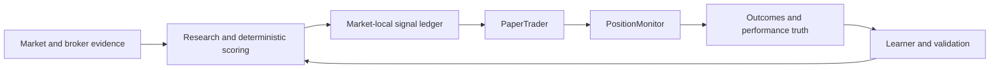

# Kairos System Overview

> Last reviewed: 2026-08-06 (architecture-to-production conformance baseline)
> Audience: an engineer or operator who needs a quick orientation before reading the
> canonical architecture chapters.

Kairos is a personal investing research system for separate US/USD and India/INR
books. It runs research and paper-trading workflows autonomously within fixed policy
boundaries, records outcomes, and uses governed evidence to evaluate future changes.
Live broker behavior remains separately controlled and safety-gated.

## The lifecycle

This is an orientation diagram, not the live topology. The rendered agent map in
Dashboard -> Agents is the single source for agent-to-agent edges and history.

## What keeps the system safe

- US/USD and India/INR pools remain isolated.
- LLM output is advisory and explainable; deterministic code owns financial state,
  eligibility, pricing, risk checks, and broker execution.
- Provider degradation, stale evidence, and ambiguous order state are treated as
  explicit conditions rather than silently fabricated data.
- Shadows and historical replay are observation systems until their own evidence and
  approval gates are satisfied.
- The exogenous-risk foundation records future India domestic and global-spillover
  evidence only. It has no source adapter or decision consumer; missing evidence is
  unavailable rather than neutral.
- Live actions are subject to the active autonomy, market-control, kill-switch,
  mandate, and broker-account controls.

## Where to go next

The complete architecture is not repeated here. Use the [Architecture Portal](ARCHITECTURE.md)
for the documentation hierarchy, then begin at [docs/arch/00-index.md](docs/arch/00-index.md).
For a particular feature, its `features/<feature>/FEATURE_ARCHITECTURE.md` is the
micro-architecture; [PROJECT_DECISIONS.md](PROJECT_DECISIONS.md) records why approved
choices were made.

When this overview and a chapter disagree, the chapter wins for subsystem behavior;
when a chapter and the live diagram disagree about topology, the diagram source and its
history must be reconciled in the same change.

The current conformance baseline is recorded in
[docs/audits/2026-08-06-architecture-production-conformance.md](docs/audits/2026-08-06-architecture-production-conformance.md).
It is the place to check whether a design is active, dormant, shadow-only, or only a
proposal before relying on it operationally.

This overview is updated only when the reader's orientation changes. A provider,
schema, schedule, money-path, or feature-state change updates its owning chapter and
feature implementation result in the same commit; see the contract in
[ARCHITECTURE.md](ARCHITECTURE.md).
