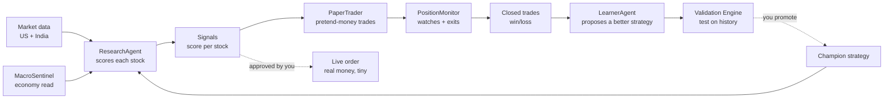
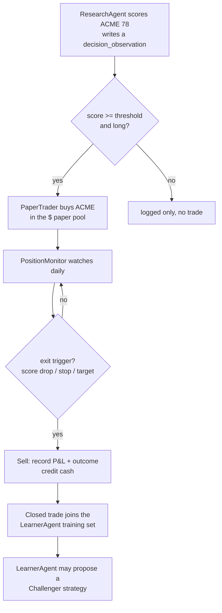
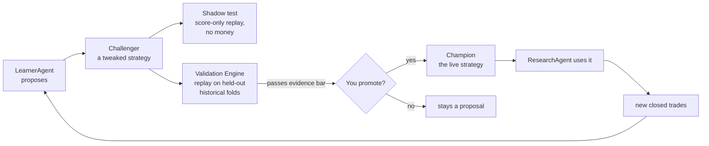
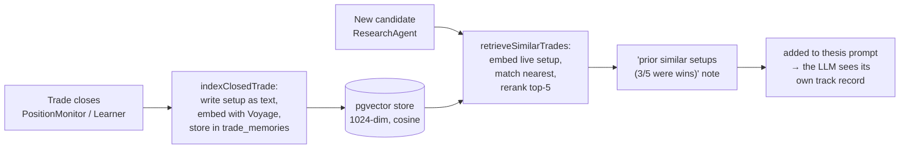
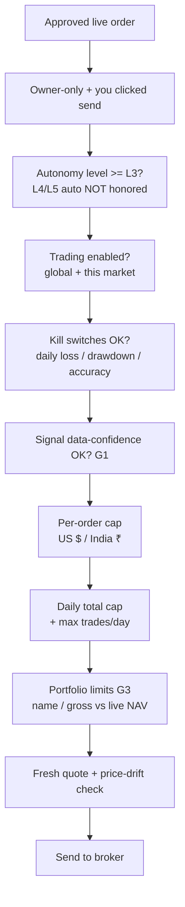

# Kairos — System Overview (read this first)

**Audience:** anyone. Plain language, diagrams, worked examples. This is the single
start-to-end explanation of the whole app. Deeper detail lives in `ARCHITECTURE.md`,
`AGENTS.md`, the per-feature docs in `features/*/FEATURE_ARCHITECTURE.md`, and the live
diagram on `/dashboard/agents`.

> **Keep this current.** Any change to a feature, an agent, the pipeline, the evolution
> loop, or a money/risk control must update this file in the same change (see the rule in
> `CLAUDE.md`). A change that ships without updating this doc is incomplete.

---

## 1. What is Kairos? (the core idea)

Kairos is an **automated investing research assistant** that behaves like a small, careful
hedge-fund team living inside one app. It doesn't just pick stocks — it **runs a loop**:

> **Research → Decide → Trade (on paper first) → Watch → Learn → Improve → repeat.**

The important word is **loop**. Most stock tools give you a score and stop. Kairos scores a
stock, acts on it in a **paper (pretend-money) portfolio**, watches how that trade actually
turns out, and then **feeds the outcome back** to make the next decision smarter. Real money
is optional, always small, and **never moves without you clicking "yes."**

Three principles hold everywhere:
1. **Paper first, real money last.** Every strategy proves itself on pretend money before a
   cent of real money is at stake.
2. **The AI proposes, a human disposes.** Agents can *suggest* a new strategy or a trade,
   but a person must approve anything that touches real money or changes the live strategy.
3. **Evidence before belief.** A proposed improvement must beat the current one on held-out
   historical data before it's allowed to take effect.

---

## 2. The big picture (one diagram)

Read it as a wheel: data comes in on the left, becomes decisions, becomes trades, becomes
outcomes, and the outcomes teach a better **Champion strategy** that feeds back into
ResearchAgent. That feedback arrow is the whole point.

---

## 3. What the app does (feature map)

- **Screening & research** — scans the US + India stock universes, scores candidates across
  5 dimensions, tracks how each score trends over time.
- **Paper trading** — a simulated portfolio per market (US in $, India in ₹) that trades the
  signals with realistic fills, stops, and targets.
- **Live trading (optional, human-gated)** — real orders via Robinhood (US) and Zerodha Kite
  (India), each behind hard money limits and a manual click.
- **Learning loop** — turns closed-trade outcomes into proposed strategy improvements,
  validated on history before a human promotes them.
- **Coaching & briefings** — a Mentor writes plain-English lessons from your outcomes; daily
  briefings summarize what happened.
- **Health & safety** — a System Health funnel + a read-only AI "triage" agent surface
  problems; layered money controls (caps, kill switches) protect real money.

---

## 4. The daily rhythm (when things run)

| Agent | Schedule | One-line job |
|---|---|---|
| MacroSentinel | Weekly | Read the economy → a "risk regime" |
| ResearchAgent | Daily, market mornings | Score every tracked stock |
| PaperTrader | Daily, after research | Open pretend-money positions from strong signals |
| PositionMonitor | Daily, after close | Update prices, run exits (stop/target/score-drop) |
| LearnerAgent | Weekly (Fri) | Propose a better strategy from closed trades |
| MentorAgent | After outcomes/learner | Write coaching notes to you |
| Health-Triage | Every 6h + on demand | Read-only "what's broken + suggested fix" |
| P1 Gate Cron | Weekly (Sun 02:00 UTC) | Count closed evaluable trades per market; surface System Health alert when ≥ 20 accumulate (unlocks opportunity-level IC metrics) |

Crons run in the cloud; the live-account snapshot refresh runs from your machine (needs your
Robinhood session).

---

## 5. The agents (what each one actually does)

Think of these as teammates. Each has ONE job, reads some tables, writes others. None of them
can move real money — only you can.

### MacroSentinel — the economist
- **Job:** once a week, reads 8 economic indicators and writes a **risk regime** (e.g. "risk-on"
  vs "unknown") to `macro_signals`.
- **Used by:** ResearchAgent's macro score. **Advisory only** — never trades.
- *Example:* if unemployment + rates flash danger, the regime turns cautious, nudging every
  stock's macro sub-score down.

### ResearchAgent — the analyst (the brain)
- **Job:** every market morning, score each tracked stock **0–100** across **5 dimensions** —
  fundamental, technical, sentiment, macro, insider — blended into one `analyst_score`.
- **Uses:** the promoted **Champion** weights (how much each dimension counts) + each stock's
  recent **score trend**.
- **Writes:** `agent_signals` (today's scores) + an immutable `decision_observations` row for
  *every* candidate (even rejected ones) — that ledger is the learning fuel.
- *Example:* NVDA scores 82 (strong fundamentals + rising trend) → a BUY signal; a random ETF
  with no real data no longer scores 100 (we fixed that today — see §8).

### PaperTrader — the pretend-money trader
- **Job:** take strong BUY signals (score ≥ threshold, long-only) and open positions in the
  **paper** portfolio using a safe, row-locked database transaction.
- **Per market:** US fills into a $ pool, India into a separate ₹ pool (they never mix).
- **Writes:** `paper_positions`, `paper_trades`, updates cash/NAV.
- **How it's triggered — standalone crons + same-day freshness (2026-07-08 fix, migrations 126–128).**
  Previously the ONLY thing that opened paper trades was a tail-call chained onto the *end* of the
  research run. When the US research run hung before reaching that chain (a slow external data
  cold-start), **zero US paper trades happened for days** while unfilled BUY signals piled up — and
  because paper trades are the raw material the whole learning/metrics/evolution loop feeds on, the
  loop starved. (India's research is lighter, finishes, and chained fine — that's why only US was
  affected.) The fix gives each market its **own** paper-trade cron
  (`kairos-paper-trade-us` ~10:05 AM ET, `kairos-paper-trade-india` ~4:35 PM IST) that fills
  independently of whether research finished. To make a standalone run safe:
  - **Freshness:** it fills only signals created **today, in that market's own timezone**
    (New York for US, Kolkata for India). Older pending signals are marked **`expired`** and never
    filled — so a cron waking up to a 10-day backlog can't open stale trades. Freshness is enforced
    inside the query, so a pile of stale high-score signals can't crowd fresh ones out.
  - **No double-fills:** each run **claims** a signal (stamping which run owns it) before working it,
    and the final database transaction only completes the claim it owns. The old research→paper chain
    is kept on as a temporary backstop; the claim + two compare-and-set gates make the chain and the
    new cron safe to run at the same time (whichever grabs a signal first fills it; the other skips).
  - **No zombie runs:** if the fill run throws, it now marks its own run record `error` instead of
    leaving it stuck `running`.

**Risk gates added (2026-07-09):**
- **Re-entry cooldown** — after a position in a symbol closes, that symbol is blocked from a new BUY for 5 calendar days. Prevents immediately re-entering a trade that just stopped out.
- **Pyramid gate** — if an open position already exists for a symbol, a new BUY is only allowed if the new fill price is above the existing avg_cost (averaging UP only). Averaging DOWN into a losing position is blocked entirely.

### PositionMonitor — the risk watcher
- **Job:** after the close, refresh prices for everything held, then run **exits**: sell if
  today's fresh score drops too far, or a trailing stop (93% of the high) or price target hits.
- **Owns all exits.** Closed trades (with win/loss) become the LearnerAgent's training data.

**New exits added (2026-07-09):**
- **Time stop** — if a position's age exceeds the champion genome's `horizon_days` (default 10), PositionMonitor closes it. Prevents slow bleeds that never hit the hard stop but overstay the swing window; matches the backtest's `max_hold_days` assumption so live and backtest stay consistent.
- **Partial profit-taking** — when price hits the target, instead of a full close, PositionMonitor sells half (floor(qty/2)) at target price and moves the stop up to breakeven on the remainder (stop_loss = avg_cost). Only applies when qty ≥ 2. The cash from the partial close is credited to the market's pool immediately.
- **NAV drawdown circuit breaker** — every run computes the weekly NAV return for each market. If it drops more than 5% in a week, `app_paused` is auto-set true and a critical System Health alert fires. This is an automatic safety pause — you must manually re-enable trading.
- **Benchmark sync** — each run fetches the benchmark price for each market (VOO for US, ^NSEI for India) and upserts `paper_performance.bench_nav` so alpha is computed against live benchmark NAV, not a stale snapshot.

### LearnerAgent — the strategy improver
- **Job:** weekly, look at a market's **closed trades** and propose a **Challenger** — a tweaked
  set of weights (or a broader "genome" change). It does **NOT** change the live strategy or
  touch positions.
- **Gated:** needs 10+ closed trades before it's allowed to propose. Only guards against bad
  data (a Challenger trained on flagged/low-quality trades is rejected).
- **The genome is now a LIVE control (Build 1, 2026-07-08).** When you promote a Challenger to
  **champion**, its **genome** — entry threshold, exit stop/target percentiles + horizon, and
  position-sizing cap/floor/mode — actually drives the next day's research + paper trades. Before
  this, only the 5 scoring weights changed; the rest of the genome was recorded but ignored, so a
  validated improvement traded identically to the old champion. **Money-safety:** the genome's size
  cap is clamped to your owner-set `position_size_pct` — the loop can size **down** but never above
  your limit. A champion with no genome uses safe defaults identical to the old fixed behavior, so
  nothing changes until you promote a genome-bearing Challenger (which still requires passing the
  fail-closed validation gate **and** your click).

- **Performance Truth (Build 3, 2026-07-08).** The Learning page (`/dashboard/learning`) now shows
  the metrics that actually judge a strategy, not just win-rate: **Sharpe** and **Sortino** (return
  per unit of risk / downside risk), **max drawdown** (worst peak-to-trough drop), **expectancy** and
  **profit factor** (average edge per trade, gross wins ÷ gross losses), **alpha vs benchmark**, a
  **gross-vs-net** bar (how much spread/slippage cost the book), and a **calibration curve** (when the
  score says "70% win", does it win 70% of the time?). Split by market (US / India). **Honesty rule:**
  any metric built on too small a sample (fewer than 20 trades/returns, 10 labeled predictions) shows
  "too small" instead of a flattering-but-meaningless number. **Truth rule:** this view *counts*
  data-tainted trades (the opposite of the learner, which *excludes* them) — the book still moved, so
  P&L must not hide them; the tainted count is shown separately so you can judge the mix. Read-only,
  no new tables.
- **Execution slip tracking (Build 4a, 2026-07-08).** Every paper fill now records the **decision
  price** it wanted (the pre-slippage mid) next to the **fill price** it actually got, and stamps the
  **realized slip** (`fill / expected − 1`). The Performance-Truth section adds an **"Exec Slip
  (realized)"** tile that shows the mean realized slip against the flat **0.05%** the fill model
  assumes. Today they match (fills are same-tick), so the tile confirms the assumption is honest;
  once the deferred phases land — **4b** illiquid rejection + partial fills (needs a per-candidate
  volume feed), **4c** next-bar / next-open fill timing — realized and modeled diverge and this tile
  becomes the execution-quality truth signal. Additive columns only (`expected_price`,
  `realized_slip_pct`, `fill_status`); nothing about sizing, cash, gating, or the live path changed.

### Performance Truth Layer — the mandate-aware evaluation ledger

The Learning page (`/dashboard/learning`) now includes a **Performance Truth** panel that answers a stricter question than win-rate: *"Did this strategy produce repeatable, benchmark-relative edge in the mandate it claims to serve?"*

- **Investment mandates** (`investment_mandates` table) — named strategy contexts with a benchmark (VOO for US, NIFTY50.NS for India), horizon, and evaluation windows. Default mandates seeded: "Swing US 2-20d" and "Swing India 2-20d". `mandate_id` is now stamped on every `agent_signals`, `paper_trades`, and `decision_observations` row for attribution.
- **Deterministic evaluation** (`lib/evaluation/run-evaluation.ts`) — no LLM, no weight mutation. Computes Sharpe, Sortino, max drawdown, win rate, expectancy, alpha, cost-adjusted return, and execution slip vs modeled, all from closed paper trades for the selected mandate + market. Uses the same math already in `lib/analytics/performance-metrics.ts` — reuse, no new formulas.
- **Append-only ledger** (`strategy_evaluations`) — every evaluation run inserts a new row (a trigger blocks updates/deletes). A dataset hash detects reruns on the same trade set. P0 health label: `insufficient_sample` / `negative_or_zero_edge` / `promising_but_unvalidated` / `validation_required`.
- **UI** — mandate selector dropdown + "Run Evaluation" button + evaluation history table (Date | Trades | Sharpe | MaxDD | Alpha | Health) on `/dashboard/learning`. NAV/Sharpe tiles remain whole-book; trade metrics are mandate-filtered.
- **P1 gate cron** — a weekly Sunday cron counts closed evaluable trades per market. When ≥ 20 accumulate, it surfaces a System Health info alert (`p1_gate_ready:<market>`). This is the signal to build opportunity-level IC metrics (decision_observations × observation_labels). P0 is book-truth only; opportunity-level `opp_*` columns are null until P1.
- **Security:** `eligible_for_live_review` on a mandate is advisory ONLY — never read by any broker gateway or order placement code.

### MentorAgent — the coach
- Reads your outcomes + learner runs, writes plain-English **coaching insights** to
  `mentor_insights`. Advisory to *you*. Never touches money or weights.

### Health-Triage — the SRE
- Every 6h, reads open alerts + recent errors + data-quality + provider budgets and writes a
  short **"here's what's wrong and how to fix it"** to the dashboard. **Read-only** — it can
  diagnose and suggest, but can never change config, money limits, weights, orders, or code.
- For **Tier-1 safe actions** (retry a failed cron agent, resolve an info/warn alert), the
  dashboard health card shows one-click "Retry" / "Resolve" buttons. Action fires only after
  *you* click — nothing is auto-applied. Critical/error alerts require manual investigation.

---

## 6. A trade's life, end to end (worked example)

Follow one US stock, "ACME," from idea to lesson:

1. **Morning:** ResearchAgent scores ACME **78** and logs the full reasoning (which data was
   real, which weights were used).
2. **Fill:** 78 beats the threshold → PaperTrader buys ACME with ~15% of the $ pool (bounded by
   caps — §8).
3. **Watch:** each day PositionMonitor updates ACME's price and checks the exits.
4. **Exit:** ACME's score later falls below the exit line → sell, record +6% and outcome "win,"
   return cash to the pool.
5. **Learn:** that closed win goes into the LearnerAgent's corpus. If a pattern holds across
   many trades, the Learner proposes a Challenger (e.g. "weight technicals a bit higher").

**Real money version:** identical up to the decision, but instead of an auto paper-fill, *you*
review a proposal and click send — and it passes through every money control in §8 first.

---

## 7. How the system gets smarter (evolution / mutation)

This is the part that makes Kairos more than a scanner. It's a **safe evolution loop** —
like natural selection, but every mutation must prove itself on history *and* get a human's OK
before it's real.

The pieces, in plain terms:
- **Champion** = the strategy currently in charge. ResearchAgent reads its weights. One
  Champion **per market**.
- **Challenger** = a proposed replacement the Learner wrote. **Inert** — it does nothing until
  a human promotes it. (This is the guardrail that stops the AI silently rewriting itself.)
- **Genome** = what a Challenger is allowed to change: not just the 5 dimension weights, but
  entry threshold, holding horizon, exit style, sizing, universe. All inside hard, safe bounds.
- **Feature Registry** = the Learner can propose a brand-new *idea* (a formula), written as a
  spec with a falsification test. The formula is **never run as code** — only interpreted
  through a locked, whitelisted math grammar. (No AI writing arbitrary code.)
- **Shadow decisions** = a Challenger can "shadow" real runs: it records what it *would* have
  done on every stock, with no fills and no cash — a free dress rehearsal. Off by default.
- **Validation Engine** = deterministic, **no LLM**. Replays Champion vs Challenger on
  *purged, walk-forward* slices of the decision ledger (so it can't cheat by peeking at the
  future) and demands real evidence of improvement before promotion is even allowed.
- **You promote** = the final human gate. Promotion is **blocked (HTTP 412)** unless Validation
  passed. Flip the Challenger to Champion → ResearchAgent uses it on the next run.

**Analogy:** the Learner is a scientist proposing a hypothesis (Challenger). The Validation
Engine is the peer-review + back-test. You are the journal editor who says "publish." Only
then does the new idea change how the fund actually invests.

**Data-integrity guard (added today):** a decision made on missing/partial data (e.g. only
sentiment was available) gets a low **data_confidence** score. Those weak decisions are kept
out of live-money sizing, so a bad-data signal can't drive a real trade. (Measure-only for the
learner today, pending calibration.)

### 7a. Trade-history memory (the system remembers its own past)

Weight mutation (above) learns *slowly* — it needs many closed trades and a human promotion.
A second, faster loop lets the system recall **specific past setups** the moment it sees a
lookalike, without changing any weights or needing approval. This is a **retrieval-augmented
memory** (RAG) over the fund's own trade history.

In plain terms:
- **Write side:** every time a trade closes, `indexClosedTrade()` turns that setup into a short
  text document (symbol, direction, the five dimension scores, outcome, exit reason), converts
  it to a **1024-number fingerprint** (an *embedding*, via Voyage `voyage-3.5`), and files it in
  the `trade_memories` store. Tainted / excluded trades are skipped so bad-data history can't
  poison memory.
- **Read side:** before scoring a fresh candidate, ResearchAgent fingerprints the *live* setup,
  pulls the nearest past setups out of the store, has a **reranker** (Voyage `rerank-2`) pick the
  genuinely most-similar few, and hands the LLM a one-line summary — *"prior similar setups: 3/5
  were wins."* The model now decides with its own history in view, not just today's data.
- **Where it's stored:** the store is **pgvector**, a vector index that already lives inside our
  Supabase database — no new service, no new bill. Similarity is nearest-neighbour by cosine.
- **Guardrails:** a **ticker filter** keeps document-retrieval on-topic (a chunk that never
  mentions the symbol is dropped), and every retrieval writes a durable **trace** row so we can
  audit what memory influenced a decision. The whole path is **off unless the Voyage key is set**
  — no key means it quietly does nothing rather than erroring.

This memory does **not** move money or change weights on its own. It only enriches the context
the LLM reasons over — a faster complement to the slow, human-gated weight evolution above.

---

## 8. Money safety (the layers that protect real money)

Real trading is wrapped in layers — each independent, each fail-safe. Most were hardened today.

- **Autonomy ladder (master gate)** — a single declared maturity level in
  `strategy_config.autonomy_level` sits above every other control. Live orders are refused
  unless the level is `L3_live_manual` or higher (default is `L3_live_manual`, so current
  behavior is unchanged). Levels `L4_live_small_auto` / `L5_scaled_auto` *describe* a future
  autonomous envelope but are **not honored** — `AUTONOMOUS_LIVE_ENABLED` is hard-`false` in
  `lib/autonomy.ts`, so the owner still clicks send on every live order. There is no code path
  that places a live order without `requireOwner()`. Enforced identically in the US
  (`broker/orders`) and India (`kite/order`) gateways.
- **Per-order caps** — a single live order can't exceed your set $ (US) / ₹ (India) limit.
  You set both in **Settings → Live Order Limits** (with a Reset-to-defaults button).
- **Daily caps** — total live buying per day is bounded (count + cumulative $), enforced
  **atomically** so two fast clicks can't slip past.
- **Kill switches** — trading auto-halts on a bad day (daily loss, drawdown from peak, or low
  30-day accuracy) and flags any resting orders for you to review.
- **NAV drawdown circuit breaker (paper)** — PositionMonitor auto-pauses the whole app (`app_paused=true`) if any market's paper NAV drops more than 5% in a week. A critical System Health alert fires. Prevents a broken strategy from accumulating losses unchecked overnight. You re-enable manually.
- **Signal-quality gate (G1)** — a live BUY built on low-confidence data is refused unless you
  explicitly override.
- **Concentration limits (G3, US + India)** — a live BUY that would over-concentrate the
  account (too much in one name / too much gross) is refused. US: checked against the live
  account snapshot (equity + positions). India: checked against Kite `/user/margins` (cash)
  + `/portfolio/holdings` (last_price × qty) so NAV reflects the real portfolio. Both markets
  use the same `constructPortfolio` logic and fail-controlled on indeterminate holdings.
- **Server-side stop/target (India GTT)** — after a confirmed live India BUY, Kairos immediately
  places a Kite GTT (Good Till Triggered) two-leg bracket: one stop-loss leg (SL-M SELL) and
  one take-profit leg (LIMIT SELL). Kite auto-cancels the other leg when either fires. This
  means the stop and target are active even when Kairos is fully offline during market hours,
  closing the intraday crash gap that daily crons leave open. GTT placement is best-effort and
  non-blocking — a GTT failure is logged but never reverses the BUY. The GTT is cancelled
  when the position is sold through the Kite order route.
- **Paper caps** — the paper books have their own NAV-scaled caps so tests stay realistic
  without freezing.
- **The ultimate kill switch** is always *you*, at the broker (revoke access at Robinhood /
  Kite) — that works even if this app were compromised.

---

## 9. US vs India (same brain, two bodies)

- **Same 5-dimension scoring** runs on both markets.
- **US data:** FMP fundamentals, FRED macro, Finnhub analyst/earnings, Massive/EODHD candles,
  SEC EDGAR insider. **Execution:** Robinhood (manual paste) or the typed Execution Gateway.
- **India data:** Yahoo `.NS` (price + fundamentals) + direct NSE feeds (full universe, SEBI
  insider, option flow). **Execution:** Zerodha Kite, human-initiated, token re-armed daily.
- **Separate money pools:** US in $, India in ₹ — never mixed, so an INR fill can't corrupt US
  NAV.

---

## 10. Mini-glossary

- **Signal / analyst_score** — a stock's 0–100 rating today.
- **Paper trade** — a pretend-money trade used to test strategies safely.
- **Champion / Challenger** — the live strategy vs a proposed replacement.
- **Genome** — the set of knobs a Challenger may evolve.
- **Decision ledger (`decision_observations`)** — an immutable record of every scored decision;
  the learning fuel. Never edited or deleted.
- **data_confidence** — how much real evidence a decision had (low = thin data). Below 0.5 triggers a taint flag.
- **discovery_source** — how a symbol entered the research batch (holding / watchlist / screener_momentum / screener_value / metals_basket / region_etf / india_holding / india_screener / manual). Logged on every `decision_observations` row for pipeline attribution.
- **tainted / excluded_from_learning** — a `paper_trades` row with bad-data provenance. Tainted trades are excluded from learner training datasets; the trade itself is never deleted.
- **structured_issues** — machine-readable per-issue JSON from the health-triage agent (`issue_key`, `severity`, `root_cause`, `blast_radius`, `suggested_fix`). Replaces the old free-text `content` blob for programmatic action.
- **Kill switch** — an automatic trading halt on a bad day.
- **NAV** — total account value (cash + holdings).
- **investment_mandate** — a named strategy context (benchmark, horizon, evaluation windows) that `agent_signals`, `paper_trades`, and `decision_observations` are attributed to. Default: "Swing US 2-20d" / "Swing India 2-20d".
- **strategy_evaluation** — an append-only, deterministic evaluation snapshot per mandate. Stores book Sharpe/Sortino/MaxDD/win-rate/alpha/cost metrics and a `health_label`. Never updated — every run adds a new row.
- **P1 gate** — the threshold (≥ 20 closed evaluable trades per market) that unlocks opportunity-level IC metrics. Below the gate, the evaluation shows `insufficient_sample`.
- **re-entry cooldown** — 5-calendar-day block on re-buying a symbol after a position in it closes.
- **pyramid gate** — blocks adding to an existing position unless the new fill price exceeds the current avg_cost (averaging down is never allowed).
- **time stop** — closes a position when its age exceeds the champion genome's `horizon_days` (default 10). Prevents slow bleeds that never hit the stop/target.
- **partial profit-taking** — at price target, close half the position and move stop to breakeven on the remainder (only when qty ≥ 2).
- **NAV drawdown circuit breaker** — auto-pauses the app when weekly paper NAV drops > 5%.

---

*Maintained per the `CLAUDE.md` rule. Last updated: 2026-07-09 (**Risk gates + Performance Truth Layer**: time stop, partial profit-taking at target [move stop to breakeven on remainder], NAV drawdown circuit breaker [auto-pause at >5% weekly NAV drop], benchmark sync [daily VOO/^NSEI into paper_performance.bench_nav], re-entry cooldown [5 calendar days after close blocks same-symbol BUY], pyramid gate [no averaging down into losing positions]; P0 Performance Truth Layer [investment_mandates + strategy_evaluations migrations 133/134/135, append-only, mandate-aware, deterministic — no LLM]; P1 gate cron [weekly Sunday, surface System Health alert when ≥ 20 closed evaluable trades accumulate per market]. Prior: Watchdog + Edge/Factor lab + paper-fill reliability + Strategic Report Tiers 1–4 — see git log for earlier entries.)*
