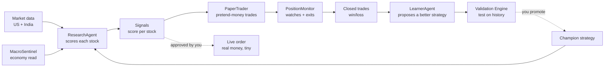
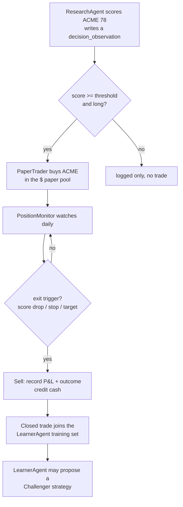
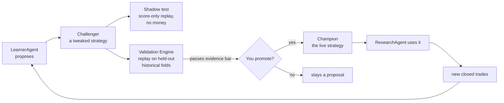
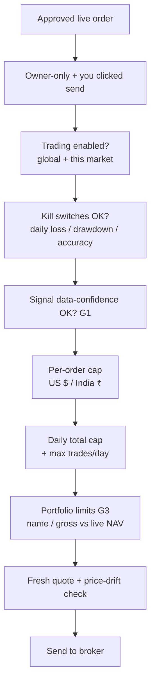

# Kairos — System Overview (read this first)

**Audience:** anyone. Plain language, diagrams, worked examples. This is the single
start-to-end explanation of the whole app. Deeper detail lives in `ARCHITECTURE.md`,
`AGENTS.md`, the per-feature docs in `features/*/FEATURE_ARCHITECTURE.md`, and the live
diagram on `/dashboard/agents`.

> **Keep this current.** Any change to a feature, an agent, the pipeline, the evolution
> loop, or a money/risk control must update this file in the same change (see the rule in
> `CLAUDE.md`). A change that ships without updating this doc is incomplete.

---

## 1. What is Kairos? (the core idea)

Kairos is an **automated investing research assistant** that behaves like a small, careful
hedge-fund team living inside one app. It doesn't just pick stocks — it **runs a loop**:

> **Research → Decide → Trade (on paper first) → Watch → Learn → Improve → repeat.**

The important word is **loop**. Most stock tools give you a score and stop. Kairos scores a
stock, acts on it in a **paper (pretend-money) portfolio**, watches how that trade actually
turns out, and then **feeds the outcome back** to make the next decision smarter. Real money
is optional, always small, and **never moves without you clicking "yes."**

Three principles hold everywhere:
1. **Paper first, real money last.** Every strategy proves itself on pretend money before a
   cent of real money is at stake.
2. **The AI proposes, a human disposes.** Agents can *suggest* a new strategy or a trade,
   but a person must approve anything that touches real money or changes the live strategy.
3. **Evidence before belief.** A proposed improvement must beat the current one on held-out
   historical data before it's allowed to take effect.

---

## 2. The big picture (one diagram)

Read it as a wheel: data comes in on the left, becomes decisions, becomes trades, becomes
outcomes, and the outcomes teach a better **Champion strategy** that feeds back into
ResearchAgent. That feedback arrow is the whole point.

---

## 3. What the app does (feature map)

- **Screening & research** — scans the US + India stock universes, scores candidates across
  5 dimensions, tracks how each score trends over time.
- **Paper trading** — a simulated portfolio per market (US in $, India in ₹) that trades the
  signals with realistic fills, stops, and targets.
- **Live trading (optional, human-gated)** — real orders via Robinhood (US) and Zerodha Kite
  (India), each behind hard money limits and a manual click.
- **Learning loop** — turns closed-trade outcomes into proposed strategy improvements,
  validated on history before a human promotes them.
- **Coaching & briefings** — a Mentor writes plain-English lessons from your outcomes; daily
  briefings summarize what happened.
- **Health & safety** — a System Health funnel + a read-only AI "triage" agent surface
  problems; layered money controls (caps, kill switches) protect real money.

---

## 4. The daily rhythm (when things run)

| Agent | Schedule | One-line job |
|---|---|---|
| MacroSentinel | Weekly | Read the economy → a "risk regime" |
| ResearchAgent | Daily, market mornings | Score every tracked stock |
| PaperTrader | Daily, after research | Open pretend-money positions from strong signals |
| PositionMonitor | Daily, after close | Update prices, run exits (stop/target/score-drop) |
| LearnerAgent | Weekly (Fri) | Propose a better strategy from closed trades |
| MentorAgent | After outcomes/learner | Write coaching notes to you |
| Health-Triage | Every 6h + on demand | Read-only "what's broken + suggested fix" |

Crons run in the cloud; the live-account snapshot refresh runs from your machine (needs your
Robinhood session).

---

## 5. The agents (what each one actually does)

Think of these as teammates. Each has ONE job, reads some tables, writes others. None of them
can move real money — only you can.

### MacroSentinel — the economist
- **Job:** once a week, reads 8 economic indicators and writes a **risk regime** (e.g. "risk-on"
  vs "unknown") to `macro_signals`.
- **Used by:** ResearchAgent's macro score. **Advisory only** — never trades.
- *Example:* if unemployment + rates flash danger, the regime turns cautious, nudging every
  stock's macro sub-score down.

### ResearchAgent — the analyst (the brain)
- **Job:** every market morning, score each tracked stock **0–100** across **5 dimensions** —
  fundamental, technical, sentiment, macro, insider — blended into one `analyst_score`.
- **Uses:** the promoted **Champion** weights (how much each dimension counts) + each stock's
  recent **score trend**.
- **Writes:** `agent_signals` (today's scores) + an immutable `decision_observations` row for
  *every* candidate (even rejected ones) — that ledger is the learning fuel.
- *Example:* NVDA scores 82 (strong fundamentals + rising trend) → a BUY signal; a random ETF
  with no real data no longer scores 100 (we fixed that today — see §8).

### PaperTrader — the pretend-money trader
- **Job:** take strong BUY signals (score ≥ threshold, long-only) and open positions in the
  **paper** portfolio using a safe, row-locked database transaction.
- **Per market:** US fills into a $ pool, India into a separate ₹ pool (they never mix).
- **Writes:** `paper_positions`, `paper_trades`, updates cash/NAV.

### PositionMonitor — the risk watcher
- **Job:** after the close, refresh prices for everything held, then run **exits**: sell if
  today's fresh score drops too far, or a trailing stop (93% of the high) or price target hits.
- **Owns all exits.** Closed trades (with win/loss) become the LearnerAgent's training data.

### LearnerAgent — the strategy improver
- **Job:** weekly, look at a market's **closed trades** and propose a **Challenger** — a tweaked
  set of weights (or a broader "genome" change). It does **NOT** change the live strategy or
  touch positions.
- **Gated:** needs 10+ closed trades before it's allowed to propose. Only guards against bad
  data (a Challenger trained on flagged/low-quality trades is rejected).

### MentorAgent — the coach
- Reads your outcomes + learner runs, writes plain-English **coaching insights** to
  `mentor_insights`. Advisory to *you*. Never touches money or weights.

### Health-Triage — the SRE
- Every 6h, reads open alerts + recent errors + data-quality + provider budgets and writes a
  short **"here's what's wrong and how to fix it"** to the dashboard. **Read-only** — it can
  diagnose and suggest, but can never change config, money limits, weights, orders, or code.
- For **Tier-1 safe actions** (retry a failed cron agent, resolve an info/warn alert), the
  dashboard health card shows one-click "Retry" / "Resolve" buttons. Action fires only after
  *you* click — nothing is auto-applied. Critical/error alerts require manual investigation.

---

## 6. A trade's life, end to end (worked example)

Follow one US stock, "ACME," from idea to lesson:

1. **Morning:** ResearchAgent scores ACME **78** and logs the full reasoning (which data was
   real, which weights were used).
2. **Fill:** 78 beats the threshold → PaperTrader buys ACME with ~15% of the $ pool (bounded by
   caps — §8).
3. **Watch:** each day PositionMonitor updates ACME's price and checks the exits.
4. **Exit:** ACME's score later falls below the exit line → sell, record +6% and outcome "win,"
   return cash to the pool.
5. **Learn:** that closed win goes into the LearnerAgent's corpus. If a pattern holds across
   many trades, the Learner proposes a Challenger (e.g. "weight technicals a bit higher").

**Real money version:** identical up to the decision, but instead of an auto paper-fill, *you*
review a proposal and click send — and it passes through every money control in §8 first.

---

## 7. How the system gets smarter (evolution / mutation)

This is the part that makes Kairos more than a scanner. It's a **safe evolution loop** —
like natural selection, but every mutation must prove itself on history *and* get a human's OK
before it's real.

The pieces, in plain terms:
- **Champion** = the strategy currently in charge. ResearchAgent reads its weights. One
  Champion **per market**.
- **Challenger** = a proposed replacement the Learner wrote. **Inert** — it does nothing until
  a human promotes it. (This is the guardrail that stops the AI silently rewriting itself.)
- **Genome** = what a Challenger is allowed to change: not just the 5 dimension weights, but
  entry threshold, holding horizon, exit style, sizing, universe. All inside hard, safe bounds.
- **Feature Registry** = the Learner can propose a brand-new *idea* (a formula), written as a
  spec with a falsification test. The formula is **never run as code** — only interpreted
  through a locked, whitelisted math grammar. (No AI writing arbitrary code.)
- **Shadow decisions** = a Challenger can "shadow" real runs: it records what it *would* have
  done on every stock, with no fills and no cash — a free dress rehearsal. Off by default.
- **Validation Engine** = deterministic, **no LLM**. Replays Champion vs Challenger on
  *purged, walk-forward* slices of the decision ledger (so it can't cheat by peeking at the
  future) and demands real evidence of improvement before promotion is even allowed.
- **You promote** = the final human gate. Promotion is **blocked (HTTP 412)** unless Validation
  passed. Flip the Challenger to Champion → ResearchAgent uses it on the next run.

**Analogy:** the Learner is a scientist proposing a hypothesis (Challenger). The Validation
Engine is the peer-review + back-test. You are the journal editor who says "publish." Only
then does the new idea change how the fund actually invests.

**Data-integrity guard (added today):** a decision made on missing/partial data (e.g. only
sentiment was available) gets a low **data_confidence** score. Those weak decisions are kept
out of live-money sizing, so a bad-data signal can't drive a real trade. (Measure-only for the
learner today, pending calibration.)

---

## 8. Money safety (the layers that protect real money)

Real trading is wrapped in layers — each independent, each fail-safe. Most were hardened today.

- **Per-order caps** — a single live order can't exceed your set $ (US) / ₹ (India) limit.
  You set both in **Settings → Live Order Limits** (with a Reset-to-defaults button).
- **Daily caps** — total live buying per day is bounded (count + cumulative $), enforced
  **atomically** so two fast clicks can't slip past.
- **Kill switches** — trading auto-halts on a bad day (daily loss, drawdown from peak, or low
  30-day accuracy) and flags any resting orders for you to review.
- **Signal-quality gate (G1)** — a live BUY built on low-confidence data is refused unless you
  explicitly override.
- **Concentration limits (G3, US + India)** — a live BUY that would over-concentrate the
  account (too much in one name / too much gross) is refused. US: checked against the live
  account snapshot (equity + positions). India: checked against Kite `/user/margins` (cash)
  + `/portfolio/holdings` (last_price × qty) so NAV reflects the real portfolio. Both markets
  use the same `constructPortfolio` logic and fail-controlled on indeterminate holdings.
- **Server-side stop/target (India GTT)** — after a confirmed live India BUY, Kairos immediately
  places a Kite GTT (Good Till Triggered) two-leg bracket: one stop-loss leg (SL-M SELL) and
  one take-profit leg (LIMIT SELL). Kite auto-cancels the other leg when either fires. This
  means the stop and target are active even when Kairos is fully offline during market hours,
  closing the intraday crash gap that daily crons leave open. GTT placement is best-effort and
  non-blocking — a GTT failure is logged but never reverses the BUY. The GTT is cancelled
  when the position is sold through the Kite order route.
- **Paper caps** — the paper books have their own NAV-scaled caps so tests stay realistic
  without freezing.
- **The ultimate kill switch** is always *you*, at the broker (revoke access at Robinhood /
  Kite) — that works even if this app were compromised.

---

## 9. US vs India (same brain, two bodies)

- **Same 5-dimension scoring** runs on both markets.
- **US data:** FMP fundamentals, FRED macro, Finnhub analyst/earnings, Massive/EODHD candles,
  SEC EDGAR insider. **Execution:** Robinhood (manual paste) or the typed Execution Gateway.
- **India data:** Yahoo `.NS` (price + fundamentals) + direct NSE feeds (full universe, SEBI
  insider, option flow). **Execution:** Zerodha Kite, human-initiated, token re-armed daily.
- **Separate money pools:** US in $, India in ₹ — never mixed, so an INR fill can't corrupt US
  NAV.

---

## 10. Mini-glossary

- **Signal / analyst_score** — a stock's 0–100 rating today.
- **Paper trade** — a pretend-money trade used to test strategies safely.
- **Champion / Challenger** — the live strategy vs a proposed replacement.
- **Genome** — the set of knobs a Challenger may evolve.
- **Decision ledger (`decision_observations`)** — an immutable record of every scored decision;
  the learning fuel. Never edited or deleted.
- **data_confidence** — how much real evidence a decision had (low = thin data).
- **Kill switch** — an automatic trading halt on a bad day.
- **NAV** — total account value (cash + holdings).

---

*Maintained per the `CLAUDE.md` rule. Last updated: 2026-07-08 (India G3 + Kite GTT server-side brackets + one-click health remediation).*
