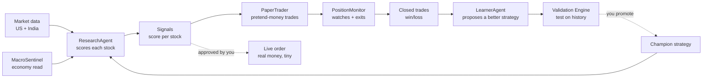
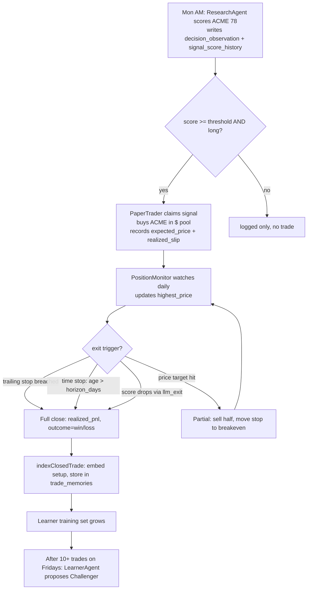

# Kairos — What Is This?
> Last updated: 2026-07-10
> Update this file when: product direction changes, new feature areas are added, core principles change, or the top-level pitch changes.

---

## 1. The core idea

Kairos is an **automated investing research assistant** that behaves like a small, careful
hedge-fund team living inside one web app. It doesn't just pick stocks — it **runs a loop**:

> **Research → Decide → Trade (on paper first) → Watch → Learn → Improve → repeat.**

The important word is *loop*. Most stock tools give you a score and stop. Kairos scores a
stock, acts on it in a **paper (pretend-money) portfolio**, watches how that trade actually
turns out, and then **feeds the outcome back** to make the next decision smarter. Real money
is optional, always small, and **never moves without you clicking "yes".**

---

## 2. Three core principles (apply everywhere)

1. **Paper first, real money last.** Every strategy proves itself on pretend money before
   a cent of real money is at stake.
2. **AI proposes, human disposes.** Agents can *suggest* a new strategy or trade, but a
   person must approve anything that touches real money or changes the live strategy.
3. **Evidence before belief.** A proposed improvement must beat the current one on
   held-out historical data before it is allowed to take effect.

---

## 3. The big picture

Read it as a wheel: data comes in on the left, becomes decisions, becomes trades, becomes
outcomes, and the outcomes teach a better **Champion strategy** that feeds back into
ResearchAgent. That feedback arrow is the whole point.

---

## 4. Feature map

| Feature area | What it does |
|---|---|
| Screening & research | Scans US + India universes, scores candidates across 5 dimensions, tracks score trend |
| Paper trading | Simulated portfolios per market ($US, ₹India) — realistic fills, stops, targets |
| Live trading | Real orders via Robinhood (US) + Zerodha Kite (India), human-gated |
| Evolution loop | Turns closed outcomes into Challenger strategies; human promotes to Champion |
| RAG trade memory | Semantic recall of past setups at scoring time |
| Performance Truth | Mandate-aware Sharpe/Sortino/alpha/drawdown evaluation ledger |
| Coaching & briefings | MentorAgent coaching notes + daily email briefings |
| System Health | Funnel of open issues → dashboard card + brief section |
| Multi-LLM routing | Claude / DeepSeek / Groq / Gemini; per-agent assignments; paper P&L per model |
| India parity | Full NSE scoring, ₹ paper pool, Kite execution, NSE insider+options feeds |
| Admin & DB cleanup | User management; monthly DB pruning cron |

---

## 5. What makes this different from a scanner

| Ordinary scanner | Kairos |
|---|---|
| Gives you a score today | Scores + remembers its past accuracy |
| You decide every trade | Pretend-money paper book tests decisions first |
| No feedback loop | Closed loop: outcomes teach future scoring |
| Single model | Multi-LLM routing; Claude vs DeepSeek P&L compared |
| US-only | US + India (INR ₹ pool separate from USD $) |
| No safety layers | 9+ independent money-safety gates |

---

## 6. A trade's life, end to end (worked example)

### US stock "ACME"

Step by step:

1. **Monday morning:** ResearchAgent scores ACME **78**, writes `agent_signals` (pending),
   `signal_score_history`, `decision_observations`.
2. **10:05 AM:** PaperTrader wakes, claims the signal, checks re-entry cooldown (ACME not
   held recently), checks pyramid gate (not held at all), buys ACME with 10% of pool NAV.
   Records `expected_price = 102.50`, fill at `102.55` (0.05% slip).
3. **Daily 4:15 PM:** PositionMonitor fetches live ACME price. Updates `highest_price`.
   Trailing stop = `max(stop_loss, highest_price × 0.93)`. Checks time stop (day 10 max).
4. **Day 8:** ACME hits the price target at $123. PositionMonitor sells half (floor(qty/2)),
   moves `stop_loss` to `avg_cost` ($102.55). The remaining half runs.
5. **Day 12:** Time stop fires (age > 10 days). PositionMonitor closes the remainder.
6. **Close:** `paper_trades` updated with exit_price, pnl_pct, outcome. Cash returned.
   `indexClosedTrade()` embeds the setup and stores in `trade_memories`.
7. **Friday 5 PM (after 10+ trades):** LearnerAgent reads the closed cohort, proposes a
   Challenger with slightly higher technical weight.
8. **Owner reviews:** Validation Engine confirms Sharpe 0.72, win_rate 58%. Owner promotes
   Challenger to Champion. ResearchAgent's next Monday run uses the new weights.

---

## 7. Dashboard navigation map

All pages under `app/dashboard/`. All require auth (Supabase middleware).

| Path | Page name | What's on it |
|---|---|---|
| `/dashboard` | Home | Portfolio summary, live account, macro regime banner, System Health card, agent status |
| `/dashboard/research` | Research | Signal list, symbol cards, score breakdown, thesis |
| `/dashboard/learning` | Learning | LearnerAgent controls, Champion/Challenger, strategy versions, Performance Truth panel, mandate selector |
| `/dashboard/agents` | Agents | Agent status grid, System Map diagram (Mermaid, from `system-map.json`), per-agent diagrams |
| `/dashboard/upgrade-path` | Upgrade Path | Owner-only live inventory of shadow/paper experiments: evidence counts, provider-call accounting, benefit verdict, blockers, schedule truth, and review ETA |
| `/dashboard/markets` | Markets | Macro sentinel gauge, sector TradingView chart, insider trades, breadth |
| `/dashboard/smart-money` | Smart Money | Options flow, insider signals, trade queue; 4 tabs; both markets |
| `/dashboard/india` | India | NSE score tracker, ₹ paper portfolio, Kite live holdings, India order form |
| `/dashboard/live-portfolio` | Live Portfolio | All Robinhood account positions, CSV import, trade enrichment, performance chart |
| `/dashboard/journal` | Decision Journal | Trade decision log, signal→fill→outcome linking |
| `/dashboard/mentor` | Mentor | MentorAgent coaching insights |
| `/dashboard/briefing` | Briefing | Latest briefing, send history |
| `/dashboard/backtest` | Backtest | Validation Engine replay, results |
| `/dashboard/strategies` | Strategies | Strategy Registry (Champion/Challenger list + promote/retire/reject) |
| `/dashboard/scanner` | Scanner | US + India universe scan, NIFTY-100 live fallback |
| `/dashboard/settings` | Settings | Risk profile, market focus, live order limits, broker connections |
| `/dashboard/admin` | Admin | User management, role/tier updates, DB cleanup |
| `/dashboard/admin/vault` | API Vault | Runtime API key management |
