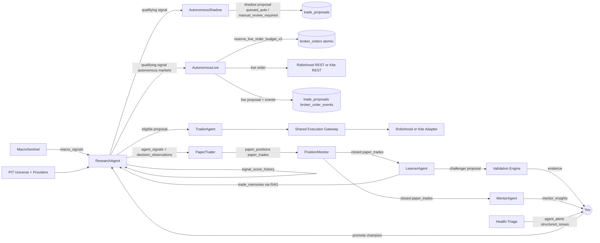

# Kairos — Agents
> Last updated: 2026-07-10 (PA3: AutonomousLive agent added — per-market off/manual/autonomous)
> Update this file when: a new agent is added or removed, an agent's schedule changes, an agent's inputs or outputs change, or an agent's key behavior changes.

**Adding an agent:** create `app/api/agents/<name>/route.ts` + add cron entry in `vercel.json` (cloud) or `scripts/run-agents.ps1` (local) + update this file + update `public/agent-diagrams/system-map.json`.

---

## Agent coordination model

**There are zero direct agent-to-agent HTTP calls.** All coordination is via shared Supabase
tables. Agents write and read a common set of tables; they never invoke each other's HTTP
handlers directly.



### Table-to-agent matrix

| Table | Written by | Read by |
|---|---|---|
| `macro_regime`, `macro_signals` | MacroSentinel | ResearchAgent, Dashboard |
| `agent_signals` | ResearchAgent, DeepSeekAgent | PaperTrader, TraderAgent, Dashboard |
| `signal_score_history` | ResearchAgent | ResearchAgent (trend), Dashboard charts |
| `decision_observations` | ResearchAgent | LearnerAgent, Validation Engine, PerformanceTruth |
| `paper_positions` | PaperTrader | PositionMonitor, LearnerAgent, Dashboard |
| `paper_trades` | PaperTrader, PositionMonitor | LearnerAgent, MentorAgent, PerformanceTruth |
| `strategy_versions` | LearnerAgent, User | ResearchAgent, Dashboard |
| `trade_memories` | PositionMonitor | ResearchAgent (RAG retrieval) |
| `agent_alerts` | All reporters | Health-Triage, Dashboard, Briefing |
| `mentor_insights` | MentorAgent | LearnerAgent (context), Dashboard |
| `strategy_evaluations` | PerformanceTruth/Evaluation | Dashboard |
| `validation_experiments`, `model_artifacts` | Validation/Calibration | Promotion gate, Dashboard |
| `broker_orders` | Execution Gateway + order sync | Reconciliation, Dashboard |
| `broker_order_events` (target) | Execution Gateway + order sync | Audit/reconciliation |
| `trade_proposals` (shadow) | AutonomousShadow | Dashboard, owner audit |
| `trade_proposals` (live) | AutonomousLive | Dashboard, reconciliation |
| `broker_order_events` | AutonomousLive, Execution Gateway | Audit/reconciliation |
| `llm_call_log` | All LLM callers | Admin cost view |
| `rag_traces` | ResearchAgent (retrieval) | Debug/audit |

---

## Agent registry

### MacroSentinel — the economist

**File:** `app/api/agents/macro-sentinel/route.ts`
**Schedule:** Mondays 8:00 AM ET (Windows Task Scheduler)
**LLM:** None — fully deterministic

**Inputs:**
- 8 Alpha Vantage macro endpoints: Treasury yield 10Y + 2Y, unemployment, real GDP, nonfarm
  payrolls, CPI, retail sales, federal funds rate, durable goods orders

**What it computes:**
```
danger_score = Σ (indicator_value × weight × direction_sign)
```

Each indicator has a hardcoded `direction_sign` (+1 bad, -1 good) and weight summing to 1.0.

| danger_score | regime |
|---|---|
| 0–24 | GREEN |
| 25–49 | YELLOW |
| 50–74 | ORANGE |
| ≥75 | RED |

**Outputs:**
- One `macro_regime` row (current regime + score)
- One `macro_signals` row per indicator (raw_value + contribution + direction)

**Key behavior:** Advisory-only. MacroSentinel never auto-throttles agents or halts trading.
User sees the regime first and decides whether to act.

---

### ResearchAgent — the analyst (the brain)

**File:** `app/api/agents/research/route.ts`, `lib/research-agent.ts`
**Schedule:** Weekdays 9:00 AM ET (US), Weekdays 6:15 AM ET post-NSE-close (India)
**LLM:** Groq `llama-3.3-70b-versatile` for thesis text only

**Inputs:**
1. Account-scoped holdings snapshots. Research may analyze approved holdings, but only holdings verified on the actual order account can authorize a SELL.
2. Watchlist from `watchlist` table
3. Screener candidates from FinancialDatasets `screen_stocks` (US) or NSE universe cache (India) — dual buckets:
   - *Momentum*: RSI > 60, price > 50-day MA, revenue acceleration, positive earnings revision
   - *Value*: P/E < sector median, high FCF yield, insider buying, recent analyst upgrades
4. Score trend from `signal_score_history` (last 5 rows per symbol)
5. Champion weights from `strategy_versions WHERE is_champion = true AND market = ?`
6. Macro regime from most recent `macro_regime` row
7. RAG memory via `retrieveSimilarTrades()` (if Voyage embeddings are configured)

**Current production baseline (`deterministic_v1`) — 5 dimensions:**

| Dimension | Source | What it measures |
|---|---|---|
| `fundamental_score` | AV OVERVIEW (US) / Yahoo quoteSummary (India) | **P/E vs sector norm** (`SECTOR_PE_NORM`, not an absolute band), profit margin, ROE, EPS sign, rev-growth YoY, **analyst target upside** (target vs live close / 200-DMA proxy) |
| `technical_score` | AV RSI + EMA + SMA (US) / Yahoo candles (India) | RSI(14) **continuous curve** (interpolated anchors, no bucket cliffs), price vs EMA20/50, 20d trend, **volume confirmation** (elevated volume ±8 in the prevailing direction) |
| `sentiment_score` | AV NEWS_SENTIMENT + StockTwits (US) / neutral (India) | Weighted news bullishness; India uses neutral baseline |
| `macro_score` | `macro_regime.danger_score` + `macro_signals` | Macro backdrop from MacroSentinel |
| `insider_score` | AV INSIDER_TRANSACTIONS (US) / NSE insider (India) | 90-day buy/sell ratio; congressional trades |

Sub-score formulas are deterministic and **fixed** (hand-tuned priors in `lib/data/scores.ts` + `lib/data/technicals.ts`) — they are NOT agent/genome-mutable. Only the dimension **weights** evolve (champion loop). New candidate features flow through the IC-gated Feature Registry, not by editing these formulas. (2026-07-10: scored the previously-dead volume + analyst-target signals, made RSI continuous, made P/E sector-relative.)

**Weighted composite (availability-masked + renormalized):**
```
analyst_score = Σ (dimension_score × effective_weight[dimension])
```
Missing/inapplicable dimensions are EXCLUDED and the remaining weights renormalized to sum to 1.0 (`lib/scoring/weighted-score.ts`); `< 2` usable dimensions → abstain (thin evidence), never a low score. Base weights: champion `weights_snapshot` → risk-profile static → `learning_priors`/`signal_weights` → default F.30/T.25/S.20/M.15/I.10.

#### Sub-score formula reference (`deterministic_v1`, exact values)

Each dimension outputs 0–100, clamped. Source of truth: `lib/data/scores.ts`, `lib/data/technicals.ts`.

**Fundamental** (`scoreFundamentals`) — base 50; ETF → flat 55; missing OVERVIEW → 55 (low-confidence). Additive:
| Field | Bands → points |
|---|---|
| P/E (sector-relative) | `ratio = pe / SECTOR_PE_NORM[sector]`. <0.7 → +18 · <1.0 → +8 · <1.4 → −3 · <2.0 → −12 · ≥2.0 → −22 |
| Profit margin | >0.20 → +20 · >0.10 → +10 · <0 → −20 |
| ROE (TTM) | >0.20 → +15 · >0.10 → +8 · <0 → −10 |
| EPS | >0 → +5 · ≤0 → −10 |
| Rev growth YoY | >0.20 → +15 · >0.10 → +8 · <0 → −10 |
| Analyst target upside `(target−price)/price` (price = live close, else 200-DMA) | >25% → +12 · >10% → +6 · <−10% → −8 |

`SECTOR_PE_NORM`: technology 30 · communication 20 · health care 25 · consumer disc. 24 · staples 22 · industrials 20 · materials 16 · energy 12 · financials 14 · utilities 18 · real estate 30 · unknown → 20.

**Technical** (`scoreTechnicals`) — base 50; <15 candles → flat 50. Additive:
| Signal | Contribution |
|---|---|
| RSI(14) | continuous interp over anchors `(20,−20)(35,−16)(45,−5)(50,+2)(55,+12)(60,+25)(72,+25)(75,+6)(85,−10)(100,−15)` |
| Price vs EMA50 | above +15 · below −15 |
| Price vs EMA20 | above +10 · below −10 |
| 20-day trend (±3% band) | up +10 · down −10 |
| Volume vs 20d avg (direction-confirming) | in-direction ≥1.5× → ±8 · ≥1.2× → ±4 (direction from EMA20/trend; neutral context → 0) |

**Sentiment** (`scoreSentiment`) — StockTwits bull/(bull+bear)×100; else AV news `(sent+1)×50`; else label (bull 65 / bear 35); else 50. Excluded from weighting unless `has_data`.

**Macro** (`fetchMacroScore`) — `100 − danger_score` from latest non-`unknown` `macro_regime` row (looks back up to 3 weeks). `unknown` regime → excluded.

**Insider** (`scoreInsider`/EDGAR) — `10 + buyRatio×80` where `buyRatio = buyValue/(buyValue+sellValue)` over 90 days. Requires ≥3 transactions; <3, no data, ADRs, or fetch-fail → `available:false` (excluded).

Known gaps (deliberately not yet added — see the hype-catch discussion / IC-gate path): relative-strength vs index, MACD/ATR, 52w-high proximity, EMA200; debt/leverage, FCF yield, EV/EBITDA, revenue *acceleration*, sector-relative margins; sentiment message-volume weighting; per-symbol macro beta; insider role/cluster weighting.

**Target v2:** asset/setup-specific PIT feature snapshots, comparable-universe rank, structural
evidence confidence, contradiction/event gates, and deterministic action. The complete contract is
`features/scoring-methodology/FEATURE_ARCHITECTURE.md`; v2 remains non-actionable until its
lifecycle and validation gates pass.

**LLM role:** explanation, risks, catalysts, and a bounded evidence-citing veto only. It never
generates score, probability, expected return, direction, weight, size, or lifecycle state.

**Screener target:** 3 candidates/day (not 5). With $10k NAV and 10% sizing, max 10
positions. Daily churn of 5+ creates overtrading.

**Outputs:**
- `agent_signals` row per symbol (score + thesis + recommendation)
- `signal_score_history` row (append-only score history)
- `decision_observations` row (even for skipped/expired candidates)
- `rag_traces` row (if RAG ran)

---

### DeepSeekAgent — the comparison analyst

**File:** `app/api/agents/deepseek/route.ts`
**Schedule:** Weekdays 9:00 AM ET (parallel with ResearchAgent)
**LLM:** DeepSeek `deepseek-chat`

**Inputs:** Same watchlist and screener pipeline as ResearchAgent.

**Key behavior:** Advisory comparison only. Current code asks DeepSeek for an LLM-generated
`analyst_score`; it must be tagged `score_source='llm_advisory'`, remain `status='advisory'`,
and be structurally excluded from PaperTrader and TraderAgent. Future comparison should reuse the
deterministic score and compare explanation/veto quality.

**Outputs:** `agent_signals` rows tagged `agent_label = 'deepseek'`

---

### PaperTrader — the pretend-money trader

**File:** `app/api/agents/paper-trade/route.ts`
**Schedule:** US 10:05 AM ET, India 4:35 PM IST (standalone crons, independent of research)
**LLM:** None

**Inputs:**
- `agent_signals` WHERE `status = 'pending'` AND `created_at` is today (market timezone) AND `market = ?`
- deterministic `score_source` and a strategy version currently in `paper_active` lifecycle
- `paper_portfolio` for pool cash
- `paper_positions` for existing open positions

**Key behavior:**

**Signal freshness gate:** Only fills signals created today in the market's own timezone
(New York for US, Kolkata for India). Older signals are marked `expired`.

**Claim-and-fill protocol (prevents double-fills):**
1. Claims a signal by stamping `claim_run_id` on the `agent_signals` row
2. Opens paper position only if it still owns the claim

**Position sizing:**
- `position_size_pct` from champion genome (clamped to `strategy_config.position_size_pct`)
- Slippage model: 0.05% above mid
- Records `expected_price` and `realized_slip_pct` on every fill

**Risk gates (added 2026-07-09):**
- **Re-entry cooldown:** 5-calendar-day block after a position in a symbol closes
- **Pyramid gate:** New BUY only if fill price > existing avg_cost (no averaging down)
- **Long-only for new positions:** SELL signals only apply to symbols already held

**Outputs:**
- `paper_positions` row (new open position)
- `paper_trades` row (buy leg)
- `paper_order_events` row (submitted + filled events)
- Updates `paper_portfolio.cash` and `paper_portfolio.nav`

---

### PositionMonitor — the risk watcher

**File:** `app/api/agents/position-monitor/route.ts`
**Schedule:** US 4:15 PM ET, India 6:35 AM ET
**LLM:** None (exits are rule-based)

**Inputs:** All open `paper_positions` for the market; current prices.

**What it does on each run:**
1. Fetch current prices for all open `paper_positions` in the market
2. Update `highest_price` if today's price is a new high
3. Run exit checks (in priority order):
   - **Time stop:** age > `champion_genome.horizon_days` (default 10) → close
   - **Trailing stop:** `stop_loss = max(original_stop, highest_price × 0.93)` → close if breached
   - **Price target:** at target price → **partial profit-taking** (sell half, move stop to
     breakeven on remainder; full close only when qty < 2)
   - **Score drop exit:** fresh `analyst_score` < exit threshold → `exit_reason = 'llm_exit'`
4. **NAV drawdown circuit breaker:** if weekly NAV return < -5%, set
   `strategy_config.app_paused = true` and fire a critical System Health alert
5. **Benchmark sync:** upsert `paper_performance.bench_nav` with today's VOO (US) / ^NSEI (India) price

**On close:**
- Delete the `paper_positions` row
- Mark the `paper_trades` buy row closed (exit_price, realized_pnl, pnl_pct, outcome, exit_reason)
- Credit cash back to `paper_portfolio`
- Call `indexClosedTrade()` for RAG (if Voyage embeddings are configured)
- Append to `paper_order_events`

---

### TraderAgent — the live order proposer

**File:** `app/api/agents/trader/route.ts`
**Schedule:** Weekdays 9:45 AM ET (after research settles)
**LLM:** None

**Inputs:** eligible deterministic `agent_signals`. A numeric score alone is not live eligibility.

**Current behavior:** creates proposals. Manual submission is owner-gated through the hardened
Execution Gateway in `app/api/broker/orders/route.ts`.

- **`manual` (default):** Creates `trade_proposals` rows with `status = 'pending_review'`.
  Owner reviews and approves/rejects in the dashboard. Send invokes the deterministic Execution
  Gateway and broker preview/place sequence; no LLM supplies order parameters.

- **`auto` (future L4):** the old direct-submit branch is rejected. An authenticated worker may
  call only the shared execution kernel, under deployment flag, expiring owner lease, atomic
  budget, and a `live_approved` scoring version. Auto BUY is blocked until live protective exits,
  partial-fill sync, and reconciliation are operational.

**Current auto status:** disabled. India auto is a separate architecture. Eventual L4 must support
verified risk-reducing SELL before autonomous BUY.

**Architecture doc:** `features/live-auto-trading/FEATURE_ARCHITECTURE.md`

**Outputs:** `trade_proposals` rows (expire after 30 min in manual mode)

---

### LearnerAgent — the strategy improver

**File:** `app/api/agents/learner/route.ts` (entry); `app/api/agents/learner-brain/route.ts`
**Schedule:** Fridays 5:00 PM ET
**LLM:** Claude Opus 4.8 (upgraded 2026-07-03)

**Phase gate:** Mutation blocked until 10+ closed trades per market exist.

**Inputs (via tool-use loop — 9 tools):**
1. `get_closed_trades` — recent paper_trades with outcomes
2. `get_signal_weights` — current champion weights
3. `get_strategy_versions` — all challengers + their backtest results
4. `get_decision_observations` — scored decisions (including skipped)
5. `query_trade_decisions` — real historical enriched Robinhood trades by regime/action
6. `propose_challenger` — write a new `strategy_versions` row with new weights + genome
7. `run_validation` — trigger Validation Engine on the proposed challenger
8. `get_mentor_insights` — recent coaching notes
9. `semantic_search_decisions` — pgvector RAG over trade memories (if Voyage embeddings are configured)

**What it proposes:**
A Challenger `strategy_versions` row containing:
- 5 dimension weights (must sum to 1.0)
- Genome: `{entry_threshold, exit_stop_pct, exit_target_pct, horizon_days, position_size_pct, sizing_mode}`
- Possibly: a Feature Registry entry (a new formula idea — never runs as code)

**Auto-guard:** Blocks mutation if last 3 runs have win_rate < 35%.

**Governance boundary:** Learner/LLM may propose hypotheses, feature specs, and bounded
challengers. Deterministic fitting/optimizers produce numeric candidate parameters. Only Vaibhav
may promote lifecycle state. Learner cannot activate weights, versions, thresholds, money limits,
accounts, orders, or code.

**Closed-loop closure (2026-07-05):** When user promotes a Challenger to Champion, the
promoted `weights_snapshot` is read by ResearchAgent on its next run.

**Per-trade notes:** 1-sentence outcome summary per closed trade written to `learning_log`.

**Outputs:** `strategy_versions` (Challenger row), `learning_log` entries

---

### ThemeScout — the watchlist manager

**File:** `app/api/agents/theme-scout/route.ts`
**Schedule:** Sundays 8:00 PM ET
**LLM:** Claude Sonnet 4.6 (`claude-smart`)

**Inputs:** Alpha Vantage NEWS_SENTIMENT by sector.

**Key behavior:** Identifies emerging themes (e.g. `ai_infrastructure`, `clean_energy`). Adds
relevant symbols to `watchlist` tagged by theme. Prevents the watchlist from going stale and
introduces thematic discovery alongside the screener buckets.

**Outputs:** New `watchlist` rows tagged with `theme_tag` and `added_by = 'theme-scout'`

---

### MentorAgent — the coach

**File:** `app/api/agents/mentor/route.ts`
**Schedule:** After position-monitor + learner runs
**LLM:** Claude Sonnet 4.6 (`claude-smart`)

**Inputs:** Closed `paper_trades` + `learner_insights` + macro context.

**Key behavior:** Writes plain-English coaching insights to `mentor_insights`. Three types:
`pattern` (what worked), `lesson` (what to change), `warning` (risk concentrations). Advisory
only — never touches money, weights, or positions.

**Outputs:** `mentor_insights` rows

---

### Health-Triage — the SRE

**File:** `app/api/agents/triage/route.ts`
**Schedule:** Every 6h + on-demand from dashboard
**LLM:** Claude Haiku 4.5 (`claude-fast`)

**Read-only — can never change config, money limits, weights, orders, or code.**

**Inputs:**
- All open `agent_alerts`
- Recent `agent_runs` for stale/error status
- `llm_call_log` for budget burn rate
- AV daily budget remaining
- `live_account_snapshots` freshness

**Key behavior:** Reads and enriches existing alerts with `structured_issues` (machine-readable
`issue_key`, `root_cause`, `blast_radius`, `suggested_fix`). Creates new alerts for newly
discovered issues. Suggests fixes in plain English.

**Dashboard display:** `SystemHealthCard` on dashboard home. Green when clean. Severity-ranked.
Deep-link fix hints. Tier-1 safe actions (retry, resolve info/warn) are one-click.

**Outputs:** `structured_issues` on existing `agent_alerts`; new `agent_alerts` rows for
newly discovered issues

---

### AutonomousShadow — the execution dry-run

**Files:** `lib/trading/execution-kernel.ts`, `lib/trading/autonomous-shadow.ts`,
`app/api/agents/autonomous-shadow/run/route.ts` (owner POST),
`app/api/agents/autonomous-shadow/cron/route.ts` (CRON_SECRET POST)
**Schedule:** Weekdays 07:30 UTC (30 min after research cron)
**LLM:** None — fully deterministic

**No broker calls in PA1. Purpose: prove the execution kernel fires, gates fire correctly,
and shadow proposals accumulate evidence before live mode is ever enabled.**

**Inputs:**
- `strategy_config` live_auto_* policy snapshot
- `agent_signals` (last 24h, `score_source='deterministic_v1'`, direction=long, score ≥ threshold)
- Current `broker_orders` filled count (open positions)
- Today's `trade_proposals` with `execution_mode='autonomous_shadow'` count

**Key behavior:** For each qualifying signal, creates a `trade_proposal` row
(`execution_mode='autonomous_shadow'`, `auto_run_id`, `auto_decided_at`), then runs it through
`evaluateAutonomousExecution()` — 9 ordered gates (see `lib/trading/execution-kernel.ts`).
Updates proposal status to `queued_auto` (kernel approved) or `manual_review_required`
(gate failed with named reason). Writes one `decision_journal` entry per run. Never touches
broker APIs, never calls reserve_live_order_budget, never submits any order.

**Gates (in order):**
1. `AUTONOMOUS_LIVE_ENABLED` deployment flag
2. `live_auto_enabled` DB toggle
3. Lease not expired (`live_auto_enabled_until`)
4. Direction = long only
5. Score ≥ score_threshold
6. `evidence_confidence` ≥ `live_auto_min_evidence_confidence` (floor 0.6)
7. Open positions < `live_auto_max_open_positions`
8. Orders today < `live_auto_max_orders_per_day`
9. Proposed notional ≤ `live_auto_max_per_order_usd` (skipped in PA1 — notional = 0)

**In current deployment:** gate 1 fires unless `AUTONOMOUS_LIVE_ENABLED=true` is set in Vercel env.
When false, all proposals land on `manual_review_required`. Shadow accumulates evidence.

**Outputs:** `trade_proposals` rows (shadow), `decision_journal` run summary

---

### AutonomousLive — the live submitter (PA3)

**Files:** `lib/trading/execution-kernel.ts`, `lib/trading/autonomous-live.ts`,
`app/api/agents/autonomous-live/cron/route.ts` (CRON_SECRET POST)
**Schedule:** Weekdays 14:00 UTC (10:00 AM ET, after research at 13:00 UTC)
**LLM:** None — fully deterministic

**Runs ONLY when:**
- `AUTONOMOUS_LIVE_ENABLED=true` in Vercel env AND
- `strategy_config.live_auto_enabled=true` AND
- `live_auto_enabled_until` not expired AND
- `live_auto_mode_us='autonomous'` or `live_auto_mode_india='autonomous'`

**Inputs:**
- `strategy_config` policy + per-market mode columns
- `agent_signals` (last 24h, `score_source='deterministic_v1'`, direction=long, markets in autonomous mode)
- `live_account_snapshots` for NAV (account 605420660, max age 4h)
- `paper_trades` for Kelly calibration (last 100 closed)

**Key behavior:** Same 9-gate kernel as shadow, plus:
1. Checks kill switches (`app_paused`, `security_locked`, `trading_enabled`)
2. Checks `live_auto_mode_[market] = 'autonomous'` per signal's market
3. Calls `computeAutonomousSizing()` for approved signals
4. Calls `reserve_live_order_budget_v2` RPC (`p_execution_actor='autonomous_worker'`) — atomic
5. Submits to broker:
   - US: `rhPlaceMarketOrder()` via Robinhood REST API (direct, no MCP — unavailable in serverless)
   - India: `placeEquityOrder()` via Kite Connect REST
6. Updates `broker_orders`: `status=submitted` + `broker_order_ref`
7. Appends `broker_order_events` row (`actor_kind='autonomous_live'`)
8. Updates `trade_proposals`: `status=queued_auto` or `manual_review_required`

**Per-market mode (migration 141):**
- `off` — market skipped entirely
- `manual` — no live orders from this agent; owner clicks Approve in dashboard
- `autonomous` — live orders submitted per above

**Safety:** `approved_by_user=false` in broker_orders. Any gate failure = `manual_review_required`, no order. Budget exceeded (RPC throws) = skip, log. Broker error = `unknown_needs_reconcile`, budget stays reserved.

**Outputs:** `trade_proposals` (autonomous_live), `broker_orders`, `broker_order_events`, `decision_journal`

---

### BriefingAgent — the daily email

**File:** `app/api/briefing/generate/route.ts`
**Schedule:** Weekdays 8:00 AM (morning) + 4:30 PM (evening) ET
**LLM:** Claude Haiku 4.5 (`claude-fast`) for editor's note

**Inputs:** Latest signals, open positions, NAV, macro regime, open System Health alerts.

**Key behavior:** Generates morning and evening briefing emails. Morning: pre-market outlook.
Evening: trade recap. Sends via Resend (or configured EMAIL_PROVIDER). Includes "Open Issues"
band when System Health alerts are present.

**Outputs:** `briefings` row, `newsletters` row (on successful Resend send)

---

### Validation Engine

**File:** `lib/validators/backtest.ts`, `app/api/agents/backtest/route.ts`

**Deterministic, no LLM.** Replays Challenger vs Champion on the same PIT opportunity set. For
v2 it must use purged/embargoed walk-forward folds, train-fold-only preprocessing/calibration,
out-of-fold predictions, costs/turnover, and multiple-testing accounting. The existing five-weight
replay remains a baseline, not sufficient proof for a new scoring architecture.

**Eligibility gates:**
- **Sharpe ≥ 0.5**
- **Win rate ≥ 40%**

Computes: Sharpe, Sortino, max drawdown, win rate, expectancy, alpha vs benchmark. If gates
pass, sets `eligibility_passed = true` on the `experiment_runs` row. Promotion is blocked
(HTTP 412) unless `eligibility_passed = true`.

---

### Performance Truth Layer

**File:** `lib/evaluation/run-evaluation.ts`, `/api/agents/evaluation/*`

Mandate-aware, deterministic (no LLM), honesty-first evaluation panel on `/dashboard/learning`.

**Evaluation metrics:** Sharpe, Sortino, max drawdown, win rate, expectancy, profit factor,
alpha vs benchmark, execution slip (mean realized vs 0.05% modeled).

**Honesty rules:**
- Fewer than 20 trades → shows "too small" instead of a number
- Tainted trades are counted (P&L must not hide them) but labeled as tainted
- `health_label` summarizes: `insufficient_sample` → `negative_or_zero_edge` → `promising_but_unvalidated` → `validation_required`

**P1 gate:** Weekly Vercel cron counts closed evaluable trades per market. Fires a System
Health info alert when ≥ 20 accumulate.
