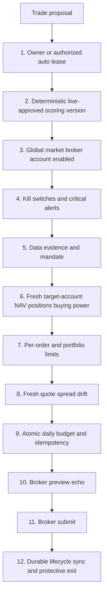

# Kairos — Risk & Safety

> Last updated: 2026-07-15 (LLM-discretion exit hole CLOSED — the last place LLM output could move money. Research direction gate extracted to pure `lib/signal-direction.ts` (unit-tested, `tests/signal-direction.test.ts`): held-position exit ("short") is now DETERMINISTIC — `isHeld && analystScore < mandate threshold` — the LLM's direction field NEVER sets an executable direction (previously an LLM "short" on a held name became an exit signal stored as `deterministic_v1`, and could teach the learner from LLM-created outcomes). SELL capability on holdings preserved per locked rule, now evidence-driven; LLM opinion kept advisory-only in `research_packets.raw_data._original_direction`. LearnerAgent's reassess flag renamed `llm_exit`→`score_reassess_exit` (score-only trigger); PositionMonitor honors both (legacy drain). Historical contamination verified ZERO (no closed trade ever exited via `llm_exit` or a long→short LLM flip). Entries were already deterministic; paper/live consumers already require `score_source="deterministic_v1"`.)
> Prior: 2026-07-15 (Supabase Security Advisor remediation — `20260715120000_security_rls_and_rpc_lockdown.sql`: the public anon API key could read 16 RLS-disabled `public` tables (incl. `agent_config`/`learner_config`) and call SECURITY DEFINER RPCs (`kairos_call_agent`, `activate_evidence_policy`, …) because they carried the default `GRANT EXECUTE TO PUBLIC`. Fix: RLS deny-all on 15 agent-internal tables + `authenticated`-read on `newsletters` (service_role bypasses, so agents/crons unaffected); `REVOKE EXECUTE … FROM PUBLIC` on the anon-callable definer RPCs (keeping `service_role`, and `authenticated` for the owner's `get_daily_ai_count`); pinned `search_path=public` on 15 definer/trigger fns. Verified via `get_advisors`: 0 ERROR, 0 anon-executable definer functions. Deferred WARNs: 7 always-true policies tighten at multi-tenant, `pg_net` schema move, Auth leaked-password toggle.)
> Prior: 2026-07-11 (Proactive broker-token health check — `checkRobinhoodTokenHealth` attempts a CAS refresh on the short-lived RH access token from the status route + health-triage cron (6h), reporting `broker-token:robinhood` only on a genuinely failed/absent refresh; Settings badge shows "Reconnect required" only on a real dead-refresh, else "Connected — valid until <access-token TTL>". See "Proactive broker-token health check" section. Prior: Daily Per-Holding Risk Analytics advisory surface.)
> Prior: 2026-07-11 (Codex Phase-B re-review remediation: (Codex#2/#3) the Kite identity gate no longer trusts allowlist *text* alone — `verifyKiteTradingIdentity()` (`lib/kite.ts`) now fetches Kite `/user/profile` and requires the CONNECTED token's `user_id` to equal `strategy_config.active_account_india` AND an allowlisted `broker_accounts{broker=kite,market=india,role=trading}` row. It is enforced at the single `placeEquityOrder()` choke point, so the canonical/autonomous/exit paths (via `kiteAdapter.submitOrder`) get the same check as the standalone route — not just the route. Fail-closed: config read err ⇒ 500, unset/absent/view_only ⇒ 403, profile unfetchable / user_id mismatch ⇒ 502/403. (Codex#1) the v2 budget advisory lock DROPS broker from its key (now `local_date:market:env`) so it matches the market-wide cap it guards — two brokers in one market can no longer take different locks and jointly exceed the cap. (Codex#4) migration 153 rejects non-finite (Infinity/NaN) qty/notional/cap and validates side/env/broker/symbol/order_type enums+identifiers, fail-closed. Migration 153 additive over 152 (never edited).)
> Prior: 2026-07-11 (Phase B residuals of 07_08_FULL_APP_REVIEW: A2 the standalone India Kite order route (`app/api/kite/order`) now enforces a fail-closed identity/allowlist gate — it requires `strategy_config.active_account_india` to match a `broker_accounts{broker=kite,market=india,role=trading}` row before reserving budget; unset/absent/view_only ⇒ 403 (no silent fallback), so India live is blocked until an allowlisted Kite trading row is inserted. Canonical-path *unification* still deferred. A4 read-only NAV reconciliation report `GET /api/paper/nav-reconcile` (owner-gated, zero writes) re-derives `nav == cash + Σ qty·price` per pool. A5 v2 daily-BUY budget window is market-local (America/New_York / Asia/Kolkata), not UTC; advisory lock keyed by local_date:market:broker:env. Dead edge-fn kill-switch copy deleted.)
> Prior: 2026-07-11 (Phase A P0 remediation of 07_08_FULL_APP_REVIEW: A1 kill switches take explicit `{book,accountId}` context — mode no longer inferred from live_auto_enabled; live baseline = account's own snapshot peak not START_NAV; new `sellAllowed` separates risk-increase from risk-reduction so a trip blocks BUY but not a verified SELL; `no_baseline`/`stale_snapshot` fail-close BUY only. A3 durable broker ACK (bounded DB retry → 202 needs_reconcile, never {ok:true}). A4 PositionMonitor NAV write errors now fatal. A5 budget-RPC v1/v2 EXECUTE revoked from public/anon/authenticated.)
> Prior: 2026-07-10 (Phase 1 P0: L4 enforcement, conviction normalization, India currency, duplicate SELL, cancel-on-kill BUY-only; Codex P0/P1: breakdown veto, calibration OOS gate, promotion governance.)
> Update when any authorization, scoring eligibility, limit, account, order, reconciliation, exit, or kill-switch behavior changes.

---

## Overview

Manual and future autonomous orders must pass one shared Execution Gateway. Manual and auto differ only in **who authorizes the proposal**; they do not have separate money-safety implementations.



Unknown, null, stale, malformed, or errored state on a live BUY fails closed. Verified risk-reducing SELL exits remain exempt only from BUY budgets/caps; they still require account, holdings, quote, idempotency, broker, and audit checks.

---

## Gate details

### 1 — Authorization envelope

**Manual:** `requireOwner()` + request/CSRF guard + owner approval/Send action.

**Future auto L4:** all of deployment `AUTONOMOUS_LIVE_ENABLED=true`, `autonomy_level='L4_live_small_auto'`, `live_auto_enabled=true`, unexpired owner lease, authenticated cron worker, and a single-run lease. The gateway (`executeApprovedOrder`) enforces `autonomousWorkerAllowed(autonomy_level)` for non-owner actors — L3_live_manual is insufficient and returns 403. The autonomous path cannot use owner-only risk overrides.

Enabling an auto envelope is a human money/config change and is journaled. It is not permission for an LLM to change caps, accounts, strategy lifecycle, or code.

### 2 — Signal and scoring eligibility

Live BUY requires:

- deterministic `score_source`;
- strategy/scoring lifecycle `live_approved` with linked validation evidence;
- market/asset/setup allowed by the mandate;
- unexpired proposal and signal;
- long-only new-position decision;
- no unresolved taint or invalid LLM veto state.

A score threshold or `eligible_for_live_review` flag alone never grants live eligibility.

**Breakdown veto (deterministic, runs before momentum math).** `scoreTechnicals`
(`lib/data/technicals.ts`) evaluates `detectBreakdownVeto` first: a crash/meme
reversal — last bar down ≥2.5 ATR, or ≤−7% on ≥1.5× volume, or a bottom-quartile
close — caps the technical score at 20 regardless of RSI/EMA. Closes the prior bug
where a −12% high-volume reversal scored ~100 because RSI had fallen into the
preferred band while price was still above the EMAs. Thresholds are v0 guardrails
needing prospective validation per liquidity bucket.

**Promotion governance** (`app/api/strategies/versions/route.ts`). A champion can
only be promoted with a PASSED validation experiment: the `force_unvalidated`
bypass is hard-rejected (400). Demotion of the prior champion is always
market-scoped — the former unscoped demote-all fallback is removed and now aborts
the promotion on error, so promoting an India challenger never touches the US
champion.

**Automated validation boundary** (migration 170, `activate_strategy_shadow` RPC,
`lib/validation/automation.ts`). Automatic challenger validation + shadow routing
(gated per-market by `strategy_validation_automation`, fail-closed) has exactly one
automatic lifecycle transition: a PASSED challenger → non-executing `shadow_paper`.
It **cannot** promote a champion, create a paper fill, move cash, make a broker
proposal, or place a live order — the RPC is `service_role`-only, holds a per-market
advisory lock, caps at one shadow (`max_active_shadows` 0–1), and refuses any
champion/terminal/unvalidated version. Promotion and every execution gate above
stay separate and owner-only.

**Paper accounting integrity (2026-07-13).** Two silent-write bugs are fixed and
guarded: (1) `disableTrading` (kill switch) wrote a non-existent `strategy_config.notes`
column, so PostgREST rejected the whole update and the switch never actually set
`trading_enabled=false` — `notes` removed, the switch now halts as intended.
(2) An earlier `paper_portfolio` update bundled a non-existent `open_positions`
column and silently dropped close-proceeds cash credits, understating NAV and
tripping a PHANTOM drawdown/kill switch on India (~₹197k). The lost cash was
reconciled from the trade ledger (`seed − Σopen-cost + Σrealized`), and the
position-monitor now runs a **ledger reconciliation guard** every cycle: if
`cash_balance` drifts from the ledger beyond 0.5% of seed it raises
`paper-cash-drift:<market>` (warn) so drift is visible and actionable BEFORE the
drawdown breaker acts on corrupted NAV.

**Capital rotation P0 shadow only (migration 20260713143000).** PaperTrader now
records a `rotation_events` audit row when a candidate is rejected for
`insufficient_cash`, showing whether a same-market weaker holding could have
funded it. This is measurement only: `rotation_paper_execute_enabled=false` and
`rotation_live_proposals_enabled=false` by default, no paper sell/buy RPC exists
in this phase, no live proposal is created, and PositionMonitor remains the only
owner of true exit labels.

**Per-market pause/kill isolation (migration 171).** The pause and kill-switch
state was GLOBAL (`strategy_config.app_paused`/`trading_enabled`), so one
market's breaker halted BOTH — India's phantom drawdown even skipped the US
research run. Now `market_controls` holds one row per market; the drawdown
breaker calls `setMarketPaused(market)`, the kill switch `setMarketTrading(market,false)`,
and every gate reads `isPaused(svc, market)` / `isTradingEnabled(svc, market)`
(`lib/market-controls.ts`, fail-closed on read error). A market's trip isolates
to that market; the legacy global flags are retained as a **master-kill** that
still stops everything. Research is no longer gated by the pause at all (it is
measurement — only entry paths pause). Exits keep running during a pause. Owner
resumes a single market from the sidebar per-market banner (`/api/settings/pause`
with a `market`).

### 3 — Trading/broker/account enablement

All global, per-market, broker, and account toggles must be true. Broker resolution fails closed.

US order account is exactly Robinhood agentic account `605420660`. Account `965848641` is read-only for the approved research-holdings use; its NAV/positions cannot size or authorize agentic-account orders. The real implementation currently hardcodes/resolves account IDs; the documentation must not claim otherwise. Credentials/tokens remain encrypted in the vault and never enter code/logs.

### 4 — Kill switches

`lib/kill-switches.ts` checks per market for daily loss, peak drawdown, and rolling accuracy, disables trading, and creates a critical alert. Submit-time checks must rerun immediately before reserve/send.

**Accuracy-gate minimum sample (`MIN_ACCURACY_SAMPLE = 10`, 2026-07-14).** The rolling-accuracy kill switch trips only when there are **≥10 closed trades** in the window (paper and live paths). Below that, win-rate is statistical noise — India tripped at exactly 5 trades (20% = 1 loss) and halted the whole market on a coin-flip sample. This makes the gate statistically valid (matches the locked "10+ closed trades before Phase 1" rule); the **daily-loss and drawdown brakes are unchanged** and still fire regardless of trade count.

`checkKillSwitches(svc, { market, book, accountId? })` takes an **explicit book/account context** (A1/P0-1). Mode is NO LONGER inferred from `live_auto_enabled` — an L3 manual-live order (`live_auto_enabled=false`) must still measure real live NAV, so the caller declares the book:
- `book:"paper"`: reads `paper_portfolio` / `paper_performance` / `paper_trades`. A bare-string market arg (`checkKillSwitches(svc, "us")`) is the back-compat paper form.
- `book:"live"`: reads `live_account_snapshots` for the resolved account (`accountId`, else `active_account_{market}`) — daily-loss + drawdown — and `broker_orders` filled pairs (accuracy).

**Live baseline is the account's OWN 90-day snapshot peak, never a static `START_NAV`** — a real $36 account is not measured against a $10k paper floor.

**Fail-closed for BUY** (result `{ safe:false, sellAllowed:true }`) on any of: no configured account or no snapshots (`tripped:"no_baseline"`), or newest snapshot older than `KS_LIVE_SNAPSHOT_MAX_AGE_MS` (default 6h, `tripped:"stale_snapshot"`).

**Risk-increase vs risk-reduction are separated.** The result is `{ safe, sellAllowed, reason?, tripped? }`. A live daily-loss / accuracy / drawdown trip sets `safe:false` (blocks BUY) but leaves `sellAllowed:true` — a risk-reducing SELL that has passed fresh exact-account held-quantity verification is not blocked. Callers gate as `ksBlocks = side==="sell" ? !sellAllowed : !safe`. A freshness fail-close likewise blocks BUY only. (A paper trip blocks both — the sim has no exposure to reduce. `security_locked` still blocks everything.)

Atomic SELL idempotency: `trade_proposals_active_sell_uniq` partial unique index on `(symbol, market)` WHERE side='sell' AND status IN ('pending_review','queued_auto') enforces at most one active autonomous SELL per position at the DB level. Concurrent exit-monitor runs hitting the same position get a 23505 conflict, not a duplicate SELL.

For L4, any unresolved critical trading/data/reconciliation alert blocks new entries. Cancel-on-kill cancels only resting BUY orders — protective SELL orders are explicitly excluded (canceling an exit increases open exposure). Risk-reducing held-position exits remain allowed where state can be verified.

### 5 — Data quality and overrides

`data_confidence` uses structural applicable base weights:

```text
fresh valid applicable base weight / all structurally applicable base weight
```

Inapplicable dimensions are omitted from both terms; missing/stale/failed/degraded dimensions stay in the denominator and contribute zero. Post-renormalization `applied_weights` are never the denominator.

Manual owner may use `acceptLowQuality` only with a durable reason written before the order. Auto has no quality or portfolio-risk override. `quality_status=unknown`, missing decision link, or confidence error blocks auto/live BUY.

### 6 — Fresh account state

NAV, positions, open orders, and buying power must come from the actual target account and meet explicit freshness bounds. There is no `FALLBACK_NAV` for live or auto sizing. If the target account cannot be read, BUY size is zero and SELL authorization fails unless current holdings can be independently verified.

India values remain INR and US values USD. No currency conversion is implicit. If a future cross-currency limit is needed, the FX observation/source/time is explicit and conservative.

### 7 — Limits and portfolio construction

Current per-order limits live in `strategy_config.max_order_notional_usd` / `max_order_notional_inr`; daily limits use `max_daily_notional_*` and `max_daily_trades`. Do not claim these are `broker_accounts.notional_cap_usd` unless the schema is actually migrated.

Final BUY size is the minimum of opportunity size, per-order cap, remaining atomic daily budget, buying power, and name/sector/gross/correlation/volatility limits. Quantity rounds down; zero means abstain. SELL that reduces a verified holding is exempt from BUY notional/daily budgets.

### 8 — Quote and drift

A fresh executable quote is obtained immediately before reservation. Validate positive finite price, retrieval age, spread/liquidity, and drift from proposal/approval. Use a marketable limit collar when the broker schema supports it; never guess tool parameters.

### 9 — Atomic budget and idempotency

All live submit paths must call the atomic budget-reservation RPC. It counts reserved/submitted/partial/unknown live BUYs and inserts `broker_orders.status='pending_submit'` in the same transaction. Unique active order per proposal is the hard duplicate backstop.

**Advisory-lock scope must match the cap's query scope (Codex#1, migration 153).** The daily-BUY cap counts/sums `broker_orders` filtered by `market + broker_env='live' + side='buy'` — it is **market-wide**, NOT per-broker. So the serializing advisory lock is keyed `hashtext(local_date:market:env)` and MUST NOT include broker: a broker in the key would let two concurrent live BUYs in one market but different brokers take *different* locks, both read the same pre-order total, and jointly exceed the market cap. Distinct markets still hash distinct and never block each other. (Migration 152 wrongly included broker; 153 narrows it back to the query scope.)

**Fail-closed input validation (Codex#4, migration 153).** The `SECURITY DEFINER` RPC rejects malformed service input rather than silently reserving: non-finite numerics (`Infinity`/`-Infinity`/`NaN` pass a naive `> 0` check, so qty, estimated_notional, and `max_daily_notional` are checked explicitly), a non-canonical `p_side`/`p_broker_env` (e.g. uppercase `'BUY'` would skip the lowercased BUY-cap branch yet still insert a live row), and empty broker/symbol/order_type identifiers. A live BUY must additionally carry a positive finite notional.

The current RPC records `approved_by_user=true` for `owner` and `false` for `autonomous_worker` via `p_execution_actor` (v2). A read/sum/check in TypeScript is forbidden because concurrent requests can exceed the cap.

### 10 — Broker preview

Robinhood requires `review_equity_order` before place. Preview must echo account, symbol, side, quantity, and order type. Any missing/mismatch/error blocks submission. Adapter schema is discovered from the live MCP tool list; no LLM constructs parameters.

### 11 — Submit outcome

- confirmed success with broker ID → `submitted`;
- clean reject/error → definitive error state;
- timeout/possible success/no broker ID → `unknown_needs_reconcile`, budget remains reserved, retry blocked;
- every transition produces a durable event/audit record.

Email is secondary notification, never the source of truth.

### 12 — Fill reconciliation and exits

Order sync handles submitted, partial, filled, cancelled, rejected, and unknown states. Partial fill never triggers blind remainder resubmission and available quantity accounts for open SELL orders.

Autonomous BUY is prohibited until a deterministic live protective-exit path exists. Stops/time exits/targets use the same Gateway and verified held quantity. A protection/monitor heartbeat failure disables new autonomous entries. Tax and dividend preferences cannot delay a risk stop.

---

## Autonomy ladder

Use only schema values from migration 124:

| Level | Meaning | Live placement |
|---|---|---|
| `L0_research` | research only | none |
| `L1_paper_auto` | automated paper | none |
| `L2_shadow` | shadow live recommendations | none |
| `L3_live_manual` | owner-approved live | owner action required |
| `L4_live_small_auto` | future small autonomous envelope | only after architecture phases and explicit enablement |
| `L5_scaled_auto` | future scaled envelope | not implemented |

Unknown values fail closed. Documentation/UI must not use obsolete names such as `paper_only` or `live_supervised`.

---

## Account allowlist

| Account | Market | Role | Allowed use |
|---|---|---|---|
| `605420660` | US | agentic/trading | only Robinhood account permitted for Kairos orders and order-account sizing |
| `965848641` | US | view-only/manual | approved read-only holdings research; never order placement or agentic sizing |
| configured Kite account | India | trading | official Kite API, INR limits, CNC delivery, separate manual gate today |

Every broker/account lookup is scoped by broker, market, role, enabled state, and account ID. No silent default.

**Kite verified-identity gate (`verifyKiteTradingIdentity()` in `lib/kite.ts`).** The allowlist row is text — it says which account *should* be connected, not which one *is*. So before any Kite submit the gate ALSO fetches Kite `/user/profile` and requires the connected token's `user_id` to equal `strategy_config.active_account_india` (both are the same immutable Zerodha user_id, written together by the OAuth callback). It requires the matching `broker_accounts{broker=kite,market=india,role=trading}` allowlist row as well. Fail-closed: config read error ⇒ 500; account unset, allowlist row absent, or `view_only` role ⇒ 403; profile unfetchable or `user_id` mismatch ⇒ 502/403. No silent fallback.

The check is enforced at the single `placeEquityOrder()` **choke point** (Codex#2/#3), which every programmatic Kite submit passes through — the standalone route (`app/api/kite/order`, which also runs the check before budget reservation so a mismatch never strands a pending row) AND the canonical/autonomous/exit paths that reach it via `kiteAdapter.submitOrder`. Gating the choke point, not just the route, closes the earlier gap where the canonical path bypassed the route-level block. Because no Kite row exists in `broker_accounts` today, all India live orders currently refuse until the owner inserts an allowlisted Kite trading account whose id matches the connected token — the intended posture until the path is unified onto the canonical `executeApprovedOrder` service.

---

## State tables versus immutable ledgers

Do not describe every financial table as immutable; several require lifecycle updates.

**Append-only / no UPDATE or DELETE:**

- `decision_observations`;
- `paper_order_events`;
- `strategy_evaluations`;
- `evidence_records` (subject to its existing immutable design);
- target `broker_order_events`.

**Mutable current-state/audited tables — never hard-delete financial history:**

- `paper_trades` is updated when a trade closes;
- `broker_orders` is updated as broker lifecycle changes;
- `trade_proposals` changes approval/execution status;
- `paper_positions` represents current open state and may be removed/closed only through the transactional exit path.

Every material state transition must have an append-only event/journal record. Cleanup jobs never delete financial/audit history.

---

## Fail behavior matrix

| Failure | Manual BUY | Auto BUY | Verified risk-reducing SELL |
|---|---|---|---|
| Auth/actor invalid | block | block | block |
| Scoring version not live-approved | block | block | allow only if independently triggered by risk exit and holding verified |
| Quality unknown/low | block unless audited owner override | block, no override | do not block risk exit solely for entry-data quality |
| NAV/portfolio stale | block or audited manual portfolio override | block, no override | require fresh held quantity; NAV cap exempt |
| Quote stale/missing | block | block | block |
| Daily BUY cap full | block | block | exempt |
| Broker timeout | reconcile/no retry | reconcile/no retry + disable new entries | reconcile/no retry |
| Exit protection unavailable | owner warned/manual decision | block entry | alert/escalate |

---

## Launch blockers for L4

- shared execution kernel used by all live paths;
- correct account test (`605420660`) and allowlist verification;
- atomic autonomous budget RPC with true actor audit;
- scoring version lifecycle enforcement;
- fresh agentic-account state with no fallback NAV;
- broker preview echo and idempotency/reconcile path;
- partial-fill/order sync and append-only broker events;
- deterministic live protective SELL path;
- duplicate-cron, timeout, stale-data, DB-failure, and kill-switch chaos tests;
- ✅ PA1 shadow evidence — AutonomousShadow running, execution kernel in `lib/trading/execution-kernel.ts`
- ✅ PA2 Kelly sizing — `computeAutonomousSizing()` in `lib/trading/execution-kernel.ts`; budget dry-run in shadow path; no-fallback NAV enforced (see PA2 section below)
- ✅ PA3 broker submit — `lib/trading/autonomous-live.ts`; direct Robinhood REST (`lib/brokers/robinhood/rest-client.ts`) + Kite REST; per-market mode (migration 141); requires `AUTONOMOUS_LIVE_ENABLED=true` in Vercel env

Until all pass, `AUTONOMOUS_LIVE_ENABLED` remains false and L4 is descriptive only.

---

## PA1 shadow path (implemented, deployment flag inactive)

`lib/trading/execution-kernel.ts` → `evaluateAutonomousExecution()` is the single pure gate
evaluator shared by the shadow path (PA1) and the future live path (PA2+). It takes a
`KernelInput` + `LiveAutoPolicy` snapshot and returns `KernelResult` — no DB calls, no side
effects, deterministic.

Gates evaluated in order:

| # | Gate | Fail label |
|---|---|---|
| 1 | `AUTONOMOUS_LIVE_ENABLED` deployment flag | `deployment_flag_inactive` |
| 2 | `live_auto_enabled` DB toggle | `db_toggle_off` |
| 3 | Lease not expired | `lease_expired` |
| 4 | Direction = long | `non_long_direction` |
| 5 | Score ≥ threshold | `score_below_threshold` |
| 6 | `evidence_confidence` ≥ floor (≥ 0.6) | `confidence_below_floor` |
| 7 | Open positions < cap | `max_positions_reached` |
| 8 | Orders today < cap | `max_daily_orders_reached` |
| 9 | Notional ≤ per-order cap (skipped when 0) | `per_order_cap_exceeded` |

`runAutonomousShadow()` in `lib/trading/autonomous-shadow.ts` calls the kernel for each
qualifying signal, creates a `trade_proposals` row with `execution_mode='autonomous_shadow'`,
and updates `status` to `queued_auto` (kernel approved) or `manual_review_required` (gate fired).
**No broker call, no budget reservation, no order submission in PA1.**

---

## PA2 shadow sizing (implemented, deployment flag inactive)

`computeAutonomousSizing()` in `lib/trading/execution-kernel.ts` computes position size for every
`queued_auto` proposal. Rules:

| Condition | Outcome |
|---|---|
| `live_account_snapshots` row missing OR NAV ≤ 0 | `noSize('no_live_nav')` → downgrade to `manual_review_required` |
| NAV age > 4h (default) | `noSize('stale_nav_Nmin')` → downgrade |
| Quote unavailable or price ≤ 0 | `noSize('no_current_price')` → downgrade |
| ≥ 10 closed `paper_trades` with P&L | Kelly (half-Kelly from win_rate × payoff_ratio, capped at min(10%, per-order-cap/NAV), floored at 2%) |
| < 10 closed trades | Flat `position_size_pct` from `strategy_config` |
| `floor(NAV × size_pct / price) < 1` | `noSize('qty_rounds_to_zero')` → downgrade |

Per-order cap clamp: `size_pct = min(size_pct, live_auto_max_per_order_usd / NAV)`.

`queued_auto` proposals that survive sizing get `qty`, `estimated_value`, `pct_of_nav`, and
`price_at_proposal` populated. Budget dry-run (informational only; not the atomic reservation):
reads today's `broker_orders` spend vs `live_auto_daily_cap_usd` and includes the result in
`ShadowRunResult.budget_dry_run`. The atomic `reserve_live_order_budget_v2` RPC is NOT called in
the shadow path — it is called in the live-submit PA3 path.

---

## PA3 live execution (implemented, requires `AUTONOMOUS_LIVE_ENABLED=true`)

`lib/trading/autonomous-live.ts` → `runAutonomousLive()` is the live execution path.
Triggered by `POST /api/agents/autonomous-live/cron` at 14:00 UTC weekdays (after research at 13:00 UTC).

**Per-market mode (`strategy_config`, migration 141):**

| `live_auto_mode_[market]` | Behavior |
|---|---|
| `off` | Cron skips market entirely |
| `manual` | TraderAgent creates proposals; owner clicks Approve (existing path) |
| `autonomous` | AutonomousLive cron submits live orders |

**Additional gates (before kernel):**
- `app_paused=false` + `security_locked=false` + `trading_enabled=true`
- `live_auto_mode_[market]='autonomous'` for signal's market
- **Per-market view-only kill switch:** a market is dropped from `autonomousMarkets`
  when `trading_enabled_[market]=false` — the same per-market switch the manual
  gateways honor also blocks the autonomous path. Flipping a market to view-only
  stops auto orders for it even if its mode column is still `autonomous`.
- **Daily-cap fail-closed:** per signal, an effective daily notional ceiling is
  required. US prefers `live_auto_daily_cap_usd` (the owner's Live-Auto $/day
  guardrail), falling back to `max_daily_notional_usd`; India uses
  `max_daily_notional_inr` (the USD cap is not FX-converted on this path). If the
  effective ceiling is NULL the signal is blocked (`gate_blocked`,
  `no_daily_cap_configured`) rather than placed uncapped — autonomy must be bounded.
  The chosen ceiling is passed as `p_max_daily_notional` to the budget RPC.

**Broker execution:**
- US: `rhPlaceMarketOrder()` in `lib/brokers/robinhood/rest-client.ts` — direct Robinhood REST API using
  OAuth token from vault (`ROBINHOOD_MCP_ACCESS_TOKEN`). MCP tools unavailable in serverless.
- India: `placeEquityOrder()` in `lib/kite.ts` — existing Kite Connect REST path.

**Budget reservation:** `reserve_live_order_budget_v2` with `p_execution_actor='autonomous_worker'`
→ `broker_orders.approved_by_user=false`.

**2026-07-10 audit hardening (Codex full-system audit — `lib/trading/autonomous-live.ts`):**
- The signal query previously selected a nonexistent `agent_signals.evidence_confidence` column
  and swallowed the error → the path silently processed **zero** signals every run. Fixed (real
  `confidence` column) and query errors are now **fatal** (throw + `agent_runs` error row).
- **Fresh `checkKillSwitches(svc, { market, book:"live", accountId })`** runs per market before
  evaluation — the real drawdown/daily-loss/accuracy engine against live snapshots, not just cached
  config booleans. Fail-closed on error; a trip blocks BUY but leaves a verified SELL (`sellAllowed`).
- **Live market-open guard** (`lib/trading/market-calendar.ts`): layered — cheap local session/
  holiday/hours check, then **authoritative Alpha Vantage `MARKET_STATUS`** for BOTH US and India
  (one call, catches **unscheduled** closures, needs no yearly calendar update). Fail-closed on a
  confirmed CLOSED; when the status source is unreachable, falls back to the session guard + the
  broker-rejection and quote-freshness backstops. Static US/NSE 2026 holiday lists remain the
  defense/fallback layer. Autonomous cron split per market (US 15:00 UTC, India 06:00 UTC).
- **Fail-closed gates:** a null lease and a null per-market `trading_enabled_*` no longer pass;
  both must be explicitly valid/true.
- **Per-market currency-correct NAV:** US from the Robinhood USD snapshot, India from live Kite INR
  margins+holdings; a market with no fresh NAV source fails closed (no cross-currency sizing).
- **Daily-cap fail-closed** (`live_auto_daily_cap_usd` enforced) + **net** per-market open-position count.
- **Idempotent claim:** unique partial index `trade_proposals(signal_id, market) WHERE autonomous_live`
  (migration 145) — concurrent/repeated runs can't double-propose+buy the same signal.
- **Money path UNIFIED (R13, 2026-07-10):** both the manual owner gateway (`app/api/broker/orders`)
  and the autonomous worker now call one shared server-only service,
  `lib/trading/execute-order.ts::executeApprovedOrder(svc, input, actor)`. It runs the full invariant
  set once — autonomy-level, per-market trading flags, fresh `checkKillSwitches`, G1 decision-quality,
  account allowlist, fresh-quote notional cap, G3 portfolio limits, price drift, held-SELL, and the
  atomic `reserve_live_order_budget_v2` reservation. The `actor` envelope distinguishes `owner` (may
  supply audited risk overrides) from `autonomous_worker` (may NOT override any gate; supplies its own
  `live_auto_daily_cap_usd` / orders-per-day caps). Autonomy authorization is the upstream deployment
  flag + DB toggle + lease + kernel + session gates, not an owner click.
  - Serverless broker submit RESOLVED (2026-07-10): added a direct-REST Robinhood execution adapter
    (`lib/brokers/adapters/robinhood.ts`, registry id `robinhood`) with submit/status/cancel over
    REST — works in Vercel serverless, unlike the MCP adapter. Set
    `strategy_config.active_broker_us='robinhood'` to route live US orders through it (both the manual
    gateway and the autonomous worker use it via the shared service). The account is allowlist-validated
    at the gateway and again in the adapter; the Robinhood live kill switch (`robinhood_mcp_enabled`)
    gates both the `robinhood` and `robinhood_mcp` ids.
  - Remaining before first live dollar: R16 live position-monitor + protective-exit/cancel/reconcile
    control plane, the J acceptance-test fixtures, shadow soak, and a capped canary. Deployment flag
    stays false until then.
- Schema reproducibility restored: migrations `143` (live-auto DDL + budget RPC), `144` (RLS), `145`.

**Outcomes per signal:**
- `submitted` → `broker_orders.status=submitted`, `broker_order_events` appended, proposal `queued_auto`
- `needs_reconcile` → `broker_orders.status=unknown_needs_reconcile`, proposal `manual_review_required`
- `broker_error` → order not submitted, proposal `manual_review_required`
- `budget_error` → RPC threw (cap exceeded), no broker_orders row, proposal `manual_review_required`
- `gate_blocked` / `sizing_failed` → no reservation, no submit

---

## Advisory-only surfaces (read the book, never move money)

Some analytics read the live account book but are structurally severed from the order path. They must
never be treated as an order signal, and they never call the Execution Gateway.

### Daily Per-Holding Risk Analytics

`features/holding-risk-daily` — daily `/api/agents/holding-risk?market=us|india` (pg_cron migration 156,
US 21:30 UTC / India 11:00 UTC). Scores **every holding in every live account** — Robinhood Trading
`605420660`, Robinhood **read-only `965848641`**, and Kite India — with a deterministic 0–100
risk-control pressure index and a risk posture. Safety properties:

- **Hybrid, deterministic-first.** `lib/risk/holding-risk.ts` computes the score **and** the posture
  (`hold` / `review` / `trim` / `exit_review` / `insufficient_data`) with strict precedence: a verified
  protective-stop or thesis-break → `exit_review`; **unrealized drawdown ALONE never** triggers
  `exit_review` (loss-chasing guard); a hard concentration/cluster breach → `trim`; data confidence < 0.5
  → `review`. An LLM writes **only** the human-readable `strategy_note` — it **cannot change the score,
  posture, or action**. This mirrors the LLM boundary elsewhere: models may explain, never control a
  numeric limit, a posture, or an order.
- **Wired to NO order path — for ALL accounts.** The `strategy_note`, posture, and `add_capacity` flag
  are advisory. `add_capacity` means "risk limits have room," **not** a buy signal. Nothing here reaches
  `executeApprovedOrder`, the gateway, or a broker. The read-only `965848641` account is scored
  identically and, like every other account, the strategy line reaches no order path. The UI labels the
  note "advisory" and, for read-only accounts, "advisory only · no order path."
- **Fails closed.** A missing/stale broker snapshot publishes a `failed`/`insufficient-data` run — never
  yesterday-as-today. Structural-gate failures (missing qty/price/market-value, non-finite inputs, stale
  quote, non-USD/INR currency) yield `insufficient_data` with a null score, not a fabricated one.
- **No cross-currency roll-up.** Each run/snapshot carries its own `market` + `currency`; USD and INR
  are never summed. Δ-vs-yesterday only compares runs of the **same** `formula_version`.
- **Append-only evidence.** `holding_risk_runs` (lifecycle-guarded: DELETE blocked, identity frozen,
  status forward-once out of `running`) + `holding_risk_snapshots` / `account_risk_snapshots`
  (UPDATE+DELETE blocked). Owner-email SELECT RLS; service-role writes; anon REVOKEd. See
  `docs/arch/04-database-schema.md#812-daily-per-holding-risk-analytics-advisory-append-only`.

## Proactive broker-token health check

`checkRobinhoodTokenHealth(svc)` in `lib/robinhood-mcp.ts` is a proactive token-age check. Robinhood
access tokens are **short-lived (~days)**, so a naive expiry read would false-alarm on every routine
rollover. Instead it mirrors `getValidAccessToken`: when the access token is past (or within 60s of)
expiry **and** a refresh token exists, it **attempts the CAS refresh** (keeping the token warm on the 6h
cadence) and reports the critical `broker-token:robinhood` issue **only** when there is no refresh token
or the refresh actually fails — a genuine reconnect-required state, not a short-TTL rollover. On a valid
or successfully-refreshed token it resolves the issue. It runs in two places:

- **`GET /api/robinhood-mcp/status`** (Settings → Robinhood card) — so the connection badge cannot lie.
  A genuinely-dead token renders **"● Reconnect required — token expired"** (red); a healthy token shows
  **"● Connected — valid until <expiry>"** (green), where `<expiry>` is the **access-token** TTL (renewed
  automatically, not a connection deadline). The route returns `stale` / `expires_at` / `has_refresh`.
- **`POST /api/agents/health-triage`** (`kairos-health-triage`, `0 */6 * * *`) — runs the check *before*
  reading `agent_alerts`, so every 6h it both keeps the token refreshed and surfaces a genuine dead-refresh
  state even when no order/snapshot path ran to trigger the lazy check in `getValidAccessToken`.

## Downside hedge boundary

The downside hedge is a US paper-book overlay, not a new alpha strategy or live authority.
Ordinary agents block `SH`, `PSQ`, `DOG`, and `RWM`. Only `execute_paper_hedge_fill` admits
`SH`/`PSQ`, after dedicated flags, fresh audited evaluation, state, one-position, cash, and NAV
checks. Hedge trades are excluded from learning, cash-funded, and bounded by stop, five-session
hold, hysteresis, and cooldown. There is no true short, option, leveraged inverse ETF, India,
LLM decision, broker call, or live control.

Why it exists: a dead RH refresh grant makes `fetchRobinhoodBrokerAccounts()` return an `"unknown"`
account id, which silently drops **all** Robinhood accounts out of holding-risk and freezes
`live_account_snapshots`. The lazy `getValidAccessToken` reporter only fired when something tried to use
the token; this proactive 6h check + honest badge close that gap. The only human-required action (owner
reconnects OAuth via the localhost loopback) is triggered solely on a **failed refresh** — the check is
advisory + performs the same CAS refresh the order path uses, but reaches no credential-write beyond token
renewal and no order path.
