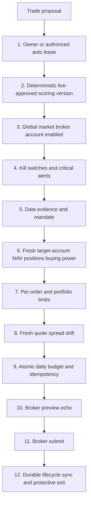

# Kairos — Risk & Safety
> 2026-08-28 (same day): **CORRECTION to the India sizing diagnosis — survivorship materially weakens it.** I published the quartile gradient from CLOSED lots only while listing survivorship as an untested confounder, then tested it. Including the 14 open India positions marked to current price, **8 of them fall in the LARGEST quartile** and are outperforming the closed lots. Q4 mean return moves from -0.55% to **+0.07%**, and the win-rate gradient shallows from 60->38% to **57->43%**.
>
> **No longer supported:** that the largest positions lose money. **Still supported:** size is uncorrelated with conviction (corr with analyst_score -0.128, with cash-at-entry +0.344, 57x notional spread) — measured at ENTRY, so unaffected by survivorship — and win rate still declines with size. The honest claim is that allocation WASTES the edge rather than reversing it.
>
> The profit-factor pair (percent 1.438 vs currency 0.906) inherits the same bias and should be recomputed on matured outcomes before being leaned on. Method note: the confounder should have been tested before the write-up, not listed inside it as future work.
>
> 2026-08-28: **India sizing damage diagnosed — cause is cash-path dependence, not volatility.** Full evidence: `docs/audits/2026-08-28-sizing-damage-diagnosis.md`.
>
> A3 reported India percent profit factor 1.438 against currency 0.906. By entry-notional quartile the win rate falls monotonically 60 -> 56 -> 54 -> **38%** as size rises; the smallest quartile earns +5,871 and the largest loses -10,113.
>
> **Position size tracks cash available at entry (corr +0.344), not conviction (corr with analyst_score -0.128).** Notional spans 57x on a nominally uniform book. India score DOES rank returns (h10 rank IC +0.105, t 2.24), so allocation that is uncorrelated with the score systematically throws the edge away: good picks get small allocations by accident of timing.
>
> **The volatility budget is a separate, real defect and NOT the cause.** Rule 4 has fired zero times in 1,513 constructor events because `maxPortfolioVolPct = 2.0` is unreachable at `DEFAULT_DAILY_VOL = 0.02` — reproducing estPortfolioVol, the worst case across every configuration (5 names, 100% gross, all same sector) is **1.649%**. Breaching 2.0% needs per-symbol vol >= 3.5% daily. The threshold is set above what the model can produce. Fixing it would not fix the sizing damage.
>
> **No sizing behaviour changed.** This is a diagnosis; changing position_size_pct, maxPortfolioVolPct or the allocation formula is a separate money-path decision. US is a different problem entirely — both its profit factors are below 1 and its rank IC is -0.012 with a negative quintile spread, so sizing is not its binding constraint.
>
> 2026-08-28: **RESOLVED — why capital rotation was disabled on 2026-08-11.** It was never unexplained; the reason was recorded contemporaneously and I had been reading a later, vaguer label.
>
> The disable is migration `20260811033335_disable_unqualified_paper_rotation.sql`, shipped in commit `ba20f4ff`. The filename timestamp is exactly the `rotation_config.updated_at` I had been treating as a mystery. Its own comment:
>
> > "Capital rotation may keep measuring, but paper execution must remain off until benchmark-alpha, friction, turnover, correlation and tax readiness are enforced by the execution path."
>
> `features/capital-rotation/FEATURE_ARCHITECTURE.md`, updated in the same commit, gives the mechanism: migration `20260723120000` had enabled both paper rows, **but the executor only rechecked score spread, persistence, cooldown and count caps — it never enforced the P1 readiness result and never read `rotation_allow_score_only_paper`.** Four paper rotations executed through that hole. The same commit added the missing gate to `executeCapitalRotationPaper`.
>
> **It was a MISSING GATE, not bad P&L.** The four negative rotations were the symptom; the doc says explicitly this "is containment, not a claim that the four-trade result proves rotation lacks edge" — which matches the swap-level analysis on 2026-08-25 that found those rotations neutral-to-positive.
>
> **The "unsafe early P1 behavior" phrase in `lib/shadows/registry.ts` was written 2026-08-24 (`26216cb3`), two weeks after the fact.** It is a retrospective summary, not the contemporaneous record, and searching for it is what made this look unexplained. The precise cause was in the migration filename the whole time.
>
> **Directly relevant to 2026-08-25.** The flag I flipped that day, `rotation_allow_score_only_paper`, IS the gate this commit added to stop score-only execution. My argument was that `score_to_return_mapping_unvalidated` "can only be validated by running it" — the same reasoning that produced the original incident. The flip was reverted for a different reason (a false claim that rotation had never executed); this is the reason it should have been refused on the merits.
>
> **The five `p1_blockers` are the reopening criteria**, not incidental noise: `turnover_budget_not_configured`, `exact_tax_lots_unavailable`, `score_to_return_mapping_unvalidated`, `post_swap_gate_unavailable`, `candidate_correlation_unavailable`. They map one-to-one onto the migration's "benchmark-alpha, friction, turnover, correlation and tax readiness". Rotation is re-enableable when those are enforced in the execution path — not before.
>
> 2026-08-27: **India alpha provenance loosened to admit `upstox(yahoo_disagreed)` (owner decision).**
>
> `CONFIRMED_BENCHMARK_SOURCES.india` was `["upstox+yahoo"]` — genuine two-vendor agreement only. That rule was written when neither source was trusted over the other. Upstox is now declared authoritative (broker API carrying official exchange data; on a disagreement ITS value is the one stored), so the rule was suppressing alpha on a CORRECT exchange close because the SECONDARY source was wrong. On the 08-19..27 backfill Yahoo disagreed on six of seven sessions by up to 0.67% — and Yahoo was in error every time.
>
> Now `["upstox+yahoo", "upstox(yahoo_disagreed)"]`.
>
> **`upstox(unconfirmed)` deliberately stays OUT**, and the distinction is not pedantry: there the second source never resolved the session at all, so nothing corroborates that Upstox returned the right BAR for the right DAY. "The two disagreed and we kept the authoritative one" is a different and stronger claim than "only one source answered". Both directions are mutation-pinned — reverting the loosening fails, and over-loosening to admit `upstox(unconfirmed)` also fails.
>
> Backfilled `bench_return_pct` across 38 India rows that now qualify. First measurable since-inception alpha for both books, on settled exchange data:
>
> | market | sessions | NAV | benchmark | alpha |
> |---|---|---|---|---|
> | india | 39 | -0.79% | -1.39% (NIFTY 50) | **+0.60pp** |
> | us | 38 | +1.85% | +2.60% (VOO) | **-0.74pp** |
>
> India has been BEATING its benchmark since inception and this was invisible until now — the alpha was withheld by provenance rules, not absent from the book. Both figures start 2026-07-06, the first session with a benchmark on both sides.
>
> 2026-08-27: **The 8 NULL benchmark rows: 7 filled, 1 correctly refused.**
>
> I had left these alone on the grounds that filling India from a single source would manufacture provenance. Checking rather than assuming resolved it: **Upstox and Yahoo agree to the paisa on all four India sessions**, so `upstox+yahoo` is earned two-source provenance, not a label applied to one opinion.
>
> | market | date | value | source |
> |---|---|---|---|
> | india | 07-06 | 24430.35 | `upstox+yahoo` (exact agreement) |
> | india | 07-07 | 24398.70 | `upstox+yahoo` (exact agreement) |
> | india | 07-08 | 23882.05 | `upstox+yahoo` (exact agreement) |
> | india | 08-17 | 24287.65 | `upstox+yahoo` (exact agreement) |
> | us | 07-06 | 690.62 | `yahoo(settled)` |
> | us | 07-07 | 687.08 | `yahoo(settled)` |
> | us | 07-09 | 690.69 | `yahoo(settled)` |
>
> **US 2026-06-28 stays NULL. It is a SUNDAY** — the paper book's inception row. No session, no bar, and filling it would invent a price for a closed market. Yahoo returns nothing for that date, which is the correct answer rather than a gap to paper over.
>
> India now has ZERO null benchmark rows; US has one, and it is the Sunday. Consequence worth noting: `benchmarkReturnPct` baselines off the FIRST non-null `bench_nav`, which is now 2026-07-06 for both markets — India's benchmark series is exactly aligned with its NAV series, and the US benchmark starts one session after its Sunday inception row.
>
> **Open design question, deliberately not changed here.** The seven India `upstox(yahoo_disagreed)` rows carry the AUTHORITATIVE exchange close, but `CONFIRMED_BENCHMARK_SOURCES.india` admits only `upstox+yahoo`, so they cannot publish alpha. That rule was written when neither source was trusted over the other; now that Upstox is declared authoritative, withholding alpha because YAHOO was wrong may be stricter than intended. Changing it is an owner decision, not a cleanup.
>
> 2026-08-27: **PaperTrader write path audited after the benchmark work. One latent W4 regression closed.**
>
> Checked because `confirmBenchmarkSessions` was wired into PositionMonitor only, and PaperTrader is the OTHER `paper_performance` writer. Findings:
>
> - **The two-writer split is sound.** PaperTrader inserts `snapshot_type='intraday'` and ONLY when no row exists for `(date, market)`; PositionMonitor upserts on `(date, market)` and promotes the row to `eod`, but only once `expectedNewestSession(market) === today`. That is why production holds zero surviving `intraday` rows -- not because the path is dead.
> - **LATENT REGRESSION, now fixed.** PaperTrader's insert ladder strips `bench_session_date`, `bench_source` and `snapshot_type` *together* on any undefined-column error. But `paper_performance.snapshot_type` is `NOT NULL DEFAULT 'eod'`. So if the missing column was one of the bench ones while `snapshot_type` existed, the stripped insert would stamp a PREMARKET row as the canonical close -- exactly the W4 defect the one-EOD-writer rule exists to prevent, reintroduced through the fallback. Dormant while all three columns exist. PaperTrader now corrects the label after any legacy-ladder insert.
> - **Confirmation pass no longer filters `snapshot_type='eod'`.** A past session's benchmark is settled regardless of how the NAV row was labelled, and the filter would have permanently stranded any row left `intraday` because PositionMonitor did not run that day.
>
> Not changed: 8 old rows (US 06-28, 07-06/07/09; India 07-06/07/08, 08-17) carry NULL `bench_nav`. They predate the provenance work and India's policy deliberately requires a stored Yahoo value before claiming `upstox+yahoo` — filling them from a single source would manufacture provenance rather than recover it.
>
> 2026-08-27: **US benchmark — the CONFIRMED rows were the wrong ones.** Same deferred-confirmation fix as India, plus a provenance correction.
>
> Measured against settled VOO closes:
>
> | date | stored | source | settled | verdict |
> |---|---|---|---|---|
> | 08-19 | NULL | - | 706.91 | never resolved |
> | 08-20 | NULL | - | 701.01 | never resolved |
> | 08-21 | 703.71 | `yahoo_quote(provisional)` | 703.71 | **exact** |
> | 08-24 | 701.83 | `yahoo_quote(provisional)` | 701.83 | **exact** |
> | 08-25 | 702.74 | **`yahoo`** | 704.02 | **0.18% WRONG** |
> | 08-26 | 704.20 | `yahoo_quote(provisional)` | 704.20 | **exact** |
>
> The rows humbly labelled provisional were exact; the rows labelled plain `yahoo` — which `CONFIRMED_BENCHMARK_SOURCES` listed as confirmed, authorising an alpha claim — were the inaccurate ones. A Yahoo DAILY BAR read at 16:15 ET is an IN-PROGRESS bar for the session that has just closed: it carries the correct date and an unsettled value, so the exact-session rule cannot catch it. The W5 guard validates the DATE; nothing validated that the value had finished settling.
>
> Two changes. Bare `yahoo` is removed from `CONFIRMED_BENCHMARK_SOURCES.us` and replaced by `yahoo(settled)`, which only the confirmation pass writes. `confirmBenchmarkSessions` is now market-aware and runs for BOTH markets in PositionMonitor: it upgrades provisional rows and FILLS rows that never resolved. A fill reports `storedClose: null` and `deltaPct: null` rather than a fabricated 0%, which would read as two sources agreeing when only one ever existed.
>
> Backfilled 08-19..08-26. The two missing sessions now carry alpha of +0.33pp and +1.11pp, previously absent entirely. The US three-session underperformance figure quoted earlier (-1.90pp over 08-21..08-26) is unchanged, because those two endpoints happened to be exact.
>
> All three US guards mutation-verified: treating plain `yahoo` as settled, fabricating a zero delta for an unresolved row, and letting the US fill rule leak into India each fail a test.
>
> 2026-08-27: **India benchmark cross-check was never failing — it was structurally impossible.**
>
> `paper_performance` recorded `yahoo(unconfirmed)` for India every session from 2026-08-19. Root cause: Upstox's `/v3/historical-candle` **never returns the current session**. Verified against every cached payload from 08-19 to 08-27 — the newest bar is always the PREVIOUS trading day. So `selectBenchmarkObservation` was asked for today's session, correctly found no Upstox bar, and fell back to Yahoo alone. The fetch succeeded every day; it simply never contained the bar being requested. The two `upstox` rows (08-14, 08-18) exist only because they were backfilled a day later.
>
> Not a token, key-mapping, budget or outage problem — all four were checked and healthy (live API returns HTTP 200; `^NSEI` maps correctly; 83 candles cached daily).
>
> Fix is deferred confirmation, the pattern the code comment at the benchmark write already anticipated ("preserve the observed level for the next-day settle pass") but which was never built. `confirmIndiaBenchmarkSessions` runs in the India PositionMonitor and upgrades earlier provisional rows once Upstox publishes their settled bars. Upstox is authoritative, so the settled exchange close REPLACES the provisional Yahoo value and `bench_return_pct`/`alpha_pct` are cleared rather than left stale. Rows already carrying exchange provenance are never revisited.
>
> **The disagreement is large and was invisible.** Backfilling 08-19..08-27 changed six of seven sessions to `upstox(yahoo_disagreed)`, with gaps up to **0.67%** in a single day. Corrected daily alpha:
>
> | date | old bench chg | new bench chg | alpha (pp) |
> |---|---|---|---|
> | 08-25 | -0.46% | **+0.48%** | -0.49 |
> | 08-26 | +0.77% | **-0.52%** | **+0.21** |
> | 08-27 | — | -0.48% | **+0.26** |
>
> India was reported as underperforming on 08-26; against the settled NIFTY close it OUTPERFORMED. Any India alpha figure quoted from a `yahoo(unconfirmed)` row is unreliable.
>
> An earlier draft of the eligibility rule also required the source string to contain "unconfirmed". Mutation testing showed removing that guard changed nothing (every non-Yahoo source is already excluded), and inspection showed it was wrong: it would have permanently stranded a `yahoo_quote(provisional)` row. Rule is now "the stored value came from Yahoo", which is the only case where Upstox is a genuine second source.
>
> 2026-08-25: **Capital rotation paper execution was enabled and then REVERTED the same hour. Flags are false. Do not re-enable without reading this.**
>
> The enable was argued for on the claim that rotation "has never moved capital". **That claim was false.** Rotation executed two swaps and four sell lots:
>
> | date | market | sold | score | bought | score | edge |
> |---|---|---|---|---|---|---|
> | 2026-07-24 | us | PLTR | 56 | CB | 74 | 18 |
> | 2026-07-27 | india | ONGC.NS | 53 | TCS.NS | 100 | 47 |
>
> Sell legs realized -0.10% (PLTR) and -2.50 / -4.13 / -3.05% (ONGC.NS x3).
>
> **How the claim went wrong:** `rotation_events.trade_proposal_id` and `.paper_trade_ids` are NULL on every row *including the executed ones*, and that was read as proof of non-execution while `status='paper_executed'` sat in the same rows. `paper_trades.exit_reason='capital_rotation'` was never cross-checked. **Never infer "did not happen" from an unpopulated foreign key — confirm against the table that records the effect.**
>
> **Do not over-correct either.** "All four rotations lost money" is also wrong framing: rotation sells the weakest holding by design, so losing sell legs are expected. Evaluated as swaps, both were fine — CB returned +0.12% over its hold against PLTR's -0.10%, and TCS.NS returned +6.12% against ONGC.NS's ~-3.2%. The July record is not itself a case against rotation.
>
> **Nor did rotation cost the PLTR run.** PLTR was held 8 calendar days (~6 market days) of a 10-market-day horizon; the unconditional time stop would have closed it around 2026-07-30 anyway. Rotation removed it ~4 sessions early. The mechanism that forfeits moves like that is the time stop — which is what the horizon-extension shadow (jobs 123/124) now measures.
>
> **The open question that blocks re-enabling:** the paper flags were set false at 2026-08-11 03:33:35 and the registry gates execution "after unsafe early P1 behavior". That behaviour has NOT been identified, and the swap P&L above does not obviously explain it. Establish the cause first.
>
> Current state: `rotation_paper_execute_enabled=false`, `rotation_allow_score_only_paper=false` on both paper rows; both live rows false; `rotation_live_proposals_enabled=false` everywhere. The two `book_type='live'` rows were never modified at any point. `CAPITAL_ROTATION_PAPER_ENABLED` exists in Vercel Production (created ~2026-07-23) with a value that is redacted on pull and therefore unverified — inert while the DB flags are false. Journal: id 344 (the enable, containing the false premise) superseded by the correcting entry.
>
> 2026-08-25: **CORRECTION — capital rotation does NOT execute, in either book. Two docs claimed it did.**
>
> Verified against `rotation_config` on `dionkikgdmlaotvtbnfr`: all four rows (us/india x paper/live) carry `rotation_shadow_enabled=true`, `rotation_paper_execute_enabled=false`, `rotation_live_proposals_enabled=false`. Across **98 `rotation_events`**, both markets, all time, `trade_proposal_id` and `paper_trade_ids` are NULL on every row; every event carries `no_execution: true`. Rotation has never moved capital.
>
> | Claimed | Actual |
> |---|---|
> | `lib/shadows/registry.ts`: "Paper execution is enabled; live proposals are disabled" | shadow only; paper execution flag is false |
> | `paper-trade/route.ts`: "Capital-rotation P1 PAPER execution is live (owner-approved 2026-07-23)" | the call is a no-op behind the false flag |
>
> Both corrected in place. This is the same hazard class as the 2026-08-24 protective-stop entry above, inverted: there a doc said a gate was shut while it was open; here two docs said a path executes while it cannot.
>
> Surfaced by tracing why a name that passed the research gate on 30 consecutive sessions never entered the book. Since 2026-08-18 the portfolio constructor has admitted **zero** candidates in either market, and US rotation stopped emitting events on 2026-08-11 — because the `portfolio_constructor / rejected` branch `continue`s past the rotation evaluation, so a candidate denied for lack of room never reaches the mechanism that makes room. India takes the name-cap path, which was already repaired, which is why only US went silent. Full trace: `docs/audits/2026-08-25-rotation-unreachable-trace.md`. **The code fix is proposed, not applied — it awaits owner approval.**
>
> 2026-08-24: **Shadow proposals are evidence, never work items.**
>
> `runAutonomousShadow` writes a real `trade_proposals` row per signal so the
> kernel/sizing decision has somewhere to live. Two defects made those rows
> indistinguishable from real proposals. Both fixed before the run is ever
> scheduled (it has never executed: zero `execution_mode='autonomous_shadow'`
> rows, and `/api/agents/autonomous-shadow/cron` is scheduled nowhere).
>
> 1. The insert used `status='pending_review'` and only narrowed to
>    `kernel.shadow_status` ~80 lines later. Every surface that renders an
>    approve control keys off `pending_review`, so that window — permanent if
>    the run threw in between — put a working approve button on synthetic
>    evidence. Now inserts as `manual_review_required`.
> 2. Four consumers read `trade_proposals` without filtering `execution_mode`.
>    The money-path one is `agents/trader`'s 24h "already proposed" dedup set:
>    unfiltered, shadow rows would enter it and **starve the real queue of the
>    exact signals that scored best**. Also `agents/trader` GET (approve
>    queue), `markets/smart-money` (visible queue), and `DashboardShell`
>    (desktop notification).
>
> Excluded by `execution_mode`, not by status — a shadow row legitimately
> carries the same terminal statuses a real proposal does.
> `EXCLUDE_SHADOW_FILTER` (`lib/trading/proposal-status.ts`) keeps an explicit
> `IS NULL` arm: the column is nullable (default `'manual'`) and a bare
> `<> 'autonomous_shadow'` evaluates to NULL — excluding the row — for NULL
> modes, silently hiding legitimate proposals. Mutation-verified.
>
> **Scheduling the cron remains a separate, un-taken step.**
>
> 2026-08-24: **CORRECTION — both protective-stop gates are OPEN in production. The "Part E (not yet done)" note below is inverted.**
>
> Verified against `dionkikgdmlaotvtbnfr` on 2026-08-24:
>
> | Gate | This chapter says | Production |
> |---|---|---|
> | `strategy_config.protective_orders_enabled` | "false-by-default … STAYS FALSE" | **true** |
> | `PROTECTIVE_PLACEMENT_WORKER_AVAILABLE` (`lib/protective/coverage.ts:134`) | "flip … to true" as a pending Part E step | **already true** |
>
> `protective_orders` holds **0 rows**, so no broker stop has been placed. But the placement worker is no longer gated shut. This is the inverse of the usual stale-doc hazard: an agent reading this chapter would conclude placement is impossible when it is enabled, and could ship a change on that false assumption.
>
> **RESOLVED same day — owner confirmed the activation was unintentional and directed both gates closed.** `strategy_config.protective_orders_enabled` set to `false`; `PROTECTIVE_PLACEMENT_WORKER_AVAILABLE` set back to `false` (its own docstring already said "deliberately false" while the value was `true`). Pre-flip verification showed nothing to orphan: `protective_orders` 0 rows / 0 active, `protective_order_events` 0, `broker_orders` with a `kite_gtt_id` 0. Journaled to `decision_journal` as a risk-reducing `config_change`. Other flags re-verified unchanged and OFF: `live_auto_enabled`, `webull_trade_orders_enabled`, `allocation_enabled`. **Part E is once again closed and reopening it needs explicit owner approval of touch semantics, floor distance, and post-fill policy — not a code edit.**
>
> Also corrected: this chapter and `WORK_LOG.md` both described migration `20260718000000_protective_orders_shadow.sql` as "written as a PROPOSAL and NOT applied to prod". The `protective_orders` table exists, so it HAS been applied. See the reconciliation table at the top of `WORK_LOG.md` for the full set of stale migration blockers cleared on 2026-08-24.
> 2026-08-20: **US benchmark resolves the just-closed session from a guarded QUOTE.** `bench_nav` was NULL for two consecutive US sessions while NAV itself was correct: at 16:15 ET no vendor has published VOO's settled bar (Yahoo's chart endpoint lacks it, Massive grouped publishes next-day, Massive `/range` still ends yesterday). The marks path was fixed to use Yahoo QUOTES; the benchmark path was left on the chart endpoint, so alpha stayed uncomputable.
>
> **This does not break the "a benchmark observation is a DAILY BAR, not a quote" rule — it respects why that rule exists.** The original defect was an UNSESSION-IDENTIFIED quote stamped with the cron run date. The quote was never the problem; the missing session identity was. There is also a consistency argument: NAV is now marked from the same 16:15 print, so a 16:15 benchmark is LIKE-FOR-LIKE, and pairing a 16:15 NAV against a settled close is the greater inconsistency.
>
> **Four guards keep it honest.** (1) It fires ONLY on `benchmark_session_mismatch` — a working provider missing one session — never on `benchmark_bars_unavailable`, because with no series at all we cannot tell the data is sane. (2) It fires ONLY when the requested session IS the one that just closed (`expectedNewestSession("us") === expectedSessionDate`), so a quote can never backfill history. (3) A stale quote is refused rather than dated to today. (4) The source reads `yahoo_quote(provisional)` so the settle pass knows to revisit it. A real daily bar always wins; the quote is last resort.
>
> **Detector:** `tests/benchmark-session-alignment.test.ts` — quote used on a genuine session miss, backfill of an older session refused WITHOUT even calling the quote, stale quote refused, a real bar preferred over the quote, total outage NOT rescued, and a quote-source throw not breaking the path. **Mutation-verified** (dropping the session guard fails). Fixtures use the production shape — a healthy series ending at the previous session — because an empty-series fixture tested a different branch entirely and passed for the wrong reason.
> 2026-08-20: **Settle pass — US marks finally get a second opinion, one day late.**
>
> The US monitor marks at 16:15 ET from Yahoo, the only vendor carrying the just-closed session at that hour, and Yahoo cannot corroborate Yahoo — so those marks ship `uncorroborated`. The grouped feed (12,549 tickers, ONE entitled call) publishes the following morning and IS independent. `kairos-settle-check-us` (`0 13 * * 1-5`, 09:00 ET) compares yesterday's live marks against it.
>
> **It writes no money state.** No NAV, no `paper_positions.current_price`, no trade. A drift beyond `SETTLE_TOLERANCE_PCT` (0.25%) TAINTS that session's `paper_performance` row with the measured per-symbol drift and net NAV impact, and raises a critical — but `nav` is left exactly as recorded. The exits for that session already filled at the marked price; restating NAV afterwards would re-decide a closed session, which the frozen-history rule forbids. Labelling it untrustworthy is honest; silently replacing it is not.
>
> **Tolerance is looser than the intraday cross-check (0.1%) on purpose.** Yahoo's 16:15 print is near-final rather than fully settled. Measured 2026-08-19: exact on NVDA and XAR, 0.07% out on KGC. 0.25% catches a real mismarking — the AV-stale case was 1.00–9.36% — without firing on ordinary settlement revision.
>
> **`nothing_to_compare` neither raises nor resolves.** An unpublished feed is not evidence the marks were right, and "nothing to compare" must never collapse into "everything agreed" — the same failure mode as the W6 liveness checks that could only report green. Marks already labelled `carry_forward` or `entry_cost` are skipped rather than double-reported.
>
> **Detector:** `tests/settle-check.test.ts` — corroboration, the measured KGC revision tolerated, the AV-stale drift flagged with its NAV impact, stale marks not re-flagged, missing closes counted UNVERIFIABLE not agreed, an empty feed not reading as corroborated, and opposite drifts netting to zero while both stay flagged. Route-shaped assertions pin that it never touches `paper_positions`/`paper_trades`/`nav`. **Mutation-verified twice.**
> 2026-08-20: **Yahoo is now the PRIMARY source for US settled marks — the data was never missing at 16:15 ET, the route was asking the wrong vendor.**
>
> The 2026-08-19 entry below concluded that no vendor publishes the current session's close at 16:15 ET, and proposed moving the US monitor later. **That conclusion was wrong.** Checking the settled 2026-08-19 closes against what each vendor returned during that 20:15 run: Yahoo gave NVDA 217.56 and XAR 284.10 — exact — and KGC 29.92 against a settled 29.90 (0.07%). Alpha Vantage gave 219.74 / 294.87 / 27.12: the PREVIOUS session throughout. Yahoo had it; the chain preferred AV.
>
> **Cause.** `getSettledDailyQuotes` tried the grouped feed (which publishes NEXT-DAY, so empty at 16:15) and then fell straight to the ordinary chain — Massive snapshot (403), `price_cache` (stale), Alpha Vantage (previous session). Yahoo was relegated to the unresolved tail, which never ran because AV had already answered. Yahoo now sits between grouped and the ordinary chain. It is keyless and unbudgeted, so preferring it costs no quota, and the schedule is unchanged: exits still run at 16:15, now on correct prices.
>
> **Consequence, stated plainly: US marks lose their second opinion.** Yahoo cannot corroborate Yahoo — that circularity is exactly what let the ^NSEI provisional value pass as "verified". The cross-check filter now excludes any Yahoo-sourced primary, so US marks are labelled `uncorroborated` rather than falsely confirmed. Real US corroboration needs the next-day grouped feed via a settle pass; Massive `/prev` is per-symbol and paced at 12.5s (13 symbols ≈ 162s > the 120s route ceiling). NOT built.
>
> **Also rejected on evidence:** moving the US monitor past 20:00 ET would cross 00:00 UTC, and the route derives `today` from the UTC date — NAV would be written under the following session.
> 2026-08-19: **CORRECTION — the mark cross-check did not protect exits, and four positions closed on stale prices before it was fixed.**
>
> The entry below claims a disputed quote is "REFUSED for marking AND for stop/target evaluation". That was **false as shipped**. The guard lived only in `buildPositionMark`, which runs AFTER the exit loop; the exit loop reads `priceMap` directly. The 20:15 run corrected the marks and exited anyway.
>
> **What it cost.** The US chain fell through to Alpha Vantage — which served the PREVIOUS session's close — while Yahoo carried the current one. Six of ten marks were flagged disputed (KGC 9.36%, XAR 3.79%, OXY 2.86%, TSM 2.38%, BAC 1.43%, NVDA 1.00%), and four positions still closed: LULU at ~119.55 (the 2026-08-14 price; the 08-18 close was 119.01) and MSFT at ~487.65 (a carried 08-17 value; 08-18 close 481.63), plus MA and SMCI. Eight lots, now `tainted` + `excluded_from_learning`; `realized_pnl` left intact to preserve the cash-ledger identity.
>
> **Fix.** The gate now sits on `priceMap` itself, before any exit is evaluated: a disputed symbol is deleted from the map and reported UNPRICED, so no stop, target or time-stop can fill on it, and a critical names every refused symbol. A price too doubtful to record is too doubtful to sell on. Pinned positionally in `tests/paper-nav-writer-contract.test.ts` — the gate must precede both the exit loop and `buildPositionMark` — and mutation-verified.
>
> **Confirmed by the same run (these DID work):** the per-position isolation fix and the MSFT residual-lot reconstruction — the run completed `done`, 14/14 succeeded, `exit_failures=0`, where the previous two runs aborted entirely. India wrote `bench_source=yahoo(unconfirmed)`, exactly the honest label the cross-check contract specifies when only one vendor resolves.
>
> **Still unresolved:** no vendor publishes the current session's settled close at 16:15 ET. Massive `/prev` returned 2026-08-18 closes when queried at 20:16 UTC on 2026-08-19, and grouped publishes next-day. So the US monitor cannot mark the session it just watched close. US `bench_nav` for 2026-08-19 is NULL for the same reason — correctly refused rather than mislabelled. This needs a run-timing decision (move the US monitor later, or add a next-morning settle pass); it is NOT a code bug and is not built.
> 2026-08-19: **Position marks are now corroborated by an independent vendor, and a DISPUTED quote fails closed.**
>
> A mark is not a display number — it prices the stop and target checks. Yahoo demonstrably serves PROVISIONAL values it later retracts (the 2026-08-18 ^NSEI case wrote a 0.375% error into `paper_performance`), and the exact-session rule validates the DATE, never the VALUE. So each live mark is compared against a DIFFERENT vendor: US → Yahoo per-symbol (primary chain is Massive-based), India → Upstox (primary is Yahoo). Both keyless and unbudgeted.
>
> **Contract.** Agreement within `MARK_CROSSCHECK_TOLERANCE_PCT` (0.1% — wider than the index's 5bps because equity feeds differ on adjustment, far below the 0.375% error that motivated this) → `live_quote`, reason names the corroborating vendor. Disagreement → the quote is REFUSED for marking and for stop/target evaluation, the mark falls back to the carried price (or entry cost), and the reason preserves BOTH numbers. No second source → still `live_quote`, but the reason says `uncorroborated` rather than implying it was checked.
>
> **Fail-closed is affordable because agreement is the norm.** Measured 2026-08-18: Massive `/prev` and Yahoo matched to the cent on every US holding — MSFT 481.63/481.63, NVDA 219.74/219.74, XAR 290.43/290.43.
>
> **Detector:** `tests/mark-crosscheck.test.ts` — corroborated accepted; disputed refused with the carried mark kept and both values recorded; rounding tolerated; uncorroborated labelled honestly; a cross-source outage cannot demote a good mark; a disputed quote with no carried mark falls to entry cost and never to the disputed price. **Mutation-verified** (removing the guard fails 2).
>
> **UNRESOLVED — the grouped-daily fix probably does not fire at 16:15 ET.** Measured 2026-08-19 ~00:55 UTC, roughly five hours after the US close: `/v2/aggs/grouped/.../2026-08-18` returned **0 rows**, while `/v2/aggs/ticker/{sym}/prev` and Yahoo both already carried the 2026-08-18 close. Grouped publishes next-day. The US PositionMonitor runs fifteen minutes after the close, so `getSettledDailyQuotes` will most likely get nothing from grouped and fall through — meaning US marks stay `carry_forward` and there is nothing to corroborate. `/prev` has the data but is per-symbol and Massive is paced at 12.5s (13 symbols ≈ 162s > the 120s route ceiling). Candidate fixes: move the US monitor later, or add a next-morning settle pass that re-marks the prior session. NOT built — it needs a decision about run timing.
> 2026-08-19: **India benchmark is now cross-checked against the exchange, because the exact-session rule validates the DATE and never the VALUE.**
>
> **The hole W5 could not see.** Yahoo's ^NSEI series carries bars whose close is NULL — 2026-01-15, 05-01, 05-28, 06-26, 07-21, 07-22, 07-31, 08-18 in the 1y window — and briefly serves a PROVISIONAL number on those sessions before dropping it. On 2026-08-18 that put **24245.699** into `paper_performance` when the settled NIFTY 50 close was **24154.9**: 0.375% wrong, written by a code path behaving exactly as designed. W5's exact-session match proved the bar was dated 2026-08-18; nothing proved the number was the close. India had no second source (Massive is US-equities-only), so Yahoo agreeing with itself was the only available "verification".
>
> **Method note, recorded because it nearly hid the bug.** The India series was first checked by re-fetching from Yahoo and comparing — 24/24 matched, and that proved nothing. Comparing a value against the source that produced it tests self-consistency, not correctness. Only an independent provider could settle it.
>
> **Second source: Upstox.** A broker API carrying official exchange data, already integrated and unbudgeted. Indices are absent from `upstox_instruments` (the master is filtered to `instrument_type=EQ`/`segment=NSE_EQ`), so `fetchUpstoxIndexCandles` uses the static key — exact: `NSE_INDEX|Nifty 50` resolves, `NSE_INDEX|NIFTY 50` returns UDAPI100011.
>
> **Contract.** Upstox is AUTHORITATIVE; Yahoo is the check. Agreement within `BENCHMARK_CROSSCHECK_TOLERANCE_PCT` (5bps — an index close is one published number, so a real gap is a fault, not rounding) → `source=upstox+yahoo`. Disagreement → the exchange value is used and the label says `upstox(yahoo_disagreed)`; the fact is recorded, never hidden. One provider only → `upstox(unconfirmed)` / `yahoo(unconfirmed)` — a single-source benchmark beats none, but it must say so. A cross-check outage cannot break the path.
>
> **Data corrected:** 2026-08-18 India → 24154.9 (`source=upstox`). The three rows Yahoo could not corroborate (07-21, 07-22, 07-31) are CONFIRMED correct by Upstox to the paisa and are now stamped — they were never wrong, Yahoo simply could not prove them.
>
> **Detector:** `tests/benchmark-session-alignment.test.ts` — agreement, the real 2026-08-18 disagreement (exchange value wins, label states it), rounding tolerance, single-provider labelling both ways, both-missing refusal, and a cross-check throw not breaking the path. **Mutation-verified** (neutering it fails 4). One older test asserted `source==="yahoo"` for India; its premise is now obsolete, so it was updated to pin the invariant it actually existed for — India never spends the US fallback call.
>
> **Still one-sided:** the US benchmark has Yahoo→Massive, and India now has Upstox+Yahoo. Neither market cross-checks its per-SYMBOL marks; only the benchmark is corroborated.
> 2026-08-18: **One position's exit failure was blanking the whole book.** The 20:15 US run died on `execute_paper_exit denied (MSFT): position_lot_qty_mismatch`. `closePosition` throws on a denial, the throw escaped the per-position loop, and the run aborted BEFORE the mark/NAV block — so no marks, no NAV, and the other 12 US positions never had their stops or targets checked. The 2026-08-14 run died identically on LNC (`existing_open_position`). Two runs, same shape, two weeks apart.
>
> **The RPC denial is CORRECT and stays.** MSFT's only lot closed on 2026-08-03 (`outcome=win`) while its `paper_positions` row survived, so the parity check refuses to close 0.472499 that no open lot backs. Suppressing that guard would double-count a realized trade. The fix isolates the failure, it does not silence the guard: each position's evaluation is wrapped, a failure is recorded and alerted (`position-monitor-exit-failed:<scope>`, critical, naming the symbols whose stops went unchecked), and counted as a **failed** unit in the W6 envelope — so the run is `error`, not healthy, while still completing its other work.
>
> **Open data defect, NOT auto-repaired:** one orphaned position — MSFT, qty 0.472499, **$230.41 of phantom value carried in NAV since 2026-08-03**. `paper_positions` is current-state that "may be removed/closed only through the transactional exit path", so it is surfaced for owner reconciliation rather than deleted. Every other position reconciles exactly (1 of 27 drifts).
>
> **Detector:** `tests/paper-nav-writer-contract.test.ts` — the loop body is wrapped; NAV/marks are reached AFTER a failure (positional); failures count as `failed`; the alert key appears in BOTH the report and resolve paths; the RPC denial still throws. Mutation-verified twice — and the first version of the alert assertion was decorative (a bare `toContain` passed even with the reportIssue key renamed, because the resolveIssue occurrence satisfied it), so it was strengthened to count occurrences.
> 2026-08-18: **W5 US benchmark was never written — the provider ladder's recency guard is too weak for an EXACT session.**
>
> **W5 itself works.** India recorded `bench_nav` 24245.70 / `bench_session_date` 2026-08-18 / `bench_source` yahoo on the 11:15 UTC run. The migration and both write paths are correct. Only US was null, on every row since the migration.
>
> **The defect.** `fetchUsCandles` accepts the FIRST provider whose newest bar is inside a generic `MAX_BAR_AGE_DAYS = 4` guard. The US PositionMonitor runs 16:15 ET — fifteen minutes after the close — and Yahoo has not published the settled VOO daily bar that soon. Its newest bar was 2026-08-14: three days old, therefore "fresh", so the ladder returned it and **never tried Massive, which DID have 2026-08-17 (close 710.27)**. `selectBenchmarkObservation` then correctly refused to store a non-matching session, so the US book recorded no benchmark at all. India was unaffected because its cron runs 1h15m after the NSE close, by which time Yahoo has published. Proof in `av_cache`: `YAHOO_CANDLES:VOO` at `cache_date` 2026-08-17 has `newest_bar` 2026-08-14, while `YAHOO_CANDLES:^NSEI` at the same cache_date has 2026-08-17.
>
> **A generic age guard cannot answer an exact-session question.** "Newest bar is under 4 days old" and "there is a bar for session X" are different predicates, and only the second is what a benchmark observation needs. The fix stays inside `benchmark-observation.ts`: on `benchmark_session_mismatch` — and ONLY that reason — ask the next provider directly. A `benchmark_bars_stale` result means the provider is stranded and is not retried. `fetchUsCandles` is untouched, because its other caller (label maturation) legitimately wants a long series rather than one date.
>
> **Rejection reasons stay honest.** When neither provider supplies the session, the ORIGINAL rejection is reported — it names the provider the ladder actually chose, not the fallback.
>
> **Detector:** `tests/benchmark-session-alignment.test.ts` — the fallback resolves the session; no second call is spent when the primary already has it; a stranded provider is NOT retried; both-miss still refuses; India spends no fallback call. **Mutation-verified** (neutering the fallback fails). Dates are RELATIVE, per the note at the top of that file: the stale guard is wall-clock, so pinned literals would drift into the `stale` branch and start asserting the wrong thing.

> 2026-08-18: **A market-scoped PositionMonitor run was writing the OTHER market's book.**
>
> Both crons are correctly scoped (`?market=us`, `?market=india`), yet the India run at 11:15 UTC wrote 13 US marks and a US `paper_performance` row stamped `snapshot_type='eod'` at **07:15 ET — before the US session opened**. The W4 "ONE canonical EOD writer per market" invariant was broken from a direction W4 did not anticipate: not a second writer racing the same market, but the *other market's schedule* reaching across.
>
> **Scoping was defeated inside the route, not at the schedule.** Two reads ignored `marketScope`: the `stillOpen` re-read of `paper_positions` (unfiltered `select`), and `poolByMarket`, built from **every** `paper_portfolio` row. The mark/NAV write loop iterates `poolByMarket`, so it processed both books regardless of scope. Fixed by scoping the re-read and skipping non-scoped markets in the loop before any write.
>
> **`snapshot_type` is no longer an unconditional literal.** Even a legitimate unscoped or manual run must not stamp `eod` on a row built from carry-forward marks hours before the close — the same lie in a different costume. It is now `expectedNewestSession(market) === today ? "eod" : "intraday"`, reusing the post-close predicate added with the grouped-daily work.
>
> **Detector:** `tests/paper-nav-writer-contract.test.ts` — the guard must sit inside the pool loop *before* the `paper_performance` upsert (positional assertion, not mere presence); the re-read must acquire its market filter before it is awaited; the bare `snapshot_type: "eod"` literal is banned. **Mutation-verified** — removing the loop guard fails the suite. The pre-existing "PositionMonitor is the EOD writer" pin was updated rather than deleted: its intent (PositionMonitor, never PaperTrader, owns the `eod` row) is preserved and now also asserts the post-close condition.

> 2026-08-18: **The US quote path had no working live source — the Massive key is not entitled to `/v2/snapshot`.**
>
> **What was broken.** `fetchMassiveBatchQuotes`, described in code as "the primary batch path", was returning **zero US quotes on every call**: the deployed `MASSIVE_API_KEY` gets `403 NOT_AUTHORIZED` on every `/v2/snapshot` endpoint and on `/v2/last/trade`. `if (!res.ok) continue;` swallowed it. The `/markets/etfs` second pass was also dead — that endpoint returns **404** and had never resolved a single ETF. With Massive silent, AV's 25/day budget exhausted since 2026-07-23, and `price_cache` holding only symbols the *research* path scores (never the holdings), the chain collapsed to a stale cached bar — which the pre-2026-08-17 adapter then relabelled fresh.
>
> **Cost, measured not estimated.** On 2026-08-17 all 13 US holdings were marked at the **2026-08-14** close. Marked position value 7,725.11 vs true 7,667.32 against that session's real closes: NAV overstated **$57.79**. The reported **+0.239%** was in truth **−0.339%** — *the sign flips, the entire gain was mismarking*. Per-name drift reached **−3.92%** (SMCI), **−3.89%** (INFY), **−3.04%** (MSFT); against a 7% stop that is over half the stop distance, so stop and target evaluation were affected, not merely NAV display.
>
> **The fix.** The key IS entitled to `/v2/aggs/grouped/locale/us/market/stocks/{date}` — **12,549 tickers, settled OHLCV, one call** — verified against the live API. New `fetchMassiveGroupedDaily` + `getSettledDailyQuotes` (`lib/data/quotes.ts`); PositionMonitor's US path now uses it. It includes ETFs (XAR, VOO), so the dead `/etfs` pass is deleted rather than repaired, and it carries OHLC so the `dayLow` intraday-stop check survives the move.
>
> **Deliberately NOT a blanket swap.** Grouped daily is settled/EOD and marked DELAYED. That is correct for a post-close consumer (PositionMonitor runs 16:15 ET) and WRONG for intraday callers — `live-portfolio` and `lib/market-data.ts` keep the existing chain. Hence a separate function, not a replacement inside `getBatchQuotes`.
>
> **An entitlement failure is now loud.** A non-OK snapshot response logs the status and says whether the key is unentitled; a grouped 200-with-zero-rows is reported as "session not published", never as "these symbols have no price".
>
> **Detector:** `tests/massive-grouped-daily.test.ts` — a 403 must yield no quotes AND log; zero rows must not read as no-price; non-positive closes are refused rather than marking a position at zero; ETFs resolve. `tests/agent-source-pipeline-remediation.test.ts` re-pinned to the settled path.
>
> **History annotated, not rewritten.** `paper_performance` 2026-08-17 US is `tainted=true` with the full quantified reason and the corrected reading. **`nav` is left as recorded** — the frozen-history rule in the Scoring Data-Truth Review Protocol forbids re-deciding the past. Earlier US rows (2026-08-10..14) were already tainted by the prior remediation.
>
> **Open, unresolved:** an unscoped PositionMonitor run wrote a US row tagged `snapshot_type='eod'` at 11:15 UTC (07:15 ET, pre-open) on 2026-08-18, which breaks the W4 "one canonical EOD writer per market" invariant from the other market's schedule. Not fixed here.

> 2026-08-17: **Codex composite/data-truth audit remediation — a stale bar could drive live exit decisions.**
>
> **P0-1 (money path).** At 16:15 ET Monday 2026-08-17 all 13 US positions were marked, **stop-checked and target-checked** against Friday's close. `priceMap` in `position-monitor` feeds `priceForStopCheck`, the `currentPrice >= priceTarget` partial/target branch, the time-stop fill price AND the W4 mark ledger — one stale number reached every exit decision, not merely NAV display. The monitor's own `!q.stale` guard was correct; the **adapter lied**. Two defects in `lib/data/quotes.ts`: (a) `isStale()` asked "under 4 CALENDAR days old" — Friday's bar is 3.01d on Monday afternoon, so it passed; (b) `parseTickers` stamped `stale:false` unconditionally even when the price fell through to Massive's `prevDay.c`, i.e. last session's close wearing this run's timestamp. Both fixed at the adapter, so every caller inherits the correction.
>
> **W9's rule was NOT sufficient and reusing it was wrong.** `isFreshSessionDate` delegates to `lastCompletedMarketSession`, which always steps back at least one calendar day and therefore *still* names Friday at 16:15 ET Monday. That leniency is correct for its EOD-cache callers mid-session (today's bar may legitimately not exist yet) and wrong after the close. New `expectedNewestSession(market, now)` in `lib/data/completed-candles.ts` — which already owned the session-close constants — returns TODAY after a trading day's close, else the previous completed session. Callers compare with `>=` so a provisional running-session bar still passes; only the post-close case tightens.
>
> **Detector:** `tests/quote-session-freshness.test.ts` pins the exact production case (Friday bar refused Monday 16:15 ET; accepted Sat/Sun when it genuinely IS the last completed session). **Mutation-verified** — restoring `lastCompletedMarketSession` fails 2 of 4.
>
> **P0-2.** `v_decision_quality` recomputed confidence from a hardcoded per-market applicability list and reported India 0.7333 while the scorer had frozen `evidence_confidence = 1.0`. Both numbers described the same decision, and the paper-fill RPC, `/api/kite/order`, `execute-order` and Decision Review all read the view. Migration `20260817200000` makes the **observation the source of truth** (it is the contract the decision was actually made under and cannot drift when a market policy is later edited); the recomputed figure survives as diagnostic-only `structural_coverage`, and `confidence_source` records which rule produced each row. Verified behaviour-preserving BEFORE writing: across 4,628 joined rows **0 cross the 0.5 gate in either direction**; 837 change value, none change an outcome. 210 legacy rows with NULL stored confidence fall back to the derived value — without that fallback a usable number becomes NULL → `unknown` → live BUY fails closed, silently TIGHTENING a gate.
>
> **P1-3.** The deterministic breakdown veto capped technical score at 20 but the composite renormalised around it, so a strong fundamental could still clear threshold on a confirmed high-volume breakdown. Production carried 7 rows `vetoed=true` AND `entry_eligible=true` (CPCAP.NS, SIMO, APP, EXEL, MUTHOOTFIN.NS). **None reached a fill** — unrelated downstream caps caught them, which is luck, not a gate. `entryEligible` now includes `!breakdownVetoed`. **New long entries only**; PositionMonitor exits never read the flag, so a breakdown can never block getting OUT.
>
> **P1-5 (measurement only).** US macro took full 15% weight on 3-of-8 FRED indicators with `evidence_confidence=1.0`. `coverage`/`coverage_pct`/`indicators_expected` are now persisted so a partial read cannot present as complete. The weight and the `MIN_MACRO_INDICATORS=3` floor are **unchanged** — discounting or raising the floor is a live scoring change and needs a frozen shadow counterfactual first.
>
> **P1-4 deliberately NOT fixed.** Admitting weak technicals (BANKBARODA.NS composite 65 / technical 24) may be real, but the sample is small and hard-coding a technical cutoff now would be tuning on noise. Needs the same date-clustered frozen counterfactual discipline as the exit-policy work.
>
> **P2-6.** `query_learner_config` returned `strategy_config.score_threshold` (52) while the money path uses per-market `trading_mandates` (60/7%/8%) — the learner could describe and optimise a policy the system does not run. It now returns `activeMandates`; the legacy field is relabelled `legacy_score_threshold_NOT_USED`.

> 2026-08-17: **Price target retargeted — +8% (was +20%).** The +20% swing-mandate target was structurally dead: 0/135 firings, max MFE ever 18.44% (India h10), target above p90 MFE for both markets across 1,885 matured labels. Fix is justified on reachability grounds (a target that never fires is not a target), NOT on return-improvement evidence (ATR counterfactual max t=1.35 — insufficient per predeclared `nEffective≥12` floor). New value **8%** sits at approximately p75 MFE for both markets, between average (~6%) and p90 (~12%). Three touch points updated atomically: `HORIZON_PRESETS.swing.target_pct` (`lib/trading-mandate.ts`), `resolveExecutionRiskReward` fallback (`lib/trading/trade-plan.ts`), and both `trading_mandates` DB rows + `strategy_config` display row. W2-full partial exits (restored 2026-08-17) now have a reachable trigger. Evidence frozen read-only in `docs/audits/2026-08-17-exit-policy-counterfactual.md`.

> 2026-08-16: **W9 — the remaining `price_cache` consumers now derive freshness from the BAR'S MARKET DATE.** W1 (`lib/data/quote-freshness.ts` → `assertFreshQuote`) closed the fill and live-order boundaries. W9 closes the consumers that read `price_cache` rows directly and so never went through `getQuote` at all. One new module, `lib/data/price-cache-freshness.ts`, holds the rule for a cached BAR and **delegates the verdict to `assertFreshQuote`** — there is no second rejection taxonomy. A bar is fresh iff its date is at least `lastCompletedMarketSession(market)`; `cached_at` is never consulted, because a row re-read today is not fresh data.
>
> - **`lib/portfolio/inputs.ts` (PaperTrader position SIZING).** `estimateDailyVolPct` read 21 `price_cache` closes with no coverage or staleness check. For the 101/140 symbols frozen at 2026-07-22 that was not merely stale but **permanently fixed** — the same Jun–Jul dispersion priced into every future trade forever. It now requires coverage (≥15 usable closes) AND freshness, and falls back to `DEFAULT_DAILY_VOL` **explicitly and observably** (`basis:"default"` + a reason + the fossil `asOf`, logged) via the new `estimateDailyVolPctDetailed`. A zero-dispersion window is also refused — 0 vol reads as infinite position size. `estimateDailyVolPct`'s bare-number signature is unchanged; `paper-trade/route.ts` was not touched. The India branch fetches Yahoo live per call and was never affected.
> - **`rescore-check`** publishes LEARNER FEEDBACK, so a wrong price here corrupts the evaluation layer scoring is calibrated against. It treated the newest cached row as "current" with no as-of check, and when no bar existed at or before the signal date it fell back to the **oldest** row in the window — measuring a window that is not the one being judged. Both now skip with a counted reason; the response carries `skipped`, `stale_symbols`, and a `degraded` flag, and `evaluated` now means "actually measurable" rather than "had any row at all".
> - **`lib/data/benchmark-series.ts`** (beta / RS) had no recency check. SPY kept filling so it kept working, but a frozen SPY would have produced a beta that looks measured and is a fossil. It now returns `{bars, asOf, stale, reason}` via `getBenchmarkSeriesStatus`; `getBenchmarkSeries` resolves to `[]` when stale or under-covered, which downstream already reads as "beta unmeasurable" — so the gate lives at the source and no caller needed changing.
> - **`supabase/functions/_shared/quotes.ts` DELETED.** It carried a divergent, weaker rule: staleness off `cached_at` (when a row was written) and `stale:false` for **all** off-hours cache. It had no importer; leaving a second rule available for reuse was the hazard.
> - **Display/LLM surfaces labelled**: `/api/markets/quote` emits `asOf`/`stale`/`staleNote`; `deep-dive` carries `asOf`/`stale` into the LLM bundle with an explicit "do not treat as today's price" instruction; the briefing prompt appends a STALE MARKS warning naming each fossil-marked position, since it reports P&L "now".
>
> **Detectors** (`tests/price-cache-freshness.test.ts`, 17 tests): a dense-but-frozen 21-close window must NOT yield a confident vol; a frozen benchmark must report stale and yield `[]`; the deleted Deno file must stay deleted; today's provisional bar must NOT be false-rejected as future-dated. Mutation-verified — neutering the rule fails 6 of them. No migration, no schema change, no production writes.


> 2026-08-16: **W4/W5 — the NAV invariant now has teeth, and benchmark levels carry their session.** Part of the evaluation-pipeline-integrity remediation; the governing principle is that every fix ships with a check that FAILS when the fix regresses.
>
> **W4 — the invariant was a no-op.** `position-monitor/route.ts` computed `newNav` and `invariantExpected` from the SAME reduce over the SAME array and compared them: `invariantDiff` was structurally zero and the violation branch unreachable. It was one of five checks in this incident that could only ever report green. It is replaced by `reconcilePersistedNav` (`lib/paper/marks.ts`), which re-reads `paper_portfolio.nav`, `paper_portfolio.cash_balance` and `paper_performance.nav` **out of the database after the write** and compares them against a NAV computed locally from cash plus the mark set, plus the cash-ledger identity and a mark-coverage contract. Both sides are independently sourced, so a dropped write, a rejected column, a partial upsert or a mark missing from NAV now produces a failing check. **A failed reconciliation marks the run `error`, not `done`,** and raises a critical `paper-nav-reconcile:<market>` System Health issue.
>
> **W4 — marks now carry provenance.** Positions were only re-priced when a fresh quote existed, so NAV silently blended marks of different ages. Every open qty now resolves exactly one mark tagged `live_quote` / `carry_forward` / `entry_cost` with its source and the provider's own observation time; mixed-age NAV raises a `paper-nav-stale-marks:<market>` warning naming the symbols and the stale share of position value; and every mark is written to the append-only `paper_position_marks` ledger. **The 2026-08-12 +2.70%/−2.97% NAV round trip stays permanently unattributable** — the ledger prevents a repeat, it cannot recover the past.
>
> **W4 — one canonical EOD writer per market.** `PaperTrader` ran a second same-day mark and upsert on the same `(date, market)` key `PositionMonitor` writes after the close, so an intraday snapshot could overwrite the EOD row. PaperTrader may now only CREATE today's row when none exists (tagged `snapshot_type='intraday'`); a `23505` conflict is treated as the EOD writer winning, never as a reason to clobber.
>
> **W5 — benchmark session mislabelling.** Both writers accepted any positive benchmark *quote*, ignoring `stale`/source/session, and stamped it with the cron run date: `bench_nav` 708.42 is VOO's **2026-08-11** close, stored under both 2026-08-12 and 2026-08-13. Benchmark levels now come from session-dated daily bars (`lib/paper/benchmark-observation.ts`, reusing the existing `newestBarIsStale` recency guard); the bar's own date and provider are persisted; and a level is written **only** when the bar's session equals the row's date — a gap is honest, a mislabelled number is not. `benchmark-scorecard` marks a proven mismatch `source_status='session_mismatch'` (so `loadBenchmarkLevels`, which reads only `'ok'`, excludes it) and clamps displayed coverage to 100% (US 1M reported 104.5%).
>
> **Detectors:** `tests/paper-mark-provenance.test.ts` (the reconciliation MUST fail on a disagreeing persisted NAV — the old self-comparison could not), `tests/benchmark-session-alignment.test.ts` (the previous session's close MUST be refused under today's date), `tests/paper-nav-writer-contract.test.ts` (route-shaped: no `invariantExpected`, no second EOD upsert, no benchmark-from-quote, coverage clamped).
>
> **Migration `20260816180000_paper_mark_and_benchmark_provenance.sql` APPLIED 2026-08-17.** `paper_position_marks` table live; `bench_session_date`, `bench_source`, `snapshot_type` columns on `paper_performance` live. US relative-performance figures now have session provenance.
>
> 2026-08-13: **Hybrid protective-stop PLACEMENT WORKER — Parts A–D shipped; Part E (activation) is owner-gated.** The shadow scaffold from 2026-07-18 now has a full broker-placement path, still behind the same two false-by-default gates:
>
> **Part A — paper OHLC stop check**: `lib/data/quotes.ts` now parses `day.l`/`day.h` from Massive snapshots into `DeterministicQuote.dayLow/dayHigh`. The position-monitor (`app/api/agents/position-monitor/route.ts`) builds a `dayLowMap` and uses `priceForStopCheck = min(currentPrice, sessionLow)` — a stop touched intraday is real even if price recovers by close. Exit reason is `stop_hit_intraday` (fill at `trailingStop`).
>
> **Part B — RH capability file** (`lib/protective/robinhood-capabilities.ts`): declares `stop_market` with `timeInForce:["gtc"]`, `sessions:["regular"]`, `updateMode:"cancel_replace"`, no lifetime cap. Comments explain: RH GTC stop-market ONLY triggers in the regular session (9:30–16:00 ET); does NOT fire pre-market or after-hours; converts to market order on trigger (no limit floor, but you ARE out).
>
> **Part C — broker placement functions**: `placeRobinhoodGtcStop()` added to `lib/robinhood-mcp.ts` — same MCP session pattern as `submitRobinhoodOrder`, `timeInForce:gtc`, `type:stop`, returns `{ok,brokerOrderId}` with `needsReconcile` on ambiguous outcomes. `placeKiteStopGtt()` added to `lib/kite.ts` — single-leg GTT (`type:"single"`) SELL CNC LIMIT at stopPrice (weaker: can fail to fill on a gap). `lib/protective/kite-placement.ts` is a thin wrapper.
>
> **Part D — entry/exit wiring**: `lib/protective/placement-worker.ts` is the placement + cancel worker. It reads both gates, derives `stopPrice = entryPrice × (1 − stop_loss_pct%)` from the mandate, evaluates broker eligibility via `evaluateProtection()`, inserts a `protective_orders` row at `status='placing'`, places at broker, moves to `status='active'` (or `'failed'`). `execute-order.ts` fires `placeProtectiveStop()` fire-and-forget after every confirmed live BUY ACK. `live-exit-monitor.ts` calls `cancelProtectiveStop()` before submitting a SELL proposal — cancels the resting broker stop to prevent double-sell after the GTC stop independently triggers.
>
> **Part E (not yet done)**: flip `PROTECTIVE_PLACEMENT_WORKER_AVAILABLE = true` in `lib/protective/coverage.ts` and set `protective_orders_enabled = true` in `strategy_config`. Both gates must be opened by owner before any broker stop is placed.
>
> 2026-08-13: **Intraday gap protection**: both the position-monitor paper check (Part A above) and the PositionMonitor now catch stops touched at any point during the session (via `day.l` from Massive snapshot), not only at the most recent quote. The overnight gap risk for paper trades is narrowed to the gap between last Massive snapshot and session open — true overnight gap is still not covered by paper (and not expected to be; paper has no broker-level orders).

> 2026-08-07: **Property/Investing isolation is an invariant, stated here so it is testable.** No property table, adapter, scenario, forecast or decision-journal row is read by any securities score, eligibility gate, position sizing rule, order path, exit, promotion gate or broker call. The dependency runs one way only: Property consumes the shared auth, ownership, System Health and source-provenance conventions, and exports nothing into the investing money path.
>
> Property forecasts are **shadow decision support**. They are written `state = 'shadow'`, are never a promise, and are scored only against values observed after the horizon elapsed. The Forecasts workspace **withholds a calibration rate below 10 matured outcomes** per market-and-metric cohort (`lib/property/calibration.ts`) and shows `n` regardless — at n=3 an interval-coverage percentage can only read 0, 33, 67 or 100 and would be arithmetic noise presented as evidence.
>
> Property parcel Stage 1 is evidence-only and **collection is disabled** until each county source's machine-use contract is verified. Historical Phoenix deed observations and Austin county `appraised`/`assessed` references remain preserved as evidence; the latter are tax references, never public comparable sales or Kairos market-price estimates. The worker exits before credentials, scopes, or downloads, while the UI/API reject new scope activation. Bulk evidence persists no addresses or party names and uses keyed HMAC parcel identities. The UI hard-disables every AVM/market-price/value-range claim. Repeat-sales or hedonic work remains blocked until permitted collection, multiple snapshots, correction handling, temporal validation, market-local sample floors, and measured calibration exist.
>
> Market-local honesty is enforced rather than assumed: the three active sources are US-only, so adapters declare `supportsMarket()` and the collector records `not_applicable` for Bengaluru instead of `success, 0 rows`. **No US value is ever substituted into an India market card.** Private data handling: no plaintext address, mortgage account number, owner name or uploaded document is stored; payloads are encrypted server-side and owner routes never trust a caller-supplied `owner_id`.

> 2026-08-01 documentation truth audit: the technical breakdown guard is a hard
> cap only for an ATR-scaled fall or a 7% high-volume fall. A bottom-quartile weak
> close is warning-only. This chapter now matches the exact scoring contract in
> chapter 03 and `lib/data/technicals.ts`.
>
> 2026-07-31 scoring input safety: unknown provider taxonomy cannot receive a
> fabricated P/E benchmark; implausible P/E is omitted; missing availability metadata
> cannot include a dimension; malformed macro/insider payloads remain unavailable;
> and ordinary weak closes cannot hard-veto without ATR or volume/move confirmation.
> Only the Next.js ResearchAgent writes authoritative scores. See
> `features/scoring-data-truth/FEATURE_ARCHITECTURE.md`.

> Last updated: 2026-07-25 (**ETF allocation cap** — new `strategy_config.etf_allocation_cap_pct NUMERIC DEFAULT 30` (migration `20260725130000`). Soft guardrail: `executeApprovedOrder` checks BUY orders for US ETF symbols (`isEtfSymbol`) and refuses if current ETF portfolio % + this order's notional / NAV would exceed the cap. Fail-open: any DB read error warns and allows through (unlike symbol blocking which fails closed). India market skipped. SELL always allowed. Configurable 0–100 via Settings → Trading → Risk Profile → ETF Allocation Cap.)
> Prior: 2026-07-20 (**Guarded kill-switch reset + fail-closed risk reads.** Settings now reads the real `market_controls` latch and can reset it only through owner-only `POST /api/settings/kill-switch`: explicit market/book + acknowledgement, originating-book match, current breaker recheck with alert resolution suppressed, durable decision-journal audit, then latch write and matching-alert resolution. Failed config/NAV/history reads block risk increase; the legacy unscoped paper-query retry is removed, so schema/read failure cannot mix US and India risk truth. Trip reason and issue key include `paper|live`; the conservative per-market latch remains shared across books.)
> Last updated: 2026-07-19 (**Webull Trading API transport restored** — `lib/brokers/webull-trade/` is now a fully wired, permit-backed broker adapter. Key safety properties: (1) **Nine-gate ladder** (`gates.ts`) — every Webull order must clear global_trading_enabled, market_control_enabled, circuit_breakers_clear, autonomy_mode_satisfied, single_allowlisted_account (account `605420606` exclusively), orders_feature_flag (`webull_trade_orders_enabled=false` by default), credential_and_token, risk_checks, quantity_within_mandate; (2) **Permit system** — two permit kinds, `preflight` (DB flag check only) and `order` (full 9-gate evaluation); each permit is single-use and expires after 30 s; the transport refuses any request whose path/method is not on the permit's allowlist; (3) **Token preflight** — `preflight.ts` calls `POST /openapi/auth/token/check` before gate 7 to resolve live token status (`PENDING/NORMAL/INVALID/EXPIRED`) and idle-age; `assertTokenUsableForOrder()` blocks on PENDING (now explicit in types), INVALID, EXPIRED, and idle > 15 days; (4) **Single fetch locus** — `liveWebullTransport()` is the only function in the codebase that calls `fetch()` to `api.webull.com`; (5) **Signing** — HMAC-SHA1 over path + sorted params + MD5 body hash, `${appSecret}&` key, `x-access-token` header alongside HMAC headers, timestamp freshness enforced; (6) All flags remain false: `webull_trade_orders_enabled=false`, `global_trading_enabled`, and account allowlist require explicit owner activation before any order is possible. Constraint migration `20260718130000` applied: `protective_orders.mode` locked to `'wider_disaster_floor'`, `currency NOT NULL`, five new DB-enforced invariants on market/currency/broker-id/floor/order-kind/learning-provenance — zero rows in table at time of apply, all constraints verified safe.)
> Prior: 2026-07-18 (**Hybrid protective-stop SHADOW SCAFFOLD — built UP TO the placement line, no live order ever.** New pure module set under `lib/protective/`: (1) a broker-neutral `BrokerProtectiveCapabilities` matrix (`capabilities.ts`) — protection is capability-driven per order-type/TIF/session/account, never a flat broker boolean; an adapter with no eligible MULTI-DAY order for the exact position is `unprotected-by-broker`, never silently protected; (2) Kite's declared capability (`kite-capabilities.ts`) filled from the PROVEN GTT code — Kite protects via the WEAKER `gtt_limit` (LIMIT child, unfilled-trigger risk surfaced), and its DAY-only regular SL-M is declared and correctly REJECTED as a multi-day floor; (3) a pure disaster-floor calculator (`disaster-floor.ts`) parameterized by `(mode, distance)` — Q1 unanswered so `mode` defaults to `wider_disaster_floor` (outage + catastrophic-loss mitigation, NOT touch-at-analytical-stop) and the distance is a CONFIG input with no hardcoded value; monotonic ratchet so a falling high-water mark can never lower the floor; (4) a pure reconciliation loop (`reconcile.ts`) detecting out-of-band triggers, partial fills, cancels, expiry, broker edits, and corporate-action qty drift — unknown state is always `needs_reconcile`, a trigger without a confirmed fill never closes the book, a gap through a limit child is reported unprotected (not filled), expired protection is critical; (5) the state model (`state.ts`) — the `protective_order` record shape + status machine + long-only/cancel-before-replace invariants (total executable SELL never exceeds reconciled held qty; a competing SELL is blocked until cancellation is CONFIRMED). **Exit provenance (Codex's correction):** a disaster-floor fill records `exit_reason = protective_disaster_floor` and `learning_scope = risk_policy_only` — the loss STAYS in P&L, NAV, drawdown, mandate and risk-policy evaluation (real money); ONLY the Learner's signal-weight attribution + genome promotion exclude it, so broker capability can't contaminate weight learning (a generic `excluded_from_learning=true` is insufficient because the evaluation engine also filters that field). **THE MONEY LINE:** `placement-gate.ts` — a false-by-default `strategy_config.protective_orders_enabled` flag gates ALL placement and STAYS FALSE; `planProtectivePlacement()` produces the intended broker action as a plain object and NEVER calls a broker. Deterministic, NO LLM on the money path. US/India never cross (per-market capability scope). Migration `20260718000000_protective_orders_shadow.sql` written as a PROPOSAL and **NOT applied to prod** (creates `protective_orders` + append-only `protective_order_events`, adds the flag + `learning_scope` columns). 32 acceptance/unit tests in `tests/protective-hybrid-stop.test.ts` (all 14 spec acceptance tests, each falsifiable — mutation-verified: breaking the ratchet fails AT3, breaking the cancel-guard fails AT1). Gated behind owner approval of touch semantics (Q1), floor distance, and post-fill policy before anything goes live. See "Hybrid protective-stop shadow scaffold" below + `features/hybrid-stop/FEATURE_ARCHITECTURE.md`.)
> Prior: 2026-07-17 (**Research visibility on the risk surface — a DISPLAY JOIN, coupled to nothing.** `GET /api/portfolio/risk-daily` now attaches a nullable per-holding `research` block (score, direction, `scored_at`, `sessions_since`, `days_since`, `state`, `scored_as_holding`) joined from the latest `agent_signals` row per **`(symbol, market)`** — never symbol alone. **Invariant R1: no field of it is read by `computeHoldingRisk`, `sba-v1`, `constructPortfolio`, the execution kernel, or any gate** — the risk engine stays research-free BY DESIGN, because a sector is over-cap *because* research liked that sector and letting `analyst_score` also veto the cap double-counts the same signal. **Why it exists: on 2026-07-16 AVGO was 6 days unscored while this panel said "trim", and nothing on screen said so — the AGE is the feature, not the score.** Staleness is measured in market-local **SESSIONS** (reusing `marketSessionsSince`; a Friday score read Monday is 3 days but ONE session — a calendar-day rule would paint the book stale every Monday) and displayed in days. Four non-collapsed states: `fresh` (≤ 2 sessions) · `stale` (warning + day count; annotates the SCORE only, never the action) · `never` (no signal ever — deliberately NOT a link) · `unavailable` (abstained — never rendered as a number). Every annotated row is labelled a screener **candidate** score: `is_holding` is false in **463/463** prod rows, so a `neutral` there does not mean "no exit signal" — the exit question was never asked. Fail-soft: an `agent_signals` error still renders the risk table with an explicit "research unavailable". R1 is pinned behaviorally AND architecturally by `tests/risk-research-annotation.test.ts`, whose coupling detector is itself falsification-tested. Supersedes the unmerged `features/risk-research-integration` (research *ordering* trim absorption — not pursued). No schema change, no migration, no new cron, no LLM. See "Daily Per-Holding Risk Analytics" below + `features/risk-research-visibility/FEATURE_ARCHITECTURE.md`.)
> Prior: 2026-07-16 (**Sector-cap breach ALLOCATOR** — `hr-v1` → `hr-v2`. Defect fixed: a sector-cap breach is a property of the SECTOR, so `sectorUtil >= 1` was the identical number for every holding in the sector and hr-v1 handed EVERY Technology name the identical `trim` (the live AVGO advice: "Trim your position because Technology holdings exceed the 30% sector cap (at 65.6%)") without ever deciding WHICH names absorb the breach or HOW MUCH each gives up — arbitrary and unactionable. New pure module `lib/risk/sector-breach.ts` (`sba-v1`) allocates the breach deterministically by **water-fill**: trim the largest names in the sector down to a common level `L` where `Σ min(wᵢ,L) = cap`. Justified over pro-rata (which re-ships the same blanket verdict and leaves the name-cap breach untouched) and over "marginal contribution" (for a sector-weight cap, a name's marginal contribution IS its weight — the same rule with extra abstraction). NAV basis, because `live-portfolio-gate` enforces the owner's cap as `value/NAV` — the invested basis would make the advice ~43% wrong. Safety properties: **(1) exits untouched** — the `exit_review` branch is first and unconditional; no allocation, and no absence of one, can delay or suppress a protective-stop/thesis-break exit; **(2) risk-internal** — a function of weights and one owner-set cap, ZERO research/`analyst_score` coupling; **(3) defaults to honest** — a sector breach with no usable allocation yields `review` + `missing_inputs:["sector_breach_allocation"]`, NOT a fallback to the old blanket trim; **(4) sector-unknown degrades honestly** — excluded from every sector total, never bucketed into a synthetic sector, never assumed cap-compliant; **(5) LLM still prose-only** — `parseStrategyNotes` (`lib/risk/strategy-notes.ts`) can only emit `Map<requestedSymbol, string>`, proven by test. Non-selected names now say `hold` **with the reason they weren't selected**. Read-only accounts (everything but `605420660`) are labelled advisory-informational. No migration. See "Daily Per-Holding Risk Analytics" below + `features/risk-sector-breach-allocation/FEATURE_ARCHITECTURE.md`.)
> 2026-07-21 router proof hardening: cohort evaluation is cache-only and cannot lease, call, or enqueue provider work. ResearchAgent copies already-fetched deterministic score inputs into the canonical cache through an internal read-only adapter. Activation now requires separate `safety_pass` and `quality_pass`, a fresh selected proof, and ten distinct validated ResearchAgent `as_of_session` values in a 45-day window for the exact market/policy/code/strategy tuple. Weekend/holiday staged rows do not count. Existing rows default false and cannot authorize cutover. Router remains shadow-only, `router_enabled=false` both markets.

> 2026-07-31 ADR safety: reviewed ADR identity is explicit, never inferred. `SKHY` uses the Nasdaq ADS and ADS-basis Yahoo fundamentals; retired/OTC proxies (`SKHYV`, `HXSCL`, `HXSCF`) are rejected by the shared paper/live symbol policy. A thin ADS source becomes unavailable rather than falling through to foreign-underlying per-share data. ADR support adds no live-trading permission and does not bypass broker review or any existing market/account/risk gate.
>
> Prior: 2026-07-16 (**Runtime evidence-degradation guard** — a NEW safety gate on the research entry path, shipped **measure-only**. Problem it solves: scoring renormalizes weights across *available* dimensions, so a dimension dropping out (provider outage OR a routing change) could push a symbol from ineligible→eligible on **missing data rather than new information**. The guard compares each symbol's current availability/quality mask against the last accepted market-local baseline; if a REQUIRED field degrades (fresh→stale beyond ceiling, available→missing, valid→conflict/quarantined) it abstains from any NEW long whose eligibility depends on renormalizing around that degradation. Safety properties, all enforced: **(1) strictly subtractive** — the only transformation is `long → neutral`; **`short` passes untouched in every mode**, checked before the mode branch AND enforced by a schema CHECK, so no code path can persist a guard event that *created* an entry; **(2) never suppresses an exit** — existing holdings continue through PositionMonitor's normal risk/exit logic, an evidence outage cannot block a stop or mandatory exit; **(3) defaults to abstain** (no baseline + unusable required field ⇒ abstain), and **only clean runs re-baseline**, so a persistent outage never normalizes itself; **(4) fail-safe config** — `EVIDENCE_DEGRADATION_GUARD_MODE` defaults to `measure_only` and an unparseable value ALSO falls back to measure_only, so a broken config can neither silently enforce nor silently stop recording; **(5) one aggregated health event per run**, not one alert per symbol. Modes: `off | measure_only | enforce`. **Shipped in `measure_only`** — it records what it *would* abstain and changes no direction. Flipping to `enforce` is an owner decision after observing its logged would-abstain rate. Also: `analyst.consensus` is classified narrative-only (US) / unsupported (India) and excluded from gated intents, so it can never block a cutover. Router itself remains shadow-only, `router_enabled=false` both markets.)

> Last updated: 2026-07-15 (LLM-discretion exit hole CLOSED — the last place LLM output could move money. Research direction gate extracted to pure `lib/signal-direction.ts` (unit-tested, `tests/signal-direction.test.ts`): held-position exit ("short") is now DETERMINISTIC — `isHeld && analystScore < mandate threshold` — the LLM's direction field NEVER sets an executable direction (previously an LLM "short" on a held name became an exit signal stored as `deterministic_v1`, and could teach the learner from LLM-created outcomes). SELL capability on holdings preserved per locked rule, now evidence-driven; LLM opinion kept advisory-only in `research_packets.raw_data._original_direction`. LearnerAgent's reassess flag renamed `llm_exit`→`score_reassess_exit` (score-only trigger); PositionMonitor honors both (legacy drain). Historical contamination verified ZERO (no closed trade ever exited via `llm_exit` or a long→short LLM flip). Entries were already deterministic; paper/live consumers already require `score_source="deterministic_v1"`.)
> Prior: 2026-07-15 (Supabase Security Advisor remediation — `20260715120000_security_rls_and_rpc_lockdown.sql`: the public anon API key could read 16 RLS-disabled `public` tables (incl. `agent_config`/`learner_config`) and call SECURITY DEFINER RPCs (`kairos_call_agent`, `activate_evidence_policy`, …) because they carried the default `GRANT EXECUTE TO PUBLIC`. Fix: RLS deny-all on 15 agent-internal tables + `authenticated`-read on `newsletters` (service_role bypasses, so agents/crons unaffected); `REVOKE EXECUTE … FROM PUBLIC` on the anon-callable definer RPCs (keeping `service_role`, and `authenticated` for the owner's `get_daily_ai_count`); pinned `search_path=public` on 15 definer/trigger fns. Verified via `get_advisors`: 0 ERROR, 0 anon-executable definer functions. Deferred WARNs: 7 always-true policies tighten at multi-tenant, `pg_net` schema move, Auth leaked-password toggle.)
> Prior: 2026-07-11 (Proactive broker-token health check — `checkRobinhoodTokenHealth` attempts a CAS refresh on the short-lived RH access token from the status route + health-triage cron (6h), reporting `broker-token:robinhood` only on a genuinely failed/absent refresh; Settings badge shows "Reconnect required" only on a real dead-refresh, else "Connected — valid until <access-token TTL>". See "Proactive broker-token health check" section. Prior: Daily Per-Holding Risk Analytics advisory surface.)
> Prior: 2026-07-11 (Codex Phase-B re-review remediation: (Codex#2/#3) the Kite identity gate no longer trusts allowlist *text* alone — `verifyKiteTradingIdentity()` (`lib/kite.ts`) now fetches Kite `/user/profile` and requires the CONNECTED token's `user_id` to equal `strategy_config.active_account_india` AND an allowlisted `broker_accounts{broker=kite,market=india,role=trading}` row. It is enforced at the single `placeEquityOrder()` choke point, so the canonical/autonomous/exit paths (via `kiteAdapter.submitOrder`) get the same check as the standalone route — not just the route. Fail-closed: config read err ⇒ 500, unset/absent/view_only ⇒ 403, profile unfetchable / user_id mismatch ⇒ 502/403. (Codex#1) the v2 budget advisory lock DROPS broker from its key (now `local_date:market:env`) so it matches the market-wide cap it guards — two brokers in one market can no longer take different locks and jointly exceed the cap. (Codex#4) migration 153 rejects non-finite (Infinity/NaN) qty/notional/cap and validates side/env/broker/symbol/order_type enums+identifiers, fail-closed. Migration 153 additive over 152 (never edited).)
> Prior: 2026-07-11 (Phase B residuals of 07_08_FULL_APP_REVIEW: A2 the standalone India Kite order route (`app/api/kite/order`) now enforces a fail-closed identity/allowlist gate — it requires `strategy_config.active_account_india` to match a `broker_accounts{broker=kite,market=india,role=trading}` row before reserving budget; unset/absent/view_only ⇒ 403 (no silent fallback), so India live is blocked until an allowlisted Kite trading row is inserted. Canonical-path *unification* still deferred. A4 read-only NAV reconciliation report `GET /api/paper/nav-reconcile` (owner-gated, zero writes) re-derives `nav == cash + Σ qty·price` per pool. A5 v2 daily-BUY budget window is market-local (America/New_York / Asia/Kolkata), not UTC; advisory lock keyed by local_date:market:broker:env. Dead edge-fn kill-switch copy deleted.)
> Prior: 2026-07-11 (Phase A P0 remediation of 07_08_FULL_APP_REVIEW: A1 kill switches take explicit `{book,accountId}` context — mode no longer inferred from live_auto_enabled; live baseline = account's own snapshot peak not START_NAV; new `sellAllowed` separates risk-increase from risk-reduction so a trip blocks BUY but not a verified SELL; `no_baseline`/`stale_snapshot` fail-close BUY only. A3 durable broker ACK (bounded DB retry → 202 needs_reconcile, never {ok:true}). A4 PositionMonitor NAV write errors now fatal. A5 budget-RPC v1/v2 EXECUTE revoked from public/anon/authenticated.)
> Prior: 2026-07-10 (Phase 1 P0: L4 enforcement, conviction normalization, India currency, duplicate SELL, cancel-on-kill BUY-only; Codex P0/P1: breakdown veto, calibration OOS gate, promotion governance.)
> Update when any authorization, scoring eligibility, limit, account, order, reconciliation, exit, or kill-switch behavior changes.

> 2026-08-24 instrument-family safety boundary: taxonomy and metals drivers are
> measurement-only. The actionable ETF cap and every existing paper/live gate
> remain unchanged. `instrument_family_observations`, the owner diagnostics route,
> and `family_uncapped_v1:*` shadow rows have no execution consumer. Unknown or
> leveraged/inverse classification cannot silently enter a special model. Any
> future family score requires market-local forward evidence, isolated paper,
> explicit owner promotion, and the same shared money-path controls. The family
> ledger blocks UPDATE, DELETE and TRUNCATE by grants plus triggers.

> 2026-07-26 policy-event ledger: US FOMC schedule, official target-range outcomes, and post-event return observations are display/measurement-only. Missing market expectations render unavailable; they never become a neutral or zero surprise. The ledger has no scorer, sizing, paper, live, exit, broker, or India reader. Post-event impacts use only frozen daily-return evidence and are append-only.

---

## Overview

**2026-08-06 security boundary:** browser-callable
`get_daily_ai_count(p_user_id)` is a SECURITY DEFINER RPC for the owner's daily
AI counter. Migration `20260806183039_restrict_daily_ai_count_to_caller.sql`
requires `auth.uid() = p_user_id` inside the function, so an authenticated caller
cannot query another user's count by substituting a UUID. Service-role access is
retained for trusted server work.

Manual and future autonomous orders must pass one shared Execution Gateway. Manual and auto differ only in **who authorizes the proposal**; they do not have separate money-safety implementations.



Unknown, null, stale, malformed, or errored state on a live BUY fails closed. Verified risk-reducing SELL exits remain exempt only from BUY budgets/caps; they still require account, holdings, quote, idempotency, broker, and audit checks.

### Completed-session and schedule boundaries (2026-07-31)

Daily ResearchAgent technical evidence is filtered after provider normalization and before scoring, return capture, trade-plan construction, or evidence persistence. A market-local current-date daily candle is admitted only after 16:00 America/New_York (US) or 15:30 Asia/Kolkata (India); malformed/future dates are rejected. Intraday quote consumers are unaffected.

US research, paper-entry, and daily monitor jobs use paired EDT/EST UTC schedules with an exact route-level `local_slot` contract. The seasonal duplicate exits before provider or database work. This prevents the close monitor from shifting to 15:15 ET in winter and prevents entry/research slots from silently moving by an hour.

India headline/event collection is shadow-only. Its intents have no scoring, learner-mutation, paper/live execution, position-monitor, or broker reader; unknown coverage remains unavailable rather than becoming a neutral score.

---

## Gate details

### 1 — Authorization envelope

**Manual:** `requireOwner()` + request/CSRF guard + owner approval/Send action.

**Future auto L4:** all of deployment `AUTONOMOUS_LIVE_ENABLED=true`, `autonomy_level='L4_live_small_auto'`, `live_auto_enabled=true`, unexpired owner lease, authenticated cron worker, and a single-run lease. The gateway (`executeApprovedOrder`) enforces `autonomousWorkerAllowed(autonomy_level)` for non-owner actors — L3_live_manual is insufficient and returns 403. The autonomous path cannot use owner-only risk overrides.

Enabling an auto envelope is a human money/config change and is journaled. It is not permission for an LLM to change caps, accounts, strategy lifecycle, or code.

### 2 — Signal and scoring eligibility

Live BUY requires:

- deterministic `score_source`;
- strategy/scoring lifecycle `live_approved` with linked validation evidence;
- market/asset/setup allowed by the mandate;
- unexpired proposal and signal;
- long-only new-position decision;
- no unresolved taint or invalid LLM veto state.

A score threshold or `eligible_for_live_review` flag alone never grants live eligibility.

**Breakdown veto (deterministic, runs before momentum math).** `scoreTechnicals`
(`lib/data/technicals.ts`) evaluates `detectBreakdownVeto` first. A last bar down
at least 2.5 ATR, or down at least 7% on at least 1.5x normal volume, caps the
technical score at 20 regardless of RSI/EMA. A bottom-quartile close on a down
bar is recorded as a warning but does **not** trigger the cap. In plain language:
an unusually large, well-confirmed fall can block a misleadingly strong momentum
score; a merely weak close supplies context rather than pretending to prove a
breakdown. This closes the prior bug where a 12% high-volume reversal scored about
100 because RSI had fallen into the preferred band while price was still above
the EMAs. Thresholds remain v0 guardrails needing prospective validation per
liquidity bucket.

**Promotion governance** (`app/api/strategies/versions/route.ts`). A champion can
only be promoted with a PASSED validation experiment: the `force_unvalidated`
bypass is hard-rejected (400). Demotion of the prior champion is always
market-scoped — the former unscoped demote-all fallback is removed and now aborts
the promotion on error, so promoting an India challenger never touches the US
champion.

**Automated validation boundary** (migration 170, `activate_strategy_shadow` RPC,
`lib/validation/automation.ts`). Automatic challenger validation + shadow routing
(gated per-market by `strategy_validation_automation`, fail-closed) has exactly one
automatic lifecycle transition: a PASSED challenger → non-executing `shadow_paper`.
It **cannot** promote a champion, create a paper fill, move cash, make a broker
proposal, or place a live order — the RPC is `service_role`-only, holds a per-market
advisory lock, caps at one shadow (`max_active_shadows` 0–1), and refuses any
champion/terminal/unvalidated version. Promotion and every execution gate above
stay separate and owner-only.

**Paper accounting integrity (2026-07-13).** Two silent-write bugs are fixed and
guarded: (1) `disableTrading` (kill switch) wrote a non-existent `strategy_config.notes`
column, so PostgREST rejected the whole update and the switch never actually set
`trading_enabled=false` — `notes` removed, the switch now halts as intended.
(2) An earlier `paper_portfolio` update bundled a non-existent `open_positions`
column and silently dropped close-proceeds cash credits, understating NAV and
tripping a PHANTOM drawdown/kill switch on India (~₹197k). The lost cash was
reconciled from the trade ledger (`seed − Σopen-cost + Σrealized`), and the
position-monitor now runs a **ledger reconciliation guard** every cycle: if
`cash_balance` drifts from the ledger beyond 0.5% of seed it raises
`paper-cash-drift:<market>` (warn) so drift is visible and actionable BEFORE the
drawdown breaker acts on corrupted NAV.

**Capital rotation is shadow-only (containment restored 2026-08-10).** Migration
`20260723120000` had enabled paper execution before the TypeScript executor
enforced the shadow evaluator's cost, tax, turnover, correlation and economic-
edge readiness. It also ignored `rotation_allow_score_only_paper=false`, so four
score-only swaps reached paper books. Migration `20260811033335` disables both
paper rows. The executor now fails closed on the score-only flag before reading
positions or invoking the atomic RPC. Shadow measurement stays enabled; live
rotation remains disabled. Re-enabling paper rotation requires a new reviewed
change that enforces every P1 readiness blocker in the execution transaction.

New P0 rows now carry a fail-closed P1 readiness contract. Rotation source
selection reuses the canonical paper exit-plan projection; post-swap sizing
and measured correlation are evaluated over the same market only; persistence
counts distinct prior runs; turnover uses filled paper-order notional against
same-market NAV; and missing tax lots, economic mapping, configured turnover,
correlation, or complete query results remain explicit blockers. These fields
are diagnostic only and cannot relax an entry, exit, cash, position, or order
gate. Agents -> Rotation exposes the market-local evidence without an enable
control.

**Per-market pause/kill isolation (migration 171).** The pause and kill-switch
state was GLOBAL (`strategy_config.app_paused`/`trading_enabled`), so one
market's breaker halted BOTH — India's phantom drawdown even skipped the US
research run. Now `market_controls` holds one row per market; the drawdown
breaker calls `setMarketPaused(market)`, the kill switch `setMarketTrading(market,false)`,
and every gate reads `isPaused(svc, market)` / `isTradingEnabled(svc, market)`
(`lib/market-controls.ts`, fail-closed on read error). A market's trip isolates
to that market; the legacy global flags are retained as a **master-kill** that
still stops everything. Research is no longer gated by the pause at all (it is
measurement — only entry paths pause). Exits keep running during a pause. Owner
resumes a single market from the sidebar per-market banner (`/api/settings/pause`
with a `market`).

### 3 — Trading/broker/account enablement

All global, per-market, broker, and account toggles must be true. Broker resolution fails closed.

US order account is exactly Robinhood agentic account `605420660`. Account `965848641` is read-only for the approved research-holdings use; its NAV/positions cannot size or authorize agentic-account orders. The real implementation currently hardcodes/resolves account IDs; the documentation must not claim otherwise. Credentials/tokens remain encrypted in the vault and never enter code/logs.

### 4 — Kill switches

`lib/kill-switches.ts` checks per market for daily loss, peak drawdown, and rolling accuracy, disables trading, and creates a critical alert. Submit-time checks must rerun immediately before reserve/send.

**One entry per open alpha name (2026-08-06; queue starvation repair 2026-08-10).** A fresh score can reassess a held position but cannot create an unvalidated add-to-winner. PaperTrader excludes held alpha names before its per-market top-N new-entry selection and supersedes their entry-ineligible signals; PositionMonitor independently reads the latest deterministic holding signal regardless of that status. The database independently rejects a concurrent bypass. A separately validated and owner-approved add-to-winner policy would need its own risk budget, attribution, and shadow evidence before this rule may change.

**Accuracy-gate minimum sample (`MIN_ACCURACY_SAMPLE = 20`, corrected 2026-07-29).** Paper accuracy uses the actual realization timestamp and aggregates every entry lot closed for one symbol at one timestamp into one exit episode. The combined episode return is classified with the currency-neutral breakeven band; breakevens and tainted rows are excluded. The gate trips only after **≥20 directional exit episodes**. Live filled-order pairing is not a kill-switch input: pairing a SELL with the latest BUY is not broker-confirmed lot accounting and is wrong under partial fills. Live daily-loss and drawdown remain immediate from account NAV.

**Guarded manual reset (2026-07-20).** The per-market strategy toggle is not the breaker latch. Settings reads `market_controls` separately and exposes reset only while its `trading_enabled` is false. Reset names the originating `paper|live` book, reruns that book's deterministic checks, refuses a mismatched book or active market pause, writes an unresolved audit record before enabling, and resolves it plus only the matching kill alert after the latch write succeeds. It never changes thresholds, accounts, global/security pause, credentials, or autonomy flags. Risk/config reads are strictly market-scoped and fail closed; the old pre-schema unscoped retry is forbidden.

`checkKillSwitches(svc, { market, book, accountId? })` takes an **explicit book/account context** (A1/P0-1). Mode is NO LONGER inferred from `live_auto_enabled` — an L3 manual-live order (`live_auto_enabled=false`) must still measure real live NAV, so the caller declares the book:
- `book:"paper"`: reads `paper_portfolio` / `paper_performance` plus realized `paper_trades` exit episodes. A bare-string market arg (`checkKillSwitches(svc, "us")`) is the back-compat paper form.
- `book:"live"`: reads `live_account_snapshots` for the resolved account (`accountId`, else `active_account_{market}`) for daily-loss + drawdown. Accuracy remains analytics-only until a reconciled realized-lot ledger exists.

**Live baseline is the account's OWN 90-day snapshot peak, never a static `START_NAV`** — a real $36 account is not measured against a $10k paper floor.

**Fail-closed for BUY** (result `{ safe:false, sellAllowed:true }`) on any of: no configured account or no snapshots (`tripped:"no_baseline"`), or newest snapshot older than `KS_LIVE_SNAPSHOT_MAX_AGE_MS` (default 6h, `tripped:"stale_snapshot"`).

**Risk-increase vs risk-reduction are separated.** The result is `{ safe, sellAllowed, reason?, tripped? }`. A live daily-loss / drawdown trip sets `safe:false` (blocks BUY) but leaves `sellAllowed:true` — a risk-reducing SELL that has passed fresh exact-account held-quantity verification is not blocked. Callers gate as `ksBlocks = side==="sell" ? !sellAllowed : !safe`. A freshness fail-close likewise blocks BUY only. PaperTrader consumes `safe` only for new entries; PositionMonitor's deterministic held-position exits continue independently. `security_locked` still blocks live execution.

Atomic SELL idempotency: `trade_proposals_active_sell_uniq` partial unique index on `(symbol, market)` WHERE side='sell' AND status IN ('pending_review','queued_auto') enforces at most one active autonomous SELL per position at the DB level. Concurrent exit-monitor runs hitting the same position get a 23505 conflict, not a duplicate SELL.

For L4, any unresolved critical trading/data/reconciliation alert blocks new entries. Cancel-on-kill cancels only resting BUY orders — protective SELL orders are explicitly excluded (canceling an exit increases open exposure). Risk-reducing held-position exits remain allowed where state can be verified.

### 5 — Data quality and overrides

`data_confidence` uses structural applicable base weights:

```text
fresh valid applicable base weight / all structurally applicable base weight
```

Inapplicable dimensions are omitted from both terms; missing/stale/failed/degraded dimensions stay in the denominator and contribute zero. Post-renormalization `applied_weights` are never the denominator.

Manual owner may use `acceptLowQuality` only with a durable reason written before the order. Auto has no quality or portfolio-risk override. `quality_status=unknown`, missing decision link, or confidence error blocks auto/live BUY.

### 6 — Fresh account state

NAV, positions, open orders, and buying power must come from the actual target account and meet explicit freshness bounds. There is no `FALLBACK_NAV` for live or auto sizing. If the target account cannot be read, BUY size is zero and SELL authorization fails unless current holdings can be independently verified.

India values remain INR and US values USD. No currency conversion is implicit. If a future cross-currency limit is needed, the FX observation/source/time is explicit and conservative.

### 7 — Limits and portfolio construction

Current per-order limits live in `strategy_config.max_order_notional_usd` / `max_order_notional_inr`; daily limits use `max_daily_notional_*` and `max_daily_trades`. Do not claim these are `broker_accounts.notional_cap_usd` unless the schema is actually migrated.

Final BUY size is the minimum of opportunity size, per-order cap, remaining atomic daily budget, buying power, and name/sector/gross/correlation/volatility limits. Quantity rounds down; zero means abstain. SELL that reduces a verified holding is exempt from BUY notional/daily budgets.

### 8 — Quote and drift

A fresh executable quote is obtained immediately before reservation. Validate positive finite price, retrieval age, spread/liquidity, and drift from proposal/approval. Use a marketable limit collar when the broker schema supports it; never guess tool parameters.

### 9 — Atomic budget and idempotency

All live submit paths must call the atomic budget-reservation RPC. It counts reserved/submitted/partial/unknown live BUYs and inserts `broker_orders.status='pending_submit'` in the same transaction. Unique active order per proposal is the hard duplicate backstop.

**Advisory-lock scope must match the cap's query scope (Codex#1, migration 153).** The daily-BUY cap counts/sums `broker_orders` filtered by `market + broker_env='live' + side='buy'` — it is **market-wide**, NOT per-broker. So the serializing advisory lock is keyed `hashtext(local_date:market:env)` and MUST NOT include broker: a broker in the key would let two concurrent live BUYs in one market but different brokers take *different* locks, both read the same pre-order total, and jointly exceed the market cap. Distinct markets still hash distinct and never block each other. (Migration 152 wrongly included broker; 153 narrows it back to the query scope.)

**Fail-closed input validation (Codex#4, migration 153).** The `SECURITY DEFINER` RPC rejects malformed service input rather than silently reserving: non-finite numerics (`Infinity`/`-Infinity`/`NaN` pass a naive `> 0` check, so qty, estimated_notional, and `max_daily_notional` are checked explicitly), a non-canonical `p_side`/`p_broker_env` (e.g. uppercase `'BUY'` would skip the lowercased BUY-cap branch yet still insert a live row), and empty broker/symbol/order_type identifiers. A live BUY must additionally carry a positive finite notional.

The current RPC records `approved_by_user=true` for `owner` and `false` for `autonomous_worker` via `p_execution_actor` (v2). A read/sum/check in TypeScript is forbidden because concurrent requests can exceed the cap.

### 10 — Broker preview

Robinhood requires `review_equity_order` before place. Preview must echo account, symbol, side, quantity, and order type. Any missing/mismatch/error blocks submission. Adapter schema is discovered from the live MCP tool list; no LLM constructs parameters.

### 11 — Submit outcome

- confirmed success with broker ID → `submitted`;
- clean reject/error → definitive error state;
- timeout/possible success/no broker ID → `unknown_needs_reconcile`, budget remains reserved, retry blocked;
- every transition produces a durable event/audit record.

Email is secondary notification, never the source of truth.

### 12 — Fill reconciliation and exits

Order sync handles submitted, partial, filled, cancelled, rejected, and unknown states. Partial fill never triggers blind remainder resubmission and available quantity accounts for open SELL orders.

Autonomous BUY is prohibited until a deterministic live protective-exit path exists. Stops/time exits/targets use the same Gateway and verified held quantity. A protection/monitor heartbeat failure disables new autonomous entries. Tax and dividend preferences cannot delay a risk stop.

---

## Autonomy ladder

Use only schema values from migration 124:

| Level | Meaning | Live placement |
|---|---|---|
| `L0_research` | research only | none |
| `L1_paper_auto` | automated paper | none |
| `L2_shadow` | shadow live recommendations | none |
| `L3_live_manual` | owner-approved live | owner action required |
| `L4_live_small_auto` | future small autonomous envelope | only after architecture phases and explicit enablement |
| `L5_scaled_auto` | future scaled envelope | not implemented |

Unknown values fail closed. Documentation/UI must not use obsolete names such as `paper_only` or `live_supervised`.

---

## Account allowlist

| Account | Market | Role | Allowed use |
|---|---|---|---|
| `605420660` | US | agentic/trading | only Robinhood account permitted for Kairos orders and order-account sizing |
| `965848641` | US | view-only/manual | approved read-only holdings research; never order placement or agentic sizing |
| configured Kite account | India | trading | official Kite API, INR limits, CNC delivery, separate manual gate today |

Every broker/account lookup is scoped by broker, market, role, enabled state, and account ID. No silent default.

**Kite verified-identity gate (`verifyKiteTradingIdentity()` in `lib/kite.ts`).** The allowlist row is text — it says which account *should* be connected, not which one *is*. So before any Kite submit the gate ALSO fetches Kite `/user/profile` and requires the connected token's `user_id` to equal `strategy_config.active_account_india` (both are the same immutable Zerodha user_id, written together by the OAuth callback). It requires the matching `broker_accounts{broker=kite,market=india,role=trading}` allowlist row as well. Fail-closed: config read error ⇒ 500; account unset, allowlist row absent, or `view_only` role ⇒ 403; profile unfetchable or `user_id` mismatch ⇒ 502/403. No silent fallback.

The check is enforced at the single `placeEquityOrder()` **choke point** (Codex#2/#3), which every programmatic Kite submit passes through — the standalone route (`app/api/kite/order`, which also runs the check before budget reservation so a mismatch never strands a pending row) AND the canonical/autonomous/exit paths that reach it via `kiteAdapter.submitOrder`. Gating the choke point, not just the route, closes the earlier gap where the canonical path bypassed the route-level block. Because no Kite row exists in `broker_accounts` today, all India live orders currently refuse until the owner inserts an allowlisted Kite trading account whose id matches the connected token — the intended posture until the path is unified onto the canonical `executeApprovedOrder` service.

---

## State tables versus immutable ledgers

Do not describe every financial table as immutable; several require lifecycle updates.

**Append-only / no UPDATE or DELETE:**

- `decision_observations`;
- `paper_order_events`;
- `strategy_evaluations`;
- `evidence_records` (subject to its existing immutable design);
- target `broker_order_events`.

**Mutable current-state/audited tables — never hard-delete financial history:**

- `paper_trades` is updated when a trade closes;
- `broker_orders` is updated as broker lifecycle changes;
- `trade_proposals` changes approval/execution status;
- `paper_positions` represents current open state and may be removed/closed only through the transactional exit path.

Every material state transition must have an append-only event/journal record. Cleanup jobs never delete financial/audit history.

---

## Fail behavior matrix

| Failure | Manual BUY | Auto BUY | Verified risk-reducing SELL |
|---|---|---|---|
| Auth/actor invalid | block | block | block |
| Scoring version not live-approved | block | block | allow only if independently triggered by risk exit and holding verified |
| Quality unknown/low | block unless audited owner override | block, no override | do not block risk exit solely for entry-data quality |
| NAV/portfolio stale | block or audited manual portfolio override | block, no override | require fresh held quantity; NAV cap exempt |
| Quote stale/missing | block | block | block |
| Daily BUY cap full | block | block | exempt |
| Broker timeout | reconcile/no retry | reconcile/no retry + disable new entries | reconcile/no retry |
| Exit protection unavailable | owner warned/manual decision | block entry | alert/escalate |

---

## Run accounting, not liveness (W6, 2026-08-16)

**The defect class.** In the 2026-08 evaluation-pipeline incident, five separate checks
could only ever report green. Three were monitoring:

| Check | Why it could not fail |
|---|---|
| `label-maturation` response | returned `{"success":true,"matured":0,"skipped":800}` for 25 consecutive days |
| `agent_runs.status` | recorded `done` for that same zero-output run |
| `stale-check` | asked "did it run", never "did it produce" — and `status='error'` was written faithfully and read by nothing, so the US PositionMonitor runs that aborted on 2026-08-13 and 2026-08-14 (stops unevaluated for every remaining holding after the failure) counted as healthy |

**The rejected fix.** `assertProductiveRun({attempted, produced})` was proposed and
refuted. Zero output is frequently CORRECT — no qualifying signal, no exits needed, no
new research. `{"skipped":true,"reason":"weekend + shallow backlog","backlog":0}` is a
healthy response. A check that alerts on it trains the operator to ignore the channel.

**Layer 1 — within-run accounting** (`lib/monitoring/run-accounting.ts`, pure, no schema).
A run reports counts over the units it owned, not a boolean:

```
state    = no_work | completed | partial | blocked | failed
eligible = succeeded + expected_skip + deferred + unavailable + failed
```

Reason buckets are heterogeneous by design — `expected_skip` (legitimately no work),
`deferred` (real work postponed by a budget/cursor), `unavailable` (a needed input was
missing), `failed` (tried and errored). Encoding those semantics is exactly why the
contract lives in code and not in a mutable config table: a DB row would move the
judgement outside code review.

Alerts fire on, and only on:
1. any failed unit (critical) — regardless of how many succeeded alongside it;
2. an impossible reconciliation — the equation not balancing, or a negative count. The
   job lost track of its own work;
3. `eligible > 0 && succeeded == 0`, reported **with** the blocker reason so the alert
   says *why*. A run that can name no blocker says so explicitly.

`eligible == 0` is `no_work` and is healthy. **Business metrics (`trades_filled`,
`positions_closed`, `labels_written`) are telemetry and are NEVER health criteria** — a
day with zero fills is normal; a day where 12 holdings were eligible and none were
evaluated is not.

**Layer 2 — cross-run freshness contracts** (`lib/monitoring/freshness-contracts.ts`).
Run accounting cannot see a job that reports `no_work` every day for 25 days: each run is
individually healthy and the pipeline is collectively dead. A versioned in-code registry
(`FRESHNESS_REGISTRY_VERSION`, plus a per-contract `version` so a loosened threshold is a
reviewable diff) asserts that each ledger's high-watermark advances within its grace
window: `price_cache` (US, per symbol), `observation_labels`, `decision_observations`
(US + India).

**Per-scope, never aggregate.** A table-wide `max(date)` on `price_cache` read healthy at
Aug 13 while **101 of 140 symbols sat frozen at Jul 22** — one refreshed symbol made the
whole table look alive. Contracts with a natural scope are evaluated per scope value
against a declared `minCoverage`. Grace defaults to 96h (weekend + a one-day exchange
holiday), matching the off-hours EOD allowance in `lib/data/quotes.ts`.

An **empty read is UNKNOWN and alerts** — "no rows" and "the query is wrong" are
indistinguishable, so it is never treated as proof of health. Likewise a job that writes
no run-accounting envelope is UNKNOWN, never assumed healthy.

**Both layers are read-only over the monitored tables**; the only writes are `agent_alerts`
rows via `reportIssue`/`resolveIssue`. No migration, no schema change. Both modules are
importable by any agent route; adopting the envelope in a producing route (position-monitor,
paper-trade, label-maturation, research/cron) is a separate change.

---

## Launch blockers for L4

- shared execution kernel used by all live paths;
- correct account test (`605420660`) and allowlist verification;
- atomic autonomous budget RPC with true actor audit;
- scoring version lifecycle enforcement;
- fresh agentic-account state with no fallback NAV;
- broker preview echo and idempotency/reconcile path;
- partial-fill/order sync and append-only broker events;
- deterministic live protective SELL path;
- duplicate-cron, timeout, stale-data, DB-failure, and kill-switch chaos tests;
- ✅ PA1 shadow evidence — AutonomousShadow running, execution kernel in `lib/trading/execution-kernel.ts`
- ✅ PA2 Kelly sizing — `computeAutonomousSizing()` in `lib/trading/execution-kernel.ts`; budget dry-run in shadow path; no-fallback NAV enforced (see PA2 section below)
- ✅ PA3 broker submit — `lib/trading/autonomous-live.ts`; direct Robinhood REST (`lib/brokers/robinhood/rest-client.ts`) + Kite REST; per-market mode (migration 141); requires `AUTONOMOUS_LIVE_ENABLED=true` in Vercel env

Until all pass, `AUTONOMOUS_LIVE_ENABLED` remains false and L4 is descriptive only.

---

## PA1 shadow path (implemented, deployment flag inactive)

`lib/trading/execution-kernel.ts` → `evaluateAutonomousExecution()` is the single pure gate
evaluator shared by the shadow path (PA1) and the future live path (PA2+). It takes a
`KernelInput` + `LiveAutoPolicy` snapshot and returns `KernelResult` — no DB calls, no side
effects, deterministic.

Gates evaluated in order:

| # | Gate | Fail label |
|---|---|---|
| 1 | `AUTONOMOUS_LIVE_ENABLED` deployment flag | `deployment_flag_inactive` |
| 2 | `live_auto_enabled` DB toggle | `db_toggle_off` |
| 3 | Lease not expired | `lease_expired` |
| 4 | Direction = long | `non_long_direction` |
| 5 | Score ≥ threshold | `score_below_threshold` |
| 6 | `evidence_confidence` ≥ floor (≥ 0.6) | `confidence_below_floor` |
| 7 | Open positions < cap | `max_positions_reached` |
| 8 | Orders today < cap | `max_daily_orders_reached` |
| 9 | Notional ≤ per-order cap (skipped when 0) | `per_order_cap_exceeded` |

`runAutonomousShadow()` in `lib/trading/autonomous-shadow.ts` calls the kernel for each
qualifying signal, creates a `trade_proposals` row with `execution_mode='autonomous_shadow'`,
and updates `status` to `queued_auto` (kernel approved) or `manual_review_required` (gate fired).
**No broker call, no budget reservation, no order submission in PA1.**

---

## PA2 shadow sizing (implemented, deployment flag inactive)

`computeAutonomousSizing()` in `lib/trading/execution-kernel.ts` computes position size for every
`queued_auto` proposal. Rules:

| Condition | Outcome |
|---|---|
| `live_account_snapshots` row missing OR NAV ≤ 0 | `noSize('no_live_nav')` → downgrade to `manual_review_required` |
| NAV age > 4h (default) | `noSize('stale_nav_Nmin')` → downgrade |
| Quote unavailable or price ≤ 0 | `noSize('no_current_price')` → downgrade |
| ≥ 10 closed `paper_trades` with P&L | Kelly (half-Kelly from win_rate × payoff_ratio, capped at min(10%, per-order-cap/NAV), floored at 2%) |
| < 10 closed trades | Flat `position_size_pct` from `strategy_config` |
| `floor(NAV × size_pct / price) < 1` | `noSize('qty_rounds_to_zero')` → downgrade |

Per-order cap clamp: `size_pct = min(size_pct, live_auto_max_per_order_usd / NAV)`.

`queued_auto` proposals that survive sizing get `qty`, `estimated_value`, `pct_of_nav`, and
`price_at_proposal` populated. Budget dry-run (informational only; not the atomic reservation):
reads today's `broker_orders` spend vs `live_auto_daily_cap_usd` and includes the result in
`ShadowRunResult.budget_dry_run`. The atomic `reserve_live_order_budget_v2` RPC is NOT called in
the shadow path — it is called in the live-submit PA3 path.

---

## PA3 live execution (implemented, requires `AUTONOMOUS_LIVE_ENABLED=true`)

`lib/trading/autonomous-live.ts` → `runAutonomousLive()` is the live execution path.
Triggered by `POST /api/agents/autonomous-live/cron` at 14:00 UTC weekdays (after research at 13:00 UTC).

**Per-market mode (`strategy_config`, migration 141):**

| `live_auto_mode_[market]` | Behavior |
|---|---|
| `off` | Cron skips market entirely |
| `manual` | TraderAgent creates proposals; owner clicks Approve (existing path) |
| `autonomous` | AutonomousLive cron submits live orders |

**Additional gates (before kernel):**
- `app_paused=false` + `security_locked=false` + `trading_enabled=true`
- `live_auto_mode_[market]='autonomous'` for signal's market
- **Per-market view-only kill switch:** a market is dropped from `autonomousMarkets`
  when `trading_enabled_[market]=false` — the same per-market switch the manual
  gateways honor also blocks the autonomous path. Flipping a market to view-only
  stops auto orders for it even if its mode column is still `autonomous`.
- **Daily-cap fail-closed:** per signal, an effective daily notional ceiling is
  required. US prefers `live_auto_daily_cap_usd` (the owner's Live-Auto $/day
  guardrail), falling back to `max_daily_notional_usd`; India uses
  `max_daily_notional_inr` (the USD cap is not FX-converted on this path). If the
  effective ceiling is NULL the signal is blocked (`gate_blocked`,
  `no_daily_cap_configured`) rather than placed uncapped — autonomy must be bounded.
  The chosen ceiling is passed as `p_max_daily_notional` to the budget RPC.

**Broker execution:**
- US: `rhPlaceMarketOrder()` in `lib/brokers/robinhood/rest-client.ts` — direct Robinhood REST API using
  OAuth token from vault (`ROBINHOOD_MCP_ACCESS_TOKEN`). MCP tools unavailable in serverless.
- India: `placeEquityOrder()` in `lib/kite.ts` — existing Kite Connect REST path.

**Budget reservation:** `reserve_live_order_budget_v2` with `p_execution_actor='autonomous_worker'`
→ `broker_orders.approved_by_user=false`.

**2026-07-10 audit hardening (Codex full-system audit — `lib/trading/autonomous-live.ts`):**
- The signal query previously selected a nonexistent `agent_signals.evidence_confidence` column
  and swallowed the error → the path silently processed **zero** signals every run. Fixed (real
  `confidence` column) and query errors are now **fatal** (throw + `agent_runs` error row).
- **Fresh `checkKillSwitches(svc, { market, book:"live", accountId })`** runs per market before
  evaluation — the real drawdown/daily-loss/accuracy engine against live snapshots, not just cached
  config booleans. Fail-closed on error; a trip blocks BUY but leaves a verified SELL (`sellAllowed`).
- **Live market-open guard** (`lib/trading/market-calendar.ts`): layered — cheap local session/
  holiday/hours check, then **authoritative Alpha Vantage `MARKET_STATUS`** for BOTH US and India
  (one call, catches **unscheduled** closures, needs no yearly calendar update). Fail-closed on a
  confirmed CLOSED; when the status source is unreachable, falls back to the session guard + the
  broker-rejection and quote-freshness backstops. Static US/NSE 2026 holiday lists remain the
  defense/fallback layer. Autonomous cron split per market (US 15:00 UTC, India 06:00 UTC).
- **Fail-closed gates:** a null lease and a null per-market `trading_enabled_*` no longer pass;
  both must be explicitly valid/true.
- **Per-market currency-correct NAV:** US from the Robinhood USD snapshot, India from live Kite INR
  margins+holdings; a market with no fresh NAV source fails closed (no cross-currency sizing).
- **Daily-cap fail-closed** (`live_auto_daily_cap_usd` enforced) + **net** per-market open-position count.
- **Idempotent claim:** unique partial index `trade_proposals(signal_id, market) WHERE autonomous_live`
  (migration 145) — concurrent/repeated runs can't double-propose+buy the same signal.
- **Money path UNIFIED (R13, 2026-07-10):** both the manual owner gateway (`app/api/broker/orders`)
  and the autonomous worker now call one shared server-only service,
  `lib/trading/execute-order.ts::executeApprovedOrder(svc, input, actor)`. It runs the full invariant
  set once — autonomy-level, per-market trading flags, fresh `checkKillSwitches`, G1 decision-quality,
  account allowlist, fresh-quote notional cap, G3 portfolio limits, price drift, held-SELL, and the
  atomic `reserve_live_order_budget_v2` reservation. The `actor` envelope distinguishes `owner` (may
  supply audited risk overrides) from `autonomous_worker` (may NOT override any gate; supplies its own
  `live_auto_daily_cap_usd` / orders-per-day caps). Autonomy authorization is the upstream deployment
  flag + DB toggle + lease + kernel + session gates, not an owner click.
  - Serverless broker submit RESOLVED (2026-07-10): added a direct-REST Robinhood execution adapter
    (`lib/brokers/adapters/robinhood.ts`, registry id `robinhood`) with submit/status/cancel over
    REST — works in Vercel serverless, unlike the MCP adapter. Set
    `strategy_config.active_broker_us='robinhood'` to route live US orders through it (both the manual
    gateway and the autonomous worker use it via the shared service). The account is allowlist-validated
    at the gateway and again in the adapter; the Robinhood live kill switch (`robinhood_mcp_enabled`)
    gates both the `robinhood` and `robinhood_mcp` ids.
  - Remaining before first live dollar: R16 live position-monitor + protective-exit/cancel/reconcile
    control plane, the J acceptance-test fixtures, shadow soak, and a capped canary. Deployment flag
    stays false until then.
- Schema reproducibility restored: migrations `143` (live-auto DDL + budget RPC), `144` (RLS), `145`.

**Outcomes per signal:**
- `submitted` → `broker_orders.status=submitted`, `broker_order_events` appended, proposal `queued_auto`
- `needs_reconcile` → `broker_orders.status=unknown_needs_reconcile`, proposal `manual_review_required`
- `broker_error` → order not submitted, proposal `manual_review_required`
- `budget_error` → RPC threw (cap exceeded), no broker_orders row, proposal `manual_review_required`
- `gate_blocked` / `sizing_failed` → no reservation, no submit

---

## Advisory-only surfaces (read the book, never move money)

Some analytics read the live account book but are structurally severed from the order path. They must
never be treated as an order signal, and they never call the Execution Gateway.

### Daily Per-Holding Risk Analytics

`features/holding-risk-daily` — daily `/api/agents/holding-risk?market=us|india` (pg_cron migration 156,
US 21:30 UTC / India 11:00 UTC). Scores **every holding in every live account** — Robinhood Trading
`605420660`, Robinhood **read-only `965848641`**, and Kite India — with a deterministic 0–100
risk-control pressure index and a risk posture. Safety properties:

- **Hybrid, deterministic-first.** `lib/risk/holding-risk.ts` (`hr-v3`) computes the score **and** the
  posture (`hold` / `review` / `trim` / `exit_review` / `insufficient_data`) with strict precedence: a
  verified protective-stop or thesis-break → `exit_review`; **unrealized drawdown ALONE never** triggers
  `exit_review` (loss-chasing guard); hard **name**, allocated genuine equity-sector, and correlated-
  cluster concentration all produce `review`, never `trim`, because a global trading reference is not
  an account-specific sell mandate. Having an order path does not establish that mandate. A future
  trim posture requires an approved per-account objective/cap and executable share-quantity plan. A correlated cluster produces `review` until an
  allocator identifies which holding and quantity to reduce. A sector breach with **no usable
  allocation** → `review`; data
  confidence < 0.5 → `review`. An LLM writes **only** the human-readable `strategy_note` — it **cannot
  change the score, posture, action, or allocation**. `lib/risk/strategy-notes.ts` makes that provable
  rather than prompt-dependent: `parseStrategyNotes()` returns `Map<requestedSymbol, string>` and drops
  non-strings and unrequested keys, so model output has no path to any other field. This mirrors the LLM
  boundary elsewhere: models may explain, never control a numeric limit, a posture, or an order.
- **A sector breach is allocated to names, never applied as a blanket.** A sector-cap breach is a
  property of the SECTOR — it carries no per-name allocation, so using it directly as a per-name verdict
  gives every holding in the sector the identical `trim` with no size (the shipped AVGO defect).
  `lib/risk/sector-breach.ts` (`sba-v1`, pure, deterministic, **risk-internal — no research score, no
  LLM**) decides which names absorb the breach and by how much: **water-fill** the sector's largest
  names down to a common level `L` where `Σ min(wᵢ, L) = cap`, on the **NAV** basis (`S − c·NAV`), which
  is how `lib/risk/live-portfolio-gate.ts` enforces the owner's cap on the live money path. Ties need no
  arbitrary winner (equal weights → equal trims by construction); output order breaks on `symbol`
  ascending. Names below `L` are **not selected**: they get `hold` **plus the reason they were not
  selected** — never a bare verdict (CLAUDE.md "Detail Over Cryptic"). **The allocator is consulted
  strictly BELOW the exit branch: it can never delay or suppress a risk-driven exit** (the same
  invariant `lib/evidence/degradation-guard.ts` holds for `short`). Unknown-sector holdings are excluded
  from every sector total and reported as unknown — never bucketed into a synthetic sector, never
  assumed cap-compliant. Broad asset-class sleeves (Diversified/International Equity, Fixed Income,
  Commodities, Digital Assets) are also excluded: they are not equity sectors, so applying the sector
  cap to IVV/SGOV/GLD/IBIT is a category error. Design + justification:
  `features/risk-sector-breach-allocation/FEATURE_ARCHITECTURE.md`.
- **Wired to NO order path — for ALL accounts.** The `strategy_note`, posture, and `add_capacity` flag
  are advisory. `add_capacity` means "risk limits have room," **not** a buy signal. Nothing here reaches
  `executeApprovedOrder`, the gateway, or a broker. The UI labels the note "advisory" and, for read-only
  accounts, "advisory only - no order path." Since `hr-v3`, every account receives concentration
  `review`, not `trim`; allowlisting account `605420660` for order transport does not create an account-
  specific objective/cap mandate. The deterministic reason states that no trim is recommended. The
  `readOnlyAccount` flag controls advisory transport wording only, not concentration posture. An absent
  flag defaults to the read-only wording.
- **Legacy snapshots are evidence, not current instructions.** `lib/risk/holding-risk-history.ts` is the
  shared read-boundary normalizer for Risk Analytics and newsletters. It preserves the original
  `sourcePosture` but renders `hr-v1`/`hr-v2` `trim` rows as `review` with the historical reason. The
  append-only rows are never rewritten, and `exit_review` is never downgraded.
- **Research is SHOWN next to the verdict, and coupled to nothing** (2026-07-17,
  `features/risk-research-visibility`). `GET /api/portfolio/risk-daily` now attaches a nullable
  `research` block per holding — score, direction, `scored_at`, `sessions_since`, `days_since`, `state`,
  `scored_as_holding` — joined from the latest `agent_signals` row per **`(symbol, market)`**, never
  symbol alone (US and India books cannot cross-join). **Invariant R1: this is a DISPLAY JOIN.** No field
  of it is read by `computeHoldingRisk`, `sba-v1`, `constructPortfolio`, the execution kernel, or any
  gate; the score/posture/action on the same row were computed research-free and are replayed verbatim
  from the snapshot. That is deliberate, not an oversight: **a sector is over-cap *because* research liked
  that sector, so letting `analyst_score` also veto the cap double-counts the same signal** — the risk
  layer exists to be the one thing not persuaded by the score, and the owner integrates the two views.
  (This is why the competing `features/risk-research-integration` proposal — research *ordering* which
  names absorb a trim — was **not pursued**.) `tests/risk-research-annotation.test.ts` pins R1 both
  behaviorally (risk bytes identical with the block present vs absent, and across every score/direction/
  staleness variant) and architecturally (the `lib/risk/*` modules are checked, comments stripped, for any
  *code* reference to research — the guard is itself falsification-tested, since `sector-breach.ts`
  mentions `analyst_score` in **prose** asserting the invariant and a naive grep would flag it).
  - **The AGE is the feature, not the score.** On 2026-07-16 AVGO sat **6 days unscored** while this panel
    told the owner to trim it, and nothing on screen said so. A 6-day-old 91 and a fresh 91 are not the
    same claim.
  - **Staleness is measured in market-local SESSIONS, displayed in DAYS.** Reuses
    `marketSessionsSince` (`lib/trading/paper-exit-policy.ts`, built on the market-local holiday calendar
    in `lib/trading/market-calendar.ts`) — **not** a calendar-day count, which would paint the whole book
    stale every Monday (a Friday score read Monday is 3 days but **one** session) and train the owner to
    ignore the warning. US and India holidays differ and are handled per market.
  - **Four states, not collapsed:** `fresh` (≤ `STALE_AFTER_SESSIONS` = **2**, owner-set) · `stale`
    (warning + "not scored in N days") · `never` (no signal ever — **not a link**, because a link to
    nothing is a lie) · `unavailable` (research abstained on thin evidence — **never** rendered as a
    number). `stale` annotates the **score only** — it never dims or alters the risk action or verdict.
  - **A score's meaning depends on `is_holding`.** `is_holding` is `false` in **463/463** prod rows: no
    holding-path score has ever been written, so every annotated row is labelled a screener **candidate**
    score, not a holding verdict. This matters because the direction gate can only emit `short` (a
    deterministic exit) when `isHeld` is true — a `neutral` from the screener path does **not** mean "no
    exit signal"; it means the exit question was never asked.
  - **Fail-soft.** If the `agent_signals` read errors, the risk table **still renders** and the column says
    "research unavailable" explicitly — never a silent blank, never a fake score. Risk is the product;
    research is the annotation. A failed read (`research: null`) is kept distinct from a successful read
    that found nothing (`state: 'never'`), so the UI never claims a symbol was never scored when it merely
    failed to look.
  - Every account gets the annotation, including read-only `965848641` (informational there, as the
    strategy note already is). Additive only: **no schema change, no migration, no new cron, no provider
    call, no LLM.** Rows deep-link to `/dashboard/research-journal?symbol=&market=`.
- **Fails closed.** A missing/stale broker snapshot publishes a `failed`/`insufficient-data` run — never
  yesterday-as-today. Structural-gate failures (missing qty/price/market-value, non-finite inputs, stale
  quote, non-USD/INR currency) yield `insufficient_data` with a null score, not a fabricated one.
- **No cross-currency roll-up.** Each run/snapshot carries its own `market` + `currency`; USD and INR
  are never summed. Δ-vs-yesterday only compares runs of the **same** `formula_version`.
- **Append-only evidence.** `holding_risk_runs` (lifecycle-guarded: DELETE blocked, identity frozen,
  status forward-once out of `running`) + `holding_risk_snapshots` / `account_risk_snapshots`
  (UPDATE+DELETE blocked). Owner-email SELECT RLS; service-role writes; anon REVOKEd. See
  `docs/arch/04-database-schema.md#812-daily-per-holding-risk-analytics-advisory-append-only`.

## Proactive broker-token health check

`checkRobinhoodTokenHealth(svc)` in `lib/robinhood-mcp.ts` is a proactive token-age check. Robinhood
access tokens are **short-lived (~days)**, so a naive expiry read would false-alarm on every routine
rollover. Instead it mirrors `getValidAccessToken`: when the access token is past (or within 60s of)
expiry **and** a refresh token exists, it **attempts the CAS refresh** (keeping the token warm on the 6h
cadence) and reports the critical `broker-token:robinhood` issue **only** when there is no refresh token
or the refresh actually fails — a genuine reconnect-required state, not a short-TTL rollover. On a valid
or successfully-refreshed token it resolves the issue. It runs in two places:

- **`GET /api/robinhood-mcp/status`** (Settings → Robinhood card) — so the connection badge cannot lie.
  A genuinely-dead token renders **"● Reconnect required — token expired"** (red); a healthy token shows
  **"● Connected — valid until <expiry>"** (green), where `<expiry>` is the **access-token** TTL (renewed
  automatically, not a connection deadline). The route returns `stale` / `expires_at` / `has_refresh`.
- **`POST /api/agents/health-triage`** (`kairos-health-triage`, `0 */6 * * *`) — runs the check *before*
  reading `agent_alerts`, so every 6h it both keeps the token refreshed and surfaces a genuine dead-refresh
  state even when no order/snapshot path ran to trigger the lazy check in `getValidAccessToken`.

## Downside hedge boundary

The downside hedge is a US paper-book overlay, not a new alpha strategy or live authority.
Ordinary agents block `SH`, `PSQ`, `DOG`, and `RWM`. Only `execute_paper_hedge_fill` admits
`SH`/`PSQ`, after dedicated flags, fresh audited evaluation, state, one-position, cash, and NAV
checks. Hedge trades are excluded from learning, cash-funded, and bounded by stop, five-session
hold, hysteresis, and cooldown. There is no true short, option, leveraged inverse ETF, India,
LLM decision, broker call, or live control.

Why it exists: a dead RH refresh grant makes `fetchRobinhoodBrokerAccounts()` return an `"unknown"`
account id, which silently drops **all** Robinhood accounts out of holding-risk and freezes
`live_account_snapshots`. The lazy `getValidAccessToken` reporter only fired when something tried to use
the token; this proactive 6h check + honest badge close that gap. The only human-required action (owner
reconnects OAuth via the localhost loopback) is triggered solely on a **failed refresh** — the check is
advisory + performs the same CAS refresh the order path uses, but reaches no credential-write beyond token
renewal and no order path.

## Kite GTT and Explicit SELL Safety (2026-07-17)

Kite GTT child orders are `LIMIT`, including the stop-side child. A trigger is not
a guaranteed fill: a gap through the limit can leave protection unfilled. Kairos
must report that semantics honestly and may not label the child `SL-M`.

For the standalone human-confirmed Kite route, an explicit SELL now:

1. reads every recorded non-null GTT id for the India symbol;
2. cancels each at Kite and requires positive confirmation;
3. clears each id in `broker_orders`;
4. only then submits the explicit SELL.

When a resting GTT exists, the standalone route permits only a full-quantity
exit. A partial SELL would cancel protection for the unsold remainder and is
therefore rejected until a reviewed residual-protection workflow exists.

Any read, cancel, or ledger-clear uncertainty fails closed before SELL. If the
SELL fails after confirmed cancellation, a critical issue states that the still-
held position may now lack broker-side protection. GTT placement/persistence
failure after a confirmed BUY is also critical. The broader hybrid protective-stop
feature remains a draft and is not enabled by this correction.

Webull Cloud MCP remains query-only and advertises no order scopes or tools. A
future Webull Trading API adapter is a separate, signed, sandbox-first money-path
feature and is currently unapproved and disabled.

## Hybrid protective-stop control plane (2026-07-30)

The earlier shadow scaffold is now reconciled with production schema truth:
`protective_orders`, `protective_order_events`, and the false-by-default
`protective_orders_enabled` flag are applied. Direct production verification on
2026-07-30 found the flag false and zero protection rows. P1 adds read-only
full-quantity coverage evaluation plus an autonomous-live entry interlock. A
configuration flag alone cannot permit a BUY: the source-level placement worker is
false until a separately reviewed broker-specific lifecycle exists. P1 neither
places nor modifies a broker order, and it does not change manual live, paper, or
the synthetic live-exit monitor. The older prose below is historical scaffolding;
references to the migration as unapplied are superseded.

Coverage requires exact equality between reconstructed held quantity,
reconciled held quantity, and broker-protected quantity. Under-protection leaves
risk uncovered; over-protection can create an accidental short. Both fail closed.
The aggregate coverage verdict must be explicitly true; false/unknown state cannot
pass merely because a failing reader returned no per-position findings.
P2 must also define an atomic or bounded-compensation workflow for protecting a
newly filled BUY; changing the source availability constant is not sufficient.

Built UP TO the placement line and STOPPED. **No live broker order is ever placed
by this scaffold — not a $1 test.** It is a set of pure, deterministic modules
under `lib/protective/` plus an UNAPPLIED migration proposal. Nothing here is
wired into an order path; the whole thing is inert until the owner approves touch
semantics (Q1), the floor distance, and the post-fill protection policy.

**Design honesty — protection is MITIGATION, not a guarantee.** A stop-market is
designed to TRIGGER a market order but neither execution nor price is guaranteed
in a gap/halt/outage. A stop-limit / GTT limit child controls price but MAY NEVER
FILL on a gap — the position stays unprotected and that is REPORTED, not called
filled. Stops generally cannot fire while the session is closed. The honest label
is outage + catastrophic-loss mitigation.

| Module | What it is | Money-path posture |
|---|---|---|
| `capabilities.ts` | Broker-neutral `BrokerProtectiveCapabilities` matrix + `evaluateProtection()` — capability-driven by order-type/TIF/session/account, NOT a flat broker boolean. GTC ≠ triggers-in-every-session (session eligibility is separate). No eligible multi-day order → `unprotected-by-broker`, never silent. | pure, no broker calls |
| `kite-capabilities.ts` | Kite's declared capability from the PROVEN GTT code: protects via the WEAKER `gtt_limit` (LIMIT child); the DAY-only regular SL-M is declared and REJECTED as a multi-day floor. | declaration only |
| `disaster-floor.ts` | Pure `computeDisasterFloor({mode, distance, …})`. Default `mode = wider_disaster_floor` (Q1 unanswered). Distance is a config input — no hardcoded value. Monotonic ratchet: a falling high-water mark can never lower the floor; a hard max-loss bound can only raise it. | pure, not wired to placement |
| `reconcile.ts` | Pure `reconcileProtectiveOrder()` — detects out-of-band triggers, partial fills, cancels, expiry, broker edits, and corporate-action qty drift. Unknown state → `needs_reconcile`; trigger-without-fill never closes the book; limit-child gap → unprotected; expiry → critical; residual protection clamped to held qty. | pure, no broker calls |
| `state.ts` | The `protective_order` record shape, status machine (`placing`→…→`needs_reconcile`), exit provenance, and long-only / cancel-before-replace invariants. | pure helpers |
| `placement-gate.ts` | **THE MONEY LINE.** False-by-default `protective_orders_enabled` flag gates ALL placement and stays false. `planProtectivePlacement()` returns the intended action as a plain object and NEVER calls a broker. | inert — no placement |

**Exit provenance (Codex's correction).** A disaster-floor fill closes the
position with `exit_reason = protective_disaster_floor` and
`learning_scope = risk_policy_only`. The loss is REAL money and STAYS in P&L, NAV,
drawdown, mandate evaluation, and risk-policy evaluation. ONLY the Learner's
signal-weight attribution and genome promotion exclude it (`state.ts`
`includedInSignalWeightLearning()` returns false; `includedInPnlAndRisk()` returns
true). A generic `excluded_from_learning = true` is insufficient because the
evaluation engine also filters that field — which would wrongly drop the loss from
risk evaluation too. So `learning_scope` is explicit.

**Long-only / cancel-before-replace.** Total executable SELL (resting protective
SELL + any competing SELL) can never exceed the reconciled held quantity.
`canSubmitCompetingSell()` FAILS CLOSED: a competing SELL is refused while a
resting protective order's cancellation is unconfirmed (else an accidental short),
and even after a confirmed cancel a request above held qty is refused. This is the
same invariant the shipped standalone Kite route already enforces
(cancel-before-sell); a future shared implementation reuses the protocol.

**Migration is a PROPOSAL, not applied.**
`supabase/migrations/20260718000000_protective_orders_shadow.sql` creates
`protective_orders` (state table, one active per position+broker via a partial
unique index, a `protected_qty <= reconciled_held_qty` CHECK) and append-only
`protective_order_events`, and adds `strategy_config.protective_orders_enabled`
(default false) plus `learning_scope` on `paper_trades` / `broker_orders`. It is
NOT applied to prod — see `docs/arch/04-database-schema.md` is intentionally not
updated until the migration actually runs.

**Acceptance tests.** `tests/protective-hybrid-stop.test.ts` implements all 14
spec acceptance tests, each falsifiable (mutation-verified: breaking the ratchet
fails AT3; breaking the cancel-guard fails AT1). Prod verified before building: no
`protective_orders` table exists; `broker_orders` already has `kite_gtt_id`; no
`learning_scope` column exists; `paper_trades` exit reasons in use are
`direction_flip` / `score_exit` (no `protective_disaster_floor`).

**What remains for the owner before anything goes live:** approve Q1 (broker-hosted
touch execution at all), the disaster-floor distance (recommendation: mandate-ATR
with a hard max-loss bound), the minimum ratchet step/cadence, and the build
sequence (Kite-first vs Webull-first). Then apply the migration, wire the plan to a
reviewed live path, flip `protective_orders_enabled` to true, and run a single
owner-approved small live test per market.

**Order-maintenance and ETF-cap correction (2026-07-26):** A stale US-order cancel ACK is not a cancellation record. It becomes `unknown_needs_reconcile`; only a later read-only broker observation may set terminal state. The maintenance cron skips closed US sessions, bounds outbound cancellation and reconciliation to one item each, and the Trading dashboard offers an owner-triggered read-only refresh. A confirmed fill writes `filled_qty`, `avg_fill_price`, terminal time, and its proposal result without overwriting requested quantity. ETF allocation now fails closed on unavailable configuration, stale or unpriceable current marks, stale live snapshots, invalid NAV, or missing order price; it uses current marks, not cost basis. India remains outside the US ETF sleeve and SELLs bypass it.
## Earnings Event Risk (P0 Shadow)

Earnings proximity and the expiry-bounded ATM straddle proxy are risk
annotations, never directional alpha. Exact-expiry selection requires a common
call/put strike, valid non-crossed mids, liquidity, bounded spreads, and fresh
timestamps. Unknown, conflict, stale, illiquid, or incomplete pagination remains
unavailable and cannot be interpreted as no event.

P0 is mechanically behavior-inert: the database permits only `shadow` rows and
requires `behavior_changed=false`; paper/live hooks only log normalized context;
the direct live Alpha Vantage blackout remains in force; PositionMonitor and
live execution import no earnings-risk decision function. The Risk page exposes
warnings and evidence counts without raw broker chains.

The scheduled US holdings monitor is also fail-loud on canonical state reads:
errors reading holding-risk runs/snapshots, paper positions, or the PIT earnings
calendar mark the agent run `error` instead of reporting a successful zero-coverage
sample. A paper stop at or above spot is stale/malformed and is recorded with no
stop-distance comparison; it is never converted with an absolute value into a
plausible risk annotation.

### Post-Report Daily-Price Repricing Barrier (2026-07-30)

Options risk context remains measure-only, but daily technical direction cannot
be trusted immediately after a reported result. When the point-in-time earnings
calendar has a recent event that has occurred but the daily candle series does
not yet contain its reaction, ResearchAgent writes a **current,
session-validated `neutral`** signal. Before-open events may use the completed
report-date bar; after-close/unknown events require a later bar. A late actual
feed does not reopen stale scoring for a known past event. This is a subtractive data-freshness guard:
it blocks new paper/live entries and score/direction exits from that stale daily
score, while mechanical stop, target, trailing-stop, and time exits continue.
The existing calendar is read only; no provider or options call is added, and no
earnings beat/miss is inferred as directional alpha. A calendar read error is an
unknown control-plane state and writes a current neutral abstention rather than
authorizing stale direction. The latest prior event remains checked until a
qualifying post-event bar exists; it does not silently expire after seven calendar
days. All earnings collectors share one real ISO-date validator, so impossible
provider dates cannot normalize into another session. Normal scoring resumes on
the first post-report daily bar.
> 2026-08-08: **Property address and carrying-cost boundary.** Exact addresses,
> loan terms, tax, insurance, and maintenance values remain owner-only encrypted. Owner-provided tax notices and insurance quotes use the same AES-256-GCM vault through `/api/property/owner-evidence`; the UI retains metadata only and does not perform OCR, extraction, automated quote comparison, or automatic cost mutation.
> data and never enter an LLM or investing flow. API inputs are size/range
> bounded. US geocoding fails honestly to `no_match`, `ambiguous`, or
> `unavailable`; it never invents a parcel. Monthly cost uses the shared
> deterministic mortgage engine, while tax/insurance/maintenance stay labelled
> owner inputs until an official bill or quote is connected. USD and INR remain
> independent.

## Capital Plan boundary (2026-08-08)

Capital Plan is owner-only decision support above the Investing and Property
workspaces. It has no broker, lender, payment, transfer, property-purchase,
refinance, HELOC-draw, or order route. It reads no paper cash and does not
silently read brokerage credentials. Its deterministic mortgage comparison is
review-only: it rejects a partial principal payment that would breach the
owner-entered reserve plus near-term obligations and never assumes a recast,
deduction, or lender permission.

Area snapshots consume already-persisted Property observations rather than
calling providers. ZIP/PIN/locality and Bengaluru-local coverage remains
`contract_pending`; the system records that absence rather than emitting an ROI
or valuation. A future LLM narrator receives only a sealed typed envelope and
cannot modify a number, rank, policy, cash transfer, payment, or trade. Capital
learning remains shadow-only until timestamped owner outcomes mature.
