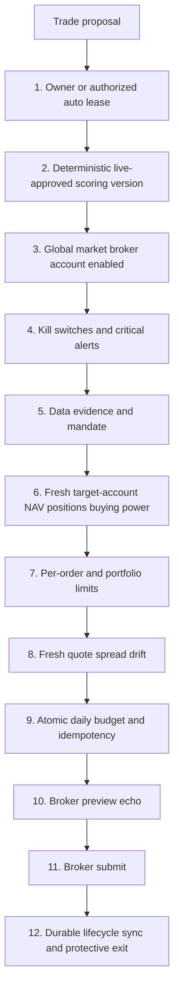

# Kairos — Risk & Safety
> 2026-08-07: **Property/Investing isolation is an invariant, stated here so it is testable.** No property table, adapter, scenario, forecast or decision-journal row is read by any securities score, eligibility gate, position sizing rule, order path, exit, promotion gate or broker call. The dependency runs one way only: Property consumes the shared auth, ownership, System Health and source-provenance conventions, and exports nothing into the investing money path.
>
> Property forecasts are **shadow decision support**. They are written `state = 'shadow'`, are never a promise, and are scored only against values observed after the horizon elapsed. The Forecasts workspace **withholds a calibration rate below 10 matured outcomes** per market-and-metric cohort (`lib/property/calibration.ts`) and shows `n` regardless — at n=3 an interval-coverage percentage can only read 0, 33, 67 or 100 and would be arithmetic noise presented as evidence.
>
> Market-local honesty is enforced rather than assumed: the three active sources are US-only, so adapters declare `supportsMarket()` and the collector records `not_applicable` for Bengaluru instead of `success, 0 rows`. **No US value is ever substituted into an India market card.** Private data handling: no plaintext address, mortgage account number, owner name or uploaded document is stored; payloads are encrypted server-side and owner routes never trust a caller-supplied `owner_id`.

> 2026-08-01 documentation truth audit: the technical breakdown guard is a hard
> cap only for an ATR-scaled fall or a 7% high-volume fall. A bottom-quartile weak
> close is warning-only. This chapter now matches the exact scoring contract in
> chapter 03 and `lib/data/technicals.ts`.
>
> 2026-07-31 scoring input safety: unknown provider taxonomy cannot receive a
> fabricated P/E benchmark; implausible P/E is omitted; missing availability metadata
> cannot include a dimension; malformed macro/insider payloads remain unavailable;
> and ordinary weak closes cannot hard-veto without ATR or volume/move confirmation.
> Only the Next.js ResearchAgent writes authoritative scores. See
> `features/scoring-data-truth/FEATURE_ARCHITECTURE.md`.

> Last updated: 2026-07-25 (**ETF allocation cap** — new `strategy_config.etf_allocation_cap_pct NUMERIC DEFAULT 30` (migration `20260725130000`). Soft guardrail: `executeApprovedOrder` checks BUY orders for US ETF symbols (`isEtfSymbol`) and refuses if current ETF portfolio % + this order's notional / NAV would exceed the cap. Fail-open: any DB read error warns and allows through (unlike symbol blocking which fails closed). India market skipped. SELL always allowed. Configurable 0–100 via Settings → Trading → Risk Profile → ETF Allocation Cap.)
> Prior: 2026-07-20 (**Guarded kill-switch reset + fail-closed risk reads.** Settings now reads the real `market_controls` latch and can reset it only through owner-only `POST /api/settings/kill-switch`: explicit market/book + acknowledgement, originating-book match, current breaker recheck with alert resolution suppressed, durable decision-journal audit, then latch write and matching-alert resolution. Failed config/NAV/history reads block risk increase; the legacy unscoped paper-query retry is removed, so schema/read failure cannot mix US and India risk truth. Trip reason and issue key include `paper|live`; the conservative per-market latch remains shared across books.)
> Last updated: 2026-07-19 (**Webull Trading API transport restored** — `lib/brokers/webull-trade/` is now a fully wired, permit-backed broker adapter. Key safety properties: (1) **Nine-gate ladder** (`gates.ts`) — every Webull order must clear global_trading_enabled, market_control_enabled, circuit_breakers_clear, autonomy_mode_satisfied, single_allowlisted_account (account `605420606` exclusively), orders_feature_flag (`webull_trade_orders_enabled=false` by default), credential_and_token, risk_checks, quantity_within_mandate; (2) **Permit system** — two permit kinds, `preflight` (DB flag check only) and `order` (full 9-gate evaluation); each permit is single-use and expires after 30 s; the transport refuses any request whose path/method is not on the permit's allowlist; (3) **Token preflight** — `preflight.ts` calls `POST /openapi/auth/token/check` before gate 7 to resolve live token status (`PENDING/NORMAL/INVALID/EXPIRED`) and idle-age; `assertTokenUsableForOrder()` blocks on PENDING (now explicit in types), INVALID, EXPIRED, and idle > 15 days; (4) **Single fetch locus** — `liveWebullTransport()` is the only function in the codebase that calls `fetch()` to `api.webull.com`; (5) **Signing** — HMAC-SHA1 over path + sorted params + MD5 body hash, `${appSecret}&` key, `x-access-token` header alongside HMAC headers, timestamp freshness enforced; (6) All flags remain false: `webull_trade_orders_enabled=false`, `global_trading_enabled`, and account allowlist require explicit owner activation before any order is possible. Constraint migration `20260718130000` applied: `protective_orders.mode` locked to `'wider_disaster_floor'`, `currency NOT NULL`, five new DB-enforced invariants on market/currency/broker-id/floor/order-kind/learning-provenance — zero rows in table at time of apply, all constraints verified safe.)
> Prior: 2026-07-18 (**Hybrid protective-stop SHADOW SCAFFOLD — built UP TO the placement line, no live order ever.** New pure module set under `lib/protective/`: (1) a broker-neutral `BrokerProtectiveCapabilities` matrix (`capabilities.ts`) — protection is capability-driven per order-type/TIF/session/account, never a flat broker boolean; an adapter with no eligible MULTI-DAY order for the exact position is `unprotected-by-broker`, never silently protected; (2) Kite's declared capability (`kite-capabilities.ts`) filled from the PROVEN GTT code — Kite protects via the WEAKER `gtt_limit` (LIMIT child, unfilled-trigger risk surfaced), and its DAY-only regular SL-M is declared and correctly REJECTED as a multi-day floor; (3) a pure disaster-floor calculator (`disaster-floor.ts`) parameterized by `(mode, distance)` — Q1 unanswered so `mode` defaults to `wider_disaster_floor` (outage + catastrophic-loss mitigation, NOT touch-at-analytical-stop) and the distance is a CONFIG input with no hardcoded value; monotonic ratchet so a falling high-water mark can never lower the floor; (4) a pure reconciliation loop (`reconcile.ts`) detecting out-of-band triggers, partial fills, cancels, expiry, broker edits, and corporate-action qty drift — unknown state is always `needs_reconcile`, a trigger without a confirmed fill never closes the book, a gap through a limit child is reported unprotected (not filled), expired protection is critical; (5) the state model (`state.ts`) — the `protective_order` record shape + status machine + long-only/cancel-before-replace invariants (total executable SELL never exceeds reconciled held qty; a competing SELL is blocked until cancellation is CONFIRMED). **Exit provenance (Codex's correction):** a disaster-floor fill records `exit_reason = protective_disaster_floor` and `learning_scope = risk_policy_only` — the loss STAYS in P&L, NAV, drawdown, mandate and risk-policy evaluation (real money); ONLY the Learner's signal-weight attribution + genome promotion exclude it, so broker capability can't contaminate weight learning (a generic `excluded_from_learning=true` is insufficient because the evaluation engine also filters that field). **THE MONEY LINE:** `placement-gate.ts` — a false-by-default `strategy_config.protective_orders_enabled` flag gates ALL placement and STAYS FALSE; `planProtectivePlacement()` produces the intended broker action as a plain object and NEVER calls a broker. Deterministic, NO LLM on the money path. US/India never cross (per-market capability scope). Migration `20260718000000_protective_orders_shadow.sql` written as a PROPOSAL and **NOT applied to prod** (creates `protective_orders` + append-only `protective_order_events`, adds the flag + `learning_scope` columns). 32 acceptance/unit tests in `tests/protective-hybrid-stop.test.ts` (all 14 spec acceptance tests, each falsifiable — mutation-verified: breaking the ratchet fails AT3, breaking the cancel-guard fails AT1). Gated behind owner approval of touch semantics (Q1), floor distance, and post-fill policy before anything goes live. See "Hybrid protective-stop shadow scaffold" below + `features/hybrid-stop/FEATURE_ARCHITECTURE.md`.)
> Prior: 2026-07-17 (**Research visibility on the risk surface — a DISPLAY JOIN, coupled to nothing.** `GET /api/portfolio/risk-daily` now attaches a nullable per-holding `research` block (score, direction, `scored_at`, `sessions_since`, `days_since`, `state`, `scored_as_holding`) joined from the latest `agent_signals` row per **`(symbol, market)`** — never symbol alone. **Invariant R1: no field of it is read by `computeHoldingRisk`, `sba-v1`, `constructPortfolio`, the execution kernel, or any gate** — the risk engine stays research-free BY DESIGN, because a sector is over-cap *because* research liked that sector and letting `analyst_score` also veto the cap double-counts the same signal. **Why it exists: on 2026-07-16 AVGO was 6 days unscored while this panel said "trim", and nothing on screen said so — the AGE is the feature, not the score.** Staleness is measured in market-local **SESSIONS** (reusing `marketSessionsSince`; a Friday score read Monday is 3 days but ONE session — a calendar-day rule would paint the book stale every Monday) and displayed in days. Four non-collapsed states: `fresh` (≤ 2 sessions) · `stale` (warning + day count; annotates the SCORE only, never the action) · `never` (no signal ever — deliberately NOT a link) · `unavailable` (abstained — never rendered as a number). Every annotated row is labelled a screener **candidate** score: `is_holding` is false in **463/463** prod rows, so a `neutral` there does not mean "no exit signal" — the exit question was never asked. Fail-soft: an `agent_signals` error still renders the risk table with an explicit "research unavailable". R1 is pinned behaviorally AND architecturally by `tests/risk-research-annotation.test.ts`, whose coupling detector is itself falsification-tested. Supersedes the unmerged `features/risk-research-integration` (research *ordering* trim absorption — not pursued). No schema change, no migration, no new cron, no LLM. See "Daily Per-Holding Risk Analytics" below + `features/risk-research-visibility/FEATURE_ARCHITECTURE.md`.)
> Prior: 2026-07-16 (**Sector-cap breach ALLOCATOR** — `hr-v1` → `hr-v2`. Defect fixed: a sector-cap breach is a property of the SECTOR, so `sectorUtil >= 1` was the identical number for every holding in the sector and hr-v1 handed EVERY Technology name the identical `trim` (the live AVGO advice: "Trim your position because Technology holdings exceed the 30% sector cap (at 65.6%)") without ever deciding WHICH names absorb the breach or HOW MUCH each gives up — arbitrary and unactionable. New pure module `lib/risk/sector-breach.ts` (`sba-v1`) allocates the breach deterministically by **water-fill**: trim the largest names in the sector down to a common level `L` where `Σ min(wᵢ,L) = cap`. Justified over pro-rata (which re-ships the same blanket verdict and leaves the name-cap breach untouched) and over "marginal contribution" (for a sector-weight cap, a name's marginal contribution IS its weight — the same rule with extra abstraction). NAV basis, because `live-portfolio-gate` enforces the owner's cap as `value/NAV` — the invested basis would make the advice ~43% wrong. Safety properties: **(1) exits untouched** — the `exit_review` branch is first and unconditional; no allocation, and no absence of one, can delay or suppress a protective-stop/thesis-break exit; **(2) risk-internal** — a function of weights and one owner-set cap, ZERO research/`analyst_score` coupling; **(3) defaults to honest** — a sector breach with no usable allocation yields `review` + `missing_inputs:["sector_breach_allocation"]`, NOT a fallback to the old blanket trim; **(4) sector-unknown degrades honestly** — excluded from every sector total, never bucketed into a synthetic sector, never assumed cap-compliant; **(5) LLM still prose-only** — `parseStrategyNotes` (`lib/risk/strategy-notes.ts`) can only emit `Map<requestedSymbol, string>`, proven by test. Non-selected names now say `hold` **with the reason they weren't selected**. Read-only accounts (everything but `605420660`) are labelled advisory-informational. No migration. See "Daily Per-Holding Risk Analytics" below + `features/risk-sector-breach-allocation/FEATURE_ARCHITECTURE.md`.)
> 2026-07-21 router proof hardening: cohort evaluation is cache-only and cannot lease, call, or enqueue provider work. ResearchAgent copies already-fetched deterministic score inputs into the canonical cache through an internal read-only adapter. Activation now requires separate `safety_pass` and `quality_pass`, a fresh selected proof, and ten distinct validated ResearchAgent `as_of_session` values in a 45-day window for the exact market/policy/code/strategy tuple. Weekend/holiday staged rows do not count. Existing rows default false and cannot authorize cutover. Router remains shadow-only, `router_enabled=false` both markets.

> 2026-07-31 ADR safety: reviewed ADR identity is explicit, never inferred. `SKHY` uses the Nasdaq ADS and ADS-basis Yahoo fundamentals; retired/OTC proxies (`SKHYV`, `HXSCL`, `HXSCF`) are rejected by the shared paper/live symbol policy. A thin ADS source becomes unavailable rather than falling through to foreign-underlying per-share data. ADR support adds no live-trading permission and does not bypass broker review or any existing market/account/risk gate.
>
> Prior: 2026-07-16 (**Runtime evidence-degradation guard** — a NEW safety gate on the research entry path, shipped **measure-only**. Problem it solves: scoring renormalizes weights across *available* dimensions, so a dimension dropping out (provider outage OR a routing change) could push a symbol from ineligible→eligible on **missing data rather than new information**. The guard compares each symbol's current availability/quality mask against the last accepted market-local baseline; if a REQUIRED field degrades (fresh→stale beyond ceiling, available→missing, valid→conflict/quarantined) it abstains from any NEW long whose eligibility depends on renormalizing around that degradation. Safety properties, all enforced: **(1) strictly subtractive** — the only transformation is `long → neutral`; **`short` passes untouched in every mode**, checked before the mode branch AND enforced by a schema CHECK, so no code path can persist a guard event that *created* an entry; **(2) never suppresses an exit** — existing holdings continue through PositionMonitor's normal risk/exit logic, an evidence outage cannot block a stop or mandatory exit; **(3) defaults to abstain** (no baseline + unusable required field ⇒ abstain), and **only clean runs re-baseline**, so a persistent outage never normalizes itself; **(4) fail-safe config** — `EVIDENCE_DEGRADATION_GUARD_MODE` defaults to `measure_only` and an unparseable value ALSO falls back to measure_only, so a broken config can neither silently enforce nor silently stop recording; **(5) one aggregated health event per run**, not one alert per symbol. Modes: `off | measure_only | enforce`. **Shipped in `measure_only`** — it records what it *would* abstain and changes no direction. Flipping to `enforce` is an owner decision after observing its logged would-abstain rate. Also: `analyst.consensus` is classified narrative-only (US) / unsupported (India) and excluded from gated intents, so it can never block a cutover. Router itself remains shadow-only, `router_enabled=false` both markets.)

> Last updated: 2026-07-15 (LLM-discretion exit hole CLOSED — the last place LLM output could move money. Research direction gate extracted to pure `lib/signal-direction.ts` (unit-tested, `tests/signal-direction.test.ts`): held-position exit ("short") is now DETERMINISTIC — `isHeld && analystScore < mandate threshold` — the LLM's direction field NEVER sets an executable direction (previously an LLM "short" on a held name became an exit signal stored as `deterministic_v1`, and could teach the learner from LLM-created outcomes). SELL capability on holdings preserved per locked rule, now evidence-driven; LLM opinion kept advisory-only in `research_packets.raw_data._original_direction`. LearnerAgent's reassess flag renamed `llm_exit`→`score_reassess_exit` (score-only trigger); PositionMonitor honors both (legacy drain). Historical contamination verified ZERO (no closed trade ever exited via `llm_exit` or a long→short LLM flip). Entries were already deterministic; paper/live consumers already require `score_source="deterministic_v1"`.)
> Prior: 2026-07-15 (Supabase Security Advisor remediation — `20260715120000_security_rls_and_rpc_lockdown.sql`: the public anon API key could read 16 RLS-disabled `public` tables (incl. `agent_config`/`learner_config`) and call SECURITY DEFINER RPCs (`kairos_call_agent`, `activate_evidence_policy`, …) because they carried the default `GRANT EXECUTE TO PUBLIC`. Fix: RLS deny-all on 15 agent-internal tables + `authenticated`-read on `newsletters` (service_role bypasses, so agents/crons unaffected); `REVOKE EXECUTE … FROM PUBLIC` on the anon-callable definer RPCs (keeping `service_role`, and `authenticated` for the owner's `get_daily_ai_count`); pinned `search_path=public` on 15 definer/trigger fns. Verified via `get_advisors`: 0 ERROR, 0 anon-executable definer functions. Deferred WARNs: 7 always-true policies tighten at multi-tenant, `pg_net` schema move, Auth leaked-password toggle.)
> Prior: 2026-07-11 (Proactive broker-token health check — `checkRobinhoodTokenHealth` attempts a CAS refresh on the short-lived RH access token from the status route + health-triage cron (6h), reporting `broker-token:robinhood` only on a genuinely failed/absent refresh; Settings badge shows "Reconnect required" only on a real dead-refresh, else "Connected — valid until <access-token TTL>". See "Proactive broker-token health check" section. Prior: Daily Per-Holding Risk Analytics advisory surface.)
> Prior: 2026-07-11 (Codex Phase-B re-review remediation: (Codex#2/#3) the Kite identity gate no longer trusts allowlist *text* alone — `verifyKiteTradingIdentity()` (`lib/kite.ts`) now fetches Kite `/user/profile` and requires the CONNECTED token's `user_id` to equal `strategy_config.active_account_india` AND an allowlisted `broker_accounts{broker=kite,market=india,role=trading}` row. It is enforced at the single `placeEquityOrder()` choke point, so the canonical/autonomous/exit paths (via `kiteAdapter.submitOrder`) get the same check as the standalone route — not just the route. Fail-closed: config read err ⇒ 500, unset/absent/view_only ⇒ 403, profile unfetchable / user_id mismatch ⇒ 502/403. (Codex#1) the v2 budget advisory lock DROPS broker from its key (now `local_date:market:env`) so it matches the market-wide cap it guards — two brokers in one market can no longer take different locks and jointly exceed the cap. (Codex#4) migration 153 rejects non-finite (Infinity/NaN) qty/notional/cap and validates side/env/broker/symbol/order_type enums+identifiers, fail-closed. Migration 153 additive over 152 (never edited).)
> Prior: 2026-07-11 (Phase B residuals of 07_08_FULL_APP_REVIEW: A2 the standalone India Kite order route (`app/api/kite/order`) now enforces a fail-closed identity/allowlist gate — it requires `strategy_config.active_account_india` to match a `broker_accounts{broker=kite,market=india,role=trading}` row before reserving budget; unset/absent/view_only ⇒ 403 (no silent fallback), so India live is blocked until an allowlisted Kite trading row is inserted. Canonical-path *unification* still deferred. A4 read-only NAV reconciliation report `GET /api/paper/nav-reconcile` (owner-gated, zero writes) re-derives `nav == cash + Σ qty·price` per pool. A5 v2 daily-BUY budget window is market-local (America/New_York / Asia/Kolkata), not UTC; advisory lock keyed by local_date:market:broker:env. Dead edge-fn kill-switch copy deleted.)
> Prior: 2026-07-11 (Phase A P0 remediation of 07_08_FULL_APP_REVIEW: A1 kill switches take explicit `{book,accountId}` context — mode no longer inferred from live_auto_enabled; live baseline = account's own snapshot peak not START_NAV; new `sellAllowed` separates risk-increase from risk-reduction so a trip blocks BUY but not a verified SELL; `no_baseline`/`stale_snapshot` fail-close BUY only. A3 durable broker ACK (bounded DB retry → 202 needs_reconcile, never {ok:true}). A4 PositionMonitor NAV write errors now fatal. A5 budget-RPC v1/v2 EXECUTE revoked from public/anon/authenticated.)
> Prior: 2026-07-10 (Phase 1 P0: L4 enforcement, conviction normalization, India currency, duplicate SELL, cancel-on-kill BUY-only; Codex P0/P1: breakdown veto, calibration OOS gate, promotion governance.)
> Update when any authorization, scoring eligibility, limit, account, order, reconciliation, exit, or kill-switch behavior changes.

> 2026-07-26 policy-event ledger: US FOMC schedule, official target-range outcomes, and post-event return observations are display/measurement-only. Missing market expectations render unavailable; they never become a neutral or zero surprise. The ledger has no scorer, sizing, paper, live, exit, broker, or India reader. Post-event impacts use only frozen daily-return evidence and are append-only.

---

## Overview

**2026-08-06 security boundary:** browser-callable
`get_daily_ai_count(p_user_id)` is a SECURITY DEFINER RPC for the owner's daily
AI counter. Migration `20260806183039_restrict_daily_ai_count_to_caller.sql`
requires `auth.uid() = p_user_id` inside the function, so an authenticated caller
cannot query another user's count by substituting a UUID. Service-role access is
retained for trusted server work.

Manual and future autonomous orders must pass one shared Execution Gateway. Manual and auto differ only in **who authorizes the proposal**; they do not have separate money-safety implementations.



Unknown, null, stale, malformed, or errored state on a live BUY fails closed. Verified risk-reducing SELL exits remain exempt only from BUY budgets/caps; they still require account, holdings, quote, idempotency, broker, and audit checks.

### Completed-session and schedule boundaries (2026-07-31)

Daily ResearchAgent technical evidence is filtered after provider normalization and before scoring, return capture, trade-plan construction, or evidence persistence. A market-local current-date daily candle is admitted only after 16:00 America/New_York (US) or 15:30 Asia/Kolkata (India); malformed/future dates are rejected. Intraday quote consumers are unaffected.

US research, paper-entry, and daily monitor jobs use paired EDT/EST UTC schedules with an exact route-level `local_slot` contract. The seasonal duplicate exits before provider or database work. This prevents the close monitor from shifting to 15:15 ET in winter and prevents entry/research slots from silently moving by an hour.

India headline/event collection is shadow-only. Its intents have no scoring, learner-mutation, paper/live execution, position-monitor, or broker reader; unknown coverage remains unavailable rather than becoming a neutral score.

---

## Gate details

### 1 — Authorization envelope

**Manual:** `requireOwner()` + request/CSRF guard + owner approval/Send action.

**Future auto L4:** all of deployment `AUTONOMOUS_LIVE_ENABLED=true`, `autonomy_level='L4_live_small_auto'`, `live_auto_enabled=true`, unexpired owner lease, authenticated cron worker, and a single-run lease. The gateway (`executeApprovedOrder`) enforces `autonomousWorkerAllowed(autonomy_level)` for non-owner actors — L3_live_manual is insufficient and returns 403. The autonomous path cannot use owner-only risk overrides.

Enabling an auto envelope is a human money/config change and is journaled. It is not permission for an LLM to change caps, accounts, strategy lifecycle, or code.

### 2 — Signal and scoring eligibility

Live BUY requires:

- deterministic `score_source`;
- strategy/scoring lifecycle `live_approved` with linked validation evidence;
- market/asset/setup allowed by the mandate;
- unexpired proposal and signal;
- long-only new-position decision;
- no unresolved taint or invalid LLM veto state.

A score threshold or `eligible_for_live_review` flag alone never grants live eligibility.

**Breakdown veto (deterministic, runs before momentum math).** `scoreTechnicals`
(`lib/data/technicals.ts`) evaluates `detectBreakdownVeto` first. A last bar down
at least 2.5 ATR, or down at least 7% on at least 1.5x normal volume, caps the
technical score at 20 regardless of RSI/EMA. A bottom-quartile close on a down
bar is recorded as a warning but does **not** trigger the cap. In plain language:
an unusually large, well-confirmed fall can block a misleadingly strong momentum
score; a merely weak close supplies context rather than pretending to prove a
breakdown. This closes the prior bug where a 12% high-volume reversal scored about
100 because RSI had fallen into the preferred band while price was still above
the EMAs. Thresholds remain v0 guardrails needing prospective validation per
liquidity bucket.

**Promotion governance** (`app/api/strategies/versions/route.ts`). A champion can
only be promoted with a PASSED validation experiment: the `force_unvalidated`
bypass is hard-rejected (400). Demotion of the prior champion is always
market-scoped — the former unscoped demote-all fallback is removed and now aborts
the promotion on error, so promoting an India challenger never touches the US
champion.

**Automated validation boundary** (migration 170, `activate_strategy_shadow` RPC,
`lib/validation/automation.ts`). Automatic challenger validation + shadow routing
(gated per-market by `strategy_validation_automation`, fail-closed) has exactly one
automatic lifecycle transition: a PASSED challenger → non-executing `shadow_paper`.
It **cannot** promote a champion, create a paper fill, move cash, make a broker
proposal, or place a live order — the RPC is `service_role`-only, holds a per-market
advisory lock, caps at one shadow (`max_active_shadows` 0–1), and refuses any
champion/terminal/unvalidated version. Promotion and every execution gate above
stay separate and owner-only.

**Paper accounting integrity (2026-07-13).** Two silent-write bugs are fixed and
guarded: (1) `disableTrading` (kill switch) wrote a non-existent `strategy_config.notes`
column, so PostgREST rejected the whole update and the switch never actually set
`trading_enabled=false` — `notes` removed, the switch now halts as intended.
(2) An earlier `paper_portfolio` update bundled a non-existent `open_positions`
column and silently dropped close-proceeds cash credits, understating NAV and
tripping a PHANTOM drawdown/kill switch on India (~₹197k). The lost cash was
reconciled from the trade ledger (`seed − Σopen-cost + Σrealized`), and the
position-monitor now runs a **ledger reconciliation guard** every cycle: if
`cash_balance` drifts from the ledger beyond 0.5% of seed it raises
`paper-cash-drift:<market>` (warn) so drift is visible and actionable BEFORE the
drawdown breaker acts on corrupted NAV.

**Capital rotation P1 PAPER execution enabled (migration 20260723120000,
owner-approved 2026-07-23).** PaperTrader records a `rotation_events` audit row
when a candidate is rejected for `max_open_names` or `insufficient_cash`, and —
paper book only — may now execute the rotation. The gate stack, all fail-closed:
`CAPITAL_ROTATION_PAPER_ENABLED` deployment env var, per-market
`rotation_config.rotation_paper_execute_enabled` (true only for
`book_type='paper'`; both live rows remain false), a fresh deterministic
eligibility re-eval against the current book, persistence (≥2 distinct prior
planned runs), cooldown (5d per symbol), per-run (1) and per-day (1) caps, and
finally the atomic `execute_paper_rotation` RPC: it re-validates the signal
claim, sells the source via `execute_paper_exit` (marked price − 5 bps), buys
the candidate via `execute_paper_fill` (which re-runs mandate threshold, market
controls, existing-position, name/sector caps, cash) in ONE transaction — a buy-leg
denial rolls back the sell. The prior containment check constraint
(`rotation_paper_execution_p1_not_approved`) was dropped by the same migration.
There is NO live rotation path: no live proposal is created, and
PositionMonitor remains the only owner of true exit labels.

New P0 rows now carry a fail-closed P1 readiness contract. Rotation source
selection reuses the canonical paper exit-plan projection; post-swap sizing
and measured correlation are evaluated over the same market only; persistence
counts distinct prior runs; turnover uses filled paper-order notional against
same-market NAV; and missing tax lots, economic mapping, configured turnover,
correlation, or complete query results remain explicit blockers. These fields
are diagnostic only and cannot relax an entry, exit, cash, position, or order
gate. Agents -> Rotation exposes the market-local evidence without an enable
control.

**Per-market pause/kill isolation (migration 171).** The pause and kill-switch
state was GLOBAL (`strategy_config.app_paused`/`trading_enabled`), so one
market's breaker halted BOTH — India's phantom drawdown even skipped the US
research run. Now `market_controls` holds one row per market; the drawdown
breaker calls `setMarketPaused(market)`, the kill switch `setMarketTrading(market,false)`,
and every gate reads `isPaused(svc, market)` / `isTradingEnabled(svc, market)`
(`lib/market-controls.ts`, fail-closed on read error). A market's trip isolates
to that market; the legacy global flags are retained as a **master-kill** that
still stops everything. Research is no longer gated by the pause at all (it is
measurement — only entry paths pause). Exits keep running during a pause. Owner
resumes a single market from the sidebar per-market banner (`/api/settings/pause`
with a `market`).

### 3 — Trading/broker/account enablement

All global, per-market, broker, and account toggles must be true. Broker resolution fails closed.

US order account is exactly Robinhood agentic account `605420660`. Account `965848641` is read-only for the approved research-holdings use; its NAV/positions cannot size or authorize agentic-account orders. The real implementation currently hardcodes/resolves account IDs; the documentation must not claim otherwise. Credentials/tokens remain encrypted in the vault and never enter code/logs.

### 4 — Kill switches

`lib/kill-switches.ts` checks per market for daily loss, peak drawdown, and rolling accuracy, disables trading, and creates a critical alert. Submit-time checks must rerun immediately before reserve/send.

**One entry per open alpha name (2026-08-06).** A fresh score can reassess a held position but cannot create an unvalidated add-to-winner. PaperTrader marks that later signal superseded before claim; the database independently rejects a concurrent bypass. A separately validated and owner-approved add-to-winner policy would need its own risk budget, attribution, and shadow evidence before this rule may change.

**Accuracy-gate minimum sample (`MIN_ACCURACY_SAMPLE = 20`, corrected 2026-07-29).** Paper accuracy uses the actual realization timestamp and aggregates every entry lot closed for one symbol at one timestamp into one exit episode. The combined episode return is classified with the currency-neutral breakeven band; breakevens and tainted rows are excluded. The gate trips only after **≥20 directional exit episodes**. Live filled-order pairing is not a kill-switch input: pairing a SELL with the latest BUY is not broker-confirmed lot accounting and is wrong under partial fills. Live daily-loss and drawdown remain immediate from account NAV.

**Guarded manual reset (2026-07-20).** The per-market strategy toggle is not the breaker latch. Settings reads `market_controls` separately and exposes reset only while its `trading_enabled` is false. Reset names the originating `paper|live` book, reruns that book's deterministic checks, refuses a mismatched book or active market pause, writes an unresolved audit record before enabling, and resolves it plus only the matching kill alert after the latch write succeeds. It never changes thresholds, accounts, global/security pause, credentials, or autonomy flags. Risk/config reads are strictly market-scoped and fail closed; the old pre-schema unscoped retry is forbidden.

`checkKillSwitches(svc, { market, book, accountId? })` takes an **explicit book/account context** (A1/P0-1). Mode is NO LONGER inferred from `live_auto_enabled` — an L3 manual-live order (`live_auto_enabled=false`) must still measure real live NAV, so the caller declares the book:
- `book:"paper"`: reads `paper_portfolio` / `paper_performance` plus realized `paper_trades` exit episodes. A bare-string market arg (`checkKillSwitches(svc, "us")`) is the back-compat paper form.
- `book:"live"`: reads `live_account_snapshots` for the resolved account (`accountId`, else `active_account_{market}`) for daily-loss + drawdown. Accuracy remains analytics-only until a reconciled realized-lot ledger exists.

**Live baseline is the account's OWN 90-day snapshot peak, never a static `START_NAV`** — a real $36 account is not measured against a $10k paper floor.

**Fail-closed for BUY** (result `{ safe:false, sellAllowed:true }`) on any of: no configured account or no snapshots (`tripped:"no_baseline"`), or newest snapshot older than `KS_LIVE_SNAPSHOT_MAX_AGE_MS` (default 6h, `tripped:"stale_snapshot"`).

**Risk-increase vs risk-reduction are separated.** The result is `{ safe, sellAllowed, reason?, tripped? }`. A live daily-loss / drawdown trip sets `safe:false` (blocks BUY) but leaves `sellAllowed:true` — a risk-reducing SELL that has passed fresh exact-account held-quantity verification is not blocked. Callers gate as `ksBlocks = side==="sell" ? !sellAllowed : !safe`. A freshness fail-close likewise blocks BUY only. PaperTrader consumes `safe` only for new entries; PositionMonitor's deterministic held-position exits continue independently. `security_locked` still blocks live execution.

Atomic SELL idempotency: `trade_proposals_active_sell_uniq` partial unique index on `(symbol, market)` WHERE side='sell' AND status IN ('pending_review','queued_auto') enforces at most one active autonomous SELL per position at the DB level. Concurrent exit-monitor runs hitting the same position get a 23505 conflict, not a duplicate SELL.

For L4, any unresolved critical trading/data/reconciliation alert blocks new entries. Cancel-on-kill cancels only resting BUY orders — protective SELL orders are explicitly excluded (canceling an exit increases open exposure). Risk-reducing held-position exits remain allowed where state can be verified.

### 5 — Data quality and overrides

`data_confidence` uses structural applicable base weights:

```text
fresh valid applicable base weight / all structurally applicable base weight
```

Inapplicable dimensions are omitted from both terms; missing/stale/failed/degraded dimensions stay in the denominator and contribute zero. Post-renormalization `applied_weights` are never the denominator.

Manual owner may use `acceptLowQuality` only with a durable reason written before the order. Auto has no quality or portfolio-risk override. `quality_status=unknown`, missing decision link, or confidence error blocks auto/live BUY.

### 6 — Fresh account state

NAV, positions, open orders, and buying power must come from the actual target account and meet explicit freshness bounds. There is no `FALLBACK_NAV` for live or auto sizing. If the target account cannot be read, BUY size is zero and SELL authorization fails unless current holdings can be independently verified.

India values remain INR and US values USD. No currency conversion is implicit. If a future cross-currency limit is needed, the FX observation/source/time is explicit and conservative.

### 7 — Limits and portfolio construction

Current per-order limits live in `strategy_config.max_order_notional_usd` / `max_order_notional_inr`; daily limits use `max_daily_notional_*` and `max_daily_trades`. Do not claim these are `broker_accounts.notional_cap_usd` unless the schema is actually migrated.

Final BUY size is the minimum of opportunity size, per-order cap, remaining atomic daily budget, buying power, and name/sector/gross/correlation/volatility limits. Quantity rounds down; zero means abstain. SELL that reduces a verified holding is exempt from BUY notional/daily budgets.

### 8 — Quote and drift

A fresh executable quote is obtained immediately before reservation. Validate positive finite price, retrieval age, spread/liquidity, and drift from proposal/approval. Use a marketable limit collar when the broker schema supports it; never guess tool parameters.

### 9 — Atomic budget and idempotency

All live submit paths must call the atomic budget-reservation RPC. It counts reserved/submitted/partial/unknown live BUYs and inserts `broker_orders.status='pending_submit'` in the same transaction. Unique active order per proposal is the hard duplicate backstop.

**Advisory-lock scope must match the cap's query scope (Codex#1, migration 153).** The daily-BUY cap counts/sums `broker_orders` filtered by `market + broker_env='live' + side='buy'` — it is **market-wide**, NOT per-broker. So the serializing advisory lock is keyed `hashtext(local_date:market:env)` and MUST NOT include broker: a broker in the key would let two concurrent live BUYs in one market but different brokers take *different* locks, both read the same pre-order total, and jointly exceed the market cap. Distinct markets still hash distinct and never block each other. (Migration 152 wrongly included broker; 153 narrows it back to the query scope.)

**Fail-closed input validation (Codex#4, migration 153).** The `SECURITY DEFINER` RPC rejects malformed service input rather than silently reserving: non-finite numerics (`Infinity`/`-Infinity`/`NaN` pass a naive `> 0` check, so qty, estimated_notional, and `max_daily_notional` are checked explicitly), a non-canonical `p_side`/`p_broker_env` (e.g. uppercase `'BUY'` would skip the lowercased BUY-cap branch yet still insert a live row), and empty broker/symbol/order_type identifiers. A live BUY must additionally carry a positive finite notional.

The current RPC records `approved_by_user=true` for `owner` and `false` for `autonomous_worker` via `p_execution_actor` (v2). A read/sum/check in TypeScript is forbidden because concurrent requests can exceed the cap.

### 10 — Broker preview

Robinhood requires `review_equity_order` before place. Preview must echo account, symbol, side, quantity, and order type. Any missing/mismatch/error blocks submission. Adapter schema is discovered from the live MCP tool list; no LLM constructs parameters.

### 11 — Submit outcome

- confirmed success with broker ID → `submitted`;
- clean reject/error → definitive error state;
- timeout/possible success/no broker ID → `unknown_needs_reconcile`, budget remains reserved, retry blocked;
- every transition produces a durable event/audit record.

Email is secondary notification, never the source of truth.

### 12 — Fill reconciliation and exits

Order sync handles submitted, partial, filled, cancelled, rejected, and unknown states. Partial fill never triggers blind remainder resubmission and available quantity accounts for open SELL orders.

Autonomous BUY is prohibited until a deterministic live protective-exit path exists. Stops/time exits/targets use the same Gateway and verified held quantity. A protection/monitor heartbeat failure disables new autonomous entries. Tax and dividend preferences cannot delay a risk stop.

---

## Autonomy ladder

Use only schema values from migration 124:

| Level | Meaning | Live placement |
|---|---|---|
| `L0_research` | research only | none |
| `L1_paper_auto` | automated paper | none |
| `L2_shadow` | shadow live recommendations | none |
| `L3_live_manual` | owner-approved live | owner action required |
| `L4_live_small_auto` | future small autonomous envelope | only after architecture phases and explicit enablement |
| `L5_scaled_auto` | future scaled envelope | not implemented |

Unknown values fail closed. Documentation/UI must not use obsolete names such as `paper_only` or `live_supervised`.

---

## Account allowlist

| Account | Market | Role | Allowed use |
|---|---|---|---|
| `605420660` | US | agentic/trading | only Robinhood account permitted for Kairos orders and order-account sizing |
| `965848641` | US | view-only/manual | approved read-only holdings research; never order placement or agentic sizing |
| configured Kite account | India | trading | official Kite API, INR limits, CNC delivery, separate manual gate today |

Every broker/account lookup is scoped by broker, market, role, enabled state, and account ID. No silent default.

**Kite verified-identity gate (`verifyKiteTradingIdentity()` in `lib/kite.ts`).** The allowlist row is text — it says which account *should* be connected, not which one *is*. So before any Kite submit the gate ALSO fetches Kite `/user/profile` and requires the connected token's `user_id` to equal `strategy_config.active_account_india` (both are the same immutable Zerodha user_id, written together by the OAuth callback). It requires the matching `broker_accounts{broker=kite,market=india,role=trading}` allowlist row as well. Fail-closed: config read error ⇒ 500; account unset, allowlist row absent, or `view_only` role ⇒ 403; profile unfetchable or `user_id` mismatch ⇒ 502/403. No silent fallback.

The check is enforced at the single `placeEquityOrder()` **choke point** (Codex#2/#3), which every programmatic Kite submit passes through — the standalone route (`app/api/kite/order`, which also runs the check before budget reservation so a mismatch never strands a pending row) AND the canonical/autonomous/exit paths that reach it via `kiteAdapter.submitOrder`. Gating the choke point, not just the route, closes the earlier gap where the canonical path bypassed the route-level block. Because no Kite row exists in `broker_accounts` today, all India live orders currently refuse until the owner inserts an allowlisted Kite trading account whose id matches the connected token — the intended posture until the path is unified onto the canonical `executeApprovedOrder` service.

---

## State tables versus immutable ledgers

Do not describe every financial table as immutable; several require lifecycle updates.

**Append-only / no UPDATE or DELETE:**

- `decision_observations`;
- `paper_order_events`;
- `strategy_evaluations`;
- `evidence_records` (subject to its existing immutable design);
- target `broker_order_events`.

**Mutable current-state/audited tables — never hard-delete financial history:**

- `paper_trades` is updated when a trade closes;
- `broker_orders` is updated as broker lifecycle changes;
- `trade_proposals` changes approval/execution status;
- `paper_positions` represents current open state and may be removed/closed only through the transactional exit path.

Every material state transition must have an append-only event/journal record. Cleanup jobs never delete financial/audit history.

---

## Fail behavior matrix

| Failure | Manual BUY | Auto BUY | Verified risk-reducing SELL |
|---|---|---|---|
| Auth/actor invalid | block | block | block |
| Scoring version not live-approved | block | block | allow only if independently triggered by risk exit and holding verified |
| Quality unknown/low | block unless audited owner override | block, no override | do not block risk exit solely for entry-data quality |
| NAV/portfolio stale | block or audited manual portfolio override | block, no override | require fresh held quantity; NAV cap exempt |
| Quote stale/missing | block | block | block |
| Daily BUY cap full | block | block | exempt |
| Broker timeout | reconcile/no retry | reconcile/no retry + disable new entries | reconcile/no retry |
| Exit protection unavailable | owner warned/manual decision | block entry | alert/escalate |

---

## Launch blockers for L4

- shared execution kernel used by all live paths;
- correct account test (`605420660`) and allowlist verification;
- atomic autonomous budget RPC with true actor audit;
- scoring version lifecycle enforcement;
- fresh agentic-account state with no fallback NAV;
- broker preview echo and idempotency/reconcile path;
- partial-fill/order sync and append-only broker events;
- deterministic live protective SELL path;
- duplicate-cron, timeout, stale-data, DB-failure, and kill-switch chaos tests;
- ✅ PA1 shadow evidence — AutonomousShadow running, execution kernel in `lib/trading/execution-kernel.ts`
- ✅ PA2 Kelly sizing — `computeAutonomousSizing()` in `lib/trading/execution-kernel.ts`; budget dry-run in shadow path; no-fallback NAV enforced (see PA2 section below)
- ✅ PA3 broker submit — `lib/trading/autonomous-live.ts`; direct Robinhood REST (`lib/brokers/robinhood/rest-client.ts`) + Kite REST; per-market mode (migration 141); requires `AUTONOMOUS_LIVE_ENABLED=true` in Vercel env

Until all pass, `AUTONOMOUS_LIVE_ENABLED` remains false and L4 is descriptive only.

---

## PA1 shadow path (implemented, deployment flag inactive)

`lib/trading/execution-kernel.ts` → `evaluateAutonomousExecution()` is the single pure gate
evaluator shared by the shadow path (PA1) and the future live path (PA2+). It takes a
`KernelInput` + `LiveAutoPolicy` snapshot and returns `KernelResult` — no DB calls, no side
effects, deterministic.

Gates evaluated in order:

| # | Gate | Fail label |
|---|---|---|
| 1 | `AUTONOMOUS_LIVE_ENABLED` deployment flag | `deployment_flag_inactive` |
| 2 | `live_auto_enabled` DB toggle | `db_toggle_off` |
| 3 | Lease not expired | `lease_expired` |
| 4 | Direction = long | `non_long_direction` |
| 5 | Score ≥ threshold | `score_below_threshold` |
| 6 | `evidence_confidence` ≥ floor (≥ 0.6) | `confidence_below_floor` |
| 7 | Open positions < cap | `max_positions_reached` |
| 8 | Orders today < cap | `max_daily_orders_reached` |
| 9 | Notional ≤ per-order cap (skipped when 0) | `per_order_cap_exceeded` |

`runAutonomousShadow()` in `lib/trading/autonomous-shadow.ts` calls the kernel for each
qualifying signal, creates a `trade_proposals` row with `execution_mode='autonomous_shadow'`,
and updates `status` to `queued_auto` (kernel approved) or `manual_review_required` (gate fired).
**No broker call, no budget reservation, no order submission in PA1.**

---

## PA2 shadow sizing (implemented, deployment flag inactive)

`computeAutonomousSizing()` in `lib/trading/execution-kernel.ts` computes position size for every
`queued_auto` proposal. Rules:

| Condition | Outcome |
|---|---|
| `live_account_snapshots` row missing OR NAV ≤ 0 | `noSize('no_live_nav')` → downgrade to `manual_review_required` |
| NAV age > 4h (default) | `noSize('stale_nav_Nmin')` → downgrade |
| Quote unavailable or price ≤ 0 | `noSize('no_current_price')` → downgrade |
| ≥ 10 closed `paper_trades` with P&L | Kelly (half-Kelly from win_rate × payoff_ratio, capped at min(10%, per-order-cap/NAV), floored at 2%) |
| < 10 closed trades | Flat `position_size_pct` from `strategy_config` |
| `floor(NAV × size_pct / price) < 1` | `noSize('qty_rounds_to_zero')` → downgrade |

Per-order cap clamp: `size_pct = min(size_pct, live_auto_max_per_order_usd / NAV)`.

`queued_auto` proposals that survive sizing get `qty`, `estimated_value`, `pct_of_nav`, and
`price_at_proposal` populated. Budget dry-run (informational only; not the atomic reservation):
reads today's `broker_orders` spend vs `live_auto_daily_cap_usd` and includes the result in
`ShadowRunResult.budget_dry_run`. The atomic `reserve_live_order_budget_v2` RPC is NOT called in
the shadow path — it is called in the live-submit PA3 path.

---

## PA3 live execution (implemented, requires `AUTONOMOUS_LIVE_ENABLED=true`)

`lib/trading/autonomous-live.ts` → `runAutonomousLive()` is the live execution path.
Triggered by `POST /api/agents/autonomous-live/cron` at 14:00 UTC weekdays (after research at 13:00 UTC).

**Per-market mode (`strategy_config`, migration 141):**

| `live_auto_mode_[market]` | Behavior |
|---|---|
| `off` | Cron skips market entirely |
| `manual` | TraderAgent creates proposals; owner clicks Approve (existing path) |
| `autonomous` | AutonomousLive cron submits live orders |

**Additional gates (before kernel):**
- `app_paused=false` + `security_locked=false` + `trading_enabled=true`
- `live_auto_mode_[market]='autonomous'` for signal's market
- **Per-market view-only kill switch:** a market is dropped from `autonomousMarkets`
  when `trading_enabled_[market]=false` — the same per-market switch the manual
  gateways honor also blocks the autonomous path. Flipping a market to view-only
  stops auto orders for it even if its mode column is still `autonomous`.
- **Daily-cap fail-closed:** per signal, an effective daily notional ceiling is
  required. US prefers `live_auto_daily_cap_usd` (the owner's Live-Auto $/day
  guardrail), falling back to `max_daily_notional_usd`; India uses
  `max_daily_notional_inr` (the USD cap is not FX-converted on this path). If the
  effective ceiling is NULL the signal is blocked (`gate_blocked`,
  `no_daily_cap_configured`) rather than placed uncapped — autonomy must be bounded.
  The chosen ceiling is passed as `p_max_daily_notional` to the budget RPC.

**Broker execution:**
- US: `rhPlaceMarketOrder()` in `lib/brokers/robinhood/rest-client.ts` — direct Robinhood REST API using
  OAuth token from vault (`ROBINHOOD_MCP_ACCESS_TOKEN`). MCP tools unavailable in serverless.
- India: `placeEquityOrder()` in `lib/kite.ts` — existing Kite Connect REST path.

**Budget reservation:** `reserve_live_order_budget_v2` with `p_execution_actor='autonomous_worker'`
→ `broker_orders.approved_by_user=false`.

**2026-07-10 audit hardening (Codex full-system audit — `lib/trading/autonomous-live.ts`):**
- The signal query previously selected a nonexistent `agent_signals.evidence_confidence` column
  and swallowed the error → the path silently processed **zero** signals every run. Fixed (real
  `confidence` column) and query errors are now **fatal** (throw + `agent_runs` error row).
- **Fresh `checkKillSwitches(svc, { market, book:"live", accountId })`** runs per market before
  evaluation — the real drawdown/daily-loss/accuracy engine against live snapshots, not just cached
  config booleans. Fail-closed on error; a trip blocks BUY but leaves a verified SELL (`sellAllowed`).
- **Live market-open guard** (`lib/trading/market-calendar.ts`): layered — cheap local session/
  holiday/hours check, then **authoritative Alpha Vantage `MARKET_STATUS`** for BOTH US and India
  (one call, catches **unscheduled** closures, needs no yearly calendar update). Fail-closed on a
  confirmed CLOSED; when the status source is unreachable, falls back to the session guard + the
  broker-rejection and quote-freshness backstops. Static US/NSE 2026 holiday lists remain the
  defense/fallback layer. Autonomous cron split per market (US 15:00 UTC, India 06:00 UTC).
- **Fail-closed gates:** a null lease and a null per-market `trading_enabled_*` no longer pass;
  both must be explicitly valid/true.
- **Per-market currency-correct NAV:** US from the Robinhood USD snapshot, India from live Kite INR
  margins+holdings; a market with no fresh NAV source fails closed (no cross-currency sizing).
- **Daily-cap fail-closed** (`live_auto_daily_cap_usd` enforced) + **net** per-market open-position count.
- **Idempotent claim:** unique partial index `trade_proposals(signal_id, market) WHERE autonomous_live`
  (migration 145) — concurrent/repeated runs can't double-propose+buy the same signal.
- **Money path UNIFIED (R13, 2026-07-10):** both the manual owner gateway (`app/api/broker/orders`)
  and the autonomous worker now call one shared server-only service,
  `lib/trading/execute-order.ts::executeApprovedOrder(svc, input, actor)`. It runs the full invariant
  set once — autonomy-level, per-market trading flags, fresh `checkKillSwitches`, G1 decision-quality,
  account allowlist, fresh-quote notional cap, G3 portfolio limits, price drift, held-SELL, and the
  atomic `reserve_live_order_budget_v2` reservation. The `actor` envelope distinguishes `owner` (may
  supply audited risk overrides) from `autonomous_worker` (may NOT override any gate; supplies its own
  `live_auto_daily_cap_usd` / orders-per-day caps). Autonomy authorization is the upstream deployment
  flag + DB toggle + lease + kernel + session gates, not an owner click.
  - Serverless broker submit RESOLVED (2026-07-10): added a direct-REST Robinhood execution adapter
    (`lib/brokers/adapters/robinhood.ts`, registry id `robinhood`) with submit/status/cancel over
    REST — works in Vercel serverless, unlike the MCP adapter. Set
    `strategy_config.active_broker_us='robinhood'` to route live US orders through it (both the manual
    gateway and the autonomous worker use it via the shared service). The account is allowlist-validated
    at the gateway and again in the adapter; the Robinhood live kill switch (`robinhood_mcp_enabled`)
    gates both the `robinhood` and `robinhood_mcp` ids.
  - Remaining before first live dollar: R16 live position-monitor + protective-exit/cancel/reconcile
    control plane, the J acceptance-test fixtures, shadow soak, and a capped canary. Deployment flag
    stays false until then.
- Schema reproducibility restored: migrations `143` (live-auto DDL + budget RPC), `144` (RLS), `145`.

**Outcomes per signal:**
- `submitted` → `broker_orders.status=submitted`, `broker_order_events` appended, proposal `queued_auto`
- `needs_reconcile` → `broker_orders.status=unknown_needs_reconcile`, proposal `manual_review_required`
- `broker_error` → order not submitted, proposal `manual_review_required`
- `budget_error` → RPC threw (cap exceeded), no broker_orders row, proposal `manual_review_required`
- `gate_blocked` / `sizing_failed` → no reservation, no submit

---

## Advisory-only surfaces (read the book, never move money)

Some analytics read the live account book but are structurally severed from the order path. They must
never be treated as an order signal, and they never call the Execution Gateway.

### Daily Per-Holding Risk Analytics

`features/holding-risk-daily` — daily `/api/agents/holding-risk?market=us|india` (pg_cron migration 156,
US 21:30 UTC / India 11:00 UTC). Scores **every holding in every live account** — Robinhood Trading
`605420660`, Robinhood **read-only `965848641`**, and Kite India — with a deterministic 0–100
risk-control pressure index and a risk posture. Safety properties:

- **Hybrid, deterministic-first.** `lib/risk/holding-risk.ts` (`hr-v3`) computes the score **and** the
  posture (`hold` / `review` / `trim` / `exit_review` / `insufficient_data`) with strict precedence: a
  verified protective-stop or thesis-break → `exit_review`; **unrealized drawdown ALONE never** triggers
  `exit_review` (loss-chasing guard); hard **name**, allocated genuine equity-sector, and correlated-
  cluster concentration all produce `review`, never `trim`, because a global trading reference is not
  an account-specific sell mandate. Having an order path does not establish that mandate. A future
  trim posture requires an approved per-account objective/cap and executable share-quantity plan. A correlated cluster produces `review` until an
  allocator identifies which holding and quantity to reduce. A sector breach with **no usable
  allocation** → `review`; data
  confidence < 0.5 → `review`. An LLM writes **only** the human-readable `strategy_note` — it **cannot
  change the score, posture, action, or allocation**. `lib/risk/strategy-notes.ts` makes that provable
  rather than prompt-dependent: `parseStrategyNotes()` returns `Map<requestedSymbol, string>` and drops
  non-strings and unrequested keys, so model output has no path to any other field. This mirrors the LLM
  boundary elsewhere: models may explain, never control a numeric limit, a posture, or an order.
- **A sector breach is allocated to names, never applied as a blanket.** A sector-cap breach is a
  property of the SECTOR — it carries no per-name allocation, so using it directly as a per-name verdict
  gives every holding in the sector the identical `trim` with no size (the shipped AVGO defect).
  `lib/risk/sector-breach.ts` (`sba-v1`, pure, deterministic, **risk-internal — no research score, no
  LLM**) decides which names absorb the breach and by how much: **water-fill** the sector's largest
  names down to a common level `L` where `Σ min(wᵢ, L) = cap`, on the **NAV** basis (`S − c·NAV`), which
  is how `lib/risk/live-portfolio-gate.ts` enforces the owner's cap on the live money path. Ties need no
  arbitrary winner (equal weights → equal trims by construction); output order breaks on `symbol`
  ascending. Names below `L` are **not selected**: they get `hold` **plus the reason they were not
  selected** — never a bare verdict (CLAUDE.md "Detail Over Cryptic"). **The allocator is consulted
  strictly BELOW the exit branch: it can never delay or suppress a risk-driven exit** (the same
  invariant `lib/evidence/degradation-guard.ts` holds for `short`). Unknown-sector holdings are excluded
  from every sector total and reported as unknown — never bucketed into a synthetic sector, never
  assumed cap-compliant. Broad asset-class sleeves (Diversified/International Equity, Fixed Income,
  Commodities, Digital Assets) are also excluded: they are not equity sectors, so applying the sector
  cap to IVV/SGOV/GLD/IBIT is a category error. Design + justification:
  `features/risk-sector-breach-allocation/FEATURE_ARCHITECTURE.md`.
- **Wired to NO order path — for ALL accounts.** The `strategy_note`, posture, and `add_capacity` flag
  are advisory. `add_capacity` means "risk limits have room," **not** a buy signal. Nothing here reaches
  `executeApprovedOrder`, the gateway, or a broker. The UI labels the note "advisory" and, for read-only
  accounts, "advisory only - no order path." Since `hr-v3`, every account receives concentration
  `review`, not `trim`; allowlisting account `605420660` for order transport does not create an account-
  specific objective/cap mandate. The deterministic reason states that no trim is recommended. The
  `readOnlyAccount` flag controls advisory transport wording only, not concentration posture. An absent
  flag defaults to the read-only wording.
- **Legacy snapshots are evidence, not current instructions.** `lib/risk/holding-risk-history.ts` is the
  shared read-boundary normalizer for Risk Analytics and newsletters. It preserves the original
  `sourcePosture` but renders `hr-v1`/`hr-v2` `trim` rows as `review` with the historical reason. The
  append-only rows are never rewritten, and `exit_review` is never downgraded.
- **Research is SHOWN next to the verdict, and coupled to nothing** (2026-07-17,
  `features/risk-research-visibility`). `GET /api/portfolio/risk-daily` now attaches a nullable
  `research` block per holding — score, direction, `scored_at`, `sessions_since`, `days_since`, `state`,
  `scored_as_holding` — joined from the latest `agent_signals` row per **`(symbol, market)`**, never
  symbol alone (US and India books cannot cross-join). **Invariant R1: this is a DISPLAY JOIN.** No field
  of it is read by `computeHoldingRisk`, `sba-v1`, `constructPortfolio`, the execution kernel, or any
  gate; the score/posture/action on the same row were computed research-free and are replayed verbatim
  from the snapshot. That is deliberate, not an oversight: **a sector is over-cap *because* research liked
  that sector, so letting `analyst_score` also veto the cap double-counts the same signal** — the risk
  layer exists to be the one thing not persuaded by the score, and the owner integrates the two views.
  (This is why the competing `features/risk-research-integration` proposal — research *ordering* which
  names absorb a trim — was **not pursued**.) `tests/risk-research-annotation.test.ts` pins R1 both
  behaviorally (risk bytes identical with the block present vs absent, and across every score/direction/
  staleness variant) and architecturally (the `lib/risk/*` modules are checked, comments stripped, for any
  *code* reference to research — the guard is itself falsification-tested, since `sector-breach.ts`
  mentions `analyst_score` in **prose** asserting the invariant and a naive grep would flag it).
  - **The AGE is the feature, not the score.** On 2026-07-16 AVGO sat **6 days unscored** while this panel
    told the owner to trim it, and nothing on screen said so. A 6-day-old 91 and a fresh 91 are not the
    same claim.
  - **Staleness is measured in market-local SESSIONS, displayed in DAYS.** Reuses
    `marketSessionsSince` (`lib/trading/paper-exit-policy.ts`, built on the market-local holiday calendar
    in `lib/trading/market-calendar.ts`) — **not** a calendar-day count, which would paint the whole book
    stale every Monday (a Friday score read Monday is 3 days but **one** session) and train the owner to
    ignore the warning. US and India holidays differ and are handled per market.
  - **Four states, not collapsed:** `fresh` (≤ `STALE_AFTER_SESSIONS` = **2**, owner-set) · `stale`
    (warning + "not scored in N days") · `never` (no signal ever — **not a link**, because a link to
    nothing is a lie) · `unavailable` (research abstained on thin evidence — **never** rendered as a
    number). `stale` annotates the **score only** — it never dims or alters the risk action or verdict.
  - **A score's meaning depends on `is_holding`.** `is_holding` is `false` in **463/463** prod rows: no
    holding-path score has ever been written, so every annotated row is labelled a screener **candidate**
    score, not a holding verdict. This matters because the direction gate can only emit `short` (a
    deterministic exit) when `isHeld` is true — a `neutral` from the screener path does **not** mean "no
    exit signal"; it means the exit question was never asked.
  - **Fail-soft.** If the `agent_signals` read errors, the risk table **still renders** and the column says
    "research unavailable" explicitly — never a silent blank, never a fake score. Risk is the product;
    research is the annotation. A failed read (`research: null`) is kept distinct from a successful read
    that found nothing (`state: 'never'`), so the UI never claims a symbol was never scored when it merely
    failed to look.
  - Every account gets the annotation, including read-only `965848641` (informational there, as the
    strategy note already is). Additive only: **no schema change, no migration, no new cron, no provider
    call, no LLM.** Rows deep-link to `/dashboard/research-journal?symbol=&market=`.
- **Fails closed.** A missing/stale broker snapshot publishes a `failed`/`insufficient-data` run — never
  yesterday-as-today. Structural-gate failures (missing qty/price/market-value, non-finite inputs, stale
  quote, non-USD/INR currency) yield `insufficient_data` with a null score, not a fabricated one.
- **No cross-currency roll-up.** Each run/snapshot carries its own `market` + `currency`; USD and INR
  are never summed. Δ-vs-yesterday only compares runs of the **same** `formula_version`.
- **Append-only evidence.** `holding_risk_runs` (lifecycle-guarded: DELETE blocked, identity frozen,
  status forward-once out of `running`) + `holding_risk_snapshots` / `account_risk_snapshots`
  (UPDATE+DELETE blocked). Owner-email SELECT RLS; service-role writes; anon REVOKEd. See
  `docs/arch/04-database-schema.md#812-daily-per-holding-risk-analytics-advisory-append-only`.

## Proactive broker-token health check

`checkRobinhoodTokenHealth(svc)` in `lib/robinhood-mcp.ts` is a proactive token-age check. Robinhood
access tokens are **short-lived (~days)**, so a naive expiry read would false-alarm on every routine
rollover. Instead it mirrors `getValidAccessToken`: when the access token is past (or within 60s of)
expiry **and** a refresh token exists, it **attempts the CAS refresh** (keeping the token warm on the 6h
cadence) and reports the critical `broker-token:robinhood` issue **only** when there is no refresh token
or the refresh actually fails — a genuine reconnect-required state, not a short-TTL rollover. On a valid
or successfully-refreshed token it resolves the issue. It runs in two places:

- **`GET /api/robinhood-mcp/status`** (Settings → Robinhood card) — so the connection badge cannot lie.
  A genuinely-dead token renders **"● Reconnect required — token expired"** (red); a healthy token shows
  **"● Connected — valid until <expiry>"** (green), where `<expiry>` is the **access-token** TTL (renewed
  automatically, not a connection deadline). The route returns `stale` / `expires_at` / `has_refresh`.
- **`POST /api/agents/health-triage`** (`kairos-health-triage`, `0 */6 * * *`) — runs the check *before*
  reading `agent_alerts`, so every 6h it both keeps the token refreshed and surfaces a genuine dead-refresh
  state even when no order/snapshot path ran to trigger the lazy check in `getValidAccessToken`.

## Downside hedge boundary

The downside hedge is a US paper-book overlay, not a new alpha strategy or live authority.
Ordinary agents block `SH`, `PSQ`, `DOG`, and `RWM`. Only `execute_paper_hedge_fill` admits
`SH`/`PSQ`, after dedicated flags, fresh audited evaluation, state, one-position, cash, and NAV
checks. Hedge trades are excluded from learning, cash-funded, and bounded by stop, five-session
hold, hysteresis, and cooldown. There is no true short, option, leveraged inverse ETF, India,
LLM decision, broker call, or live control.

Why it exists: a dead RH refresh grant makes `fetchRobinhoodBrokerAccounts()` return an `"unknown"`
account id, which silently drops **all** Robinhood accounts out of holding-risk and freezes
`live_account_snapshots`. The lazy `getValidAccessToken` reporter only fired when something tried to use
the token; this proactive 6h check + honest badge close that gap. The only human-required action (owner
reconnects OAuth via the localhost loopback) is triggered solely on a **failed refresh** — the check is
advisory + performs the same CAS refresh the order path uses, but reaches no credential-write beyond token
renewal and no order path.

## Kite GTT and Explicit SELL Safety (2026-07-17)

Kite GTT child orders are `LIMIT`, including the stop-side child. A trigger is not
a guaranteed fill: a gap through the limit can leave protection unfilled. Kairos
must report that semantics honestly and may not label the child `SL-M`.

For the standalone human-confirmed Kite route, an explicit SELL now:

1. reads every recorded non-null GTT id for the India symbol;
2. cancels each at Kite and requires positive confirmation;
3. clears each id in `broker_orders`;
4. only then submits the explicit SELL.

When a resting GTT exists, the standalone route permits only a full-quantity
exit. A partial SELL would cancel protection for the unsold remainder and is
therefore rejected until a reviewed residual-protection workflow exists.

Any read, cancel, or ledger-clear uncertainty fails closed before SELL. If the
SELL fails after confirmed cancellation, a critical issue states that the still-
held position may now lack broker-side protection. GTT placement/persistence
failure after a confirmed BUY is also critical. The broader hybrid protective-stop
feature remains a draft and is not enabled by this correction.

Webull Cloud MCP remains query-only and advertises no order scopes or tools. A
future Webull Trading API adapter is a separate, signed, sandbox-first money-path
feature and is currently unapproved and disabled.

## Hybrid protective-stop control plane (2026-07-30)

The earlier shadow scaffold is now reconciled with production schema truth:
`protective_orders`, `protective_order_events`, and the false-by-default
`protective_orders_enabled` flag are applied. Direct production verification on
2026-07-30 found the flag false and zero protection rows. P1 adds read-only
full-quantity coverage evaluation plus an autonomous-live entry interlock. A
configuration flag alone cannot permit a BUY: the source-level placement worker is
false until a separately reviewed broker-specific lifecycle exists. P1 neither
places nor modifies a broker order, and it does not change manual live, paper, or
the synthetic live-exit monitor. The older prose below is historical scaffolding;
references to the migration as unapplied are superseded.

Coverage requires exact equality between reconstructed held quantity,
reconciled held quantity, and broker-protected quantity. Under-protection leaves
risk uncovered; over-protection can create an accidental short. Both fail closed.
The aggregate coverage verdict must be explicitly true; false/unknown state cannot
pass merely because a failing reader returned no per-position findings.
P2 must also define an atomic or bounded-compensation workflow for protecting a
newly filled BUY; changing the source availability constant is not sufficient.

Built UP TO the placement line and STOPPED. **No live broker order is ever placed
by this scaffold — not a $1 test.** It is a set of pure, deterministic modules
under `lib/protective/` plus an UNAPPLIED migration proposal. Nothing here is
wired into an order path; the whole thing is inert until the owner approves touch
semantics (Q1), the floor distance, and the post-fill protection policy.

**Design honesty — protection is MITIGATION, not a guarantee.** A stop-market is
designed to TRIGGER a market order but neither execution nor price is guaranteed
in a gap/halt/outage. A stop-limit / GTT limit child controls price but MAY NEVER
FILL on a gap — the position stays unprotected and that is REPORTED, not called
filled. Stops generally cannot fire while the session is closed. The honest label
is outage + catastrophic-loss mitigation.

| Module | What it is | Money-path posture |
|---|---|---|
| `capabilities.ts` | Broker-neutral `BrokerProtectiveCapabilities` matrix + `evaluateProtection()` — capability-driven by order-type/TIF/session/account, NOT a flat broker boolean. GTC ≠ triggers-in-every-session (session eligibility is separate). No eligible multi-day order → `unprotected-by-broker`, never silent. | pure, no broker calls |
| `kite-capabilities.ts` | Kite's declared capability from the PROVEN GTT code: protects via the WEAKER `gtt_limit` (LIMIT child); the DAY-only regular SL-M is declared and REJECTED as a multi-day floor. | declaration only |
| `disaster-floor.ts` | Pure `computeDisasterFloor({mode, distance, …})`. Default `mode = wider_disaster_floor` (Q1 unanswered). Distance is a config input — no hardcoded value. Monotonic ratchet: a falling high-water mark can never lower the floor; a hard max-loss bound can only raise it. | pure, not wired to placement |
| `reconcile.ts` | Pure `reconcileProtectiveOrder()` — detects out-of-band triggers, partial fills, cancels, expiry, broker edits, and corporate-action qty drift. Unknown state → `needs_reconcile`; trigger-without-fill never closes the book; limit-child gap → unprotected; expiry → critical; residual protection clamped to held qty. | pure, no broker calls |
| `state.ts` | The `protective_order` record shape, status machine (`placing`→…→`needs_reconcile`), exit provenance, and long-only / cancel-before-replace invariants. | pure helpers |
| `placement-gate.ts` | **THE MONEY LINE.** False-by-default `protective_orders_enabled` flag gates ALL placement and stays false. `planProtectivePlacement()` returns the intended action as a plain object and NEVER calls a broker. | inert — no placement |

**Exit provenance (Codex's correction).** A disaster-floor fill closes the
position with `exit_reason = protective_disaster_floor` and
`learning_scope = risk_policy_only`. The loss is REAL money and STAYS in P&L, NAV,
drawdown, mandate evaluation, and risk-policy evaluation. ONLY the Learner's
signal-weight attribution and genome promotion exclude it (`state.ts`
`includedInSignalWeightLearning()` returns false; `includedInPnlAndRisk()` returns
true). A generic `excluded_from_learning = true` is insufficient because the
evaluation engine also filters that field — which would wrongly drop the loss from
risk evaluation too. So `learning_scope` is explicit.

**Long-only / cancel-before-replace.** Total executable SELL (resting protective
SELL + any competing SELL) can never exceed the reconciled held quantity.
`canSubmitCompetingSell()` FAILS CLOSED: a competing SELL is refused while a
resting protective order's cancellation is unconfirmed (else an accidental short),
and even after a confirmed cancel a request above held qty is refused. This is the
same invariant the shipped standalone Kite route already enforces
(cancel-before-sell); a future shared implementation reuses the protocol.

**Migration is a PROPOSAL, not applied.**
`supabase/migrations/20260718000000_protective_orders_shadow.sql` creates
`protective_orders` (state table, one active per position+broker via a partial
unique index, a `protected_qty <= reconciled_held_qty` CHECK) and append-only
`protective_order_events`, and adds `strategy_config.protective_orders_enabled`
(default false) plus `learning_scope` on `paper_trades` / `broker_orders`. It is
NOT applied to prod — see `docs/arch/04-database-schema.md` is intentionally not
updated until the migration actually runs.

**Acceptance tests.** `tests/protective-hybrid-stop.test.ts` implements all 14
spec acceptance tests, each falsifiable (mutation-verified: breaking the ratchet
fails AT3; breaking the cancel-guard fails AT1). Prod verified before building: no
`protective_orders` table exists; `broker_orders` already has `kite_gtt_id`; no
`learning_scope` column exists; `paper_trades` exit reasons in use are
`direction_flip` / `score_exit` (no `protective_disaster_floor`).

**What remains for the owner before anything goes live:** approve Q1 (broker-hosted
touch execution at all), the disaster-floor distance (recommendation: mandate-ATR
with a hard max-loss bound), the minimum ratchet step/cadence, and the build
sequence (Kite-first vs Webull-first). Then apply the migration, wire the plan to a
reviewed live path, flip `protective_orders_enabled` to true, and run a single
owner-approved small live test per market.

**Order-maintenance and ETF-cap correction (2026-07-26):** A stale US-order cancel ACK is not a cancellation record. It becomes `unknown_needs_reconcile`; only a later read-only broker observation may set terminal state. The maintenance cron skips closed US sessions, bounds outbound cancellation and reconciliation to one item each, and the Trading dashboard offers an owner-triggered read-only refresh. A confirmed fill writes `filled_qty`, `avg_fill_price`, terminal time, and its proposal result without overwriting requested quantity. ETF allocation now fails closed on unavailable configuration, stale or unpriceable current marks, stale live snapshots, invalid NAV, or missing order price; it uses current marks, not cost basis. India remains outside the US ETF sleeve and SELLs bypass it.
## Earnings Event Risk (P0 Shadow)

Earnings proximity and the expiry-bounded ATM straddle proxy are risk
annotations, never directional alpha. Exact-expiry selection requires a common
call/put strike, valid non-crossed mids, liquidity, bounded spreads, and fresh
timestamps. Unknown, conflict, stale, illiquid, or incomplete pagination remains
unavailable and cannot be interpreted as no event.

P0 is mechanically behavior-inert: the database permits only `shadow` rows and
requires `behavior_changed=false`; paper/live hooks only log normalized context;
the direct live Alpha Vantage blackout remains in force; PositionMonitor and
live execution import no earnings-risk decision function. The Risk page exposes
warnings and evidence counts without raw broker chains.

The scheduled US holdings monitor is also fail-loud on canonical state reads:
errors reading holding-risk runs/snapshots, paper positions, or the PIT earnings
calendar mark the agent run `error` instead of reporting a successful zero-coverage
sample. A paper stop at or above spot is stale/malformed and is recorded with no
stop-distance comparison; it is never converted with an absolute value into a
plausible risk annotation.

### Post-Report Daily-Price Repricing Barrier (2026-07-30)

Options risk context remains measure-only, but daily technical direction cannot
be trusted immediately after a reported result. When the point-in-time earnings
calendar has a recent event that has occurred but the daily candle series does
not yet contain its reaction, ResearchAgent writes a **current,
session-validated `neutral`** signal. Before-open events may use the completed
report-date bar; after-close/unknown events require a later bar. A late actual
feed does not reopen stale scoring for a known past event. This is a subtractive data-freshness guard:
it blocks new paper/live entries and score/direction exits from that stale daily
score, while mechanical stop, target, trailing-stop, and time exits continue.
The existing calendar is read only; no provider or options call is added, and no
earnings beat/miss is inferred as directional alpha. A calendar read error is an
unknown control-plane state and writes a current neutral abstention rather than
authorizing stale direction. The latest prior event remains checked until a
qualifying post-event bar exists; it does not silently expire after seven calendar
days. All earnings collectors share one real ISO-date validator, so impossible
provider dates cannot normalize into another session. Normal scoring resumes on
the first post-report daily bar.
