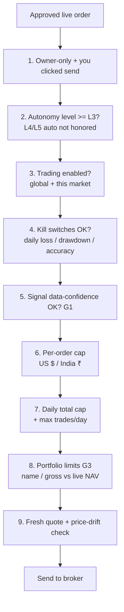

# Kairos — Risk & Safety
> Last updated: 2026-07-10
> Update this file when: any safety gate changes, the autonomy ladder changes, a new kill switch is added, account allowlist changes, or any order-flow gating logic changes.

---

## Overview

Every live order passes through 9 independent gates in sequence. Failure at any gate returns an error and the order is not sent. The gates are independent — disabling one does not bypass the others.

---

## Gate details

### Gate 1 — Owner-only + you clicked send

`requireOwner()` must pass on the API route. No agent can send a live order — they can only
propose. The owner must click "send" in the dashboard UI. There is no code path that sends a
live order without a human action.

### Gate 2 — Autonomy ladder

`strategy_config.autonomy_level` must be `L3_live_manual` or higher.

| Level | Name | What it allows |
|---|---|---|
| L1 | `paper_only` | No live orders possible |
| L2 | `live_supervised` | Live orders allowed but only with explicit user review |
| L3 | `live_manual` (default) | Live orders: owner must click send on every one |
| L4 | `live_small_auto` | Described in spec; `AUTONOMOUS_LIVE_ENABLED = false` in code → behaves like L3 |
| L5 | `scaled_auto` | Described in spec; also blocked by the same constant |

**`AUTONOMOUS_LIVE_ENABLED` is hardcoded `false` in `lib/autonomy.ts`.** L4 and L5 exist
as concepts for a possible future autonomous envelope but are not honored by any live code
path today. There is no config flag that enables them. This is a deliberate constant, not a
toggle.

### Gate 3 — Trading enabled

Both global `robinhood_mcp_enabled` (US) / `kite_enabled` (India) AND the per-account
`broker_accounts.enabled` must be true. If trading is disabled, the endpoint returns 409.

### Gate 4 — Kill switches

Auto-halt on:
- Daily loss exceeding threshold
- Drawdown from peak NAV
- Low 30-day win rate (below configured floor)

Each trip writes an `agent_alerts` row. Trading resumes only when the user manually clears
the halt — there is no auto-resume.

### Gate 5 — Signal data quality (G1)

A live BUY built on a signal with `data_confidence < 0.5` (low-evidence / partially missing
data) is refused unless you explicitly override. Prevents a thin-data score from driving a
real trade.

### Gate 6 — Per-order cap

Each live order is bounded by `broker_accounts.notional_cap_usd` (US) and the equivalent ₹
cap for India. Set in Settings → Live Order Limits.

### Gate 7 — Daily total cap + max trades/day

Cumulative daily buying enforced atomically (compare-and-set) so two fast clicks can't slip
past the cap. Both count limit and dollar limit are checked.

### Gate 8 — Portfolio concentration (G3)

Checks against the live account:
- US: live account snapshot (equity + positions via Robinhood MCP)
- India: Kite `/user/margins` (cash) + `/portfolio/holdings` (last_price × qty)

A BUY that over-concentrates (too much in one name or too much gross exposure) is refused.
**Fails closed if holdings are indeterminate** — if the live account state cannot be read,
the order is refused rather than assuming safe.

### Gate 9 — Price drift check

Fresh quote fetched immediately before order send. If the live price has drifted more than
the configured threshold from the signal price, the order is held and flagged for
reconciliation. Prevents stale signals from executing at materially worse prices.

---

## NAV drawdown circuit breaker

Implemented in PositionMonitor. If the weekly paper NAV return drops > 5%, PositionMonitor
automatically sets `strategy_config.app_paused = true` and fires a critical System Health
alert. While `app_paused = true`:
- No new paper trades open
- No live orders accepted
- Dashboard shows a critical banner

**Manual reset only** — no auto-resume. The user must investigate and re-enable via Settings.

---

## Kill switch: revoke at the broker

The ultimate kill switch is to revoke access at the broker level:
- **Robinhood:** revoke the OAuth token in Robinhood account settings
- **Kite:** revoke in Zerodha console

This works even if the Kairos app were compromised. Broker-level revocation is the last-resort
kill switch that operates independently of all app-level controls.

---

## Account allowlist

| Role label | Market | Broker | Allowed operations |
|---|---|---|---|
| Trading (read-only) | US | Robinhood | Read positions, equity, history. SELL signal evaluation. **Cannot place orders.** |
| Agentic (orders-only) | US | Robinhood | Place + cancel orders ONLY. No withdrawals. **Hard-wired as the only account for US order placement.** |
| India live | India | Zerodha Kite | Read real NSE/BSE holdings + place CNC delivery orders. Daily token refresh required. |

The agentic account allowlist is enforced in `lib/broker-resolver.ts`. Any attempt to route
an order to the trading (read-only) account returns a 403.

No account IDs, passwords, or credentials are stored in code. See `api_key_vault` for tokens.

---

## Trade proposals flow

TraderAgent creates `trade_proposals` rows with `status = 'pending'`. These auto-expire after
30 minutes (`expires_at = created_at + 30m`). The owner reviews and clicks "approve" or
"reject" in the dashboard. Approval triggers the full 9-gate safety ladder before the order
is sent to the broker.

There is no code path that bypasses the proposal flow for live orders.

---

## Append-only ledgers

These tables must never be hard-deleted by any agent, cron, cleanup job, or manual query:

| Table | Why it's protected |
|---|---|
| `paper_trades` | Financial ledger — P&L audit trail |
| `paper_order_events` | Event sourcing — DB trigger blocks UPDATE/DELETE |
| `decision_observations` | Learning fuel — every scored candidate ever |
| `broker_orders` | Live trade audit trail — immutable for reconciliation |
| `strategy_evaluations` | Evaluation history — DB trigger blocks UPDATE/DELETE |
| `evidence_records` | Immutable evidence — `payload_hash` UNIQUE prevents re-import |

The DB cleanup job (`/api/agents/db-cleanup`) explicitly skips all of these tables.

---

## Long-only rule (new positions)

SELL signals only apply to symbols that are **already held** in the paper or live portfolio.
New positions (opens) are **long-only**. This prevents short-selling new positions while
allowing orderly exit of held positions.

- Enforced in PaperTrader and TraderAgent.
- ResearchAgent generates SELL recommendations for holdings; these are not blocked.
- Attempting to open a new position with `direction = 'short'` is refused.

---

## Risk gate summary for quick reference

| Gate | Blocks when | Bypass |
|---|---|---|
| 1. Owner-only | Not authenticated as owner | None |
| 2. Autonomy ladder | `autonomy_level` below L3 or L4/L5 auto mode | None (L4/L5 hardcoded off) |
| 3. Trading enabled | Global toggle off or account disabled | Enable in Settings |
| 4. Kill switches | Daily loss / drawdown / accuracy thresholds tripped | Manual clear in Settings |
| 5. Data quality | `data_confidence < 0.5` | Explicit override checkbox |
| 6. Per-order cap | Order notional > account cap | Raise cap in Settings |
| 7. Daily cap | Daily cumulative or count exceeded | Waits until next day |
| 8. Concentration | Over-concentrated in name or gross | Reduce existing position first |
| 9. Price drift | Live price moved too far from signal price | Re-score signal (will expire and refresh) |
