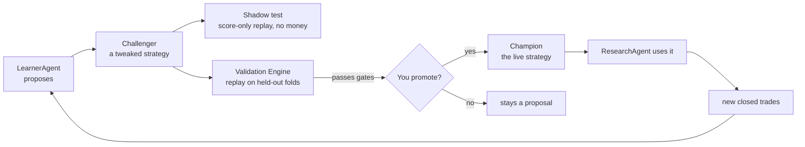
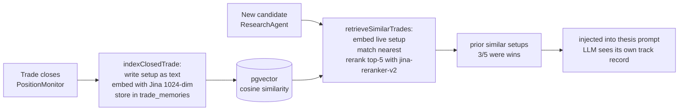

# Kairos — Learning Loop
> Last updated: 2026-07-11 (cross-sectional-rank genome param `entry.rank_pct_min`; PIT fundamentals ledger; historical replay harness — all OFF by default)
> Update this file when: the learning flow changes, new guardrails are added to weight mutation, genome parameters change, Phase 1 unlocks, the RAG pipeline changes, or Performance Truth Layer evaluation logic changes.

---

## The big picture

The loop is:
1. ResearchAgent scores stocks using the current **Champion** strategy's weights + genome.
2. PaperTrader acts on high-score signals. PositionMonitor watches and exits positions.
3. Closed trades become training data for **LearnerAgent**.
4. LearnerAgent proposes a **Challenger** strategy with adjusted weights + genome.
5. The **Validation Engine** replays the Challenger on held-out data.
6. If the Challenger passes, you promote it to Champion. ResearchAgent uses the new weights
   on its very next run.

---

## Champion and Challenger

### `strategy_versions` table (governance)

One row per strategy version. At most one `is_champion = true` per market at any time.

| Field | Meaning |
|---|---|
| `market` | `us` or `india` — markets evolve independently |
| `is_champion` | True for the one active strategy per market |
| `weights_snapshot` | 5-dim weights that ResearchAgent reads |
| `genome` | Trading parameters (see below) |
| `proposed_by` | `learner` or `user` |
| `backtest_result` | Sharpe, Sortino, win_rate, max_dd from Validation Engine |
| `promoted_at` | Set when you click "Promote to Champion" |

### The genome

What a Challenger can evolve:

| Parameter | Range / options | Notes |
|---|---|---|
| `entry_threshold` | 50–90 | `analyst_score` cutoff to open a position |
| `exit_stop_pct` | 3–15% | Stop-loss percentage below entry |
| `exit_target_pct` | 10–40% | Price target percentage above entry |
| `horizon_days` | 3–30 | Time-stop maximum hold days |
| `position_size_pct` | Up to `strategy_config.position_size_pct` | Can only size DOWN, never above the owner-set cap |
| `sizing_mode` | `fixed` \| `kelly` \| `confidence_scaled` | How position size is calculated |
| `entry.rank_pct_min` | 0.0–0.95 | **Default 0.0 = OFF (feature no-op).** Minimum within-comparable-group percentile for a NEW long. Hybrid gate: entry requires `analyst_score ≥ score_threshold` **AND** `rank_pct ≥ rank_pct_min`. `0.0` reproduces current selection byte-for-byte. Rank gates cross-group *admission* only; intra-group ordering stays by `analyst_score` (rank is monotonic in score within a group), so the CLAUDE.md "top-3 by analyst_score win" rule is preserved. Becomes active only via a validated, owner-promoted challenger. |
| 5 dimension weights | Sum must = 1.0 | `{fundamental, technical, sentiment, macro, insider}` |

### Per-market independence

`strategy_versions` has a `market` column. LearnerAgent analyzes one market's cohort per run
and proposes challengers only for that market. A bad India run cannot shift US scoring weights.
India starts on a clone of the US champion as a prior and diverges once it clears the same
10+ closed-trade phase gate.

---

## LearnerAgent details

**File:** `app/api/agents/learner/route.ts`, `app/api/agents/learner-brain/route.ts`
**Schedule:** Fridays 5:00 PM ET
**LLM:** Claude Opus 4.8 (`claude-opus`)

### Phase gate

Weight mutation is **blocked entirely** until 10+ closed trades per market exist (`Phase 0`).
LearnerAgent runs but only writes a "mutation blocked: insufficient trades" note to
`learning_log`. Phase 1 (mutation unlocked) requires the owner to verify the trade set and
acknowledge the gate has been cleared.

### Tool-use loop (9 tools)

LearnerAgent runs a multi-step tool-calling loop (via `runAgentLoop()`). The 9 tools it has:

1. `get_closed_trades` — recent paper_trades with outcomes
2. `get_signal_weights` — current champion weights
3. `get_strategy_versions` — all challengers + their backtest results
4. `get_decision_observations` — scored decisions (including skipped)
5. `query_trade_decisions` — real historical enriched Robinhood trades by regime/action
6. `propose_challenger` — write a new `strategy_versions` row with new weights + genome
7. `run_validation` — trigger Validation Engine on the proposed challenger
8. `get_mentor_insights` — recent coaching notes from MentorAgent
9. `semantic_search_decisions` — pgvector RAG over trade memories (if Jina key present)

### Auto-guard

In addition to the phase gate, LearnerAgent blocks mutation if the last 3 runs have
`win_rate < 35%`. This prevents a losing streak from producing an overfit Challenger.

### Per-trade notes

After each trade closes, LearnerAgent writes a 1-sentence outcome summary to `learning_log`.
This is separate from weight mutation — it runs regardless of the phase gate.

---

## Validation Engine

**File:** `lib/validators/backtest.ts`, `app/api/agents/backtest/route.ts`

**Deterministic, no LLM.** Replays a Challenger vs the current Champion on walk-forward
held-out slices of the `decision_observations` ledger.

### Eligibility gates (same for US and India)

| Gate | Threshold |
|---|---|
| Sharpe | ≥ 0.5 |
| Win rate | ≥ 40% |

If both gates pass, `eligibility_passed = true` is set on the `experiment_runs` row.

**Promotion is blocked (HTTP 412)** unless `eligibility_passed = true`. The owner cannot
click "Promote" without the Validation Engine having run and passed.

### Metrics computed

- Sharpe ratio
- Sortino ratio
- Maximum drawdown
- Win rate
- Expectancy
- Alpha vs benchmark

### Walk-forward design

The Validation Engine splits historical data by time, scoring the Challenger only on data
it could not have seen when it was proposed. This prevents in-sample overfitting from
looking like genuine improvement.

### Calibration OOS acceptance gate

`lib/validation/calibration.ts` fits the `pwin_logistic` artifact from walk-forward
folds (chronological, purged/embargoed). `acceptCalibrationOOS` computes the
Expected Calibration Error (ECE) over the **out-of-sample holdout only** and is
**fail-closed**: a model is rejected (`accepted: false`) when the holdout has
<30 usable rows, is degenerate (all-win/all-loss or non-finite ECE), or ECE > 0.1.
`fitAndStoreCalibration` gates the artifact upsert on this verdict — a miscalibrated
model is never written to the live `pwin_logistic` artifact, so the money path never
reads a bad P(win). `MIN_OOS_SAMPLES=30` and `MAX_OOS_ECE=0.1` are v0 thresholds
needing prospective tuning.

---

## Shadow decisions

A Challenger can be set to "shadow" real runs: it records what it *would have done* on every
stock with no fills and no cash. This is a free dress rehearsal — the Challenger accrues a
simulated track record before any promotion decision. Off by default. Activated per Challenger
in the Strategy Registry.

---

## Feature Registry

LearnerAgent can also propose a **new formula idea** — a new factor to incorporate into
scoring. This is written as a human-readable spec with a falsification test. The formula is
**never run as arbitrary code** — it is only interpreted through a locked, whitelisted math
grammar. AI cannot write executable scoring code directly.

---

## Cross-sectional rank (measure-only → gate, OFF by default)

**Files:** `lib/scoring/rank.ts` (`computeComparableRank`, `isRankRejected`), `app/api/agents/research/cron/route.ts` (Pass 2), `lib/validation/genome.ts` (`entry.rank_pct_min`). **Spec:** `features/cross-sectional-rank/FEATURE_ARCHITECTURE.md`.

A deterministic (no-LLM) **second pass** in the research cron, after all symbols score and before PaperTrader. It partitions the eligible pool into comparable groups (market × asset-type × sector), computes each name's within-group empirical percentile (`rank_pct`), and — **only when the champion genome's `entry.rank_pct_min > 0`** — flips rank-losing NEW candidates in `agent_signals` to `status='rank_rejected'`. Data-quality gates run before ranking (thin evidence, abstain, evidence-confidence floor, held-position exclusion); groups below their min-sample threshold (US equity 20, India equity 15, ETF 20) fall back to a fixed `degraded` transform — the "three finalists are not a universe" guard. ETFs are never grouped with single-name equities. Provenance is written to `universe_snapshot_scores` (`rank_quality`, `comparable_group_key`, `group_n`, `rank_eligible`).

**Resolved (2026-07-11):** the CLAUDE.md "top-3 by analyst_score win" rule is preserved — rank gates *cross-group admission* only; `rank_pct` is monotonic in `analyst_score` within a group so intra-group ordering is unchanged, and under today's single-group degraded case rank and raw-score selection are identical. Ships OFF (`rank_pct_min` default 0.0 → byte-stable selection); actionable only through a validated, owner-promoted challenger. Rank is **not** fed into the live P(win)/sizing model — logged as a feature for IC measurement only.

## PIT fundamentals ledger (OFF by default)

**Files:** `lib/data/pit-fundamentals.ts` (`getFundamentalsAsOf`, `captureFundamentalsFact`), capture hook in `lib/research-agent.ts`. **Table:** `fundamental_facts` (migration 150). **Spec:** `features/pit-fundamentals/FEATURE_ARCHITECTURE.md`.

Restatement-safe append-only vintage archive: fundamentals are captured on fetch (fire-and-forget, fail-open, dedup by `payload_hash`) so "fundamentals as known on date D" is reconstructable and a later restatement can never retroactively change a past as-of read. Not yet wired into live scoring — `scoreFundamentals` is unchanged and default scores are byte-identical. Purpose: give the Validation Engine and any future walk-forward replay a leak-free fundamentals source.

## Historical replay harness (measure-only, OFF)

**Files:** `lib/replay/*` (sealed accessor + `FutureDataLeakError`, packet assembler, gates, reporter). **Tables:** `replay_packets`, `replay_packet_items`, `replay_eligibility_runs`, `replay_eligibility_events` (migration 149). **Spec:** `features/historical-replay-harness/FEATURE_ARCHITECTURE.md`.

An offline harness that freezes point-in-time input packets (`knowable_at <= as_of` enforced by a sealed data accessor that throws on any post-cursor datum) and replays the eligibility gates (`calibration_oos`, `thin_evidence`, `ic`, `validation`, `breakdown_veto`) to answer "on what date would this strategy first have been eligible?" (`first_eligible_asof = MIN(as_of) WHERE passed`). Reuses the live gate code (`fitCalibration` → `walkForwardFolds` → `acceptCalibrationOOS`, `computeWeightedAnalystScore`, `isThinEvidence`) unchanged so a replay grades on the identical rule that would run live. Runs on in-memory fixtures today; the migration-149 tables persist runs when wired.

## Performance Truth Layer

**File:** `lib/evaluation/run-evaluation.ts`, `/api/agents/evaluation/*`
**Panel:** `/dashboard/learning`

Mandate-aware, deterministic (no LLM), honesty-first evaluation.

### Investment mandates

Named strategy contexts. Default mandates:
- "Swing US 2-20d" (benchmark: VOO)
- "Swing India 2-20d" (benchmark: ^NSEI)

Every `agent_signals`, `paper_trades`, and `decision_observations` row gets a `mandate_id`
stamped at creation time.

### Evaluation metrics

| Metric | Notes |
|---|---|
| Sharpe | Risk-adjusted return |
| Sortino | Downside deviation only |
| Max drawdown | Worst peak-to-trough |
| Win rate | % of trades that closed positive |
| Expectancy | Average expected profit per trade |
| Profit factor | Gross profit / gross loss |
| Alpha | vs benchmark (VOO/^NSEI) |
| Execution slip | Mean realized vs 0.05% modeled slippage |

### Honesty rules

- **Fewer than 20 trades** → shows `insufficient_sample` instead of a number. No fabricated precision on tiny samples.
- **Tainted trades** (low `data_confidence`) are **counted** here — the book moved, so P&L must not hide them. They are labeled as tainted but included in the totals.
- `health_label` summarizes the overall picture:
  - `insufficient_sample` → not enough data to say anything
  - `negative_or_zero_edge` → strategy has no positive edge
  - `promising_but_unvalidated` → positive metrics but not yet through Validation Engine
  - `validation_required` → ready for formal promotion decision

### P1 gate

A weekly Vercel cron counts closed evaluable trades per market. When ≥ 20 accumulate, it
fires a System Health `info` alert: `p1-gate-ready:<market>`. This is the signal to build
opportunity-level IC metrics (`decision_observations × observation_labels`).

P0 is book-truth only. The `opp_*` columns in `strategy_evaluations` are null until P1.

---

## RAG trade memory pipeline

### Write side — `indexClosedTrade()`

- Triggered on every trade close (PositionMonitor + LearnerAgent exits)
- Builds a short text: symbol, market, 5 dimension scores, outcome, exit reason, mandate
- Embeds via Jina AI `jina-embeddings-v3` (1024-dim)
- Stores in `trade_memories` (pgvector table in Supabase)
- **Tainted / excluded trades are skipped** — bad-data history cannot poison memory

### Read side — `retrieveSimilarTrades()`

- Called by ResearchAgent before scoring each candidate
- Fingerprints the live setup as text, embeds with Jina
- Queries pgvector nearest-neighbor (cosine, IVFFlat index) for top-K candidates
- Reranks with Jina `jina-reranker-v2-base-multilingual` to pick genuinely similar past setups
- Returns a one-line summary: *"prior similar setups: 3/5 were wins"*
- Writes a `rag_traces` row for audit

### Guardrails

- Ticker filter: a retrieved chunk that doesn't mention the candidate symbol is dropped
- Whole path is **off when `JINA_API_KEY` is absent** — no key → silent no-op
- Does NOT move money or change weights. Advisory context only.

---

## Signal weights

### Current weights (live)

Stored in `learning_priors` table (one row per dimension). Also reflected in the Champion
`strategy_versions.weights_snapshot`. ResearchAgent reads Champion weights first; falls back to
`learning_priors` → `signal_weights` if no champion exists.

### Weight change audit

Every weight change is logged to both `learning_priors_history` (all dimension history) and
`signal_weights_history` (rollback source). These are never purged by the cleanup job.

### Learner config

`learner_config` table controls per-dimension mutation:
- `learn_from = false` → exclude this dimension from LearnerAgent analysis
- `allow_mutation = false` → LearnerAgent cannot propose weight changes for this dimension

These are toggled via `/api/agents/learner-controls`.
