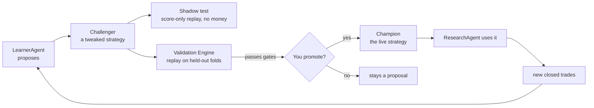
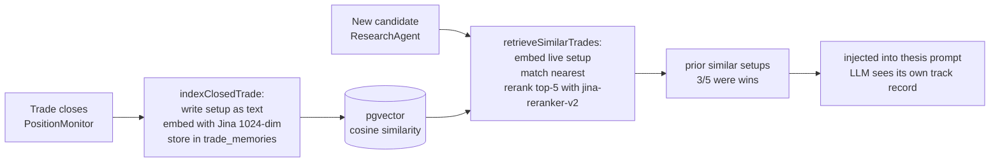

# Kairos — Learning Loop
> **2026-07-28 correction — PROMOTION REMAINS DORMANT, NOT PERMANENTLY CLOSED.** The h5 study measured pooled IC sigma ~0.27 and found no useful `mom_12_1` signal at h5 (mean IC 0.0089, t_HAC 0.32). It did **not** identify an effective breadth of 17: observed IC variance mixes sampling noise, changing point-in-time membership/coverage, and genuine time variation in factor returns. Inverting it with `1/sqrt(n-3)` cannot separate those causes, and an h5 estimate cannot set h20 requirements. The n=400 and sector-neutral tests therefore remain legitimate measure-only experiments rather than rejected escape routes. `POST /api/agents/backtest/promote` still fails closed; no policy can consume these diagnostics.
> **PROMOTION IS DORMANT (2026-07-27).** `POST /api/agents/backtest/promote` fails closed with `promotion_evidence_not_oos` (503) before any write. Adversarial review found one P0 and three P1 issues that each independently disqualify the current path: promotion is non-atomic (supersede-then-insert can leave a segment with no active policy); the evidence is not out-of-sample (~98.4% window overlap AND a current-liquid universe replayed through past dates — survivorship bias that more weekly runs cannot fix); `dsr_z` was not a Deflated Sharpe Ratio and is renamed `t_margin_vs_trials`, with the `dsr` column now written NULL; and experiment lineage is optional and unbound to the edge/market/horizon/segment it justifies. Re-enable only after `features/walk-forward-ic-folds/FEATURE_ARCHITECTURE.md` is approved and shipped: frozen experiment lineage → PIT universe/inputs → purged market-session OOS folds → aggregate HAC IC → multiple-testing + cost-adjusted validation → atomic promotion RPC.
> Last updated: 2026-07-27. The deterministic promotion route is implemented
> but is governance scaffolding only: production has zero policies, its rolling
> IC windows are not OOS, its current-universe history is not PIT, its
> trial-adjusted t margin is not DSR, and supersede/insert is not atomic. The
> revised `features/walk-forward-ic-folds/FEATURE_ARCHITECTURE.md` is a blocking
> prerequisite before policy promotion or consumption.
> Update this file when: the learning flow changes, new guardrails are added to weight mutation, genome parameters change, Phase 1 unlocks, the RAG pipeline changes, or Performance Truth Layer evaluation logic changes.

---

## The big picture

The loop is:
1. ResearchAgent scores stocks using the current **Champion** strategy's weights + genome.
2. PaperTrader acts on high-score signals. PositionMonitor watches and exits positions.
3. Closed trades become training data for **LearnerAgent**.
4. LearnerAgent proposes a **Challenger** strategy with adjusted weights + genome.
5. The **Validation Engine** replays the Challenger on held-out data.
6. If the Challenger passes, you promote it to Champion. ResearchAgent uses the new weights
   on its very next run.

### Benchmark-alpha scorecard boundary (2026-07-13)

`/api/agents/benchmark-scorecard` writes Phase-1 measurement rows to
`benchmark_scorecard` for paper/live, US/India, and 1W/1M/3M/YTD/1Y horizons.
The math uses common-window rebasing and annualized daily information ratio.
These rows are displayed in Performance Truth and may be read as evidence, but
they do **not** change LearnerAgent objectives, promotion gates, posture, sizing,
paper fills, or live orders in Phase 1. Phase 2 learner/promotion wiring still
requires a separate owner-approved implementation.

---

## Champion and Challenger

### `strategy_versions` table (governance)

One row per strategy version. At most one `is_champion = true` per market at any time.

| Field | Meaning |
|---|---|
| `market` | `us` or `india` — markets evolve independently |
| `is_champion` | True for the one active strategy per market |
| `weights_snapshot` | 5-dim weights that ResearchAgent reads |
| `genome` | Trading parameters (see below) |
| `proposed_by` | `learner` or `user` |
| `backtest_result` | Sharpe, Sortino, win_rate, max_dd from Validation Engine |
| `promoted_at` | Set when you click "Promote to Champion" |

### The genome

What a Challenger can evolve:

| Parameter | Range / options | Notes |
|---|---|---|
| `entry_threshold` | 50–90 | `analyst_score` cutoff to open a position |
| `exit_stop_pct` | 3–15% | Stop-loss percentage below entry |
| `exit_target_pct` | 10–40% | Price target percentage above entry |
| `horizon_days` | 3–30 | Time-stop maximum hold days |
| `position_size_pct` | Up to `strategy_config.position_size_pct` | Can only size DOWN, never above the owner-set cap |
| `sizing_mode` | `fixed` \| `kelly` \| `confidence_scaled` | How position size is calculated |
| `entry.rank_pct_min` | 0.0–0.95 | **Default 0.0 = OFF (feature no-op).** Minimum within-comparable-group percentile for a NEW long. Hybrid gate: entry requires `analyst_score ≥ score_threshold` **AND** `rank_pct ≥ rank_pct_min`. `0.0` reproduces current selection byte-for-byte. Rank gates cross-group *admission* only; intra-group ordering stays by `analyst_score` (rank is monotonic in score within a group), so the CLAUDE.md "top-3 by analyst_score win" rule is preserved. Becomes active only via a validated, owner-promoted challenger. |
| 5 dimension weights | Sum must = 1.0 | `{fundamental, technical, sentiment, macro, insider}` |

### Per-market independence

`strategy_versions` has a `market` column. LearnerAgent analyzes one market's cohort per run
and proposes challengers only for that market. A bad India run cannot shift US scoring weights.
India starts on a clone of the US champion as a prior and diverges once it clears the same
10+ closed-trade phase gate.

---

## LearnerAgent details

**File:** `app/api/agents/learner/route.ts`, `app/api/agents/learner-brain/route.ts`
**Schedule:** Fridays 5:00 PM ET
**LLM:** Claude Opus 4.8 (`claude-opus`)

### Phase gate

Weight mutation is **blocked entirely** until 10+ closed trades per market exist (`Phase 0`).
LearnerAgent runs but only writes a "mutation blocked: insufficient trades" note to
`learning_log`. Phase 1 (mutation unlocked) requires the owner to verify the trade set and
acknowledge the gate has been cleared.

**Run-accounting convention:** A LearnerAgent run may reconcile dangling orphan trade rows as
maintenance. Its run summary reports that count separately from the market-local total
closed-trade corpus (`Reconciled … | Total closed: …`); zero reconciliations never means zero
learning data.

### OPEN ITEM (2026-07-16): India macro contamination in the historical trade set — NOT yet remediated

Until 2026-07-16, India signals were scored with the **US** macro regime (`macro_regime` has no
`market` column) and, on 2026-07-13, with a **fortnight-stale** `green` verdict that was really a
failed MacroSentinel run (`raw_indicators = []`). `lib/data/scores.ts` now excludes macro for India
and age-bounds the row — but **the historical rows already written are still contaminated.**

Measured in prod on 2026-07-16 (entry signal joined to `signal_score_history`):

| India paper_trades | Count |
|---|---|
| Closed, entered on a macro-contaminated score | **4** (2 via stale-green `macro_score=100`, 2 via US-orange `macro_score=60`) |
| Closed, clean (macro already excluded) | 3 |
| Open, entered on a macro-contaminated score | **13** (3 stale-green, 10 US-orange) |
| Open, clean | 2 |

**Why this is not yet urgent:** the mutation gate is 10+ closed trades **per market**; India has 7
closed. The learner is still Phase 0 for India, so no contaminated trade has driven a weight
mutation yet. The 13 contaminated **open** positions will close into this set, though — so the
record should be corrected *before* India reaches 10.

**Proposal (owner decision — deliberately NOT applied, no rows were mutated):** flag rather than
delete. The taint vehicle already exists (`paper_trades.tainted`, `taint_reason`,
`excluded_from_learning`; filter in `lib/learning/taint-filter.ts`), so no migration is needed —
set `tainted = true`, `taint_reason = 'macro_regime_market_leak'` on the affected rows.
`applyLearningTaintFilter` then drops them from learning and from the RAG memory corpus, while
`run-evaluation.ts` still **counts** them in P&L (the book really moved — see "Tainted trades" under
Performance Truth). Note the flag is coarse: it removes the whole trade from learning, not just its
macro dimension. Given India's small n, the honest alternative — accept a smaller-but-clean India
trade set — is preferable to learning from a US-Fed-scored Indian book.

### Tool-use loop (9 tools)

LearnerAgent runs a multi-step tool-calling loop (via `runAgentLoop()`). The 9 tools it has:

1. `get_closed_trades` — recent paper_trades with outcomes
2. `get_signal_weights` — current champion weights
3. `get_strategy_versions` — all challengers + their backtest results
4. `get_decision_observations` — scored decisions (including skipped)
5. `query_trade_decisions` — real historical enriched Robinhood trades by regime/action
6. `propose_challenger` — write a new `strategy_versions` row with new weights + genome
7. `run_validation` — trigger Validation Engine on the proposed challenger
8. `get_mentor_insights` — recent coaching notes from MentorAgent
9. `semantic_search_decisions` — pgvector RAG over trade memories (if Jina key present)

### Automatic validation & shadow routing (migration 170)

When LearnerAgent creates a challenger it runs `runAutomatedValidation()`
(`lib/validation/automation.ts`) **in-process** — this replaced the earlier
fire-and-forget localhost request, which was unreliable on cloud cron. The flow,
gated by the per-market `strategy_validation_automation` policy (fail-closed:
missing row / read error = fully disabled):

1. Policy `enabled=false` → return immediately, no validation (challenger still
   exists and can be validated manually).
2. Else run the deterministic **Validation Engine** (`validateChallenger`), which
   writes a `validation_experiments` row (pass or fail) exactly as the on-demand
   Validate button does.
3. If it **passed** AND `auto_shadow_enabled=true` → call the
   `activate_strategy_shadow(p_version_id)` RPC, which atomically routes the
   challenger to `state='shadow_paper'` under a per-market advisory lock and a
   `max_active_shadows` (0–1) capacity cap.

The **only** automatic lifecycle transition is → `shadow_paper` (non-executing:
records what it *would* decide, no fills/cash — see the Shadow section). It can
**never** promote a champion, create a paper fill, move cash, make a broker
proposal, or place a live order. Champion promotion stays the separate owner-only
path and remains fail-closed on a PASSED `validation_experiments` row.

A Friday cloud recovery cron — **`kairos-validation-sweep`, 21:45 UTC** (POST
`/api/validation/sweep`) — validates up to 5 never-validated challengers per
market (`state='challenger'`, `validation_experiment_id IS NULL`) through the same
path, catching challengers created outside LearnerAgent or interrupted before
in-process validation completed. Owner controls both switches per market in
**Settings → Automatic Strategy Validation** (`GET`/`PATCH
/api/settings/validation-automation`); disabling preserves every challenger,
experiment, and shadow. Feature spec: `features/automated-strategy-validation/`.

### Auto-guard

In addition to the phase gate, LearnerAgent blocks mutation if the last 3 runs have
`win_rate < 35%`. This prevents a losing streak from producing an overfit Challenger.

### Per-trade notes

After each trade closes, LearnerAgent writes a 1-sentence outcome summary to `learning_log`.
This is separate from weight mutation — it runs regardless of the phase gate.

---

## Validation Engine

**File:** `lib/validators/backtest.ts`, `app/api/agents/backtest/route.ts`

**Deterministic, no LLM.** Replays a Challenger vs the current Champion on walk-forward
held-out slices of the `decision_observations` ledger.

### ATR exit-policy evidence (measure-only)

Nightly label maturation also records point-in-time entry ATR, ATR-normalized
MAE/MFE, and three predeclared `close_observed_v1` exit-policy outcomes. The
simulation uses completed daily closes and the standard 10 bps haircut, so it
does not infer intraday fills from daily OHLC ranges. The authenticated
`/api/analytics/atr-exit-evidence` report is strictly market- and horizon-local.
Its `reviewable_evidence` status requires at least 60 labels and 12 effective
observations, but is not a promotion gate and cannot change PaperTrader,
PositionMonitor, live orders, or broker protection. Purged walk-forward and
paper shadow approval remain mandatory before any execution-policy proposal.

### Eligibility gates (same for US and India)

| Gate | Threshold |
|---|---|
| Sharpe | ≥ 0.5 |
| Win rate | ≥ 40% |

If both gates pass, `eligibility_passed = true` is set on the `experiment_runs` row.

**Promotion is blocked (HTTP 412)** unless `eligibility_passed = true`. The owner cannot
click "Promote" without the Validation Engine having run and passed.

### Metrics computed

- Sharpe ratio
- Sortino ratio
- Maximum drawdown
- Win rate
- Expectancy
- Alpha vs benchmark

### Walk-forward design

The Validation Engine splits historical data by time, scoring the Challenger only on data
it could not have seen when it was proposed. This prevents in-sample overfitting from
looking like genuine improvement.

### Calibration OOS acceptance gate

`lib/validation/calibration.ts` fits the `pwin_logistic` artifact from walk-forward
folds (chronological, purged/embargoed). `acceptCalibrationOOS` computes the
Expected Calibration Error (ECE) over the **out-of-sample holdout only** and is
**fail-closed**: a model is rejected (`accepted: false`) when the holdout has
<30 usable rows, is degenerate (all-win/all-loss or non-finite ECE), or ECE > 0.1.
`fitAndStoreCalibration` gates the artifact upsert on this verdict — a miscalibrated
model is never written to the live `pwin_logistic` artifact, so the money path never
reads a bad P(win). `MIN_OOS_SAMPLES=30` and `MAX_OOS_ECE=0.1` are v0 thresholds
needing prospective tuning.

---

## Shadow decisions

A Challenger can be set to "shadow" real runs: it records what it *would have done* on every
stock with no fills and no cash. This is a free dress rehearsal — the Challenger accrues a
simulated track record before any promotion decision. Off by default. Activated per Challenger
in the Strategy Registry.

---

## Feature Registry

LearnerAgent can also propose a **new formula idea** — a new factor to incorporate into
scoring. This is written as a human-readable spec with a falsification test. The formula is
**never run as arbitrary code** — it is only interpreted through a locked, whitelisted math
grammar. AI cannot write executable scoring code directly.

---

## Cross-sectional rank (measure-only → gate, OFF by default)

**Files:** `lib/scoring/rank.ts` (`computeComparableRank`, `isRankRejected`), `app/api/agents/research/cron/route.ts` (Pass 2), `lib/validation/genome.ts` (`entry.rank_pct_min`). **Spec:** `features/cross-sectional-rank/FEATURE_ARCHITECTURE.md`.

A deterministic (no-LLM) **second pass** in the research cron, after all symbols score and before PaperTrader. It partitions the eligible pool into comparable groups (market × asset-type × sector), computes each name's within-group empirical percentile (`rank_pct`), and — **only when the champion genome's `entry.rank_pct_min > 0`** — flips rank-losing NEW candidates in `agent_signals` to `status='rank_rejected'`. Data-quality gates run before ranking (thin evidence, abstain, evidence-confidence floor, held-position exclusion); groups below their min-sample threshold (US equity 20, India equity 15, ETF 20) fall back to a fixed `degraded` transform — the "three finalists are not a universe" guard. ETFs are never grouped with single-name equities. Provenance is written to `universe_snapshot_scores` (`rank_quality`, `comparable_group_key`, `group_n`, `rank_eligible`).

**Resolved (2026-07-11):** the CLAUDE.md "top-3 by analyst_score win" rule is preserved — rank gates *cross-group admission* only; `rank_pct` is monotonic in `analyst_score` within a group so intra-group ordering is unchanged, and under today's single-group degraded case rank and raw-score selection are identical. Ships OFF (`rank_pct_min` default 0.0 → byte-stable selection); actionable only through a validated, owner-promoted challenger. Rank is **not** fed into the live P(win)/sizing model — logged as a feature for IC measurement only.

## PIT fundamentals ledger (OFF by default)

**Files:** `lib/data/pit-fundamentals.ts` (`getFundamentalsAsOf`, `captureFundamentalsFact`), capture hook in `lib/research-agent.ts`. **Table:** `fundamental_facts` (migration 150). **Spec:** `features/pit-fundamentals/FEATURE_ARCHITECTURE.md`.

Restatement-safe append-only vintage archive: fundamentals are captured on fetch (fire-and-forget, fail-open, dedup by `payload_hash`) so "fundamentals as known on date D" is reconstructable and a later restatement can never retroactively change a past as-of read. Not yet wired into live scoring — `scoreFundamentals` is unchanged and default scores are byte-identical. Purpose: give the Validation Engine and any future walk-forward replay a leak-free fundamentals source.

## Historical replay harness (measure-only, OFF)

**Files:** `lib/replay/*` (sealed accessor + `FutureDataLeakError`, packet assembler, gates, reporter). **Tables:** `replay_packets`, `replay_packet_items`, `replay_eligibility_runs`, `replay_eligibility_events` (migration 149). **Spec:** `features/historical-replay-harness/FEATURE_ARCHITECTURE.md`.

An offline harness that freezes point-in-time input packets (`knowable_at <= as_of` enforced by a sealed data accessor that throws on any post-cursor datum) and replays the eligibility gates (`calibration_oos`, `thin_evidence`, `ic`, `validation`, `breakdown_veto`) to answer "on what date would this strategy first have been eligible?" (`first_eligible_asof = MIN(as_of) WHERE passed`). Reuses the live gate code (`fitCalibration` → `walkForwardFolds` → `acceptCalibrationOOS`, `computeWeightedAnalystScore`, `isThinEvidence`) unchanged so a replay grades on the identical rule that would run live. Runs on in-memory fixtures today; the migration-149 tables persist runs when wired.

## Performance Truth Layer

**File:** `lib/evaluation/run-evaluation.ts`, `/api/agents/evaluation/*`
**Panel:** `/dashboard/learning`

Mandate-aware, deterministic (no LLM), honesty-first evaluation.

### Investment mandates

Named strategy contexts. Default mandates:
- "Swing US 2-20d" (benchmark: VOO)
- "Swing India 2-20d" (benchmark: ^NSEI)

Every `agent_signals`, `paper_trades`, and `decision_observations` row gets a `mandate_id`
stamped at creation time.

Future `decision_observations` also carry the actual scoring-candle close and a
deterministic indicative trade-plan snapshot. This improves point-in-time label
truth and lets Research Journal explain approximate entry/risk/target context.
Execution does not consume stale absolute research prices: PaperTrader resolves
the current bounded policy and anchors prices to the fill, while PositionMonitor
continues to own the stored position's exits.

### Evaluation metrics

| Metric | Notes |
|---|---|
| Sharpe | Risk-adjusted return |
| Sortino | Downside deviation only |
| Max drawdown | Worst peak-to-trough |
| Win rate | % of trades that closed positive |
| Expectancy | Average expected profit per trade |
| Profit factor | Gross profit / gross loss |
| Alpha | vs benchmark (VOO/^NSEI) |
| Execution slip | Mean realized vs 0.05% modeled slippage |

### Honesty rules

- **Fewer than 20 trades** → shows `insufficient_sample` instead of a number. No fabricated precision on tiny samples.
- **Tainted trades** (low `data_confidence`) are **counted** here — the book moved, so P&L must not hide them. They are labeled as tainted but included in the totals.
- `health_label` summarizes the overall picture:
  - `insufficient_sample` → not enough data to say anything
  - `negative_or_zero_edge` → strategy has no positive edge
  - `promising_but_unvalidated` → positive metrics but not yet through Validation Engine
  - `validation_required` → ready for formal promotion decision

### P1 gate

A weekly Vercel cron counts closed evaluable trades per market. When ≥ 20 accumulate, it
fires a System Health `info` alert: `p1-gate-ready:<market>`. This is the signal to build
opportunity-level IC metrics (`decision_observations × observation_labels`).

P0 is book-truth only. The `opp_*` columns in `strategy_evaluations` are null until P1.

---

## RAG trade memory pipeline

### Write side — `indexClosedTrade()`

- Triggered on every trade close (PositionMonitor + LearnerAgent exits)
- Builds a short text: symbol, market, 5 dimension scores, outcome, exit reason, mandate
- Embeds via Jina AI `jina-embeddings-v3` (1024-dim)
- Stores in `trade_memories` (pgvector table in Supabase)
- **Tainted / excluded trades are skipped** — bad-data history cannot poison memory

### Read side — `retrieveSimilarTrades()`

- Called by ResearchAgent before scoring each candidate
- Fingerprints the live setup as text, embeds with Jina
- Queries pgvector nearest-neighbor (cosine, IVFFlat index) for top-K candidates
- Reranks with Jina `jina-reranker-v2-base-multilingual` to pick genuinely similar past setups
- Returns a one-line summary: *"prior similar setups: 3/5 were wins"*
- Writes a `rag_traces` row for audit

### Guardrails

- Ticker filter: a retrieved chunk that doesn't mention the candidate symbol is dropped
- Whole path is **off when `JINA_API_KEY` is absent** — no key → silent no-op
- Does NOT move money or change weights. Advisory context only.

---

## Signal weights

### Current weights (live)

Stored in `learning_priors` table (one row per dimension). Also reflected in the Champion
`strategy_versions.weights_snapshot`. ResearchAgent reads Champion weights first; falls back to
`learning_priors` → `signal_weights` if no champion exists.

### Weight change audit

Every weight change is logged to both `learning_priors_history` (all dimension history) and
`signal_weights_history` (rollback source). These are never purged by the cleanup job.

### Learner config

`learner_config` table controls per-dimension mutation:
- `learn_from = false` → exclude this dimension from LearnerAgent analysis
- `allow_mutation = false` → LearnerAgent cannot propose weight changes for this dimension

These are toggled via `/api/agents/learner-controls`.

---

## Promotion gate (deterministic)

The path from "this edge measures well" to "this edge is policy" runs through
`lib/gates/promotion-gate.ts` and `POST /api/agents/backtest/promote`. It is the
**only** writer to `strategy_policies`, and there is no LLM anywhere on it — the
LLM's role ends at proposing a bounded hypothesis into `backtest_experiments`.
`strategy_policies.promoted_by` is CHECK-constrained to `'deterministic_gate'`, so
that boundary is enforced by the database rather than by convention.

<!-- Superseded 2026-07-27 promotion-gate description retained in git history only.
### Inputs

- `edge_ic_history` rows for one `edge_id` + `market`, scoped to the requested
  segment (`sector` → `segment_type='sector'`, `regime` → `segment_type='regime'`,
  neither → market-wide rows where `segment_type is null`) and to the horizon band
  `[horizon_days_min, horizon_days_max]`.
- `backtest_experiments.variants_run` when an `experiment_id` is supplied. Absent
  one, the gate assumes a single trial — the least punitive assumption, so the
  other gates have to carry the decision.

### The four gates

| Gate | Rule | Why |
|---|---|---|
| Window count | ≥ 3 IC windows | Below this there is no walk-forward to speak of; returns `insufficient_windows` without evaluating anything else. |
| IC floor | latest window IC ≥ 0.02 | Matches `classifyEdgeIC` in `lib/edges/ic.ts`. A decayed edge does not get promoted on its history. |
| t-stat | **latest window's** Newey-West t ≥ 2.0 | Newey-West because overlapping forward-return windows make naive IID t-stats overstate significance. Latest — not max — see "Which t-stat" below. |
| DSR | `t_best − E[max t over S trials] > 0` | Bailey 2014: `E[max t] ≈ Φ⁻¹(1 − 1/(2S))`. Testing more variants must not buy significance — this is why `variant_budget` is locked before the engine runs. |
| IC stability | latest IC > 0 and ≥ 50% of earliest IC | An edge whose estimate halves as data is appended is not stable. **This is NOT walk-forward** — the windows overlap ~98%, see below. |

Note the interaction worth knowing: `variant_budget` is capped at 20 by the
schema, and `E[max t]` at 20 trials is ≈ 1.96 — just under the 2.0 t-hurdle. So
within the allowed budget range the DSR gate never binds on its own; it tightens
the margin rather than rejecting outright. The rejection case is covered by test
and only triggers above the schema ceiling.

### Outcomes

- **Pass** — supersedes the incumbent active policy for that segment (the partial
  unique index allows exactly one non-superseded row per segment), then appends a
  new row. `verdict` is `baseline` when the segment had no incumbent and `variant`
  when one was superseded. `model_id` is the latest window's `formula_version`,
  falling back to `run_fingerprint`.
- **Fail** — HTTP 200 with `promoted: false` and machine-readable reason codes.
  A rejected promotion is a normal outcome, not an error, and nothing is written.
- When `experiment_id` is supplied, the resulting `policy_id` and `completed_at`
  are written back to `backtest_experiments` to close the lineage loop.

Auth is cron secret **or** an authenticated user; both land on the identical
deterministic path, so there is no privileged variant. Tests live in
`lib/gates/promotion-gate.test.ts`.

### Which t-stat (measured against prod, 2026-07-27)

Three candidate statistics were computed on real `edge_ic_history` rows. Two are
unusable and the choice is not cosmetic — it decides every promotion:

| Statistic | Result on prod data | Verdict |
|---|---|---|
| `max(t_stat)` across windows | `dma_trend_slope@20d` = **2.83** | Rejected — cherry-picks the luckiest of N windows. Same edge's latest window reads **0.55**. This is the exact order-statistic bias the DSR gate exists to remove, so using it made the gate self-defeating. |
| `mean(IC) / SE(IC)` pooled | An India edge with 3 windows scored **t = 13.77** | Rejected — pooling assumes independent windows. These are ROLLING and overlapping, so the IC series is autocorrelated and the SE collapses. |
| **latest window's `t_stat`** | best US = **1.73**, best India = **1.04** | **Adopted.** Unbiased, no cherry-pick, uses one window of data. Underpowered, which fails closed. |

Correctly pooling overlapping windows (a Newey-West correction *across* windows,
not within one) is the real fix and is deferred until there is enough
non-overlapping history to justify the machinery.

### First real run — zero promotions, and that is the correct answer

Evaluated against every market-wide edge/horizon pair with ≥3 windows:

| Market | Pairs evaluated | Pass IC floor | Pass t ≥ 2.0 | Pass walk-forward | **Promotable** | Best latest t |
|---|---|---|---|---|---|---|
| US | 33 | 18 | **0** | 15 | **0** | 1.73 |
| India | 24 | 1 | **0** | 3 | **0** | 1.04 |

Nothing promotes in either market. The binding constraint is the t-stat hurdle,
and the cause is history length: US IC history starts 2026-07-08, so 6 "windows"
sit on ~3 weeks of heavily overlapping data. `strategy_policies` is expected to
stay empty until there is materially more non-overlapping history. An empty
policy table is the gate working, not the gate broken.

### The windows are NOT walk-forward folds

Measured in prod 2026-07-27. Every `edge_ic_history` row is an IC over
`history_days = 1000`, and the six US windows span **16 calendar days** end to
end — so the first and last windows share **~98.4%** of their data. They are the
same backtest re-run weekly with the end date nudged, not out-of-sample folds.

Consequences, and what was done:

- The cross-window check is renamed `ic_stability_pass` (failure code
  `ic_stability_failed`). It measures whether the IC estimate holds as data is
  appended — **not** out-of-sample decay. The gate no longer claims a property it
  does not have.
- `strategy_policies.walk_forward_pass` (the DB column) keeps its name; renaming
  it needs a migration on an append-only governance table. It stores stability.
- The route now **dedupes by `window_end`**, newest run wins. US edges had 6 rows
  across only 4 distinct `window_end` values from 6 distinct `run_fingerprint`s,
  with `universe_size` drifting 31 → 32 → 40. Undeduped, a same-day re-run reads
  as fresh evidence and can lift `sample_n` over `MIN_WINDOWS` by itself.
- A span-based guard was considered and **rejected**: with 1000-day windows,
  genuinely disjoint history needs ~8 years. Waiting does not help either — four
  more weeks moves overlap from 98.4% to ~95.6%.

What is *not* affected: the Newey-West `t_stat` **within** a single window
(~96 as-of dates). That is real evidence and remains the binding constraint.

The real fix is disjoint folds emitted by the IC engine, proposed in
`features/walk-forward-ic-folds/FEATURE_ARCHITECTURE.md` — **draft, not
approved, not implemented**. Its own risk section notes it would likely make
promotion *harder* (fewer as-of dates per fold), so the recommendation there is
to build it once an edge is close to clearing the hurdle, not before.
-->

### Current implementation and audit status

- The route reads one exact evidence horizon. Market-wide evidence is
  `segment_type='market', segment_value='all'`; sector evidence is explicitly
  sector-scoped. The production `edge_ic_history` constraint does not permit
  regime rows, so regime promotion has no evidence and fails closed.
- Duplicate `window_end` rows are collapsed newest-run-wins before evaluation.
- Interactive access is confirmed-owner-only; cron access requires the cron
  secret. There is no LLM on the path.
- Current gates are at least three distinct rolling windows, latest IC ≥ 0.02,
  latest-window Newey-West t ≥ 2.0, a trial-count-adjusted t margin above zero,
  and positive/non-halving endpoint IC stability.
- The expected-max-t subtraction is **not** the Bailey/Lopez de Prado Deflated
  Sharpe Ratio. It omits strategy-return sample length, skewness, and kurtosis.
  Existing `dsr` names are legacy/misnamed and must be repaired before promotion
  becomes active.

No edge promotes. Production has zero `strategy_policies` and zero
`backtest_experiments`. The best latest US market-wide t-stat is 1.73. India's
best latest observation is 1.57 in a Financials sector slice with only two
distinct windows, so it fails the evidence-count gate.

### Blocking governance defects

The current route is scaffolding, not a production-grade promotion boundary:

1. Rolling windows share about 98.4% of their 1,000-day history.
2. The historical universe is a current-liquid snapshot, not point-in-time.
3. Missing experiment lineage assumes one trial, and experiments are not bound
   tightly enough to edge/formula/horizon/segment.
4. Supersede then insert is not transactional. The unique index prevents two
   active policies but cannot prevent zero active policies after insert failure.
5. `strategy_policies.walk_forward_pass` stores stability, and the mutation
   trigger does not protect every field described as immutable.

No consumer may treat a policy row as approved evidence until the revised
`features/walk-forward-ic-folds/FEATURE_ARCHITECTURE.md` is approved and built.
That design requires a frozen experiment, PIT universe and inputs, purged
market-session OOS folds, aggregate OOS IC evidence, proper multiple-testing
control, and one atomic service-role promotion RPC. Waiting for more overlapping
weekly windows does not cure these defects.
