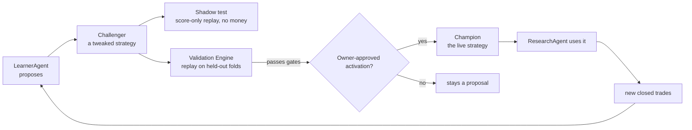
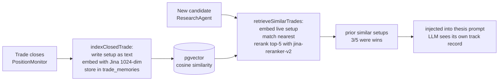

# Kairos — Learning Loop
> 2026-08-28: **Alpha Diagnostic Lab P0 shipped** (`features/alpha-diagnostic-lab/`). Read-only funnel diagnosis per market, weekly. A0 data truth gates everything; the strongest verdict is `owner_review` and no money path reads it. Full record incl. the seven defects found by running it: `features/alpha-diagnostic-lab/IMPLEMENTATION_RESULT.md`.
>
> First production run, both markets `A0 pass`, verdict `collect_more` (nothing clears the 60-date review floor):
>
> | | us | india |
> |---|---|---|
> | A2 rank IC h10 | **-0.012** (t -0.22, 17 dates) | **+0.105** (t 2.24, 22 dates) |
> | A2 mean quintile spread | **-0.006** | +0.010 |
> | A3 percent profit factor | 0.969 | **1.438** |
> | A3 currency profit factor | 0.735 | **0.906** |
> | A3 sizing damage | no | **YES** |
>
> **India picks winners and the sizing destroys them.** The US book has a different problem: the selection does not rank, and its quintile spread is NEGATIVE — acting on the ordering lost money. Two distinct failures, which is why A3 reports both profit factors and A2 reports IC beside spread. India's +0.105 independently reproduces the +0.106 measured by hand on 2026-08-25 through a different code path and cohort.
>
> 2026-08-25: **The weighting arms are now graded, and a `fundamental_only` arm was added.**
>
> Seven archetype weight sets record a score for every observation in `shadow_decisions`, and until today nothing evaluated them: the only consumer computed the share of shadow rows that were bullish, and its own comment admits that is not a comparison to the champion. `/api/agents/archetype-ic` (weekly, per market) now grades each `setup_type` by Spearman rank IC against `benchmark_neutral_return`, next to the champion composite measured on the SAME observations - `etf_trend` only ever scores ETFs, so a whole-market champion baseline would compare different universes.
>
> Guards carried over from the dimension-diagnostics work, each mutation-verified: dedupe to one row per (market, symbol, date, setup_type) because the research cron writes 2-3x daily; rank IC rather than Pearson; and the overlap-corrected floor `n / horizonDays >= 12` on top of the 20-date floor.
>
> **Why the `fundamental_only` arm exists.** Measured h10 rank IC, deduped, single stocks:
>
> | market | best single dimension | champion composite |
> |---|---|---|
> | us | fundamental **+0.076** (t=2.40) | +0.051 (t=0.93) |
> | india | technical **+0.173** (t=2.51) | +0.106 (t=2.04) |
>
> Both composites rank worse than their own best dimension. `value_inflection` (fundamental 0.45) only half-tests that; the new arm isolates it. It runs in BOTH markets deliberately - India's edge is technical, so the arm is expected to score poorly there, and an arm that only ever runs where it is expected to win proves nothing.
>
> **Caller contract, and it is load-bearing:** the arm is skipped unless `included.fundamental === true`. `computeWeightedAnalystScore` equal-splits across included dimensions when every included dimension has weight zero, so scoring a `{fundamental: 1.0}` set on a symbol with no fundamental evidence would silently yield an equal-weight technical/sentiment/macro blend - an arm labelled `fundamental_only` containing no fundamental at all.
>
> **Timeline.** Four of the seven arms only began writing on 2026-08-25 (the multi-expert uniqueness index landed 08-24; before it, only the first archetype in each routing array survived, which is why just `etf_trend` and `quality_momentum` existed). Their h10 labels mature ~2026-09-08; >=20 decision dates lands ~late October. Every read before then returns `insufficient_evidence`, by design.
>

> 2026-08-18: **Promotion gate segments IC evidence by PROVIDER REGIME.** Same-day companion to the Yahoo-first candle move below. `edge_ic_history` now contains rows computed on two different data sources, and `app/api/agents/backtest/promote` reads a 1000-day window — so without segmentation the cross-window stability check would compare a Yahoo latest window against a Massive earliest window and report the difference as "stability". `providerRegimeKey()` derives a regime from each row's `provider_report.providerCounts` using the DOMINANT provider (not the exact count map: `{eodhd:20,massive:6}` and `{eodhd:19,massive:7}` are one regime, and keying on counts would over-segment on run jitter and starve the gate). `evaluateGate` then evaluates ONLY the trailing run of windows sharing the latest regime and drops older ones — never blends them.
>
> **It fails closed straight after a provider change**, with `insufficient_windows_in_provider_regime:n<3:<regime>`. That is the intended answer: after switching candle sources the honest state is "not enough clean evidence yet", not a promotion computed on mixed measurements. A window whose `providerCounts` is missing or empty yields `provider_regime_unknown` and also fails — a window that cannot name the data it was computed on cannot be shown to be like-for-like. Passing no `providerRegimes` preserves the previous behaviour exactly, so existing callers and tests are unaffected.
>
> **This route remains DORMANT/measure-only and must not write a policy** — the change hardens the gate for whenever promotion is re-enabled; it does not alter live behaviour today. Mutation-verified: neutering the segmentation fails 5 tests. No historical row was rewritten.

> 2026-08-18: **Edge/IC candles route Yahoo-first for BOTH markets** (`lib/edges/data.ts::resolveCandles`, owner-approved, build-order step 4 of `features/walk-forward-ic-folds/`). Massive is plan-capped at a 2-year lookback, which held US IC history to ~12 usable non-overlapping h20 as-of dates — below the 12/fold floor, so walk-forward IC folds were unbuildable on US. Yahoo serves 5y (~50 dates), keyless and unpaced. It also ends the EODHD exhaustion: Massive per-symbol candles are paced at 12.5s (5/min), so a ~300-symbol EdgeScout run cascaded into EODHD's 20/day free tier (measured 2026-08-17: Massive 12, EODHD 20 = its cap, TwelveData 24, remainder unavailable).
>
> **`fetchUsCandles` — the main research path — is untouched.** It has its own local 1y Yahoo fetcher; live ResearchAgent scoring inputs did not move. Two files carried a comment claiming otherwise; both were false and are corrected. `resolveCandles` is reached only from `edges/compute.ts` and `edges/ic.ts`, both measure-only, and `research-agent.ts` imports nothing from `lib/edges`.
>
> **Discontinuity, stated because a promotion gate reads this table.** `edge_ic_history` rows from 2026-08-18 are computed on Yahoo bars where earlier rows used Massive/EODHD/TwelveData. Per-run `providerCounts` records which, so it is attributable rather than silent — but rows either side are NOT like-for-like. `lib/gates/promotion-gate.ts` reads a 1000-day window, so a promotion evaluated across the boundary mixes sources; segment by `providerCounts` before reading an IC change as signal. No historical row was rewritten.
> **2026-08-01 weight-resolution correction:** live ResearchAgent scoring reads
> the market champion, then the static risk-profile baseline. `learning_priors`
> and global `signal_weights` are learner configuration/proposal inputs, not
> hidden live-score fallbacks; challengers remain inert until validation and
> explicit promotion.
>
> **2026-07-28 correction — PROMOTION REMAINS DORMANT, NOT PERMANENTLY CLOSED.** The h5 study measured pooled IC sigma ~0.27 and found no useful `mom_12_1` signal at h5 (mean IC 0.0089, t_HAC 0.32). It did **not** identify an effective breadth of 17: observed IC variance mixes sampling noise, changing point-in-time membership/coverage, and genuine time variation in factor returns. Inverting it with `1/sqrt(n-3)` cannot separate those causes, and an h5 estimate cannot set h20 requirements. The n=400 and sector-neutral tests therefore remain legitimate measure-only experiments rather than rejected escape routes. `POST /api/agents/backtest/promote` still fails closed; no policy can consume these diagnostics.
> **2026-07-28 US PIT step-4 hardening:** `us_pit_adv20_top400_v2` ranks membership on a complete 20-session trailing dollar-volume window, shares cached session reads across overlapping as-of dates, excludes partial-window names, and persists one top-400 superset so matched n=200/n=400 tests use the same ranking. Report schema v2 retains successful-date cross-section and complete universe provenance. `persist_edge_pit_snapshot()` atomically writes exact snapshots to append-only `edge_universe_members`; it is service-role-only and conflicts fail closed. India PIT membership remains unavailable. These changes improve measure-only evidence and do not enable promotion.
> **PROMOTION IS DORMANT (2026-07-27).** `POST /api/agents/backtest/promote` fails closed with `promotion_evidence_not_oos` (503) before any write. Adversarial review found one P0 and three P1 issues that each independently disqualify the current path: promotion is non-atomic (supersede-then-insert can leave a segment with no active policy); the evidence is not out-of-sample (~98.4% window overlap AND a current-liquid universe replayed through past dates — survivorship bias that more weekly runs cannot fix); `dsr_z` was not a Deflated Sharpe Ratio and is renamed `t_margin_vs_trials`, with the `dsr` column now written NULL; and experiment lineage is optional and unbound to the edge/market/horizon/segment it justifies. Re-enable only after `features/walk-forward-ic-folds/FEATURE_ARCHITECTURE.md` is approved and shipped: frozen experiment lineage → PIT universe/inputs → purged market-session OOS folds → aggregate HAC IC → multiple-testing + cost-adjusted validation → atomic promotion RPC.
> Last updated: 2026-08-17 (h60/h120 evaluation horizons — see "Evaluation
> horizons are decoupled from holding period"; 2026-08-16 label-maturation
> coverage + starvation W7/W8 — see
> "Label maturation: coverage, budgets and skip accounting"). Prior note
> 2026-07-27: The deterministic promotion route is implemented
> but is governance scaffolding only: production has zero policies, its rolling
> IC windows are not OOS, its current-universe history is not PIT, its
> trial-adjusted t margin is not DSR, and supersede/insert is not atomic. The
> revised `features/walk-forward-ic-folds/FEATURE_ARCHITECTURE.md` is a blocking
> prerequisite before policy promotion or consumption.
> Update this file when: the learning flow changes, new guardrails are added to weight mutation, genome parameters change, Phase 1 unlocks, the RAG pipeline changes, or Performance Truth Layer evaluation logic changes.

---

## The big picture



The loop is:
1. ResearchAgent scores stocks using the current **Champion** strategy's weights + genome.
2. PaperTrader acts on high-score signals. PositionMonitor watches and exits positions.
3. Closed trades become training data for **LearnerAgent**.
4. LearnerAgent proposes a **Challenger** strategy with adjusted weights + genome.
5. The **Validation Engine** replays the Challenger on held-out data.
6. If the Challenger passes, it may enter a non-executing shadow automatically. Learning and
   evidence collection continue without intervention. A separate owner-approved activation is
   required before it becomes Champion and ResearchAgent uses the new weights
   on its very next run.

### Plan calibration and the LLM boundary (2026-07-30)

Every new ResearchAgent decision stores an indicative stop/objective/horizon in
`decision_observations.features.trade_plan`. Nightly label maturation already
stores immutable 2/5/10/20/60/120-session forward return, benchmark-neutral
return, MFE, and MAE in `observation_labels`.

### Evaluation horizons are decoupled from holding period (2026-08-17)

`HORIZONS` in `app/api/agents/label-maturation/route.ts` is `[2, 5, 10, 20, 60,
120]`. h60/h120 were added on 2026-08-17. The trading mandate holds 5–15 days;
the long horizons are **not** a mandate change and no position is held longer
because of them. Every horizon is labelled from the same observation, so the
long ones answer a question the ≤20d labels structurally cannot: *are we exiting
too early?*

They were added before they could produce anything, deliberately. Maturation is
calendar-bound: `maturityCutoff(60)` is `now-85d` against an oldest observation
of 2026-07-06, so h60/h120 matched zero rows at merge time and exit on the first
empty page. First h60 label ≈ 2026-09-29; roughly 20 independent decision dates
by late October. Starting the clock early is the whole point — no engineering
compresses forward time.

#### Setup-expert shadow rows were 2/6 for six weeks (2026-08-25)

From 2026-07-13 to 2026-08-24 only `etf_trend` and `quality_momentum` ever
reached `shadow_decisions`. `value_inflection`,
`pre_earnings_proximity_reweight_v1`, both India archetypes, and every
`family_uncapped_v1:*` row wrote NOTHING, on any day, in either market.

Cause: migration `163_shadow_decision_idempotency.sql` created

```sql
create unique index shadow_decisions_observation_policy_uidx
on public.shadow_decisions(observation_id, policy_version_id) nulls not distinct
where observation_id is not null;
```

Every archetype row carries `policy_version_id = null`, so `NULLS NOT DISTINCT`
made two experts for ONE observation collide. Postgres rejected the entire
batch. Only routes of size one ever landed — ETFs always route to exactly one
expert, and US names below the `value_inflection` threshold route to only
`quality_momentum`. That is the whole of the surviving data.

It stayed invisible because a PostgREST insert RESOLVES on failure rather than
throwing, and the call never read `.error`, so the enclosing try/catch saw
nothing.

Fixed by `20260824170000_shadow_decisions_multi_expert_uniqueness.sql`, which
re-keys the NULL-policy index to `(observation_id, setup_type)`. Verified on
2026-08-25: all six archetypes plus `family_uncapped_v1:*` now write in both
markets. No code change was needed; P0b (India coverage) and P0c (missing
archetypes) were both this one index.

**Two detectors added, because the outage was silent, not subtle:**
1. All three `shadow_decisions` inserts in `research-agent.ts` now read and log
   `.error`.
2. `/api/admin/shadow-liveness` gained `setup_expert_coverage`. The existing
   `setup-experts` probe reported "live" every single day of the outage — the
   table WAS growing, just missing two thirds of its experts. Recency cannot
   detect a partial outage; the new probe asserts every `market:setup_type` pair
   the router can emit appeared within 72h.

**Any future uniqueness rule on `shadow_decisions` must treat
same-observation/different-`setup_type` rows as distinct.** Pinned by
`lib/scoring/archetype-coverage.test.ts`.

#### Consumers widened + an overlap-aware floor (2026-08-24)

`DIAGNOSTIC_HORIZONS` (`lib/learning/dimension-diagnostics.ts`) and
`SUPPORTED_HORIZONS` (`lib/learning/plan-calibration.ts`) were both still
`[2, 5, 10, 20]`, so the h60/h120 labels would have matured in late September
into consumers that never read them. Both now match the labeler.

Widening the diagnostics constant required migration
`20260824220000_diagnostic_horizons_60_120.sql` FIRST: `dimension_diagnostic_runs`
constrained `horizon_days` to the short set, and because `runMarket()` rethrows
on insert failure, an h60 insert violating that CHECK would have killed the run
for every other horizon too. Applied and verified 2026-08-24.

**The date floor is now overlap-aware, and that is the load-bearing part.**
`MIN_PREDICTIVE_DATES = 20` counts decision dates without regard to horizon, and
consecutive forward windows of length `horizonDays` overlap almost entirely:

| horizon | 20 dates | independent observations |
|---|---|---|
| h10 | 20 | 2.0 |
| h20 | 20 | 1.0 |
| h120 | 20 | **0.17** |

Widening the horizons without this correction would have let the 20-date gate
pass at h120 and emit a `measured_descriptive` predictive finding built on
roughly ONE non-overlapping window. `MIN_EFFECTIVE_OBSERVATIONS = 12` is applied
on top of the date floor via `effectiveObservations(n, horizonDays) = n /
horizonDays`; both must clear. A long horizon needs proportionally MORE dates,
not the same number. Mutation-verified in
`lib/learning/dimension-diagnostics.test.ts`.

**Long-horizon labels no longer trust the candle cache.**
`price_cache` stores closes adjusted AS OF FETCH TIME, and providers restate
adjusted history after a split or distribution. `CandleResolver` short-circuited
the provider whenever the cache covered the window, so a covered-but-old slice
yielded bars wrong by the split factor — a 2:1 split inside the window reads as
a -50% return. Negligible across 10 sessions; months of exposure per label at
60/120. `LONG_HORIZON_REFRESH_DAYS = 60` now forces a provider fetch at the long
horizons regardless of coverage. Cost stays bounded by `providerTried` (one
fetch per symbol per run), and the fresh bars restate both the in-memory series
(`mergeCandles`, later sources win) and `price_cache` itself (upsert on
`symbol,date`).

**Two long-horizon accuracy caveats remain OPEN and must be stated alongside any
h60/h120 finding:**
1. `benchmark_neutral_return` subtracts the raw benchmark return with no beta
   adjustment. Immaterial over 10 days; over 6 months a high-beta name shows
   systematic phantom alpha.
2. Survivorship — delisted or acquired names never mature a label and drop out
   silently, biasing long-horizon results optimistic.

**Read long-horizon results by distinct decision DATES, not label count.**
Observations scored on one day share that day's market shock and are one draw,
not N. At h20 the sample was already only ~10 dates per market when the long
horizons were added.

**Provider depth is load-bearing.** `CandleResolver.providerTried` is keyed
`market:symbol`, so each symbol is fetched at most once per run and that single
fetch must satisfy the *longest* horizon. India's provider range was widened
`3mo` → `2y` for exactly this reason: a ~63-bar series cannot cover a
120-session forward window at any decision date, and the fetch is never retried,
so short coverage would starve the long horizons silently for the whole run. US
needed no change (`lib/data/candles.ts` fetches Yahoo at `range=1y`, ~251 bars).
`tests/label-window.test.ts` pins this contract.

`lib/learning/plan-calibration.ts` joins those two truths only when the label
horizon exactly matches the original plan horizon. It reports objective reach,
stop breach, and realized path statistics. The objective is an exit-policy
level, not a predicted terminal price; MAE/MFE cannot establish which level was
touched first.

### Dimension diagnostics and agent accountability (2026-08-06)

`/api/agents/dimension-diagnostics?market=us|india` runs after label maturation
and writes append-only `dimension_diagnostic_runs` and
`dimension_diagnostic_findings`. It reads only the existing decision/label
ledgers plus signal labels. It reports availability and descriptive
session-level rank IC by dimension, and records an agent/version's evidence and
decision record. Results below the predeclared 20 qualifying-session floor are
`insufficient_evidence`, not a conclusion.

ResearchAgent writes the deployed commit SHA into each new decision observation.
Agent contribution findings require that provenance; legacy unversioned rows are
explicitly `data_degraded` and are never silently compared with later releases.

This is **not** LLM punishment/reward or autonomous self-modification. It cannot
change a prompt, model, tool access, score, weight, threshold, candidate,
strategy, paper/live trade, exit, sizing, or broker action. Multiple agents
appearing in one workflow do not receive collaboration credit: the ledger records
`unattributable_no_paired_shadow` until the same market-local opportunity is
compared with and without a declared input in a paired non-executing shadow.

Decision Review shows per-symbol paths as illustrative. LearnerAgent receives
only same-market aggregate summaries through `query_plan_calibration`. The LLM
may explain the cohort and write a hypothesis, but it has no tool that changes
stop, target, or horizon. The existing deterministic MAE/MFE policy remains the
only automatic risk-parameter adjustment path and requires at least 60
same-market, exact-horizon eligible-long labels. US and India never share a
cohort.

### Benchmark-alpha scorecard boundary (2026-07-13)

`/api/agents/benchmark-scorecard` writes Phase-1 measurement rows to
`benchmark_scorecard` for paper/live, US/India, and 1W/1M/3M/YTD/1Y horizons.
The math uses common-window rebasing and annualized daily information ratio.
These rows are displayed in Performance Truth and may be read as evidence, but
they do **not** change LearnerAgent objectives, promotion gates, posture, sizing,
paper fills, or live orders in Phase 1. Phase 2 learner/promotion wiring still
requires a separate owner-approved implementation.

The Paper Portfolio chart also supports market-local display comparisons. US
offers VOO/QQQ/XLK/XLF; India offers NIFTY 50 plus priceable NIFTY IT,
NIFTY Bank, and NIFTY Next 50 ETF proxies. The owner's selection is saved in
`app_settings`, but is deliberately distinct from `benchmarks.is_primary`:
changing what the chart displays cannot change a mandate, learner input,
promotion decision, score, fill, size, or order. Secondary daily observations
come from existing free providers and are exact-session joined without forward fill.

---

## Champion and Challenger

### `strategy_versions` table (governance)

One row per strategy version. At most one `is_champion = true` per market at any time.

| Field | Meaning |
|---|---|
| `market` | `us` or `india` — markets evolve independently |
| `is_champion` | True for the one active strategy per market |
| `weights_snapshot` | 5-dim weights that ResearchAgent reads |
| `genome` | Trading parameters (see below) |
| `proposed_by` | `learner` or `user` |
| `backtest_result` | Sharpe, Sortino, win_rate, max_dd from Validation Engine |
| `promoted_at` | Set only when an owner-approved activation succeeds |

### The genome

What a Challenger can evolve:

| Parameter | Range / options | Notes |
|---|---|---|
| `entry_threshold` | 50–90 | `analyst_score` cutoff to open a position |
| `exit_stop_pct` | 3–15% | Stop-loss percentage below entry |
| `exit_target_pct` | 10–40% | Price target percentage above entry |
| `horizon_days` | 3–30 | Time-stop maximum hold days |
| `position_size_pct` | Up to `strategy_config.position_size_pct` | Can only size DOWN, never above the owner-set cap |
| `sizing_mode` | `fixed` \| `kelly` \| `confidence_scaled` | How position size is calculated |
| `entry.rank_pct_min` | 0.0–0.95 | **Default 0.0 = OFF (feature no-op).** Minimum within-comparable-group percentile for a NEW long. Hybrid gate: entry requires `analyst_score ≥ score_threshold` **AND** `rank_pct ≥ rank_pct_min`. `0.0` reproduces current selection byte-for-byte. Rank gates cross-group *admission* only; intra-group ordering stays by `analyst_score` (rank is monotonic in score within a group), so the CLAUDE.md "top-3 by analyst_score win" rule is preserved. Becomes active only via a validated, owner-promoted challenger. |
| 5 dimension weights | Sum must = 1.0 | `{fundamental, technical, sentiment, macro, insider}` |

### Per-market independence

`strategy_versions` has a `market` column. LearnerAgent analyzes one market's cohort per run
and proposes challengers only for that market. A bad India run cannot shift US scoring weights.
India starts on a clone of the US champion as a prior and diverges once it clears the same
10+ closed-trade phase gate.

### User visibility

**Dashboard → Learning → Active strategy and challengers** is the user-facing,
market-scoped strategy view. It shows the active champion (or the default baseline
when none is promoted), every challenger, its validation verdict and latest
experiment metrics, plus prior champions. A challenger with a passed validation
shows an owner-only **Request champion activation** control. The server remains the
authority and refuses it unless every promotion gate passes; the current OOS
promotion gate is dormant, so the control reports that refusal rather than changing
the champion. Learning, validation, and non-executing shadow collection continue
automatically. A champion has no fixed expiry: weekly learning and continuous outcome
monitoring decide when a new challenger is worth evaluating.

---

## LearnerAgent details

**File:** `app/api/agents/learner/route.ts`, `app/api/agents/learner-brain/route.ts`
**Schedule:** Fridays 5:00 PM ET
**LLM:** Claude Opus 4.8 (`claude-opus`)

### Phase gate

Weight mutation is **blocked entirely** until 10+ closed trades per market exist (`Phase 0`).
LearnerAgent runs but only writes a "mutation blocked: insufficient trades" note to
`learning_log`. Phase 1 (mutation unlocked) requires the owner to verify the trade set and
acknowledge the gate has been cleared.

**Run-accounting convention:** A LearnerAgent run may reconcile dangling orphan trade rows as
maintenance. Its run summary reports that count separately from the market-local total
closed-trade corpus (`Reconciled … | Total closed: …`); zero reconciliations never means zero
learning data.

### OPEN ITEM (2026-07-16): India macro contamination in the historical trade set — NOT yet remediated

Until 2026-07-16, India signals were scored with the **US** macro regime (`macro_regime` has no
`market` column) and, on 2026-07-13, with a **fortnight-stale** `green` verdict that was really a
failed MacroSentinel run (`raw_indicators = []`). `lib/data/scores.ts` now excludes macro for India
and age-bounds the row — but **the historical rows already written are still contaminated.**

Measured in prod on 2026-07-16 (entry signal joined to `signal_score_history`):

| India paper_trades | Count |
|---|---|
| Closed, entered on a macro-contaminated score | **4** (2 via stale-green `macro_score=100`, 2 via US-orange `macro_score=60`) |
| Closed, clean (macro already excluded) | 3 |
| Open, entered on a macro-contaminated score | **13** (3 stale-green, 10 US-orange) |
| Open, clean | 2 |

**Why this is not yet urgent:** the mutation gate is 10+ closed trades **per market**; India has 7
closed. The learner is still Phase 0 for India, so no contaminated trade has driven a weight
mutation yet. The 13 contaminated **open** positions will close into this set, though — so the
record should be corrected *before* India reaches 10.

**Proposal (owner decision — deliberately NOT applied, no rows were mutated):** flag rather than
delete. The taint vehicle already exists (`paper_trades.tainted`, `taint_reason`,
`excluded_from_learning`; filter in `lib/learning/taint-filter.ts`), so no migration is needed —
set `tainted = true`, `taint_reason = 'macro_regime_market_leak'` on the affected rows.
`applyLearningTaintFilter` then drops them from learning and from the RAG memory corpus, while
`run-evaluation.ts` still **counts** them in P&L (the book really moved — see "Tainted trades" under
Performance Truth). Note the flag is coarse: it removes the whole trade from learning, not just its
macro dimension. Given India's small n, the honest alternative — accept a smaller-but-clean India
trade set — is preferable to learning from a US-Fed-scored Indian book.

### Tool-use loop (9 tools)

LearnerAgent runs a multi-step tool-calling loop (via `runAgentLoop()`). The 9 tools it has:

1. `get_closed_trades` — recent paper_trades with outcomes
2. `get_signal_weights` — current champion weights
3. `get_strategy_versions` — all challengers + their backtest results
4. `get_decision_observations` — scored decisions (including skipped)
5. `query_trade_decisions` — real historical enriched Robinhood trades by regime/action
6. `propose_challenger` — write a new `strategy_versions` row with new weights + genome
7. `run_validation` — trigger Validation Engine on the proposed challenger
8. `get_mentor_insights` — recent coaching notes from MentorAgent
9. `semantic_search_decisions` — pgvector RAG over trade memories (if Jina key present)

### Automatic validation & shadow routing (migration 170)

When LearnerAgent creates a challenger it runs `runAutomatedValidation()`
(`lib/validation/automation.ts`) **in-process** — this replaced the earlier
fire-and-forget localhost request, which was unreliable on cloud cron. The flow,
gated by the per-market `strategy_validation_automation` policy (fail-closed:
missing row / read error = fully disabled):

1. Policy `enabled=false` → return immediately, no validation (challenger still
   exists and can be validated manually).
2. Else run the deterministic **Validation Engine** (`validateChallenger`), which
   writes a `validation_experiments` row (pass or fail) exactly as the on-demand
   Validate button does.
3. If it **passed** AND `auto_shadow_enabled=true` → call the
   `activate_strategy_shadow(p_version_id)` RPC, which atomically routes the
   challenger to `state='shadow_paper'` under a per-market advisory lock and a
   `max_active_shadows` (0–1) capacity cap.

The **only** automatic lifecycle transition is → `shadow_paper` (non-executing:
records what it *would* decide, no fills/cash — see the Shadow section). It can
**never** promote a champion, create a paper fill, move cash, make a broker
proposal, or place a live order. Champion promotion stays the separate owner-only
path and remains fail-closed on a PASSED `validation_experiments` row.

A Friday cloud recovery cron — **`kairos-validation-sweep`, 21:45 UTC** (POST
`/api/validation/sweep`) — validates up to 5 never-validated challengers per
market (`state='challenger'`, `validation_experiment_id IS NULL`) through the same
path, catching challengers created outside LearnerAgent or interrupted before
in-process validation completed. Owner controls both switches per market in
**Settings → Automatic Strategy Validation** (`GET`/`PATCH
/api/settings/validation-automation`); disabling preserves every challenger,
experiment, and shadow. Feature spec: `features/automated-strategy-validation/`.

### Auto-guard

In addition to the phase gate, LearnerAgent blocks mutation if the last 3 runs have
`win_rate < 35%`. This prevents a losing streak from producing an overfit Challenger.

### Per-trade notes

After each trade closes, LearnerAgent writes a 1-sentence outcome summary to `learning_log`.
This is separate from weight mutation — it runs regardless of the phase gate.

---

## Validation Engine

**File:** `lib/validators/backtest.ts`, `app/api/agents/backtest/route.ts`

**Deterministic, no LLM.** Replays a Challenger vs the current Champion on walk-forward
held-out slices of the `decision_observations` ledger.

### Label maturation: coverage, budgets and skip accounting (2026-08-16, W7/W8)

`/api/agents/label-maturation` returned `{success:true, matured:0, skipped:800}`
for 25 days and every monitoring layer read it as healthy. Labels stop dead at
2026-07-22 in **both** markets, with 1,738 US / 448 India observations old
enough to label and unlabelled. Three defects, each individually silent:

1. **Row existence was mistaken for coverage.** `usCandles()` returned any
   non-empty cached slice. `sinceDate` was `decisionDate − 5 days`, so one
   stale-but-present `price_cache` row satisfied it and the provider fallback
   below it was **unreachable** — coverage could never self-heal.
2. **The candle memo was range-blind.** It was keyed `market:symbol` but spanned
   all four horizons, so an h2 request's narrow window was reused for a later
   h20 request of the same symbol and starved it.
3. **The oldest rows monopolised the budget.** `loadPendingObservations` ordered
   `ts ASC` and sliced the first 200, so a permanently-failing prefix consumed
   the entire per-horizon budget every run and newer observations were never
   reached.

The rule now, in `lib/learning/label-window.ts`:

- **`forwardWindow(candles, decisionDate, horizonDays)`** is the only coverage
  test — the entry bar plus `horizonDays` forward sessions, or `null`. Never
  `candles.length > 0`, never a row count.
- **`CandleResolver`** re-checks coverage on every request, widens the cache
  read when a later horizon reaches further back than any previous request, and
  falls through to the provider **exactly once per symbol per run** when
  coverage is still short. A per-key promise chain keeps the old memo's
  "one fetch per symbol" property without its range blindness.
- **Scan budget is decoupled from success budget:** `SCAN_CAP` 2000 observations
  examined per horizon, `SUCCESS_BUDGET` 200 labels produced. Skipped rows spend
  the scan budget only. Capacity is split between an oldest-first pass and a
  deterministic day-rotating cursor (`rotatingOffset`), which visits every page
  over consecutive days, so the newest observations are always reachable.
- **`SkipLedger`** reports skips by reason (`no_candles`, `window_incomplete`,
  `no_entry_price`, `label_unavailable`, `insert_failed`, `exception`) and by
  symbol, in both the HTTP response and the `agent_runs.result_summary`.

**Detector.** `zeroOutputWithPending` — `matured === 0 && skipped > 0`, the exact
incident signature — writes `agent_runs.status='error'` instead of `'done'`. A
fully-drained backlog yields `matured:0, skipped:0` and stays healthy. Regression
cover is `tests/label-window.test.ts`, which fails if a stale cache short-circuits
the provider, if the memo starves an h20 window after an h2 request, or if a
permanently-failing prefix consumes the label budget.

**A rejected design, recorded so it is not rebuilt:** a `label_attempts` column
on `decision_observations`. One observation participates in h2/h5/h10/h20, so a
single counter cannot distinguish a transient h20 shortage from a permanent h2
failure and would exclude valid work for the wrong horizon. A horizon-scoped
retry ledger keyed `(observation_id, horizon_days)` is the fallback, and only if
permanent failures survive the coverage fix.

**Open:** draining the 1,738 US / 448 India backlog and confirming the label
high-watermark advances past 2026-07-22 requires production access and has not
been done. Until it is, `observation_labels` coverage beyond 2026-07-22 is
unproven and the US-vs-India scoring comparison stays in question.

### ATR exit-policy evidence (measure-only)

Nightly label maturation also records point-in-time entry ATR, ATR-normalized
MAE/MFE, and three predeclared `close_observed_v1` exit-policy outcomes. The
simulation uses completed daily closes and the standard 10 bps haircut, so it
does not infer intraday fills from daily OHLC ranges. The authenticated
`/api/analytics/atr-exit-evidence` report is strictly market- and horizon-local.
Its `reviewable_evidence` status requires at least 60 labels and 12 effective
observations, but is not a promotion gate and cannot change PaperTrader,
PositionMonitor, live orders, or broker protection. Purged walk-forward and
paper shadow approval remain mandatory before any execution-policy proposal.

### Eligibility gates (same for US and India)

| Gate | Threshold |
|---|---|
| Sharpe | ≥ 0.5 |
| Win rate | ≥ 40% |

If both gates pass, `eligibility_passed = true` is set on the `experiment_runs` row.

**Promotion is blocked (HTTP 412)** unless `eligibility_passed = true`. The owner cannot
click "Promote" without the Validation Engine having run and passed.

### Metrics computed

- Sharpe ratio
- Sortino ratio
- Maximum drawdown
- Win rate
- Expectancy
- Alpha vs benchmark

### Walk-forward design

The Validation Engine splits historical data by time, scoring the Challenger only on data
it could not have seen when it was proposed. This prevents in-sample overfitting from
looking like genuine improvement.

### Calibration OOS acceptance gate

`lib/validation/calibration.ts` fits the `pwin_logistic` artifact from walk-forward
folds (chronological, purged/embargoed). `acceptCalibrationOOS` computes the
Expected Calibration Error (ECE) over the **out-of-sample holdout only** and is
**fail-closed**: a model is rejected (`accepted: false`) when the holdout has
<30 usable rows, is degenerate (all-win/all-loss or non-finite ECE), or ECE > 0.1.
`fitAndStoreCalibration` gates the artifact upsert on this verdict — a miscalibrated
model is never written to the live `pwin_logistic` artifact, so the money path never
reads a bad P(win). `MIN_OOS_SAMPLES=30` and `MAX_OOS_ECE=0.1` are v0 thresholds
needing prospective tuning.

---

## Shadow decisions

A Challenger can be set to "shadow" real runs: it records what it *would have done* on every
stock with no fills and no cash. This is a free dress rehearsal — the Challenger accrues a
simulated track record before any promotion decision. Off by default. Activated per Challenger
in the Strategy Registry.

### Instrument-family challengers (2026-08-24)

Family learning is hierarchical, not per ticker: `market × instrument_family ×
setup × horizon`. ResearchAgent records one uncapped-v1 shadow comparison for
special fund families and stores raw family drivers separately. Diagnostics first
collapse repeated symbol/session rows, then collapse substitute vehicles to one
`exposure_id × market session`; GLD and IAU therefore contribute one gold sample,
not two. US and India never pool evidence.

The initial readiness floor is 60 independent exposure-sessions, at least 30
clean out-of-sample forward observations at a declared horizon, and non-degenerate
prediction variance. Passing these counts only permits IC/cost/calibration review;
it does not promote a score. Family benchmark alignment, overlapping-horizon
uncertainty, net-of-cost results, isolated exploratory paper, and explicit owner
promotion remain mandatory. Current production cohorts are below the floor, so
the correct state is abstention, not an automatically generated composite.

---

## Feature Registry

LearnerAgent can also propose a **new formula idea** — a new factor to incorporate into
scoring. This is written as a human-readable spec with a falsification test. The formula is
**never run as arbitrary code** — it is only interpreted through a locked, whitelisted math
grammar. AI cannot write executable scoring code directly.

---

## Cross-sectional rank (measure-only → gate, OFF by default)

**Files:** `lib/scoring/rank.ts` (`computeComparableRank`, `isRankRejected`), `app/api/agents/research/cron/route.ts` (Pass 2), `lib/validation/genome.ts` (`entry.rank_pct_min`). **Spec:** `features/cross-sectional-rank/FEATURE_ARCHITECTURE.md`.

A deterministic (no-LLM) **second pass** in the research cron, after all symbols score and before PaperTrader. It partitions the eligible pool into comparable groups (market × asset-type × sector), computes each name's within-group empirical percentile (`rank_pct`), and — **only when the champion genome's `entry.rank_pct_min > 0`** — flips rank-losing NEW candidates in `agent_signals` to `status='rank_rejected'`. Data-quality gates run before ranking (thin evidence, abstain, evidence-confidence floor, held-position exclusion); groups below their min-sample threshold (US equity 20, India equity 15, ETF 20) fall back to a fixed `degraded` transform — the "three finalists are not a universe" guard. ETFs are never grouped with single-name equities. Provenance is written to `universe_snapshot_scores` (`rank_quality`, `comparable_group_key`, `group_n`, `rank_eligible`).

**Resolved (2026-07-11):** the CLAUDE.md "top-3 by analyst_score win" rule is preserved — rank gates *cross-group admission* only; `rank_pct` is monotonic in `analyst_score` within a group so intra-group ordering is unchanged, and under today's single-group degraded case rank and raw-score selection are identical. Ships OFF (`rank_pct_min` default 0.0 → byte-stable selection); actionable only through a validated, owner-promoted challenger. Rank is **not** fed into the live P(win)/sizing model — logged as a feature for IC measurement only.

## PIT fundamentals ledger (OFF by default)

**Files:** `lib/data/pit-fundamentals.ts` (`getFundamentalsAsOf`, `captureFundamentalsFact`), capture hook in `lib/research-agent.ts`. **Table:** `fundamental_facts` (migration 150). **Spec:** `features/pit-fundamentals/FEATURE_ARCHITECTURE.md`.

Restatement-safe append-only vintage archive: fundamentals are captured on fetch (fire-and-forget, fail-open, dedup by `payload_hash`) so "fundamentals as known on date D" is reconstructable and a later restatement can never retroactively change a past as-of read. Not yet wired into live scoring — `scoreFundamentals` is unchanged and default scores are byte-identical. Purpose: give the Validation Engine and any future walk-forward replay a leak-free fundamentals source.

## Historical replay harness (measure-only, OFF)

**Files:** `lib/replay/*` (sealed accessor + `FutureDataLeakError`, packet assembler, gates, reporter). **Tables:** `replay_packets`, `replay_packet_items`, `replay_eligibility_runs`, `replay_eligibility_events` (migration 149). **Spec:** `features/historical-replay-harness/FEATURE_ARCHITECTURE.md`.

An offline harness that freezes point-in-time input packets (`knowable_at <= as_of` enforced by a sealed data accessor that throws on any post-cursor datum) and replays the eligibility gates (`calibration_oos`, `thin_evidence`, `ic`, `validation`, `breakdown_veto`) to answer "on what date would this strategy first have been eligible?" (`first_eligible_asof = MIN(as_of) WHERE passed`). Reuses the live gate code (`fitCalibration` → `walkForwardFolds` → `acceptCalibrationOOS`, `computeWeightedAnalystScore`, `isThinEvidence`) unchanged so a replay grades on the identical rule that would run live. Runs on in-memory fixtures today; the migration-149 tables persist runs when wired.

### Local bulk-evidence worker (measure-only)

**Spec:** `features/local-historical-replay/FEATURE_ARCHITECTURE.md`.

Large official datasets remain outside Supabase under the local Kairos evidence
store. The worker verifies every manifest/file hash, predeclares the plan in the
existing immutable `backtest_experiments` ledger, runs without provider access, and
writes only compact results and fingerprints. Initial scope is an India NSE
price-only OOS IC diagnostic. Backtest reads those results through an owner-only
API; the browser cannot start the worker. These records are not promotion, scoring,
or trading inputs.

## Deterministic portfolio simulation (measure-only, P0)

**Files:** `lib/simulation/portfolio-simulator.ts` and its fixture tests.
**Spec:** `features/portfolio-simulation/FEATURE_ARCHITECTURE.md`.

This pure TypeScript accounting engine evaluates predeclared entry/exit events in
one native-currency market at a time. It explicitly models cash, costs,
whole/fractional-share policy, open-name caps, and deterministic same-session
ordering (exits before entries), so released cash can be redeployed exactly once.
It does not fetch data, score symbols, select trades, call an LLM, persist rows,
or reach a paper/live/broker path. A future sealed replay may use it to compare
exit rules whose holding periods differ; no result can change a strategy without
the ordinary validation and promotion lifecycle.

## Governed external research (disabled P0 contract)

**Files:** `lib/external-research/contracts.ts` and fixture tests.
**Specs:** `features/external-research-shadow/FEATURE_ARCHITECTURE.md` and
`features/external-research-integrations/FEATURE_ARCHITECTURE.md`.

The initial contract rejects every external artifact until a real source commit,
license/SBOM review, synthetic sandbox proof, and explicit release admission exist.
It validates a single-market/currency snapshot, exact source/snapshot provenance,
bounded payloads, finite numbers, and unsafe object keys. It has no dispatcher,
credential, worker, provider, database, score, strategy, paper, live, or broker
consumer. This is deliberately a safety foundation, not an enabled Vibe runtime.

## Performance Truth Layer

**File:** `lib/evaluation/run-evaluation.ts`, `/api/agents/evaluation/*`
**Panel:** `/dashboard/learning`

Mandate-aware, deterministic (no LLM), honesty-first evaluation.

### Investment mandates

Named strategy contexts. Default mandates:
- "Swing US 2-20d" (benchmark: VOO)
- "Swing India 2-20d" (benchmark: ^NSEI)

Every `agent_signals`, `paper_trades`, and `decision_observations` row gets a `mandate_id`
stamped at creation time.

Future `decision_observations` also carry the actual scoring-candle close and a
deterministic indicative trade-plan snapshot. This improves point-in-time label
truth and lets Research Journal explain approximate entry/risk/target context.
Execution does not consume stale absolute research prices: PaperTrader resolves
the current bounded policy and anchors prices to the fill, while PositionMonitor
continues to own the stored position's exits.

### Evaluation metrics

| Metric | Notes |
|---|---|
| Sharpe | Risk-adjusted return |
| Sortino | Downside deviation only |
| Max drawdown | Worst peak-to-trough |
| Win rate | % of trades that closed positive |
| Expectancy | Average expected profit per trade |
| Profit factor | Gross profit / gross loss |
| Alpha | vs benchmark (VOO/^NSEI) |
| Execution slip | Mean realized vs 0.05% modeled slippage |

### Honesty rules

- **Fewer than 20 trades** → shows `insufficient_sample` instead of a number. No fabricated precision on tiny samples.
- **Tainted trades** (low `data_confidence`) are **counted** here — the book moved, so P&L must not hide them. They are labeled as tainted but included in the totals.
- `health_label` summarizes the overall picture:
  - `insufficient_sample` → not enough data to say anything
  - `negative_or_zero_edge` → strategy has no positive edge
  - `promising_but_unvalidated` → positive metrics but not yet through Validation Engine
  - `validation_required` → ready for formal promotion decision

### P1 gate

A weekly Vercel cron counts closed evaluable trades per market. When ≥ 20 accumulate, it
fires a System Health `info` alert: `p1-gate-ready:<market>`. This is the signal to build
opportunity-level IC metrics (`decision_observations × observation_labels`).

P0 is book-truth only. The `opp_*` columns in `strategy_evaluations` are null until P1.

---

## RAG trade memory pipeline



### Write side — `indexClosedTrade()`

- Triggered on every trade close (PositionMonitor + LearnerAgent exits)
- Builds a short text: symbol, market, 5 dimension scores, outcome, exit reason, mandate
- Embeds via Jina AI `jina-embeddings-v3` (1024-dim)
- Stores in `trade_memories` (pgvector table in Supabase)
- **Tainted / excluded trades are skipped** — bad-data history cannot poison memory

### Read side — `retrieveSimilarTrades()`

- Called by ResearchAgent before scoring each candidate
- Fingerprints the live setup as text, embeds with Jina
- Queries pgvector nearest-neighbor (cosine, IVFFlat index) for top-K candidates
- Reranks with Jina `jina-reranker-v2-base-multilingual` to pick genuinely similar past setups
- Returns a one-line summary: *"prior similar setups: 3/5 were wins"*
- Writes a `rag_traces` row for audit

### Guardrails

- Ticker filter: a retrieved chunk that doesn't mention the candidate symbol is dropped
- Whole path is **off when `JINA_API_KEY` is absent** — no key → silent no-op
- Does NOT move money or change weights. Advisory context only.

---

## Signal weights

### Current weights (live scoring)

ResearchAgent reads the newest promoted `strategy_versions.weights_snapshot` for
the symbol's market. If no promoted champion exists, it uses the selected static
risk-profile baseline (`conservative`, `balanced`, or `aggressive`), then applies
the market mandate's strategy tilt. Missing dimensions are removed and the
remaining weights are renormalized. In plain language: only an explicitly
promoted market strategy, or the documented profile baseline, can set the live
score mix.

`learning_priors` and the global `signal_weights` row are **not** live-scoring
fallbacks. `learning_priors` controls which dimensions LearnerAgent may study and
mutate. `signal_weights` remains a legacy/display row and is used only as a
proposal baseline when LearnerAgent has no market champion; a proposal still
creates an inactive challenger and cannot affect scoring until validation and
promotion succeed.

### Weight change audit

Legacy prior/global-weight changes are logged to `learning_priors_history` and
`signal_weights_history`. The active strategy audit trail is the immutable
`strategy_versions` challenger/champion lifecycle. These records are not purged
by the cleanup job.

### Learner config

`learner_config` table controls per-dimension mutation:
- `learn_from = false` → exclude this dimension from LearnerAgent analysis
- `allow_mutation = false` → LearnerAgent cannot propose weight changes for this dimension

These are toggled via `/api/agents/learner-controls`.

---

## Promotion gate (deterministic)

The path from "this edge measures well" to "this edge is policy" runs through
`lib/gates/promotion-gate.ts` and `POST /api/agents/backtest/promote`. It is the
**only** writer to `strategy_policies`, and there is no LLM anywhere on it — the
LLM's role ends at proposing a bounded hypothesis into `backtest_experiments`.
`strategy_policies.promoted_by` is CHECK-constrained to `'deterministic_gate'`, so
that boundary is enforced by the database rather than by convention.

<!-- Superseded 2026-07-27 promotion-gate description retained in git history only.
### Inputs

- `edge_ic_history` rows for one `edge_id` + `market`, scoped to the requested
  segment (`sector` → `segment_type='sector'`, `regime` → `segment_type='regime'`,
  neither → market-wide rows where `segment_type is null`) and to the horizon band
  `[horizon_days_min, horizon_days_max]`.
- `backtest_experiments.variants_run` when an `experiment_id` is supplied. Absent
  one, the gate assumes a single trial — the least punitive assumption, so the
  other gates have to carry the decision.

### The four gates

| Gate | Rule | Why |
|---|---|---|
| Window count | ≥ 3 IC windows | Below this there is no walk-forward to speak of; returns `insufficient_windows` without evaluating anything else. |
| IC floor | latest window IC ≥ 0.02 | Matches `classifyEdgeIC` in `lib/edges/ic.ts`. A decayed edge does not get promoted on its history. |
| t-stat | **latest window's** Newey-West t ≥ 2.0 | Newey-West because overlapping forward-return windows make naive IID t-stats overstate significance. Latest — not max — see "Which t-stat" below. |
| DSR | `t_best − E[max t over S trials] > 0` | Bailey 2014: `E[max t] ≈ Φ⁻¹(1 − 1/(2S))`. Testing more variants must not buy significance — this is why `variant_budget` is locked before the engine runs. |
| IC stability | latest IC > 0 and ≥ 50% of earliest IC | An edge whose estimate halves as data is appended is not stable. **This is NOT walk-forward** — the windows overlap ~98%, see below. |

Note the interaction worth knowing: `variant_budget` is capped at 20 by the
schema, and `E[max t]` at 20 trials is ≈ 1.96 — just under the 2.0 t-hurdle. So
within the allowed budget range the DSR gate never binds on its own; it tightens
the margin rather than rejecting outright. The rejection case is covered by test
and only triggers above the schema ceiling.

### Outcomes

- **Pass** — supersedes the incumbent active policy for that segment (the partial
  unique index allows exactly one non-superseded row per segment), then appends a
  new row. `verdict` is `baseline` when the segment had no incumbent and `variant`
  when one was superseded. `model_id` is the latest window's `formula_version`,
  falling back to `run_fingerprint`.
- **Fail** — HTTP 200 with `promoted: false` and machine-readable reason codes.
  A rejected promotion is a normal outcome, not an error, and nothing is written.
- When `experiment_id` is supplied, the resulting `policy_id` and `completed_at`
  are written back to `backtest_experiments` to close the lineage loop.

Auth is cron secret **or** an authenticated user; both land on the identical
deterministic path, so there is no privileged variant. Tests live in
`lib/gates/promotion-gate.test.ts`.

### Which t-stat (measured against prod, 2026-07-27)

Three candidate statistics were computed on real `edge_ic_history` rows. Two are
unusable and the choice is not cosmetic — it decides every promotion:

| Statistic | Result on prod data | Verdict |
|---|---|---|
| `max(t_stat)` across windows | `dma_trend_slope@20d` = **2.83** | Rejected — cherry-picks the luckiest of N windows. Same edge's latest window reads **0.55**. This is the exact order-statistic bias the DSR gate exists to remove, so using it made the gate self-defeating. |
| `mean(IC) / SE(IC)` pooled | An India edge with 3 windows scored **t = 13.77** | Rejected — pooling assumes independent windows. These are ROLLING and overlapping, so the IC series is autocorrelated and the SE collapses. |
| **latest window's `t_stat`** | best US = **1.73**, best India = **1.04** | **Adopted.** Unbiased, no cherry-pick, uses one window of data. Underpowered, which fails closed. |

Correctly pooling overlapping windows (a Newey-West correction *across* windows,
not within one) is the real fix and is deferred until there is enough
non-overlapping history to justify the machinery.

### First real run — zero promotions, and that is the correct answer

Evaluated against every market-wide edge/horizon pair with ≥3 windows:

| Market | Pairs evaluated | Pass IC floor | Pass t ≥ 2.0 | Pass walk-forward | **Promotable** | Best latest t |
|---|---|---|---|---|---|---|
| US | 33 | 18 | **0** | 15 | **0** | 1.73 |
| India | 24 | 1 | **0** | 3 | **0** | 1.04 |

Nothing promotes in either market. The binding constraint is the t-stat hurdle,
and the cause is history length: US IC history starts 2026-07-08, so 6 "windows"
sit on ~3 weeks of heavily overlapping data. `strategy_policies` is expected to
stay empty until there is materially more non-overlapping history. An empty
policy table is the gate working, not the gate broken.

### The windows are NOT walk-forward folds

Measured in prod 2026-07-27. Every `edge_ic_history` row is an IC over
`history_days = 1000`, and the six US windows span **16 calendar days** end to
end — so the first and last windows share **~98.4%** of their data. They are the
same backtest re-run weekly with the end date nudged, not out-of-sample folds.

Consequences, and what was done:

- The cross-window check is renamed `ic_stability_pass` (failure code
  `ic_stability_failed`). It measures whether the IC estimate holds as data is
  appended — **not** out-of-sample decay. The gate no longer claims a property it
  does not have.
- `strategy_policies.walk_forward_pass` (the DB column) keeps its name; renaming
  it needs a migration on an append-only governance table. It stores stability.
- The route now **dedupes by `window_end`**, newest run wins. US edges had 6 rows
  across only 4 distinct `window_end` values from 6 distinct `run_fingerprint`s,
  with `universe_size` drifting 31 → 32 → 40. Undeduped, a same-day re-run reads
  as fresh evidence and can lift `sample_n` over `MIN_WINDOWS` by itself.
- A span-based guard was considered and **rejected**: with 1000-day windows,
  genuinely disjoint history needs ~8 years. Waiting does not help either — four
  more weeks moves overlap from 98.4% to ~95.6%.

What is *not* affected: the Newey-West `t_stat` **within** a single window
(~96 as-of dates). That is real evidence and remains the binding constraint.

The real fix is disjoint folds emitted by the IC engine, proposed in
`features/walk-forward-ic-folds/FEATURE_ARCHITECTURE.md` — **draft, not
approved, not implemented**. Its own risk section notes it would likely make
promotion *harder* (fewer as-of dates per fold), so the recommendation there is
to build it once an edge is close to clearing the hurdle, not before.
-->

### Current implementation and audit status

- The route reads one exact evidence horizon. Market-wide evidence is
  `segment_type='market', segment_value='all'`; sector evidence is explicitly
  sector-scoped. The production `edge_ic_history` constraint does not permit
  regime rows, so regime promotion has no evidence and fails closed.
- Duplicate `window_end` rows are collapsed newest-run-wins before evaluation.
- Interactive access is confirmed-owner-only; cron access requires the cron
  secret. There is no LLM on the path.
- Current gates are at least three distinct rolling windows, latest IC ≥ 0.02,
  latest-window Newey-West t ≥ 2.0, a trial-count-adjusted t margin above zero,
  and positive/non-halving endpoint IC stability.
- The expected-max-t subtraction is **not** the Bailey/Lopez de Prado Deflated
  Sharpe Ratio. It omits strategy-return sample length, skewness, and kurtosis.
  Existing `dsr` names are legacy/misnamed and must be repaired before promotion
  becomes active.

No edge promotes. Production has zero `strategy_policies` and zero
`backtest_experiments`. The best latest US market-wide t-stat is 1.73. India's
best latest observation is 1.57 in a Financials sector slice with only two
distinct windows, so it fails the evidence-count gate.

### Blocking governance defects

The current route is scaffolding, not a production-grade promotion boundary:

1. Rolling windows share about 98.4% of their 1,000-day history.
2. The historical universe is a current-liquid snapshot, not point-in-time.
3. Missing experiment lineage assumes one trial, and experiments are not bound
   tightly enough to edge/formula/horizon/segment.
4. Supersede then insert is not transactional. The unique index prevents two
   active policies but cannot prevent zero active policies after insert failure.
5. `strategy_policies.walk_forward_pass` stores stability, and the mutation
   trigger does not protect every field described as immutable.

No consumer may treat a policy row as approved evidence until the revised
`features/walk-forward-ic-folds/FEATURE_ARCHITECTURE.md` is approved and built.
That design requires a frozen experiment, PIT universe and inputs, purged
market-session OOS folds, aggregate OOS IC evidence, proper multiple-testing
control, and one atomic service-role promotion RPC. Waiting for more overlapping
weekly windows does not cure these defects.
