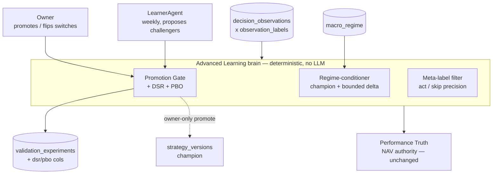
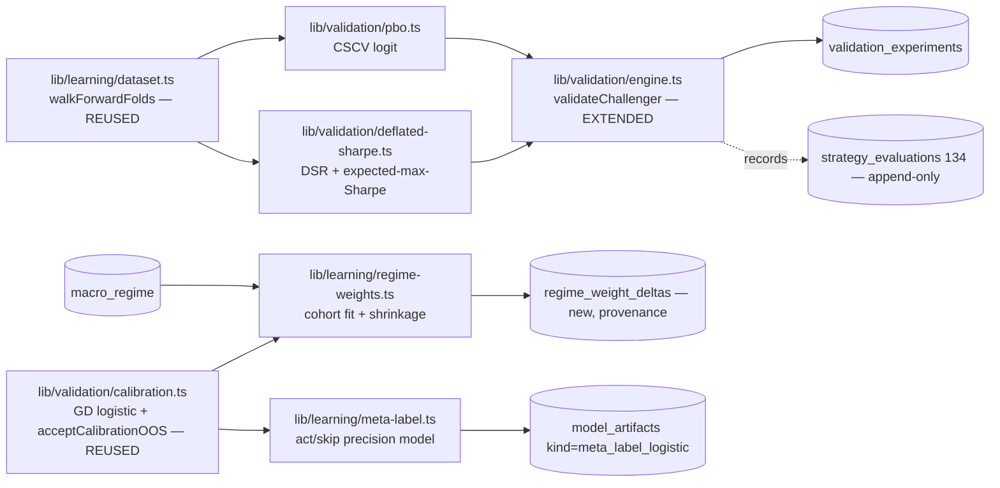

# Advanced Learning — Deflated Sharpe + PBO, Regime-Conditioning, Meta-Labeling

> Status: **DRAFT (design only, unapproved)**. No code, no migration, no deployment.
> Last updated: 2026-07-15
> Update this file when: the DSR/PBO promotion-gate math, the regime-conditioning
> weighting method, or the meta-labeling gate contract changes; keep it aligned with
> `docs/arch/09-learning-loop.md` (Validation Engine, promotion, Performance Truth,
> P1 gate), `lib/validation/engine.ts`, `lib/validation/calibration.ts`,
> `features/learning-core/FEATURE_ARCHITECTURE.md`, and
> `features/decision-review/FEATURE_ARCHITECTURE.md`.

---

## 1. One-line intent

Upgrade the learning/promotion **brain** with the canonical López de Prado
(*Advances in Financial ML*) + academic safeguards we are missing, in priority
order:

1. **Deflated Sharpe Ratio (DSR) + Probability of Backtest Overfitting (PBO)** as a
   hard, deterministic layer in the **promotion gate** — the #1 overfitting guard.
2. **Regime-conditioning** — a weight *adjustment* conditioned on the current
   `macro_regime` state, learned per regime cohort with its own sample floor.
   Evidence-conditioned, **not** a hardcoded bull/bear switch (respects the locked
   CLAUDE.md pushback rule).
3. **Meta-labeling** — a secondary deterministic model that decides *whether to ACT*
   on a primary signal (a precision filter), trained on
   `decision_observations × observation_labels`. Measure-only → shadow → gated.

All three **extend** the existing deterministic Validation Engine / calibration /
learner path. None introduces an LLM on the money path, and none creates a parallel
truth layer. Performance Truth remains the NAV authority; the LearnerAgent + owner
promotion remain the **only** things that change champion weights.

---

## 2. Hard boundaries (non-negotiable)

- **Deterministic, no LLM sets any number.** DSR, PBO, regime weight-deltas, and the
  meta-label model are pure arithmetic / gradient-descent over the ledger — same
  posture as `lib/validation/engine.ts` (moving-block bootstrap, seeded PRNG) and
  `lib/validation/calibration.ts` (batch GD logistic, fixed iterations). An LLM may
  *narrate* the numbers in prose, never produce them.
- **Extends, does not replace.** DSR/PBO are added terms on the existing
  `validateChallenger` path and are recorded on the existing
  `validation_experiments` / `strategy_evaluations` rows. Regime-conditioning is a
  bounded **delta on top of** the champion genome weights, not a second weight store.
  Meta-labeling is a *gate flag*, never a score.
- **No parallel truth layer.** Every number is derived from the append-only
  `decision_observations` (059) × `observation_labels` (060) ledger and the existing
  `macro_regime` (028) table — the same records LearnerAgent, the Validation Engine,
  and Performance Truth already read. Performance Truth (`lib/evaluation/run-evaluation.ts`)
  stays the book-truth / NAV authority; nothing here recomputes NAV.
- **Per-market / per-currency, never mixed.** US cohorts use USD prices + SPY-neutral
  returns; India cohorts use INR + ^NSEI-neutral. A regime cohort, a DSR trial count,
  or a meta-label training set is always scoped to a single `market`. India evolves on
  its own gate exactly as today (`docs/arch/09-learning-loop.md` "Per-market
  independence").
- **Measure-only → shadow → gated rollout.** Every method ships OFF, computing and
  recording its verdict without affecting selection/sizing/promotion. Each is
  activated by a **separate** owner switch, and only after its own sample floor is
  cleared. The riskiest of the three (meta-labeling gating entries) is the last to
  ever gate.
- **The champion promotion path stays owner-only and fail-closed.** DSR/PBO can only
  make promotion *stricter* (add a required PASS), never auto-promote. Meta-labeling
  can only *withhold* an entry that the deterministic score already permitted — it
  can never *create* an entry. Regime-conditioning can only nudge a weight within a
  bounded band; it can never override the entry threshold or the "sum-to-1.0"
  invariant.
- **Respects the locked "no regime switching" rule.** Regime-conditioning is a
  smooth, evidence-weighted blend (shrink-to-champion by cohort sample size), not an
  `if regime == 'red' then bearMode` branch.

---

## 3. What already exists (verified against code) — the substrate

| Building block | Where | What we reuse |
|---|---|---|
| Walk-forward folds (purged + embargoed, anchored) | `lib/learning/dataset.ts` `walkForwardFolds()` | The **exact** leak-free splitter. PBO's combinatorial split reuses the same purge/embargo constants. |
| Labeled dataset join | `lib/learning/dataset.ts` `loadLabeledDataset()` | `decision_observations × observation_labels`, benchmark-neutral returns at 2/5/10/20d. Meta-label training data + regime cohorting both read this. |
| Challenger replay objective | `lib/validation/engine.ts` `objectiveTerm()` / `scoreRow()` | Per-row benchmark-neutral log-growth under a weight set. DSR consumes the **per-fold return series** this already produces. |
| Bootstrap + seeded PRNG | `lib/validation/engine.ts` `blockBootstrap()`, `mulberry32()` | Determinism pattern; DSR's variance/skew/kurtosis of the return stream and PBO's rank logic reuse the same seed discipline. |
| Existing promotion gates | `lib/validation/engine.ts` (p_improvement ≥ 0.80, CI-low, n_effective ≥ 12, ≥3/5 folds) + `activate_strategy_shadow` (170) + atomic promotion (161) | DSR/PBO are **added** as further AND-conditions; the fail-closed PASS row + owner-only promote path are unchanged. |
| Calibrated P(win) logistic + OOS/ECE fail-closed gate | `lib/validation/calibration.ts` | Meta-labeling is architecturally a *sibling* of this model: a second logistic, same GD, same walk-forward OOS acceptance discipline (`acceptCalibrationOOS`), different target (act-vs-skip precision). |
| Regime state | `macro_regime` (028): `week_of`, `regime ∈ {green,yellow,orange,red}`, `danger_score`, read via macro-sentinel | Regime label per observation date. **Exists but weights are NOT conditioned on it today** — this feature is the first consumer for conditioning. |
| Experiment ledger | `validation_experiments` (via `recordExperiment`), `strategy_evaluations` (134, append-only) | DSR/PBO verdicts are new columns on these rows. No new provenance store. |
| EdgeIC statistical toolkit | `lib/edges/ic.ts` (Spearman, Newey-West SE, t-hurdle) | Reference implementation for the significance discipline; PBO logit and DSR t-stats live beside it, not on the money path. |
| Aggregate/per-decision measurement surfaces | `features/edge-factor-discovery`, `features/decision-review` | Sequencing peers — DSR/PBO/meta-label verdicts surface through the same Performance Truth / Decision-Review panels, not a new dashboard. |

**Key implication:** we are not inventing infrastructure — DSR/PBO/meta-labeling are
*additional deterministic computations* over data and splitters that already exist.
The build is a math + gating layer, not a new pipeline.

---

## 4. Method 1 — Deflated Sharpe Ratio + PBO in the promotion gate (priority #1)

### 4.1 Why

The current gate (`validateChallenger`) tests whether a challenger beats the champion
on held-out folds with bootstrap significance. It does **not** correct for
**selection bias**: LearnerAgent proposes many challengers over time, and the best of
N trials will look good by luck alone. DSR and PBO are the canonical López de Prado
corrections for exactly this.

### 4.2 Deflated Sharpe Ratio (DSR)

DSR adjusts an observed Sharpe for (a) the **number of trials** that were run to find
it, (b) the **non-normality** (skew/kurtosis) of the return stream, and (c) the
**track length**. It returns a probability that the true Sharpe > 0 given the search.

Deterministic recipe (all inputs already available or trivially derivable):

1. **Return stream.** For the challenger, take the per-test-row objective series
   already produced in `validateChallenger` (the challenger arm of `pairedDiffs`,
   i.e. `objectiveTerm(challengerWeights, row)` across concatenated OOS test rows).
   This is the leak-free, walk-forward return series — no new replay needed.
2. **Observed Sharpe** `SR_hat` = mean/std of that series (annualization factor is
   recorded but DSR works on the raw per-observation SR; we store both).
3. **Skew `γ3` and kurtosis `γ4`** of the same series (deterministic moments).
4. **Number of trials `N`** = count of challengers proposed **for this market** in
   the current learning episode / trial family (see 4.4 — this is the load-bearing
   input and the biggest measurement decision).
5. **Expected max Sharpe under the null** `SR0` = the López de Prado closed form for
   the expected maximum of N independent standard-normal Sharpe estimates
   (uses the Euler–Mascheroni / Gaussian-quantile approximation — pure arithmetic).
6. **DSR** = `Φ( (SR_hat − SR0) · sqrt(T−1) / sqrt(1 − γ3·SR_hat + ((γ4−1)/4)·SR_hat²) )`
   where `T` = track length (number of OOS observations), `Φ` = standard normal CDF.
7. **Gate:** require `DSR ≥ DSR_MIN` (v0 default **0.95**, i.e. 95% confidence the
   deflated Sharpe is positive) — a **tunable const beside** `MAX_OOS_ECE` in the
   calibration module, documented as needing prospective tuning.

### 4.3 Probability of Backtest Overfitting (PBO)

PBO (Bailey–Borwein–López de Prado, CSCV — Combinatorially Symmetric Cross-Validation)
estimates the probability that a configuration selected as best **in-sample** ranks
**below median out-of-sample** — the direct probability that our selection is overfit.

Deterministic recipe reusing the existing splitter:

1. Partition the OOS observation matrix into `S` contiguous, **purged/embargoed**
   sub-blocks using the *same* purge (`horizonDays`) and embargo the walk-forward
   splitter already applies (`lib/learning/dataset.ts`). `S` even (v0 **S = 8** if
   sample allows, else the largest even S meeting the per-block floor).
2. For each of the `C(S, S/2)` combinations, designate half the blocks **IS** and
   half **OOS**.
3. Score the **candidate family** (champion + all challengers in the trial family,
   §4.4) on IS; pick the IS-best.
4. Record that config's **OOS rank** among the family; compute its logit
   `λ = ln( rank/(M+1 − rank) )`.
5. **PBO** = fraction of combinations where the IS-best has `λ ≤ 0` (below-median
   OOS). Require `PBO ≤ PBO_MAX` (v0 default **0.20**).

Because CSCV is combinatorial, cap `S` so `C(S, S/2)` stays bounded (S ≤ 10 →
≤ 252 combinations) — deterministic and cheap.

### 4.4 The single load-bearing input: trial count `N` / the candidate family `M`

DSR needs `N` (how many strategies were tried) and PBO needs the **family** of
configurations scored together. Both quantify selection bias, so they must count the
**same search**. Design decision (v0):

- The **trial family** = all `strategy_versions` rows for this `market` with
  `proposed_by='learner'` since the current champion was promoted (i.e. every
  challenger the learner floated in this episode), **plus** the champion itself.
- `N` = size of that family. This is directly queryable — no new state — and it is a
  *conservative* (never-underestimated) count, which is the safe direction for an
  overfitting guard.
- Recorded on the experiment row (`n_trials`, `trial_family_ids`) so the verdict is
  reproducible and auditable.

> This is the **single riskiest assumption** — see §9. If `N` is undercounted, DSR is
> too permissive; the conservative "count every learner challenger this episode"
> choice deliberately errs strict.

### 4.5 Where it plugs in (deterministic, additive)

`validateChallenger` today returns PASS iff the four existing conditions hold. Add two
AND-conditions, evaluated **only when the sample floor is met**:

```
passed = existing_gates_pass
         AND (n_effective >= DSR_PBO_MIN_SAMPLE ? (DSR >= DSR_MIN AND PBO <= PBO_MAX) : true*)
```

`*` When the sample floor is **not** met, DSR/PBO are **computed and recorded but not
enforced** (measure-only) — the harness runs from day one, the gate activates only
when data matures. The floor mirrors the existing discipline: the engine already
refuses `<60` observations and `n_effective < 12`; DSR/PBO enforcement adds a higher
floor (v0 **n_effective ≥ 20**, matching the Performance Truth 20-trade honesty rule
and the P1 gate). Owner flips enforcement per market via a
`strategy_validation_automation`-style switch (`dsr_pbo_enforced`).

New fields on `validation_experiments` (additive migration, not in this doc):
`dsr`, `sr_hat`, `sr0_expected_max`, `n_trials`, `pbo`, `cscv_blocks`,
`trial_family_ids`, `dsr_pbo_enforced`, `dsr_pbo_pass`. These **summarize**; they do
not replace `passed`/`p_improvement`.

**Boundary:** DSR/PBO can only *block* a promotion the old gate would have allowed.
They never promote, never size, never touch cash. The atomic owner-only promotion RPC
(161) still requires a PASS row and an owner click.

---

## 5. Method 2 — Regime-conditioning (priority #2)

### 5.1 Intent & the locked-rule constraint

Learn that (e.g.) *technical* weight should be shrunk and *macro* weight lifted when
`macro_regime='red'`, **without** a brittle bull/bear mode switch. The CLAUDE.md rule
is explicit: no explicit regime-detection *switching*. So regime-conditioning is a
**smooth, evidence-weighted, bounded delta** on the champion genome weights — it
degrades gracefully to "just use the champion weights" whenever the regime cohort is
thin.

### 5.2 Cohorting

- Stamp each labeled observation with the `macro_regime.regime` in effect on its
  `ts` (join `decision_observations.ts` → `macro_regime.week_of`, market-local). This
  is a **read** — `macro_regime` already exists; nothing new is written to the ledger.
- Group the labeled dataset into per-market **regime cohorts**
  (`{green, yellow, orange, red}`). To avoid 4× sparsity, v0 collapses to two
  evidence bands — **calm** (`green|yellow`) and **stress** (`orange|red`) — a
  data-driven coarsening, not a hand-tuned bull/bear branch; the band boundary is a
  documented const, and the design keeps the full 4-level cohort available for when
  volume supports it.

### 5.3 The conditioned weight = champion ⊕ shrunk delta

For each cohort `c` and market, fit the **same calibration logistic**
(`lib/validation/calibration.ts` machinery) on the cohort's rows to get the
dimension-importance implied by that regime. Convert to a candidate weight vector
`w_c`, then **shrink toward the champion** by cohort evidence:

```
w_effective(c) = normalize( (1 − α_c) · w_champion + α_c · w_c )
α_c = min(α_max, n_c / (n_c + K))          # James–Stein-style shrinkage
```

- `n_c` = cohort sample size; `K` = shrinkage constant (v0 **K = 50**); `α_max` caps
  the maximum deviation from champion (v0 **0.25** — a regime can move a weight by at
  most a quarter of the way to its cohort-implied value).
- **Sample floor:** when `n_c < REGIME_MIN_SAMPLE` (v0 **30**, matching the
  calibration `MIN_OOS_SAMPLES`), `α_c = 0` → **exactly the champion weights**. Thin
  regimes are a no-op, not a guess.
- The sum-to-1.0 genome invariant and the `position_size_pct` cap are re-imposed after
  the blend; the entry threshold is **never** conditioned (only dimension weights).

This composes with the champion genome as a **pure function** of (champion weights,
current regime, cohort evidence). There is no second weight store and no mode flag —
the champion remains the single governance object; regime-conditioning is a
deterministic transform applied at scoring time, recorded for audit.

### 5.4 Validation & rollout

- A regime-conditioned challenger is validated by the **same** `validateChallenger`
  path (including the new DSR/PBO layer) — regime-conditioning is just a different way
  of producing `weights_snapshot`-equivalent scoring, so it must clear the identical
  gate before it can ever affect live selection.
- Ships **measure-only**: the conditioned weights are computed and logged to a new
  `regime_weight_deltas` provenance row (per market × cohort × fit date) but scoring
  uses champion weights until the owner enables `regime_conditioning_enabled` per
  market — and only after the cohort floors are met.
- India and US condition on their **own** `macro_regime` history independently.

**Boundary:** the delta is bounded (`α_max`), evidence-gated (`α_c → 0` when thin),
and re-normalized — it can nudge, never flip. No `if regime` branch selects a
strategy; the champion is always the base.

---

## 6. Method 3 — Meta-labeling (priority #3)

### 6.1 Intent

Primary model = the existing deterministic `analyst_score` + entry threshold (decides
**side / direction**). Meta-labeling adds a **secondary** deterministic model that
decides **whether to act** on a primary BUY — a precision filter that suppresses
low-precision entries. It **never** overrides the deterministic score; it only gates
*entry eligibility*. (López de Prado, Ch. 3.)

### 6.2 Model

- **Training data:** `decision_observations × observation_labels` where the primary
  signal was a candidate entry (`entry_eligible = true` / score ≥ threshold). Label =
  `1` if that entry was a **win** (benchmark-neutral return > 0 at the mandate
  horizon), `0` otherwise. This is exactly the `loadLabeledDataset` output filtered to
  would-have-acted rows.
- **Features:** the 5 dimension scores + deterministic context already on the row
  (availability mask, score-vs-threshold margin, regime band from §5, `rank_pct` from
  cross-sectional rank if present). **No look-ahead** — same walk-forward discipline.
- **Fit:** the *same* batch-GD logistic + standardization as
  `lib/validation/calibration.ts`, producing `P(win | acted)` — a **precision**
  estimate, distinct from the sizing P(win) (different training population:
  acted-only, not all decisions).
- **OOS acceptance:** reuse `acceptCalibrationOOS` verbatim (fail-closed: <30 OOS
  rows, degenerate class, or ECE > 0.1 → **rejected**, model not stored). Stored (when
  accepted) as a **new `model_artifacts.kind='meta_label_logistic'`** row — same
  table, same upsert discipline as `pwin_logistic`.

### 6.3 The gate (three-stage rollout, the last method to ever act)

1. **Measure-only:** compute `P_meta` for every candidate, record it on the decision
   observation / Decision-Review surface, and report **what it *would* have
   suppressed** and the counterfactual precision lift. Changes nothing.
2. **Shadow:** a `state='shadow_paper'` strategy variant applies the meta-gate and
   records its would-be book vs the champion's — a free dress rehearsal (exactly the
   existing shadow_paper mechanism, `docs/arch/09-learning-loop.md` "Shadow
   decisions"). No fills, no cash.
3. **Gated rollout (owner-approved):** only after shadow shows a real precision lift
   over a sufficient sample, and only behind an owner switch
   (`meta_label_gate_enabled` per market), the meta-gate may **withhold** an entry the
   primary model permitted: `act = primary_entry_eligible AND (P_meta ≥ META_MIN)`.
   `META_MIN` is a tunable const with a min-sample floor (v0 **≥ 50 acted
   observations** in the training population before the gate can enforce).

**Boundary:** meta-labeling is strictly **subtractive** — it can only turn an eligible
entry OFF, never turn an ineligible one ON, never change direction, never change size,
never write a weight. It is the highest-risk method (it directly withholds trades), so
it is sequenced last and gated hardest.

---

## 7. C4 sketch

### Context



### Container / component



New code (all deterministic, unit-testable pure functions like the existing
`walkForwardFolds` / `blockBootstrap`): `lib/validation/deflated-sharpe.ts`,
`lib/validation/pbo.ts`, `lib/learning/regime-weights.ts`, `lib/learning/meta-label.ts`.
Extended: `lib/validation/engine.ts` (two added AND-gates, all new fields recorded).

---

## 8. Phased rollout (each gate flips separately, measure-only first)

| Phase | Ships | Enforcement | Sample floor | Owner switch |
|---|---|---|---|---|
| **A. DSR/PBO harness** | Compute DSR, PBO, n_trials on every `validateChallenger` run; record on experiment rows; surface in Performance Truth | **Measure-only** | — | none |
| **B. DSR/PBO gate** | DSR ≥ 0.95 AND PBO ≤ 0.20 become required promotion AND-conditions | Enforced | n_effective ≥ 20 per market | `dsr_pbo_enforced[market]` |
| **C. Regime measure-only** | Cohort fit + shrunk deltas computed, logged to `regime_weight_deltas`; scoring still uses champion | Measure-only | — | none |
| **D. Regime conditioning** | Conditioned weights used in scoring (still must clear the gate as a challenger) | Enforced | n_c ≥ 30 per cohort (else α=0) | `regime_conditioning_enabled[market]` |
| **E. Meta-label measure-only** | `P_meta` computed + recorded; counterfactual suppression reported | Measure-only | — | none |
| **F. Meta-label shadow** | `shadow_paper` variant applies gate, records would-be book | Shadow (no cash) | OOS-accepted model | none |
| **G. Meta-label gate** | Meta-gate may withhold eligible entries | Enforced | ≥ 50 acted obs per market | `meta_label_gate_enabled[market]` |

Phases A/C/E (all measure-only) can be built now; the enforcement phases (B/D/G)
**stay dark until the sample floors are cleared** — consistent with the existing
Phase-0/Phase-1 discipline and the "when data matures" reality of a fresh book.

---

## 9. Single riskiest assumption

**Sample size.** At this stage the book has very few closed trades (the 10-trade
Phase-0 gate has barely opened, and Performance Truth still shows
`insufficient_sample` below 20). DSR needs a meaningful track length `T`, PBO needs
enough purged blocks to form `C(S, S/2)` splits, regime cohorts fragment the already-
small sample by 2–4×, and meta-labeling needs enough *acted* rows to fit a second
logistic. **Building the harness now is correct and safe (measure-only); activating
any enforcement gate before the per-method sample floors are met would either block
all promotions or fit noise.** The design mitigates this by (a) computing everything
measure-only from day one, (b) per-method floors that mirror the existing 20/30-row
disciplines, (c) shrink-to-champion / no-op fallbacks whenever a cohort is thin, and
(d) conservative trial-count `N` that errs strict.

**The one open decision for the owner (§4.4):** *how to count `N` (the trial family)
for DSR/PBO.* The proposed "every learner-proposed challenger for this market since
the current champion was promoted, plus the champion" is conservative and auditable,
but it couples the deflation strength to LearnerAgent's proposal cadence — a chattier
learner inflates `N` and makes promotion harder. The alternative (count only
*validated* challengers, or a fixed rolling window) is less strict but arguably closer
to "trials that could have been selected." This choice sets how aggressively the #1
overfitting guard bites, and should be locked before Phase B enforcement.

---

## 10. Acceptance tests (deterministic, no live money)

1. **DSR determinism:** same dataset + same `N` → identical DSR/PBO to full float
   precision (seeded, like `blockBootstrap`). Snapshot test.
2. **DSR deflation direction:** holding `SR_hat` fixed, increasing `N` strictly
   lowers DSR; increasing negative skew lowers DSR. Property test.
3. **PBO sanity:** a deliberately overfit config (fit-to-noise weights) yields
   PBO → high (> 0.5) on synthetic data; a genuinely predictive config yields PBO
   low. Fixture test.
4. **Gate is additive, never looser:** any challenger that FAILS the old gate still
   FAILS with DSR/PBO enabled; DSR/PBO can only flip PASS→FAIL. Differential test
   against current `validateChallenger`.
5. **Measure-only inertness:** with all switches OFF, champion weights, selection,
   sizing, promotions, and NAV are **byte-identical** to pre-feature (golden-master
   over a replay window) — mirrors the cross-sectional-rank / PIT-fundamentals
   "OFF = no-op" proof.
6. **Regime no-op when thin:** cohort with `n_c < 30` → `α_c = 0` → conditioned
   weights exactly equal champion weights (bit-exact).
7. **Regime bounded:** for all cohorts, `‖w_effective − w_champion‖` ≤ the `α_max`
   bound and `Σ w_effective = 1.0`.
8. **Meta-gate subtractive only:** for every observation, `act ⊆ primary_eligible`
   (the gate never enables a primary-ineligible entry); with the gate OFF, `act ==
   primary_eligible`.
9. **OOS fail-closed inheritance:** a meta-label model with <30 OOS rows or ECE > 0.1
   is **not** stored to `model_artifacts` (reuse `acceptCalibrationOOS` test vectors).
10. **Per-market isolation:** a synthetic India cohort/trial family never alters any
    US DSR, PBO, regime delta, or meta-model, and vice-versa.

---

## 11. Sequencing vs router + Decision-Review + experiment-lineage

- **Post-router.** This is a *promotion-brain* upgrade; it assumes the scoring/router
  path and the Validation Engine are stable. It does not touch routing, data
  provider abstraction, or order execution. Build **after** the router work lands.
- **Complements Decision-Review** (`features/decision-review/FEATURE_ARCHITECTURE.md`):
  Decision-Review is the per-symbol post-mortem UI over the same
  `decision_observations × observation_labels` ledger. Meta-labeling's measure-only
  `P_meta` and the DSR/PBO verdicts **surface through** Decision-Review / Performance
  Truth panels — no new dashboard. Decision-Review answers "was this one decision
  right?"; Advanced Learning answers "should this *strategy* be promoted, and should
  we *act* on its signals?" Same evidence tables, different altitude.
- **Complements experiment-lineage:** DSR/PBO records (`n_trials`, `trial_family_ids`,
  `dataset_hash`) are exactly the lineage/provenance experiment-lineage tracks — this
  feature *produces* lineage facts (which trials, which family, which verdict) that
  experiment-lineage *organizes*. Build the DSR/PBO recording columns in a shape
  experiment-lineage can consume.
- **Ordering within this feature:** #1 DSR/PBO (highest value, smallest surface, pure
  add to an existing gate) → #2 regime-conditioning (needs cohort volume) → #3
  meta-labeling (highest risk, needs the most acted data, gated last). Each measure-
  only phase is independently shippable and independently reversible.

---

## 12. Open items to confirm at approval

1. **Trial-count `N` definition** (§4.4/§9) — the single biggest decision.
2. `DSR_MIN` (0.95), `PBO_MAX` (0.20), `S` (8), `α_max` (0.25), `K` (50), `META_MIN`,
   and all sample floors are v0 defaults needing prospective tuning — confirm the
   starting values.
3. Regime cohorting granularity: 2-band (calm/stress) v0 vs full 4-level — confirm the
   v0 coarsening.
4. Whether regime-conditioning is expressed as a runtime scoring transform vs a
   materialized per-regime challenger set (this doc proposes runtime transform + audit
   row; a materialized variant is possible but adds governance objects).
