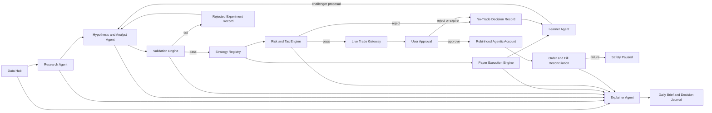

# Feature Architecture: Governed Agentic Quant Platform

## Status

Architecture status: Approved
Architecture approved: Yes
Approved scope: Long-only, 2-20 market-day swing-trading research, validation, paper execution, explainability, approval-required Robinhood execution, and a future separately unlocked limited auto-live mode
Approved date: 2026-06-27
Implementation allowed: Yes (phased — see Delivery Phases)
Phase 0 complete: 2026-07-01
Phase 1: Not started

## Feature Purpose

Kairos will become a governed multi-agent research platform that continuously gathers evidence, develops and validates trading hypotheses, runs realistic paper experiments, explains its reasoning to Vaibhav, and can eventually execute approved trades through the Robinhood agentic account.

The platform is designed to test whether strategies can outperform appropriate benchmarks after costs, taxes, and risk. It does not assume or promise market outperformance. Survival, reproducibility, and auditability take precedence over return.

## Approved Product Decisions

- Trading horizon: swing trading, normally 2-20 market days.
- Universe: Robinhood-supported US equities and ETFs that pass dynamic liquidity, price, trading-status, and data-quality filters.
- Direction: long-only in paper and live pathways.
- Data budget: free-first. TradingView is a manual analysis and export tool, not an unattended data API.
- Strategy eligibility: dynamic statistical evidence gate followed by Vaibhav's explicit manual approval.
- Explanation: layered decision journal plus a daily briefing.
- Online research: primary and curated sources establish evidence; unrestricted web and social sources may generate hypotheses but cannot independently justify trades.
- Initial live mode: every live order requires explicit user approval.
- Future live mode: limited auto-live may be enabled only through a separate, strategy-specific, time-bounded manual unlock.
- Tax, dividend, broker, and regulatory knowledge is monitored for change, but behavior-changing rules require governed review.

## User/System Questions This Feature Answers

- What does the system currently believe about the market, and what evidence supports that belief?
- What is the agent planning to research, test, paper trade, or propose for live execution?
- Why is a proposed action preferable to waiting or choosing another security?
- Which statements are verified facts, calculations, estimates, interpretations, or unverified hypotheses?
- How did a strategy perform out of sample, after realistic costs, and relative to a benchmark?
- What changed between a champion strategy and its challenger?
- What risks, correlated shocks, dividend events, and tax consequences apply?
- What did the platform learn after a prediction or trade resolved?
- Is the platform healthy, current, and authorized to act?

## Scope

This feature includes:

- Point-in-time evidence ingestion and provenance.
- Source-quality hierarchy, conflict detection, quarantine, and abstention.
- Sourced research packets and reproducible hypotheses.
- Deterministic feature computation and a Python validation worker.
- Versioned strategy registry with champion/challenger governance.
- Historical replay, robustness tests, and dynamic eligibility reports.
- Realistic long-only paper execution and portfolio accounting.
- Deterministic portfolio risk and tax-aware decision support.
- Dividend and corporate-action awareness.
- Daily briefing and layered decision journal.
- Approval-required live execution through a single Robinhood gateway.
- A future limited auto-live state with explicit manual unlock.
- Scheduling, monitoring, audit trails, replay, and fail-closed behavior.
- Periodic governed updates to tax, broker, regulatory, and market knowledge.

## Non-Goals

This feature does not include:

- Options, crypto, futures, short selling, leverage, or margin borrowing.
- Intraday, high-frequency, or latency-sensitive trading.
- Access to any Robinhood account except agentic account `605420660`.
- Guaranteed returns or an assertion that Kairos will beat the market.
- Autonomous promotion of a strategy to live trading.
- Silent changes to risk policy, tax rules, execution permissions, or champion strategies.
- LLM-generated authoritative prices, P&L, fills, tax calculations, or risk calculations.
- Treating social posts, unsourced articles, or LLM opinions as verified evidence.
- Tax preparation or personalized legal/tax advice. Broker tax documents and professional advice remain authoritative.
- A big-bang rewrite of the existing Next.js application.

## Current Behavior and Known Gaps

The repository already contains research, paper-trade, learner, and trade-proposal routes, a paper-trading migration, and agent dashboards. These are prototypes, not conforming implementations of this architecture.

**Phase 0 resolved (2026-07-01):**
- ✅ ResearchAgent `processSymbol` now computes all 5 scores deterministically from real fetched data (`lib/data/scores.ts`). LLM only writes thesis + direction (no scores, no prices).
- ✅ PaperTrader uses `lib/data/quotes.ts` (AV GLOBAL_QUOTE → price_cache). No MCP/LLM for prices.
- ✅ Fill price = ask + 0.05% slippage via `computeFillPrice()` — not LLM-estimated.
- ✅ Every fill logged to immutable `paper_order_events` with price source, bid/ask at fill, spread applied.
- ✅ LearnerAgent weight mutation blocked by phase gate (requires 10+ closed trades) + auto-guard (3 consecutive bad runs).
- ✅ Long-only enforcement: `short` direction overridden to `neutral` for non-held positions.
- ✅ Paper NAV refresh uses deterministic batch quotes (no MCP cold-start).

**Remaining gaps (Phase 1+):**
- Evidence store with source hierarchy, quality rules, and append-only evidence records does not exist.
- Corporate actions (dividends, splits, symbol changes) are not tracked.
- Macro data uses single macro_signals row — no FRED/ALFRED vintage history.
- Strategy versioning, champion/challenger governance, and eligibility reports do not exist.
- Python Validation Engine does not exist — no deterministic backtesting or historical replay.
- Provider adapters are not behind a replaceable contract interface.

Live trade execution remains approval-required. Paper results are not yet statistically valid evidence (no out-of-sample validation or benchmark attribution).

## Proposed Behavior

The platform separates probabilistic reasoning from deterministic financial controls.

### Authority Boundaries

- Data Hub: acquires, validates, timestamps, versions, and stores evidence. It does not reason or trade.
- Research Agent: produces sourced research and labels unverified claims. It cannot create authoritative market facts.
- Hypothesis and Analyst Agent: defines hypotheses and candidate strategy versions. It cannot change a champion or production policy.
- Validation Engine: deterministically computes features, backtests, robustness tests, and eligibility reports.
- Strategy Registry: stores immutable versions and enforces lifecycle transitions.
- Paper Execution Engine: simulates approved paper strategies autonomously with realistic market mechanics.
- Learner Agent: reviews outcomes and proposes challengers. It cannot mutate the running champion.
- Risk and Tax Engine: deterministically calculates sizing, exposure, risk vetoes, dividend implications, and tax flags.
- Live Trade Gateway: the only module authorized to invoke Robinhood order review or submission tools.
- User Approval: Vaibhav is the only authority that may promote a live strategy or approve an initial live order.
- Explainer Agent: summarizes stored evidence, calculations, assumptions, and decisions. It cannot invent missing evidence.

## Strategy Lifecycle and Promotion

Allowed states:

1. `draft`: hypothesis is defined but not validated.
2. `testing`: immutable version is undergoing historical and robustness tests.
3. `rejected`: evidence failed; reason and artifacts are retained.
4. `paper_candidate`: historical evidence passed and paper deployment is allowed.
5. `paper_active`: frozen version is generating shadow decisions and fills.
6. `paper_paused`: data, risk, or operational issue prevents valid continuation.
7. `eligible`: deterministic evidence report passed the dynamic gate.
8. `approved_live`: Vaibhav promoted the version for approval-required live proposals.
9. `live_paused`: live use is suspended without deleting history.
10. `retired`: version can no longer create new decisions.

`eligible` is not based on a fixed duration or trade count. The Validation Engine must produce a passing evidence report that assesses:

- Positive out-of-sample expectancy after modeled costs.
- Acceptable drawdown, downside risk, and recovery behavior.
- Effective independent sample size and confidence intervals.
- Market-regime coverage and regime-specific failure behavior.
- Benchmark-relative performance and unintended beta/factor exposure.
- Parameter stability and sensitivity.
- Multiple-testing, selection-bias, and overfitting penalties.
- Liquidity, turnover, and capacity.
- Correlation with active strategies.
- Paper-versus-backtest degradation.
- Tail scenarios and stress tests.

Champion/challenger governance:

- Each strategy family has at most one champion for a given universe and horizon.
- LearnerAgent creates a new immutable challenger version.
- Validation Engine determines statistical eligibility.
- Risk Engine can veto deployment but cannot promote it.
- Vaibhav alone promotes an eligible challenger to champion.
- The existing champion remains active until promotion is complete.
- Rejection returns the challenger to paper study or retires it; it does not modify the champion.

## Research and Learning Flow

1. Observe a timestamped event or market condition.
2. Produce a sourced research packet with contradictions and missing evidence.
3. Define a falsifiable hypothesis: universe, horizon, entry, exit, expected direction, invalidation, and economic rationale.
4. Define deterministic features computable without an LLM.
5. Freeze a strategy version and dataset manifest.
6. Run point-in-time historical validation.
7. Run transaction-cost, slippage, delay, missing-data, parameter-perturbation, regime, and stress tests.
8. Compare against SPY, an appropriate sector/style benchmark, and a no-trade baseline.
9. Deploy passing versions to paper execution.
10. Evaluate resolved outcomes and create versioned challenger proposals.
11. Run the dynamic evidence gate.
12. Ask Vaibhav to approve or reject any live promotion.

Learning constraints:

- No weight change from one trade or one short observation window.
- No reuse of held-out evidence for tuning.
- One documented experimental change per challenger where practical.
- Failed and rejected experiments are never deleted.
- Safety may pause or retire a strategy automatically; promotion is never automatic.
- Research discoveries may affect future hypotheses but never rewrite historical evidence.
- The system distinguishes learned market evidence from LLM interpretation.

## Data Architecture

### Evidence Store

Evidence records are append-only and include observed time, effective time, retrieval time, source, source tier, revision, quality state, and payload hash.

Evidence categories:

- Daily OHLCV and corporate-action-adjusted prices.
- Quotes used for paper or live decisions.
- Dividend declaration, ex-dividend, record, and payment dates.
- Splits, mergers, symbol changes, halts, and delistings.
- SEC filings, XBRL facts, and Form 4 transactions.
- Earnings dates, results, estimates, and guidance.
- FRED/ALFRED macro observations with historical vintages.
- Regime inputs such as volatility, breadth, rates, and credit proxies.
- Robinhood account, position, order-review, order, and fill observations.
- External articles and social observations with verification state.

New source data never silently overwrites old evidence. Corrections create new versions.

### Knowledge Store

Versioned knowledge records include:

- Market-mechanics rules.
- Approved risk and execution policy.
- Candidate, validated, rejected, decaying, and retired signals.
- Strategy definitions and assumptions.
- Experiment and eligibility reports.
- Regime-specific observations.
- Prediction and trade outcomes.
- Agent lessons tied to evidence.
- User decisions, approvals, rejections, and overrides.
- Tax, dividend, regulatory, and broker rules with effective dates.

A knowledge claim requires citations, confidence classification, effective date, and review state before it can influence a trade.

### Immutable Events and Mutable Projections

- Evidence, decisions, strategy versions, experiment results, approval actions, order reviews, orders, fills, and learning events are immutable.
- Current portfolio state, current strategy state, latest quote cache, and dashboard summaries are mutable projections.
- Every projection must be rebuildable from immutable events.
- Corrections are compensating events, not destructive updates.

### Source Hierarchy

1. Government, regulator, exchange, issuer, and broker sources.
2. Established structured-data providers.
3. Reputable financial reporting.
4. General web sources.
5. Social media and forums.

Levels 4 and 5 may generate hypotheses. A trade-affecting fact must be corroborated by a higher-tier source. Contradictions are quarantined. Missing or stale required data results in `insufficient_data` and abstention.

### Free-First Provider Policy

- Robinhood MCP supplies the executable universe, live account state, and executable-decision quotes where supported.
- SEC EDGAR supplies filings, XBRL data, and insider transactions.
- FRED/ALFRED supplies macro data and historical vintages.
- Issuer investor-relations sources supply dividend and earnings evidence.
- TradingView supports manual analysis, alerts, Pine prototypes, and explicit CSV imports only.
- Historical market data is accessed through a replaceable adapter selected after accuracy, adjustment, coverage, rate-limit, and licensing tests.
- An Alpha Vantage MCP mentioned in external review is not considered available until it is added to `knowledge/CONNECTIONS.md` and its tools pass a contract test.

## Validation Engine

The Validation Engine is a deterministic Python worker. Claude or another LLM may propose hypotheses and explain reports but cannot calculate authoritative results.

Responsibilities:

- Build point-in-time dataset manifests.
- Compute deterministic features and labels.
- Run historical replay with purging/embargo where labels overlap.
- Model spread, slippage, latency, dividends, splits, and costs.
- Run robustness and stress tests.
- Calculate performance, risk, uncertainty, capacity, and benchmark metrics.
- Produce signed/versioned experiment and eligibility artifacts.
- Reproduce a run from code version, strategy version, dataset manifest, configuration, and random seed.

Next.js orchestrates user requests and displays results. Supabase persists metadata, immutable events, and artifact references. The Python worker runs behind a job contract so hosting can change without changing strategy definitions.

## Paper Execution

Paper and live execution consume the same order-intent, strategy, risk, and sizing contracts. Only the execution adapter differs.

Paper behavior includes:

- Long-only equities and ETFs.
- Market-calendar-aware decisions.
- Bid/ask spread, configurable slippage, delayed fills, rejections, and unfilled orders.
- Cash and settlement constraints matching the intended Robinhood behavior.
- Deterministic daily mark-to-market.
- Dividends, splits, symbol changes, halts, and delistings.
- Strategy-specific 2-20 market-day holding periods.
- Benchmark, after-cost, and after-estimated-tax attribution.
- Append-only order intents, simulated orders, fills, cash movements, corporate actions, and valuation events.

## Live Execution and Approval

Allowed execution states:

- `disabled`
- `approval_required`
- `auto_live_unlocked`
- `safety_paused`

Initial behavior is always `approval_required`. A proposal must display quote, quantity, estimated value, thesis, invalidation, holding period, evidence quality, risk checks, tax flags, portfolio impact, and expiry.

Before submission, the Live Trade Gateway must:

1. Fetch current Robinhood account state and quote.
2. Verify account number `605420660`.
3. Re-run cash, risk, tax, event, liquidity, and freshness checks.
4. Call Robinhood `review_equity_order`.
5. Show any values that changed since proposal creation.
6. Require an unexpired explicit approval.
7. Submit once with an idempotency key.
8. Reconcile order state and fills.

User rejection or expiry creates a no-trade event and does not alter the strategy. A reconciliation failure enters `safety_paused`.

Future `auto_live_unlocked` requires a separate explicit authorization containing strategy version, maximum capital, allowed symbols or universe, risk policy version, start time, expiry time, and revocation state. No agent can create, extend, or broaden this authorization.

## Risk Architecture

Hard controls apply regardless of model confidence:

- Volatility-targeted sizing.
- Maximum single-position, sector, factor, and total exposure.
- Daily loss and drawdown circuit breakers.
- Liquidity, spread, and execution-size limits.
- Earnings and corporate-event restrictions.
- Portfolio-correlation and crowding checks.
- LTCM correlated-shock, survival, and liquidity checks.
- Maximum daily order count.
- Stale, missing, or conflicting data veto.
- No averaging down unless explicitly specified and validated.
- No leverage, options, shorting, or non-agentic account access.

Risk failure creates a no-trade event with machine-readable reasons. It cannot be overridden by an LLM.

## Dividend and Tax Architecture

Every relevant decision evaluates total return, not dividend yield alone.

Dividend inputs:

- Declaration, ex-dividend, record, and payment dates.
- Amount, frequency, currency, and special-dividend status.
- Expected mechanical ex-date adjustment.
- Payout coverage and sustainability evidence.
- Corporate-action revision history.

Tax-aware outputs:

- Tax-lot cost basis.
- Realized and unrealized gains.
- Short-term versus long-term status.
- Qualified-dividend holding-period estimate.
- Ordinary versus qualified dividend classification.
- Wash-sale exposure across all known relevant lots/accounts where data is available.
- Estimated after-tax expected return.
- Year-to-date realized tax exposure.
- `review_required` when treatment is uncertain.

Tax estimates are advisory. Robinhood tax documents and professional tax guidance are authoritative.

## Evolving Rules and Knowledge Governance

Update authority depends on knowledge class:

- Market observations update automatically after data-quality checks.
- Corporate events update automatically after source validation.
- Research findings enter as unverified hypotheses until tested.
- Broker capability changes require contract validation before activation.
- Tax and regulatory changes must come from authoritative sources and create proposed rule versions.
- Risk and execution policy never changes automatically.

Rule-update flow:

1. Detect a source or rule change.
2. Store old and new versions with effective dates.
3. Corroborate when possible.
4. Produce a plain-language difference and impact report.
5. Identify affected strategies, holdings, lots, and pending decisions.
6. Re-run applicable calculations and tests.
7. Require Vaibhav's approval for behavior-changing rules.
8. Activate prospectively without rewriting history.

Ex-dividend data refreshes daily and immediately before any dividend-sensitive proposal or order. Tax sources are checked periodically and when authoritative updates are detected. Uncertainty produces `review_required` and can block tax-sensitive action.

## Explainability and User Learning

### Daily Briefing

The pre-market brief includes:

- Regime and confidence.
- Portfolio exposure and risk state.
- Earnings, macro, and ex-dividend events.
- Active paper strategies and experiments.
- Candidate opportunities ranked by evidence quality.
- Actions under consideration but not executed.
- Prior predictions versus outcomes.
- New lessons, failed assumptions, and uncertainty.
- Required user decisions.

Material changes can produce an updated brief. Every claim links to evidence or an experiment artifact.

### Layered Decision Journal

Each decision exposes:

1. Plain-language summary.
2. Evidence, sources, timestamps, contradictions, and missing data.
3. Signals, calculations, regime, expected return, uncertainty, and benchmark.
4. Strategy version, governance state, risk checks, tax flags, approvals, order review, fills, and resolved outcome.

Every proposal answers why now, why this security, why this size, why act instead of wait, what invalidates the thesis, the strongest opposing case, the correlated-shock risk, and what similar historical experiments showed.

Content labels are explicit: `verified_fact`, `calculated_metric`, `model_estimate`, `agent_interpretation`, `unverified_hypothesis`, and `user_decision`.

## User Journey / System Flow

1. Vaibhav opens the daily briefing and sees regime, risks, events, experiments, and pending decisions.
2. ResearchAgent continuously collects sourced observations and proposes hypotheses.
3. Validation Engine tests frozen candidate versions.
4. Passing candidates enter autonomous paper trading.
5. LearnerAgent reviews resolved evidence and proposes challengers.
6. Dynamic evidence gate may mark a challenger `eligible`.
7. Vaibhav reviews the complete evidence and promotes, rejects, or continues paper study.
8. An approved-live strategy may create a live proposal.
9. Risk and Tax Engine may veto it.
10. Vaibhav reviews the Robinhood order review and approves or rejects.
11. Live Trade Gateway submits and reconciles the approved order.
12. The journal later connects outcomes and lessons to the original decision.

## Screen / Page / Module Inventory

### Existing screens to evolve

- `/dashboard/agents`: system health, runs, experiments, champion/challenger status, and safety state.
- `/dashboard/trading`: paper/live portfolios, proposals, approvals, orders, fills, and kill switch.
- `/dashboard/intelligence`: sourced research feed and hypothesis inbox.
- `/dashboard/markets`: eligible universe, evidence quality, regime, events, and signals.
- `/dashboard/portfolio`: account, tax lots, exposure, dividends, and risk.

### New product surfaces

- Daily briefing view.
- Decision journal detail.
- Strategy registry and version comparison.
- Experiment report and eligibility review.
- Data-quality and source-health view.
- Rule-change review.
- Auto-live authorization control, hidden until the future phase is approved.

## UI Architecture

### Layout

Use the existing dashboard shell and current approved design system. No independent visual redesign is included.

### Required Components

- System safety state.
- Evidence-quality badge.
- Fact/estimate/interpretation labels.
- Strategy lifecycle badge.
- Champion/challenger comparison.
- Experiment metric and regime panels.
- Risk and tax check list.
- Source citations and freshness.
- Proposal expiry and changed-value warning.
- Approval/rejection controls.

### Empty State

Explain which prerequisite is missing: no source data, no hypothesis, no validated strategy, no paper history, or no proposal. Never display fabricated sample results as real.

### Loading State

Show the specific run or data source being awaited and retain the prior timestamped result as stale, not current.

### Error State

Show the failed dependency, affected strategies, whether execution is blocked, retry state, and audit identifier.

### Success State

Show persisted run/result identifiers and the next lifecycle action. A successful research run is not described as a successful strategy.

## System Architecture

### Modules

- TypeScript/Next.js orchestration and authenticated API layer.
- Supabase immutable events, evidence metadata, projections, auth, and RLS.
- Python validation worker behind a job contract.
- Replaceable market, filings, macro, issuer, and broker adapters.
- Deterministic paper execution, risk, tax, and live gateway modules.
- LLM research, hypothesis, learner, and explainer modules with structured outputs.
- Scheduler and run monitor suitable for a future Railway worker deployment.

### Core Contracts

- `EvidenceRecord`: source, tier, observed/effective/retrieved times, revision, quality, hash, payload reference.
- `ResearchPacket`: symbol/universe, claims, citations, contradictions, missing evidence, interpretation, confidence.
- `Hypothesis`: universe, horizon, direction, entry, exit, invalidation, features, rationale, expected failure modes.
- `StrategyVersion`: immutable definition, parent, change summary, code/data/config versions, lifecycle state.
- `ExperimentRun`: strategy version, dataset manifest, costs, metrics, regimes, artifacts, reproducibility metadata.
- `EligibilityReport`: gate results, uncertainty, failures, risk vetoes, recommendation, generated time.
- `OrderIntent`: strategy, account, symbol, side, quantity logic, limit logic, expiry, thesis, evidence references.
- `RiskDecision`: pass/reject, policy version, sizing, exposure, stress results, reasons.
- `TaxDecision`: lots, holding periods, dividend status, wash-sale flags, after-tax estimate, uncertainty.
- `ApprovalRecord`: user, exact reviewed payload hash, decision, time, expiry.
- `ExecutionEvent`: review, submit, broker order, status transition, fill, reconciliation.
- `DecisionJournalEntry`: linked evidence, calculations, interpretations, governance, and resolved outcome.

Exact database columns and endpoint payload schemas belong in the implementation plan and migrations, derived from these contracts without changing their semantics.

### Auth and Permissions

- All user-facing and agent-triggering routes require Supabase authentication.
- Only the superadmin user may approve live strategies, orders, rule changes, or auto-live authorizations.
- Service jobs use a narrowly scoped server credential and cannot call the live gateway unless the authorization contract permits it.
- Robinhood tokens are never persisted in application tables or logs.
- Account `605420660` is enforced at the gateway and verified against the broker response.

### Failure Handling

- Missing/stale price: no decision or order.
- Conflicting sources: quarantine and abstain.
- Invalid LLM structured output: discard; never partially persist as evidence.
- Provider outage: pause dependent strategies.
- Missed scheduled run: do not backfill trades using future data.
- Duplicate request: idempotent replay of the prior result.
- Partial fill: reconcile before further dependent orders.
- Account mismatch: immediate safety pause.
- Risk calculation unavailable: no trade.
- Tax uncertainty: warn or block based on policy severity.
- Repeated job failure: bounded retry, dependency pause, and alert.

## Scheduling and Operations

- Overnight: data reconciliation and corporate actions.
- Pre-market: evidence refresh, regime calculation, event calendar, and daily brief.
- Intraday: material event and source-health monitoring appropriate for swing trading.
- Post-close: valuation, paper fills, outcome checks, and experiment metrics.
- Weekly: strategy, challenger, decay, and data-quality review.
- Periodic: authoritative tax, regulatory, broker-capability, and source-policy review.

Every run stores inputs, outputs, code/config versions, timing, status, errors, freshness, and retry history.

## Testing Architecture

- Unit tests for calculations, lifecycle transitions, sizing, dividends, taxes, and authority boundaries.
- Provider contract tests for freshness, adjustments, rate limits, schema, and error behavior.
- Historical replay tests using point-in-time fixtures.
- Explicit leakage, survivorship, and corporate-action tests.
- Deterministic paper-order and accounting tests.
- Failure injection for stale data, conflict, outage, duplicate order, partial fill, and reconciliation failure.
- Security tests proving only Live Trade Gateway can review or submit Robinhood orders.
- Tests proving initial live orders require an exact, unexpired approval payload.
- Audit reconstruction proving a decision can be reproduced from stored inputs and versions.
- Golden report tests for eligibility and decision-journal outputs.

## Delivery Phases

### Phase 0: Stabilize Current Agent Loop

- Disable LLM-derived entry and exit prices.
- Disable direct automatic weight mutation.
- Enforce long-only behavior.
- Add a deterministic quote adapter with freshness and provenance.
- Correct paper accounting, valuation, and idempotency.
- Introduce append-only paper events and rebuildable projections.
- Reconcile migration and documentation state.
- Keep all live behavior approval-required.

### Phase 1: Data Foundation

- Evidence store, provider adapters, source hierarchy, quality rules, corporate actions, dividends, and macro vintages.

### Phase 2: Research Laboratory

- Sourced research packets, deterministic hypotheses/features, Python Validation Engine, experiment artifacts, and Strategy Registry.

### Phase 3: Paper Engine

- Realistic shadow execution, benchmarks, attribution, dynamic eligibility, and champion/challenger experiments.

### Phase 4: Explainability

- Daily briefing, layered decision journal, rule-change reports, and learning experience.

### Phase 5: Approval-Required Live

- Robinhood gateway, exact-payload approval, risk/tax checks, order review, idempotent submission, and reconciliation.

### Phase 6: Limited Auto-Live

- Available only under a separately approved architecture amendment after approval-required live execution has been verified.

## Files Likely To Change

The implementation plan will narrow each phase. Expected areas include:

- `app/api/agents/`
- `app/api/portfolio/`
- `app/dashboard/agents/`
- `app/dashboard/trading/`
- `app/dashboard/intelligence/`
- `app/dashboard/markets/`
- `app/dashboard/portfolio/`
- `components/dashboard/`
- `lib/agents/`
- `lib/data/`
- `lib/execution/`
- `lib/risk/`
- `lib/tax/`
- `types/index.ts`
- `supabase/migrations/`
- A focused Python validation-worker directory selected in the implementation plan
- `knowledge/`

## Files / Behavior That Must Not Change

- Do not modify `AGENTS.md` or `PRD.md` without Architect role and explicit Vaibhav approval.
- Do not access any Robinhood account except `605420660`.
- Do not enable live execution without the approved gateway and exact approval workflow.
- Do not add options, shorting, leverage, crypto, or intraday scope.
- Do not use an LLM as an authoritative market-data, P&L, fill, tax, or risk source.
- Do not silently replace existing approved visual direction.
- Do not add a data provider or package without the required architecture and user approval.
- Preserve existing useful UI and integrations unless a phase-specific plan explicitly replaces them.

## Acceptance Criteria

### Architecture-wide

- Every decision is attributable to immutable evidence, deterministic calculations, strategy version, policy versions, and authority actions.
- Every calculation that affects money is reproducible without relying on LLM memory or prose.
- Missing, stale, or contradictory required evidence results in abstention.
- No agent can promote itself, approve its own live strategy, or execute outside the Live Trade Gateway.

### Stabilization phase

- No production route asks an LLM for an authoritative security price.
- Paper execution is long-only and accounting identities reconcile from immutable events.
- Paper NAV uses deterministic, timestamped prices and includes modeled execution costs.
- LearnerAgent cannot directly mutate champion weights.
- Existing live proposals remain approval-required.

### Research and validation

- A frozen strategy can be replayed from its versioned dataset and configuration.
- Eligibility reports expose every passing and failing gate with uncertainty.
- Failed experiments and rejected challengers remain queryable.
- Benchmarks, costs, regime coverage, and paper/backtest degradation are included.

### Live execution

- Only account `605420660` can pass gateway validation.
- An order cannot submit without current data, passing risk/tax checks, Robinhood review, and an exact unexpired user approval.
- Duplicate submission does not create a duplicate order.
- Partial fills and broker discrepancies reconcile or trigger `safety_paused`.
- Auto-live remains unavailable until a separately approved later phase.

### Explainability

- Daily briefing and decision journal distinguish fact, calculation, estimate, interpretation, hypothesis, and user decision.
- Every displayed claim links to evidence or a stored experiment.
- Every trade proposal shows invalidation, counterargument, correlated-shock risk, tax/dividend flags, and why waiting was rejected.

---

## Implementation Log

### Phase 0 — Complete (2026-07-01)

See `ARCHITECTURE.md` Session 2026-07-01 section for full detail.

All Phase 0 acceptance criteria met:
- All 5 ResearchAgent scores deterministic (no LLM score generation)
- LLM role: thesis + direction only
- PaperTrader uses deterministic quote adapter (price_cache + AV GLOBAL_QUOTE)
- Fill price = ask + 0.05% slippage via `computeFillPrice()`
- Immutable `paper_order_events` with UPDATE/DELETE blocked
- LearnerAgent phase gate (≥10 closed trades before weight mutation)
- Auto-guard (3 consecutive bad runs blocks mutation)
- Long-only enforcement enforced in code

---

### Phase 0 Addendum — 2026-07-03 Session

**Live Portfolio + Trade History Layer added outside original Phase 0 scope (does not block Phase 1 gate).**

#### All-Accounts ResearchAgent Fix
- `lib/research-agent.ts::fetchHoldings()` — removed `account_id` filter, now reads ALL `live_account_snapshots` rows
- SELL signals now possible for holdings across all 6 Robinhood accounts

#### Trade Decision Enrichment Pipeline
- Migration 043 applied: `trade_decisions` + `uploaded_trade_files`
- `/api/live-portfolio/enrich` — batch enrichment with AV `TIME_SERIES_DAILY_ADJUSTED`; computes outcome_score, macro_market_regime, pattern_tags
- `/api/live-portfolio/import-csv` — SHA-256 dedup; Robinhood CSV parsing
- `LivePortfolioPage.tsx` — CSV import UI, enrichment trigger, decisions table

#### LearnerAgent Enhancements
- Tool `query_trade_decisions` added (tool #7) — queries real enriched trades by action/regime/outcome range
- Model upgraded: `deepseek-chat` → `claude-opus-4-8` (89.08% finance accuracy, AIMultiple benchmark)

---

### Phase 1 — Planned [REVIEW PENDING — ChatGPT]

**Status:** Not started. Gate: Phase 0 complete ✅. Can begin.

**Key Phase 1 items from original spec + new additions:**

1. Evidence store (Evidence categories defined in Data Architecture section above)
2. Corporate actions (dividends, splits, symbol changes) automated tracking
3. Macro data: FRED/ALFRED vintage history (currently: single macro_signals row)
4. Provider adapter contracts (replaceable interface in front of AV/FinancialDatasets/Robinhood)
5. **RAG pipeline** [REVIEW PENDING — ChatGPT]
   - Voyage-3.5 embeddings (finance-tuned) for `trade_decisions`
   - Supabase pgvector table: `trade_decision_embeddings(decision_id, embedding vector(1536))`
   - `gte-reranker-modernbert-base` post-retrieval reranker
   - New LearnerAgent tool: `semantic_search_decisions`
   - Migration 044 needed
6. **Langfuse observability** [REVIEW PENDING — ChatGPT]
   - Wrap `lib/llm-router.ts` with Langfuse SDK
   - Each agent run = trace; each LLM call = generation span
7. **Firecrawl ResearchAgent integration** [REVIEW PENDING — ChatGPT]
   - Firecrawl MCP active (needs new Claude session)
   - Adds `crawl_url` tool to ResearchAgent; max 3 calls/run
   - Source quality: Firecrawl output = unverified hypothesis (level 4 in source hierarchy)
8. **ResearchAgent model upgrade** [REVIEW PENDING — ChatGPT]
   - Current: Groq 70B for thesis
   - Proposed: Claude Fable 5 (90.34% finance accuracy) — pending cost gate ($2/day budget)

## Approval

Architecture approved: Yes
Approved scope: Governed long-only swing-trading research, paper experimentation, explainability, tax/dividend awareness, and initial approval-required live trading as specified above
Implementation allowed: Yes (phased)
Phase 0 complete: 2026-07-01

Next gate: Vaibhav approves Phase 1 implementation plan (Evidence store, provider adapters, source hierarchy, corporate actions, macro vintages).

---

# Audit-Driven Remediation & Adaptive-Quant Target (2026-07-10)

Consolidates the full-system Codex audit (`CODEX_FULL_SYSTEM_AUDIT_RESULT.md`) and its A–J
target spec into one governed roadmap. Owner directive: work every item until done.

## Verified current-state truth (spot-checked against live DB + code, not docs)

- **Autonomous-live never places an order.** `lib/trading/autonomous-live.ts` selected
  `agent_signals.evidence_confidence`, a column that does not exist (real column is
  `agent_signals.confidence`; `evidence_confidence` lives on `decision_observations`). The
  query error was swallowed → zero signals every run. DB-confirmed.
- **Autonomous path bypasses the hardened Execution Gateway** — direct broker-client calls,
  omitting `checkKillSwitches`, account allowlist, G1/G3, quote-drift, preview, held-SELL.
- **India autonomous sizing uses the USD Robinhood NAV account for INR orders** — dimensionally invalid.
- **Migrations 139/140 + `reserve_live_order_budget_v2` are applied in prod but have no files** —
  clean DB cannot rebuild. (RPC verified atomic in prod; the gap is reproducibility.)
- **Calibration leakage** — logistic fit on all rows, then "OOS" fold predictions use those same
  full-data coefficients. Learned P(win) untrustworthy until fold-local.
- **Paper learning loop IS partly real** — owner-promoted champion weights + genome do drive next-run
  scoring and paper sizing/exits. Live path and feature-registry/edge-lab loops are inert/broken.

`AUTONOMOUS_LIVE_ENABLED` stays **false** until the money-path unification + acceptance tests pass.

## Target architecture (A–J, condensed — the north star)

- **A. Separate prediction / portfolio-construction / execution** into independently testable layers.
- **B. Small mixture of validated setup experts** (quality-momentum, price-trend/RS, PEAD, value
  inflection, ETF rotation, India quality-momentum) — not one ever-growing composite; not a 6th weight.
- **C. Real learnable genome** (features, weights, routing, entry/exit/sizing/universe/costs) — bounded,
  hashed, immutably linked to dataset/labels/code/validation. Money ceilings, accounts, kill switches,
  autonomy mode, secrets, ledger are **not genes**.
- **D. Research tournament**: hypothesis → measure-only → purged walk-forward → shadow → paper A/B →
  owner live-review → capped canary → scale/retire. Deflated-Sharpe/FDR, lockbox, no "any-horizon-wins".
- **E. Point-in-time, market-specific data plane** (event/available/retrieved times, dated universe +
  delistings, corporate-action-consistent prices, US+NSE calendars, separate USD/INR NAV).
- **F. Learn from the broad decision population** (every considered candidate incl. rejects), not fills only.
- **G. Performance-truth + attribution** per market (TWR/MWR, alpha/beta, Sharpe/Sortino/Calmar, DD,
  turnover, net-of-cost, calibration curves).
- **H. Autonomy as one governed control system** — shared execution service, market/account/currency
  pinned, atomic claim+idempotency, fresh kill-switch, reconciliation, protective exits, short lease,
  tiny capital, instant disable.
- **I. Honest success metric** — beat an investable benchmark net of costs within DD/tail limits; degrade
  safely; adapt faster than edge decay; full reproducibility. NOT "beat everyone in every regime".
- **J. 16 acceptance tests** (PIT reproducibility, no future leakage, no US/India cross-contamination,
  no research→money jump, no duplicate orders, one shared gateway, kill cancels resting orders, RLS
  matrix, clean-DB replay). Feature is not "done" until these pass.

## Remediation checklist (work top-to-bottom; update status inline)

Legend: [ ] todo · [~] in progress · [x] done

### Track 1 — correctness / safety / reproducibility (no new architecture; unambiguous fixes)
- [x] R1  #4 autonomous-live signal query: select real `confidence`, capture error, FAIL run + alert on error
- [x] R2  #5 add `checkKillSwitches(svc, market)` to the autonomous path (fresh, per market, fail closed)
- [x] R3  #1 restore migrations 139/140 + `reserve_live_order_budget_v2` + `broker_order_events` DDL from prod → files (`143_restore_live_auto_ddl.sql`)
- [x] R4  #9 autonomous fail-closed: require valid future lease + per-market `trading_enabled_*===true` (no null-passes)
- [x] R5  #14 calibration fold-local fitting (fit scaler+logistic inside each train fold; refit-all only for deploy artifact)
- [ ] R6  #19 positive-allowlist score_source/version on paper+trader eligibility (remove null/unknown fail-open + column-delete retry)
- [ ] R7  #22 evidence_confidence = weighted structural coverage (not dimension count)
- [x] R8  #33 weighted-score: explicit `abstain` flag for <2 dims (no meaningless partial number mistaken for a score)
- [~] R9  #16/#31 owner-gate: DONE smart-money, theme-scout GET, mentor evaluate/journal/scores, import-csv. TODO metered public data (options/chain, social/sentiment, charts/*)
- [x] R10 #17/#32 RLS: owner-scoped corporate_actions/evidence_records/experiment_runs/paper_order_events/strategy_versions/trade_decision_embeddings + service-only universe_snapshots* (migration 144)
- [ ] R11 #18 vault: hash PIN (store salted hash, not plaintext); plan envelope-encryption for keys; rotate legacy cron secret
- [ ] R12 #34 redact literal cron secret from historical migration text (repair migration) + confirm rotation

### Track 2 — money-path unification (architecture-gated; build after Track 1)
- [ ] R13 #2/#5/#10/#11 extract one server-only `executeApprovedOrder()` used by manual + autonomous (all gateway invariants, actor envelope)
- [ ] R14 #3/#8 market/account/currency-correct NAV + net-open-position count per (market,broker,account)
- [ ] R15 #7 atomic signal claim (unique partial index on (signal_id,market,execution_mode)) + deterministic client order key
- [ ] R16 #6 live position monitor + protective-exit/cancel/reconcile control plane (partial fill, ambiguous submit)
- [ ] R17 #12/#28 per-market exchange-calendar schedules (US + India separate, session-aware); consolidate scheduler
- [ ] R18 #13/#15 learner: baseline from market champion + simplex-renormalize; transactional per-market promotion; make force_unvalidated paper-only

### Track 3 — statistical + evolution integrity (after Track 2)
- [ ] R19 #21 label maturation: exchange-calendar sessions + immutable executable decision price (no future candle)
- [ ] R20 #23/#24 edge lab: dated PIT universe + delistings, predeclared horizon + FDR, Newey-West lag = overlap
- [ ] R21 #26 rename feature-registry "active"→"research_validated"; wire only via shadow→paper→promote
- [ ] R22 #27 autonomous sizing: per market/setup/horizon calibrated artifact; unknown edge → size 0
- [ ] R23 #20 held-exit direction deterministic (LLM advisory-only schema: veto/rationale/risks)
- [ ] R24 #29/#30 past-trade: RFC-4180 parse, immutable raw rows, transaction taxonomy, position/lot episodes, session/CA-consistent enrichment

### Track 4 — target architecture (A–J; phased, data-gated)
- [ ] R25 skeleton: three-layer contract (alpha model → portfolio constructor → execution policy) interfaces + provenance columns
- [ ] R26 setup-expert framework (B) with one real expert in shadow
- [ ] R27 J acceptance-test fixtures; clean-DB replay in CI
- [ ] R28 performance-truth attribution extension (G)

Docs (`docs/arch/*`, `system-map.json`, `AGENTS.md`, `PRD.md`) reconciled per §7 drift register as each item lands.
