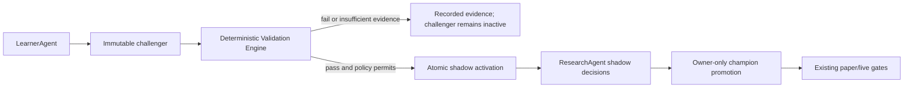

# Feature Architecture: Automated Strategy Validation and Shadow Routing

## Status

Architecture status: Approved by owner
Approved date: 2026-07-12
Roles: Codex Architect + Builder
Implementation allowed: Yes

## Purpose

Run evidence validation whenever Kairos creates a strategy challenger, without
requiring an owner to press a Backtest button. A passing challenger may enter
bounded, non-executing shadow evaluation automatically. It must never replace a
champion, alter a user mandate, activate paper fills, or enable live trading.

## Product Contract

1. LearnerAgent creates an immutable challenger as it does today.
2. If automation is enabled for that market, the same server action runs the
   deterministic Validation Engine before reporting the learner result.
3. A passing challenger is atomically moved to `shadow_paper` only when the
   market has no other automated shadow challenger.
4. ResearchAgent records shadow decisions only; shadow state cannot create
   orders, paper fills, cash movement, or live proposals.
5. A scheduled sweep retries challengers that have no validation record, so a
   restart or transient local HTTP failure cannot leave a challenger untested.
6. The owner can disable automation independently for US and India. Disabling
   stops new automatic validation and shadow activation immediately; it does
   not delete challengers, experiments, or historical shadow evidence.

## Authority

`hard safety/risk gates` -> `user trading mandate` -> `champion` ->
`automated validation` -> `shadow evidence` -> `owner promotion` -> `paper/live`.

Validation is deterministic and LLM-free. The manual Backtest page remains an
exploratory tool and cannot promote a strategy. Passing validation establishes
only statistical eligibility for shadow evidence; the existing owner-only,
fail-closed champion-promotion RPC remains unchanged.

## Data Model

`strategy_validation_automation`, one row per market:

- `market` (`us | india`) primary key;
- `enabled`: permits automatic deterministic validation;
- `auto_shadow_enabled`: permits a passing candidate to enter shadow state;
- `max_active_shadows`: hard bounded at one for the initial release;
- audit timestamps and `updated_by`.

The schema seeds both markets enabled because this feature is explicitly
approved. Missing-table or missing-row behavior is fail-closed: existing manual
validation remains available but no automatic state changes occur.

`activate_strategy_shadow(version_id)` is a service-role-only RPC. It locks
the market, confirms an enabled policy and a passed experiment belonging to the
challenger, rejects terminal/champion states, enforces the shadow cap, then
transitions only that challenger to `shadow_paper`.

## Flows

The validation sweep considers only challengers with no prior validation
experiment. It is bounded per market. A failed experiment is preserved rather
than overwritten; a future evidence-refresh design must use an explicit
dataset-version rule rather than silently rerunning failed experiments.

## TradingView Boundary

TradingView/Pine remains optional, manual corroboration and webhook-based
forward-test input. No TradingView UI automation, scraping, or assumed general
backtest-results API is part of this architecture. Kairos authority evidence
comes from its stored, reproducible US/India data snapshots.

## Reversibility

- Set `enabled=false` to stop automatic validation for one market.
- Set `auto_shadow_enabled=false` to retain automatic evidence generation but
  stop automatic shadow routing.
- Existing shadow strategies can be manually paused, rejected, or retired with
  the existing registry controls; no history is deleted.
- Removing the scheduled sweep only removes retries. No schema or data rollback
  is required to return to manual validation.

## Files

- `supabase/migrations/170_strategy_validation_automation.sql`
- `lib/validation/automation.ts`
- `app/api/agents/learner/route.ts`
- `app/api/validation/sweep/route.ts`
- `app/api/settings/validation-automation/route.ts`
- `components/dashboard/ValidationAutomationPanel.tsx`
- `app/dashboard/settings/page.tsx`
- `scripts/run-agents.ps1`
- `scripts/register-tasks.ps1`

## Non-Goals

- A second historical backtesting engine.
- Automatic champion promotion, paper fills, broker proposals, or live orders.
- TradingView credential/API integration or browser automation.
- Rewriting any existing validation result or shadow decision.

## Acceptance Gates

- Per-market disable blocks new automatic validation and shadow activation.
- A new challenger validates synchronously through the server action, with no
  fire-and-forget local HTTP dependency.
- A passing challenger can create at most one active automated shadow per market.
- Failed/insufficient validation leaves a challenger inactive and is auditable.
- The sweep retries only unvalidated challengers.
- Owner promotion remains mandatory and fail-closed on passed evidence.
- Typecheck, tests, production build, and dependency audit pass.
