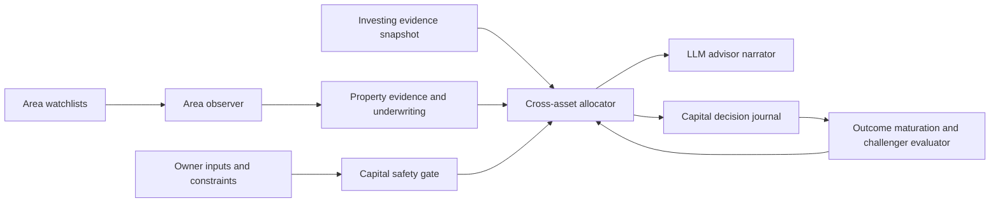

# Capital Advisor

## Status

Proposed on 2026-08-08. Architecture only. No capital allocation, securities
order, property purchase, refinancing, HELOC draw, or mortgage prepayment is
authorized by this document.

## Decision

Build a new owner-only **Capital Plan** workspace above the existing Investing
and Property workspaces. It answers one constrained question:

> Given the owner's stated goals, cash, liquidity need, debt terms, and
> evidence quality, which use of the next dollar deserves review: keep cash,
> reduce debt, add to a governed securities sleeve, or pursue a saved property
> thesis?

It is decision support, not a broker, lender, property marketplace, appraisal,
or autonomous adviser. It can recommend `watch`, `review`, `outside_policy`,
or `insufficient_evidence`; it must not issue an imperative buy, sell, borrow,
or refinance command.

This is deliberately not a new tab inside Property. The Property workspace is
correctly isolated from brokerage accounts and portfolio cash. Capital Plan is
the sole cross-workspace reader and consumes read-only, currency-labelled
summaries from both sides.

## User Jobs

1. Maintain a watchlist of cities, ZIPs, localities, and property theses.
2. Evaluate a rental house, 2-4 unit building, land parcel, or apartment thesis
   with stated assumptions and downside cases.
3. Compare an optional mortgage principal payment with retaining cash or adding
   to an investment sleeve on a consistent after-cost, risk, and liquidity basis.
4. Understand why Kairos changed its view and what evidence would change it
   again.
5. Review historical advice versus subsequent outcomes without allowing a few
   good calls to create an unsupported allocation rule.

## Non-Goals

- No exact ZIP ROI forecast, property AVM, appraisal, listing recommendation,
  tenant selection, lender approval, or loan offer.
- No scraping Zillow, Redfin listing pages, MLS, housing portals, or Indian
  listing sites. Source contracts are required even for aggregate feeds.
- No protected-class, demographic, school-rating, crime, or other proxy-based
  ranking. ZIP/locality is a geographic evidence scope, not a desirability or
  borrower-risk score.
- No automatic stock sale, broker order, property purchase, mortgage payoff,
  refinance, HELOC draw, or transfer of capital.
- No cross-currency optimization. US USD, India INR, and each securities market
  remain independent until an owner explicitly supplies an FX and tax scenario.

## Inputs And Privacy

### Capital profile

The owner explicitly maintains:

- emergency-reserve months and minimum cash floor;
- investable surplus, recurring monthly surplus, and tax assumptions;
- horizon, liquidity deadline, maximum property concentration, and leverage
  ceiling;
- property strategy: owner-occupied, long-term rental, 2-4 unit, land, or
  commercial apartment;
- whether a comparison is an analysis only or a future action the owner might
  personally execute.

### Mortgage and financing profile

For each financing account, store encrypted terms already used by Property:

- principal, rate type, stated rate/index/margin, remaining term, payment,
  prepayment penalty, recast eligibility, and deductible-interest assumption;
- owner-declared tax treatment and any known lender restriction;
- an optional proposed principal payment and funding source.

The system never infers a tax deduction, lender permission, or credit decision.
Unknown terms produce `insufficient_evidence`.

### Cross-workspace read boundary

Capital Plan reads a summarized snapshot, never raw broker credentials, full
property address, loan document, or unredacted account number:

| Source | Permitted snapshot | Prohibited |
|---|---|---|
| Investing | currency, liquid cash, sleeve value, benchmarked outcome range, risk and data-quality state | broker token, order endpoint, individual order payload |
| Property | geography ID, asset type, underwriting scenario range, financing metrics, evidence freshness | exact address, document payload, lender quote image |
| Owner profile | declared constraints and assumptions | automatic inference of protected or sensitive characteristics |

All snapshots are timestamped and versioned. An expired input cannot become a
current recommendation.

## Evidence Model

### Area watchlists

`capital_area_watchlists` records an owner-selected city, ZIP, locality, or
metro, asset type, intended strategy, budget range, hold horizon, and watch
conditions. It is not a universe crawler.

Cadence follows source reality:

- metro evidence can refresh weekly where the approved source publishes weekly;
- ZIP evidence refreshes monthly or at the source's rolling-window cadence;
- locality/PIN evidence is unavailable until a lawful local source is active;
- a data revision creates a new observation, never a silent overwrite.

For example, Redfin says ZIP/neighborhood monthly measures use rolling
three-month windows; a weekly ZIP alert therefore has no evidentiary basis.
Redfin remains `contract_pending` until reuse terms are recorded.

### Underwriting scenarios

`capital_property_theses` and immutable `capital_underwriting_runs` hold only
owner inputs and approved market evidence.

| Asset type | Required metrics | Must remain separate |
|---|---|---|
| Rental home / condo | purchase, rent, vacancy, tax, insurance, maintenance, HOA, management, debt service, sale cost | personal home and commercial property |
| 2-4 unit | unit-level rent and vacancy, debt service, repair reserve | single-family default assumptions |
| Land | carrying cost, tax, zoning/utilities evidence, liquidity, development assumption | rent, cap rate, and DSCR defaults |
| Apartment 5+ units | commercial NOI, debt structure, occupancy, cap-exit sensitivity | residential comparable or owner-home model |

Outputs include cash flow, cap rate, cash-on-cash range, DSCR, debt paydown,
break-even sale price, downside sensitivity, and an IRR range. Every output
binds inputs, source IDs, data cutoff, calculation version, and currency.

### Securities comparison

The public-equity sleeve contributes only evidence Kairos can support today:

- current liquid cash and policy sleeve state;
- benchmark-relative realized performance and data-quality state;
- a scenario range only when its policy/model has passed its own validation
  gate.

Kairos must not convert an unvalidated stock score into a precise expected
return just to make the property comparison look complete. When no qualified
equity-return range exists, Capital Plan shows it as `not comparable` rather
than inventing a winner.

## Deterministic Decision Engines

### 1. Capital safety gate

Before comparing opportunities, reserve:

1. the owner-declared emergency cash floor;
2. known near-term obligations and property repairs;
3. taxes, transaction costs, and required down-payment liquidity;
4. the maximum debt and property-concentration constraints.

If available capital is below this floor, every deploy-capital alternative is
`outside_policy`. The tool may still explain the scenario.

### 2. Mortgage principal payment versus investing

This engine compares **uses of surplus cash**, not total account balances.

For a proposed principal payment, it calculates:

- scheduled interest saved, term reduction, and cash-flow effect separately;
- effective guaranteed return from avoided interest under the owner-declared
  tax treatment;
- prepayment penalty and the difference between principal reduction and a
  lender-approved recast;
- liquidity lost and the effect on LTV/CLTV and payment stress;
- downside cases for variable-rate/indexed loans.

For retaining cash or investing, it compares only a qualified scenario range
after fees, taxes, liquidity haircut, and drawdown range. A historical market
return is not an expected return. The decision summary must show the same
horizon for both sides.

Default outcomes:

| Condition | Output |
|---|---|
| Emergency reserve, tax treatment, penalty, or rate terms unknown | `insufficient_evidence` |
| Principal payment violates cash floor or impending obligation | `outside_policy` |
| Mortgage saving dominates the qualified alternative across downside cases | `review_principal_payment` |
| Qualified alternative dominates but requires an unvalidated forecast | `watch`, not invest |
| Ranges overlap materially | `indifferent_under_assumptions` |

No result sells securities, moves money, or tells the owner to skip an employer
match, retirement contribution, insurance, or tax obligation. Those are
explicitly outside the initial scope.

### 3. Cross-asset comparison

Every candidate is compared using a declared common frame:

- after-cost nominal and real return range;
- downside loss/range and leverage sensitivity;
- liquidity and time-to-deploy/time-to-exit;
- tax and transaction cost assumptions;
- concentration impact relative to capital policy;
- evidence quality and forecast calibration state.

The primary ranking is **fit to declared constraints**, not highest midpoint
ROI. A high leverage property with a wide loss range cannot outrank a liquid
investment merely because its base-case IRR is larger.

## Agent Structure

### AreaObserver

Deterministic collector and classifier. It reads only approved, market-local
sources and records price/rent/supply/financing context with cadence and
freshness. It cannot rank areas or interact with brokerage/lending systems.

### UnderwritingEngine

Pure deterministic calculation over owner assumptions and evidence. It creates
immutable scenario runs and fails visibly when inputs are missing.

### CrossAssetAllocator

Pure deterministic policy engine. It applies cash, leverage, liquidity,
concentration, and evidence-quality gates before presenting any comparison. It
cannot call a broker, lender, property source, or LLM.

### AdvisorNarrator

LLM-only explanation layer. Its tool input is a sealed, typed evidence envelope
from the allocator. It may explain `why`, list assumptions, name missing data,
and propose questions for the owner. It cannot alter values, rank candidates,
write a recommendation state, or use uncited web text.

### CapitalLearner

The learner does not reward or punish an LLM. It measures calibrated outcomes:

- area regime/forecast versus subsequent published market observations;
- underwriting forecast versus owner-entered actual rent, expenses, vacancy,
  refinance, or sale evidence;
- allocator recommendation versus a declared passive/cash counterfactual.

It may create a new **shadow policy** with a predeclared hypothesis. It may not
modify capital policy, a mortgage result, a property thesis, stock score,
broker setting, or live allocation. Promotion requires enough independent,
matured outcomes, same-market comparison, costs, drawdown, calibration, and an
owner approval.

## User Experience

### Capital Plan overview

Show one current-state panel:

- `Capital available after reserve`;
- current debt, property, cash, and securities concentration by currency;
- best evidence-backed watch item, if any;
- why no item is actionable when that is the correct answer;
- source freshness and data-quality badges.

### Area watch detail

For each saved city/ZIP/locality, show:

- trend and supply/demand charts at the source's true cadence;
- asset-type-specific evidence and missing inputs;
- owner-declared buy/rent/land criteria;
- weekly/monthly change log and alert conditions;
- a cited LLM brief that cannot introduce a new numerical claim.

### Mortgage decision detail

Show a side-by-side comparison of `pay principal`, `hold cash`, and qualified
investment alternatives. Include interest saved, term change, liquidity lost,
range comparison, tax/penalty assumptions, and the exact reason for the result.
The owner must enter a proposed amount; the app never assumes all extra cash is
available.

### Decision journal

Every displayed recommendation records policy version, evidence IDs, model
version, inputs, output state, explanation hash, owner decision, and later
outcome. A later LLM summary cannot rewrite the original rationale.

## Data And Compliance Gates

- Aggregate US source use requires a documented contract. Redfin publishes
  broad market metrics across metros and ZIPs, but its releases can be revised;
  it remains inactive until Kairos records permitted reuse and revision policy.
- Census ACS may provide slow-moving geographic context, not a near-term price
  signal; current API access requires a key.
- FHFA, FRED, and BLS remain market context only according to their current
  data contracts.
- No protected-class or proxy feature may enter a geography score. The Fair
  Housing Act prohibits discrimination in housing and housing-related lending.
- This is a private, single-owner decision-support system. Before serving other
  users, accepting compensation, or executing personalized securities advice,
  obtain legal/compliance review. Automated personalized investment programs
  can be subject to investment-adviser requirements.

## Delivery Sequence

### P0: Architecture and policy only

Create this document, a decision record, and a reusable evidence-envelope
contract. No new UI, LLM, source, or money-path behavior.

### P1: Capital profile and manual scenarios

Add encrypted owner inputs, deterministic mortgage principal comparison, and
manual property underwriting. Results are explanation-free until the
deterministic outputs are verified.

### P2: Area watchlists and source-backed monitoring

Add city/ZIP/locality watchlists, true-cadence collection, source health, and
immutable snapshots. Start with Austin/Phoenix metro data; do not activate ZIP
or Bengaluru sources without a contract.

### P3: Read-only cross-asset comparison

Add the cross-workspace snapshot boundary, safety gate, and constraint-fit
comparison. Exclude unvalidated stock expected-return claims.

### P4: LLM narrative

Add the sealed AdvisorNarrator after P1-P3 are verified. It explains only
deterministic facts and is logged in the decision journal.

### P5: Shadow learning

Mature outcomes, compare predeclared challenger policies with the same-market
baseline, and expose calibration. No automatic promotion or capital movement.

## Acceptance Criteria

- An owner can compare a stated principal payment against cash/investment only
  after all required terms and reserve constraints are explicit.
- All calculations are deterministic, reproducible, versioned, and currency
  isolated.
- Every LLM statement maps to cited evidence IDs; it cannot change a numerical
  output or execute an action.
- ZIP/locality monitoring respects each source's cadence and availability.
- A property or securities forecast with inadequate evidence cannot win a
  comparison by displaying a fabricated ROI.
- No Capital Plan path invokes a broker, lender, trade route, property purchase
  flow, or personal-document provider.
- Challenger policies remain shadow-only until matured outcome and owner
  approval gates pass.

## References

- Redfin market-data methodology and publication cadence:
  https://www.redfin.com/news/data-center/methodology/
- Census API available data and geography coverage:
  https://www.census.gov/data/developers/guidance/api-user-guide.Available_Data.html
- HUD Fair Housing rights and obligations:
  https://www.hud.gov/stat/fheo/rights-obligations
- SEC Investor Bulletin on robo-advisers:
  https://www.investor.gov/introduction-investing/general-resources/news-alerts/alerts-bulletins/investor-bulletins-45
