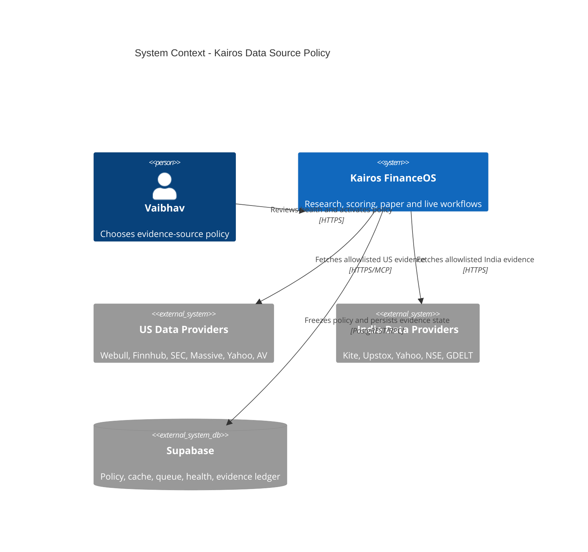
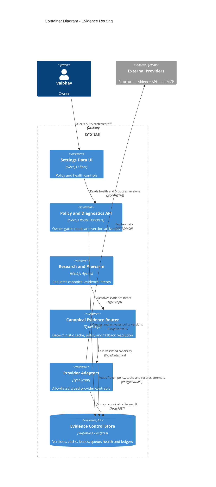
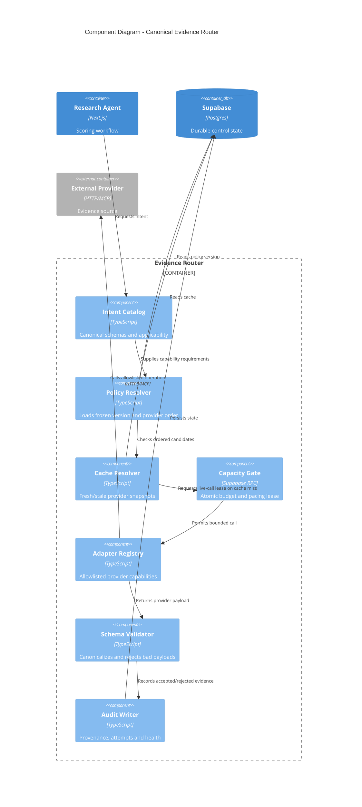

# Data Source Policy + Canonical Evidence Router — Feature Architecture

> Status: **DRAFT FOR CLAUDE + OWNER REVIEW. DESIGN ONLY.**
> Date: 2026-07-13
> Owner request: stop rewriting agent code and quota logic whenever a provider or
> MCP tool changes. Give the owner simple market/evidence controls while Kairos
> automatically handles provider selection, freshness, pacing, fallback, and audit.
> Implementation gate: no code, migration, provider activation, scoring change, or
> deployment until this architecture is reviewed and Vaibhav says `Proceed`/`Code it`.

## 1. Decision

Build one deterministic **Canonical Evidence Router** between agents and external
data providers. Agents request an evidence **intent**, never a provider or tool:

```ts
await evidenceRouter.resolve({
  market: "us",
  symbol: "AAPL",
  intent: "fundamentals.reported",
  asOf: decisionTs,
  runId,
});
```

Settings exposes `Auto`, `Prefer <provider>`, `<Provider> only`, and `Off` per
market + evidence intent. `Auto` is the default and recommended mode. The router
owns the provider chain, durable cache, contract validation, quota/pacing, stale
policy, source health, and provenance.

Raw MCP tool names and provider URLs are never user-configurable. Adding or
changing a provider requires one allowlisted adapter, not edits across agents.

## 2. Why this is needed now

Kairos currently has several overlapping abstractions:

- `lib/data/provider-interface.ts` exposes provider-first methods, but only AV/FMP
  are substantially implemented and its result types do not carry field-level
  basis, period, currency, or provenance.
- `lib/data/provider-fetch.ts` centralizes HTTP caching/budgets but cannot carry
  MCP calls, treats `dailyBudget=null` as both rate-only and unknown, and does not
  express capability/market/entitlement.
- `lib/data/fundamentals.ts` hardcodes a provider chain and maps everything into an
  Alpha Vantage-shaped string object, losing per-field source and metric basis.
- `lib/data/webull-data.ts` separately opens MCP sessions and uses process-local
  caching, bypassing the durable provider budget/pacing/cache path.
- Settings → Data is observational only. It cannot safely alter routing.
- `lib/data/evidence.ts` has a closed source-name union that omits current sources,
  while `computeScores()` writes inaccurate generic source labels.

This feature consolidates those paths. It does not add a second parallel data
system and does not replace the immutable evidence ledger.

### Relationship to older feature documents

After owner approval, this document supersedes the provider-routing, cache-control,
quota-model, and Settings-control sections of:

- `features/data-provider-abstraction/FEATURE_ARCHITECTURE.md`
- `features/data-availability-layer/FEATURE_ARCHITECTURE.md`

Those documents remain historical evidence of why the current adapters/pacing were
built. Their already-shipped behavior remains the legacy fallback until this router
passes rollout gates. Any provider capability claim that conflicts with this document
must be re-probed rather than copied forward.

## 3. Confirmed defects to repair in the implementation

The following were verified against the live read-only Webull MCP contract on
2026-07-13. They are acceptance-test requirements, not optional cleanup.

### P0 — Webull calls silently fail

`get_analyst_rating`, `get_analyst_target_price`, `get_stock_forecast_eps`, and
`get_financial_indicators` require:

```json
{ "symbol": "AAPL", "category": "US_STOCK" }
```

The current adapter sends only `{ symbol }`. Because it is fail-soft, all calls
return `null` without making the failure visible to the research run.

**Fix:** the typed Webull adapter owns constant `category: "US_STOCK"`; callers
cannot omit or override it.

### P0 — Webull payload parsing is wrong

- Forecast EPS is an array of fiscal periods with fields including `est`,
  `actual`, and `reported`; the current parser unwraps the first object and does
  not recognize `est`.
- Financial indicators are `{ currency, values: { metric: [{ fiscal_year,
  fiscal_period, value }] } }`; the current numeric flattener treats arrays as
  scalar values and returns no usable data.
- Analyst ratings use `strong_buy`, `buy`, `hold`, `under_perform`, `sell`, and
  `number`. The current parser ignores `under_perform`, biasing consensus upward.

**Fix:** use explicit schema validators and period selection. Do not use generic
first-record unwrapping for financial data.

### P1 — Cache is not serverless-durable

The Webull six-hour `Map` exists only inside one Vercel process. Cold starts and
parallel instances repeat calls, while a negative result can remain hidden in a
warm instance.

**Fix:** all provider responses use Supabase-backed `evidence_cache_v2`. A small
process cache may remain only as a non-authoritative micro-cache.

### P1 — Provenance is inaccurate

`computeScores()` records fundamentals/ohlcv evidence as Alpha Vantage even when
Finnhub, Yahoo, Massive, Upstox, or another provider served it.

**Fix:** the resolver returns canonical field-level provenance; scoring writes
the actual evidence references and policy version.

### P1 — Unknown quota is displayed as unlimited

Settings currently renders `dailyBudget=null` as `no cap (rate-limited)`. For
Yahoo/Webull and other providers, no published daily limit may mean **unknown**,
not unlimited.

**Fix:** model daily-limit knowledge, rate-limit knowledge, and subscription
entitlement as separate fields. UI must display `Unknown` and use conservative
pacing whenever a limit is unknown.

### P2 — Diagnostic surface is broader than necessary

`POST /api/broker-mcp/[broker]/tools` exists only so a cron helper can enumerate
tools. Tool discovery is now complete and the route exposes provider descriptions
to anyone holding `CRON_SECRET`.

**Fix:** after contract fixtures are captured, remove the POST alias. Keep an
owner-only GET diagnostics route only if Settings needs it; otherwise remove the
route. It must never call tools or return credential/token data.

## 4. Scope

### In scope

- US and India evidence routing.
- Fundamentals, analyst consensus, daily bars, quotes, sentiment, insider,
  earnings/calendar, corporate actions, and macro evidence intents.
- Code-owned provider capabilities and typed adapters.
- Versioned owner policy with `Auto`/preferred/only/off modes.
- Durable cache, pacing, refresh queue, call ledger, health, and diagnostics.
- Settings product controls and provider capacity visibility.
- Compatibility adapter for existing AV-shaped scoring inputs during migration.
- Webull research adapter fixes and shadow validation.

### Explicitly out of scope

- Any broker/order routing or order scopes.
- Enabling Webull orders or changing its `orderCapable=false` gate.
- New signal weights or making Webull analyst consensus a scored dimension.
- Letting an LLM select providers, quotas, fallbacks, or data values.
- Arbitrary provider URLs/tool names entered through Settings.
- Python sidecar/GitHub Actions worker in this phase.
- Paid provider upgrades.

## 5. Non-negotiable invariants

1. Provider routing is deterministic; no LLM participates.
2. US and India resolve independently. No cross-market or cross-currency merge.
3. Every scored field records provider, basis, period, currency, observation time,
   retrieval time, and quality state.
4. `unknown` quota never means unlimited.
5. A missing provider/config/cache read fails unavailable, never fabricated neutral.
6. Structurally inapplicable evidence remains distinct from unavailable evidence.
7. A provider switch must not silently change metric meaning (for example forward
   P/E cannot replace TTM P/E under the same canonical field).
8. Policy changes apply only to future research runs. Each run freezes one active
   policy version per market.
9. A provider outage cannot touch cash, positions, proposals, or broker orders.
10. Database configuration can select only providers/capabilities compiled into
    the allowlisted code registry.
11. Raw provider prose is never inserted directly into an LLM prompt. Only
    schema-validated, bounded canonical fields may be rendered.
12. Existing scoring availability-mask + renormalization semantics remain intact.
13. A policy cannot become production-active if its only material effect is removing
    scored evidence in a way that newly creates entry eligibility. `Only`/`Off` for
    score-affecting intents remain diagnostic/shadow unless separately approved as a
    scoring-policy change.
14. Router price intents are research/chart evidence only. Execution sizing, fills,
    stops, broker reconciliation, and order previews retain their existing verified
    money-path quote sources until separately architected.

## 6. Product behavior

### Default owner experience

Settings → Data gains two views:

1. **Routing Policy** — the primary view.
2. **Provider Health** — capacity, credentials, freshness, errors, and diagnostics.

Routing Policy is a market-tabbed matrix:

| Evidence | Mode | Preferred | Effective chain | Freshness | Status |
|---|---|---|---|---|---|
| Fundamentals | Auto | Recommended | Finnhub → Webull → Yahoo → AV | 14d | Healthy |
| Analyst consensus | Auto | Webull | Webull → Finnhub | 3d | Healthy |
| Daily prices | Auto | Massive | Massive → EODHD → AV | EOD | Healthy |
| Sentiment | Auto | GDELT | StockTwits → GDELT → AV reserve | 1d | Degraded |

The provider dropdown lists only validated providers supporting that market and
intent. A provider must be `production_eligible` for score-affecting intents;
contract validity alone is insufficient. Unhealthy, disconnected, unentitled, or
contract-invalid providers are disabled with a short reason.

### Modes

- `Auto` — use the code-owned recommended chain, health, fresh cache, and capacity.
- `Prefer` — place the selected provider first, then use the safe Auto fallbacks.
- `Only` — use only the selected provider/cache; unavailable means unavailable.
  This is an advanced diagnostic option and displays a starvation warning. For a
  scored intent it is shadow-only.
- `Off` — intent is intentionally unavailable. For scored intents this is
  shadow-only because removing a dimension can change renormalized scores.

### Owner should not manage quotas routinely

Provider limits and pacing defaults live in the code registry and are updated once
per provider adapter. Settings shows them but does not require repeated adjustment.
Advanced controls permit conservative overrides only:

- lower daily cap;
- larger minimum interval;
- larger reserved-call buffer;
- disable provider;
- shorten stale allowance.

The UI cannot raise a limit above the code-known ceiling unless the provider's
entitlement/tier is also explicitly changed and contract-probed.

### Change and rollback UX

- Save creates an immutable policy version; it does not mutate the active pointer.
- A confirmation summarizes changed rows and says “Applies next research run.”
- Activate atomically updates the active-policy pointer for one market.
- `Restore Auto` creates/activates a new all-Auto version.
- Recent versions show who changed them, when, and a compact diff.
- Disabling the router feature flag immediately returns that market to the legacy
  chain without deleting policies or cache.

## 7. C4 system context



## 8. C4 containers



## 9. Router components and dynamic flow



### Resolution sequence

1. Validate market/symbol/intent and determine structural applicability.
2. Load the policy version frozen at research-run start.
3. Build provider candidates from the code registry and policy mode.
4. Remove providers that are disabled, contract-invalid, unauthorized for the
   market/intent, circuit-open, or known to lack entitlement.
5. Read fresh canonical cache in provider order.
6. If no fresh hit, atomically reserve budget and pacing for at most two synchronous
   provider attempts within the caller's wall-clock budget.
7. Validate provider payload and canonical metric semantics.
8. Persist canonical cache + append-only evidence/attempt records before returning
   evidence that can influence scoring.
9. If live fetch cannot proceed, return policy-allowed stale evidence and enqueue a
   refresh job. Otherwise return typed unavailable status.
10. Never spin-wait for a provider slot inside Vercel.

## 10. Canonical intent catalog

Initial intent IDs are code constants, not arbitrary DB strings:

| Intent | Markets | Canonical result | Default fresh TTL | Stale ceiling |
|---|---|---|---:|---:|
| `price.quote` | US/India | price, currency, market time | 2 min/session | 1 day, display only |
| `price.daily_bars` | US/India | adjusted OHLCV series | current EOD | 3 trading days |
| `fundamentals.reported` | US/India | margin, ROE, EPS, revenue growth | 14 days | 45 days |
| `fundamentals.valuation` | US/India | TTM/forward P/E with basis | 3 days | 14 days |
| `analyst.consensus` | US initially | rating counts, target range, forecast EPS | 3 days | 14 days |
| `sentiment.news` | US/India | aggregate tone + sample count | 1 day | 3 days |
| `insider.transactions` | US/India if supported | normalized filings | 1 day | 7 days |
| `events.earnings` | US/India | event time and estimates | 1 day | no stale past event |
| `events.corporate_actions` | US/India | dividend/split/action | 1 day | no stale past ex-date |
| `macro.regime_inputs` | market-scoped | point-in-time macro values | provider cadence | one cadence |

TTL values are policy defaults, not proof that the underlying observation is
current. `observedAt`/`periodEnd` remain explicit.

## 11. Canonical contracts

```ts
type Market = "us" | "india";
type EvidenceIntent =
  | "price.quote"
  | "price.daily_bars"
  | "fundamentals.reported"
  | "fundamentals.valuation"
  | "analyst.consensus"
  | "sentiment.news"
  | "insider.transactions"
  | "events.earnings"
  | "events.corporate_actions"
  | "macro.regime_inputs";

type EvidenceQuality =
  | "fresh"
  | "stale"
  | "partial"
  | "conflict"
  | "quarantined"
  | "unavailable"
  | "not_applicable";

interface FieldProvenance {
  providerId: ProviderId;
  providerField: string;
  basis: "ttm" | "forward" | "annual" | "quarterly" | "spot" | "eod";
  periodEnd?: string;
  observedAt?: string;
  retrievedAt: string;
  currency?: "USD" | "INR";
  unit: "fraction" | "currency" | "per_share" | "count" | "ratio" | "text";
}

interface CanonicalField<T> {
  value: T;
  provenance: FieldProvenance;
}

interface EvidenceEnvelope<T> {
  schemaVersion: "evidence-v1";
  market: Market;
  symbol?: string;
  intent: EvidenceIntent;
  quality: EvidenceQuality;
  payload: T | null;
  providersAttempted: ProviderId[];
  policyVersionId: string;
  cacheState: "fresh" | "stale" | "miss";
  unavailableReason?: UnavailableReason;
  resolvedAt: string;
}
```

`UnavailableReason` is an enum including `auth_missing`, `entitlement_missing`,
`contract_invalid`, `rate_limited`, `daily_budget`, `timeout`, `provider_error`,
`schema_invalid`, `genuine_no_data`, `chain_exhausted`, `disabled_by_policy`, and
`not_applicable`.

## 12. Provider adapter contract

```ts
interface ProviderAdapter<I extends EvidenceIntent> {
  readonly providerId: ProviderId;
  readonly intent: I;
  readonly contractVersion: string;
  fetch(request: ProviderRequest<I>, ctx: ProviderCallContext): Promise<ProviderResult<I>>;
  validate(raw: unknown): ProviderResult<I>;
  toCanonical(result: ProviderResult<I>): CanonicalPayloadByIntent[I];
}
```

Provider specs are code-owned:

```ts
interface ProviderSpec {
  id: ProviderId;
  label: string;
  transport: "http" | "mcp";
  markets: readonly Market[];
  capabilities: readonly EvidenceIntent[];
  dailyLimitState: "known" | "none" | "unknown";
  dailyLimit?: number;
  rateLimitState: "known" | "none" | "unknown";
  rateLimitCalls?: number;
  rateLimitWindowSeconds?: number;
  minIntervalMs: number;
  reserveCalls: number;
  entitlementRequired: boolean;
  credentialRef?: string;
  trustTier: 1 | 2 | 3 | 4 | 5;
  official: boolean;
}
```

DB overrides can only make these limits more conservative unless a code change
updates the provider entitlement/ceiling.

## 13. Webull adapter specification

### Allowed research tools

The research adapter allowlist contains only:

- `get_analyst_rating`
- `get_analyst_target_price`
- `get_stock_forecast_eps`
- `get_financial_indicators`
- later, after fixtures: `get_income_statement`, `get_balance_sheet`,
  `get_cash_flow`, `get_company_profile`, `get_financial_alert`,
  `get_stock_industry_comparison`

No tool name is read from DB or request input. No order tool is imported.

### Analyst normalization

- Send `{ symbol, category: "US_STOCK" }`.
- Validate symbol/category echoed by Webull.
- Normalize string numeric fields with finite/range checks.
- Consensus weights: `strong_buy=100`, `buy=80`, `hold=50`,
  `under_perform=20`, `sell=0`.
- Compare the sum of rating buckets with `number`; if mismatch exceeds one, mark
  partial/conflict and preserve raw counts without producing a normalized score.
- Target price preserves mean/median/high/low/currency/effective date.
- Forecast EPS selects the nearest future `reported=false` fiscal period. It never
  treats historical `actual` EPS as forecast EPS.

### Fundamentals normalization

- Request explicit `type` (`ANNUAL` initially) and bounded `count` (2–5).
- Parse each metric array by fiscal year/period; never flatten arrays generically.
- `net_margin` and `roe` are stored as fractions, not percentages.
- Preserve provider currency and period.
- Do not infer TTM from annual data. Add quarterly/TTM derivation only under a
  separate tested adapter version.
- Map only explicitly validated fields. Unknown numeric leaves remain diagnostics,
  not canonical scoring inputs.

### Caching and failure behavior

- Analyst TTL 3 days; financials TTL 14 days.
- Negative cache only deterministic `genuine_no_data` for 6 hours.
- Auth, entitlement, timeout, schema, and provider errors are not long negative
  cached; they update health/circuit state and may use stale canonical cache.
- One MCP session may be reused, but calls are sequential until Webull documents or
  tests prove concurrent calls on one session are safe.
- Token and provider error redaction remains mandatory.

### Scoring posture

Webull analyst evidence remains narrative/measurement-only. It cannot change the
deterministic analyst score until it has sufficient point-in-time outcomes and an
approved scoring architecture. Webull reported fundamentals may become a fallback
only after shadow comparison proves field semantics against existing sources.

## 14. Database design

Before implementation, list live migrations/tables/functions. Migration 176's
`provider_pacing`/`try_acquire_provider_slot` exists in production but is not
tracked in this repository; the implementation must first add an idempotent repair
migration matching the live schema. Never blindly recreate or rename it.

### `evidence_policy_versions` — immutable

| Column | Type | Rule |
|---|---|---|
| `id` | uuid PK | generated |
| `market` | text | checked `us`/`india` |
| `version` | int | unique per market |
| `router_enabled` | bool | false during rollout |
| `created_by` | uuid | owner |
| `created_at` | timestamptz | audit |
| `change_note` | text | bounded owner note |

Rows never change after insertion. UPDATE/DELETE is trigger-blocked.

### `active_evidence_policy` — mutable pointer

| Column | Type | Rule |
|---|---|---|
| `market` | text PK | `us`/`india` |
| `policy_version_id` | uuid FK | same-market immutable version |
| `activated_by` | uuid | owner |
| `activated_at` | timestamptz | audit |

The activation RPC updates this pointer under a per-market advisory lock. A trigger
or RPC validation prevents a US pointer from referencing an India policy. Policy
history remains immutable and rollback means pointing to a prior version or creating
a new all-Auto version. Activation also validates that the target version has exactly
one valid rule for every required intent before changing the pointer.

### `evidence_policy_rules` — immutable children

| Column | Type | Rule |
|---|---|---|
| `policy_version_id` | uuid FK | cascade prohibited |
| `intent` | text | code-validated enum |
| `mode` | text | `auto`/`prefer`/`only`/`off` |
| `preferred_provider` | text nullable | required for prefer/only |
| `max_age_seconds` | int | conservative bounded range |
| `stale_max_seconds` | int | >= max age, bounded |
| `max_sync_attempts` | int | 0–2 |
| `advanced_config` | jsonb | future compatible, size bounded |

Primary key `(policy_version_id, intent)`.

### `provider_runtime_config` — current operational controls

| Column | Type | Rule |
|---|---|---|
| `provider_id` | text PK | must exist in code registry at runtime |
| `enabled` | bool | false blocks live calls, cache may remain visible |
| `daily_limit_state` | text | `known`/`none`/`unknown` |
| `daily_limit_override` | int nullable | cannot exceed code ceiling |
| `rate_limit_state` | text | `known`/`none`/`unknown` |
| `rate_limit_calls_override` | int nullable | cannot exceed code ceiling |
| `rate_window_seconds_override` | int nullable | cannot shrink code window |
| `min_interval_ms_override` | int nullable | cannot be lower than code floor |
| `reserve_calls_override` | int nullable | >= code minimum |

Owner-read; writes only through owner-gated API using the service role after code
validation. No direct authenticated writes.

### `provider_capability_status` — provider/intent maturity

| Column | Type | Rule |
|---|---|---|
| `provider_id`/`market`/`intent` | text | composite PK |
| `contract_state` | text | `unverified`/`valid`/`invalid` |
| `maturity_state` | text | `discovered`/`contract_valid`/`shadow_validated`/`production_eligible` |
| `entitlement_state` | text | `unknown`/`active`/`inactive` |
| `contract_version` | text | must match code adapter |
| `last_probe_at` | timestamptz | operational evidence |
| `last_shadow_evaluation_id` | uuid nullable | proof link |

Maturity is capability-specific: Webull analyst can be eligible while Webull
fundamentals remains shadow. The owner API may disable a capability, but promotion
to `production_eligible` requires a code-known adapter version plus a passing shadow
evaluation. A DB row can never create a capability absent from the code registry.

### `evidence_policy_evaluations` — append-only shadow proof

Stores candidate policy version, baseline production version, market, symbol/run
sample, coverage delta, schema failures, provider disagreement, score delta,
entry-eligibility flips, call usage, and pass/fail reasons. Production activation of
a score-affecting policy requires a passing evaluation and explicit owner action.

### `evidence_cache_v2` — mutable current cache

| Column | Type | Rule |
|---|---|---|
| `market`/`symbol`/`intent`/`provider_id` | text | composite identity |
| `request_fingerprint` | text | contract + normalized request hash |
| `schema_version` | text | canonical schema |
| `payload` | jsonb | canonical only, size bounded |
| `quality_state` | text | fresh/partial/conflict/quarantined |
| `observed_at`/`period_end` | timestamptz/date | semantic time |
| `fetched_at`/`expires_at`/`stale_until` | timestamptz | cache policy |
| `currency`/`basis` | text | checked canonical values |
| `payload_hash` | text | integrity/dedup |

Primary key `(market, symbol, intent, provider_id, request_fingerprint)`. Market-wide
intent uses a reserved symbol such as `__MARKET__`, never null ambiguity.

### `provider_call_ledger` — append-only operational audit

Records provider, intent, market, symbol hash/plain symbol, run ID, policy version,
cache outcome, lease outcome, started/completed timestamps, latency, HTTP/MCP status,
normalized error code, response bytes, and contract version. It stores no tokens,
URLs containing keys, headers, or raw error bodies.

### `provider_refresh_jobs` — durable queue

One active job per `(market,symbol,intent,provider_id,request_fingerprint)`. Claiming
uses a service-role-only `claim_provider_refresh_jobs()` RPC with `FOR UPDATE SKIP
LOCKED`, lease expiry, bounded batch size, attempt count, and `next_attempt_at`.
Jobs dead-letter after bounded retries and raise System Health issues.

### Existing tables retained

- `evidence_records` remains the immutable decision evidence ledger.
- `provider_budget` may remain as the daily rollup but becomes derived from or
  atomically updated alongside `provider_call_ledger`.
- `av_cache` remains during compatibility rollout; it is not the router cache.
- `provider_pacing` remains the atomic cross-process lease table.

### RLS and grants

- Enable RLS on every new table.
- Owner-email SELECT policy for policy/health/cache summaries where UI needs it.
- No `anon` access.
- No direct `authenticated` INSERT/UPDATE/DELETE.
- Service role performs agent writes.
- SECURITY DEFINER RPCs set `search_path`, validate all enums/ranges, revoke PUBLIC,
  and grant only `service_role`.
- Append-only triggers block UPDATE/DELETE on policy versions, rules, evaluations,
  and call ledger;
  only the active-policy pointer is mutable through its service-role RPC.

## 15. Policy APIs

### `GET /api/settings/data-routing?market=us`

Owner-only. Returns active version, rules, resolved effective chains, provider
availability, latest unactivated version, and change history. It never returns
credential values.

### `POST /api/settings/data-routing/versions`

Owner-only. Validates the complete matrix server-side and creates a new immutable
version without activating it. A service-role RPC allocates the next market version
under an advisory lock and inserts the header + complete rule set in one transaction.
It rejects unsupported market/intent/provider combinations.

### `POST /api/settings/data-routing/activate`

Owner-only. Calls atomic activation RPC. Activation never starts a research run and
never calls a provider. It affects only future runs. For a score-affecting change,
the RPC requires a passing `evidence_policy_evaluations` row against the currently
active baseline and explicit owner confirmation. Non-scored display/narrative policy
may activate after contract validation without the score-delta gate.

### `POST /api/settings/data-routing/restore-auto`

Owner-only. Creates and activates a new default version; does not mutate history.

### `GET /api/settings/data-providers`

Upgrade the existing endpoint to report daily-limit state, rate-limit state, known
limits, entitlement, contract status, cache hit rate, last success, consecutive
failures, circuit state, and source freshness. Remove the claim that every null
daily budget is uncapped.

## 16. Capacity, pacing, and health

### Atomic call admission

One RPC combines daily-budget reservation and minimum-interval lease. Counting a
call before external spend is conservative. The ledger distinguishes `reserved`,
`started`, and `completed` so unused reservations can be measured but never reused
in a race-prone way.

### Circuit breaker

Per provider + intent:

- open after 3 consecutive contract/auth/schema failures;
- transient timeout/5xx opens only after a higher threshold;
- cooldown is bounded and visible;
- one half-open probe is leased atomically;
- genuine no-data for one symbol does not degrade global provider health.

### Health states

`healthy | degraded | exhausted | disconnected | unentitled | contract_invalid |
unknown`. Health affects Auto routing but never alters a frozen canonical payload.

### Telemetry

- cache hit/stale/live/miss rates;
- success and schema-rejection rates by provider/intent;
- p50/p95 latency;
- fresh coverage by market/intent;
- calls and reserved headroom;
- fallback frequency and provider disagreement;
- refresh queue depth/oldest age/dead letters.

Existing `data-availability:<market>:<dimension>` alerts remain. Add provider-specific
issues only when actionable; avoid one issue per symbol.

## 17. Fundamental merging and conflict rules

Fundamentals are not a first-provider-wins blob. Canonical fields resolve separately:

- provider must support the required basis;
- freshest valid field in policy order wins;
- no blending of annual/quarterly/TTM/forward values;
- source-specific fields may coexist in one envelope with field provenance;
- material same-basis disagreement marks `conflict` and excludes that field until
  a trusted-tier rule resolves it or the conflict clears;
- a partial envelope is available only if it satisfies the intent's minimum field
  contract; otherwise it is unavailable and scoring renormalizes.

Compatibility phase maps canonical fields into the legacy AV-shaped object only at
the scorer boundary. The mapping includes a provenance sidecar and is deleted after
the scorer consumes canonical fields directly.

## 18. Security and abuse analysis

- **SSRF/tool injection:** provider URLs and MCP tool names exist only in code.
- **Prompt injection:** discard unstructured provider prose; render bounded canonical
  values through templates. Filing/news text remains in its separate sanitized path.
- **Prototype/property abuse:** validators create new plain canonical objects and use
  own-property checks; no arbitrary dotted-path traversal over provider objects.
- **Credential leakage:** service role and OAuth tokens remain server-side; logs store
  normalized error codes, never raw authorization/URL/header/error payloads.
- **Payload bombs:** response byte limit, JSON depth/array count bounds, timeout, and
  per-tool result schemas.
- **Cross-market contamination:** cache and policy keys include market; adapters check
  provider market/category and canonical currency.
- **Configuration escalation:** Settings cannot add order capability, tool names,
  scopes, URLs, or raise unknown quotas to unlimited.
- **Money-path isolation:** router modules are imported by research/prewarm/read APIs,
  not broker adapters or `execute-order.ts`.

## 19. Rollout and reversibility

### Phase 0 — schema reality and fixtures

1. Verify live tables/functions/migrations, especially out-of-band migration 176.
2. Capture sanitized contract fixtures for the Webull read tools and representative
   US symbols: AAPL, MSFT, JPM, BRK.B, one ETF, one no-data symbol.
3. Add tests before changing the adapter.

### Phase 1 — repair Webull without scoring impact

1. Add required `US_STOCK` category and explicit parsers.
2. Persist canonical Webull analyst/fundamental cache.
3. Keep analyst narrative/measurement-only.
4. Keep Webull fundamentals shadow-only; compare with Finnhub/Yahoo for at least five
   trading days and report coverage/disagreement.
5. Remove or narrow the diagnostic tools route.

### Phase 2 — canonical core behind flags

1. Add canonical contracts, intent catalog, adapter registry, durable cache, call
   ledger, pacing repair migration, and refresh queue.
2. Seed one all-Auto policy per market with `router_enabled=false`.
3. Dual-resolve legacy and canonical routes; canonical output is logged only.

### Phase 3 — Settings policy control

1. Add owner APIs and Routing Policy/Provider Health UI.
2. Activate policy versioning while router remains shadow-only.
3. Browser-test desktop/mobile, disabled options, version diff, restore Auto, and
   unknown-quota labels.

### Phase 4 — controlled research cutover

1. Enable router for paper research in US only.
2. Compare availability, canonical scores, provider calls, and decision deltas.
3. Enable India independently after its own evidence.
4. No live-autonomy change; signals continue through all existing gates.

### Phase 5 — cleanup

1. Move remaining direct provider calls behind adapters.
2. Replace inaccurate evidence source labels.
3. Retire provider-first abstraction and `av_cache` only after no callers remain.
4. Update architecture/database/cron docs and system map.

### Disable/rollback

Set the per-market router feature flag false. The legacy chain resumes next run;
policy versions, ledgers, and cache remain for audit. No migration rollback or data
deletion is required.

## 20. Required tests

### Unit/contract

- Every adapter fixture validates and canonicalizes expected fields.
- Webull missing category fails test; adapter always supplies `US_STOCK`.
- EPS chooses nearest future unreported `est` row.
- Analyst denominator includes `under_perform`; count mismatch becomes conflict.
- Financial period arrays preserve basis/period/currency and fraction scale.
- Unknown quota is not treated/displayed as unlimited.
- Unsupported provider/intent/market combinations are rejected.
- Forward and TTM fields never substitute for one another.
- Raw untrusted keys/prose cannot enter canonical objects/prompts.

### Router

- Frozen policy is stable when owner activates a new version mid-run.
- Auto/prefer/only/off produce deterministic candidate orders.
- Only/off on scored intents cannot production-activate without separate approved
  scoring-policy treatment.
- Fresh cache avoids provider calls.
- No lease returns stale/enqueues; never spin-waits.
- Max two synchronous attempts and hard wall-clock bound.
- Market/currency keys cannot cross-hit cache.
- Contract-invalid provider is skipped in Auto.
- Provider-only mode returns unavailable rather than hidden fallback.
- Failure to write trade-affecting evidence blocks that evidence from scoring.

### Database/security

- One active-policy pointer per market under concurrent activation.
- Score-affecting activation fails without a passing evaluation against the current
  baseline, and a stale evaluation cannot authorize a newer version.
- Append-only tables reject update/delete.
- Queue claims cannot double-lease.
- anon/authenticated writes are denied; owner reads work.
- SECURITY DEFINER functions have fixed search path and service-role-only execute.
- No secrets/raw token-bearing errors are stored.

### Integration/product

- Research run stamps policy version and exact field provenance.
- Shadow evaluation reports entry-eligibility flips, not only average score delta.
- Availability mask and weight renormalization match legacy semantics.
- Webull outage does not change India and cannot reach any order path.
- Settings dropdown contains only validated market-capable providers.
- `Restore Auto` creates a new auditable version.
- Browser verifies responsive table/control layout and no text overlap.

### Release gates

- `npx tsc --noEmit`
- full unit/integration test suite
- `npm run build`
- dependency/security audit
- schema verification against live Supabase after migration
- read-only production contract probes
- Playwright Settings checks at desktop and mobile widths
- explicit proof: Webull `orderCapable=false`, no order scope, no order calls

## 21. Product/trader acceptance criteria

The feature is successful when:

1. Vaibhav can leave every row on Auto and never rebalance quotas manually.
2. Switching a provider needs one policy activation, not agent code edits.
3. Adding a tool/provider requires one adapter + registry entry + fixtures.
4. Every research decision explains which sources and periods supplied its fields.
5. Provider degradation is visible before it silently starves a scoring dimension.
6. Provider changes do not produce phantom score jumps from unit/basis drift.
7. US and India can be enabled, disabled, and rolled back independently.
8. No data-source control can place or authorize a trade.

## 22. Recommended initial defaults

Keep these as reviewed defaults, not permanent truths:

- **US reported fundamentals:** Auto; Finnhub first while Webull shadows. Promote
  Webull fallback only after comparison passes. SEC remains excluded until its
  period/concept derivation is corrected.
- **US analyst consensus:** Webull primary, narrative/measurement-only.
- **US bars/quotes:** existing Massive-first chain.
- **India fundamentals:** Yahoo monitored single-source with durable stale cache;
  do not pretend resilience is solved.
- **India bars/quotes:** existing Upstox/Kite/Yahoo roles, based on entitlement.
- **Sentiment/insider/macro:** preserve current chains during router shadow phase.
- **All policy modes:** Auto.
- **Router flags:** off until dual-run evidence passes separately per market.

## 23. Riskiest assumptions to validate first

1. Webull financial ratios remain available under the owner's authorized capability
   and subscription during unattended cron runs, not just interactive probes.
2. Provider values that share a label also share the intended period/basis/unit.
3. The legacy scoring path can be compatibility-mapped without changing historical
   score semantics before the canonical scorer migration.

The first implementation proof should therefore be a five-day, no-score-impact
Webull contract/coverage comparison with durable fixtures and provenance.

## 24. Review questions for Claude

1. Is immutable per-market policy versioning sufficient for reproducible research,
   or should each run copy the complete rule JSON into its run ledger as well?
2. Should provider call admission extend the existing `provider_pacing` RPC or use
   a new combined budget+pacing RPC after live schema verification?
3. Are the canonical intent boundaries narrow enough to prevent metric-basis drift?
4. Is two synchronous provider attempts the correct Vercel bound, with remaining
   work delegated to the refresh queue?
5. Should Webull fundamentals remain shadow for five trading days or require a
   larger symbol/sector sample before becoming a fallback?
6. Does any existing agent still consume direct provider payloads in a way this
   migration order misses?
