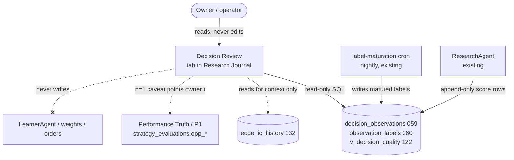
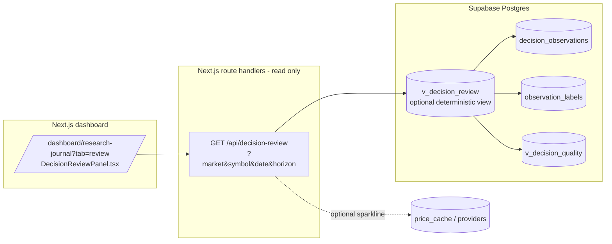

# Decision Review / Counterfactual — Feature Architecture

> Status: **DRAFT (design only, unapproved)**. No code, no migration, no deployment.
> Last updated: 2026-07-15
> Update this file when: the per-symbol decision-review data contract, the
> attribution method, or the UI surface changes; keep it aligned with
> `docs/arch/09-learning-loop.md` (Performance Truth / P1 gate) and
> `features/edge-factor-discovery/FEATURE_ARCHITECTURE.md` (aggregate EdgeIC).

---

## 1. One-line intent

For a single symbol we scored on date **D**, show: **what we scored** (analyst_score
+ the 5 dimension scores), **how the stock actually moved** over the next
**1d / 5d / 20d** (market-local adjusted close), **the gap** (score-implied
direction vs realized), **which dimension most plausibly pushed the score wrong**,
**how confident** that read is, and a **plain-English "what we'd learn."**

This is the missing **per-symbol post-mortem**. We already measure *aggregate*
predictive power (EdgeIC on the broad universe; `v_decision_quality` per-decision
data quality). Decision Review is the per-decision, per-symbol surfacing of the
**already-existing** `decision_observations × observation_labels` ledger. It is the
concrete UI for the "opportunity-level IC" work that `docs/arch/09-learning-loop.md`
and the P1 gate already name as the next measurement layer.

It aligns with item **#4 "Counterfactual trade journal"** on the native roadmap in
`features/external-research-integrations/DEEP_CANDIDATE_CAPABILITY_AUDIT.md`
("Advisory history only; never changes ledgers, positions, prices, or trades").

---

## 2. Hard boundaries (non-negotiable)

- **Read-only / advisory / measurement-only.** Decision Review reads existing
  records and renders them. It **never** writes to `agent_signals`, `paper_trades`,
  `learning_priors`, `strategy_versions`, weights, genome, or any order path.
- **Not a parallel truth layer.** It does **not** create a new provenance/outcome
  store. It reads the append-only `decision_observations` ledger (059) and the
  matured `observation_labels` (060) — the *same* records the LearnerAgent and
  Performance Truth Layer read. If a number is shown here, it came from those tables
  (or a deterministic view over them), never from a fresh recomputation that could
  diverge from the ledger.
- **LearnerAgent remains the only thing that changes weights**, on its own weekly
  evidence, behind the Phase-0 (10+ closed trades) gate. Decision Review can *inform*
  the owner and *feed the same evidence tables* the LearnerAgent already reads, but it
  proposes nothing and mutates nothing.
- **No LLM sets any number.** Every score, return, gap, and attribution value is
  deterministic SQL/arithmetic over the ledger. An LLM may only render the
  already-computed numbers into the one-line "what we'd learn" *prose* (optional, and
  clearly labeled as narration of fixed numbers — same posture as existing thesis text).
- **Market-local, never mixed.** US decisions are compared to USD prices and SPY;
  India decisions to INR prices and ^NSEI. A view/API filtered by `market` never joins
  a USD entry price to an INR forward path. Currency is carried on every row
  (`decision_observations.currency`).

---

## 3. Data sources — everything needed already exists

### 3.1 `decision_observations` (migration 059) — the point-in-time score

Append-only (a mutation trigger `dobs_block_mutation` blocks UPDATE/DELETE). One row
per candidate scored by ResearchAgent (filled OR rejected). Columns this feature reads:

| Column | Use in Decision Review |
|---|---|
| `id`, `ts`, `market`, `symbol` | Row identity, market scope, score date **D** |
| `analyst_score` | The headline score under review |
| `fundamental_score`, `technical_score`, `sentiment_score`, `macro_score`, `insider_score` | Per-dimension scores (the attribution inputs) |
| `direction` | long / short / hold as scored (defines the "was it right?" sign) |
| `weights_used` (jsonb) | Dimension weights actually applied → dimension contribution = weight × (score−50) |
| `availability_mask` (jsonb) | Which dimensions were real vs unavailable — an unavailable dim cannot be "wrong" |
| `features` (jsonb) | Raw sub-features (already parsed by `v_decision_quality`) |
| `price_at_decision`, `currency` | Entry basis (native currency) — the anchor for forward returns |
| `entry_eligible`, `action`, `score_threshold` | Whether we would have acted; held vs skipped context |
| `signal_id` | Link to `agent_signals` when a signal was written |
| `mandate_id` (migration 135) | Mandate/benchmark context (Swing US 2-20d → VOO/SPY; Swing India 2-20d → ^NSEI) |

### 3.2 `observation_labels` (migration 060) — the matured forward outcome

One row per `(observation_id, horizon_days)`, written **only after maturity** by the
`label-maturation` cron (`app/api/agents/label-maturation/route.ts`) so features can
never see the future. Horizons already computed: **2, 5, 10, 20 trading days**.

| Column | Use |
|---|---|
| `horizon_days` | 2 / 5 / 10 / 20 — maps to the "next 1d/5d/20d" UI (see §4 note on the 1d question) |
| `fwd_return` | `(exit−entry)/entry − 10bps` cost haircut — the actual move |
| `benchmark_return` | Same-window SPY (us) / ^NSEI (india) return |
| `benchmark_neutral_return` | `fwd_return − benchmark_return` — alpha vs beta separation |
| `max_adverse_excursion` / `max_favorable_excursion` | Path risk inside the window (was the thesis ever right/wrong intraperiod) |
| `entry_price`, `exit_price` | Displayed anchors |
| `matured_at` | Freshness / "not matured yet" state |

### 3.3 `v_decision_quality` (migration 122) — per-decision dimension bookkeeping

Already computes, per observation: `applicable_dims`, `real_dims`, `missing_dims`,
`degraded_dims`, `decisive_dim` (highest-weight real dimension), `data_confidence`,
`confidence_band` (high/med/low). Decision Review **reuses** this for the confidence
column and to gate attribution to *real, non-degraded* dimensions only.

### 3.4 `edge_ic_history` / EdgeIC (migrations 132; `lib/edges/ic.ts`) — the aggregate we EXTEND

EdgeIC measures cross-sectional rank-IC of *edges* on the *broad candle universe*.
Decision Review is the **complementary** view: not "does this factor rank winners
across the universe" but "for this one decision on this one symbol, how did our
composite score line up with what happened". Decision Review **references** EdgeIC as
context ("technical-momentum edge IC at 20d = 0.04, t=2.1") but does **not** recompute
or duplicate it, and never writes to `edge_ic_history`.

### 3.5 Forward-price source (for spot-checking / rendering only)

The forward returns themselves come from `observation_labels` (already matured). If the
UI wants to *render a small price sparkline* from D to D+20, it reads cached candles the
same way maturation does — `price_cache` then `fetchUsCandles` fallback (`lib/data/candles.ts`)
for US, `fetchIndiaCandles` (`lib/india-data.ts`) for India. The **numbers of record**
are always the label row, not a fresh fetch, to prevent drift from the ledger.

### 3.6 New table/column decision — **prefer none; one optional derived view**

- **No new base/truth table.** The ledger already holds score + outcome.
- **No new provenance layer.** `decision_observations` is the provenance.
- **One optional read-only VIEW** `v_decision_review` (deterministic join of 3.1 × 3.2
  × 3.3, per market, per horizon) MAY be added to keep the query in one audited place.
  A view is not a truth layer — it stores nothing. **Open question in §9** is whether
  even this is worth it vs. an API-only join.
- The "opportunity-level IC" columns the roadmap already reserved
  (`strategy_evaluations.opp_*`, null until P1 per `docs/arch/09-learning-loop.md`) are
  the correct home for any **aggregate** roll-up this feature surfaces — extend those,
  do not invent siblings.

---

## 4. Point-in-time forward returns (no look-ahead, market-local)

The maturation cron already implements this correctly; Decision Review **consumes**
it and must not re-derive it differently.

1. **Entry anchor** = `decision_observations.price_at_decision` (the close/quote used at
   scoring time), else the first candle on/after date **D**. Native currency.
2. **Window** = the first `H` candles **strictly after** the entry date
   (`c.date > entryDate`) — so D itself is never counted, and a horizon is only labeled
   once `H` trading days have actually elapsed (maturity). This is what prevents
   look-ahead: an un-elapsed horizon has **no** label row and renders as "maturing".
3. **Return** = `(exit − entry)/entry − 0.001` (10 bps round-trip cost haircut,
   `LABEL_COST_HAIRCUT`).
4. **Benchmark** = SPY for us, ^NSEI for india, **same window**, same rule →
   `benchmark_return`; `benchmark_neutral_return = fwd − benchmark` isolates alpha.
5. **Market isolation** = every query filters `market` and reads `currency`; a US label
   is never compared to an INR benchmark and vice-versa. Mandate benchmark (VOO/^NSEI)
   comes via `mandate_id`.

**The "1d" question.** Labels exist at 2/5/10/20. The task asks for 1d/5d/20d. Two
honest options (see §9): (a) surface **2d/5d/20d** and label the near bucket "~1–2d"
(zero new pipeline work, no new provider calls); or (b) add `horizon_days = 1` to the
`HORIZONS` array in the maturation cron (one-line change, still measure-only, back-fills
naturally). Recommendation: **(a)** for the first cut — 1d is the noisiest, least
decision-relevant horizon for a 2–20d swing mandate, and adding it risks implying
precision we don't have.

---

## 5. The per-symbol view (what the screen shows)

For a chosen `(symbol, market)` and a chosen decision date **D** (or the latest matured
decision), one **Decision Review card** per horizon, plus a symbol-level history table.

### 5.1 Header — the decision under review
- Symbol, market badge, date **D**, `analyst_score`, `direction`, whether it was
  `entry_eligible` / acted / skipped, `confidence_band` (from `v_decision_quality`),
  mandate + benchmark.

### 5.2 Score vs actual move (per horizon 2/5/20)
- **Scored:** analyst_score and score-implied direction.
- **Actual:** `fwd_return`, `benchmark_neutral_return`, MAE/MFE (path).
- **Gap:** a deterministic, sign-aware gap metric:
  - Directional hit/miss: did `sign(direction)` match `sign(benchmark_neutral_return)`?
  - Magnitude gap: score mapped to an *ordinal* expectation bucket (high score ⇒
    expect top-tercile forward return) vs realized tercile — **ordinal, not a
    fabricated regression** (we deliberately avoid implying the score is a calibrated
    return forecast; it isn't).

### 5.3 Per-dimension attribution — "which dimension was most wrong"
Deterministic, and **honest about its limits**:
- Only dimensions that were **real and non-degraded** (`availability_mask` +
  `v_decision_quality.degraded_dims`) are eligible — an unavailable dimension cannot be
  blamed.
- **Contribution** of dimension *d* to the decision = `weights_used[d] × (score_d − 50)`
  (how far, and in which direction, *d* pushed the composite off neutral).
- **"Most wrong"** = the eligible dimension whose contribution most **opposed** the
  realized `benchmark_neutral_return` sign, weighted by |contribution|. Example: score
  was pushed long mostly by `sentiment` (+high contribution), stock fell vs benchmark ⇒
  sentiment is flagged as the most-wrong dimension for this decision.
- **"Most right"** symmetric, for balance.
- Displayed as a small horizontal contribution bar, colored by whether each dim helped
  or hurt **this realized path** — explicitly labeled "for this one outcome," never as a
  causal weight-change recommendation.

### 5.4 Confidence
- `confidence_band` from `v_decision_quality` (data completeness), **plus** a
  sample/maturity caveat: a single symbol-decision is n=1. Per-symbol attribution is
  always shown with an explicit "n=1 anecdote — see aggregate below" marker.

### 5.5 Plain-English "what we'd learn"
- A templated, deterministic sentence assembled from the computed fields, e.g.:
  *"On 2026-06-30 we scored NVDA 78 (long), driven mainly by technical (+12) and
  sentiment (+9). Over 20d it returned −4.1% vs SPY (−5.3% alpha). Sentiment most
  opposed the outcome. This is one decision (n=1); the sentiment dimension's 20d IC
  across all decisions is +0.01 (t=0.7, not significant) — no weight change is
  warranted on this evidence."*
- Optional LLM pass only *rephrases* this fixed string; it introduces no new numbers.

### 5.6 Symbol history + aggregate roll-up (the honest layer)
Because n=1 per decision is meaningless, the symbol page's default emphasis is the
**aggregate over that symbol's decisions** (and, more importantly, over the
**regime/dimension cohort**): hit-rate, mean `benchmark_neutral_return`, and a
per-dimension "how often did this dim's push agree with the outcome" — only shown once
the cohort clears a sample floor (reuse the Performance Truth **20-trade / P1** honesty
rule; below floor → `insufficient_sample`, no fabricated precision).

---

## 6. C4 sketch

### 6.1 Context

### 6.2 Container

Everything in the API/DB path is `SELECT`-only. No route in this feature issues
`INSERT`/`UPDATE`/`UPSERT` to any table.

---

## 7. Where it lives in the UI

A **fourth tab in the existing Research Journal** page
(`app/dashboard/research-journal/page.tsx`), sibling to **Score Tracker**:

`Daily Funnel | Evolution | Score Tracker | Decision Review`

- Reached via `/dashboard/research-journal?tab=review` (mirrors the existing
  `?tab=scores` redirect pattern; a `/dashboard/decision-review` route may redirect here
  for discoverability).
- **Market-scoped** via the existing market toggle/param (`?market=us|india`); the panel
  never renders mixed-market rows.
- Deep-link from Score Tracker: "review this decision" on any historical score point
  opens the same symbol/date in Decision Review. Deep-link from the Research Journal
  Daily Funnel row and from `/dashboard/symbol/[symbol]`.
- Reuses existing dashboard chrome (`PageHeader`, theme tokens `T`, tab button styling)
  — no new layout system, per Drift Prevention.

---

## 8. Phased rollout (measure-only first)

**Phase A — Surface (measure-only, no new pipeline).**
Read `decision_observations × observation_labels × v_decision_quality`; render the
per-horizon card (2/5/20), score-vs-actual, and the symbol history table. Attribution
shown but heavily n=1-caveated. **No migration** beyond the optional `v_decision_review`
view. Ships behind the same measure-only posture as EdgeIC.

**Phase B — Attribution + aggregate honesty.**
Add the deterministic per-dimension contribution/most-wrong logic and the
cohort/regime aggregate roll-up gated by the 20-trade/P1 sample floor. Wire the
"what we'd learn" template. Still writes nothing.

**Phase C — Optional 1d horizon + Performance Truth link.**
If owner wants true 1d, add `horizon_days = 1` to the maturation `HORIZONS` (one-line,
measure-only). Surface the aggregate per-dimension agreement into the reserved
`strategy_evaluations.opp_*` columns **as read-through display**, feeding the *same*
evidence the LearnerAgent already consumes — never a new recommendation channel.

**Never a phase:** auto-adjusting weights from Decision Review. That stays the
LearnerAgent's weekly, gated job.

---

## 9. Acceptance tests

1. **Read-only proof:** grep the feature's API + panel for any write verb
   (`insert|update|upsert|delete|.rpc(`) → zero hits against ledger/weight/order tables.
2. **No look-ahead:** a decision whose newest horizon hasn't elapsed shows "maturing"
   and **no** fabricated return; forcing a render never fetches post-cursor candles for
   the number of record (it reads only the existing label row).
3. **Market isolation:** a US symbol page never displays an INR price or an ^NSEI
   benchmark; India never shows SPY. Currency badge matches `decision_observations.currency`.
4. **Ledger fidelity:** every number on the card equals the corresponding
   `decision_observations` / `observation_labels` field byte-for-byte (no recompute drift).
5. **Attribution eligibility:** a dimension with `availability_mask[d] = false` or in
   `degraded_dims` is never flagged "most wrong."
6. **Sample honesty:** with a below-floor cohort, the aggregate panel shows
   `insufficient_sample`, not a number (mirrors Performance Truth's 20-trade rule).
7. **Determinism:** same inputs → same card on repeat load; the optional LLM prose pass,
   if disabled, leaves every number and the templated sentence intact.
8. **Boundary:** disabling/deleting this feature changes no ledger row and no weight —
   it is pure projection.

---

## 10. Riskiest assumption (call it out loud)

**Forward-return attribution ≠ causation, and per-symbol samples are tiny (n≈1).**
Flagging a dimension as "most wrong" for a *single* realized path is an anecdote: the
stock's move is dominated by market/sector beta and idiosyncratic noise, not by which
sub-score we over-weighted. If the UI presents per-symbol attribution as actionable, the
owner (or a future LearnerAgent reading it) could chase noise — exactly the overfitting
the Phase-0 "10+ closed trades" rule and the EdgeIC t-stat hurdles exist to prevent.

**Mitigation (locked into the design):** per-symbol/per-decision attribution is always
labeled n=1 and is decorative; the **decision-relevant** number is the
**aggregate/regime/dimension cohort** roll-up, shown only above the Performance-Truth
sample floor, with the aggregate EdgeIC t-stat displayed alongside so a non-significant
dimension is visibly non-significant. Decision Review **informs**; it never proposes,
and weight change stays the LearnerAgent's gated, aggregate-evidence job.

---

## 11. Open decisions for owner / Claude

1. **(Biggest)** Attribution methodology & how loudly to show per-symbol "most wrong":
   is the deterministic `weight × (score−50)` vs realized-sign contribution rule the
   right definition, and should per-symbol attribution be **shown at all** in Phase A or
   deferred until the aggregate cohort layer (Phase B) exists to anchor it? (This is the
   single point where the feature could either become genuinely useful or quietly
   encourage overfitting.)
2. Add `horizon_days = 1` now (true 1d) or surface 2/5/20 and label the near bucket
   "~1–2d"? (Recommendation: defer 1d.)
3. `v_decision_review` deterministic view vs API-only join? (Both are read-only; the
   view centralizes the contract, the API-only path avoids a migration entirely.)
