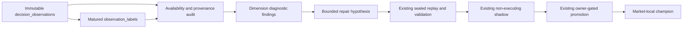

# Dimension Diagnostics Architecture

> Status: approved design, not implemented.
>
> Date: 2026-08-06
>
> Decision: Kairos will measure why a scored decision did or did not work, create
> bounded hypotheses for repairs, and validate them without automatically changing
> research scores, paper trading, live trading, exits, sizing, thresholds, or a
> champion strategy.

> Accountability addition (2026-08-06): this P0 program also records an
> **agent contribution ledger**. It measures evidence quality and outcome
> attribution for an agent/version; it does not reward or punish an LLM, mutate
> its prompt/model/tools, or infer that several agents caused a result merely
> because they appeared in the same workflow.

## 1. Problem and decision

Kairos already stores the exact evidence, availability mask, applied weights,
score, action, and later 2/5/10/20-session outcomes for a research decision.
That answers what happened to a decision. It does not yet provide one governed,
market-local process that distinguishes:

1. **Evidence degradation:** a dimension was missing, stale, delayed, or had an
   invalid source contract.
2. **Predictive decay:** an available dimension no longer ranked later outcomes
   usefully for its declared market, instrument cohort, and horizon.
3. **Regime dependence:** a dimension works only in a predeclared, observable
   market regime.
4. **Portfolio/execution effects:** a promising research decision was not entered,
   was position-limited, or realized differently because of fills, stops, targets,
   cash, taxes, or correlations.

The wrong response is to let an LLM, a short run of trades, or an in-sample chart
rewrite a live weight. It would confuse the four causes above and repeatedly fit
noise. The right response is a **diagnostic-to-challenger lifecycle** using the
existing decision, feature, validation, shadow, and strategy-version truth layers.

This feature is intentionally not a claim that Kairos can guarantee benchmark
outperformance. It makes changes falsifiable and reversible instead of silently
optimizing after the fact.

### 1.1 Agent accountability, not agent punishment

Agents are software roles, not economic actors. A reward/punishment loop that
updates their behavior after a trade would optimize a sparse, confounded P&L
sample and invite persuasive explanations, selective abstention, or other
reward-hacking behavior. Instead, P0 records an immutable scorecard for each
agent/version:

- decision coverage and label maturity;
- evidence availability, freshness and point-in-time integrity;
- market-local, benchmark-neutral decision outcomes at each horizon;
- the decision funnel (`scored -> eligible -> admitted -> filled -> exited`),
  with portfolio/execution exclusions shown separately;
- explicit `insufficient_evidence` rather than a positive or negative verdict.

No scorecard changes an agent's model, prompt, tool access, schedule, score
weight, decision authority or trading permission. A future collaboration claim
requires an existing paired or randomized shadow where the same opportunity was
evaluated with and without the specific input. Until then, `collaboration` is
reported as **unattributable**, not rewarded.

## 2. Non-negotiable boundaries

- US and India diagnostics never share observations, labels, trial counts,
  benchmarks, cohorts, currency, confidence, candidates, or promotion evidence.
- The canonical facts remain `decision_observations` and `observation_labels`.
  `feature_registry`, `edge_signals`, `strategy_versions`, validation experiments,
  and `shadow_decisions` remain their existing sources of truth. This feature does
  not create a third provenance or promotion system.
- A diagnostic run may read completed, point-in-time-safe evidence only. It never
  refetches current provider snapshots to explain a historical decision.
- A missing, stale, malformed, or inapplicable input produces an explicit finding;
  it cannot be counted as a neutral score or evidence that a factor failed.
- The LLM may summarize a deterministic finding in plain language. It cannot set
  a formula, parameter, threshold, cohort, winner, or activation state, and it
  never runs on the scoring, order, exit, or broker path.
- No diagnostic result may write `agent_signals`, `paper_positions`, paper cash,
  live proposals/orders, exits, risk limits, `trading_mandates`, score thresholds,
  or champion weights.
- A candidate can become a non-executing, market-local shadow only through the
  existing validation/strategy lifecycle. Promotion remains owner-gated and is
  currently dormant under the existing OOS promotion guards.

## 3. Existing truth layers and data contract



### 3.1 Reused primary records

| Existing truth | Required use here |
|---|---|
| `decision_observations` | Exact as-of score, raw feature snapshot, availability mask, applied weights, decision/action, source and code/strategy version identifiers. |
| `observation_labels` | Matured, horizon-specific forward, benchmark-neutral, MAE/MFE and cost-adjusted labels. No immature label is eligible. |
| `fundamental_facts`, `edge_signals`, `edge_signal_inputs` | Provider/freshness/PIT diagnosis for a particular fact or feature version. |
| `strategy_versions`, validation experiments, `shadow_decisions` | The only challenger, evaluation, shadow, and promotion lifecycle. |
| Paper/live trade and order ledgers | Separate execution attribution only. They cannot be mixed into a factor IC calculation. |

All joins bind `market`, decision timestamp, horizon, formula/feature version and
strategy version. Labels are joined by decision identity, never merely symbol.

### 3.2 Additive diagnostic records

The implementation may add only these append-only, owner-readable records after
a schema/RLS review:

| Table | One row per | Purpose |
|---|---|---|
| `dimension_diagnostic_runs` | market, declared analysis plan, as-of cutoff, horizon, code hash | Immutable run identity, input counts, exclusions, trial-family version and deterministic status. |
| `dimension_diagnostic_findings` | run, subject type/key, cohort, finding type | Measured dimension availability, freshness, PIT integrity, agent contribution, conditional predictive result, uncertainty, and abstention/rejection reason. |
| `dimension_repair_candidates` | finding-backed, structured candidate | A bounded reweight, availability-policy repair, feature retirement, or new measure-only feature proposal linked to the existing strategy/feature/experiment records. |

`subject_type` is `dimension`, `agent`, or `collaboration`. Only `dimension` and
`agent` have P0 metrics. A P0 `collaboration` finding is always
`unattributable`; it exists to make the missing paired counterfactual explicit.

These are diagnostic index rows, not alternate evidence stores. They reference
source record IDs and immutable fingerprints; they do not copy or recompute a
second set of historical features or labels. Use service-only writes, owner-read
RLS, append-only triggers, market-scoped unique keys, and no browser write grant.

## 4. Diagnostic taxonomy

### 4.1 Evidence availability and freshness

For each market, dimension, instrument kind, provider policy and session cohort,
measure the rate of `available`, `unavailable`, `inapplicable`, stale, malformed,
and abstained decisions. Inspect source/fact timestamps and known-at boundaries.

This finding can justify a data-contract repair, cache/pacing change, or a more
honest abstention. It cannot support a directional weight increase or decrease.

### 4.2 Predictive behavior

Only mature, availability-valid observations are evaluated by:

- rank IC and uncertainty at its declared forward horizon;
- top-bucket versus comparable median benchmark-neutral return;
- hit rate, tail loss/MAE and turnover-sensitive cost result;
- stability across independent session blocks and predeclared regimes.

The baseline score and every standalone dimension are evaluated separately.
Correlation is descriptive until it has passed the sealed validation pathway.
No finding says a dimension is "wrong" merely because a few held trades lost.

### 4.3 Regime and instrument applicability

Regimes must be predeclared from observed, market-local state available at the
decision timestamp. A market-wide US regime never labels India evidence. Company
fundamentals do not diagnose ETFs, leveraged ETFs, REITs, banks, or ADRs unless
their feature-pack contract explicitly permits it.

Regime segmentation consumes trial budget. It cannot be used after looking at
the outcome to find the one period where a factor happened to work.

### 4.4 Portfolio and execution attribution

Research merit, entry admission, and realized trade performance are reported as
separate stages:

```text
scored -> eligible -> admitted -> filled -> held -> exited -> realized
```

This prevents a factor from being blamed for a cash cap, a correlation veto, an
earnings barrier, a stop, a partial exit, a stale order, or an unavailable broker.
Conversely, a good research score does not excuse a harmful execution policy.

### 4.5 Agent contribution attribution

P0 reports an agent's own decision and evidence record, not a causal reward. A
ResearchAgent score can be measured against mature benchmark-neutral outcomes;
a data collector can be measured on valid/fresh/PIT-safe evidence; and an
execution role can be measured on filled/held/exited bookkeeping. These metrics
are never combined into one cross-role reward number.

The collaboration of ResearchAgent, an LLM explanation, a data adapter and
PaperTrader is not identifiable from one realized trade. P0 therefore records
`unattributable_no_paired_shadow` until an existing non-executing shadow compares
the same decision with and without a declared input. Any later marginal-credit
method must be proposed separately, use market-local paired decisions, and stay
outside the money path.

## 5. Statistical and governance controls

### 5.1 Minimum evidence

Each run declares floors before observing results: distinct market sessions,
symbols per session, mature labels, independent time blocks, and cohort coverage.
The floor is horizon-specific. Four US h20 labels or thirteen India h20 labels
are displayed as `insufficient_evidence`, never interpreted as a repair signal.

Do not infer effective breadth from IC dispersion. Report observed counts and
uncertainty directly. A ticker-level diagnostic is attribution only, never a
parameter-learning sample.

### 5.2 Trial-family control

Every formula, weight change, missing-data policy, regime segment, instrument
pack, horizon, and combined strategy counts as a declared trial. The trial plan
is frozen before outcome access, includes retired/failed candidates, and uses the
existing walk-forward and multiple-testing requirements. There is no hidden grid
search and no "try one more combination" after a weak result.

### 5.3 Candidate types

Candidates are structured, finite, and versioned:

1. **Data-contract repair:** correct a demonstrable availability, units,
   freshness, or PIT defect. It requires regression tests and reclassification
   of affected history; it is not an alpha candidate.
2. **Availability-policy candidate:** change how a valid but missing dimension
   causes abstention or renormalization. Requires paired replay because it can
   alter eligibility.
3. **Feature candidate:** add, retire, or replace one declared feature family
   under `feature_registry` and the Feature-Pack Validation architecture.
4. **Strategy candidate:** a bounded market-local weights/genome version in the
   existing `strategy_versions` lifecycle.

An LLM may only select from predeclared candidate templates and explain why a
deterministic finding merits review. Server-side validation recreates every
number; free-text cannot become a candidate specification.

## 6. Lifecycle and phasing

### P0: measurement and visibility only

1. Define typed analysis plans and the diagnostic taxonomy.
2. Build a scheduled, idempotent market-local diagnostic from the existing
   decision/label ledger.
3. Write append-only run/finding rows with source fingerprints and explicit
   insufficient-data states.
4. Write a per-agent/version contribution finding alongside the dimension
   findings, plus an explicit unattributable collaboration finding.
5. Display status in Dashboard Learning/Upgrade Path and Strategy Portfolio Lab:
   evidence collected, exclusions, confidence, finding class, candidate status,
   and next gate. The global market switch selects the market; no cross-market
   aggregate exists.

P0 makes no candidate, provider call, score, trade, or strategy change.

### P1: bounded candidate creation

A passing P0 finding can create a structured, reviewable candidate only if it
has a frozen trial-family slot and complete PIT provenance. Data-contract repairs
follow their normal bug-fix path. Feature and strategy candidates remain
measure-only until sealed evaluation.

### P2: sealed historical replay

Use the existing historical replay and walk-forward architecture. Evaluation is
paired against the current market-local champion on the same opportunities and
records costs, turnover, coverage, abstentions and benchmark-relative results.
An unavailable historical dataset or weak PIT coverage is a refusal, not a
fallback to current data.

### P3: forward non-executing shadow

Only a sealed-replay survivor may create an existing `shadow_decisions` strategy
shadow. It reads the same decision snapshots and records counterfactual outputs;
it creates no fills, cash movement, exits, proposals, or orders.

### P4: promotion readiness

The existing owner-gated promotion path may consider a candidate only after its
predeclared historical, forward-shadow, cost, safety, and benchmark-relative
criteria pass. The system can recommend "ready for owner review" but never
promotes itself. Current promotion safeguards remain authoritative and dormant
until their documented PIT/OOS blockers are resolved.

## 7. UI and audit behavior

The user-facing view must explain the result without promising a prediction:

- **Dimension health:** availability/freshness/PIT status separate from measured
  predictive behavior.
- **Evidence:** distinct sessions, symbols, mature labels, exclusions, horizon,
  cutoff, source/strategy/formula versions, and trial-family count.
- **Finding:** `healthy`, `data_degraded`, `predictive_uncertain`,
  `predictive_weakened`, `regime_limited`, `execution_confounded`, or
  `insufficient_evidence`.
- **Candidate trail:** exact rule, reason, parent finding, replay/shadow status,
  rejection reason and immutable links to existing records.
- **Per decision:** the existing Research Journal/Decision Review keeps showing
  what was used, missing, observed-only, and the later realized path. It must not
  imply a single stock proved or disproved a dimension.

The UI reads persisted records only. Opening it cannot trigger a provider query,
LLM call, replay, or candidate evaluation.

## 8. Acceptance criteria

- Every diagnostic row is market-local and refuses a mixed-market/currency input.
- Each result binds to exact decision IDs, mature label IDs, feature/formula and
  strategy versions, code hash, cutoff, trial plan and source fingerprints.
- Missing/stale/PIT-invalid evidence is reported as a data-quality result and is
  excluded from predictive calculations according to the declared plan.
- Factor diagnostics cannot read trade outcomes as substitutes for research labels;
  execution attribution cannot change a predictive result.
- Fewer than the declared sample floor yields `insufficient_evidence` with no
  candidate auto-created.
- A diagnostic run, LLM summary, candidate row, UI request, cron failure, or
  malformed input cannot change score, direction, eligibility, thresholds,
  sizing, positions, cash, exits, proposals, broker calls, or champion status.
- Tests prove append-only behavior, idempotency, owner/RLS isolation, market
  isolation, PIT cutoff enforcement, trial-family accounting, no-lookahead,
  and no money-path imports/readers.
- Any strategy candidate reuses existing validation, shadow, and promotion rows;
  no parallel champion, provenance, or evaluation truth is introduced.
- Agent contribution results never trigger a model/prompt/tool/configuration
  mutation, task disablement, privilege change, score change or broker action.
- A collaboration result is `unattributable` unless it references paired,
  market-local shadow decisions with and without the declared input.

## 9. Build order and dependencies

1. Reconcile field-level provenance in existing decision/label records and add
   read-only diagnostic plan types/tests.
2. Add the P0 schema, RLS, append-only triggers and deterministic runner.
3. Surface P0 results in the existing Learning and Upgrade Path views.
4. Establish enough mature market-local labels before interpreting results.
5. Integrate candidate creation with the existing feature/strategy lifecycle.
6. Use the already-approved sealed replay and forward-shadow gates before any
   owner review; do not implement automatic activation.

Dependencies: `features/feature-pack-validation/FEATURE_ARCHITECTURE.md`,
`features/technical-factor-calibration/FEATURE_ARCHITECTURE.md`,
`features/walk-forward-ic-folds/FEATURE_ARCHITECTURE.md`,
`features/historical-replay-harness/FEATURE_ARCHITECTURE.md`, and
`docs/arch/09-learning-loop.md` remain authoritative for their respective
subsystems. When P0 ships, update architecture chapters 04, 05/operations as
applicable, and 09 in the same implementation change.

## 10. Explicit non-goals

- Autonomous self-reweighting, self-promotion, or self-retirement of a live
  scoring dimension.
- Per-symbol or per-sector parameter fitting from a small number of outcomes.
- LLM-selected indicators, strategy combinations, or trades.
- New provider polling, historical backfill, intraday alpha, or broker behavior.
- Replacing the current Feature-Pack Validation, replay, strategy version, or
  promotion architecture.
