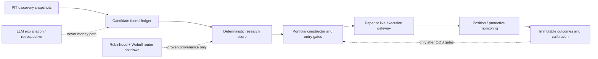

# Discovery, Instrument Policy, Sizing, and Exit Control

**Status:** Partially implemented. The auditability work below is now deployed as
research-only provenance; every behavior-changing phase remains separately gated.

**Decision:** Kairos must first prove why it did or did not trade a candidate, widen
deterministic discovery, and distinguish instruments by risk contract. It must not
respond to missed winners by concentrating 50% of a portfolio, enabling Webull order
types, or allowing an LLM to alter a stop, target, or size.

## Implementation Status (Verified 2026-08-01)

The safe foundations in this document are already present in production and must be
reused rather than rebuilt:

- `universe_snapshots` and `universe_snapshot_scores` preserve the per-run candidate
  population and rank provenance.
- `discovery_snapshot_members` records each symbol admitted to a market-scoped
  research run, including its source, held/ETF status, asset class, and screener
  bucket. It is append-only, service-only, and read by no scoring or money path.
- `decision_observations.discovery_source` records the research source, and
  `pipeline_stage_events` records portfolio-constructor, risk-plan, and execution
  outcomes. The Research Journal consumes this lineage as the current Miss Review
  surface.
- `instrument_registry` is deployed as L0 observational classification with
  `new_entry_allowed=false`; execution code does not read it.
- Capped half-Kelly code and the out-of-sample calibration gate are present, but no
  accepted `pwin_logistic` model is stored for either market. Flat mandate sizing
  remains authoritative.
- ATR partial/target/trailing variants are collecting measurement evidence only;
  PositionMonitor still owns the incumbent deterministic paper exit policy.

Therefore, the unbuilt work starts at **better discovery inputs and expanded
classification metadata**, while sizing activation, intraday exits, leveraged-paper
entries, and live protective orders remain deliberately blocked by evidence or a
separate owner approval.

**2026-08-01 implementation:** the US relative-strength candidate bucket now reuses
fresh, completed-session `edge_signals` already collected by EdgeScout. Its existing
bounded US post-close run rotates through the current liquid universe rather than only
the watchlist. It admits at
most four non-ETF symbols with positive six-month relative-strength and 52-week-high
proximity z-scores. It makes no provider call, changes no score or threshold, and is
recorded as `edge_relative_strength` with its exact input provenance. India remains
unchanged because an equivalent candidate contract has not been verified.

**2026-08-01 Journal refinement:** the Miss Review surface exposes the persisted
admission metrics (and only those metrics) for an EdgeScout-admitted symbol. It must
label them as research-admission provenance, never score contribution, prediction, or
trade rationale. This adds no provider call and has no reader on any money path.

**Earnings/revision admission remains blocked:** the current free earnings capture
correctly preserves first-observed actuals and pre-announcement consensus vintages,
but does not carry a provider-confirmed common EPS basis. Observed pairs can therefore
be incomparable. Do not rank or admit candidates from `actual / consensus` until the
capture contract records comparable basis, currency, fiscal period, and availability
for both values, then passes a separate point-in-time review. The existing calendar
and repricing safety readers remain unchanged.

## 1. Problem Statement

Recent US production evidence shows that the system did research MSFT and MU but did
not create paper trades. The current research backlog is small, while PaperTrader has
frequently reduced new orders below its 0.5% minimum because the book is already near
the 80% gross-exposure cap. Theme Scout is a six-name/week, headline-to-LLM attention
feed; the US screener is a six-name quality/value screen. Neither is a systematic
earnings/revision/relative-strength discovery engine.

The product needs four separate upgrades:

1. Explain every missed or rejected candidate end to end.
2. Build deterministic, point-in-time discovery buckets without treating headlines or
   broker tools as alpha.
3. Classify each instrument and apply an appropriate risk/monitoring contract.
4. Improve sizing and exits only when market-local, out-of-sample evidence allows it.

## 2. Non-Negotiable Invariants

- US/USD and India/INR pools, evidence, policies, outcomes, and limits never mix.
- No LLM decides eligibility, direction, quantity, stop, target, partial exit, or
  broker action. LLMs may explain completed deterministic decisions and propose
  hypotheses for review.
- Existing pause, market-control, kill-switch, drawdown, freshness, name, sector,
  gross, volatility, correlation, cooldown, and approval gates remain authoritative.
- A new component may only observe, reject, or shrink until it has a separately
  approved promotion record. It may not make a candidate more eligible by default.
- Paper and live orders continue through the current atomic execution paths. No new
  ledger, cash, or position truth is created.
- Stops are risk controls, not guaranteed prices. A broker-resident stop is a second
  line of protection, not proof against a gap or a halt.

## 3. Architecture

## 4. Phase 0: Candidate-to-Outcome Truth Ledger

### Goal
For every candidate, answer: **was it discoverable, queued, researched, eligible,
blocked, filled, exited, and how did it perform afterward?**

### Build
- Reuse, rather than duplicate, existing truths: `discovery_snapshot_members` is
  the append-only admission record; `decision_observations` is score truth;
  `universe_snapshot_scores` is rank truth; and `pipeline_stage_events` is
  portfolio/execution truth.
- Bind a review by market, symbol, source snapshot, signal/observation id,
  mandate/policy version, and rejection code. Add fields only to the existing
  ledger that owns that stage; never create a parallel score, position, or P&L truth.
- Add a market-scoped Miss Review UI: filter symbol/date/source and show the exact
  first terminal reason. It must show `unknown`, not invent a reason for legacy rows.
- Add a weekly report for top ex-post movers from a frozen point-in-time eligible
  universe. This is diagnostic coverage, not a new trading signal.

### Acceptance
- New MSFT/MU-style reviews identify an exact admission source and terminal stage,
  or explicitly report missing legacy lineage.
- The report can distinguish `never discovered` from `qualified but gross-cap denied`.
- It produces no provider calls and has no scoring, sizing, or order consumer.

## 5. Phase 1: Deterministic Discovery Buckets

Theme Scout remains an attention source, capped at its current small size. It is not a
primary alpha engine. Add three independently budgeted US buckets, then design India
equivalents only where point-in-time data coverage exists:

| Bucket | Candidate contract | Initial status |
|---|---|---|
| Earnings / revisions | Known earnings result, surprise/guidance/revision evidence and `available_at` | Shadow / candidate only |
| Relative strength / breakout | Liquid point-in-time universe, completed-session price/volume, sector and benchmark-relative ranks | Shadow / candidate only |
| Quality acceleration | Existing fundamentals screen, but batched/cache-backed and ranked by acceleration rather than only value | Candidate only |

The first row shipped is the **US candidate-only** relative-strength half. It uses
the current EdgeScout universe and is explicitly not an alpha claim or a point-in-time
historical backtest universe. The canonical score and every portfolio gate remain the
sole determinant of a trade.

Rules:
- Each bucket produces a bounded daily snapshot (for example, 10 names), expires in
  three market sessions, and deduplicates into the existing research queue.
- Discovery is separate from selection. A name entering a bucket does not receive a
  score boost, paper fill, allocation, or live eligibility.
- Rank only within a homogeneous market/instrument universe. ETFs never rank against
  companies; no US/India cross-ranking.
- All price/fundamental observations must carry source, `as_of`, `available_at`, and
  corporate-action conventions. Unknown provenance means unavailable, not neutral.
- Start with coverage and forward-return reporting. Any score/sizing consumer needs
  a later point-in-time walk-forward and multiple-testing review.

### Broker data policy
- Robinhood and Webull fields enter only through the Evidence Router cache, provider
  ledger, schema validation, and shadow comparison. No per-symbol MCP fan-out in the
  ResearchAgent deadline.
- Prioritize broker **earnings calendar/results, financial statements, analyst
  revision/consensus, quotes, and tradability** as read-only evidence contracts.
- Robinhood `review_equity_order` remains a fail-closed execution safety check.
- `get_equity_technical_indicators`, Level 2, scanner popularity, options flow, and
  broker watchlists are not score inputs until they demonstrate incremental,
  point-in-time value. Level 2 belongs to order-quality measurement, not daily alpha.

## 6. Phase 2: Instrument Registry and Monitoring Contracts

Create a server-owned, versioned `tradable_instruments` policy registry. It replaces
static ticker inference as the authority for new special instrument classes.

Required fields: market, currency, instrument kind, sector/industry, exposure tags,
leverage class, underlying, sleeve, liquidity policy, event calendar contract,
research cadence, monitoring cadence, paper/live eligibility, effective dates, source,
and reviewer/version.

| Class | Current truth | Phase policy |
|---|---|---|
| Ordinary equity / ADR | Generic daily model | Keep current model; ADR listing/priceability is a separate validation gate |
| REIT | Only broad ETF/context; no FFO/AFFO model | Classify first; add FFO/AFFO, occupancy, debt maturity, and rate-event evidence before any special score |
| AI / semis / nuclear-power | Partial static coverage; Theme Scout may notice them | Use discovery buckets plus industry/catalyst context; do not hardcode a permanent thematic spine |
| Crypto ETF | Proxy ETFs only; no direct crypto trading | Isolated exposure tag; underlying tracking and crypto-event context, never a general equity-market factor |
| Leveraged / inverse ETF | Generic flow blocks them | Default deny; only a separate US paper sleeve may later allow explicit long 2x/3x index/sector ETFs |

The registry is initially read-only classification. It may deny an unsafe instrument but cannot
authorize a new one until the relevant sleeve architecture is approved.

## 7. Phase 3: Sizing and Capital Allocation

### Immediate correction
Do not raise the per-name cap above 12% and do not allow 50-60% concentration. A raw
analyst score is not a probability of winning, and a stop cannot cap gap loss.

Keep the current 80% gross cap until a separate allocation decision is approved. The
new ledger must show whether rejected entries were correct risk denials or an avoidable
cash-reserve policy. The owner-facing setting must call the remaining balance either
`strategic_cash_reserve` or `deployable_cash`; it must never imply idle buying power
when gross exposure prevents entries.

### Later calibrated sizing
- Reuse `pwin_logistic` and `lib/risk/sizing.ts`; do not introduce another Kelly
  implementation.
- Enable only when a market-local model has at least 60 mature observations, a
  walk-forward holdout with at least 30 usable rows, non-degenerate outcomes, and
  out-of-sample calibration error at or below the existing threshold.
- Use half-Kelly only, with a 2% floor and 10% cap, then pass it through the existing
  constructor. Every portfolio constraint can only shrink or reject it.
- Log predicted probability, payoff estimate, proposed size, final size, and every
  constructor reduction. Roll back to flat mandate size on any gate failure.

No score threshold, risk profile, name cap, or cash reserve changes occur in this phase
without a separate owner decision backed by the miss ledger.

## 8. Phase 4: Exit and Profit-Taking Evidence

### Incumbent policy
Current paper exits are deterministic: entry-time stop/target, daily trailing stop
using the position's own initial stop distance, fresh-score safeguards, time exits,
and one partial profit at target where quantity permits. This remains the baseline.

### Evidence path
- Continue the existing ATR exit-policy measurement family. It is not executable.
- Require market-local prospective labels, purged walk-forward comparison, locked
  holdout, turnover/cost sensitivity, drawdown non-inferiority, and correction for
  the complete trial family before any paper shadow.
- A selected candidate runs beside the incumbent in paper shadow using the same
  close-based fill convention. Only an explicit approval can change PositionMonitor.
- Stops and targets are immutable on entry. The system cannot widen a stop, average
  down, or convert a loss into a new higher-risk thesis.

## 9. Leveraged ETF and Intraday Protection

This phase inherits and supersedes no safety rule in
`features/leveraged-etf-and-intraday-execution/FEATURE_ARCHITECTURE.md`.

1. **L0:** registry/allowlist and observability only; all leveraged and inverse
   products remain blocked from generic flows.
2. **L1:** isolated US measure-only candidates; capture quote age, spread, underlying
   tracking, volatility, event risk, and would-enter/would-exit records.
3. **L2:** one paper-only long 2x/3x broad index/sector position; 3% name, 5% total
   sleeve, no single-stock or crypto leveraged funds, no India sleeve.
4. **L3:** 15-minute paper would-exit comparison, then risk-reducing paper exits only
   after quote freshness, duplicate-exit, and false-trigger tests pass.
5. **L4:** distinct live review. A broker-resident GTC disaster floor plus broker
   reconciliation is mandatory. App polling is secondary protection only.

Email/push alerts may notify the owner, but never constitute an execution signal. A
verified in-session quote/broker state may create a risk-reducing SELL only in an
approved live phase; it can never create a BUY outside the approved entry session.

## 10. Delivery Order and Estimates

| Order | Deliverable | Estimate | Money-path effect |
|---:|---|---:|---|
| 0 | Candidate funnel ledger + Miss Review | 3-5 engineering days | None |
| 1 | US discovery snapshots and coverage report | 5-8 days | Shadow only |
| 2 | Router broker evidence contracts / parity | 4-7 days after Router gates | Shadow only |
| 3 | Instrument registry and class visibility | 3-5 days | Default-deny only |
| 4 | Capital-reserve decision surface and sizing audit | 2-4 days | No automatic limit change |
| 5 | ATR exit walk-forward / paper shadow | Evidence-dependent; weeks of labels | No execution initially |
| 6 | Leveraged sleeve L0-L3 | 2-4 weeks after phases 0-5 | Paper-only, separately approved |
| 7 | Broker protective orders / live intraday exits | Separate live approval | Live, fail-closed |

The estimates are implementation effort, not evidence time. Validation windows cannot be
compressed by coding faster.

## 11. Explicitly Deferred / Rejected

- No 50-60% single-name allocation.
- No LLM-selected or LLM-sized trades.
- No options-flow, social popularity, Level 2, or Fibonacci weight in the money path.
- No direct crypto trading, inverse ETF trading, single-stock leveraged ETFs, margin,
  shorting, extended-hours automation, or automatic broker routing.
- No Webull trading activation. Its richer order types are execution features, not
  evidence of selection alpha.

## 12. Required Documentation Updates Per Build

Every approved implementation updates the relevant sections of `docs/arch/03-agents.md`,
`docs/arch/04-database-schema.md`, `docs/arch/05-crons-and-scheduling.md`, and
`docs/arch/08-risk-and-safety.md`, plus the matching agent Mermaid diagram and
`WORK_LOG.md`. The System Reference must link this document as the governing plan.
