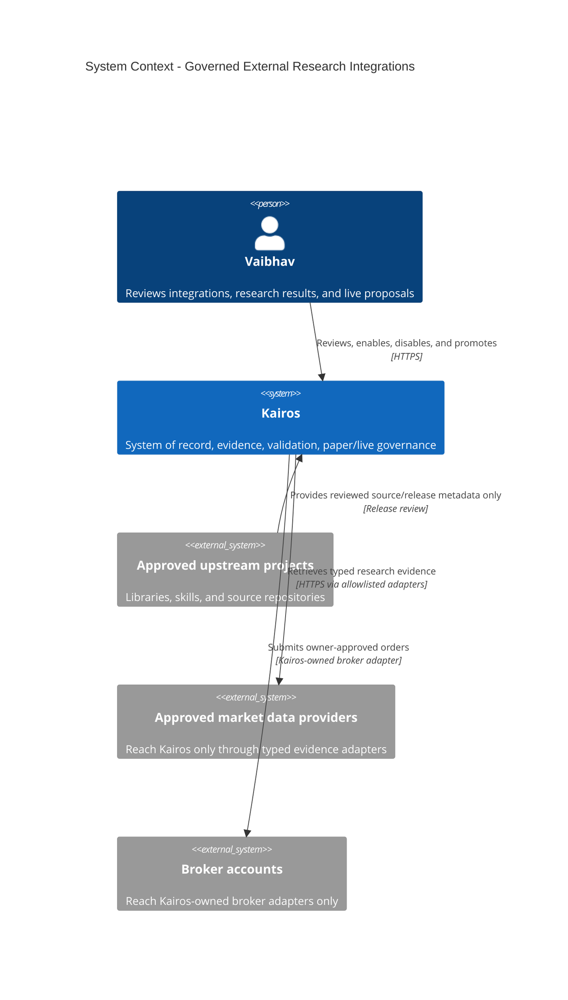
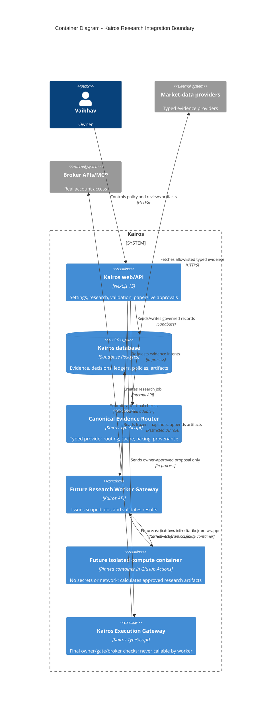
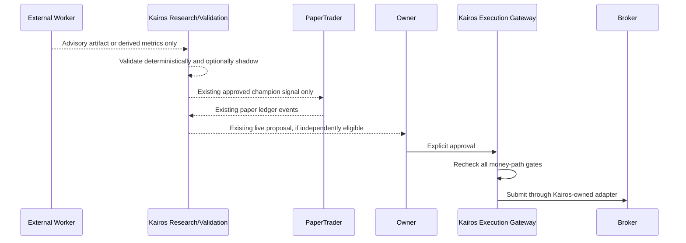

# Governed External Research Integrations

> Status: **REVISED DRAFT FOR CLAUDE + OWNER REVIEW. DESIGN ONLY.**
> Date: 2026-07-13
> Owner decision requested: approve an extensible but zero-trust way to add
> selected GitHub projects, libraries, and skills to Kairos without granting
> them broker, production database, or money-path authority.
> Build gate: no implementation, dependency installation, migration, provider
> activation, credential issue, deployment, or order-path change until this
> document is reviewed and Vaibhav says `Proceed`/`Code it`.

## Document Authority

This file is the **only implementation authority** for this feature. Before a
build starts, its approved version must contain the precise data contract,
migration plan, rollout and acceptance criteria. The catalog, Vibe deep-dive,
and deep candidate audit in this directory are evidence-only intake records:
they explain why a capability was accepted, deferred, or rejected, but never
override this architecture or authorize implementation.

The first native capability remains blocked until Evidence Router shadow parity
and the entry-eligibility-flip guard are complete. It must extend existing
Kairos records, including `experiment_runs` and immutable `evidence_records`;
it must not introduce another provenance truth layer.

## 1. Decision

Kairos remains the **system of record**, the **Performance Truth Layer**, and
the sole **money path**. External repositories and skills are never installed
into the Next.js application as trusted agents. They are admitted one at a time
as version-pinned, capability-scoped **Research Integrations**.

This document does **not** approve a Quant Research Worker now. The immediate
work is the Canonical Evidence Router Phase 2 foundation, followed by narrowly
scoped in-repository indicator hygiene where it has proven value. The worker
framework is reserved for the first genuinely untrusted or LLM-driven external
integration, such as a Vibe-derived advisory workflow.

When that future worker is justified, it receives immutable router evidence
envelopes plus a Kairos universe snapshot; it may calculate approved research
artifacts and returns schema-validated results through a narrow Kairos gateway.
It cannot read broker credentials, submit/preview/cancel an order, change
strategy configuration, mutate ledger rows, or call production Supabase with a
service-role key.

An Integration Registry controls whether a capability is disabled, in contract
test, research-only, shadow-only, or retired. There is **no execution-capable
state** for a third-party integration.

This gives Kairos a durable answer to both questions:

1. New useful repositories can be added later without rewriting agents.
2. A repository update, compromise, deletion, license change, or provider
   outage cannot silently affect a real account or an existing decision.

## 2. Why This Is Better Than "Just Use Skills"

Skills and open-source projects are useful accelerators, but they are not a
durable trading product boundary. They can change dependencies, prompts,
network behavior, data sources, licenses, or security posture without notice.
Kairos has requirements that a generic skill does not own:

- US/USD and India/INR pools are never cross-summed.
- Paper and live books are distinct, with live approval explicit by default.
- A score, evidence snapshot, candidate strategy, fill, and outcome are
  independently auditable.
- No LLM is permitted on a deterministic decision, sizing, or execution gate.
- Provider quotes used for execution remain separate from research evidence.

The right use of a skill is therefore: **generate or test a hypothesis inside
a constrained research workflow**, not decide or execute a trade.

## 3. Goals And Non-Goals

### Goals

1. Add a new library, skill, or permitted fork through a repeatable review and
   release process.
2. Make useful capabilities portable: indicator calculation, hypothesis
   generation, adversarial research, backtesting, document extraction, and
   validation reports.
3. Make every output reproducible from its pinned integration version, input
   snapshot, policy version, and strategy version.
4. Reuse and extend the existing `decision_observations`, `strategy_versions`,
   `experiment_runs`, immutable `evidence_records`, validation, Performance
   Truth, benchmark-alpha, and evidence-ledger architecture rather than create
   a parallel learning/trading system.
5. Make disable and rollback immediate and harmless to existing Kairos flows.

### Non-goals

- No external repository is a broker, order router, portfolio source of truth,
  or direct Supabase client.
- No arbitrary GitHub URL, package name, container image, prompt, provider URL,
  MCP tool, or command may be entered from Settings.
- No self-updating integrations, floating `latest` tags, or remote code fetch
  at runtime.
- No third-party code is copied before a license and provenance review.
- No model training, autonomous live trading, or new data-provider entitlement
  is enabled by this feature.
- No worker, job-token issuer, worker table, or Settings marketplace is built
  merely to calculate indicators Kairos already obtains or can compute as pure,
  tested TypeScript.
- No OpenBB code/service is used in the initial plan. Its current AGPLv3 license
  requires a separate legal/product decision.

## 4. Architecture Principles And Invariants

1. **Kairos owns orders.** Only Kairos-owned, reviewed broker adapters can reach
   a broker. The existing gate sequence is repeated immediately before submit.
2. **Read-only by construction.** Worker input is a snapshot; its write path is
   limited to an append-only integration run/artifact ledger.
3. **No credentials cross the boundary.** A worker never receives broker tokens,
   OAuth cookies, `CRON_SECRET`, Supabase service-role credentials, user browser
   cookies, or raw vault material.
4. **No network by default.** A research worker uses supplied snapshots. Any
   approved outbound provider access is an explicit, domain-allowlisted adapter
   owned by the Canonical Evidence Router, never a repository-defined URL.
5. **Determinism on the money path.** LLM and skill output is advisory text or a
   structured proposal. It cannot set scores, direction, sizing, a gate result,
   or an execution action.
6. **Schema before prose.** All cross-boundary input and output is validated
   against a versioned JSON schema. Free-form repository/provider text is never
   interpolated directly into an LLM prompt or a trading decision.
7. **Market isolation.** Every snapshot, run, artifact, experiment, and result
   has exactly one `market` and native `currency`. No aggregate result can mix
   `us/USD` and `india/INR`.
8. **Point-in-time fidelity.** Inputs carry `as_of`, `retrieved_at`, source
   provenance, price adjustment basis, and policy version. The worker cannot
   query a newer fact when replaying a historical date.
9. **Failures are abstentions.** Timeout, invalid output, quota exhaustion,
   missing price, unexpected network attempt, or policy mismatch returns an
   unavailable result. It never manufactures neutral evidence or a pass.
10. **Versioned and reversible.** Every run records its exact build digest and
    configuration digest. Disabling an integration stops new runs without
    changing existing scores, experiments, paper positions, or orders.

## 5. C4 Context



Upstream projects do not connect to brokers, accounts, or the primary Kairos
database. A GitHub project is source material, not a peer system.

## 6. C4 Container Boundary



The future compute container has no relationship to the broker, credentials
vault, browser, data providers, or callback endpoint. A trusted Actions workflow
wrapper, outside the `--network none` compute container, validates the output and
posts it to Kairos using a short-lived callback proof. The wrapper is therefore a
reviewed Kairos component, not third-party code. The absence of a worker-to-broker
or worker-to-provider path is an intentional security control, not a convention.

## 7. Capability Classes And Authority Matrix

| Class | Examples | Can read | Can write | Never allowed |
|---|---|---|---|---|
| `indicator` | TA-Lib, internally reimplemented formula | Frozen OHLCV snapshot | Derived indicator artifact | Network, LLM prompt, score/order mutation |
| `backtest` | Kairos replay engine, approved quant library | Frozen decision/evidence/price snapshots | Experiment result artifact | Live/current provider fetch, broker access |
| `research_advisory` | Vibe-derived research workflow | Bounded facts, approved documents, prior artifacts | Hypothesis or critique artifact | Direct score/direction/order output |
| `document_extract` | Parser/OCR library | User-approved document copy | Structured extraction artifact | External upload, unrestricted filesystem |
| `data_adapter` | Kairos-owned Yahoo/EDGAR/Webull adapter | Intent and provider config | Evidence cache/ledger only | Arbitrary URLs or raw MCP tools |

There is deliberately no `execution`, `portfolio_write`, `config_write`,
`database_admin`, or `broker_read` third-party capability class.

### State machine

```text
proposed -> license_review -> contract_test -> research_only -> shadow_only
          -> retired
```

- `proposed`: metadata exists, no code/image installed or run.
- `license_review`: source and license are reviewed; still cannot run.
- `contract_test`: pin runs only on synthetic fixtures with network disabled.
- `research_only`: may create visible, non-actionable artifacts from snapshots.
- `shadow_only`: its structured hypothesis may be evaluated by Kairos's existing
  deterministic shadow/validation flow, still with no fills or proposals.
- `retired`: no new jobs; historic results remain immutable and visible.

No transition from any integration state can enable paper fills, live proposals,
or live orders. Those are controlled only by existing Kairos strategy and broker
governance states.

## 8. Integration Registry

The registry is code-owned plus database-configured. Database rows select only
compiled, reviewed integration identifiers; they cannot name a URL, command,
Docker image, npm package, Python package, or MCP tool.

### Proposed logical records

| Record | Purpose | Required fields |
|---|---|---|
| `integration_catalog` | Immutable identity of a reviewed integration | `id`, `slug`, `capability_class`, `source_repo`, `license_spdx`, `owner`, `created_at` |
| `integration_releases` | One reviewed build/version | `integration_id`, `source_commit`, `release_tag`, `artifact_digest`, `dependency_lock_digest`, `review_status`, `security_scan_at` |
| `integration_policies` | Per-market enablement and resource limits | `release_id`, `market`, `state`, `max_jobs_day`, `timeout_seconds`, `cpu_limit`, `memory_limit`, `effective_at`, `policy_version` |
| `integration_runs` | Append-only job header | `run_id`, `release_id`, `policy_version`, `market`, `currency`, `snapshot_hash`, `status`, `started_at`, `ended_at` |
| `integration_artifacts` | Append-only validated outputs | `run_id`, `artifact_type`, `schema_version`, `payload_hash`, `storage_ref`, `quality_status`, `created_at` |
| `integration_security_events` | Blocked/failed security events | `run_id`, `event_type`, `severity`, `redacted_context`, `created_at` |
| `upstream_watch_events` | Detected upstream changes | `integration_id`, `observed_ref`, `change_kind`, `review_status`, `observed_at` |

These are design names, not approved migrations. All financial and research
history remains append-only. RLS must be owner-only for UI reads; the worker uses
a job-specific backend credential that can create only its own run/artifact rows
through narrowly scoped RPCs.

### Required release manifest

Every release must contain a checked-in manifest such as:

```ts
type IntegrationManifest = {
  slug: "ta_lib_indicators" | "vibe_research_adapter";
  capability: "indicator" | "research_advisory" | "backtest";
  sourceRepo: string;
  sourceCommit: string;       // full immutable SHA, never a branch
  licenseSpdx: string;
  artifactDigest: string;     // image/package digest
  dependencyLockDigest: string;
  inputSchemaVersion: string;
  outputSchemaVersion: string;
  networkMode: "none";
  permittedMarkets: Array<"us" | "india">;
  permittedArtifacts: string[];
};
```

The manifest is reviewed code. Settings can enable only a manifest that has an
approved release record.

## 9. Data Contracts

### 9.1 Frozen worker input (future only)

The Canonical Evidence Router is the only evidence/provenance contract. A future
gateway does not re-create provider, freshness, quality, policy, or field
provenance types. It freezes the router's existing `EvidenceEnvelope` values and
adds only the market-local universe and permitted existing Kairos references.
This prevents a parallel truth layer.

```ts
type ResearchSnapshot = {
  snapshotId: string;
  snapshotHash: string;
  market: "us" | "india";
  currency: "USD" | "INR";
  asOf: string;
  createdAt: string;
  evidencePolicyVersionId: string;
  strategyVersionId?: string;
  mandateId?: string;
  universe: Array<{ symbol: string; assetClass: string }>;
  evidence: Array<EvidenceEnvelope<unknown>>;
  decisionObservations?: Array<{ observationId: string; decisionAt: string; features: unknown; outcome?: unknown }>;
};
```

Rules:

- The snapshot includes one market and one currency only.
- `asOf` is a hard ceiling. Historical replay uses only evidence known at or
  before that instant.
- `EvidenceEnvelope` retains the Canonical Evidence Router's `intent`, quality,
  cache state, provider attempts, policy version, unavailable reason, and
  field-level provenance. The integration layer adds none of these concepts.
- The worker sees normalized router facts, not provider tokens, URLs, cookies,
  raw credential errors, browser sessions, or user account data.
- Live position quantities/account balances are absent unless a future, separate
  architecture explicitly permits a redacted risk-analysis snapshot. That future
  capability still may not execute.

### 9.2 Worker result envelope

```ts
type WorkerResult = {
  runId: string;
  snapshotHash: string;
  integrationSlug: string;
  sourceCommit: string;
  artifactDigest: string;
  resultKind: "indicator_set" | "backtest" | "hypothesis" | "critique" | "document_extract";
  status: "completed" | "abstained" | "invalid" | "failed";
  quality: {
    warnings: string[];
    inputCoveragePct: number;
    reproducible: boolean;
  };
  payload: unknown;
  producedAt: string;
};
```

The gateway verifies `runId`, snapshot hash, manifest identity, schema, bounded
payload size, numeric finiteness, market/currency match, and allowed artifact
type. Any failure becomes `invalid`, emits a security/health event, and stores no
candidate strategy, score, or trade action.

### 9.3 Artifact-specific restrictions

- An `indicator_set` contains derived values and formula/version metadata, never
  a buy/sell recommendation.
- A `backtest` includes assumptions, universe, date bounds, transaction costs,
  price basis, benchmark, and point-in-time coverage. It cannot mark itself
  eligible or promoted.
- A `hypothesis` contains a human-readable proposal plus a structured,
  whitelisted feature/gate specification. It cannot contain executable code.
- A `critique` may identify evidence gaps or contradictory assumptions, but it
  cannot revise a score, ledger, or configuration.

## 10. Controlled Flows

### A. Research advisory flow (Vibe-style integration)

1. Owner enables a pinned `research_advisory` release for one market in
   `research_only` state.
2. Kairos gathers already validated evidence through the Canonical Evidence
   Router and freezes a bounded snapshot.
3. Gateway sends the snapshot and an allowed task template to the worker.
4. Worker returns a hypothesis/critique artifact with citations to snapshot IDs,
   not external free-form sources.
5. Kairos renders it as **External Research - Advisory** with evidence coverage,
   version, and warnings.
6. A human may convert a suitable hypothesis into an existing Kairos feature
   registry proposal. The whitelisted feature grammar and Validation Engine
   remain the only path toward shadow evaluation.

The artifact cannot change `agent_signals`, `strategy_versions`, a paper order,
or a broker proposal by itself.

### B. Indicator/backtest flow (TA-Lib-style integration)

1. Research or an owner-triggered experiment requests an approved indicator or
   backtest capability.
2. Gateway creates a market-local point-in-time snapshot, including adjusted
   price basis and price/evidence provenance.
3. Worker computes output with no network.
4. Gateway validates and persists an artifact.
5. The existing deterministic validator, not the worker, performs walk-forward
   folds, purging/embargo, cost treatment, benchmark calculation, and promotion
   gate checks.
6. A passing result may create a `validation_experiments` record and at most a
   `shadow_paper` candidate under existing owner/automation controls.

### C. Current money path remains unchanged



There is intentionally no arrow from `W` to `P`, `E`, or `B`.

## 11. Security Threat Model And Controls

| Threat | Failure scenario | Required control |
|---|---|---|
| Supply-chain compromise | A dependency or upstream release becomes malicious | Pin full commit + artifact digest; lock dependencies; SBOM; vulnerability/license scan; review diff; no auto-update |
| Prompt injection | A news article, README, or provider string asks a worker/LLM to change behavior | Treat external text as data; schema/bound length; no tool instructions from artifacts; advisory output only |
| Credential theft | Third-party code reads env/vault/browser token | Dedicated worker runtime has no secrets, host mounts, shell access, or production env |
| Broker bypass | Worker calls a broker/API/MCP tool directly | Network deny by default; no broker DNS/egress; no credentials; execution gateway rejects non-Kairos callers |
| Database corruption | Worker obtains broad database access | Job-scoped signed token plus append-only RPCs; no direct database connection; RLS/RPC scope tested |
| Data exfiltration | Worker sends account/history data to an arbitrary host | No egress by default; only sanitized snapshot; outbound block logged as security event |
| Replay leakage | Backtest reads data that was unavailable at decision time | Snapshot `asOf`, evidence observation/retrieval times, sealed replay accessor, snapshot hash |
| Resource exhaustion | Bad library hangs, forks, or allocates memory | Per-run CPU/memory/time/file-size limits; concurrency cap; cancel watchdog; queue isolation |
| Dependency drift | A version update changes numerical results silently | Golden fixtures, deterministic result hashes/tolerances, release comparison report, manual promotion |
| License contamination | Code is copied from incompatible source | License review before source import; source/commit attribution; permitted fork only when license allows |

### Security controls that are mandatory before any worker exists

1. Separate runtime identity from the Next.js/Vercel runtime.
2. No Docker socket, host filesystem mount, SSH agent, Windows user profile, or
   `.env*` file in the worker environment.
3. Read-only filesystem except an ephemeral working directory.
4. Egress disabled. The first release must require **zero network**.
5. A short-lived, single-use job token bound to `runId`, artifact digest,
   snapshot hash, expiry, and permitted result schema.
6. Gateway idempotency: a job can append its result once; retries cannot duplicate
   strategy candidates or artifacts.
7. Redacted logs: no raw snapshot payloads, access tokens, provider errors,
   account numbers, or LLM prompts in central logs.
8. A global integration kill switch plus per-integration/per-market disable.
9. Worker output parser rejects prototype-pollution keys, unexpected nested data,
   executable code, URLs outside cited snapshot references, and non-finite values.

## 12. Upstream Review And Update Policy

An upstream update is an input to a review queue, never a deployment event.

### Intake checklist for any new repository

1. Establish the desired capability and confirm Kairos does not already own it.
2. Record repository owner, canonical URL, full commit, release/tag, license,
   language/runtime, maintenance signal, dependency graph, and market relevance.
3. Check license compatibility before copying code or creating a fork.
4. Review source for secrets, shell execution, dynamic code loading, outbound
   network behavior, telemetry, subprocesses, filesystem access, and credential
   assumptions.
5. Define the minimum snapshot and artifact schema before installation.
6. Run only synthetic fixtures with network disabled.
7. Add golden tests, failure tests, resource-limit tests, and a kill-switch test.
8. Approve research-only state manually. No installation can skip these steps.

### Update lifecycle

1. A scheduled **metadata-only** watcher records a new upstream release/commit.
2. A reviewer compares license, manifest, dependency lock, SBOM, and relevant
   source diff against the pinned release.
3. A candidate image is built in an isolated CI environment and scanned.
4. It runs fixture and regression suites against the same snapshots as the old
   release. Numerical output differences require an explanation.
5. The candidate may enter `contract_test`; it cannot replace the active pin.
6. An owner promotes the release by changing the active registry pointer.
7. The old release remains available for rollback until the configured retention
   period has elapsed.

If an upstream repository is deleted or abandoned, active pinned artifacts remain
reproducible. For a capability worth keeping, Kairos may maintain a private or
internal mirror/fork **only after its license permits that**. Kairos must never
depend on cloning GitHub at request time.

## 13. Candidate Mapping From Reviewed Projects

| Candidate | Valuable capability | Initial treatment | Explicit boundary |
|---|---|---|---|
| TA-Lib | Standard technical indicators | Deferred candidate only if pure TypeScript/provider parity is insufficient | No worker or native dependency merely for indicator parity; never an execution/scoring shortcut |
| Vibe-Trading | Research-team workflows, hypothesis/critique artifacts, backtest evidence patterns | Later `research_advisory` adapter after source/license/security review | No direct execution, source/provider calls, or automatic strategy writes |
| ML4T | Walk-forward/backtest methodology and test corpus ideas | Reference only | Reimplement only narrow, reviewed methods in Kairos tests |
| Qlib | Experiment/data/feature lifecycle concepts | Reference only until a later model-research phase | No framework import into money path |
| OpenBB | Provider capability/adaptor architecture | Architecture reference only | No source/runtime use under this plan because current repo is AGPLv3 |
| FinRL, Qbot, strategy collections | Hypothesis discovery | Reference only | No imported strategy may bypass existing validation/promotion gates |
| QuantDinger, AI Berkshire | Explainability/research-journal ideas | Product/reference only | No security/execution code reuse without separate review |

Every candidate must pass the intake checklist independently. A positive review of
one project does not create trust in a future version, fork, package, or skill.

## 14. Product Surface

Add one Settings area, **Research Integrations**, only after the backend safety
model exists. It is operational, not a marketplace.

### Registry view

For each approved integration show:

- Capability and plain-language purpose.
- Market scope and current state.
- Pinned source commit/release, artifact digest, and license.
- Last contract test, last run, error rate, timeout rate, and output coverage.
- Inputs it can receive and artifacts it can produce.
- A clear statement: `Cannot access accounts or submit orders`.
- Enable/disable control requiring owner confirmation; disable is immediate.

### Artifact view

Research/Journals can show an externally produced artifact only with:

- `Advisory` or `Derived Indicator` label.
- Snapshot as-of time, market/currency, policy and strategy versions.
- Integration version and data coverage warning.
- Evidence links to Kairos snapshots.
- A visible path to inspect the deterministic validation result, if one exists.

No UI wording implies an artifact is a trade command, prediction guarantee, or
live-account recommendation.

## 15. Observability And Health

Track per integration, release, market, and artifact type:

- jobs requested/started/completed/abstained/invalid/failed;
- queue age, runtime, CPU/memory limit hits, and timeout rate;
- snapshot coverage and stale/unavailable evidence ratio;
- schema validation failures and blocked egress attempts;
- result reproducibility/hash mismatch rate;
- artifact-to-hypothesis, hypothesis-to-validation, and validation-to-shadow
  conversion rates;
- zero financial metric attribution: integrations do not get credit for returns
  until an independent Kairos strategy lifecycle has evidence.

Health degradation disables new jobs at the policy layer. It does not delete
artifacts or alter an existing champion/paper/live position.

## 16. Phased Build Order

### Prerequisite - Canonical Evidence Router Phase 2 foundation

This is the next implementation work, not the integration framework. It creates
the one provenance/capacity substrate that future integrations must consume:

- canonical contracts and intent catalog;
- immutable policy versions and active market pointers;
- durable evidence cache, provider-call ledger, refresh queue, and pacing repair;
- typed adapter registry and independently testable adapters; and
- all-Auto policy seeds with `router_enabled=false` and dual-resolution logging.

Its disjoint foundation work may be parallelized in isolated worktrees: policy
migration, cache/ledger/queue migration, canonical contracts, capacity RPC repair,
and one adapter per worker. The router stays shadow-only until its own Phase 2
evidence proves score/availability/entry-eligibility parity. Do **not** build its
research cutover in parallel with the foundation.

**Exit gate:** canonical and legacy outputs are available for comparison; no
provider choice can affect production scoring, paper fills, or live proposals.

### Phase 1 - In-repository technical indicator hygiene

Do not create a worker just to run TA-Lib. First inventory the 6-10 technical
formulas Kairos actually uses. For each, choose either the current validated
provider value or a small pure TypeScript implementation using Kairos price
snapshots. Add formula/version metadata and golden fixtures against known values.

- No new external runtime or native dependency by default.
- No scoring-weight, entry, paper-fill, or execution change in this phase.
- Do not duplicate an Alpha Vantage/other router value without a documented
  semantic reason (period, smoothing, adjustment basis, or availability).

**Exit gate:** exact formula semantics, price basis, warm-up behavior, missing-data
behavior, and fixture tolerances are documented and tests are green.

### Phase 2 - Deferred isolated compute framework

Build this only after a genuine untrusted/LLM-driven integration has a narrowly
defined value that cannot be met in-repo. The initial cloud-only target is a
GitHub Actions job using a pinned Ubuntu runner and a pinned compute image.

- The workflow wrapper receives a single-use dispatch/callback proof; the
  `docker run --network none` compute container receives neither that proof nor
  any other secret.
- The compute container writes a bounded result file; the reviewed wrapper
  validates it and performs the authenticated callback to Kairos.
- Pin every workflow action by full commit SHA, restrict `GITHUB_TOKEN`
  permissions, do not expose Actions secrets to the compute container, and do
  not upload market snapshots as public artifacts.
- GitHub Actions is quota-limited for private repositories. Dispatch must stop at
  a conservative included-minute/storage threshold and paid overage must remain
  disabled. It is free only while within the account's included allowance.
- A future persistent/free-cloud fallback, if truly needed, requires a separate
  deployment, network, and secrets architecture review. Do not substitute a
  local Windows service.

**Exit gate:** synthetic jobs prove the container has no egress/secrets, the
wrapper is the only callback identity, results are reproducible, and disabled
state cannot dispatch work.

### Phase 3 - External advisory research adapter (Vibe candidate)

- Complete source-license-security review of the exact Vibe release first.
- Add a narrowly defined advisory task template and structured hypothesis/critique
  output schema, using only frozen `EvidenceEnvelope`-derived snapshots.
- Permit no external tool/network use from the compute container.
- Require a human conversion into the existing feature registry proposal flow.

**Exit gate:** prompt-injection corpus passes; artifacts cannot alter a score,
strategy, paper position, proposal, or execution path; owner finds UI useful.

### Phase 4 - Optional capability expansion

Potential additions are evaluated individually: document extraction, additional
indicator libraries, Qlib-inspired experiment tooling, or a permitted local
fork. Each repeats the same intake and rollout process. There is no blanket
approval for a GitHub topic, organization, or skill collection.

## 17. Rollback And Incident Response

### Normal disable

Owner disables an integration globally or per market. Gateway rejects queued/new
jobs immediately. In-flight jobs are cancelled or their results rejected. Existing
artifacts remain visible as historical records, clearly marked disabled.

### Security incident

1. Disable the affected release globally.
2. Revoke its job-token issuer/worker identity.
3. Block the image/artifact digest from future dispatch.
4. Preserve redacted run/security evidence for review.
5. Confirm no broker, vault, or direct database path existed; inspect gateway
   audit events for rejected attempts.
6. Roll back to a previously approved release only after its digest and tests are
   reverified.

No incident response action mutates historical financial ledgers. Any questionable
artifact is marked `security_quarantined` and excluded from future research views
and validation inputs.

## 18. Acceptance Criteria

The future isolated-compute implementation is acceptable only when all are proven:

1. A disabled integration cannot start a job.
2. A worker has no broker/vault/Supabase-service-role/browser credentials.
3. DNS/egress to broker domains, arbitrary hosts, and provider domains is blocked.
4. A worker cannot reach any order, proposal, settings, or direct DB endpoint.
5. A job token cannot be reused, altered for another snapshot, or used after expiry.
6. Invalid, oversized, non-finite, unexpected-schema, or wrong-market output is
   rejected and produces no candidate strategy or score mutation.
7. A US job cannot contain or create India/INR data, and vice versa.
8. Re-running the same pinned release against the same snapshot produces the
   same result within defined numerical tolerance and records both provenance.
9. A worker timeout/kill/egress attempt fails closed and leaves existing Kairos
   research, paper, live proposals, and positions unchanged.
10. Upstream update detection cannot update an active release automatically.
11. The UI accurately states state, pin, inputs, outputs, health, and lack of
    account/execution access.
12. Existing benchmark-alpha, capital-rotation, learner, PaperTrader,
    PositionMonitor, and broker tests remain unchanged/green with every
    integration disabled.

## 19. Open Decisions For Claude And Owner

1. **Future worker hosting:** GitHub Actions is the proposed cloud-only initial
   runtime, but private repositories have included-minute/storage quotas rather
   than an unconditional free tier. Recommendation: use it only with a strict
   no-paid-overage dispatch guard; do not run a local Windows service and do not
   run native worker compute inside Vercel.
2. **Artifact storage:** Supabase JSONB versus object storage with hashed
   references. Recommendation: small structured results in Postgres; large
   reports/arrays in private storage with immutable hash references.
3. **License policy:** which licenses are approved for dependency, permitted
   fork, reference-only, and prohibited categories. Recommendation: explicitly
   prohibit copyleft runtime dependencies until reviewed; record SPDX per release.
4. **Vibe source boundary:** whether to reimplement a minimal adapter from public
   behavior, use a permitted pinned fork, or keep it as a manual/offline research
   tool. Recommendation: prove utility manually first, then choose the smallest
   permitted integration.
5. **Data Policy dependency:** should any provider-dependent integration wait for
   the Canonical Evidence Router? Recommendation: yes. Its snapshot must embed
   the router's `EvidenceEnvelope`, not a second provenance type. In-repo formula
   fixture work can proceed without provider access but cannot create a new
   competing evidence path.
6. **Review authority:** who may move `contract_test` to `research_only`.
   Recommendation: owner approval plus a completed security/code review; no
   automation can promote a release.

## 20. What This Document Explicitly Does Not Approve

- Installing a GitHub project directly into the Next.js app.
- Executing a repository's install script on the developer workstation.
- Giving Vibe, TA-Lib, Qlib, OpenBB, or any future integration a live account,
  broker, MCP, API-vault, service-role, or shell credential.
- Replacing Kairos's deterministic scoring, validation, benchmark, paper ledger,
  capital rotation, or execution gateway.
- Enabling Webull orders, autonomous live trading, or a new provider from this
  architecture.
- Treating a repository's README, stars, claimed backtest, or LLM output as
  evidence of trading edge.

## 21. Recommended Owner Decision

Approve the authority boundary in principle, but do **not** build a worker now.
Build the Canonical Evidence Router Phase 2 foundation behind flags and shadow
comparison first. Then do the small in-repository technical-indicator hygiene
work only where it has a demonstrated gap. Vibe and every other untrusted
repository remain deferred until there is a concrete need for the isolated
GitHub Actions compute pattern and its boundary has been independently reviewed.
