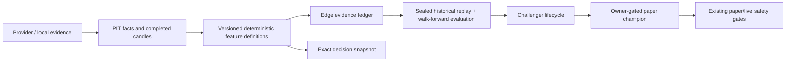

# Feature-Pack Validation Architecture

> Status: P0 built; P1 technical measurement already collecting; feature-registry
> lifecycle hardened to measure-only. P2-P5 remain design-gated.
>
> Date: 2026-08-02
> Owner decision required before P1 or any feature can influence a decision.

> P0 result (2026-08-02): `lib/feature-packs/catalog.ts` is the typed
> applicability/status read model used by Research Journal and Strategy Library.
> It has no data fetcher and no score, signal, paper, live, exit, sizing, broker
> or feature-registry writer. Strategy templates are explicitly reference/manual
> tools until a later bounded shadow compiler accepts their supported rules.
>
> Governance correction (2026-08-02): the legacy registry had an automatic
> `quarantined -> active` transition after a small IC screen. `active` was only
> an observational logger in current code, but its name contradicted the
> architecture and invited misuse. The lifecycle is now
> `proposed -> quarantined -> measure_only -> retired`; legacy rows migrate to
> `measure_only`. This changes no scoring or trade behavior.
>
> Money-path regression corrected (2026-08-10): commit `82c932a3` collected the
> planned fields but also added them directly to `deterministic_v1`. EMA-200,
> MACD, ADX, relative strength, FCF yield, debt/equity, gross margin, PEG and
> 52-week proximity are again evidence/measurement only. Regression tests assert
> that populating these fields cannot change the canonical score.

## 1. Decision

Kairos will evolve from one generic five-dimension score into a small, governed
library of **market-local, instrument-appropriate feature packs**. A feature may
move from `catalogued` to `measure_only`, `shadow`, `paper_challenger`, and only
then to an owner-promoted champion. No popular indicator becomes an active score
input merely because a provider exposes it or a historical chart looks good.

This is not per-ticker parameter fitting. Evidence is evaluated at the smallest
predeclared cohort with enough independent observations, for example US liquid
semiconductors, India large-cap financials, or US broad ETFs. A single stock is
used for attribution and review, never as sufficient evidence to learn its own
MACD period, stop, or fundamental formula.

## 2. Why

The user needs a system that can answer all of these honestly:

1. Which facts and indicators did this decision use?
2. Which ones were unavailable, stale, or structurally inapplicable?
3. Which feature families work for this market, instrument type, and horizon
   after realistic costs?
4. When a candidate feature loses, did it fail statistically, economically, or
   simply lack enough evidence?

The app already has useful pieces, but they are not yet one governed program:

| Existing component | Truth today | Role in this design |
|---|---|---|
| `scoreFundamentals` / `scoreTechnicals` | Current deterministic v1 score | Baseline champion, unchanged until a later promotion |
| `fundamental_facts` | Append-only captured fundamental vintages | Fundamental provenance source; not a full historical backfill |
| `edge_signals` / `edge_signal_inputs` | Immutable scalar factor observations | Canonical measure-only feature evidence |
| Technical Factor Calibration | Measures v1 technical composite, relative strength, MACD/ATR and signed ADX | Initial technical trial family |
| Historical replay / walk-forward work | Offline, sealed, point-in-time validation substrate | Required validation path, not a live predictor |
| `strategy_versions`, `shadow_decisions` | Existing lifecycle and shadow comparison substrate | Only promotion/shadow lifecycle; do not create another one |

## 3. Non-negotiable boundaries

- US and India data, currencies, labels, benchmarks, feature values, trial
  counts, scorecards, and promotions never mix.
- An ETF, leveraged ETF, operating company, ADR, bank, and REIT do not inherit
  a company-fundamental pack by default.
- Every feature has a deterministic formula, version, units, applicable
  instrument kinds, source/provenance rule, freshness rule, missing-data rule,
  and corporate-action policy.
- Feature families are de-correlated by design. RSI, MACD, EMA state, ADX and
  Bollinger are not five independent votes merely because they all describe the
  price path.
- The LLM may propose a hypothesis and explain results. It cannot select a
  winner, change a threshold, choose a per-symbol parameter, or write a
  tradeable feature value.
- A failed fetch, unverified timestamp, stale fundamental, thin cohort, or
  unclassified instrument produces `unavailable` / `inapplicable` / `abstain`.
  It never silently becomes a neutral or favorable feature.
- This program cannot bypass the existing app pause, market controls, drawdown
  breaker, entry quality gates, paper/live approval requirements, or broker
  controls. Until a version is explicitly promoted, it has no money-path reader.

## 4. The feature packs

Feature *families* are the unit of selection. A pack may contain one
predeclared representative from a family, not an indicator zoo.

### 4.1 Shared price and liquidity pack

Applicable to listed equities, ADRs and eligible ETFs when completed daily
candles are available.

| Family | v1/current fact | Candidate additions | Rule |
|---|---|---|---|
| Trend/momentum | RSI(14), EMA20/50 state, 20d trend | 60d relative strength; EMA200 state | Test one state/return representation at a time |
| Volatility/risk | ATR14, latest return/range, breakdown veto | realized/downside volatility, gap frequency | Risk/veto context is not automatically directional alpha |
| Participation | volume vs 20d average | dollar-volume and spread proxy | Current-bar volume never appears in its own baseline |
| Trend-strength | none in v1 | signed ADX14 | P0 technical challenger |
| Momentum confirmation | none in v1 | MACD histogram / ATR | P0 technical challenger |

Fibonacci, Elliott Wave, arcs/fans, and discretionary chart patterns are not
candidate score inputs. They may be visual/context aids, but they have no
deterministic and reproducible feature contract in this program.

### 4.2 Company quality, value, and growth pack

Applicable only to operating companies and reviewed ADRs with a compatible
reported-fundamental basis. All reported values must use the exact
`fundamental_facts` vintage known at the decision timestamp.

| Family | Current v1 input | Candidate addition | Initial classification |
|---|---|---|---|
| Relative valuation | sector-relative P/E | P/B; FCF yield; PEG only with dated consensus | measure-only |
| Profitability | profit margin; ROE; EPS sign | gross profitability / assets; margin trend | measure-only |
| Balance sheet | none | debt/equity and liquidity/leverage context | measure-only |
| Growth | quarterly revenue growth YoY | earnings growth and revenue/margin acceleration | measure-only |
| Earnings event | calendar/repricing safety barrier | actual-vs-consensus surprise, revisions, post-event age | measure-only after PIT source proof |

Analyst target price remains display-only. It is not an alpha feature and cannot
substitute for dated analyst estimate history.

### 4.3 Instrument-specific policies

| Instrument class | Eligible packs | Explicit exclusions / special requirement |
|---|---|---|
| US / India operating company | shared price/liquidity + company pack + local benchmark/sector context | Company values must be market-local and PIT-safe |
| Reviewed US ADR | shared price/liquidity + company pack on the ADS-compatible source | No US Form 4 assumption; foreign-underlying substitutions prohibited |
| Broad or sector ETF | shared price/liquidity + ETF category/benchmark context | Company P/E, margin, ROE, EPS, debt/equity and insider packs are inapplicable |
| Leveraged ETF | shared price/liquidity with explicit underlying-trend, realized-volatility, gap and holding-duration fields | No company pack; no P0 activation; separate intraday/protection design remains authoritative |
| Bank / financial | price/liquidity initially | A bank-specific pack needs capital, asset-quality and net-interest-margin data; do not misuse gross margin or generic FCF yield |
| REIT | price/liquidity initially | A REIT pack needs FFO/AFFO, occupancy, leverage and rate sensitivity; do not treat EPS/P/E as sufficient |

When classification is missing or too coarse, select the conservative generic
price/liquidity shadow pack only. It cannot authorize a new specialized score.

## 5. Canonical data contract

This feature must extend existing truth layers, never create a parallel feature
database.



### 5.1 Reused stores

- `fundamental_facts` is the only reported-fundamental vintage ledger. A feature
  snapshot retains the fact id, report period, filing/known-at date,
  restatement sequence and provider.
- Completed OHLCV is the only source for price features. Formula inputs retain
  candle date, adjustment basis, provider, input fingerprint and as-of cursor.
- `edge_signals` stores one scalar value per feature/version/symbol/date/market;
  `edge_signal_inputs` records the input fingerprint and provenance.
- `decision_observations.features` is the exact feature/policy snapshot that
  produced a research decision. `research_packets.raw_data._scores.evidence`
  is the detailed UI/audit payload. Neither is overwritten.
- `strategy_versions`, validation experiments and `shadow_decisions` remain the
  only lifecycle/evaluation records for a challenger. Do not create a second
  "feature winner" or activation table.

### 5.2 Feature definition requirements

The existing `feature_registry` is extended only after a schema audit. Each
versioned definition must declare:

```ts
type FeatureDefinition = {
  id: string;                 // immutable, includes formula version
  family: "trend" | "volatility" | "participation" | "quality" | "value" | "growth" | "event";
  markets: Array<"us" | "india">;
  instrumentKinds: string[];
  horizonDays: number[];
  formula: string;            // whitelisted deterministic grammar, not code from an LLM
  inputs: string[];
  sourcePolicy: string;
  freshnessPolicy: string;
  knownAtPolicy: string;
  adjustmentPolicy: string;
  missingPolicy: "unavailable" | "inapplicable" | "abstain";
  trialFamilyId: string;
  status: "catalogued" | "measure_only" | "shadow" | "retired";
};
```

Changing formula, period, normalization, universe, missing-data treatment,
source policy, or applicable instrument set creates a new id and increments the
trial family. Existing evidence is immutable.

## 6. Evidence method

### 6.1 Unit of learning

The primary unit is:

```text
market x instrument pack x comparable cohort x feature version x horizon
```

Examples: `US x operating_company x liquid semiconductors x macd_atr_12_26_9
x 10 sessions`, or `India x operating_company x NIFTY IT x relative_strength_60d
x 5 sessions`.

Individual tickers receive an attribution view, not bespoke tuning. A ticker may
be marked `insufficient_symbol_history`; that is an honest state, not an
invitation to optimize around a handful of its outcomes.

### 6.2 Predeclared trial families

Before the first run, the system freezes the candidate list, parameter choices,
market, packs, horizons, cohort definitions and evaluation plan. It counts all
members, including losers and retired candidates, in the multiple-testing
correction. The initial family is intentionally small:

1. Current technical composite v1;
2. 60-day benchmark-relative strength;
3. MACD(12,26,9) histogram / ATR14;
4. signed ADX14;
5. one PIT quality/value composite after fundamental source qualification.

No grid search across RSI/EMA/MACD parameters, sector-specific tuning, or
post-hoc "best combination" is allowed in P0-P2.

### 6.3 Required validation

All claims are market-local and use the sealed replay/historical intake path.

- Purged, embargoed, non-overlapping walk-forward folds; all transforms fit on
  training folds only.
- Rank IC and Newey-West uncertainty, plus long-only top-bucket hit rate and
  top-minus-median spread.
- Net-of-spread, slippage, fees and applicable tax assumptions; turnover is a
  first-class failure condition.
- Stability by independent time block, comparable cohort and benign/adverse
  market regime. A good aggregate that fails every stressed period is not ready.
- Paired champion-versus-challenger results on the same opportunities.
- Multiple-testing adjustment across the frozen trial family. Any existing
  approximate DSR implementation must be repaired before it becomes a promotion
  argument.

Historical replay establishes eligibility only. A feature then collects forward
shadow outcomes before an owner may promote it to a paper champion. Live remains
separately gated by the existing validation, risk, broker and approval controls.

## 7. Research and UI behavior

Every Research Journal record must identify:

- active pack and scoring version;
- facts actually used, their source, `known_at`, freshness and contribution;
- applicable but missing/degraded facts and the exact abstain/renormalization
  treatment;
- observed-only facts, clearly labeled as not used;
- active feature-family overlap warnings, so multiple price transforms do not
  read as independent confirmation.

Score Tracker continues to compare immutable research points. The Upgrade Path
gets one row per feature trial family and market: collection coverage, completed
folds, shadow outcomes, provider calls, status, rejection reason, next gate and
an honest ETA. The header market switch is authoritative; India never shows a
US-only conclusion as an India result.

## 8. Build order

### P0 - catalog and audit, no new feature influence

1. Reconcile `feature_registry`, Edge registry, `fundamental_facts`, instrument
   classification and existing documentation into one typed catalog.
2. Mark every current Strategy Library condition as `supported`, `shadow_only`,
   `manual_only`, or `unsupported`; reject unsupported conditions from automated
   strategy shadows rather than approximating them.
3. Add data-contract tests: units, dates, source, freshness, corporate-action
   basis, market/instrument applicability and missing-data behavior.
4. Surface active/observed/unavailable facts in Research Journal and Score
   Tracker using stored evidence only. No additional provider calls from the UI.

### P1 - existing technical candidates

1. Finish the approved Technical Factor Calibration trial family unchanged.
2. Use the existing Edge ledger to collect v1, relative strength, MACD/ATR and
   signed ADX on completed candles with no extra provider request per feature.
3. Run US and India separately; publish only measure-only results.

### P2 - reported fundamentals qualification

1. Qualify US and India reported facts source-by-source, including a filing or
   conservative known-at date, units, restatements, sector mapping and event
   freshness.
2. Extend the existing PIT ledger and snapshot references; do not backfill
   current provider snapshots as if historically known.
3. Start only four candidates: gross profitability, debt/equity context, FCF
   yield, and revenue/margin acceleration. P/B, PEG, surprise and revisions wait
   for a provider with their required dated inputs.

### P3 - sealed replay and challenger creation

1. Run predeclared pack/candidate trials through the existing historical replay
   and walk-forward architecture.
2. Compile only passed candidates into a market-local `strategy_versions`
   challenger with source/trial lineage.
3. Compare it in non-executing shadow decisions against the current champion.

### P4 - paper promotion, separately approved

An owner can promote one validated, market-local challenger to `paper_active`
only after historical gates and a sufficient forward shadow sample pass. It
replaces no live version automatically. PaperTrader then still applies all
existing admission, position, risk, cash and exit gates.

### P5 - specialist packs, separately proposed

Bank, REIT and leveraged-ETF packs require their own data qualification and
risk-control review. They are not extensions of the generic equity pack.

## 9. Acceptance criteria

- The same immutable input snapshot and definition version produces the same
  feature value and reason codes.
- No feature family produces a provider call per UI view or per duplicate
  indicator in a research run.
- A company feature cannot apply to an ETF; US macro cannot count as India
  evidence; a missing instrument type cannot inherit a specialist pack.
- Every historical fundamental read enforces `known_at <= as_of`; a violation
  throws and invalidates the replay.
- New feature rows cannot change `analyst_score`, direction, eligibility,
  position sizing, paper positions, live proposals, exits or broker orders in
  P0-P3.
- Trial count includes failed/retired variants and rejects arbitrary new
  combinations after evidence collection begins.
- UI shows missing and observed-only facts distinctly from scored facts.
- A failed candidate remains visible with formula/version, sample limits and
  rejection reason; it cannot be silently removed from the trial record.
- Tests prove US/India isolation, instrument applicability, feature-version
  immutability, no look-ahead, fold-only fitting and no money-path reader.

## 10. Out of scope

- LLM-selected scores, rules, or parameter tuning.
- A universal per-stock model or a claim that the app can learn a stock's
  behavior from a few trades.
- Adding every named technical indicator.
- Intraday alpha, broker-side stops, TradingView scraping, or options direction
  scoring.
- Automatic paper or live promotion.

## 11. Authority and related documents

This is the governing integration design for feature selection. It does not
replace the implementation-level specifications below:

- `features/technical-factor-calibration/FEATURE_ARCHITECTURE.md` owns the
  initial MACD/ADX measurement family.
- `features/pit-fundamentals/FEATURE_ARCHITECTURE.md` owns reported-fact
  vintage/known-at semantics.
- `features/historical-replay-harness/FEATURE_ARCHITECTURE.md` and
  `features/walk-forward-ic-folds/FEATURE_ARCHITECTURE.md` own replay and OOS
  validity.
- `features/strategy-portfolio-lab/FEATURE_ARCHITECTURE.md` owns the bounded
  template-shadow UI/lifecycle.
- `docs/arch/03-agents.md`, `04-database-schema.md` and `09-learning-loop.md`
  remain the running-system source of truth and are updated only when a phase is
  actually implemented and verified.
