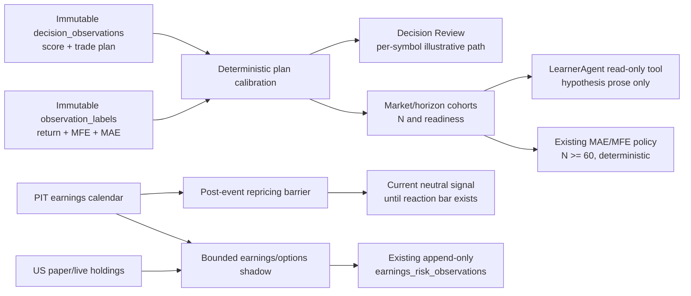

# Forecast Calibration and Earnings-Event Assurance

Status: Approved by owner direction and implemented in phases on 2026-07-30.

## Problem

Kairos already stores each deterministic score, the indicative stop/objective
plan, and immutable 2/5/10/20-session realized paths. Those records are not
joined into an explicit plan-calibration view or exposed as a bounded
LearnerAgent tool. Separately, earnings/options risk is measured only after an
entry reaches PaperTrader or TraderAgent, so an existing holding can lack a
fresh pre-event volatility observation.

The MSFT July 2026 incident exposed a related freshness defect: a pre-event daily
bar was allowed to produce a post-event direction.

## Semantic Boundary

The indicative `profit_objective` is an exit-policy level, **not a predicted
terminal price**. Retrospective language must therefore report:

- decision/reference price;
- stop floor and profit objective;
- planned horizon;
- realized horizon close;
- maximum favorable and adverse excursion;
- whether the path reached the objective or breached the stop; and
- the fraction of the objective reached.

It must not call the objective a forecast mean or describe a one-stock miss as
evidence that a strategy parameter is wrong.

## Architecture

## Deterministic Calibration

The reusable calculator consumes one original trade plan and one matured label.
It refuses malformed, non-candidate, stale, or currency-incoherent plans.

For the label whose horizon exactly matches `horizon_sessions`:

- `objective_reached = MFE >= target_pct`;
- `stop_breached = MAE <= -stop_loss_pct`;
- `objective_reach_ratio = MFE / target_pct`;
- terminal return, benchmark-neutral return, MFE, and MAE remain distinct.

MAE and MFE alone do not reveal event order. If both levels were touched, the
calculator reports both and never claims which exit would have happened first.

Per-symbol output is always illustrative. Cohorts become reviewable at 20
matured paths, while risk-parameter admission keeps the existing stricter floor
of 60 same-market, same-horizon eligible-long labels.

## LearnerAgent Boundary

The LLM may:

- read deterministic aggregate calibration;
- explain likely failure modes;
- write a hypothesis for future validation; and
- point to insufficient evidence.

The LLM may not:

- calculate labels or overwrite realized outcomes;
- change stop, target, horizon, score, or weights from one event;
- treat personal trade history as market-wide evidence; or
- bypass the existing challenger/promotion gates.

The existing deterministic MAE/MFE policy remains the only automatic
stop/objective adjustment path and requires at least 60 matching labels.

## Options Monitoring

Options remain US earnings-risk evidence, never a sixth directional score.
Cboe's own explanation is explicit that earnings options primarily estimate move
magnitude rather than direction.

The scheduled shadow monitors only:

- open US paper positions; and
- symbols in the latest complete US live holding-risk snapshots.

It deduplicates symbols, caps work per run, and discovers events from the
persisted cache plus one bounded Robinhood calendar call. That batch fallback
closes a cold-cache gap without creating N per-symbol requests. It requests an
option chain only when the event falls inside that position's horizon.
Otherwise-eligible entries continue to be measured at the existing
PaperTrader/TraderAgent choke points. Rejected/watchlist symbols do not consume
option calls merely to inflate a sample.

Every observation is append-only, idempotent per market session, and
`behavior_changed=false`. It cannot score, size, enter, exit, or mutate a
position.

## Earnings Repricing Rules

- Before-market-open result: the report-date daily bar can contain the reaction.
- After-close result: a daily bar strictly after the report date is required.
- Unknown session: use the conservative after-close rule.
- A known event that is already in the past activates the barrier even when the
  actual-result feed is late.
- A current neutral signal is written so consumers cannot fall back to an older
  directional signal.
- Mechanical stop, target, trailing-stop, and time exits remain independent.

## Acceptance Criteria

1. MSFT-style AMC input plus only the report-date bar produces `neutral`.
2. BMO input plus a completed report-date bar releases the barrier.
3. A late actual feed cannot reopen stale scoring after a known past event.
4. Decision Review shows plan versus realized path without calling the objective
   a terminal-price prediction.
5. LearnerAgent receives only aggregate deterministic calibration and cannot
   mutate risk parameters from it.
6. The holding monitor writes only shadow observations and never calls options
   for India or for an event outside the position horizon.
7. No US/India data is aggregated together.

## Sources

- Cboe, "What Options Data May Indicate About Mag 7 Earnings":
  https://www.cboe.com/insights/posts/what-options-data-may-indicate-about-mag-7-earnings/
- Rompolis, "Pricing event risk: evidence from concave implied volatility
  curves," Review of Finance (2025):
  https://doi.org/10.1093/rof/rfaf016
- Novy-Marx, "Backtesting Strategies Based on Multiple Signals," NBER Working
  Paper 21329:
  https://doi.org/10.3386/w21329
