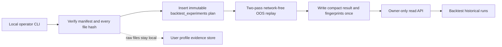

# Local Historical Replay Worker

**Status:** APPROVED and implemented by owner direction on 2026-07-29
**Scope:** deterministic offline research, immutable experiment lineage, read-only app visibility
**Money-path status:** unreachable; diagnostic results cannot change scoring, promotion, positions, cash, orders, or broker state

## 1. Decision

Kairos will run large historical experiments on the operator's machine, where the
verified evidence store already lives. Vercel and the browser never read the raw
files. Supabase stores only the predeclared experiment, dataset/universe/run
fingerprints, compact result summary, and timestamps.

The worker extends `backtest_experiments`, the existing immutable experiment
lineage. It does not create another result ledger and does not populate the older
`replay_eligibility_*` tables.

Initial executable scope is an India, price-only, cross-sectional OOS diagnostic
of `kairos_technical_score_v1` using official NSE bhavcopy. US bulk SEC facts and
FRED vintages remain available to later sealed feature studies, but Kairos does
not claim a US price backtest until a survivor-safe adjusted-price source is bound.

## 2. Runtime Boundary

The CLI may contact Supabase only to register and complete lineage. After
predeclaration, the replay calculation has no provider client and makes no market
data API call. It reads the manifest-bound local files only.

## 3. Immutable Plan

An experiment is inserted before normalized market rows are read. Its plan fixes:

- dataset IDs and expected SHA-256 fingerprints;
- market, data cutoff, date window, horizon, cadence, and fold layout;
- exact edge/formula version and git commit;
- point-in-time universe rule and liquidity lookback;
- minimum cross-section and action-exclusion policy;
- one predeclared variant and diagnostic evidence class.

`plan_fingerprint` is unique. A completed plan is never overwritten. Re-running
the same plan returns the existing result; changing any input creates a new plan.

Post-run defects do not rewrite that result. An append-only
`backtest_experiment_quality_reviews` row marks the artifact
`accepted_diagnostic` or `invalidated`, records the reason, and may point to its
replacement. Backtest must show this review state prominently.

## 4. India Replay Method

1. Verify the NSE daily-bar and corporate-action manifests byte-for-byte.
2. First pass builds a trailing 20-session turnover rank from date-ordered bars.
3. On each predeclared non-overlapping as-of date, select the top 200 eligible
   equities using only information available on or before that date.
4. Reject symbol/date observations with a split, bonus, rights issue, demerger, or
   ambiguous price-affecting action in the feature/label window. Raw dividends are
   not converted into total returns, so the run is explicitly diagnostic.
5. Second pass loads only the union of selected symbols plus `NIFTYBEES`.
6. Compute the exact production technical composite from candles through `as_of`.
   Compute the forward return only after `as_of`; immature labels are dropped.
7. Calculate raw-rank Spearman IC per date. No winsorization precedes ranking.
   Aggregate mean IC, sample sigma, IC IR, and Newey-West t-stat.
8. Persist the bounded per-date audit series plus dataset, universe, and run
   fingerprints.

The result is research evidence, not a simulated portfolio claim. Costs, capacity,
tax, dividends, and execution are not represented and the UI must say so.

## 5. Database Contract

`backtest_experiments.experiment_type = 'historical_replay'` uses the existing
service-role-only table and mutation guard. Required plan fields include formula,
horizon, validation mode, trial family, universe policy, data cutoff, exact code
commit, structured validation spec, unique plan fingerprint, and predeclared
variant/count. Completion requires all three SHA-256 fingerprints and a structured
result. No anonymous or authenticated table grant is added.

## 6. App Surface

`GET /api/agents/backtest/historical`:

- calls `requireOwner()` before using the service client;
- returns only bounded historical-replay rows and compact summaries;
- never returns raw evidence paths, credentials, or source files;
- has no POST method and cannot start a process on the user's desktop.

Backtest shows market, status, edge, date range, evaluated/skipped dates,
cross-section, mean IC, sigma, HAC t-stat, evidence class, dataset fingerprint,
and limitations. It visually separates these runs from legacy signal replay.

## 7. Safety and Non-Goals

- No LLM in acquisition, features, labels, statistics, or persistence.
- No raw upload to Supabase, Vercel, Git, or the browser.
- No network fallback when a local file is missing or invalid.
- No use by ResearchAgent, PaperTrader, TraderAgent, PositionMonitor, LearnerAgent,
  promotion RPCs, strategy policies, or broker adapters.
- No automatic schedule. The operator runs the CLI for an approved fixed plan.
- No inference that one diagnostic run validates a strategy. Promotion remains
  separately fail-closed under existing PIT/walk-forward governance.

## 8. Acceptance Gates

1. A changed byte or manifest fingerprint aborts before result computation.
2. The experiment plan exists before the first normalized row is read.
3. No candle after `as_of` enters feature computation.
4. No label is shorter than the declared session horizon.
5. Exact-plan reruns are idempotent; completion is write-once.
6. Anonymous/authenticated clients still cannot access the table.
7. The app API rejects non-owner callers.
8. Focused tests, TypeScript, production build, and one real local run pass.
