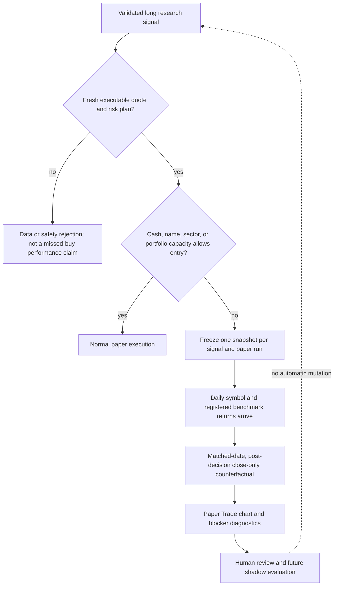

# Missed Paper Entry Learning Ledger

> Status: implementation and tests are complete locally; additive database
> migration `20260925220447` is applied. App deployment is pending. It has no
> score, sizing, eligibility, or order consumer.

## Purpose

When a strong, valid long signal could not enter because available cash or the
portfolio risk/capacity limits blocked it, Kairos must preserve what it knew at
that decision. Later prices answer a useful question: how did an equally sized,
rule-compliant paper allocation perform after that missed entry, relative to the
market? The answer diagnoses capacity policy; it does not prove the trade was
known to be profitable in advance.

## Decision and evidence flow

## What qualifies

The paper trader records a snapshot only after the signal is a validated long,
meets the current entry score threshold, has passed the fresh quote and dynamic
stop/target plan, and ordinary re-entry and symbol controls pass. It records
capacity-related non-fills: insufficient cash, constructor zero room, open-name
limit, sector limit, daily notional limit, and a qualified rotation that remains
disabled or fails its independent evidence gates. A malformed, short, stale,
unpriced, already-held, or safety-rejected signal is not described as a missed
purchase.

Each `(signal, market, paper run)` attempt has an idempotent key. The row freezes
the score, quote and quote timestamp, slippage-adjusted paper fill proxy, risk
levels, horizon, proposed or post-swap feasible size when known, and exact block
reason. It never rewrites an earlier decision with later facts.

## Price and benchmark interpretation

Paper Trade shows the frozen fill proxy against the latest append-only per-symbol
raw daily close revision for each session and the market's primary benchmark from
the versioned benchmark registry (VOO in
the US and NIFTY 50 in India). Candidate return is measured directly from its
hypothetical fill proxy to each observed post-decision close, avoiding a
close-to-close return interval that began before an intraday decision. The
benchmark uses its prior completed-session close as baseline because a same-session
close can occur after the decision; only dates with both candidate and benchmark
closes appear as matched points. A benchmark baseline is accepted only if that
prior close was already available by the decision timestamp. Because the
benchmark starts at a prior close while the candidate starts at its fill proxy,
benchmark excess is a baseline proxy—not exact decision-time matched-entry alpha.
Missing coverage is exposed as a gap; no value is filled with zero.

This is a close-based counterfactual, not a simulated fill tape. The bar during
the decision session is excluded. The UI presents both the unmanaged horizon mark
and a separate close-only risk-managed proxy that assumes exit at the first close
beyond a frozen stop/target, or at the planned horizon close if neither is crossed.
Daily closes cannot reveal intraday order, slippage, spread, stop gaps or actual
execution, so this is never called a realized return. A later real BUY of
the same symbol in the same market censors this missed-entry episode regardless
of which later signal initiated it; subsequent returns belong to the real trade.

## Learning boundary

The learning view reports counts, reasons, matched excess return, marked
counterfactual P&L, risk-managed close-only P&L, target/stop close crossings,
maturity and data coverage by market, score and portfolio-capacity condition.
These are outcomes of the
selection/portfolio process and remain a diagnostic dataset. They do not
automatically lower a cash target, change the 8-name request, change scores, or
alter risk geometry. A future change needs a frozen, walk-forward comparison
against actually selected entries, a same-session eligible-but-untraded control,
transaction costs, benchmark matching, and enough independent sessions.

## Security and data lifecycle

`paper_missed_opportunities` is service-written and owner-readable under RLS.
It contains market decision evidence, no broker credential or account secret.
The public API is owner-gated. It reads, joins and derives marks without writing
positions, orders, labels, scores, or upgrade-path readiness.
