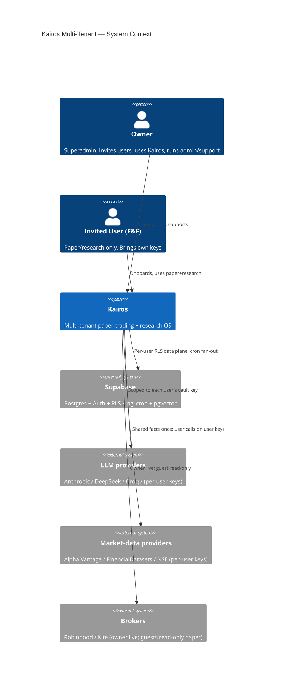
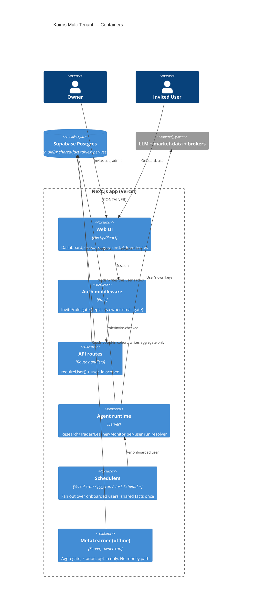

# Feature Architecture: Multi-Tenant (Friends & Family)

## Status

Architecture status: Draft
Architecture approved: No
Approved scope: None
Approved date: None
Implementation allowed: No

> DESIGN ONLY. No code, no migration file, no migration applied, no deployment.
> This document is a proposal awaiting the owner's explicit approval gate
> (CLAUDE.md "Architecture-First Mode"). Nothing here ships until the owner says
> "Approved / Proceed / Implement this".

---

## Feature Purpose

Let the owner invite a small, vetted circle (friends & family) to use Kairos for
their **own internal paper/research** use. Each invited user gets an isolated
account: their own onboarding, their own market-data + LLM + broker keys, their
own paper book, and — the interesting part — a **fresh champion genome and
learning loop** that adapts on *their* trades, never on anyone else's. The system
explores whether *aggregate, privacy-preserving* meta-insights can be shared
across users without ever sharing an individual's weights or trades.

This is the transition from a **single-owner personal tool** (one hardcoded email,
global-singleton tables scoped by RLS to that email) to a **narrow multi-tenant
tool** (N users, every per-user row carries `user_id`, RLS scoped to
`auth.uid()`), while keeping the free-cloud-only, deterministic-money-path, and
per-market/currency-isolation invariants intact.

## User/System Questions This Feature Answers

- How does the owner let a specific friend in — and *only* that friend — without
  opening public registration?
- When a new user logs in for the first time, what must they provide before any
  agent runs on their behalf, and how do we stop agents running until they do?
- How is user A's genome/learning kept provably separate from user B's?
- Whose API keys and LLM spend pay for a given user's runs? (Answer: always their
  own — the owner never pays a guest's usage.)
- What, if anything, is safe to learn *across* users, and how do we share it
  without leaking any individual's trades or weights?
- How do we migrate the current single-owner data so the owner becomes "user 1"
  with zero loss?

## Scope

This feature includes:

- A tenancy model: `user_id` on every **per-user** table + Supabase RLS keyed on
  `auth.uid()` (replacing the owner-email RLS), with an explicit shared-vs-per-user
  table classification and a single-user→multi-user backfill.
- Owner-approved signup: an invite/allowlist gate. New emails cannot self-activate.
- A guided onboarding flow that blocks all agent activity until complete.
- Per-user genome + per-user learner (the locked 10-closed-trade Phase-0 rule,
  applied per user per market).
- A cross-user learning design that shares **only** opt-in, aggregate,
  k-anonymized meta-insights — never individual weights or trades.
- Security/isolation: RLS proof obligations, per-user vault isolation, owner-admin
  boundary, per-user cost isolation.
- C4 context + container diagrams, a phased rollout, and acceptance tests.

## Non-Goals (explicitly OUT of scope)

- **Billing / metering / subscriptions.** Friends & family = free. Lago stays a
  `later_product_idea` (per `features/external-research-integrations/REPOSITORY_CAPABILITY_CATALOG.md`).
  No Stripe wiring beyond the dormant legacy columns already on `profiles`.
- **Public / open self-service signup.** Invite-only, owner-gated, forever (for
  this feature).
- **Any shared money path.** No pooled capital, no shared book, no cross-user
  order routing. Each user's book is theirs alone.
- **Live trading for invited users, initially.** Paper-first. Guests are
  hard-capped to paper + research. Live broker order placement stays owner-only
  until a separate, later, explicitly-approved phase.
- **Hand-tuning of weights by users.** Users influence their own genome only
  indirectly (risk profile, mandate, and their realized outcomes). No user — not
  even the owner-for-a-guest — edits a genome's raw weights by hand.
- Changing the deterministic no-LLM-on-money-path rule, per-market/per-currency
  isolation, or the free-cloud-only constraint.

---

## Current Behavior (verified against code, 2026-07-15)

Kairos is **single-user, owner-gated to one email**. Concretely:

| Layer | Today | File |
|---|---|---|
| Owner identity | `OWNER_EMAIL = "vterminater@gmail.com"` (hardcoded constant) | `lib/auth/owner.ts` |
| Page gate | `middleware.ts` signs out any session whose `email !== OWNER_EMAIL`; gates `/dashboard`, `/admin` | `middleware.ts` |
| API gate | `requireOwner()` returns 403 unless `user.email === OWNER_EMAIL && email_confirmed_at` | `lib/auth/require-owner.ts` |
| RLS | Owner-**email** predicate: `(auth.jwt() ->> 'email') = 'vterminater@gmail.com'` on the sensitive tables; `service_role` bypasses RLS for all server/agent writes | migrations 142, 144, `20260713112754` |
| Profiles | `profiles` PK = `auth.users.id`; `handle_new_user()` trigger auto-creates a row on signup and stamps `role='superadmin'` for the owner email | `001_initial_schema.sql` |

**Which tables already carry `user_id`:** only the *legacy consumer-app* tables
from the original FinanceOS product — `holdings`, `predictions`, `watchlist`
(`UNIQUE(user_id, symbol)`), plus `profiles` (PK = `auth.users.id`). These predate
the agent system and are effectively dormant for the agent flows.

**Which tables are global singletons with NO `user_id`** (owner-scoped only by the
email-RLS + the fact that one person uses the app) — the agent system's entire
data plane:

- **Strategy/config:** `strategy_config` (a *single row*), `strategy_versions`
  (per-market champion/challenger), `agent_config`, `learner_config`,
  `learning_priors`, `learning_priors_history`, `learning_log`,
  `signal_weights_history`, `investment_mandates`, `market_controls`,
  `strategy_validation_automation`, `strategy_sleeves`.
- **Research/signals:** `agent_signals`, `signal_score_history`,
  `decision_observations`, `research_packets`, `research_queue`, `edge_signals`,
  `edge_ic_history`, `universe_snapshot*`.
- **Paper book:** `paper_portfolio`, `paper_positions`, `paper_trades`,
  `paper_order_events`, `paper_performance`.
- **Live book:** `broker_accounts`, `live_account_snapshots`, `live_performance`,
  `broker_orders`, `broker_order_events`, `trade_proposals`, `decision_journal`.
- **Learning/RAG:** `trade_memories` (pgvector), `experiment_runs`,
  `strategy_evaluations`, `benchmark_scorecard`, `rotation_events`.
- **Secrets:** `api_key_vault` — a **single global vault** keyed by
  `key_name`/`provider` UNIQUE; resolution is vault-first / env-fallback,
  service-role-locked (`lib/llm-keys.ts`, `lib/vault-pin.ts`). LLM keys and broker
  OAuth tokens all share this one store.

**Genuinely-shared market facts (NOT user data — must stay global):**
`macro_regime`, `macro_signals`, `india_screen_cache`, `evidence_records`,
`fundamental_facts`, `corporate_actions`, `benchmarks`,
`benchmark_price_observations`, `provider_pacing`, `provider_call_ledger`,
`evidence_cache_v2`, the evidence-policy tables, and the market-knowledge
principle base (`knowledge/`). These describe *the market*, identically for
everyone, and are expensive to recompute per user.

**Scheduling today** is global: Vercel crons, Windows Task Scheduler
(`scripts/run-agents.ps1`), and Supabase `pg_cron` each fire once and operate on
the single owner's book, parameterized only by `?market=us|india`. There is **no
per-user fan-out** anywhere.

**No onboarding, invite, or allowlist flow exists** for users today — this is
greenfield.

---

## Proposed Behavior

### 1. Tenancy model

The core move: **add `user_id uuid NOT NULL REFERENCES auth.users(id)` to every
per-user table, and switch RLS from the owner-email predicate to
`user_id = auth.uid()`.** Shared market-fact tables keep no `user_id` and stay
readable by all authenticated users.

#### 1a. Table classification (the load-bearing decision)

| Class | Rule | Tables (representative) |
|---|---|---|
| **Per-user (add `user_id`, RLS `= auth.uid()`)** | Anything that is one user's config, book, signals, learning, or secrets | `strategy_config`*, `strategy_versions`, `agent_config`, `learner_config`, `learning_priors*`, `learning_log`, `signal_weights_history`, `investment_mandates`, `market_controls`, `strategy_validation_automation`, `strategy_sleeves`, `agent_signals`, `signal_score_history`, `decision_observations`, `research_packets`, `research_queue`, `edge_signals`, `edge_ic_history`, `universe_snapshot*`, `paper_portfolio`, `paper_positions`, `paper_trades`, `paper_order_events`, `paper_performance`, `broker_accounts`, `live_account_snapshots`, `live_performance`, `broker_orders`, `broker_order_events`, `trade_proposals`, `decision_journal`, `trade_memories`, `experiment_runs`, `strategy_evaluations`, `benchmark_scorecard`, `rotation_events`, `watchlist`, `holdings`, `predictions`, `briefings`, `newsletters`, `mentor_insights`, `agent_runs`, `agent_alerts`, `llm_call_log`, `rag_traces` |
| **Shared market facts (NO `user_id`, RLS: read-all-authenticated, service-write)** | Identical for everyone; describes the market, not a person | `macro_regime`, `macro_signals`, `india_screen_cache`, `evidence_records`, `fundamental_facts`, `corporate_actions`, `benchmarks`, `benchmark_price_observations`, `provider_pacing`, `provider_call_ledger`, `evidence_cache_v2`, evidence-policy tables, `symbol_blocklist` |
| **Secrets (per-user, but never client-readable)** | Per-user vault rows; service-role only, never returned raw | `api_key_vault` → **add `user_id`**, change UNIQUE to `(user_id, key_name)` |

> \* **`strategy_config` is the sharpest change.** It is a *single-row* table today
> (`SELECT ... LIMIT 1` everywhere). Multi-tenant requires it to become
> **one row per user** (drop the singleton assumption; key by `user_id`). Every
> call site that does "read the config row" must become "read *this user's* config
> row". This is the highest-touch refactor and the biggest source of latent
> single-tenant assumptions. Same pattern for `paper_portfolio` (already per-market;
> becomes per-user-per-market) and `market_controls`.

#### 1b. Composite scoping keys

Kairos already isolates by **market** (`us` | `india`) and **currency**. Multi-tenant
adds **user** as the outermost scope. The canonical grain of a book row becomes
**`(user_id, market)`**; of a champion, **`(user_id, market, is_champion)`**. No
row is ever summed across `user_id`, exactly as no row is summed across currency
today. All existing per-market uniqueness constraints gain `user_id` as the
leading column (e.g. `strategy_versions` champion-uniqueness →
`UNIQUE(user_id, market) WHERE is_champion`).

#### 1c. RLS pattern (replaces owner-email)

For every per-user table:

```
-- read/write only your own rows
CREATE POLICY user_rw ON <table>
  FOR ALL TO authenticated
  USING  (user_id = (SELECT auth.uid()))
  WITH CHECK (user_id = (SELECT auth.uid()));
```

`service_role` continues to bypass RLS — but see §6: server/agent code must now
**explicitly stamp and filter `user_id`** on every service-role query, because the
DB will no longer protect it (the email predicate is gone). This is the single
biggest correctness risk and gets an acceptance test.

Owner/admin visibility (support, debugging) is **not** a blanket RLS bypass. It is
a separate, audited, read-only admin surface (§6) that uses `service_role` with an
explicit `user_id` filter and writes an access-log row — never an "owner sees all
via RLS" shortcut.

#### 1d. Migration from single-user (backfill owner as user 1)

1. Resolve the owner's `auth.users.id` (call it `OWNER_UID`).
2. For each per-user table: `ALTER TABLE ... ADD COLUMN user_id uuid;`
   then `UPDATE ... SET user_id = OWNER_UID WHERE user_id IS NULL;`
   then `ALTER COLUMN user_id SET NOT NULL` + add FK + index `(user_id, ...)`.
3. Replace owner-email RLS policies with the `auth.uid()` policies above.
4. `strategy_config` / `paper_portfolio` / `market_controls`: the existing rows
   are stamped `OWNER_UID`; the singleton reads become per-user reads.
5. Shared-fact tables: unchanged except tightening RLS to "read-all-authenticated,
   service-write" (they were owner-email or service-only before).
6. Backfill is **idempotent and reversible** (guard on `WHERE user_id IS NULL`),
   applied per CLAUDE.md's schema-migration rule (verify applied to target DB via
   `information_schema` before any dependent code ships).

Because every existing row is stamped `OWNER_UID`, the owner's book, genome,
learning history, and vault survive the migration **byte-for-byte** — the owner
simply becomes user 1.

### 2. Owner-approved signup (invite / allowlist)

No open registration. A new `user_invitations` table is the gate:

| Column | Type | Notes |
|---|---|---|
| `email` | text PK (citext) | Invited address, normalized |
| `invited_by` | uuid | Owner's uid |
| `status` | text | `invited` \| `activated` \| `revoked` |
| `role` | text | `guest` (default) \| `owner` |
| `capabilities` | jsonb | e.g. `{ live_trading: false, markets: ["us"] }` — paper-only by default |
| `invited_at` / `activated_at` / `revoked_at` | timestamptz | |

Flow:

1. Owner adds an email in an **Admin → Invites** panel (owner-only, guarded by a
   new `requireRole('owner')`).
2. The email is added to `user_invitations (status='invited')`. Supabase Auth
   signups are configured **invite-gated**: a `handle_new_user()` update rejects
   (or immediately deactivates) any signup whose email is not `status='invited'`.
   This replaces the "reject everyone but OWNER_EMAIL" logic in `middleware.ts`.
3. The invited person signs in (magic-link / OAuth). `handle_new_user()` flips the
   invite to `activated`, creates their `profiles` row with `role='guest'`, and
   marks onboarding incomplete.
4. `middleware.ts` and `requireOwner`→`requireUser` change: instead of comparing
   to a hardcoded email, they check `profiles.role`/invite status. `OWNER_EMAIL`
   stays only as the bootstrap seed for user 1 and the owner-admin check.
5. Revocation: owner sets `status='revoked'`; middleware signs the session out and
   blocks re-entry. (Data is retained, not deleted — deletion is a separate,
   explicit, out-of-scope action.)

### 3. Onboarding (agents gated until complete)

A new `onboarding_state` per user (columns on `profiles` or a small
`user_onboarding` table) with a hard gate: **no agent, cron, or research run
executes for a user until `onboarding_complete = true`.** The gate is enforced in
the agent entry points (the per-user run resolver, §7) — a user who hasn't
finished onboarding is simply skipped by the schedulers.

Guided steps (a wizard; each writes to the user's own rows):

1. **What Kairos does** — explainer + the hard rules (paper-first, deterministic
   money path, you bring your own keys, your data is isolated).
2. **Market-data keys** — the user enters *their own* provider keys (Alpha Vantage,
   FinancialDatasets, etc.) into *their* vault rows. Nothing runs on the owner's
   keys. Missing required keys → that capability stays dark.
3. **LLM model + key** — the user picks a per-flow model and supplies the matching
   provider key (reuses the existing Settings → AI Models UX and `lib/llm-keys.ts`,
   now `user_id`-scoped). No key → that flow is disabled for them (never silently
   billed to the owner).
4. **Broker connect (paper-first)** — optional; read-only holdings import only.
   Live order placement is **not** offered to guests in this phase.
5. **Risk profile + mandate** — `Conservative | Balanced | Aggressive` and a
   default `investment_mandate` (horizon/benchmark). These seed the user's
   `strategy_config` and their fresh genome (§4).
6. **Confirm** — sets `onboarding_complete = true`, which arms their schedulers.

### 4. Per-user genome + learning loop

Each user gets a **fresh champion genome per market**, seeded at onboarding from a
neutral default prior (the same academic prior the single-owner app seeds today —
5 equal-ish dimension weights + default genome ranges), **not** from any other
user's genome. From there:

- The user's `strategy_versions` rows (`user_id`-scoped) hold *their* champion +
  challengers. `UNIQUE(user_id, market) WHERE is_champion`.
- Their LearnerAgent run reads **only their** closed `paper_trades` /
  `decision_observations` and proposes challengers for **their** genome.
- The locked **Phase-0 gate applies per user**: weight mutation is blocked until
  that user has 10+ closed trades in that market. A user with 3 trades stays on the
  seeded champion; the owner with 200 trades is on their evolved champion. The
  gate, the auto-guard (last-3-runs win-rate < 35%), and the "size down only, never
  above the user-set cap" genome rule are unchanged — just per-user.
- Their Validation Engine replays walk-forward on **their** `decision_observations`
  only. Their promotion decisions touch only their champion.
- **Full isolation invariant:** *user A's outcomes never touch user B's weights.*
  There is no code path, RLS policy, or query that reads one user's trades to
  mutate another's genome. This is the divergence acceptance test (§Acceptance):
  two users fed different trade sets must produce measurably different champions.

Users influence their genome **only** through risk profile, mandate, and realized
outcomes — never by editing raw weights (the CLAUDE.md push-back mandate is
preserved and now applies per user).

### 5. Cross-user learning (the interesting part)

The design question the owner cares about most. Two hard boundaries first, then the
narrow safe channel.

**Never shared (hard NO):**

- Individual weight genomes / `weights_snapshot` / champion parameters.
- Any per-user trade, signal, position, P&L, or `decision_observation`.
- Anything from which a single user's book or identity could be reconstructed.

**Already shared, safely (existing priors):** the **academic principle base**
(`knowledge/`) and the deterministic scoring grammar. These are literature-derived
priors, identical for everyone, and carry no user data. They stay shared — this is
not new leakage.

**The proposed narrow channel — opt-in, aggregate-only meta-insights:**

A separate, deterministic **MetaLearner** (offline, owner-run, no money path)
computes *cohort-level* observations across users who have **opted in**, subject to
strict privacy guards, and emits them only as **priors nudges bounded in
magnitude**, never as another user's weights:

- Example output: *"across opted-in users, the momentum-dimension weight tended to
  rise in high-volatility regimes"* — a **direction**, not a value, not attributable
  to anyone.
- **k-anonymity / min-cohort:** an aggregate is emitted only if it is computed over
  **≥ K opted-in users** (proposed K ≥ 5) *and* ≥ N trades, so no cohort can be
  narrowed to one person. Below the floor → no insight emitted.
- **Aggregation before storage:** only means/medians/rank-correlations over the
  cohort are ever persisted; raw per-user inputs are read under service-role,
  reduced in-memory, and discarded. No per-user row is copied into the meta store.
- **Overfitting guards:** meta-insights are advisory *priors*, bounded to a small
  max nudge (e.g. ±X% of a dimension weight), pass the same walk-forward validation
  before they can influence anyone, and are rate-limited (at most one meta-update
  per cadence). They can **never** bypass a user's own Phase-0 gate or promote a
  user's champion.
- **Opt-in + revocable:** default **OFF**. A user opts in explicitly during
  onboarding or Settings; opting out removes them from all future cohorts.
- **No money path:** the MetaLearner writes to a `meta_insights` (aggregate) table
  only; it never places an order, moves cash, or auto-mutates a champion.

This gives "collective intelligence" its upside (regime-conditioned prior nudges)
while keeping every individual's weights and trades private and every user's book
adapting primarily to their own outcomes.

### 6. Security / isolation

- **RLS proof obligation.** Every per-user table has an `auth.uid()` policy; a test
  suite (§Acceptance) asserts, per table, that user B receives **zero** rows of user
  A via the anon/authenticated client. The dangerous change is that removing the
  owner-email predicate means **server code is now the last line of defense** on
  service-role queries — so every service-role read/write must carry an explicit
  `.eq('user_id', uid)`. A lint/code-review checklist + an integration test that
  runs each agent as user B and asserts it never reads user A's rows.
- **Per-user vault isolation.** `api_key_vault` gains `user_id`;
  `UNIQUE(user_id, key_name)`. `getProviderKey()` / `setProviderKey()` /
  broker-token resolution all take a `user_id`. A user can never read or use
  another user's key; keys remain write-only from the UI and are never returned
  raw. Env-fallback becomes **owner-only** (guests must bring their own keys — see
  cost isolation).
- **Owner-admin boundary.** The owner is a superadmin for *support* (read-only,
  audited), not a data-plane superuser. Admin reads go through a dedicated
  service-role surface that filters by the target `user_id` and writes an
  `admin_access_log` row. No "owner sees everything" RLS bypass.
- **Cost isolation.** Each user's LLM and market-data calls resolve **their** vault
  keys only; env-fallback is disabled for guests. A guest with no key → the flow is
  disabled, not silently charged to the owner. `llm_call_log` is `user_id`-scoped so
  spend is attributable per user. This directly satisfies the free-cloud-only /
  "users bring their own keys" memory constraint.
- **Live-trading lockout.** Guests' `capabilities.live_trading = false` is enforced
  at the order gate (in addition to the existing 9 safety gates + autonomy ladder).
  A guest cannot reach a live broker order path regardless of settings.

### 7. Scheduling (per-user fan-out)

Today's crons operate on one book. Multi-tenant needs the schedulers to **fan out
over active, onboarded users**:

- Each global cron endpoint (`/api/agents/research/cron`, `paper-trade`,
  `position-monitor`, `learner`, `performance`, briefings, …) changes from
  "run once" to "for each user where `onboarding_complete AND NOT paused`, run
  scoped to that `user_id`". Shared market-fact refreshes (macro, screen cache,
  evidence) run **once, globally**, not per user — so N users don't multiply the
  market-data spend.
- Free-cloud-only constraint: Vercel cron count/time budgets are fixed, so fan-out
  is a **sequential loop inside one cron invocation** (bounded, small N), not N
  separate cron entries. Per-user provider pacing (`provider_pacing`, migration 176)
  already exists and extends naturally.
- Guests are paper-only, so the live-order crons stay owner-scoped in this phase.

---

## System Architecture

### C4 — Level 1: System Context



### C4 — Level 2: Container



### Screen / Page / Module Inventory (new or changed)

- **New:** Admin → Invites panel; Onboarding wizard (6 steps); per-user Settings
  (keys/LLM/risk/mandate now `user_id`-scoped); opt-in-to-meta toggle.
- **Changed:** `middleware.ts` (invite/role gate), `lib/auth/require-owner.ts` →
  add `requireUser()` / `requireRole()`, `lib/llm-keys.ts` + vault helpers (take
  `user_id`), every agent entry point (per-user run resolver + onboarding gate),
  every cron endpoint (fan-out), all `strategy_config`/`paper_portfolio` single-row
  reads.
- **New tables:** `user_invitations`, `user_onboarding` (or columns on `profiles`),
  `meta_insights` (aggregate-only), `admin_access_log`.
- **Altered tables:** `user_id` added to every per-user table (§1a) + RLS swap.

---

## Phased Rollout

| Phase | Goal | Exit criteria |
|---|---|---|
| **P0 — Owner-only (backfill)** | Add `user_id` everywhere, backfill owner as user 1, swap RLS to `auth.uid()`, refactor singleton reads. **Zero behavior change for the owner.** | Owner's book/genome/vault byte-identical post-migration; all agents run scoped to `OWNER_UID`; RLS tests pass with a single user. |
| **P1 — 1 invited user** | Invite flow + onboarding gate + per-user vault + per-user genome seeding + cron fan-out (N=2). | A second user onboards on their own keys, gets a fresh champion, runs paper research; isolation tests prove zero cross-read; owner unaffected. |
| **P2 — N users** | Harden fan-out under cloud budgets; per-user pacing; admin support surface + access log. | N (small) users run within Vercel cron budgets on their own keys; provider pacing holds; admin reads are audited. |
| **P3 — Cross-user meta (opt-in)** | MetaLearner: aggregate, k-anon (K≥5), bounded prior nudges, validated, opt-in. | Meta-insights emit only above the cohort floor; no per-user data in the meta store; nudges pass walk-forward; opt-out removes a user from cohorts. |
| **(Later, separate approval)** | Guest live trading, billing/metering. | Out of scope for this feature. |

---

## Acceptance Tests

1. **Tenant isolation (data plane).** As authenticated user B, every per-user table
   returns 0 rows belonging to user A (direct PostgREST + through each API route).
2. **RLS policy coverage.** Automated check: every table classified per-user has an
   `auth.uid()` policy and no lingering owner-email or `USING(true)` policy.
3. **Service-role filter guard.** Run each agent as user B; assert (via query log /
   integration harness) it never reads or writes a row with `user_id = A`.
4. **Onboarding gate.** A user with `onboarding_complete = false` is skipped by all
   schedulers; no `agent_signals`/`paper_*` rows are ever created for them.
5. **Invite gate.** A non-invited email cannot activate; a revoked user is signed
   out and blocked; only `status='invited'` can complete signup.
6. **Per-user genome divergence.** Seed user A and user B with different closed-trade
   sets past the Phase-0 gate; assert their champion `weights_snapshot`/`genome`
   differ and that neither's LearnerAgent ever read the other's trades.
7. **Vault isolation.** User B cannot read/use user A's provider or broker key;
   `getProviderKey(uid=B)` never resolves A's vault row; env-fallback is owner-only.
8. **Cost isolation.** A guest with no LLM key gets the flow disabled (not run on
   the owner's key); `llm_call_log` attributes every call to the correct `user_id`.
9. **Owner backfill fidelity.** Post-migration, the owner's champion, trade ledger,
   and vault are byte-identical to pre-migration (hash compare).
10. **Meta privacy.** MetaLearner emits nothing below K users / N trades; the
    `meta_insights` store contains no per-user trade, weight, or identity; opting out
    removes a user from all subsequent cohorts.
11. **Live lockout.** A guest cannot reach any live broker order path irrespective
    of settings (`capabilities.live_trading=false` enforced at the gate).

---

## Open Decisions (for the owner)

**Biggest open decision — how much cross-user aggregate learning to allow, vs full
isolation.** The spectrum:

- **(A) Full isolation.** No cross-user learning at all. Simplest, zero leakage
  risk, most defensible privacy story. Each user is an island; the only shared prior
  is the existing academic `knowledge/` base. Cost: no "collective intelligence"
  upside.
- **(B) Opt-in aggregate nudges (this doc's §5 proposal).** k-anonymized (K≥5),
  bounded, validated, revocable prior nudges — direction-only, never values, never
  attributable. Upside: regime-conditioned collective priors. Cost: real
  engineering + a standing privacy/overfitting surface to maintain, and a small but
  non-zero inference-risk to reason about continuously.

Recommendation: **ship P0–P2 with (A) full isolation**, and treat (B) as a distinct,
separately-approved P3 only after there are enough opted-in users for K≥5 to even be
meaningful. Everything else in this doc (tenancy, invites, onboarding, per-user
genome, security) is required regardless of which way (A)/(B) goes.

Secondary open decisions:
- Keep `strategy_config` as one-row-per-user, or split the truly-global knobs
  (autonomy master-kill) from per-user knobs into two tables? (Proposal: per-user
  row; owner keeps a separate global master-kill.)
- Cron fan-out as a sequential loop vs. a durable per-user job queue if N grows
  (proposal: sequential loop now; revisit at N beyond a handful).

---

## Update triggers (per CLAUDE.md)

If/when approved and implemented, the SAME change must update:
`docs/arch/04-database-schema.md` (new `user_id` columns + RLS), `08-risk-and-safety.md`
(guest live-lockout + per-user gates), `09-learning-loop.md` (per-user genome +
MetaLearner), `05-crons-and-scheduling.md` (per-user fan-out),
`06-env-variables.md` (owner-only env-fallback), `07-coding-conventions.md`
(service-role `user_id` filter rule), and `public/agent-diagrams/system-map.json`.
