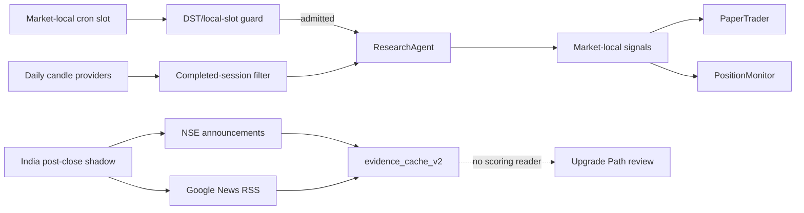

# Pipeline Data and Timing Remediation

Status: SHIPPED
Owner: ResearchAgent and scheduling control plane
Decision: PROJECT_DECISIONS.md Decision 61
Markets: US and India, always isolated

## Implementation verification

- Completed-session filtering is applied after provider normalization and before scoring, return capture, evidence persistence, or trade-plan generation.
- US paired seasonal crons are active in production and every command carries the expected market-local slot. Duplicate seasonal invocations exit before provider or database work.
- India GDELT sentiment is unsupported by the active scorer. The replacement India news/event collector writes shadow-only intents that no decision or money path reads.
- Production migration `20260731210000_market_local_crons_and_india_news_shadow.sql` is applied.
- Verification passed on 2026-07-31: 168 test files passed (1 skipped), 1,466 tests passed (7 skipped), TypeScript passed, and the Next.js production build completed.
- The first production India shadow canary processed 12 symbols, found relevant RSS headlines for 9, wrote 13 append-only provider-call rows and 24 canonical cache rows, and created zero signals and zero paper positions. The run recorded `behavior changed=false`.

## Problem

Three production facts require corrective work:

1. Intraday research can receive a provider's still-forming daily candle. That can make a daily technical score depend on an incomplete session.
2. Fixed UTC US crons preserve UTC, not New York wall-clock time. After a daylight-saving transition, the close monitor can run before the US close and research/trader slots shift by one hour.
3. India news sentiment is nominally applicable but produced 0 available observations in the latest 310 production decisions. GDELT rejects the per-symbol access pattern under its traffic policy, so repeated calls consume time without producing evidence.

Historical replay remains diagnostic-only. Its accepted India run (111 dates, mean IC 0.0125, HAC t 1.32, unstable fold signs) does not authorize a scoring or promotion change.

## Decisions

### 1. Daily scoring uses completed sessions only

ResearchAgent filters normalized daily candles immediately before any score, return capture, trade-plan, or evidence calculation. A candle dated today in the market's local timezone is eligible only after the regular close: 16:00 America/New_York for US and 15:30 Asia/Kolkata for India. Older valid dates remain eligible. Future and malformed dates are rejected.

This boundary belongs after provider normalization, not inside a provider adapter, because quote/chart consumers may legitimately need an intraday bar. It applies identically to every candle provider.

### 2. US schedules are market-local contracts

Each intended US local slot is scheduled at both possible UTC hours. The route admits only the invocation whose New York local `HH:mm` equals the declared slot. The other invocation exits before provider or database work. India remains on fixed UTC because IST has no daylight-saving transition.

Only cron requests carrying `local_slot` are checked. Owner/manual and closed-day catch-up invocations without the parameter preserve their existing behavior. Invalid slot syntax fails closed.

| Flow | Local contract | EDT UTC | EST UTC |
|---|---:|---:|---:|
| US research AM | 09:00 ET | 13:00 | 14:00 |
| US paper entry AM | 11:15 ET | 15:15 | 16:15 |
| US research PM | 14:00 ET | 18:00 | 19:00 |
| US paper entry PM | 15:15 ET | 19:15 | 20:15 |
| US position monitor | 16:15 ET | 20:15 | 21:15 |

### 3. India sentiment is removed from active applicability

Until a replacement is validated, India news sentiment is structurally unavailable rather than repeatedly requested and silently renormalized. India scores continue using only measured dimensions. This changes no weight, threshold, order, or historical signal.

### 4. Replacement evidence is shadow-only

A daily post-close India shadow collects official NSE corporate announcements when its cookie-gated public endpoint is reachable and bounded Google News RSS headlines as an unofficial coverage fallback.

It stores sanitized, source-labelled headline/event evidence in the existing `evidence_cache_v2` and provider-call lineage in `provider_call_ledger`. It introduces no parallel truth table. It computes coverage and provenance only: no directional sentiment score and no LLM.

The shadow prioritizes open paper holdings, then enabled watchlist symbols, and rotates the remaining bounded workload by least-recently-observed symbol. Provider failure is recorded and fail-soft. Text is untrusted data, bounded in length, and never interpolated into a money-path prompt.

The program can be promoted only through a separate decision after enough distinct market sessions demonstrate symbol relevance, freshness, stable coverage, and a deterministic, historically evaluated classifier. Promotion may not reuse the GDELT contract implicitly.

## Data Contracts

Shadow evidence uses these canonical intents:

- `event.corporate_announcement_shadow`, provider `nse_corporate_announcements`
- `sentiment.news_headlines_shadow`, provider `google_news_rss`

Each `evidence_cache_v2` row binds market, symbol, provider, request fingerprint, payload hash, observed/as-of timestamps, expiry, quality state, INR currency, source URL metadata, and bounded provenance. `provider_call_ledger.run_id` begins with `india-news-shadow:` for exact Upgrade Path accounting.

No scorer, ResearchAgent, PaperTrader, PositionMonitor, TraderAgent, LearnerAgent, or broker route may read either shadow intent.

## Flow

## Safety Invariants

- US and India data are never cross-summed or cross-used.
- Partial current-session bars cannot reach daily scoring.
- A duplicate seasonal UTC invocation performs no provider, scoring, position, or order work.
- India shadow evidence cannot affect a score, threshold, signal, trade plan, position, cash balance, proposal, or broker order.
- Unknown news coverage remains unavailable; it is never converted to neutral sentiment.
- Provider text is untrusted, bounded, and non-executable.
- Historical evidence stays offline/diagnostic until a separately approved promotion gate passes.

## Acceptance Gates

- Unit tests cover US summer/winter and India local dates around regular close.
- Unit tests prove current-session candles are stripped before close and retained after close.
- Route tests prove the wrong seasonal UTC invocation exits before its worker runs.
- India `applicableDimensions` excludes sentiment and no active India research path calls GDELT.
- Shadow parser/relevance tests reject malformed, irrelevant, or oversized feed items.
- Upgrade Path shows India-only schedule, coverage, calls, blockers, and next action.
- Repository-wide tests, TypeScript, production build, migration verification, and production cron inspection pass.
- Architecture chapters, schedule reference, agent diagrams, system map, and work log are updated in the same change.

## Non-Goals

- No signal weight or threshold change.
- No automatic historical-data ingestion into scoring.
- No LLM sentiment classifier.
- No options, broker, paper/live order, or position-management change.
- No claim that headline volume predicts direction.
