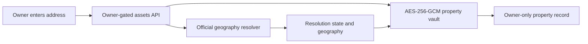

# Property Address And Carrying Costs

Status (2026-08-08): **Implemented.** Address and current carrying-cost fields use the existing encrypted `property_assets.encrypted_payload` contract. The editable-record release adds `property_asset_history` through `20260808180110_property_asset_history.sql`; its history snapshots are encrypted too.

Source capability decision (2026-08-08): see
[`SOURCE_CAPABILITY_AUDIT.md`](SOURCE_CAPABILITY_AUDIT.md) before adding any
parcel, tax, insurance, or property-value automation. In particular, the
Phoenix sales-feed licence remains unverified and no search page, payment page,
or private portal may be automated.

## Decision

Property uses one workspace-wide market context: `US - Austin`, `US - Phoenix`, or `India - Bengaluru`. Every market-aware page inherits it. Currency values remain market-local and USD and INR are never summed.

There are three deliberately separate location contracts:

1. **Explore a market:** ZIP for the US, PIN/locality for Bengaluru. No county or parcel identifier is required from the owner.
2. **Link an owned property:** optional exact address, encrypted at rest and never exposed to an LLM. The owner-gated server may resolve non-sensitive geography through an approved official service.
3. **Link parcel evidence:** background-only and source-specific. A parcel identifier is never an owner-facing navigation concept and no parcel match is claimed until a verified resolver returns one.

## Address Flow

For US addresses the resolver is the Census Geocoding Services API. It can return standardized address, ZIP, county name, and county GEOID. It does **not** establish parcel identity. No raw address appears in logs, URL paths, plaintext database columns, analytics, or LLM prompts. Resolver failure saves an honest `no_match`, `ambiguous`, or `unavailable` state rather than inventing a location.

Bengaluru stores owner-entered address/locality/PIN encrypted but has no automated parcel resolver in this phase.

## Carrying-Cost Contract

The monthly total is deterministic:

`principal and interest + annual tax / 12 + annual insurance / 12 + annual maintenance / 12 + HOA + other monthly costs`

Mortgage principal and interest reuses `calculateMortgage()` from the shared property scenario engine. Tax, insurance, and maintenance are owner-entered and must be labelled by provenance: tax bill/estimate, insurer quote/policy, or planning assumption. A ZIP average may inform a scenario but must never be displayed as the exact cost of an owned property.

## Charts

Historical market charts use: `1M`, `6M`, `YTD`, `1Y`, `5Y`, `10Y`, `20Y`, `All`. A range with no official observations renders an honest empty state. Scenario, amortization, and forecast-horizon charts keep their domain-specific horizon controls; applying calendar history filters to them would be misleading.

## Safety And Acceptance

- Market selection persists locally and is shared by Markets, My Properties, Opportunities, Financing, Forecasts, and Valuation Evidence.
- Switching markets never converts or cross-sums currencies.
- API payload size, text length, and numeric ranges are bounded before encryption.
- Exact address and costs remain inside the existing owner-only encrypted vault.
- A geocoder outage does not prevent saving the private record and does not fabricate resolution.
- Austin no longer asks the owner for a TCAD property ID; Phoenix bulk collection remains ZIP-scoped.
- Property workflows remain isolated from investing scores, agents, orders, and strategy promotion.

## Editable Records And Owner History (2026-08-08)

The current `property_assets` row is editable owner state. Every create or save
also writes one encrypted, append-only `property_asset_history` snapshot through
an atomic service-role RPC. The history contains the valuation, loan, and
carrying-cost inputs needed to reproduce the chart point, but deliberately does
not duplicate the exact address.

An owner can choose the snapshot's effective date, including a prior date, but
cannot select a future date. The chart renders the recorded value, derived
equity, and derived monthly carrying cost in the asset's own currency. It never
cross-sums USD and INR.

Records are archived rather than deleted. The history foreign key uses
`ON DELETE RESTRICT`, history mutations and truncation are rejected by database
triggers, and table/function access is service-role-only. Existing records begin
their history at their next save because their current encrypted payload cannot
be truthfully backfilled by SQL.

## Official References

- US Census Geocoding Services API: https://geocoding.geo.census.gov/geocoder/Geocoding_Services_API.html
- Maricopa Assessor address and parcel search: https://www.mcassessor.maricopa.gov/page/home/help/searching/
- Travis Central Appraisal District property search: https://traviscad.org/propertysearch/
