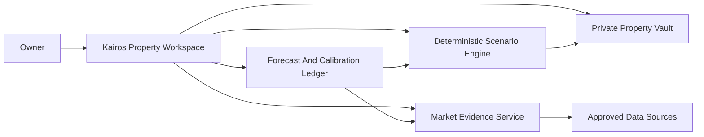

# Kairos Property Decision Workspace

Status (2026-08-07): **P0–P4 schema applied to production and verified.**
Collection is live for the US markets (FHFA HPI, FRED MORTGAGE30US, BLS LAUS) on
a weekly cron; Opportunities, Financing and Forecasts persist through owner-gated
encrypted APIs. Still NOT done: `PROPERTY_DATA_ENCRYPTION_KEY` in Vercel, any
visual/Playwright verification, production smoke tests, My Properties/Imports,
and every India source. No property valuation, lender integration, or automated
transaction is authorized or enabled. See `IMPLEMENTATION_RESULT.md` for the
verified findings list and the honest deferral list.

Initial market packs: Austin Central Texas, Phoenix Metro Arizona, and Bengaluru
Karnataka. They are independent markets, never a blended property universe.

## Product Boundary

Kairos Property is a top-level workspace for personal property, market, and
financing decision support. It shares Kairos ownership, authentication, source
provenance, system health, and forecast-calibration discipline. It has separate
tables, APIs, schedules, privacy controls, and decision logic from Investing.

It answers four auditable questions:

1. Is a market improving, cooling, or uncertain relative to its own history?
2. Does buying, selling, holding, renting, refinancing, or using a HELOC make
   sense under stated assumptions and downside cases?
3. Which user-selected locations meet a declared screening rule?
4. How accurate have earlier Kairos forecasts been by market and horizon?

It never claims to know the exact right time, an exact property price, or lender
approval.

## Workspace UX

The persistent application header contains:

`Kairos | Investing | Property`

The selected workspace changes the entire left navigation. Investing retains its
US/India market selector. Property has a distinct location context such as
`United States / Austin Metro` or `India / Bengaluru`.

Property navigation:

| Area | Purpose |
|---|---|
| Overview | Market pulse, source freshness, alerts, tracked decisions. |
| Market Explorer | Country, state, metro, ZIP, locality, and type trends. |
| My Properties | Owner-entered homes, land, and rentals. |
| Opportunities | Buy, sell, rent, and land scenarios. |
| Financing | Mortgage, refinance, HELOC, and loan-against-property scenarios. |
| Forecasts and Learning | Forecasts, actuals, calibration, and confidence. |
| Data Sources | Source definitions, freshness, coverage, licenses, and health. |

`Opportunities` is a private decision notebook, never a broker-connected listing
or purchase workflow. The Property workspace must not import trading agents,
paper positions, broker clients, portfolio cash, strategy champions, or stock
scores.

## System Context

LLMs may summarize completed, cited scenario outputs. They may not see full
addresses or loan documents, calculate financial outputs, select a data source,
make an unlogged forecast, or trigger a transaction.

## Market Packs

### Austin Central Texas

Scope: Austin Metro, Travis County, and an owner-managed ZIP watchlist.

- FHFA HPI: repeat-sales price trend at available metro/county/ZIP levels.
- Redfin Data Center: inventory, new/pending listings, days on market, price
  cuts, cancellation/delisting, and sale-to-list trends.
- FRED/Freddie Mac: national mortgage-rate context.
- Census ACS, BLS, HUD FMR: income, employment, and rental reference ranges.
- Travis County/TCAD official parcel fields where a field/license audit permits.
- User-provided MLS exports, lender quotes, tax notices, insurance quotes, rent
  rolls, and comparable-sales evidence for property-level decisions.

Texas assessment is always labelled `assessment`, not market value or sold price.
It cannot substitute for closed-sale comparables.

### Phoenix Metro Arizona

Scope: Phoenix Metro and an owner-managed ZIP watchlist. Use FHFA, Redfin,
FRED, Census, BLS, and HUD source families. Maricopa County official parcel/tax
data is a future adapter only after an explicit field, license, and rate-limit
audit. No national series may masquerade as an individual-property valuation.

### Bengaluru Karnataka

Scope: Bengaluru plus an owner-managed locality registry. The canonical local
unit is locality, with optional PIN/ward/taluk; a US ZIP model is not reused.

- NHB RESIDEX housing, land, and rental indices when its published coverage and
  segment identify an applicable Bengaluru geography.
- RBI quarterly Bengaluru HPI as an independent city-level reference.
- RBI macro/policy rate context for financing conditions.
- Bhoomi, Kaveri, and BBMP only for owner-directed title, land-record,
  guidance-value, or tax-document review.
- Owner-imported broker comps, loan offers, leases, and registration evidence.

Guidance value is statutory/reference context, never a promised sale value.
Automated scraping of Indian property portals is forbidden.

## Evidence Collection Policy

### Source priority

1. Official API/download with a documented metric definition.
2. Licensed data expressly permitting intended use.
3. Owner upload with source, date, geography, and document type.
4. Bounded official/public-policy page capture with URL and content hash.
5. Narrative news as explanation-only context.

Firecrawl/browser automation may only fetch a permitted official/public-policy
page with no structured endpoint. It is not a listing crawler, comparable-sales
source, rent feed, or property-search engine. Zillow, Realtor, Redfin listing
pages, MLS portals, Magicbricks, Housing, and similar sites remain excluded
unless a future written license explicitly permits the exact use.

### Cadence and bounds

| Source class | Austin | Phoenix | Bengaluru | Retention |
|---|---|---|---|---|
| Mortgage and macro | weekly | weekly | monthly or policy event | normalized observations |
| Listing market conditions | weekly metro and monthly ZIP | weekly metro and monthly ZIP | unavailable by default | source hash per release |
| Official price rent land index | monthly or quarterly | monthly or quarterly | quarterly | all released values |
| Parcel/tax context | monthly/on request | monthly/on request | owner request only | selected fields only |
| Owner comps and quotes | on import | on import | on import | encrypted per owner policy |

There is no daily nationwide ZIP crawl. `property_geography_registry` contains
the initial metros and owner-selected ZIPs/localities. A monthly coverage job can
recommend a new geography only when adequate published data exists and a declared
owner rule requests it.

Every metric records source, source version/hash, geography, property segment,
native unit, `as_of`, `published_at`, `collected_at`, revision state, and
availability. Missing data is `unavailable`, never zero or neutral.

## Data Model And Privacy

All tables use a `property_` prefix and owner-only RLS. Service-role writes are
limited to approved collection workers.

| Record | Purpose |
|---|---|
| `property_geographies` | country hierarchy, ZIP/PIN/locality, geometry reference, currency. |
| `property_market_observations` | immutable normalized market time series. |
| `property_source_runs` | source health, calls, costs, rows, and errors. |
| `property_assets` | encrypted address/documents and owner asset metadata. |
| `property_financing_accounts` | encrypted loan terms, balances, rates, and payments. |
| `property_scenarios` | immutable versioned buy/sell/rent/finance calculations. |
| `property_forecasts` | declared forecast, horizon, cutoff, range, and model version. |
| `property_forecast_outcomes` | matured actuals and calibration metrics. |
| `property_decision_journal` | recommendation state, evidence references, and owner action. |

Full addresses, loan balances, credit data, documents, account numbers, and
lender quotes are encrypted before persistence. Logs use property ID and coarse
geography only. Full-address enrichment needs explicit per-request owner consent
and an allowlisted provider; default calls use a derived ZIP/locality/CBSA.

## Decision Engines

### Market regime

The descriptive regime uses only market-local data: price momentum/deceleration,
inventory and listing-pending balance, days on market, sale-to-list, price-cut/
cancellation/delisting pressure, affordability shock, employment/income, and
rent-to-price data only when both measures share compatible geography/period.

Allowed output: `tight`, `balanced`, `buyer_favoring`, `cooling`, or
`data_insufficient`, always with visible drivers and missing inputs. It must not
call cooling a recession or invent a severe-drop probability before a validated
forecast program exists.

### Financing

US supports purchase mortgage, refinance, and HELOC. Bengaluru supports
home-loan and loan-against-property scenarios; it must not display HELOC as an
Indian product.

Required outputs: amortization, interest, payment stress, LTV/CLTV when an owner
valuation exists, refinance NPV/break-even/fee sensitivity, HELOC index-margin
rate shocks and liquidity impact, and lender-quote comparison. Benchmark rates
are context only, not offers. The engine returns `actionable`, `watch`,
`not_economic_under_assumptions`, or `insufficient_inputs`.

### Buy sell rent and land

Every scenario exposes its inputs: price, down payment, financing, tax,
insurance, HOA, maintenance, vacancy, management, rent, renovation, closing
costs, holding period, selling cost, and exit-price range. Outputs are cash
flow, cap rate, cash-on-cash, DSCR, equity, debt paydown, IRR range, sensitivity,
and break-even sale price. Land is a distinct type with no rental-yield default.

## Forecasting And Learning

Forecasting is a market-local shadow. Initial targets are index change, rent
index change, and mortgage-rate range, never individual parcel/home value.

Each forecast records input fingerprints, data cutoff, geography, property type,
unit, horizon, model version, baseline/bear/base/bull range, confidence, and
known coverage gaps. Outcome maturity attaches actual values and error metrics.

The initial baseline is latest level/trend plus a transparent uncertainty range.
A complex model may enter an advisory state only after it beats that baseline in
sealed time-ordered replay and forward shadow for the exact market and horizon.
Learning can lower confidence or retire a model; it cannot automatically make a
recommendation more aggressive.

## Chart Specification

1. Indexed price trend: country/state/metro/ZIP/locality, latest observation
   date and lag shown per series.
2. Supply demand: active/new/pending listings, months supply, days on market.
3. Price behavior: sale-to-list, price cuts, cancellations, delistings/relistings.
4. Affordability: mortgage rate, representative payment, income and rent burden.
5. Rental economics: rent trend, rent-to-price, yield, and input confidence.
6. Market pressure: visible drivers and data coverage, not a decorative score.
7. Forecast fan chart: bear/base/bull range, actuals, and calibration history.
8. Property detail: amortization, refinance/HELOC break-even, cash-flow
   waterfall, and downside sensitivity.

Every chart presents source, definition, geography, unit, as-of date, revision,
and unavailable reason. It must not place incomparable assessments, listing
prices, transaction indices, and median prices on one unlabeled axis.

## Source Manifest

| Source | Permitted initial use | Explicit limitation |
|---|---|---|
| FHFA HPI | US repeat-sales price-trend context by published geography | Not a parcel valuation or live comparable feed. |
| Redfin Data Center | Published market-condition downloads and methodology-defined aggregates | No listing-page crawling or assumed resale rights. |
| Freddie Mac via FRED | Weekly national mortgage-rate context | Not an individual lender offer or HELOC quote. |
| Census ACS, BLS, HUD FMR | Area income, employment, and rent-reference context | FMR/ACS are not current property rent comps. |
| Travis/Maricopa official records | Geography, parcel, assessment, and tax context after adapter audit | Assessment is not sale price; field availability varies. |
| NHB RESIDEX and RBI HPI | Bengaluru/India published price, land, rent, and macro trend context | Quarterly/city-level observations are not locality property valuations. |
| Karnataka government records | Owner-directed land/title/guidance/tax reference | No automated title conclusion or market-value assertion. |
| Owner uploads | MLS comps, loan offers, rent rolls, tax/insurance documents | Provenance and encryption are mandatory. |

The source implementation record must preserve the official URL, terms/permission
review date, metric dictionary, schedule, expected geography/segment coverage,
rate limit, and fallback behavior. A source may not become active solely because
it is easy to crawl.

## Security And Safety

- No Property route/table/worker imports broker, paper-trade, portfolio-cash,
  score, execution, or Investing agent modules.
- Property data never appears in LLM prompts, generic analytics, or logs.
- No scraping behind logins, CAPTCHAs, robots exclusions, terms, or MLS controls.
- No lending, appraisal, title, tax, legal, or real-estate-agent claim.
- Every recommendation links to a versioned scenario and evidence set.
- Owner export/delete removes Property data without touching Investing evidence.

## Delivery Plan

| Phase | Build | Influence |
|---|---|---|
| P0 | workspace shell, geography registry, source catalogue, source-run health | display only |
| P1 | Austin, Phoenix, Bengaluru market packs and comparable charts | display/alerts only |
| P2 | private vault and deterministic scenario/finance calculators | owner decision support |
| P3 | comp/quote imports and decision journal | owner decision support |
| P4 | forecast ledger, replay, and forward calibration | shadow only |
| P5 | evidence-qualified market/financing recommendation states | advisory only |

## Acceptance Criteria

1. Workspace switch makes Property and Investing unmistakable.
2. Each metric exposes source, geography, as-of date, unit, freshness, and state.
3. Austin, Phoenix, and Bengaluru never cross-sum or share unqualified metrics.
4. Collection is bounded, idempotent, quota-accounted, and never crawls forbidden
   listing sites.
5. Full address and finance data never reach LLMs, analytics, or logs.
6. Forecasts cannot become recommendations before exact-market calibration.
7. Property cannot affect securities research, trading, brokers, or execution.
