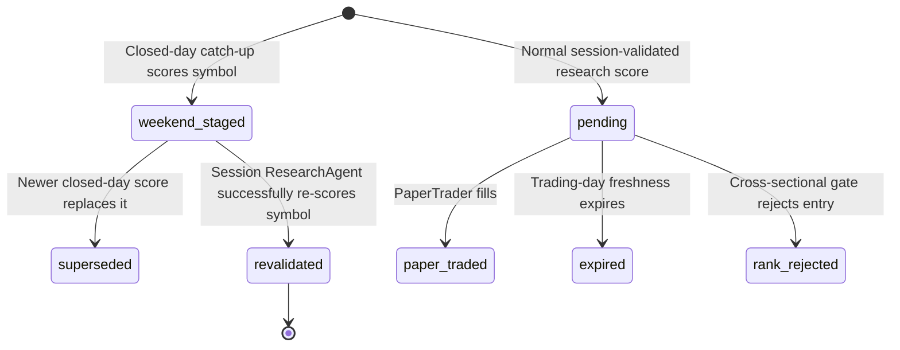

# Market-Closed-Day Research Catch-up and Agent Capacity

Status: APPROVED by owner on 2026-07-19 ("do it"; holiday extension approved with "ok")

## Problem

The US and India research queues can contain more symbols than one market-session
ResearchAgent run can finish. Provider quotas reset on weekends and full exchange
holidays, but warming alone does not finish scoring, write a safely reusable
staged result, or reduce the next-session scoring workload.
The app also does not show queue depth, throughput, or estimated time to clear.

## Decision

Use market-closed-day quota for full deterministic research catch-up, but make
every result non-executable until the same market completes a fresh session
revalidation. Keep paper and live trading session-only. Display honest backlog
and capacity telemetry for queue-backed and workload-backed agents.

## Signal State Machine

`weekend_staged` is retained as the legacy database status name. Its semantic
meaning is now any supported full market-closure day. Every such row has
`session_validated=false` and an
`as_of_session` equal to the last completed market session. A normal weekday
score has `session_validated=true`. A successful weekday score marks older
staged rows for that market/symbol `revalidated`; the newly inserted `pending`
row is the only entry candidate.

## Downstream Behavior

- **PaperTrader:** positive allowlist requires `pending`,
  `deterministic_v1`, and `session_validated=true`. It never fills staged rows.
- **TraderAgent/live proposals:** same positive allowlist. It never creates a
  proposal from a staged row.
- **AutonomousShadow / AutonomousLive:** their direct recent-signal queries also
  require `session_validated=true`; weekday scheduling and the 24-hour lookback
  are not treated as sufficient proof.
- **PositionMonitor:** mechanical price stops, targets, trailing stops, and time
  stops remain independent. Score/direction exits may only read
  `session_validated=true` signals; staged scores cannot force a sale.
- **LearnerAgent:** staged rows remain measurement evidence, but cannot become
  filled-trade outcomes. Existing observation-ledger rules remain unchanged.
- **ResearchAgent weekday run:** holdings remain first-class and cap-exempt. A
  successful re-score produces the fresh decision for that session. A failure
  leaves the staged row informational only.
- **CapitalRotation:** latest-score lookup requires session validation, so a
  staged score cannot change weakest-holding selection or a rotation edge.

## Closed-Day Scheduling

Schedule one bounded catch-up trigger per market every day after that market's
prewarm window. A shared exchange-local calendar permits work only on weekends
or verified full equity-market holidays. Normal trading days self-skip. An
unsupported calendar year and special sessions such as NSE Muhurat Trading both
abstain. An unsupported year opens one deduplicated System Health warning until
the annual calendar is installed. The route uses the existing research wall-clock budget, provider pacing,
candidate cap, per-market scope, and idempotency guard. It does not chain
PaperTrader or TraderAgent.

The 2026 US calendar is sourced from NYSE. The 2026 India calendar is sourced
from NSE Capital Market circular CMTR71775 plus amendment CMTR72260. Settlement,
currency, debt, and commodity holiday lists are not interchangeable with the
equity-market calendar. Early-close days are trading days, not catch-up days.

Closed-day candidate scores are retained in `research_queue` for next-session
revalidation. Held symbols do not need queue retention because holdings are
always gathered. Repeated closed-day runs supersede the prior staged row rather
than creating multiple active staged decisions.

## Data Model

Add to `agent_signals`:

- `session_validated boolean not null default true`
- `as_of_session date null`
- `staged_at timestamptz null`
- CHECK: `status='weekend_staged'` implies `session_validated=false`
- one active `weekend_staged` row per `(market,symbol)`

No order, position, portfolio, or broker schema changes.

## Agent Capacity View

The Agents dashboard gets a **Capacity** tab, scoped by the global market
switcher. Each row declares its workload type so a workload is not mislabeled as
a durable queue:

- ResearchAgent: `research_queue` depth, oldest age, staged count, recent median
  successful throughput/day, and estimated clearing days.
- PaperTrader: fresh validated pending longs; configured per-run selection cap.
- PositionMonitor: currently open paper positions; all are expected per run.
- LearnerAgent: report unavailable when a defensible queue cannot be derived;
  never fabricate a backlog.

Capacity uses the median of recent completed per-market runs where possible.
Environment caps are shown as configured ceilings, not achieved throughput.
`estimated_days = ceil(backlog / max(1, observed_daily_capacity))`; null is shown
when no defensible estimate exists.

## Failure Rules

- Missing migration makes the new positive eligibility query return no entry
  candidates (fail closed).
- Closed-day scoring failure re-defers the symbol and writes the normal run error.
- Queue telemetry failure shows unavailable; it never blocks any agent.
- A staged row can never be mutated into `pending`; revalidation writes a fresh
  row, preserving point-in-time history.
- US and India remain fully separate. No queue, throughput, score, or estimate is
  cross-summed.

## Acceptance Criteria

1. Weekend and verified full-holiday catch-up writes `weekend_staged` signals and no trade/proposal.
2. PaperTrader and TraderAgent reject staged/unvalidated signals even at score 100.
3. PositionMonitor ignores staged scores for score/direction exits.
4. Next-session success writes a new validated signal and closes prior staged state.
5. Failed session revalidation cannot make the staged result executable.
6. Closed-day candidate remains queued for session revalidation without increasing
   its failed-attempt count.
7. Capacity UI is market-scoped and labels queue versus workload honestly.
8. Existing weekday research-to-paper flow remains unchanged for validated rows.

## Disable / Rollback

Unschedule the two closed-day catch-up crons. Existing staged rows remain inert and
may be marked `superseded`. The additive columns can stay; their defaults preserve
the pre-feature weekday behavior.
